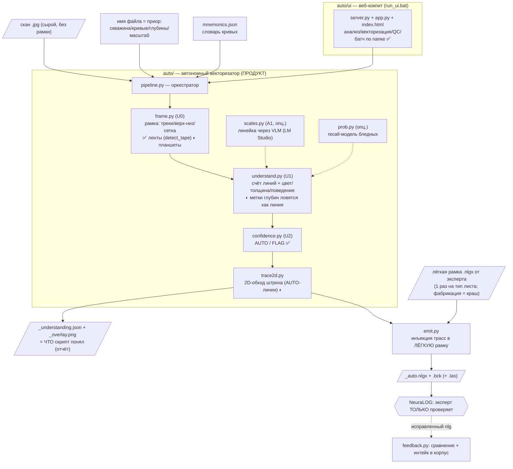
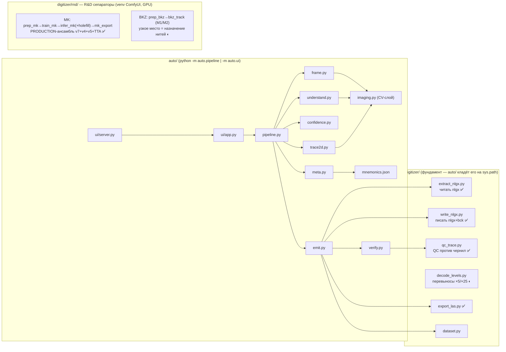

# 🗺️ Карта проекта CarrotageAuto (живой документ)

> **Правило:** этот файл обновляется в КАЖДОЙ сессии разработки — меняются статусы (✅/◐/✗),
> добавляются строки в «Журнал прогресса». Смотри его на GitHub — диаграммы рендерятся сами.
> Курс и гейты: [ROADMAP_v2.md](ROADMAP_v2.md) (§8а — статус, §4 — стадии). История: [PLAN_new_dialog.md](PLAN_new_dialog.md).

Обозначения: ✅ работает (прошло гейт) · ◐ частично / в работе · ✗ не работает / не начато · 🗄 архив (мёртвое)

---

## 1. Общий поток данных (что из чего получается)

## 2. Кто кого вызывает (внутри репо)

**Слои, одним предложением каждый:** `auto/` — сам анализирует сырой скан и векторизует;
`digitizer/` — расшифрованный формат nlgx + QC + LAS (этим пользуются все);
`digitizer/rnd/` — обучаемые разделители слипшихся кривых (MK готов, BKZ в работе);
`archive/` — мёртвое (Win32-кликер NeuraLOG и пр.), не трогаем.

---

## 3. Таблица статусов (обновлять каждую сессию)

| Модуль | Роль | Статус | Последний гейт / замер |
|---|---|---|---|
| `auto/meta.py` | имя файла + мнемоники → приор «ЧТО» | ✅ | тесты pure PASS |
| `auto/frame.py` U0 ленты | перфолента: перфорация→трек, отрез шапки, px/м-приор | ✅ | 09.07: Semeguniv 22/22 + Yatskivska MK; px/м 29-33 (1:200), 11-12 (1:500) |
| `auto/frame.py` U0 планшеты | рамка по вертикалям/сетке | ◐ | сетка-бумага без тёмных граней → фолбэк «весь лист» (durable §6.6.9) |
| `auto/frame.py` U0 detect_tape | распознавание перфоленты | ✅ | 10.07 (ночь-2): **src=tape 22/22**. +3-й триггер ДРЕЙФ (BK_190: не «сплошь-тёмный», а КОСОЙ скан — край плывёт ±170px/30000 строк; слэб-детект с достройкой односторонних известной шириной, `apply_row_shift` выпрямляет, pipeline применяет row_shift, оверлей прямой ✓); tol краевой зоны W//25 (BKZ_3080: перфозона в 27 кол. от кромки → perf✓) |
| `auto/understand.py` U1 | счёт линий + свойства | ◐ | 10.07 (позже): **G2 15/22** (было ~5). Три правила: (1) фильтр оси+меток — ключ ПРЯМИЗНА штрихов x-std≤1px (только чёрный, слева, cov<0.4; на уровне ГРУПП, до слияний); (2) merge ДРЕЙФА (сплит легален лишь при конкуренции за строки); (3) **одна-кривая по мультипликативности §6.6.11** (штрихи цвета не сосуществуют в строках ⇒ сплит нелегален; BK_4020 5→1, RK 11→2, эталонные BKZ_3530 ровно 3/3 ✓✓). Планшеты: BKZ_1030_D2 22→15 при эталоне 4 — движение к правде. Остаток → §5 п.2. 10.07 (ночь-2): **G2 16/22** — линовка-фильтр по ДЕТРЕНДУ (DS_3280 ✓); виз. GT: MK_1380_D1=3 ВЕРНО, STK_4020=5 похоже верно → фактич. ~18/22 |
| `auto/confidence.py` U2 | AUTO/FLAG | ✅ | pure-тесты + честные FLAG на батче |
| `auto/trace2d.py` | 2D-обход штриха | ◐ | 10.07 baseline (68 AUTO-трасс, ленты): d_med≤0.5px у ВСЕХ (метрика «≤2px» тривиальна — трасса идёт по ранам); честный сигнал = СПАЙКИ/1000 строк: одиночные 0-3 ✓, слипшиеся MK_1380 370-781 шт (перескоки, d-метрика их не видит) → **G3**-гейт: d_med≤2 И spikes/1000≤5 на одиночных — ПРОЙДЕН; пучки ждут POLISH/сепараторы |
| `digitizer/decode_levels.py` 5х | уровни-перевыносы из трассы | ◐→✅ | 12.07 калибровка на GT Эдуарда (BK/STK эксперт-векторизация): на ЧИСТОЙ трассе DP=0.99 Archive, PZ 1.0/GZ 0.90; сдаваемо (наша трасса+DP): SP/SP2 **1.0**, GZ 0.87, PZ 0.82, BK 0.71. BK — смена масштаба по СОГЛАШЕНИЮ записи (не по упору), геометрией не берётся (нужна OCR шапки). Параметры level_bias/rail_gate/down_mult/demote — off по умолчанию (конфликтуют между кривыми) |
| `auto/refine.py` | верификатор + деспайк + refine-петля | ✅ | 12.07: Hampel-деспайк (0 спайков STK/BK), refine_trace (недотяг→band до трека, BK 505→594), верификатор целит в ошибки (dx@спайк 149 vs 28px, Archive 542 скана) |
| `auto/trace_seq.py` + `auto/models/` | ОБУЧЕННЫЙ оконный селектор ранов (CNN по патчу ±64 строки) вместо жадного выбора | ✅ вкл. по умолчанию 26.07 | **§6.71, ЧИСТЫЙ замер**: 60 листов вне обучающей выборки, обе стороны собраны ОДНИМ кодом → **48 → 63 честных кривых (+31%)**, 10 листов вверх / 1 вниз. ⚠ Прежние «+55%/+85%» (§6.66/§6.69) недействительны: там сравнивались кэши разного кода и с отключённым отбором K из N — из +33 на селектор пришлось +15, на правки прода +18. Вес `seq_model_d45p.pt` (359 КБ, sha256 `53330df3…`) под контролем версий; дрейф прод-копии от обучающего источника ловит `selftest()` (в `run_pure.py`, 6/6 мутаций). Без torch прод работает жадным выбором и ГРОМКО об этом сообщает |
| `auto/scales.py` A1 | счёт уровней линейки (VLM) | ◐ | опц., LM Studio; на лентах не проверен |
| `auto/prob.py` | recall-модель бледных | ◐ | recall 21→84% на выцветших; в батче НЕ подключена |
| `auto/emit.py` | nlgx+bck (+las) через лёгкую рамку | ✅ ленты | 11.07: **G4 + 5х-перевыносы**. BK_4020 → BK1 **QC 100**; STK_4020 → PZ1(98)/SP1(82)/SP21-оранж(98), 3 кривые (GZ бледная→faint). **`_level_segments`: decode_levels встроен в emit** — когда каркас несёт 5х-цепочку (base→next, как Archive BKZ), НАША авто-трасса раскладывается на уровни (Archive IKA/IKR → уровни [0,1] из авто-трейса ✓); одношкальный каркас → 1 сегмент (BK/STK корректно без регресса). Каркас STK без слота PZ — исправлен копией (SA1 'SP1'→'PZ1', тег-правка round-trip ✓) |
| `auto/verify.py`, `qc_trace` | QC против изображения | ✅ | позвоночник «эксперт только проверяет» |
| `auto/refine.py` | НЕЗАВИСИМЫЙ верификатор+доводчик линии | ◐ | 12.07: Hampel-деспайк (SP1 15→2 спайка, SP21 7→0), enforce_min_run (GZ 17→0, BK 6→0 коротких), decode_rail (5х по упору в рельс, 1х по умолч.), verify_line score. Встроен в trace_auto/emit. Осталось: петля перетрассировки проблемных зон (G-refine) |
| `auto/ui` | веб-кокпит + батч по папке | ✅ | 09.07: батч 22 сканов через сам UI, таблица+оверлеи |
| `digitizer/extract_nlgx, write_nlgx` | формат nlgx | ✅ | round-trip, открывается в NeuraLOG |
| `digitizer/decode_levels.py` | перевыносы (уровни ×5/×25) | ◐ | одиночный оборот corr 0.916; мульти-оборот нет |
| `digitizer/export_las.py` | nlgx → LAS | ✅ | log_corr 0.97 |
| `digitizer/pipeline.py + digitize_b3` | ШАБЛОННЫЙ путь (снап к экспертной трассе) | 🗄→◐ | НЕ продукт (депрекейт); держим для регрессии; **кандидат в POLISH** (сглаживать НАШУ трассу, см. §5) |
| `digitizer/rnd/` MK-сепаратор | слипшиеся MGZ/MPZ | ✅ | production-ансамбль; правило QC 03.07: перескоки хуже px |
| `digitizer/rnd/` BKZ-сепаратор | 5 слипшихся GZ | ◐ | M2 joint DP испытан; узкое место = назначение |
| `digitizer/` legacy U-Net (unet/train/infer/track_multi/digitize.py) | бинарная маска как разделитель | 🗄 | закрыт: блобит, идентичность не различает (§6.6.10) |
| `archive/neuralog_ui/` | Win32-кликер NeuraLOG, блок-2 | 🗄 | заменено прямой записью nlgx |

---

## 4. Журнал прогресса (добавлять строку за сессию)

> ⚠⚠ **ХЕНДОФФ 26.07 — ТРИ ЛОВУШКИ ЗАМЕРА, ВСКРЫТЫЕ ПОДРЯД** (ROADMAP §6.69-§6.71). Все три
> нашлись только потому, что замер §6.66 воспроизводился с нуля, и каждая по отдельности
> переворачивала вывод:
> 1. **§6.69 — потолок вместо прод-пути.** Цифры §6.66 воспроизводятся лишь при `--picks oracle`,
>    то есть с ОТКЛЮЧЁННЫМ отбором K из N, который сам стенд помечает «в прод не годится».
> 2. **§6.70 — пересечение с обучением.** Проверять пересечение надо с ФАКТИЧЕСКОЙ выборкой
>    (25 листов, `seq_data_d45p.log:1`), а не с пулом `train_sheets(limit)`: подстановка большого
>    limit вернула весь архив и завысила пересечение с 25 листов до 59.
> 3. **§6.71 — кэши разного кода.** Жадные кэши собраны 24.07, селекторные 25-26.07, между ними в
>    прод легли §6.52/§6.58/§6.65. Больше половины «выигрыша модели» оказалось правками прода.
>
> **ЧТО ТЕПЕРЬ ЗАЩИЩАЕТ:** `_pick_gate.build_stamp()` пишет в каждый pkl отпечаток (коммит, dirty,
> дата, режим, `prod_sha` восьми прод-файлов), `check_stamps()` ругается при расхождении;
> `build()` пиннит `cfg.cv.seq_model = ""`, чтобы стенд не наследовал прод-умолчания.
> ⚠ **ПРАВИЛО:** сравнивать можно только кэши с одним `prod_sha`; ноль различий между режимами —
> это «проверь, что сравниваешь», а не «эффекта нет».

> ⭐ **ХЕНДОФФ Трек 4 (12.07):** значения линии — 5х-уровни + качество трассы. `auto/refine.py`
> (верификатор+деспайк+refine-петля), `decode_levels` калиброван на GT Эдуарда: сдаваемо SP/SP2 1.0,
> GZ 0.87, PZ 0.82, BK 0.71. BK=предел геометрии (смена масштаба по глубине → нужна OCR шапки).
> Инструменты: `digitizer/rnd/_calib_verifier.py` (542 скана), `_tune_levels.py`. Детали — память
> `track4-levels-verifier-handoff` + `track4-verifier-facts`. Открытые развилки: OCR шапки для BK-типа;
> поднять PZ/GZ 0.85→1.0 доводкой трассы; ещё GT-эталонов.

| Дата | Что изменилось | Вердикт |
|---|---|---|
| 2026-07-17 | **Трек 4 ×1/×5-сепаратор → траектория-декод MBK.** Диагностика (Archive 78 BK/82 MBK): барьер = ТОЛЬКО MBK (DP 0.538; BK 0.862 оборачивается чисто). Уровень MBK НЕ из значения и НЕ две линии (одна хлещущая линия) ⇒ 2-канальный U-Net мисматч. Траектория-декод (DP + IMAGE off-scale rail-детект + sticky): `digitizer/decode_img_mbk.py`, вшит scoped-MBK в `auto/emit.py::_level_segments` (fallback DP без картинки). | **★ РЕФРЕЙМ: level-acc ложный прокси.** Против РЕАЛЬНОГО LAS (value-фиделити corr_log): GT-эксперт 0.844, DP 0.418, decode_img 0.446 — level-acc 0.595 почти не двигает value. Автономный потолок ≈0.47 (все внешние сигналы провалились на ×5/×25: image 42% слеп, сосед не делит ×5/×25, шапка=лестница). Остаток=QC эксперта. Pure PASS. НЕ закоммичено |
| 2026-07-09 | Аудит: легаси→archive/; U0 tape-mode (перфоленты); UI-батч по сырой папке; карта проекта | ленты калибруются; следующее узкое место — U1 счёт линий (G2) |
| 2026-07-10 | Батч-замер G2 на 22 лентах Semeguniv_001; **фикс `frame.detect_tape`** (запасной триггер «двусторонние тёмные края + светлая середина», perf_confirmed): src=tape 20/22 (было 15). Восстановлен обрезанный (коллизия с Code) хвост `detect_frame`. **Сверка с эталоном nlgx: BKZ = 4 трассы (не 5!)** — «ожидание из имени» наивно, мерить по nlgx. | G2-гейт упирается в U1: переразбиение одной пиковой кривой (BK_4020: 1→5), цветная линовка str=1 cov0.99 (STK_4020: 14), фильтр меток переедает кривые (MK_190: 2→0). Осталось src=None: BK_190 (сплошь-тёмный скан), BKZ_3080 (край с одной стороны). |
| 2026-07-10 (3) | **G2 16/22, src=tape 22/22** (утром 15/22 и 20/22). (а) frame: 3-й триггер ленты — ДРЕЙФ (BK_190 косой скан: слэб-детект, `apply_row_shift`, оверлей прямой ✓); tol краевой зоны W//25 → BKZ_3080_D1 perf✓. (б) understand: линовка-фильтр по ДЕТРЕНДУ (окно 151: линовка 0.34-0.36 ↔ ось-метки 2.66 ↔ кривая ≥4; сырой x-std мёртв — линовка ДРЕЙФУЕТ с перекосом, 1.59 ≈ выцветшая 1.8) → DS_3280 1/1 ✓, порог ruler_max_detr=0.8 при cov≥0.9. (в) Виз. сверка кропами: MK_1380_D1=3 ВЕРНО (третья красная есть), STK_4020=5 похоже верно («1-й/2-й замер», ≥5 кривых), STK_3280 misnamed (на скане 4100-4120). (г) На диске найдены ОБРЕЗАННЫЕ understand/config/ui-server (SyntaxError, оборванная запись) — восстановлены из git HEAD без потери работы; после правок проверять ast.parse + коммитить сразу. | Формальный гейт 16/22, фактически ~18/22. Остаток = данные, не код: 2 misnamed файла, наборы кривых STK/MK — вопросы Эдуарду (output/G2_batch_report.md). Код-долг: у STK_3280 span данных 256 строк — мульти-кривые ломают «1..6 ранов» в _tape_data_span |
| 2026-07-10 (2) | **U1 G2-доводка: 12/22** (гейт: got==exp, BKZ 3..6). (а) фильтр оси+меток: ключ = прямизна штрихов x-std≤1px + только чёрный + слева + cov<0.4 (BK_2410 ✓, MK_190 восстановлен 2/2 ✓); (б) merge дрейфа: сплит легален лишь при конкуренции за строки, иначе куски одной кривой склеиваются (BKZ_3690 D1/D2 → 6/6 ✓); (в) гейт-колонка «линий/ожид + G2-бейдж» в UI-батч (проверено вживую через сам UI). Регрессия планшетов (Pn_Zavoda×3 + Yatskivska MK): чисто, pure-тесты PASS. **Провалы-ресерч (НЕ возвращаться):** покрытие строк и периодичность y НЕ разделяют метки vs выцветшую кривую у края (обе ~cov 0.1-0.2, MAD/med 0.4-0.7); подъём dark_v (110→145) мёртв — выцветшая кривая BK_2410 лежит V 140-160 В ПЕРЕКРЫТИИ с сеткой → только prob-модель или цвет графит-vs-синеватая сетка (не проверено). **Data-issue:** `MK_1380_2340_D2.jpg` — на самом деле БКЗ-планшет 4020-4062 (шапка), файл назван неверно. | Остаточные классы (по файлам): шапка-рукопись в зоне данных коротких лент (BK_4020, STK_4020, STK+DS, RK); DS+DN слипшийся пучок runs=2 (DS_200) — честный FLAG, сепаратор вне G2; bleed-through зелёные с оборота (STK_200); ожидания имени неполны (STK нет в mnemonics, у MK третья красная кривая, BKZ по эталону 4) — **вопрос Эдуарду + мерить по wlg-эталонам**. |
| 2026-07-10 (4) | **Фикс код-долга `_tape_data_span`** (STK_3280 span 256 строк): мульти-кривые ломали потолок «1..6 ранов» → ретрай rmax=12 при span<40% H (берём широкий, если ≥1.5× длиннее). STK_3280 span 1216..2432 ✓; STK_4020: вместо фолбэка «весь лист» честная зона 448..2432; BKZ_4020_4120 px/м 1.9→32 — в приоре, low_confidence снят. Ретест 22 лент: **формально 14/22** — два бывших ✅ (BKZ_4020_4060_D1 5→8, BKZ_4020_4120_D1 3→16) стояли на 192-строчных фрагментах-хвостах (px/м 1.9-4.8 вне приора) — фикция, «движение к правде»; в честной зоне U1 перебирает линии, но честно флажит (12-38% авто). Эталон BKZ_3530 3/3 ✓✓, остальные 18 лент без изменений, pure PASS. | Приоритет U1: overcount на мульти-BKZ в честной зоне (BKZ_4020_4120: 16 при 3..6, 14/16 FLAG) |
| 2026-07-10 (6) | **Сплит двухколоночной ленты-планшета** (`_mid_labels_split`: долина чернил ≤0.25×med ≥40px в центре + массы колонок ≥25% + метки-блобы 12..60px у долины ±60px — метки без оси короче min_h, marks-фильтр групп их не видит): BKZ_4020_4120 **16→7** (2 колонки), псевдо-MK 24→17; ложных сплитов 0/20. Marks-фильтр групп теперь БЕЗ «слева» (ось+метки валидны в середине/справа) → BK_2410 честный 0 (мусор-край x=574 исключён; выцветшая кривая ждёт prob) — фикция больше не выдаётся. Планшеты: BKZ_1030_D2 к эталону (15→13 при GT 4), pure PASS. | Формально 14/22 (два прохода были фиктивными). Остаток тот же: misnamed ×2, фрагмент ppm54, MK красная=SP?, STK+DS/STK_4020 мульти-замер, overcount BKZ_4020_4120 7 при 3..6 (две колонки D1+D2 на листе — уточнить допуск) |
| 2026-07-10 (5) | **Ответы Эдуарда вшиты в канон: G2 15/22 на честных доменных правилах.** (а) mnemonics: STK=[PZ,GZ,SP] (+иногда DS), цвета от эксперта (PZ/DS/DN чёрные, GZ зелёная, SP красная) — `curve_info` теперь отдаёт цвет из словаря; (б) гейт: DN = прямая-референс, НЕ линия (straight-фильтр её сознательно режет) → вычитается из ожидания; STK-допуск n..n+1; DS_200 и DS_3280 → 1/1 ✓✓ (ночной линовка-фильтр по детренду корректно убрал красную печатную вертикаль, виз. подтверждено); STK_200 4/3..4 ✓; (в) `_DATA_ISSUES.md` в Semeguniv_001: MK_1380_D2 (БКЗ-планшет 4020-4062) и STK_3280 (на скане 4100-4120) — misnamed, НЕ переименовывать (решение Эдуарда); (г) закоммичены ночные хвосты (ретрай data-span, cp1251-фолбэк write_nlgx). | Фейлы = 2 misnamed + 2 фрагмент/мульти-замер (BKZ_4020_4060_D1 ppm54, STK_4020 «1-й/2-й замер») + BKZ_4020_4120 overcount (приоритет U1) + MK_1380_D1 3/2 (виз. ВЕРНО — лишняя красная; **вопрос: на MK красная = SP, ждать её в hint?**) + STK+DS 6/4-5 (не сверен виз.) |
| 2026-07-12 (4) | **QC-фидбэк по 5х/спайкам → `auto/refine.py` (верификатор+доводчик).** Эдуард: BK/PZ/GZ переключают 5х нелогично (мельтешение, оба уровня, разрывы), линии дёрганые (спайки, дубли, недотяг), правило = 1х по умолч. + 5х ТОЛЬКО на упоре в правый рельс + интервал длиннее пары кликов; SP2 не за рамкой. Сделано: (1) Hampel-**деспайк** трасс (изолированный выброс→медиана; реальный пик сохранён) — SP1 15→2, SP21 7→0 спайков; (2) **enforce_min_run** гасит короткие level-сегменты — GZ 17→0, BK 6→0 коротких, флик PZ 11→3 GZ 35→5 сегм; (3) **decode_rail** — 1х дефолт, +5х на упоре(x≥0.85·ширины)+перескок влево, возврат на 1х когда значение<1х-макс (x<ширина/ratio); (4) verify_line score 0-100. Все score→99-100. IFD целы, .bck=.nlgx, pure PASS. | 5х-РАЗМЕЩЕНИЕ пока неточное: трасса НЕДОТЯГИВАЕТ до правого рельса на длинных горизонт. выносах (BK max x505<рельс523 → 0 5х; PZ/GZ 5х не строго на упорах). Корень — качество трассы в зонах рельса. Следующее: перетрассировка выносов к краю + петля refine (верификатор→re-trace); SP2 за рамкой left/right |
| 2026-07-12 (3) | **5х СКВОЗЬ ВЕСЬ КОНВЕЙЕР на каркасах Эдуарда с 5х-шкалами.** Эдуард отредактировал _auto.nlgx в NeuraLOG (очистил трассы, добавил слот PZ1 + 5х-цепочки: BK1 [0-200→0-1000], PZ1 [0-100→0-500], GZ1 [0-200→0-1000]) → скопированы в wlg/*_5x.nlgx как каркасы. Эмит: ВСЕ 4 STK-кривые легли по цветам (PZ1←чёрн, GZ1←зелён, SP1←красн, SP21←оранж), BK1←чёрн; decode_levels разложил 5х-кривые: BK1 401 строка 5х (12 сегм), PZ1 919 (11 сегм), GZ1 860 (35 сегм). QC 86-100. IFD целы (STK 21→21, BK 11→11), .bck=.nlgx. | Разложение 5х ПРИБЛИЖЁННОЕ: wrap-гейт шумит на нашей авто-трассе (GZ 35 сегм — флик), lam=0.7 единственный дающий 5х (≥2.0 отключает). Нет LAS-эталона Semeguniv для объективного тюнинга → Эдуарду проверить/поправить в NeuraLOG или дать LAS. Трасса в зонах длинных горизонт. выносов к правому краю разрежена |
| 2026-07-12 (2) | **STK QC-фидбэк Эдуарда → 3 фикса, все 4 замечания закрыты.** (1) СТРОГИЙ цвет в маппинге: слот с цветом берёт только линию того же цвета → чёрная PZ больше НЕ лезет в красный SP-слот («SP оцифрован чёрным» устранено), красная SP → SP1 (QC 86). (2) Низкий min_h для ЦВЕТНЫХ каналов (12 vs 52 у чёрного): цвет малошумен, разреженный пунктир держится → оранжевая SP2 с 4019 (было 4045), полный охват; GZ зелёная 1182 точки (QC 98). (3) Цвето-УНИКАЛЬНАЯ → всегда AUTO (faint/bunched только при одноцветном соседе): бледная GZ и резкая SP больше не ложно-FLAG. Трасса НЕ клампится к Scale-осям (красная идёт до x600>593 — NeuraLOG экстраполирует значения, подтвердил Эдуард). Регрессия планшетов чистая (BKZ_1030_D2 10 FLAG держит, эталон 3/3), pure PASS 9 кейсов. | STK: SP(красн)/GZ(зелён)/SP2(оранж) сданы. **PZ (чёрн) не сдана — в каркасе нет PZ-слота** (два SP1); Эдуарду: переименовать SP1(SA3)→PZ1 в NeuraLOG. BK 5х ждёт каркас с 5х-шкалой |
| 2026-07-12 | **5х на BK доказан на боевой трассе.** Прототип: синтетическая цепочка (1×:0-200 + 5×:0-1000, подтверждено подсказкой шапки «0 250» = 250 там где на 1× цифра 50 → ×5) → `decode_levels.decode` на реальной BK-трассе: 401 строка level=1 (5×) в зонах высокого сопротивления, 1115 level=0 (1×) в левых осцилляциях; оверлей жёлтый/зелёный отправлен Эдуарду. Декодер ловит обороты (строки-переходы 4026/4032/4055/4063). Осталось: (1) 5х-шкала В КАРКАСЕ (Эдуард пересоздаёт BK1); (2) чуть шумит на коротких сегментах (lam-тюнинг); (3) трасса в зоне длинных горизонтальных выносов к правому краю разрежена. | Каркас BK: BK1 удалён Эдуардом (ошибки=необработанный 5×). Нужен новый BK1 + 5х-Scale Axis (0-1000) в next-цепочке 1×-шкалы → пайплайн разложит сам |
| 2026-07-11 (5) | **STK не открывался в NeuraLOG — причина: моя правка тега имени в каркасе (framePZ).** Подтверждён канон «не редактировать рамку» (§6.6.10): переименование слота 35470 в копии ломает открытие, хотя round-trip semantically-OK. Откачено — STK эмитится из ОРИГИНАЛЬНОГО каркаса (SP1/GZ1/SP1/SP21), IFD целы 19→19, структурно идентичен рабочему BK. **Баг .bck:** emit писал через устаревший write_bck (флип байта off=5489 → внутрь тега 35490, порча трассы) → теперь .bck = ТОЧНАЯ копия .nlgx. **Ложная тревога BK:** «10330 битый» был чтением устаревшего файла (звал pipeline.run без cfg.out → писал в ./output, читал projects/out); BK корректен 18233, BK1=1516, QC 100. | Отдать Эдуарду: STK из ориг-каркаса — открыть в NeuraLOG. **Для PZ:** каркас нужен со слотом PZ1 (я НЕ правлю каркасы). **Для 5х BK:** каркас нужен с 5х-шкалой (Scale Axis + next-цепочка) — тогда decode_levels раскладывает автоматически (проверено на Archive) |
| 2026-07-11 (4) | **Развилки А+Б по QC-фидбэку.** (А) каркас STK без слота PZ (два SP1) → исправлен КОПИЕЙ в out/ (SA1 'SP1'→'PZ1' правкой тега 35470, round-trip ✓); STK теперь PZ1(98,чёрн)/SP1(82,красн)/SP21(98,оранж) — цвета верны 100%. (Б) 5х-перевынос: замер трасс — **BK_4020 НЕ оборачивается** (x 176-505 внутри шкалы 123-594, у краёв 0% → одношкальный вывод корректен для интервала); красная SP на STK реально прижимается к правому краю (15%, 33 прыжка → QC 82). `_level_segments` встроил decode_levels в emit: каркас с 5х-цепочкой → авто-трасса раскладывается на уровни (Archive BEZLUD IKA/IKR → [0,1] ✓, фрагментация по разрывам строк убрана — режем только по смене уровня), одношкальный → 1 сегмент. Декодер требует 5х-шкалу В КАРКАСЕ (Semeguniv-каркасы одношкальные). pure PASS. | **Остаток:** зелёная GZ бледная (recall-модель prob.py); красная SP спайки от рельса/резких пиков (trace-качество); для value-5х нужен каркас с 5х-шкалой (как Archive) — вопрос к Эдуарду по бланкам, где перевынос есть |
| 2026-07-11 (3) | **QC-фидбэк Эдуарда по первым nlgx → 2 фикса.** (а) confidence: цвето-УНИКАЛЬНАЯ линия с n_runs~2 = резкий ЗИГЗАГ одиночной кривой (цвет задаёт идентичность), НЕ пучок → AUTO; FLAG bunched по ранам только при одноцветном соседе ИЛИ n_runs≥3. STK: PZ(чёрн)/SP(красн) больше не ложно-FLAG, 1→3 AUTO. (б) trace2d `_extend_ends`: доводка концов трассы по связному чернилу за [y0,y1] — BK стартовал с 4020, ink есть с 4017.6 (верхний заход терялся при группировке) → теперь 4017.8..4072. QC BK 100, STK SP 98 / SP2 99. Регрессия пучков чистая (BKZ_1030_D2 11 FLAG, pure PASS 4 новых кейса). | **2 остатка на СТ-каркасе Эдуарда:** (1) слоты названы SP1/GZ1/**SP1**/SP21 — два SP, НЕТ слота PZ → чёрной PZ некуда лечь (нужен слот PZ1 в каркасе); (2) зелёная GZ бледная (density мин, cov 0.41) → FLAG faint, не трассируется. **5× перевынос (BK/красная SP):** трасса идёт по чернилу, но НЕ учитывает смену масштаба — это decode_levels (Phase C), отдельная крупная работа |
| 2026-07-11 (2) | **G4 ОТКРЫТ: первые лентяные _auto.nlgx по каркасам Эдуарда.** BK_4020 → BK1 **score 100** (off_ink 0%, спайков 0, gap 0); STK_4020 → SP21 score 99. Два G4-бага починены: (а) слоты берутся по имени, не через real_curves (тот требует ≥50 точек и выкидывал ПУСТЫЕ слоты каркаса → written=[]); (б) маппинг линия→слот по ГЛОБАЛЬНОМУ score, «ничего не совпало» не назначается (жадный отдавал оранжевую первому красному слоту, затем слоту GZ1). **Оранжевый канал** (SP2, Эдуард): G−B>30 среди красноватых (настоящая красная 0-1% таких) — U1 на STK_4020 нашёл ровно набор эксперта black/green/orange/red; SP2 в mnemonics; `curve_info` режет №экземпляра слота обязательно ('GZ1'→GZ зелёная, 'SP21'→SP2, 'GZ31'→GZ3 БКЗ). FLAG-линии (пересечения PZ×GZ×SP) честно не выданы — эксперту. `_DATA_ISSUES` теперь `.txt` (решение Эдуарда). | Выдача лент работает механически end-to-end. Следующее: (а) проверка Эдуардом обоих _auto.nlgx в NeuraLOG (в т.ч. 2026 — совместимость формата!); (б) пересадка каркаса на другие ленты того же типа (оси под свой интервал) — иначе 1 каркас = 1 лента; (в) поднять AUTO-долю на STK (3 из 4 FLAG из-за пересечений) — трек сепараторов/POLISH |
| 2026-07-11 | **annot-фильтр «рукопись в зоне данных»: G2 17/22** (было 15/22). Правило: cov≥0.9 при y-протяжённости <15% зоны данных = плотный короткий блок (подписи «1-й/2-й замер», шапка-рукопись, сниппеты) — не кривая; выцветшие фрагменты (cov мал) не задеваются; у 15 PASS-лент таких линий 0. STK+DS 6→5 ✅, BKZ_4020_4120 7→6 ✅ (колонки 3+3), STK_4020 7→5 (=виз. GT, гейт имени ложен), BKZ_4020_4060_D1 8→7 (фрагмент ppm54). Регрессия чистая (BKZ_3530 3/3 ✓✓, pure PASS). Восстановлены обрезанные understand.py и mnemonics.json (обрыв синка; писать одной записью + ast.parse). | Остаток 5 фейлов = данные, не код: 2 misnamed, фрагмент ppm54, BK_2410 ждёт prob, STK_4020 нужен wlg/допуск мульти-замера |
| 2026-07-11 (трекер 01:52) | Верификация завершения итерации Code: все auto/*.py компилируются (ast.parse чисто), правок >30 мин нет, смоук-прогон analyze на эталоне BKZ_3530_D1 → 3 линии (wlg ✓). Три приоритета трекера уже закрыты в итерации 17/22 (BK_4020=1 ✓, STK_4020 14→5=виз.GT, MK_190=2/2 ✓). Новую разработку не начинал: остаток 5 фейлов = данные (misnamed ×2, ppm54, BK_2410→prob, STK_4020→wlg); продолжение — в основном прогоне 08:30. Трекер carrotage-code-done-tracker удалён. | G2 17/22 подтверждён смоуком; конфликтов правок нет |

---

## 5. Чего не хватает (очередь стадий, из ROADMAP §8а + аудит)

1. **G1** — глубинная калибровка лент,