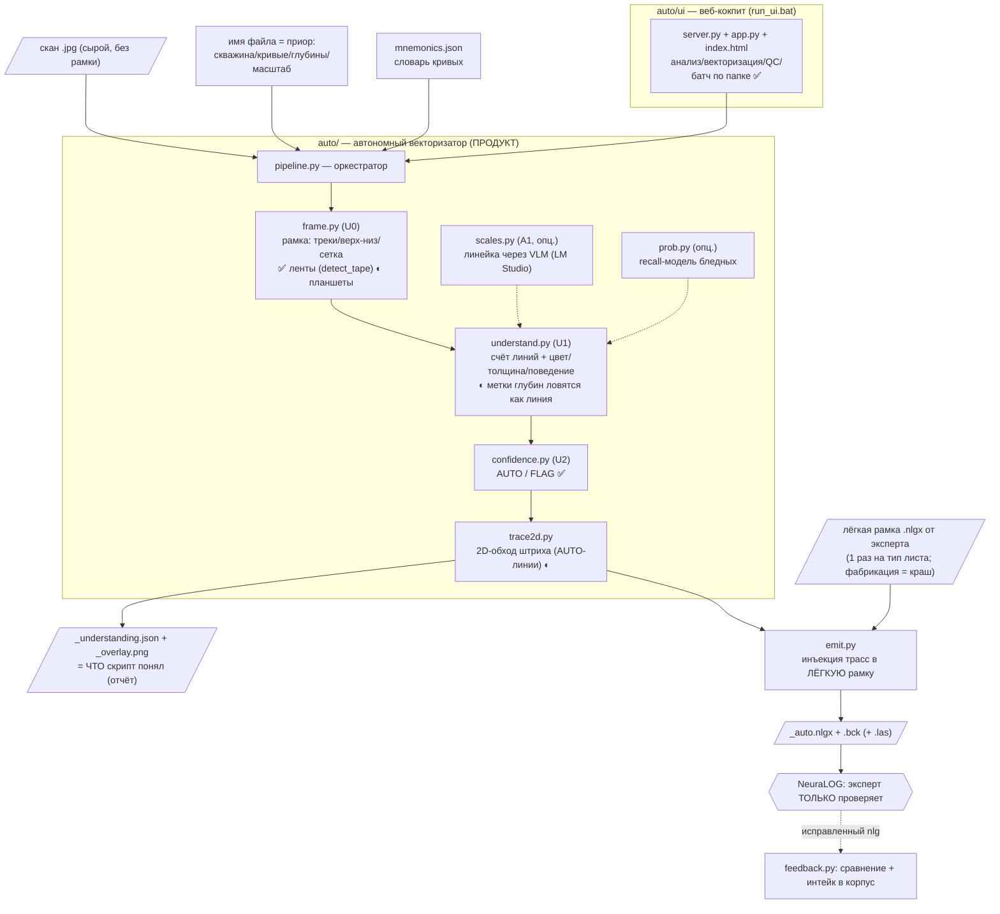
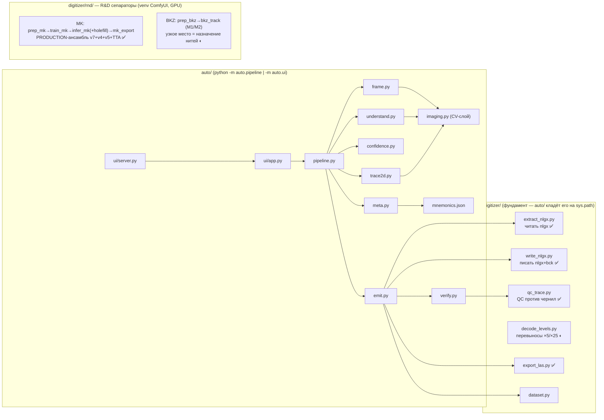

# 🗺️ Карта проекта CarrotageAuto (живой документ)

> **Правило:** этот файл обновляется в КАЖДОЙ сессии разработки — меняются статусы (✅/◐/✗),
> добавляются строки в «Журнал прогресса». Смотри его на GitHub — диаграммы рендерятся сами.
> Курс и гейты: [ROADMAP_v2.md](ROADMAP_v2.md) (§8а — статус, §4 — стадии). История: [PLAN_new_dialog.md](PLAN_new_dialog.md).

Обозначения: ✅ работает (прошло гейт) · ◐ частично / в работе · ✗ не работает / не начато · 🗄 архив (мёртвое)

---

## 1. Общий поток данных (что из чего получается)

## 2. Кто кого вызывает (внутри репо)

**Слои, одним предложением каждый:** `auto/` — сам анализирует сырой скан и векторизует;
`digitizer/` — расшифрованный формат nlgx + QC + LAS (этим пользуются все);
`digitizer/rnd/` — обучаемые разделители слипшихся кривых (MK готов, BKZ в работе);
`archive/` — мёртвое (Win32-кликер NeuraLOG и пр.), не трогаем.

---

## 3. Таблица статусов (обновлять каждую сессию)

| Модуль | Роль | Статус | Последний гейт / замер |
|---|---|---|---|
| `auto/meta.py` | имя файла + мнемоники → приор «ЧТО» | ✅ | тесты pure PASS |
| `auto/frame.py` U0 ленты | перфолента: перфорация→трек, отрез шапки, px/м-приор | ✅ | 09.07: Semeguniv 22/22 + Yatskivska MK; px/м 29-33 (1:200), 11-12 (1:500) |
| `auto/frame.py` U0 планшеты | рамка по вертикалям/сетке | ◐ | сетка-бумага без тёмных граней → фолбэк «весь лист» (durable §6.6.9) |
| `auto/frame.py` U0 detect_tape | распознавание перфоленты | ✅ | 10.07: +запасной триггер (двусторонние края+светлая середина) → src=tape 20/22 (было 15); осталось BK_190 (тёмный скан), BKZ_3080 (1 край) |
| `auto/understand.py` U1 | счёт линий + свойства | ◐ | 10.07 (позже): **G2 12/22** (было ~5). Фильтр оси+меток доведён: ключ = ПРЯМИЗНА штрихов (x-std≤1px, ось по линейке 0.4 vs выцветшая кривая ≥1.8; только чёрный, слева, cov<0.4) — MK_190 больше НЕ переедается (2/2 ✓); + merge ДРЕЙФА (сплит по x-долине легален лишь при конкуренции за строки; BKZ_3690: 7,8→6,6). Планшеты-регрессия чистая, pure PASS. Остаток → §5 п.2 |
| `auto/confidence.py` U2 | AUTO/FLAG | ✅ | pure-тесты + честные FLAG на батче |
| `auto/trace2d.py` | 2D-обход штриха | ◐ | визуально ложится (BKZ/MK), числового гейта ≤2px ещё нет → **G3** |
| `auto/scales.py` A1 | счёт уровней линейки (VLM) | ◐ | опц., LM Studio; на лентах не проверен |
| `auto/prob.py` | recall-модель бледных | ◐ | recall 21→84% на выцветших; в батче НЕ подключена |
| `auto/emit.py` | nlgx+bck (+las) через лёгкую рамку | ◐ | работает на планшетах; для лент нужен каркас от эксперта → **G4** |
| `auto/verify.py`, `qc_trace` | QC против изображения | ✅ | позвоночник «эксперт только проверяет» |
| `auto/ui` | веб-кокпит + батч по папке | ✅ | 09.07: батч 22 сканов через сам UI, таблица+оверлеи |
| `digitizer/extract_nlgx, write_nlgx` | формат nlgx | ✅ | round-trip, открывается в NeuraLOG |
| `digitizer/decode_levels.py` | перевыносы (уровни ×5/×25) | ◐ | одиночный оборот corr 0.916; мульти-оборот нет |
| `digitizer/export_las.py` | nlgx → LAS | ✅ | log_corr 0.97 |
| `digitizer/pipeline.py + digitize_b3` | ШАБЛОННЫЙ путь (снап к экспертной трассе) | 🗄→◐ | НЕ продукт (депрекейт); держим для регрессии; **кандидат в POLISH** (сглаживать НАШУ трассу, см. §5) |
| `digitizer/rnd/` MK-сепаратор | слипшиеся MGZ/MPZ | ✅ | production-ансамбль; правило QC 03.07: перескоки хуже px |
| `digitizer/rnd/` BKZ-сепаратор | 5 слипшихся GZ | ◐ | M2 joint DP испытан; узкое место = назначение |
| `digitizer/` legacy U-Net (unet/train/infer/track_multi/digitize.py) | бинарная маска как разделитель | 🗄 | закрыт: блобит, идентичность не различает (§6.6.10) |
| `archive/neuralog_ui/` | Win32-кликер NeuraLOG, блок-2 | 🗄 | заменено прямой записью nlgx |

---

## 4. Журнал прогресса (добавлять строку за сессию)

| Дата | Что изменилось | Вердикт |
|---|---|---|
| 2026-07-09 | Аудит: легаси→archive/; U0 tape-mode (перфоленты); UI-батч по сырой папке; карта проекта | ленты калибруются; следующее узкое место — U1 счёт линий (G2) |
| 2026-07-10 | Батч-замер G2 на 22 лентах Semeguniv_001; **фикс `frame.detect_tape`** (запасной триггер «двусторонние тёмные края + светлая середина», perf_confirmed): src=tape 20/22 (было 15). Восстановлен обрезанный (коллизия с Code) хвост `detect_frame`. **Сверка с эталоном nlgx: BKZ = 4 трассы (не 5!)** — «ожидание из имени» наивно, мерить по nlgx. | G2-гейт упирается в U1: переразбиение одной пиковой кривой (BK_4020: 1→5), цветная линовка str=1 cov0.99 (STK_4020: 14), фильтр меток переедает кривые (MK_190: 2→0). Осталось src=None: BK_190 (сплошь-тёмный скан), BKZ_3080 (край с одной стороны). |
| 2026-07-10 (2) | **U1 G2-доводка: 12/22** (гейт: got==exp, BKZ 3..6). (а) фильтр оси+меток: ключ = прямизна штрихов x-std≤1px + только чёрный + слева + cov<0.4 (BK_2410 ✓, MK_190 восстановлен 2/2 ✓); (б) merge дрейфа: сплит легален лишь при конкуренции за строки, иначе куски одной кривой склеиваются (BKZ_3690 D1/D2 → 6/6 ✓); (в) гейт-колонка «линий/ожид + G2-бейдж» в UI-батч (проверено вживую через сам UI). Регрессия планшетов (Pn_Zavoda×3 + Yatskivska MK): чисто, pure-тесты PASS. **Провалы-ресерч (НЕ возвращаться):** покрытие строк и периодичность y НЕ разделяют метки vs выцветшую кривую у края (обе ~cov 0.1-0.2, MAD/med 0.4-0.7); подъём dark_v (110→145) мёртв — выцветшая кривая BK_2410 лежит V 140-160 В ПЕРЕКРЫТИИ с сеткой → только prob-модель или цвет графит-vs-синеватая сетка (не проверено). **Data-issue:** `MK_1380_2340_D2.jpg` — на самом деле БКЗ-планшет 4020-4062 (шапка), файл назван неверно. | Остаточные классы (по файлам): шапка-рукопись в зоне данных коротких лент (BK_4020, STK_4020, STK+DS, RK); DS+DN слипшийся пучок runs=2 (DS_200) — честный FLAG, сепаратор вне G2; bleed-through зелёные с оборота (STK_200); ожидания имени неполны (STK нет в mnemonics, у MK третья красная кривая, BKZ по эталону 4) — **вопрос Эдуарду + мерить по wlg-эталонам**. |

---

## 5. Чего не хватает (очередь стадий, из ROADMAP §8а + аудит)

1. **G1** — глубинная калибровка лент, где длина ≠ интервалу имени (по жирной сетке + OCR рукописных меток глубин через VLM). Сейчас — честный FLAG.
2. **G2** — U1 на лентах: ◐ 10/22 строгих (метки/ось исключены, дрейф склеен, гейт-бейдж в UI-батче; ожидание берётся из wlg-эталона, где он есть — «·wlg» в таблице; эталонов пока 2: BKZ_3530 D1 4/3, D2 5/3 — перерасчёт вскрыт). Остаток: (а) больше wlg-эталонов (растит feedback-интейк); (б) отрез шапки-рукописи на КОРОТКИХ лентах (BK_4020/STK_4020/STK+DS/RK); (в) цветная печатная линовка str=1 cov~1; (г) bleed-through с оборота (STK_200); (д) faint-обрывки внутри трека (BKZ_3530_D1 x=188). Пучки DS+DN — честный FLAG (сепаратор, вне G2).
3. **G3** — числовой гейт trace2d: ≤2px против чернил (qc_trace) на одиночных лентах BK/DS/STK.
4. **G4** — сдача лент: лёгкая рамка-каркас от эксперта (1 шт. на тип ленты) → батч-векторизация → nlgx+bck.
5. **POLISH (новая, идея Эдуарда 09.07)** — переиспользовать сглаживатель шаблонного пути (`digitize_b3.aggregate_xs`): гидом давать НЕ экспертную, а НАШУ авто-трассу из trace2d → снап к чернилам сглаживает зигзаги. Тот же код, инверсия источника гида.
6. **Phase C** — значения: перевыносы мульти-оборот (`decode_levels`), масштабные величины (сейчас эксперт при QC).
7. UI: батч-**векторизация** (не только анализ) + история прогонов (сравнение «стало лучше/хуже» между сессиями).
