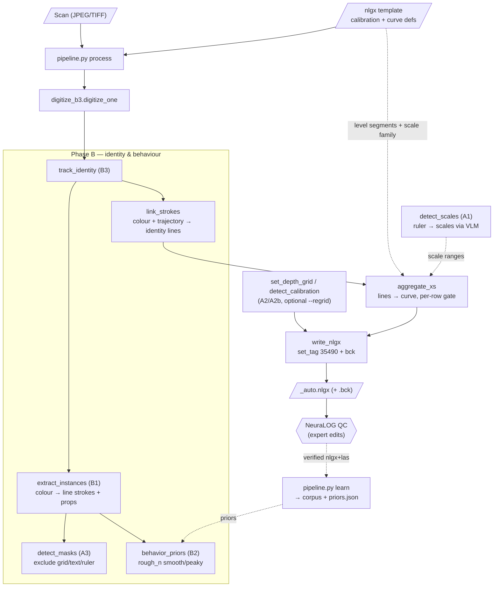

# CarrotageAuto

**Automated digitization of Soviet-era well-log charts.** Turns scanned paper well logs
(raster JPEG/TIFF) into digital curves as NeuraLOG `.nlgx` working files (+ `.bck`) and LAS,
ready for expert QC — with as little manual correction as possible.

This README is the outward-facing overview. **Everything else has exactly one job — see the map below.**

## Where the truth lives (read this before opening anything else)

| question | file | note |
|---|---|---|
| **What is the state right now? What do I do next?** | ★ [`digitizer/rnd/HANDOFF.md`](digitizer/rnd/HANDOFF.md) | **the entry point.** Top block only; everything below it is context |
| Where did a number come from? | [`ROADMAP_RECOGNITION.md`](ROADMAP_RECOGNITION.md) | the measurement journal, numbered `§6.x`, newest **on top**. Every published number has a section |
| Which test bench measures what? | [`digitizer/rnd/STANDS.md`](digitizer/rnd/STANDS.md) | index of all `digitizer/rnd/_*.py`; verified by `python _stand_audit.py` |
| What may I delete from `output/`? | [`digitizer/rnd/DATA_RETENTION.md`](digitizer/rnd/DATA_RETENTION.md) | executable part: `_data_retention.py` (dry run by default) |
| How is `auto/` built, how do I check it? | [`auto/README.md`](auto/README.md), [`auto/VALIDATION.md`](auto/VALIDATION.md) | module contract and the check-list |

**Rules of the journal.** A number is quotable only with the sheet-set it was measured on
(accuracy varies **tenfold** between wells). A section marked ⛔ is retracted — do not cite it.
A retracted claim is never deleted, it is struck through and kept, so the same mistake is not
made twice.

**Archive** (`archive/docs/`): the 2026-06/07 documents — `PLAN_new_dialog.md`, `PROJECT_MAP.md`
and the older `HANDOFF_prev.md`, `DIRECTIONS.md`, `NEXT_*.md`, `AGENT_TASKS.md`, `INTAKE.md`.
They are history: valuable as a record of *why*, superseded as a description of *what is*.
[`ROADMAP_v2.md`](ROADMAP_v2.md) stays here because `auto/pipeline.py` and `auto/__init__.py`
cite it as the architectural course.

---

## The problem

Old Soviet geophysical well logs ("каротаж") are hand-drawn paper charts: multiple curves per
track, a depth grid, scale rulers, handwritten numbers, and **back-up / amplified scales**
(the same sonde re-plotted at ×5 / ×25 / ×125 when it runs off-scale). They were scanned to
raster images. We convert them back into calibrated digital curves.

The hard parts are **identity** (which ink belongs to which curve, especially where curves cross
or share a colour) and **back-up scales** (1× and 5× of one sonde are *separate lines with a gap*,
not one continuous wrap). A naïve "binary mask + centroid" tracer loses both.

## Approach

Two pipelines live in this repo:

| | Legacy (U-Net) | **Current (image-understanding)** |
|---|---|---|
| Foreground | trained U-Net stroke mask | colour classification + geometric masks |
| Separation | geometric multi-line tracker | per-colour instance extraction + identity linker |
| Training | yes (`unet_best.pt`) | rule-based, **plus one small trained model**: a window run-selector (`auto/models/seq_model_d45p.pt`, 359 KB) that replaces the greedy run choice during tracing |
| Runtime | Python + PyTorch (GPU) | OpenCV/NumPy (CPU); **PyTorch optional** — without it the pipeline falls back to the greedy tracer and says so loudly on every run |
| Status | superseded (binary mask loses identity) | active |

The current pipeline is **identity-aware and image-understanding-first**, organised in phases:

- **Phase A — frame & scales** (foundation)
  - `A1` read the scale ruler with a vision LLM → which scales exist and their ranges
  - `A2/A2b` rebuild the depth grid at the native step, snapped to the real ink lines
  - `A3` mask non-curve zones (numbers, ticks, grid cells, ruler band) so they are never traced
- **Phase B — identity & behaviour** (the quality layer)
  - `B1` extract line **instances** from the image (centreline, start/end, thickness, **colour**)
  - `B2` behavioural priors — SP is smooth, resistivity/caliper are peaky (measured over the corpus)
  - `B3` identity tracker — links strokes into lines by colour + trajectory; a line never jumps
    onto a neighbour. **Swap rate ≈ 0 %** on validation, including same-colour pairs.
- **Phase C — values** (in progress): map traced shapes to real values across back-up scales.

Validation is always against expert ground-truth (`.nlgx` traces): per-curve pixel error,
coverage, and **swap rate** (does a line stay on its own identity).

## Pipeline at a glance



`process` is OpenCV/NumPy (Phase A/B); `detect_scales` (A1) is optional and uses a local
vision LLM. The dashed arrows are reference/feedback inputs, not the main data path.

**Tracing uses one trained model, enabled by default.** `auto/trace_seq.py` scores candidate ink
runs from a ±64-row patch instead of picking the nearest one greedily. Measured across 106 sheets with both sides built by the same code: **82 → 110 honest curves
(+34%)**, 20 sheets better, 3 worse; on the 60 sheets the model never saw, **48 → 63 (+31%)**
(ROADMAP §6.71-§6.72). ⚠ Those numbers score *tracing quality* on the research path, which forces
every line to be traced and fills short gaps — the shipped writer does neither, so they do not
describe the delivered file (ROADMAP §6.75). PyTorch is **not** a hard dependency — `trace_seq.available()`
checks for both the import and the checkpoint, and without either the pipeline traces greedily and
prints a warning naming the reason. Turn it off with `CVParams.seq_model = ""`.
`auto/tests/run_pure.py` verifies the in-prod copy of the inference code still matches the training
source; it skips cleanly when PyTorch is absent.

## Quick start

The whole pipeline has one entry point — `digitizer/pipeline.py`:

```bash
# Digitize one file or a whole folder of scans → *_auto.nlgx (+ .bck)
python digitizer/pipeline.py process <file.nlgx | folder> [--patch-scan] [--regrid]

# Add verified nlgx+las to the learning corpus and refresh priors.json
python digitizer/pipeline.py learn <folder-of-verified-nlgx+las>
```

`process` needs a per-scan NeuraLOG **template** `.nlgx` (calibration + curve definitions) next to
the image; it produces the trace. Output opens directly in NeuraLOG for QC over the scan.
`process` is pure OpenCV/NumPy — **no model file, no GPU required**.

## Repository structure

```
CarrotageAuto/
├─ README.md                 ← you are here: overview + map of all documents
├─ ROADMAP_RECOGNITION.md    ★ measurement journal, §6.x, newest on top — the source of truth
├─ ROADMAP_v2.md             architectural course (2026-06); cited from auto/ docstrings
├─ mnemonics.json            curve dictionary (names, units, groups) from the client
├─ run_ui.bat / run.py       launchers: web UI / one template-pair run (regression)
├─ auto/                     ★ AUTONOMOUS image-first vectorizer (v2 course) + web UI (auto/ui)
│   ├─ README.md             module contract
│   ├─ VALIDATION.md         what to run and what a healthy answer looks like
│   └─ config.py             ★ every production knob, each with the section that measured it
├─ digitizer/                nlgx I/O foundation + template pipeline + QC tooling
│   └─ rnd/                  R&D benches (`_*.py`) + HANDOFF.md (entry point) + STANDS.md (index)
└─ archive/                  dead code and superseded documents (archive/docs/)
```

**Where to work:** the web UI (`run_ui.bat` → http://127.0.0.1:8765) is the development cockpit —
single-scan analysis/vectorization/QC plus **batch analysis of a raw folder** (no templates needed),
with per-sheet understanding, AUTO/FLAG counts and overlays.

### `digitizer/` — module map (grouped by role)

**Core nlgx I/O (foundation, no internal deps):**
- `extract_nlgx.py` — parse `.nlgx` (multi-IFD TIFF) → calibration, scale families, pixel traces
- `write_nlgx.py` — write `.nlgx` (round-trip + inject a trace into tag 35490) + `.bck`
- `dataset.py` / `dataset_build.py` — curve curation, mask rasterization, LAS matching, manifest

**Current pipeline (Phase A/B + end-to-end):**
- `detect_scales.py` — A1: ruler crop → VLM (constrained JSON) → scale structure
- `set_depth_grid.py` + `detect_calibration.py` — A2/A2b: depth grid rebuild + snap to ink
- `detect_masks.py` — A3: exclude-mask of non-curve zones
- `behavior_priors.py` — B2: smoothness/peakiness priors per curve class
- `extract_instances.py` — B1: colour → connected components → line instances + properties
- `track_identity.py` — B3: stroke linking into identity-stable lines
- `digitize_b3.py` — end-to-end B1→B3 → `_auto.nlgx (+bck)`
- **`pipeline.py`** — single entry point: `process` + `learn`

**Legacy U-Net path (superseded, kept for reference):**
- `unet.py`, `train.py`, `infer.py` — U-Net stroke segmentation
- `track_multi.py` — geometric multi-line tracker over the binary mask
- `digitize.py`, `cache_tracks.py`, `inject_trace.py`, `batch_digitize.py`

**Back-up scales / values & diagnostics:**
- `decode_levels.py` — decode amplified/back-up scale levels (DP/Viterbi)
- `survey_levels.py`, `eval_swaps.py`, `overlay_diff.py`, `batch_*` — analysis & QC tooling

Dependency roots: everything builds on `extract_nlgx`; `pipeline → digitize_b3 →
{track_identity → extract_instances → detect_masks, behavior_priors}`.

## Environments

| Task | Interpreter |
|---|---|
| New pipeline, nlgx I/O, analysis | **Python 3.14** + OpenCV/NumPy/Pillow (no SciPy, no Torch) |
| Legacy U-Net train/infer | **venv ComfyUI** — PyTorch 2.x + CUDA (RTX 5080) |
| Scale ruler reading (A1) | **LM Studio** local server, vision model `google/gemma-4-26b-a4b` |

## Where is the trained model?

The legacy U-Net checkpoint is at:

```
F:\nds\output\unet_data\unet_best.pt
```

(trained by `digitizer/train.py`; tiles live under `F:\nds\output\unet_data\`).
**The current pipeline does not use any trained model** — it is rule-based (colour + geometry +
behaviour), so there is no weights file to ship for it. "Learning" for the current pipeline means
growing the verified corpus and refreshing `priors.json` via `pipeline.py learn`.

## Data layout (per NeuraLOG convention)

```
projects/<well>/
├─ img/   raster scans (.jpg/.tif)
├─ wlg/   NeuraLOG working files (.nlgx + .bck)
└─ las/   exported digital data (.las)
```

## Domain background (NeuraLOG terms)

- **Depth Axis (DA)** — depth↔pixel calibration of a track. **Scale Axis (SA)** — value↔pixel.
- **Depth grids** — horizontal rules at even intervals (1:200 → every 4 m, 1:500 → every 10 m,
  "every 10 cells on the bold lines").
- **Back-up / amplified scales** — when a curve runs off-scale it continues on a back-up:
  *Backup Right/Left* (appears on the opposite side) or *amplified* (×5/×25…). In `.nlgx` these are
  separate Scale Axes chained by the `next` tag; the trace carries a per-depth *level* segment.
  Scanning at **200 dpi** is recommended (300 dpi only for 1-inch logs).
- Delivery = `.nlgx + .bck (+ .las)` per scan; the expert re-checks every curve in NeuraLOG, so the
  digitizer must *understand* the sheet (scales, identity, behaviour) rather than trace blindly.

## Status (2026-09-01)

**Metric.** Curves must not get confused with each other; naming them is *not* required at this
stage (Eduard's decision, 2026-08-20). So the leading count is **nameless**: maximum 1:1 matching
inside a track. The named count is reported second, as a reference. Both are always taken in **one
pass** — taken separately they diverged once and the error stood for three weeks.

**In production** (`auto/config.py`): `slot_gate = "frac0.0"` + `slot_sib = 2.0` — together
**+22.8 %** honest curves on the shipped path, p < 0.00001. `row_decoder = ""` — the row decoder
is **off**.

**The open decision.** A second tracing path (the row decoder) plus a per-track choice between it
and production is written, measured and switched off pending a product call: it is worth roughly
**+7…15 %** honest curves for **+30…60 %** run time. The exact figures, what is proven and what is
only an estimate on frozen outputs, are in the top block of
[`digitizer/rnd/HANDOFF.md`](digitizer/rnd/HANDOFF.md) — that block is kept current; this line is not.

Phase A complete; Phase B core complete (identity tracker, ~0 % swaps); end-to-end assembly and a
single-entry CLI in place. Roughly **half** of the expert curves are still taken by no path, and
that remainder is **geometry, not coverage** — the open lever is identity.
