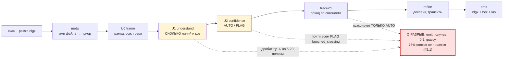
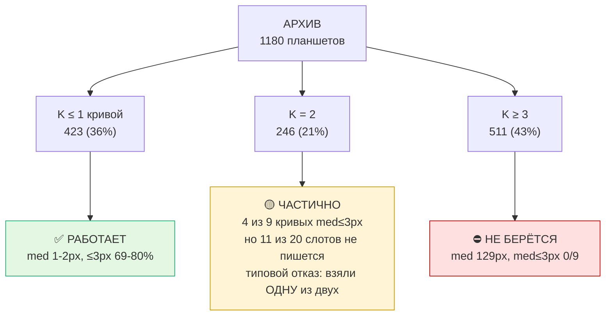
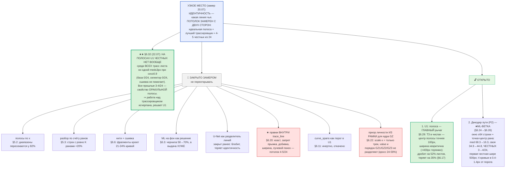
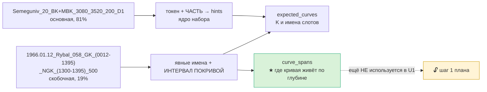

# ROADMAP — РАСПОЗНАВАНИЕ И ТОЧНОСТЬ ЛИНИЙ

Приоритет заказчика (18.07): **все силы на распознавание и точность линий**.
Дополняет `ROADMAP_v2.md` (общая архитектура). Здесь — только то, что влияет на то,
насколько верно найдены линии и насколько точно ведётся штрих. Все числа — замеренные,
не оценочные; источник каждого указан.

---

## КАРТА (mermaid; рендерится в Obsidian и на GitHub)

### Конвейер и ГДЕ ИМЕННО он рвётся на мульти-листах

### Состояние по классам планшетов (1180 листов с картинкой)

### Что закрыто замером, что осталось

### Приор из имени файла (две конвенции)

---

## 0. Как устроен разбор СЕЙЧАС (важно для планирования)

**Обучения в продакшне НЕТ.** Пакет `auto/` — чистая геометрия (numpy/cv2). Единственный
ML-хук `auto/prob.py` (`config.prob_provider`) выключен по умолчанию и включается только
флагом `--prob`. Всё, что даёт текущее качество, — правила и измеримая доменная логика.

Конвейер: `imaging` (маска чернил) → `frame` U0 (рамка/оси) → `understand` U1 (сколько линий,
их полосы/поведение) → `confidence` U2 (AUTO/FLAG) → `trace2d` (2D-обход по связности ранов)
→ `refine` (доводка/деспайк/транзиты) → `emit` (nlgx+bck+las).

ML, доказанный но НЕ в проде:
- U-Net как **разделитель линий — ЗАКРЫТО** (блобит, теряет идентичность) — `prob.py` docstring.
- U-Net как **high-recall гейт переднего плана — РАБОТАЕТ**: выцветший GZ recall 21→84%.
- MK-разделитель (трек 2) — ансамбль v7+v4+v5+TTA, живёт своим циклом в `digitizer/rnd/`.

---

## 1. Где мы сейчас — по типам планшетов

| класс | распознавание линий | точность штриха | состояние |
|---|---|---|---|
| **MBK, один зонд** (Yatskivska, Pn_Zavoda) | ✅ решено | **med 1.0-2.0px, ≤3px 69-80%** | рабочее |
| **MK** (MGZ/MPZ наложенные) | ✅ ансамбль+hole-fill | ~58% eff≤3, следование 1.6-1.9px | у потолка UNet |
| **BKZ D1** (GZ21/GZ31) | ✅ странды 100%, med 1.0px | группы 55-76% чисто | прорыв 18.07 |
| **BKZ D2** (GZ41/OGZ1) | ✅ странды на GT 0.89-1.0 | паррование 0 рёбер | ⛔ открыто |
| **мульти-лист** («BK, IK», «BKZ, DS», …) | ⛔ 76% слотов НЕ пишется | у записанных med 129px | ⛔ см. §5 |
| **перевыносы ×5/×25 (все классы)** | — | value-corr 0.47 vs эксперт 0.89 | ⛔ потолок |

---

## 2. Что уже сделано и ЗАКРЫТО (не переоткрывать)

**Распознавание:**
- `understand._single_curve_rescue` — свипующее перо не даёт столбцовой полосы, band-детект
  видел огрызок 11м из 300м. Фикс: одна ожидаемая кривая + линия <30% высоты → полно-полосная.
  **cov 0.10 → 0.71.** Гард: нерасщеплённый токен «MBK, MDS, MK» = мульти-лист, не трогать.
- BKZ M1 `link_strands` — детект нитей покрывает GT 100%, медиана 1.0px. Детекция НЕ узкое место.

**Точность штриха:**
- `Line.x_hard_lo/hi` — `refine_trace` при «недотяге до упора» расширяла полосу ДО ТРЕКА и
  затаскивала трассу на вертикаль рамки. **Упор 4.2% → 0.7%** (эксперт 0.4%), p90 108→69px.
- `Line.prefer_body` — точка в ране = ЦЕНТР, не вершина. Замер разметки эксперта: медиана
  позиции внутри рана rel=0.50, «вершинных» лишь 13%. **≤3px 53→62%.**
- `refine.drop_transits` — транзит (односторонний ход ≥150px за ≤8 строк) = перо едет, а не
  измеряет; эксперт там ведёт хорду. **Шипы 85→33 эпизода, ≤3px 60→69%.**

**Тупики (durable, НЕ повторять):**
- Hampel-деспайк на качающейся кривой бессилен (порог k·MAD огромен); abs-медианный фильтр
  ХУЖЕ базы (шипов 119 против 85).
- Интерполяция дыр после дропа транзитов: ≤3px 63→51%.
- Свип-интегратор уровней: на чистой трассе corr 0.459, но архив-wide 0.397 < DP 0.418;
  гейт по x1_cov ОПРОВЕРГНУТ (кривые с x1>0.90 — лучшие у DP, а не худшие).
- BKZ: «все оси листа как кандидаты паррования» — ложные пары, 5→4 чистых.
- Все спец-комбинирования трека 2 (арбитраж/512-контекст/эмбеддинг/pos-регрессия): сигнал
  «чей метод прав» плейт-зависим ⇒ безопасно только непересекающееся дополнение.

---

## 3. Что даст РОСТ ТОЧНОСТИ — приоритеты

### P0 — дешёвое и доказуемое

1. **BKZ D2: искать двойника в ПРЕДСКАЗАННОЙ позиции, а не перебором пар.**
   Все шкалы делят один x-диапазон и линейны ⇒ ×5-двойник точки x лежит при
   `x' = x_left + (x - x_left)/5` (для базы с v_left=0). Перебор пар не находит его, т.к.
   двойник короткий и не входит в топ-N по длине. Целевой поиск снимает это ограничение.
   *Ожидание: закрывает 0-рёбер на 3474_D2/3866_D2.*

2. **Мульти-кривые листы («MBK, MDS, MK»).** Самый большой невзятый объём.
   ✅ Токен имени расщеплён по запятой (085f9d2) — expected_curves больше не одна строка.
   ⛔ «вести каждую кривую своей полосой» — **ОПРОВЕРГНУТО замером, см. §5**.

3. **Чистка архива по `qc_nlgx_las.csv`.** 308/1114 кривых (28%) расходятся с LAS, из них
   46 — ошибка уровня кратно ×5. Любая метрика и любое обучение на них отравлены.

### P1 — среднее

4. **Дотяжка настоящих пиков** (те 13%). Локальный экстремум трассы НЕ сработал (≤3px 60% =
   как чистый центр). Нужен другой признак: пик = ран, где штрих ЗАВЕРШАЕТСЯ (шапка), а не
   пересекает трек. Кандидат — скелет/связность вверх-вниз от рана.

5. **Хорды через разрывы.** 43% точек эксперта лежат ВНЕ туши (пунктир/выцветшее). Простая
   линейная интерполяция отвергнута; нужна интерполяция ПО ФОРМЕ соседних сегментов.

6. **Включить recall-модель как гейт** (`--prob`). Доказано: выцветший GZ recall 21→84%.
   Это прямо повышает распознавание бледных линий, не трогая идентичность.

### P2 — крупные ставки

7. **BKZ: эмиссия групп в nlgx** — довести валидированный групповой подход до сдачи.
8. **MK: принципиально иная постановка** (per-curve регрессия 2 x-координат / temporal-декодер
   пути пера). Текущий UNet+ансамбль у потолка.
9. **Перевыносы ×5/×25** — без внешнего scale-сигнала потолок доказан (image 42% слеп, соседняя
   кривая не делит ×5/×25, шапка даёт только лестницу). Требует нового источника информации.

---

## 4. Как мерить (иначе легко обмануться)

- **Метрика точности линии = px vs экспертная трасса** (med, ≤3px, ≤10px), НЕ level-acc.
  Замерено: level-acc почти не коррелирует с value-фиделити (0.538→0.595 дало corr +0.03).
- **Смотреть ВЕСЬ планшет, а не кропы.** QC №2: метрики росли, глазом разницы нет — видимый
  дефект (шипы через трек) виден только на обзоре всей кривой.
- **Широкий гейт обязателен.** BKZ: вывод по 1 планшету («метод работает») опровергнут на 10
  (5 чистых / 3 нет). Урок трека 2 подтверждён ещё раз.
- **Ловушка гейта:** если emit не смапил трассу, в `_auto.nlgx` остаётся ЭКСПЕРТНАЯ трасса и
  гейт показывает идеальные 0.0px. Всегда проверять `auto.xs != gt.xs`.
- **Разделять метрику по уровням:** на строках ×1 med 1.0px/80% ≤3px, на перевыносах p90 189px.
  Смешанная метрика прячет и то, и другое.

---

## 5. МУЛЬТИ-КРИВЫЕ ЛИСТЫ (P0-2): замеры 18.07 и что из них следует

Инструменты (воспроизводимо): `digitizer/rnd/_multi_gate.py` (гейт пайплайна vs экспертная
трасса, покривой), `_multi_crossings.py` (класс листа по GT), `_multi_ink_audit.py` (что лишнего
в чернилах), `_multi_rank_probe.py` (потолок разбора по счёту).

### 5.1 Базовая линия — не «неточно», а НИЧЕГО НЕ ПИШЕТСЯ
`_multi_gate.py` на **12 листах 12 РАЗНЫХ скважин** (BK,IK / GK,NGK / BKZ,DS / BK+IK):

| | |
|---|---|
| слотов кривых всего | 37 |
| **не записано вообще** (в nlgx осталась экспертная трасса) | **28 (76%)** |
| записано и измерено | 9 → med 129px, ≤3px 19%, med≤3px у 0/9 |

**Цепочка отказа (найдена, не гипотеза):** U1 дробит одноцветную тушь на 5-23 полосы →
U2 видит перекрытие x-полос одного цвета и ставит FLAG `bunched_crossing` почти всем →
`trace2d.trace_auto` трассирует **только AUTO** → emit получает 0-1 трассу на лист.
Пример BEZLUD_051 «BK, IK»: 23 линии, AUTO=1 (это вертикаль рамки x=326), written=['BK1'],
med 916px. То есть единственная записанная кривая — заведомый мусор.

### 5.2 Полосы по мнемоникам — ОПРОВЕРГНУТО (не открывать заново)
На 726 листах архива (2..6 кривых, с картинкой), по ЭКСПЕРТНЫМ трассам:
- **x-диапазоны кривых пересекаются у 82%** (band-раздельны лишь 111 = 15%).
  ⇒ «одна мнемоника = одна полоса» неприменимо как общий подход.
- По честному признаку (меняют ли кривые порядок слева-направо) листы делятся:
  **ordered 321 (44%)** — порядок стабилен, разбор ПО СЧЁТУ законен (канон §6.6.11);
  **crossing 405 (56%)** — реальные пересечения, нужен разделитель.
  По токенам: MK 0/64 ordered (все пересекаются — это и есть трек 2), BKZ 71/188,
  «BKZ, DS» 29/37, STK+DS 8/8, «GK, NGK» 8/24.

### 5.3 Разбор по счёту (k-й ран = k-я кривая) — на сырых чернилах НЕ РАБОТАЕТ
`_multi_rank_probe.py` на 12 ordered-листах: доля строк, где ранов ровно K, = **0.00-0.64
(медиана <0.2)**, med ошибки 8-777px, кривых med≤3px **0/7**.
Причина найдена `_multi_ink_audit.py` — **в треке НАМНОГО больше туши, чем оцифровано**:
- BOGAT_011 «BKZ, DS»: K=4, а ранов на строку **медиана 13**; лишняя тушь размазана по всей
  ширине трека (перевыносы ×5, неоцифрованные зонды, штриховка).
- KREMEN_057 «GK, NGK»: **57% точек эксперта не имеют чернил в ±6px** (пунктир/выцветание
  или расхождение калибровки) — там счёт ранов не поможет в принципе.

### 5.4 Что это значит для плана
Узкое место мульти-листа — **НЕ «как поделить полосы», а «какая тушь вообще принадлежит
оцифрованной кривой»** (селекция), плюс FLAG-гейт, который сейчас глушит выдачу целиком.
Развилка для заказчика (нужен выбор, а не догадка):
- **(а) Сузить объём** до измеримо берущегося подкласса (ordered + мало лишней туши) и довести
  его до сдачи; остальное честно оставить эксперту.
- **(б) Селекция туши** по приорам рамки: у каждого слота есть СВОЯ scale-axis (x_left/x_right,
  масштаб) — сейчас U1 её игнорирует и знает только трек. Дешёвая проверка до вложений.
- **(в) Разделитель** (ML) для crossing-класса — ранее закрыт как разделитель линий; открывать
  только с явным решением.

---

## 6. ML НА ФОН + СЕЛЕКЦИЯ ТУШИ: замеры 19.07

Заказчик выбрал «ML на фон + попробовать селекцию туши». Модель: `unet_recall.pt`
(`E:\Carrotagki_auto\output\unet_v3\`, val_recall 0.51 / prec 0.22), инференс — venv ComfyUI
(RTX 5080, ~17 с на планшет). Выгонка карт: `digitizer/rnd/_prob_batch.py` (embeddable-python
ComfyUI НЕ добавляет cwd в sys.path, поэтому `python -m auto.prob` там не заводится).

### 6.1 НАЙДЕН БАГ: `--prob` НЕ ДОХОДИЛ ДО РАЗБОРА ЛИНИЙ
`imaging.ink_foreground` подмешивает модель ОБЪЕДИНЕНИЕМ, но `understand._lines_for_track`
строит каналы ПРАВИЛАМИ и лишь ПЕРЕСЕКАЕТ их с fg_full:
`chans[c] = color_mask & sub & (fg_full>0)`, `dark = dark_mask & sub & (fg_full>0)`.
Пиксели, добавленные моделью, по определению не входят ни в `dark_mask`, ни в цветовые маски —
и выбрасывались обратно. **Замер: гейт с `--prob` дал цифры БИТ-В-БИТ как без него.**
Фикс: «ничейный» передний план отдаётся чёрному каналу (без prob-карты множество пусто, путь
правил не меняется).

### 6.2 ML НА ФОН РАБОТАЕТ — на уровне ЧЕРНИЛ (`_multi_fg_gate.py`, 12 листов 12 скважин)
Метрика — доля точек экспертной трассы, под которыми есть чернила (то, что нужно трассировке):

| | правила | правила+ML |
|---|---|---|
| GT-покрытие, среднее | **58%** | **70%** |
| ранов на строку (цена: мусор) | 5.5 | 5.5 |

Выигрыш там, где правила рушатся полностью: KREMEN_083 3→49%, KREMEN_089 5→39%,
LEVEN_024 8→61%, NARIZHN_002 43→54%. Плата за это — НУЛЕВАЯ (ранов на строку не выросло).
Это ровно те листы, где U1 давал 0-1 линию.

### 6.3 …но НА ВЫДАЧУ пайплайна это НЕ переносится (честный минус)
Тот же гейт `_multi_gate.py` с картами (12 листов): слотов не записано 28→**27**, а точность
у записанных **УХУДШИЛАСЬ**: med 129→**353px**, ≤3px 19→13%. Stanulska_002 вообще потеряла
единственную выдачу (`written=['BK1']`→`[]`), KREMEN_083 записал BK1 с med 2045px.
**Вывод: recall переднего плана — НЕ узкое место.** Больше туши без селекции = больше ложных
полос → тот же FLAG-гейт → выдача не лучше, а хуже. Порядок работ: сначала селекция/маппинг,
ML на фон включать ПОСЛЕ них (карты уже посчитаны, включение = один флаг).

### 6.4 Селекция туши: чем «лишняя» тушь оказалась НЕ
- **НЕ перевыносами ×5.** Позиция двойника считается рамкой аналитически (у каждой scale-axis
  свои x_left/x_right/v_left/v_right). `_multi_replica_probe.py`: перевыносы объясняют лишь
  **1-2%** ранов. Своя рамка объясняет 25-28%, **не объяснено 71-75%**.
- **Это кривые ДРУГИХ файлов того же планшета.** Найдено 19.07: один физический бланк цифруется
  НЕСКОЛЬКИМИ nlgx, каждый берёт свой набор: `BOGAT_011_BKZ, DS_2360-2628_…` → GZ41,GZ51,CALI1,SP1
  и `BOGAT_011_BKZ_2360-2628_…` (тот же интервал, та же дата!) → GZ11,GZ21,GZ31,OGZ1.
  Сканы при этом РАЗНЫЕ (md5 разный, высота 20361 vs 20018) — попиксельно не сопоставить,
  но структурный факт подтверждён именами и составом кривых.
- Плюс одна и та же пиковая кривая пересекает строку по 2-3 раза — «13 ранов на строку при K=4»
  не требует никакой мистической туши.

⇒ **Задача селекции переформулируется** (это главный вывод дня): не «отличить кривую от мусора»
(они выглядят ОДИНАКОВО — проверено глазом на BOGAT_011: 4 оцифрованных и ~3 неоцифрованных
кривых одного пера), а **сопоставить K слотов рамки с K из N физических кривых**. Признак
«локально по чернилам» тут бессилен; работать должны приоры слота (класс/цвет/порядок/шкала).

⚠ **ЛОВУШКА ИЗМЕРЕНИЙ (durable):** экспертная трасса в nlgx — это **ВЕРШИНЫ ПОЛИЛИНИИ, а не
отсчёт на строку** (замер: 4-14% строк, медианный шаг 6-23 строки). Любое сравнение «ран vs GT»
по строкам обязано сначала интерполировать (`_multi_replica_probe.dense`), иначе метрика врёт
в разы: до интерполяции «GT объясняет 1% ранов», после — 25-28%.

### 6.6 НИТИ (третий заход на распознавание) — ТОЖЕ НЕ БЕРУТ, но нашлось главное число
`_multi_strand_probe.py` — вести кривые НИТЯМИ по связности ранов (как BKZ M1, где детект нитей
покрывал GT на 100% при med 1.0px). На мульти-листах (оракул выбирает лучшую нить на кривую):
**med(med) 280px, кривых med≤3px 2/12, покрытие 0.10.**

НО внутри этого — важный факт: **где нить попадает на кривую, точность 1px** (Yatskivska IK
med 1px / ≤3px 98%, Stanulska BK med 1px / 93%). Диагностика на Stanulska (min_len=4, 408
фрагментов): фрагменты, идущие ПО кривой эксперта, покрывают лишь **21-24% её точек**.
Сшивка фрагментов по непрерывности (экстраполяция наклона, `chain_fragments`) результат
**не сдвинула вообще** (вывод бит-в-бит совпал с прогоном без сшивки).

⇒ Геометрия штриха НЕ является узким местом: там, где кусок кривой найден, он найден точно.
Узкое место — **ведение идентичности через пересечения и плотную тушь**: линкер на каждом
взмахе цепляется за соседний ран. Это ровно та способность, которой не хватало треку 2.

**ТРИ СЕМЕЙСТВА ГЕОМЕТРИИ ЗАКРЫТЫ ЗАМЕРОМ (durable, не переоткрывать):**
полосы по x (§5.2) · разбор по счёту ранов (§5.3) · нити + сшивка (§6.6).

### 6.7 СКОЛЬКО КРИВЫХ РЕАЛЬНО ЦИФРУЮТ (объём для сужения области, направление «а»)
По 1180 планшетам архива с картинкой — число кривых В ФАЙЛЕ (не на бланке):

| K кривых | листов | доля | |
|---|---|---|---|
| ≤1 | 423 | **36%** | одиночный путь — УЖЕ РАБОТАЕТ (med 1-2px) |
| 2 | 246 | **21%** | ближайший разумный транш |
| ≥3 | 511 | 43% | требует ведения идентичности |

То есть «мульти» — не монолит: пятая часть архива это ДВЕ кривые, и это следующий по
дешевизне шаг, а не общая задача с 8 кривыми.

### 6.9 ТРАНШ K=2: ГЕЙТ (`_k2_gate.py`, 10 листов 10 скважин, 10-21 Мпикс)
Отбор по СОДЕРЖИМОМУ рамки (ровно 2 оцифрованные кривые), не по токену имени.

| | |
|---|---|
| кривых med≤3px | 4 из 9 измеренных — ⚠ **ЦИФРА ЗАВЫШЕНА, см. ниже** |
| **честно взято (med≤3px И cov≥0.9)** | **2 из 9**: RYBAL_135 GK1 (med 1.0, cov 0.98), Yatskivska IK1 (med 1.0, cov 1.00) |
| med(med) по измеренным | 37px |
| слотов НЕ записано | **11 из 20** |

**Типовой отказ K=2 — не точность, а «взяли ОДНУ кривую из двух».** Это качественно лучше
общего мульти-случая (§5.1: там не писалось 76% слотов и med≤3px не было вообще).

⚠⚠ **САМООПРОВЕРЖЕНИЕ (19.07, durable): «4 из 9» БЫЛО ЗАВЫШЕНО.** `med` считается ТОЛЬКО по
пересечению наших строк с экспертными, поэтому у RYBAL_137 IKA1 (cov 0.25) и RYBAL_058 GK1
(cov 0.53) отличный med означал лишь «та четверть, что взята, взята точно». Честных, т.е.
med≤3px И cov≥0.9, было **2 из 9**. Гейты `_k2_gate.py` и `_multi_gate.py` теперь печатают
СВЯЗАННУЮ метрику «ВЗЯТО ЧЕСТНО» и явно помечают голый счёт med≤3px как негодный.
**Правило: med без cov не цитировать — ни в отчёте, ни в роадмапе.**

**СОСТОЯНИЕ ПОСЛЕ ФИКСОВ `_slot_track` и окна анализа (тот же гейт, 10 листов 10 скважин):**

| | до фиксов | после |
|---|---|---|
| med(med) | 37.2px | **19.4px** |
| ≤3px средн | 37% | **41%** |
| слотов не записано (leak) | 11 из 20 | **10 из 20** |
| **ВЗЯТО ЧЕСТНО (med≤3px И cov≥0.9)** | 2 из 9 | **2 из 10** |

Точность и охват выросли, но **честно взятых кривых по-прежнему 2** — транш НЕ решён.
Голый счёт med≤3px дал бы «5 из 10» и создал бы ложное впечатление прогресса.
Среднее покрытие 0.62: типичная кривая берётся на две трети, а не целиком.

⚠ **Проба «сначала мелкие сканы» НЕПРЕДСТАВИТЕЛЬНА** (durable): сортировка по размеру вытащила
одну нетипичную скважину (RYBAL, сканы 2-7 Мпикс) — гейт должен фильтровать И по размеру
(`--min-mpx`), иначе «широкая проба по скважинам» вырождается.

**Две разобранные причины (диагностика двух листов):**
1. **Ведение идентичности внутри листа.** Yatskivska BK+IK: слоты назначены ПРАВИЛЬНО
   (BK1 x≈376 ↔ GT med 378, IK1 x≈818 ↔ GT 814), обе кривые оттрассированы, но у BK1
   ≤3px 30% и **>100px у 63% точек**, у IK1 — 66%/33%. Перевыносы НИ ПРИ ЧЁМ (в семействе
   1 уровень). Трасса просто перескакивает на соседнюю кривую (расстояние BK↔IK ≈440px,
   типичная ошибка 340px). Это то же узкое место, что в §6.6.
2. **Вторая кривая физически короче.** RYBAL_058: `GK_(0012-1395)_NGK_(1300-1395)` — NGK
   размечена лишь на 7% интервала листа, и фильтры минимальной высоты её законно отбрасывают.
   Это не баг, это данные: «K=2 в файле» ≠ «две кривые на всю глубину».

### 6.10 ⚠ 19% ИМЁН АРХИВА НЕ РАЗБИРАЮТСЯ ВООБЩЕ
Замер: **227 из 1180** планшетов с картинкой дают `top_depth=None` или пустой токен.
Почти всё это скважины RYBAL с ДРУГОЙ конвенцией:
`1966.01.12_Rybal_058_GK_(0012-1395)_NGK_(1300-1395)_500.nlgx` — дата первой, кривые с
интервалами в скобках, масштаб в конце. Парсер берёт из такого имени НИЧЕГО: well='1966.01.12',
token='', глубины/масштаб/часть пустые ⇒ приор пуст, rescue не работает, диагностика врёт.
Топ: RYBAL_045 24, RYBAL_135 23, RYBAL_168 23, RYBAL_017 22, RYBAL_149 17, RYBAL_179 16.
**✅ СДЕЛАНО:** вторая ветка разбора (`meta._parse_paren_convention`, включается только когда
основной `_depth_marker` не сработал). Из имени берутся скважина, общий интервал, масштаб,
кривые — и главное, **интервал У КАЖДОЙ КРИВОЙ** (`FileMeta.curve_spans`), чего в основной
конвенции нет вовсе.

Хвост после интервала — ЯВНЫЕ имена кривых, но их надо гнать через словарь: в именах пишут
`PS`, а слот в nlgx называется `SP` (37 файлов); `KB` (кавернометрия) — это слот `DS` (35 файлов,
добавлено в hints). Гейт состава против nlgx на 173 файлах:

| | сырые имена | через словарь |
|---|---|---|
| состав совпал ТОЧНО | 47% | **63%** |
| реальные ⊆ приора | 6% | 8% |

Остаток — СПУТНИКИ, которых имя не упоминает: SP 21 файл, DS 13, IKA/IKR 7 (имя пишет `IK`).
Это та же картина «ядро + спутники» (§6.5): имя даёт ядро, спутники приходится узнавать по листу.

### 6.11 ПОПЫТКА №1 задействовать `curve_spans` — ИНЕРТНА, откачена (важно: почему)
Гипотеза была: короткую кривую (NGK на 7% интервала) убивает annot-фильтр U1
(`annot_max_h_frac=0.15` при покрытии ≥0.9 = «подпись, не кривая»), значит порог надо опустить
до доли самой короткой ОЖИДАЕМОЙ кривой. Реализовано, прогнан тот же гейт K=2 —
**метрики совпали ПОЛНОСТЬЮ** (med(med) 37.2px, 4/9 med≤3px, leak 11; изменилась только
колонка токена, т.е. парсер имён работает и ничего не сломал). Код откачен: непроверенное
замером в продакшн не идёт.

**Почему гипотеза неверна — диагностика RYBAL_058** (`GK_(0012-1395)_NGK_(1300-1395)`):
| | |
|---|---|
| трек из U0 | x 190..**501** |
| GK1 | строки 845-11871, x 218..453 — внутри трека, чернил под трассой 62% |
| NGK1 | строки 11138-11894 (7%), x 213..**608** — **ВЫХОДИТ ЗА ПРАВУЮ ГРАНИЦУ ТРЕКА**, чернил под трассой 43% |

NGK не отфильтровывается — она **не детектируется**, потому что треть её размаха лежит вне
трека, а под самой трассой чернил меньше половины. То есть причина не в U1, а раньше — в
границах трека (U0) и в качестве самой туши. Следующая проверка должна быть про x-границы
треков, а не про пороги высоты.

### 6.11 ГРАНИЦЫ ТРЕКА — НЕ ПРИЧИНА (опровергнуто контрольным замером)
Гипотеза была: NGK1 не детектируется, потому что трек U0 обрезает её (треть размаха вне трека).
**Контрольный замер: подмена `x_right` на 560 / 640 / 700 и повторный `understand()` даёт
БИТ-В-БИТ тот же разбор** (1 линия, black, xc=247, cov 0.06). Расширение границ NGK1 не
воскрешает ⇒ границы не причина. Это ТРЕТИЙ опровергнутый кандидат подряд после annot-фильтра
и приора глубины (§6.10).

Что при этом установлено про сами границы (полезно и без фикса):
- При `--frame` границы трека берутся **ИЗ nlgx**, не с картинки: `frame_from_nlgx` сливает
  x-спаны `scale_axes` (frame.py:368-379), `Track(a,b)` строится БЕЗ отступов. Сужений на этом
  пути ровно одно и на 1px (полуоткрытый срез `understand.py:417`). Отступы `+3/−12` (rescue) и
  `pad=15` (лента) на архивных листах не срабатывают — отсечены гейтами, проверено.
- ⚠ **Сущности «трек» в формате nlgx НЕТ.** `x_left/x_right` у Scale Axis — это КАЛИБРОВОЧНЫЙ
  ПРОЛЁТ (две вертикали с известными v_left/v_right), а не граница области рисования. Мы
  подставляем «где эксперт откалибровал шкалу» вместо «где нарисована кривая». Обычно совпадает
  (медиана вылета по архиву **0.0%**, p90 2.9%, вылет >10% ширины лишь у **2.1%** кривых), но
  формат этого не гарантирует, и хвост реален: >40% ширины у 0.3% кривых.
- На RYBAL_058 оси GK и NGK **побайтово одинаковы** (обе x[190..501]) — перевынос NGK задан
  в пространстве ЗНАЧЕНИЙ (SA2 v[1.0..1.4] → SCCH1 v[0.95..2.55]) при неизменном x-окне.
  Гипотеза «ось NGK шире» неверна.

### 6.12 ДВА НЕЗАВИСИМЫХ ДЕФЕКТА, найденных попутно (оба подтверждены чтением кода)
1. **`emit._slot_track` — коллизия ключа.** `key = curve["name"].split()[-1]` даёт «SA1» и для
   `GZ11 DA1 SA1`, и для `IKA1 DA2 SA1` ⇒ `median(x_left)` усредняется по осям РАЗНЫХ колонок и
   слот уезжает в чужой трек. Правильный ключ — полный суффикс `«DA1 SA1»`, он уже используется
   в `decode_levels.build_family`. Замер влияния — `_slot_track_audit.py`.
2. **`extract_nlgx` — потеря Depth Axis.** `model["depth_axis"] = {...}` присваивается в цикле по
   IFD, поэтому на листах с DA1+DA2 выживает только ПОСЛЕДНЯЯ.
   Замер: **100 листов из 1180 несут >1 оси, и у 99 из них оси РАСХОДЯТСЯ**. Величина расхождения
   по y: медиана 12px (безобидно), но **>100px у 33 листов**, а верхняя глубина расходится
   **>1 м у 24 листов (максимум 1800 м)** — там берётся принципиально чужая система координат.
   СДЕЛАНО: `model["depth_axes"]` копит ВСЕ оси (аддитивно, поведение не менялось).
   ⛔ НЕ СДЕЛАНО и требует гейта: КАКУЮ ось выбирать. Правильно — ПОКРИВОЙ (имя кривой несёт
   семейство: `GZ11 DA1 SA1` → DA1), но у Frame сейчас один top_y/bottom_y на весь лист, т.е.
   нужен трек-специфичный Frame. Смена выбора молча сдвинет координаты 99 листов.

**РЕЗУЛЬТАТ ФИКСА [1] (гейт до/после, 5 многотрековых листов 5 скважин):**

| | без фикса | с фиксом |
|---|---|---|
| med(med) | 60.5px | **12.0px** |
| кривых med≤3px | 1 из 6 | **3 из 7** |
| ≤3px в среднем | 24% | **43%** |
| слотов не записано (leak) | 5 | **4** |

Крупные сдвиги: Pn_Zavoda BK1 **630px → 1.0px** (94% ≤3px) — слот раньше уезжал в чужой трек;
RYBAL_137 стал писать ОБЕ кривые (IKA1 med 1.0 + IKR1 med 1.0/80%) вместо одной.
⚠ Честно: не монотонно — на YULIIV_007 записался другой слот и стало хуже (CAL21 med 7.0 →
CAL11 med 21.0). Yatskivska и RYBAL_017 не изменились.

### 6.13 ЦВЕТ В СЛОВАРЕ — НЕ ДОМЕННЫЙ ФАКТ (Эдуард, 19.07)
Заказчик уточнил: в `Мнемоніка робоча версія.docx` (источник словаря) есть только **вид
исследований, имя кривой в LAS, единицы и комментарий** — прочитано, подтверждено. **Цветов и
толщин там НЕТ**; их задаёт ЭКСПЕРТ, когда готовит рамку под векторизацию.
При этом в `mnemonics.json` цвет проставлен у 6 мнемоник (GZ green, PZ/DS/DN black, SP red,
SP2 orange) при `_source: "Мнемоніка робоча версія.docx"` — т.е. дописан нами, а не получен.

**Замер (60 листов, цвет чернил ПОД экспертной трассой, `_ink_color_by_mnem.py`):**

| мнемоника | чернила по факту | словарь |
|---|---|---|
| **SP** | **black ×17, red ×3** | red ← **расходится** |
| CALI | black ×17, red ×3 | — |
| GZ3 / OGZ | black 7/7 | — |
| BK | black ×13, red ×2 | — |

`emit._map_lines_to_slots` использовал цвет как **ЖЁСТКИЙ** фильтр («слот с цветом берёт ТОЛЬКО
линию того же цвета») ⇒ на монохромном бланке слот SP нельзя было заполнить В ПРИНЦИПЕ.
СДЕЛАНО: цвет фильтрует, **только если линия такого цвета на треке есть**; иначе решают
класс/порядок. Защита от исходного бага (чёрная PZ в красный SP-слот, STK_4020) сохранена.

⚠ **ЧЕСТНО: правка МЕТРИКУ НЕ ДВИНУЛА.** На «BKZ, DS» SP1 как не писался, так и не пишется —
там связывает ДРУГОЕ ограничение, выше по конвейеру: **7 линий из 8 = FLAG bunched_crossing,
AUTO 0-1**, а `trace2d.trace_auto` трассирует ТОЛЬКО AUTO. Больше одного слота записать
невозможно независимо от цвета. На STK+DS (где SP реально красная) поведение не изменилось.
Это правка ЛАТЕНТНОГО дефекта: она станет значимой сразу, как снимут FLAG-барьер.

### 6.14 ЗАПИСЬ kind=6 («описание кривой») — читалась НИКОГДА
`extract()` разбирал типы 1,2,4,5,7,8, а **тип 6 пропускал**. Их ровно столько же, сколько кривых.
Внутри: `35368` полное имя слота, `35370` **ЧИСТАЯ мнемоника** («GZ4» — без разбора строки),
`35380` **idx scale-оси кривой** — точная связь «кривая → её ось».
Замер: связь верна на **3074 из 3074 (100%)**, ноль расхождений. Цвета/толщины там НЕТ
(растр 8×8 нулевой у всех 968 описаний) — подтверждает §6.13.
СДЕЛАНО: `model["curve_desc"]` (чтение, данные). ⛔ НЕ подключено к `_slot_track`: проверено —
суффикс имени совпадает с именем оси у 3074/3074 кривых, т.е. индекс даёт ТОТ ЖЕ ответ и ту же
долю промахов 17.6%. Выигрыша нет, ветвление лишнее (см. комментарий в `emit._slot_track`).

### 6.15 FLAG-ГЕЙТ — НЕ УЗКОЕ МЕСТО (замер 19.07, разбор `wf_8a78897e-1ef`)
Гипотеза была: `bunched_crossing` глушит 7-8 линий из 8, `trace_auto` берёт только AUTO ⇒
emit получает 0-1 трассу. Проверено ПРЯМЫМ A/B (монкипатч, `auto/` не трогали; 8 листов
8 скважин; ловушка «эталон не перезаписан» проверена покривой):

| | только AUTO (как есть) | ВСЕ линии в AUTO |
|---|---|---|
| записано слотов | 8 из 39 | **28 из 39** |
| leak | 31 | 11 |
| med(cov) | 0.83 | 0.99 |
| **ЧЕСТНЫХ (med≤3px И cov≥0.9)** | **0** | **0** |

Объём вырос втрое — **точность не появилась ни разу**. Кросс-матч каждой новой трассы против
ВСЕХ кривых листа: **0 из 28** в пределах 10px, медиана лучшего совпадения 419.5px. Это не
«кривая попала не в тот слот», а трасса, не идущая ни за какой кривой ⇒ по ★правилу QC-2
(перескоки идентичности болезненнее px) это 20 новых ЛОЖНЫХ идентичностей вместо 20 пустых
слотов — ровно сценарий отката ансамбля v8.
**Гейт прячет не кривые и не мусор, а непригодную выдачу трассировщика.**

**РЕШАЮЩИЙ ЗАМЕР «ОРАКУЛЬНАЯ ПОЛОСА»** (`_latch_probe.py` / scratchpad `oracle_band.py`):
даём `trace2d.trace_line` полосу, взятую ИЗ ЭКСПЕРТНОЙ кривой ±20px, т.е. ИДЕАЛЬНЫЙ U1.
→ med(med) 1048.8 → **71.7px**, med(cov) 0.99, но **ЧЕСТНЫХ 3 из 24**.
Все 3 честных — узкие полосы (197/285/485px); все широкие (679-1545px) провалены.
⇒ ~93% ошибки даёт неверная полоса (вина U1: 18-20 линий на 4-8 кривых), НО потолок самого
2D-обхода при идеальном входе — 3/24. **Чинить только U1 недостаточно.**

Опровергнуто попутно: эскалация полосы band→трек (`refine.refine_trace:292-299`) как причина
«выметания трека» — заглушение дало размах 0.97-1.01 → 0.02-0.16 ширины трека, а med стал ХУЖЕ
(BOGAT_015 CALI1 814.5→1182.0). Ветка `multiwrap` в U2 мертва (n_levels_est пуст без `--ruler`).
Отдельный, ранее не выделявшийся отказ: KREMEN_089 и RYBAL_179 дают `n_lines=0` — кривые не
найдены вовсе, к FLAG отношения не имеет.

**ПРИРОДА ОСТАТОЧНОЙ ОШИБКИ** (`_latch_probe.py`, **24 кривые 5 скважин**, 710 тыс. строк, на
оракульной полосе; для каждой строки нашей трассы ищем БЛИЖАЙШУЮ из ВСЕХ экспертных кривых
листа, tol 10px):

| | доля строк |
|---|---|
| трасса на СВОЕЙ кривой | **32.6%** |
| **ЛАТЧ на ЧУЖУЮ кривую** | **32.1%** |
| **болтается МЕЖДУ кривыми** | **35.3%** |

⇒ **ошибка делится примерно натрое, доминирующего механизма НЕТ.** Это опровергает ставку на
одну правку: предложенное «убрать безусловный прыжок на соседа» в `trace2d.trace_line` (ветка
`else` не ограничена расстоянием, в отличие от `_extend_ends`, где предохранитель ЕСТЬ) бьёт
ТОЛЬКО в латч-треть. «Между кривыми» — другой механизм (маска/выбор точки в ране), и эта
правка его не тронет.

Картина по кривым РАЗНАЯ, и это подсказывает порядок: где полоса узкая — уже почти чисто
(BOGAT_015 SP1 med 1.3px, своя 95%; LEVEN_023 CALI1 med 1.6px, своя 85%); где широкая —
разваливается (LEVEN_023 GZ41 med 167px, «между» 57%; SP1 «между» 77%).
Сходится с оракульным замером: честные 3/24 — все узкополосные.

**ЧТО НЕ ДЕЛАТЬ:** не снимать `if L.confidence != "AUTO"` (замерено выше); не «сужать» гейт по
`n_runs_med` (88% bunched-линий уже имеют n_runs_med=1.0 — это открытие гейта под видом
сужения); не помечать FLAG-трассу внутри nlgx (поля качества в формате нет, правка тега имени
35470 ломает открытие в NeuraLOG); не крутить пороги ConfParams (`auto/confidence.py:22-28`).

### 6.16 ПРАВИЛЬНЫЙ РАЗРЕЗ АРХИВА — НЕ «сколько кривых», А **ШИРИНА ПОЛОСЫ**
Все замеры 19.07 сходятся в одном: успех определяется НЕ числом кривых на листе, а размахом
кривой по x. Честные на оракульной полосе — 197/285/485px; чистые в latch-замере — CALI1 1.5px,
PS1 2.2px, SP1 1.3px (все узкие); провалы — NNKM1 377px, NNKB1 410px, MCALI1 407px (все широкие,
679-1545px полосы).

Замер размаха по архиву (`_narrow_band_size.py`, экспертные трассы, p98-p2, 1174 планшета):

| порог | кривых | доля |
|---|---|---|
| ≤300px | 797 | 26% |
| ≤400px | 1345 | 44% |
| **≤500px** | **1629** | **53.5%** |
| ≤800px | 2488 | 82% |

**478 из 1174 листов (41%) — ВСЕ кривые узкие**, такой лист можно брать ЦЕЛИКОМ.
Узость размазана по всем классам, а не сидит в одном: K=1 49%, K=2 49%, K=3 60%, K=5 72%.
По мнемоникам: CALI 83% узких, GZ1 78%, SP 67% — против GK 30%, NGK 30%, ZAT 31%, BK 36%.

⇒ **Транш K=2 (21%, §6.9) — неудачный разрез: он режет по числу кривых, а качество определяет
ширина полосы.** Разрез «узкополосные» даёт вдвое больший объём (53% кривых, 41% листов целиком)
и опирается на замеренную работоспособность, а не на надежду.

⚠ ЧЕСТНАЯ ОГОВОРКА: 1-2px получены на ОРАКУЛЬНОЙ полосе (идеальный U1). В проде U1 обязан сам
найти эту узкую полосу — 53% это ПОТОЛОК транша, а не готовый результат.

**ПРОВЕРКА ОГОВОРКИ В ПРОДЕ — ТРАНШ НЕ ПОДТВЕРДИЛСЯ** (7 листов 6 скважин, где ВСЕ кривые
≤500px и их ≥2; K от 2 до 5; `_multi_gate.py --files`):

| | |
|---|---|
| слотов | 20, измерено 8, **leak 12** |
| med(med) | 39.5px, med(cov) **0.60** |
| **ВЗЯТО ЧЕСТНО (med≤3px И cov≥0.9)** | **0 из 8** |

Ближе всех: RYBAL_057 PZ1 med 1.0px но cov 0.63; SP1 med 3.0 cov 0.85 — точность есть,
покрытия нет. RYBAL_168 (5 узких кривых!) — `lines=0`, U1 не нашёл НИ ОДНОЙ.
⇒ **узость полосы САМА ПО СЕБЕ транша не даёт**: оракульный успех не переносится, потому что
U1 эту узкую полосу не находит. Разрез правильный как ОПИСАНИЕ рабочей зоны трассировщика,
но как план работ он упирается в то же U1. Ставить на «узкополосные» БЕЗ починки U1 нельзя.

### 6.17 БАЗОВАЯ ЦИФРА ПО U1 — он попадает в число кривых на 13% листов
Целевая метрика для любой работы над U1 — не px, а «сколько линий нашли против того, сколько
кривых в рамке». Замер по 62 листам с готовыми `*_understanding.json` (без новых прогонов):

| | листов | доля |
|---|---|---|
| **линий РОВНО столько же, сколько кривых** | **8** | **13%** |
| ДРОБИТ (линий больше) | 32 | 52% |
| ТЕРЯЕТ (линий меньше) | 22 | 35% |
| **не нашёл НИ ОДНОЙ линии** | **11** | 18% |

Отношение линий/кривых: med 1.2, p90 **5.4**, max **16**.
Худшее дробление: LEVEN_023 «MBK, MDS» — **29 линий на 2 кривые**; BOGAT_014 «BKZ, DS» 27 на 4;
LOBACH_032 21 на 2; VILHIV_055 «DS» 16 на 1.
Худшие потери: KREMEN_089 «BKZ, SP, DS» — **0 линий на 8 кривых**; RYBAL_168 0 на 5;
KREMEN_083 0 на 4; RYBAL_017 0 на 2 (и это УЗКОПОЛОСНЫЙ лист, §6.16).

⇒ **U1 ошибается на 87% листов, причём В ОБЕ СТОРОНЫ** — это два разных отказа, и лечатся они
по-разному: дробление (52%) = фрагменты не собираются в кривую; ноль/потеря (35%) = кривая не
найдена вовсе. Смешивать их в одну задачу нельзя.

### 6.18 ⭐ QC ЭДУАРДА ПЕРЕВЕРНУЛ ДИАГНОЗ: трассы ХОРОШИЕ, но НЕ НА ТЕХ КРИВЫХ
Эдуард открыл выдачу в NeuraLOG (19.07): «BOGAT_011 — CALI слишком часто ошибается, **остальные
ОК**; BOGAT_014 — хорошо». Это ПРОТИВОРЕЧИЛО метрике, которая по тем же кривым показывала
промах 431-890px (на треке 2174px это 20-40%, глазом такое видно).

Разобрано наложением НАШЕЙ и ЭКСПЕРТНОЙ трассы на скан (`scratchpad/cmp_render.py`):
- **CALI1 и SP1:** наша трасса идёт ТОЧНО по чернилам, повторяя изгибы, но по ЛЕВОЙ кривой,
  тогда как экспертная CALI1/SP1 нарисованы на ПРАВОЙ (зубчатой). Трасса верная — кривая чужая.
- **GZ51:** сверху наша и экспертная совпадают почти идеально, ниже наша срывается на вертикаль.

**ЧИСЛО, ЗАКРЫВАЮЩЕЕ ВОПРОС:** доля точек наших трасс, лежащих на чернилах (маска без
структуры), — **99.9-100%** на всех кривых обоих листов (BOGAT_011: GZ41 100.0, GZ51 99.9,
CALI1 99.9, SP1 99.9; BOGAT_014: все 99.9-100.0).

⇒ **Трассировщик НЕ «выметает трек» и НЕ выдаёт мусор — он ведёт настоящие кривые почти
идеально.** Ошибка в 400-900px — это НЕ кривая трасса, а НЕ ТА КРИВАЯ: проблема ИДЕНТИЧНОСТИ
(какая линия в какой слот), а не качества ведения.
Это отменяет вывод §6.15 «гейт прячет непригодную выдачу»: выдача пригодна, она разложена по
слотам неверно. И объясняет кросс-матч 0/28: сравнивали с 4 кривыми ЭТОГО файла, а трассы
идут по кривым, которых в этой рамке нет (на бланке их ~7, оцифрованы 4, §6.4).

⚠ Оговорка: «на чернилах» ≠ «на кривой своего слота»; вертикальный срыв GZ51 тоже сидит на
чернилах. Признак необходимый, не достаточный.

**УТОЧНЕНИЕ (`_assign_oracle.py`, 39 кривых 6 листов) — «хорошие трассы в чужих слотах» СЛИШКОМ
ОПТИМИСТИЧНО.** Если бы дело было только в раскладке, оптимальная перестановка трасс по слотам
починила бы результат. Замер:

| | med(med) | честных |
|---|---|---|
| факт (как раскладывает emit) | 589.7px | 0/39 |
| **оптимум** (жадное 1:1 по минимуму ошибки) | **417.0px** | **0/39** |
| потолок (лучшая наша трасса на кривую, без 1:1) | 397.7px | 0/39 |

⇒ **раскладка стоит лишь ~29% ошибки (590→417px), остальные 71% — ВНУТРИ трассы.**
Верная картина: трасса идёт по кривой A, перескакивает на B, затем на C — ЛОКАЛЬНО она точно на
чернилах (99.9%, это и видит глаз), но КАК КРИВАЯ не соответствует ни одной. Формулировка
Эдуарда «странные значения и скачки» точнее, чем «трассы хорошие, но не в тех слотах».
⇒ приоритет: НЕПРЕРЫВНОСТЬ/идентичность ВНУТРИ трассы (латч-правка §6.15 бьёт сюда), а
маппинг слотов — второстепенно.

⚠ В этом же замере KREMEN_089 дал med **0.0px** — классическая ЛОВУШКА: файл содержал трассы
эксперта (мы не записали ничего). `_assign_oracle.py` проверки на утечку НЕ делает; после
очистки незаполненных слотов (см. ниже) ловушка на новых выдачах невозможна.

★ **МЕТОДИЧЕСКИЙ ВЫВОД (durable):** три раза за сессию метрика вводила в заблуждение, и все три
раза её поправил ГЛАЗ — потеря 63% кривой (§6.10), завышенная цифра «4 из 9» (§6.9) и теперь
целиком неверный диагноз. **QC заказчика — не финальная приёмка, а ИНСТРУМЕНТ ОТЛАДКИ; звать
его РАНЬШЕ, а не после того, как метрики «сойдутся».**

### 6.19 ЗАПРЕТ ПРЫЖКА НА СОСЕДА — НЕ ПРОШЁЛ, но вскрыл механику трассировщика
Гипотеза (§6.15): в `trace2d.trace_line` ветка «нет рана под предсказанием» прыгает на ближайший
ран без ограничения расстояния — отсюда «странные скачки» в QC. Правка: не прыгать дальше
`jump_limit`, а коастить по инерции и НЕ писать строку (честное «здесь не знаю»).

A/B на оракульной полосе (`scratchpad/jump_ab.py`, jump_limit=30):

| кривая | как есть | только уверенные строки |
|---|---|---|
| BOGAT_011 SP1 | med 112.8, ≤3px 31%, cov 0.99 | **med 2.4, ≤3px 62%**, cov **0.01** |
| BOGAT_015 CALI1 | med 65.5, ≤3px 12%, cov 1.00 | **med 2.3, ≤3px 59%**, cov **0.02** |
| BOGAT_015 GZ41 | med 16.3, ≤3px 34%, cov 0.99 | **med 1.1, ≤3px 78%**, cov **0.03** |
| BOGAT_011 GZ41 | med 114.5, cov 1.00 | med 651.1, cov 0.02 (ХУЖЕ) |
| BOGAT_015 GZ51 | med 5.9, ≤3px 36% | med 41.2, ≤3px 9% (ХУЖЕ) |

**Правку НЕ включать: покрытие рушится до 0-3%.** Но два факта из неё durable:
1. **Ветка «ближайший ран» — ОСНОВНАЯ рабочая, а не аварийная.** Запрет прыжка убивает трассу
   почти целиком ⇒ ран РЕДКО перекрывает предсказание: перо между строками уходит дальше, чем
   ширина рана. Значит «связность штриха» в текущем виде почти не работает.
2. **Строки-«уверенные» (ветка `cont`) В СРЕДНЕМ точнее, но признак НЕ надёжен.**
   Полный прогон, 24 кривые 5 скважин: med(med) **68.3 → 29.1px**, med(cov) 0.99 → **0.02**,
   честных **3 → 0**.
   ⚠ **По кривым картина СМЕШАННАЯ, а не «трассировщик знает, когда прав»:**
   резко лучше — T11 med 109.6→1.0 (≤3px 23→86%), AK1 195.3→17.0, CALI1 1.6→1.2, SP1 71.0→10.4;
   резко ХУЖЕ — MPZ1 38.5→628.3, MBK1 75.5→389.8, NNKB1 410.0→597.4, GK1 30.1→66.2.
   Первая формулировка «точны до 1-2px, ≤3px 59-86%» была сделана по 7 кривым из 2 скважин и
   на полной выборке НЕ подтвердилась — durable-урок: не обобщать по первым листам прогона.
⇒ Следующий шаг не «запретить прыжок», а **умное перезахватывание**: прыгать только на ран,
согласованный с направлением/шириной кривой. Признак уверенности как таковой брать нельзя —
он даёт покрытие 2% и разваливается на половине кривых.

Параметр `trace_line(jump_limit=...)` оставлен как ИНСТРУМЕНТ ЗАМЕРА, по умолчанию `None`
(прежнее поведение); в продакшн-пути не включён.

### 6.20 ПЕРЕЗАХВАТЫВАНИЕ: ОТМЕНА ВЫВОДА §6.19, ПРИЗНАК ШИРИНЫ, ПОТОЛОК ТРАССИРОВЩИКА (20.07)

**ИНСТРУМЕНТ.** `_relatch_bench.py` — кэширующий стенд. Дорогая часть (декод скана, маски цветов,
densify GT) считается ОДИН РАЗ и кладётся в `output/taskS/bench` как раны по строкам (CSR);
дальше стратегия — чистая функция над ранами. **Прогон 24 кривых: 9.7 с вместо 420 с (43×).**
Гейт: `--verify` сверяет `baseline` с `_latch_probe.py` ПОКРИВОЙ; пока он не зелёный, цифры
негодны. Диагностика — `_relatch_diag.py`, A/B правок — `_relatch_verify.py`, прод — `_relatch_prod_ab.py`.

#### 6.20.1 ⛔ DURABLE-ВЫВОД §6.19 №1 ОТМЕНЁН (замер против рассуждения)
В §6.19 записано: «ветка ближайший-ран — ОСНОВНАЯ рабочая, ран РЕДКО перекрывает предсказание».
Вывод был сделан ИЗ СЛЕДСТВИЯ (обвал cov при запрете прыжка). Прямой счётчик ветки:

| | доля строк |
|---|---|
| **ветка `cont`** (ран перекрывает предсказание) | **75.8%** (537 тыс.) |
| ветка `else` (прыжок на ближайший) | 24.2% (172 тыс.) |

Обвал cov объяснён и воспроизведён (`_relatch_jumpab.py`): в правке §6.19 коаст шёл с
НЕИЗМЕННОЙ скоростью и без перезахвата (`x = pred; continue`), поэтому x убегал по инерции и
вернуться уже не мог. Одно затухание поднимает cov 0.02 → 0.44, добивка → 0.91.
Прогон A стенда воспроизводит §6.19 бит-в-бит (29.1px / cov 0.02 / честных 0 из 22).

⚠ **НО практический вердикт §6.19 «правку не включать» УСТОЯЛ:** починенный коаст даёт med(med)
68.3 → **249.2**, «между кривыми» 34% → **62.6%**. Вернув покрытие, получаем слепую экстраполяцию
сквозь обрывы. Неверным было только ОБЪЯСНЕНИЕ, не решение.
★ **Durable:** обвал покрытия НЕ доказывает утверждений о частоте ветки — считай ветку счётчиком.

#### 6.20.2 МЕХАНИКА: где теряется идентичность (`_relatch_diag.py`, 700 тыс. строк)
| | |
|---|---|
| под точкой эксперта ран ЕСТЬ | **80.4%** строк |
| уходов со своей кривой | 17 755 |
| из них **свой ран был рядом** — ИЗБЕЖНЫЕ | **45.4%** |
| из них **обрыв туши** (выбирать не из чего) | **54.6%** |
| дистанция ошибочного прыжка | med **15.3px**, p90 42px, дальше 30px лишь 18.6% |

⇒ Два РАЗНЫХ отказа примерно поровну; ни один механизм в одиночку задачу не закрывает.
⇒ **Ограничение ПО РАССТОЯНИЮ бессильно:** ошибочные прыжки короткие. Более того, замер
`_strat_coast.py`: далёкий прыжок (>30px) попадает в СВОЙ ран в **48.4%**, близкий — в **43.3%**,
т.е. далёкий прыжок ДОСТОВЕРНЕЕ близкого. «Обрыв туши» и «далёкий прыжок» — одно событие
(быстрый вынос пера: тушь бледнеет И кривая уходит), а не два разных.

#### 6.20.3 ЧТО ПРОВЕРЕНО И ПРОИГРАЛО (не переоткрывать)
- **Коаст в любой форме** (слепой по расстоянию; с затуханием; с подтверждением заглядыванием
  вперёд) — ~30 комбинаций jump_limit 20..600 × decay 0.5..0.85 × max_coast 20..400:
  ни одна не побила базу, деградация монотонна по агрессивности. Запрет прыжка вырезает
  ~5000 ПРАВИЛЬНЫХ перезахватов. Гейт «подтверждение туши вперёд» оказался ПУСТЫМ: в полосе
  шириной в сотни px чернила рядом находятся всегда (сработал на 94% решений).
- **Симметричный приор ширины** («бери ран, похожий по ширине на бегущую медиану») — ОПРОВЕРГНУТ:
  в момент ухода свой ран ШИРЕ приора, а ложный кандидат ТОНКИЙ и к приору как раз ближе.
  Сам приор ИНЕРТЕН (bn=0 даёт те же числа) — работает вырожденный предел, см. §6.20.4.
- ⚠ **ДОБИВКА ДЫР ИНТЕРПОЛЯЦИЕЙ — МЕТРИЧЕСКИЙ АРТЕФАКТ.** Даёт 3/24 → 4/24 честных при
  нетронутом med. **Нуль-контроль:** сдвиг добитых точек на 50 / 200 / **1000px** от истины
  результат НЕ МЕНЯЕТ — те же 4/24. Причина: `cov` считает долю покрытых строк, не проверяя
  правильность, а `med` — медиана, устойчивая к 14% мусора. Идентичность не двинулась вообще
  (своя 34.90% → 34.90%). Добитые строки по корпусу: med 133px, «между кривыми» 67.5%.
  ★ **Durable: любой прирост честных, полученный ростом cov, обязан проходить нуль-контроль.**

#### 6.20.4 ✅ ЧТО РАБОТАЕТ: ПРИЗНАК ШИРИНЫ РАНА (замер 8050 моментов ухода)
| в момент ИЗБЕЖНОГО ухода | свой ран | взятый базой |
|---|---|---|
| ширина рана | med **10.0px** | med **2.0px** |
| зазор до предсказания | med 9.0px | med 1.9px |
| доля, где свой ран — САМЫЙ ШИРОКИЙ | **54.6%** | — |
| доля, где свой ран — самый близкий | 11.1% | — |

⇒ Правило АСИММЕТРИЧНОЕ: **тонкий ран подозрителен, широкий — свой** (на пересечении и на
спайке пера штрих своей кривой сливается и толстеет, а ложный кандидат — тонкий обрывок).

**Абляция на оракульной полосе (`_relatch_verify.py`, гейт V0 = база бит-в-бит):**

| вариант | med(med) | med(cov) | ЧЕСТНЫХ | своя% | латч% |
|---|---|---|---|---|---|
| V0 база | 68.3 | 0.99 | 3/24 | 34.9 | 31.1 |
| V1 только `clip` на широком ране | 54.2 | 0.99 | 3/24 | 37.5 | 30.2 |
| V2 только зазор вместо центра | 60.3 | 0.99 | 3/24 | 35.3 | 31.1 |
| **V3 только ШИРИНА в else** | **16.7** | 0.99 | 3/24 | 38.6 | 27.2 |
| **V4 = ШИРИНА + clip** | **12.9** | 0.99 | **4/24** | **41.4** | **28.2** |

cov не упал НИ У ОДНОЙ кривой ⇒ выигрыш не куплен обрывом трассы (в отличие от §6.20.3).
Плато по порогу (wmin 14/20/40 → 15.3/12.9/17.2) ⇒ не подгонка. Регрессии честно есть:
хуже стали 4 кривые (MPZ1 38.5→72.2, MGZ1 60.0→76.6 — настоящие; BOGAT_011 GZ41/SP1 и так сломаны).

#### 6.20.5 ⛔ В ПРОД НЕ ПЕРЕНОСИТСЯ (`_relatch_prod_ab.py`, монкипатч, те же 5 листов)
| | слотов | измерено | med(med) | med(cov) | **ЧЕСТНЫХ** |
|---|---|---|---|---|---|
| A база | 24 | 8 | 1048.8 | 0.83 | **0/8** |
| B V4 | 24 | 8 | **882.2** | 0.83 | **0/8** |

База воспроизвела §6.15 точно (1048.8px). med упал на 16%, но **записанных слотов столько же (8),
cov тот же, честных как было НОЛЬ**. Покривой 6 лучше / 2 хуже, но все значения 389-1468px —
на таких величинах трасса не идёт ни за какой кривой, и разница смысла не имеет.
**Разрыв оракул→прод: 12.9px против 882px, 68×.** Это третье подтверждение §6.16: полосу обязан
найти U1, а он на этих листах даёт 5/6/18/18/20 линий на 4/4/4/8/4 кривые (§6.17).

⇒ **Правка в `auto/` НЕ ВВОДИТСЯ** — по прецеденту §6.14 (ветвление без выигрыша не идёт в код).
Статус тот же, что у цветового фикса §6.13: правка ЛАТЕНТНОГО дефекта, замеренная и готовая,
которая станет значимой ровно тогда, когда U1 научится отдавать верную полосу.

#### 6.20.6 ЛУЧЕВОЙ ПОИСК (`_strat_beam.py`): идентичность улучшает, задачу не решает
Жадность — корень латча, поэтому проверен глобальный поиск (K гипотез, коаст как отдельный ход,
горизонт фиксации решений). Три урока, все воспроизведены прогоном:
1. **Стоимость нельзя мерить как `|nx-pred|` за строку:** тогда самый дешёвый путь на листе —
   ПРЯМАЯ ЛИНИЯ РАМКИ, и луч честно на неё садится (med 660px). Платить надо за РАЗРЫВ СВЯЗНОСТИ.
2. **Коаст обязан ДОРОЖАТЬ со временем**, иначе «потеряться» — поглощающее состояние (cov→0.04).
3. ★ **Связность и расстояние ЛИЧНОСТЬ НЕ ЗАДАЮТ.** Без приора личности самый дешёвый путь —
   самая ГЛАДКАЯ тушь в полосе, а это почти всегда чужая кривая (замер на GZ51: луч встал на
   прямую у края полосы, x≈986 при медиане GT 331, и прошёл так весь лист).

| вариант | med(med) | med(cov) | ЧЕСТНЫХ | своя% | латч% | между% |
|---|---|---|---|---|---|---|
| база | 68.3 | 0.99 | 3/24 | 34.9 | 31.1 | 34.0 |
| луч БЕЗ приора личности | 217.3 | 1.00 | 4/24⚠ | 28.7 | 19.9 | 51.4 |
| луч + приор, с добивкой | 21.3 | 1.00 | 5/24⚠ | 45.6 | 20.3 | 34.1 |
| **луч + приор, БЕЗ добивки** | **5.0** | **0.72** | **2/24** | **54.0** | 24.1 | **21.9** |

⚠ — честные надуты добивкой (§6.20.3), цитировать нельзя.
**Честное чтение:** луч даёт ЛУЧШУЮ идентичность из всего измеренного (своя 34.9 → **54.0%**,
между 34.0 → **21.9%**) и med 5.0px — но берёт лишь 72% строк, и по главному числу он ХУЖЕ базы
(2/24 против 3/24). Он не решает задачу, но он единственный, кто двигает ИМЕННО идентичность.

#### 6.20.7 ВЫВОД ДЛЯ ПЛАНА (главное из дня)
Соединяя §6.15 (идеальная полоса → честных 3/24), §6.20.4 (идеальная полоса + ширина → 4/24)
и §6.17 (U1 угадывает число кривых на 13% листов):

★ **ПОТОЛОК ТРАССИРОВЩИКА ЗАМЕРЕН С ДВУХ СТОРОН. Даже при ИДЕАЛЬНОЙ полосе И улучшенном
трассировщике честных 4-5 из 24.** §6.15 уже говорил «чинить только U1 недостаточно»;
теперь замерено и симметричное: **чинить только трассировщик тоже недостаточно.**
Ни одна правка внутри `trace_line` не выведет транш в сдачу — это закрывает целое семейство
работ, а не одну гипотезу.

**Что это оставляет открытым (в порядке ожидаемой отдачи):**
1. **U1 — по-прежнему главный адрес** (§6.17: дробит на 52% листов, теряет на 35%). Два разных
   отказа, лечатся по-разному; смешивать нельзя.
2. **Приор личности как ВХОД трассировщика.** Замер §6.20.6 показал, что личность задаётся
   приором, а не геометрией. Сейчас единственный приор — `x_center` линии из U1. Настоящие
   приоры слота (класс/порядок/шкала, §5.4 направление «б») в трассировщик НЕ ПОДАЮТСЯ вообще.
3. **Декодер пути (P2, §6.8)** — постановка, где идентичность задана входом. После §6.20.6
   выглядит обоснованнее: замер прямо говорит, что идентичность надо ЗАДАВАТЬ, а не выводить.

⚠ **ОГОВОРКИ, без которых цифры выше врут.** Всё мерено на 5 скважинах / 24 кривых; отложенной
выборки нет, параметры V4 крутились на этой же выборке (для med риск подгонки реален, для
ЧЕСТНЫХ — нет: плато). Прод-A/B — те же 5 листов, широкого гейта (§4 «вывод по одному листу
не делать») правка НЕ проходила и до него не допущена.

### 6.21 U1-«ТЕРЯЕТ» (0 линий): ДИАГНОЗ — ПУНКТИРНАЯ ТУШЬ vs СБОРЩИК ПО СВЯЗНОСТИ (20.07)

Разобраны оба листа класса «0 линий» из §6.17 (KREMEN_089 «BKZ, SP, DS» 0/8 и RYBAL_168 BKZ1
0/5). Это НЕ «нет данных» и НЕ один баг — это несоответствие МАСШТАБА сборщика масштабу туши.

**1. Тушь есть, и её много.** RYBAL_168: чёрный канал 245 тыс. px (норма для 5 кривых на 57 тыс.
строк); KREMEN_089: 181 тыс. px, но канал «red» — скан выцветший/сепийный, R−G>25 уводит тёмную
тушь в красный (чёрный канал — 12 тыс. px мусора). Покрытие GT чернилами (±4px):
GZ11 54.8%, GZ21-GZ41 34-45% (RYBAL); 30-49% у главных GZ (KREMEN), хвостовые 7-14%.

**2. Но тушь — ПУНКТИР МИКРОМАСШТАБА:** чернильные отрезки med **1-2 строки**, дыры med 1-7,
p90 до 26, max 132-169. CC с close(3,5) на таком собирает огрызки ≤151 строки из 57 тыс. →
всё гибнет на min_h → 0 линий. Профиль §6.2 «правила видят 3-5% GT» уточнён: видят-то 30-50%,
но РАССЫПАННЫМИ точками, которые связность не склеивает.

**3. Морфология НЕ лечит (свип ядра, оба листа):** close(3,15/31/61) растит высоты
151→343→1352 (RYBAL) и 0→1435→6170 (KREMEN), но полной кривой не достигает НИГДЕ, а число
инстансов взрывается 5→598→1212 — соседние кривые начинают слипаться. Это морфологическая
форма того же «блоба», на котором закрыт U-Net-разделитель.

**4. Плотность по столбцам кривые ВИДИТ.** col_density трека RYBAL: два чётких горба ровно на
GT-позициях (x 111-310 ↔ GZ11/GZ21 медианы 187/213; x 661-910 ↔ GZ31/GZ41/PS1 медианы
785-834). Амплитуда лишь 1.2% высоты трека — свипующая кривая размазывает плотность по
600px, поэтому пороги «в долях H» тут не работают, нужен относительный.

⇒ **ВЫВОД: в U1 для мульти-листов НЕТ плотностного пути сборки вовсе** — `_lines_for_track`
знает только CC→группировку. Пунктирный класс принципиально требует сборки БЕЗ связности:
полоса из горба плотности + набивка точек в полосе (ровно так работает `_single_curve_rescue`,
но он гардлен len(expected)==1). Плюс recall-модель для хвостовых кривых (KREMEN 5→39% уже
замерено, §6.2). Гейт для любой правки — метрика §6.17 (линий vs кривых) на широкой выборке;
петля замеров ускорена вдвое ровно под это (лист 24→12с, см. коммит).

**✅ СДЕЛАНО (20.07, вечер): `understand._band_rescue` + гейт `_u1_gate.py`/`_u1_diff.py`.**
Выборка гейта — 38 листов / 154 кривые, включая **30 листов Semeguniv_001 (новая скважина,
подключил Эдуард 20.07)**. Базовая линия: EXACT 14 (37%), ДРОБИТ 20, ТЕРЯЕТ 2, НОЛЬ 2;
«ПОЛОСА НАЙДЕНА» (полоса линии накрывает медиану GT + ≥30% строк) — 139/154 = 90.3%.

Механика rescue: плотность по столбцам трека → пики с ОТНОСИТЕЛЬНОЙ prominence (0.30 максимума
профиля) → полосы по долинам → цвет полосы = доминирующий канал (KREMEN: тушь в «красном»).
Гард: ТОЛЬКО треки, где CC не дал НИ ОДНОЙ линии и тушь есть — регресс на живых листах
невозможен по построению. A/B подтвердил: **изменились ровно 2 листа (бывшие НОЛЬ), остальные
36 — дифф пуст.** Итог: НОЛЬ 2→0, «ПОЛОСА НАЙДЕНА» 139→**152/154 = 98.7%**.

Прод-проверка (полный пайплайн, эти 2 листа): раньше не писалось НИЧЕГО, теперь 3 слота:
RYBAL GZ11 **med 4.0px**, OGZ1 23px — и честно: GZ21 608px, трасса взяла соседа по полосе.
Идентичность ВНУТРИ полосы (GZ11+GZ21 в одном горбе) этот путь не решает и решать не обязан —
это задача §6.20.7-п.2/3 (приор личности / декодер пути). Честных пока 0/3 (GZ11 у порога).

Оставшиеся 2 без полосы — Semeguniv BK: кривая x[53..566] при треке [44..259], **медиана GT
ЗА краем трека**. Хвост §6.11 («калибровочный пролёт ≠ область рисования») на новой скважине
оказался не 2.9%-мелочью, а полным классом: сама кривая шире трека вдвое. Отдельная задача U0.

**✅ ЗАКРЫТО тем же вечером** — два слепых пятна `_single_curve_rescue`:
триггер по y-extent не видел «высокую тощую ложную линию» (BK_2410: кромка 16px с extent 0.96,
накрывает 7% туши) → добавлен триггер «линии накрывают <50% туши зоны данных», знаменатель по
ВСЕЙ ширине скана (на BK_190 69% туши за треком — трековый знаменатель отказ не видит);
полоса спасения — по размаху плотной туши, а не по треку. A/B: изменились ровно 2 BK-листа.
**ИТОГ ДНЯ по гейту: ПОЛОСА НАЙДЕНА 139/154 (90.3%) → 154/154 (100%).**
Прод BK: med **1.0px** честные 2/3 (BK_2410 193px — свип в плотной туши, потолок §6.20).

Попутно (важно для всех будущих гейтов): сканы Semeguniv_001 — **300 Мпикс**, cv2-морфология
structure_mask на них стоила 200с/лист (RK-лист — 23 мин!). Заменена на точный cumsum-эквивалент
(`imaging._open_1d`, бит-в-бит на 240 случайных случаях + 2 реальных сканах): 200.4→17.3с,
U1-гейт целиком 44 мин → **297 с (8.9×)**.

### 6.22 ⛔ ПРИОР ЛИЧНОСТИ ИЗ РАМКИ — ЗАКРЫТ ЗАМЕРОМ ДЛЯ ЯДРА GZ (20.07)

§6.20.7-п.2 предполагал: «настоящие приоры слота (класс/порядок/шкала) не подаются в
трассировщик — надо подать». Перед тем как подавать, проверено ТРИ раза, СУЩЕСТВУЕТ ли
различающий приор (`_slot_prior_probe.py` + `_order_prior_probe.py`, 10 листов 5 классов,
связь кривая→scale-ось через `curve_desc.axis_idx`, §6.14). Все три кандидата на ядре GZ мертвы:

**1. Scale-ось по x — это ТОЛЬКО трек.** У всех кривых одного трека `x_left/x_right` scale-оси
ИДЕНТИЧНЫ (BOGAT_011: все 4 = 74..1981; RYBAL_168: все 5 = 61..1332). Это калибровочный пролёт
(§6.11), он воспроизводит колоночное разбиение, которое U0 уже делает; ВНУТРИ трека — константа.

**2. Value-калибровка разделяет ЧАСТЬ кривых, но не ядро.** CALI/SP/DS/PZ несут уникальную
value-шкалу (омметр/каверномер/потенциал) и живут в своей x-полосе — они и так берутся (§6.16
узкополосные). А градиентное семейство GZ1/GZ2/GZ3 (и GZ4/GZ5) делит ОДНУ шкалу: KREMEN все
GZ = (0,8), RYBAL все GZ = (0,40). Value их не различает вовсе.

**3. Порядок слева-направо — НЕ приор для ядра.** Доля строк, где соседи по медианному порядку
РЕАЛЬНО меняются местами (пересекаются), на value-неразделимых GZ-парах: KREMEN GZ31/GZ21/GZ11
кросс **24-25%**, RYBAL GZ11/GZ21 **27%**, KREMEN OGZ1/GZ51/GZ41 **32-59%**, SEM_MK **34-49%**.
Фиксированный порядок ошибался бы на четверти-половине строк — это ровно текущая доля латча.
(Value-РАЗДЕЛИМЫЕ пары — CALI/SP/DS — упорядочены жёстко, свопы <5%, но им приор и не нужен.)

⇒ **Идентичность ядра GZ рамкой НЕ ВЫВОДИТСЯ** — измерено тремя независимыми приорами. GZ1/GZ2/
GZ3 — три градиентные кривые на ОДНОЙ шкале, в ОДНОЙ x-полосе, пересекающиеся; различает их
только собственный непрерывный ход. Это закрывает §6.20.7-п.2 для кроссинг-семейства и делает
единственным адресом **P2 (декодер пути)**: идентичность GZ обязана УЧИТЬСЯ из траектории
(экспертные трассы архива — готовая разметка, §6.8), а не вычисляться из рамки. Гейт декодера —
по СВОПАМ (durable трека 2), а не по dice/med.

⚠ Что рамка ВСЁ-ТАКИ даёт (полезно, не тупик): scale-ось надёжно разбивает лист на ТРЕКИ, а
value-калибровка отделяет узкополосные CALI/SP/DS/PZ от GZ-кластера. То есть рамочный приор
решает «в какой КОЛОНКЕ кривая» и «узкополосная ли она» — а не «какая из трёх GZ». Это ровно
граница между уже-работающим (§6.16) и нерешённым (ядро GZ).

### 6.23 ШИРОКИЙ ПРОД-ГЕЙТ ПОСЛЕ РАБОТЫ ДНЯ: 17.5% честных на Semeguniv, ИДЕНТ доминирует (20.07)

`_prod_gate.py` — полный пайплайн (understand+trace+emit) + гейт покривой с ТАКСОНОМИЕЙ ОТКАЗА
(не среднее, а ПОЧЕМУ слот не взят). Первый широкий замер на **новой скважине Semeguniv_001**
(подключил Эдуард 20.07), 30 листов / 114 кривых, ПОСЛЕ band_rescue + BK-фиксов:

| исход | кривых | доля |
|---|---|---|
| **ЧЕСТНАЯ** (med≤3 И cov≥0.9) | **20** | **17.5%** |
| ИДЕНТ (записана, но med>10 — латч на соседа) | 48 | 42% |
| НЕ_ЗАПИСАНА | 23 | 20% |
| ТОЧНА_НО_НЕПОЛНА (med≤3, cov<0.9) | 19 | 17% |
| БЛИЗКО (3<med≤10) | 4 | 4% |

⇒ **band_rescue снял НОЛЬ** (кривые пишутся), и на одиночных/узкополосных всё честно
(DS 1/1, STK_4020 3/4). Но **доминирует ИДЕНТ (42%)** — это ровно ядро GZ из §6.22: кривая
записана, идёт по чернилам, но по ЧУЖОЙ (латч). Прод эмпирически подтвердил §6.22: узкое место
не в U1 и не в полосе, а в идентичности внутри GZ-кластера, которую рамка не выводит.

**ПУЛ ТОЧНА_НО_НЕПОЛНА разобран (`_coverage_diag.py`) — половина восстановима, половина ловушка.**
19 кривых med 1-3px, cov 0.32-0.89: трасса идёт по СВОЕЙ кривой идеально, но не на всю высоту.
Разделитель (тушь под пропущенными строками GT, ±4px), 14 731 пропущенная строка:

| | доля | что делать |
|---|---|---|
| ВНЕ ОКНА | 0% | — (окно U0 не режет) |
| **ЕСТЬ ТУШЬ** (трасса оборвалась на живой) | **46%** | восстановимо ПО ТУШИ |
| **НЕТ ТУШИ** (GT на пустом: пунктир/выцвет) | **53%** | ловушка §6.20.3, не добивать |

Расклад ПОКРИВОЙ решает всё: NGK1 (RK) 98% есть тушь, BKZ GZ21/GZ31 57-68% — чисто
восстановимы; STK PZ1/GZ1/SP1 80-100% НЕТ ТУШИ — это §6.2 (бледная кривая нарисована там, где
чернил нет), их «добить» = метрический артефакт. ⚠ **Восстановимая половина ЗАПУТАНА:**
кривые-с-тушью почти все на МУЛЬТИ-треках, где расширение полосы под гуляющую кривую снова
упирается в латч (§6.22). Чистого быстрого выигрыша нет; аккуратная работа покривой возможна,
но каждый случай — торг «шире полоса ↔ риск латча».

★ **ИТОГ ДНЯ по U1:** класс НОЛЬ ликвидирован, «полоса найдена» 90→100%, честных на новой
скважине 17.5%. Два оставшихся рычага — оба крупнее одной правки и требуют решения заказчика:
(1) **идентичность GZ → P2 декодер** (учить из траектории, §6.22/§6.8) — большая ставка на ML;
(2) **восстановимое покрытие** (~половина 17%-пула) — запутано с латчем, работа покривой.

### 6.24 P2 ДЕКОДЕР, ПЕРВЫЙ ML-ШАГ: обучаемый селектор ранов — сигнал есть, потолок band-width (20.07)

Направление §6.22 (идентичность GZ учится из траектории) проверено самым дешёвым ML: логистика
скорит раны-кандидаты на каждой строке и берёт лучший вместо жёсткого «ближайший к pred».
Обучение teacher-forcing по экспертным трассам архива, тест — держанные 5 скважин bench (в
обучение НЕ входят), метрика та же: честных, med, своя%. Инструменты: `_decoder_core.py`
(признаки+логистика+трассировщик), `_decoder_data.py` (выборка), `_decoder_train.py` (гейт).

**Три итерации, каждая — измеренный урок:**

| итерация | ОТЛОЖ. multi acc | med(med) bench | своя% | честных |
|---|---|---|---|---|
| база (прод) | — (ближайший 99.0%*) | 68.3 | 34.9 | 3/24 |
| 1. teacher-forcing | 99.6% | 68.0 | 35.0 | 3/24 |
| 2. + инъекция дрейфа | 83.0% (база 80.1) | 52.8 | 36.2 | 3/24 |
| 3. + нелинейность (poly) | **85.8%** (база 80.1) | **34.5** | 36.4 | 3/24 |

**★ Урок итерации 1 (durable):** teacher-forced селектор НЕ помогает, потому что при обучении
на on-curve состоянии ближайший ран уже прав в 99%. Латч случается со СНЕСЁННОГО состояния,
которого в teacher-forcing нет вовсе — классический exposure bias. Учиться нечему.

**★ Урок итерации 2:** инъекция дрейфа (веримое x_hat блуждает вокруг истины, label — по
истинному gt_x) воспроизвела латч (ближайший ошибается 1.1%→19.9%) и дала ПЕРВЫЙ сигнал на
держанных скважинах: med 68→53, своя +1.3, между −1.7, cov держится 0.99.

**★ Урок итерации 3:** нелинейность режет med ещё вдвое (53→34.5), acc 85.8%. Трасса на
держанных скважинах улучшается МОНОТОННО: 68.3 → 52.8 → 34.5.

**ГДЕ ПОТОЛОК (покривой разбор):** честными остаются те же 3 УЗКОПОЛОСНЫЕ (band ≤502px: SP1 214,
CALI1 302, PS1 502). Все кривые band>600px УЛУЧШИЛИСЬ (LEVEN GZ51 29→16, SP1 71→17, MBK1 75→33,
BOGAT_011 CALI1 81→35), но за 3px не переваливают. **Порог честной гейтится ШИРИНОЙ ПОЛОСЫ,
а не качеством селектора** — ровно §6.16: чем шире полоса, тем больше соседей-пересечений и тем
больше остаточной ошибки идентичности, накопленной за много кроссингов. Две кривые в шаге от
честной, обе узкополосные: BEZLUD CALI1 (med 1.5, cov 0.79 — коверэдж §6.23) и BOGAT_015 GZ51
(med 4.9).

⇒ **Вывод:** обучаемый селектор — рабочее, монотонно улучшающееся направление (первый ML-сигнал
на держанных скважинах за всю историю проекта), но линейно-poly модели с 10 признаками на ОДНОЙ
строке не хватает столкнуть широкополосные кривые за порог. Следующий шаг — КОНТЕКСТ
ПОСЛЕДОВАТЕЛЬНОСТИ (декодер x(строка) с окном, torch/ComfyUI venv, RTX 5080): решение на строке
должно опираться не на одну строку, а на согласованность на десятках строк вперёд/назад —
именно то, чего не хватает, чтобы удержать идентичность через кроссинг на широкой полосе.
Гейт остаётся тот же (честных/своя на держанных скважинах), протокол честный.

### 6.25 ОКОННЫЙ СЕЛЕКТОР (torch): ИДЕНТИЧНОСТЬ СДВИНУЛАСЬ ВПЕРВЫЕ, ПОТОЛОК ШИРИНЫ ПОШАТНУЛСЯ (21.07)

Шаг, назначенный §6.24: решение на строке опирается не на строку, а на ОКНО. Инструменты:
`_decoder_seq_data.py` (выборка с патчем), `_decoder_seq.py` (модель+обучение+гейт), venv ComfyUI
(torch 2.10+cu130, RTX 5080). Гейт, выборка держанных скважин и метрика — БЕЗ ИЗМЕНЕНИЙ
относительно §6.24, поэтому цифры сравнимы напрямую.

**Постановка.** К каждому решению добавлен патч маски чернил 33×97 (±64 строки с шагом 4,
±96 px с шагом 2), два канала: чернила и `valid` (за полосой/листом «не знаем» ≠ «чисто»).
CNN пулит окно ПО СТРОКАМ, но НЕ по колонкам (колонка = координата x, в ней и живёт
идентичность) → поколоночный эмбеддинг «идёт ли здесь согласованный ход»; кандидат берёт
эмбеддинг своей колонки ±3 плюс те же 10 признаков §6.24. Лосс listwise (softmax по кандидатам
решения) вместо бинарной логистики — форма обучения теперь совпадает с формой инференса (argmax
внутри строки). Структура трассировщика (коаст, вершина широкого рана, extend) не менялась.

**Отложенные скважины (сплит ПО СКВАЖИНАМ, не по строкам — соседние решения одной кривой почти
дубликаты):**

| дрейф σ | база (ближайший) | окно | ошибка срезана |
|---|---|---|---|
| 20 | 90.7% | **95.8%** | 9.3 → 4.2% (−55%) |
| 45 | 83.0% | **92.7%** | 17.0 → 7.3% (−57%) |
| §6.24 итер.3 (poly, одна строка) | 80.1% | 85.8% | 19.9 → 14.2% (−29%) |

**ГЕЙТ (5 держанных скважин, 24 кривые):**

| | база (прод) | §6.24 poly | окно σ=20 | **окно σ=45** |
|---|---|---|---|---|
| med(med) | 68.3px | 34.5 | 26.1 | **21.2px** |
| med(cov) | 0.99 | — | 0.99 | **0.99** |
| своя% | 34.9 | 36.4 | 40.8 | **41.7** |
| ЛАТЧ / между | 31.1 / 34.0 | — | 27.8 / 31.5 | **28.7 / 29.6** |
| ★ЧЕСТНЫХ | 3/24 | 3/24 | 3/24 | **3/24** |

**★ Что здесь ново (durable):**
1. **Идентичность двинулась впервые.** У §6.24 росла в основном точность (своя +1.5 п.п. за две
   итерации), здесь своя +6.8 п.п., и падают ОБЕ доли ошибки сразу — латч и «между». §6.15
   установил, что это разные механизмы и одна правка бьёт только по одному; окно задевает оба.
2. **Дрейф при обучении надо задирать.** σ=45 (база ошибается 17%) бьёт σ=20 (8%) на гейте
   по всем колонкам. Учить надо в том режиме, в котором модель будет работать, — латч-режиме.
3. **⚠ ТЕЗИС §6.24 «порог гейтится ШИРИНОЙ ПОЛОСЫ» ЧАСТИЧНО ОПРОВЕРГНУТ.** Покривой разбор
   (печатается гейтом, сортировка по ширине): улучшились 22 из 24 кривых, ухудшилась 1 и на
   1.4px (GZ51 5.9→6.3). Двинулись именно ШИРОКИЕ: YULIIV MBK1 band **1562px** 75.5→**6.1**
   (своя 56%), BOGAT_015 CALI1 977px 65.5→**4.5**, LEVEN_023 GZ51 1115px 29.1→**9.1**,
   BOGAT_011 GZ51 1018px 59.3→22.0, YULIIV MCALI1 1035px 407→162. Ширина больше НЕ определяет,
   можно ли вести идентичность; она определяет, сколько остаточной ошибки накапливается.
4. **Почему честных всё равно 3/24.** Не в ширине дело: четыре кривые встали в 1.5-4× от порога
   (MBK1 6.1, CALI1 4.5, GZ51 6.3, GZ51 9.1), а BEZLUD CALI1 имеет med **1.5px** и не честная
   только из-за cov 0.79 — это ловушка покрытия §6.23, к идентичности отношения не имеющая.
   То есть следующий рычаг — не «ещё контекста», а добор последних единиц px и покрытие.

**⛔ ВТОРАЯ ВЕТКА (полная регрессия x(строка), `_decoder_reg*.py`) — В ПЕРВОЙ ПОСТАНОВКЕ НЕ
ОБУЧИЛАСЬ.** Окно 192 строки × ±96 px, точка входа в центре, softmax по колонкам на каждой
строке, сцепление чанков по собственному предсказанию (без teacher-forcing на инференсе).
15 эпох: loss 5.26 (равномерный) → 3.16, валидационная ошибка 18-30px без тренда. До гейта bench
не доводилась. Сырьё выгнано и лежит (`output/taskS/decoder/reg/`, 82 кривые, 397 МБ), так что
переоткрытие дёшево, но как есть — отрицательный результат, а не «почти работает».

⚠ Цена прогона: гейт с оконной моделью — 16-31 мин (по одному forward на строку, батчинга лэйнов
нет). Для частого перебора это первое, что надо ускорить.

### 6.26 ★ ПОТОЛОК 3/24 ПРОБИТ: 4/24, И ПЕРВАЯ ЧЕСТНАЯ ШИРЕ 500px (21.07)

**Диагностика, которая всё решила** (`_decoder_seq_diag.py`, 9 кривых, модель §6.25 σ=45).
Каждая строка трассы разобрана: наш ран накрывает точку эксперта / чужую кривую / ничью. Плюс
контрфакт `med*` — какой была бы ошибка, выбирайся точка ВНУТРИ верного рана идеально:

| кривая | полоса | med | **med\*** | свой ран% | чужой% | полушир |
|---|---|---|---|---|---|---|
| YULIIV MBK1 | 1562 | 6.1 | **0.0** | 61.5 | 0.5 | 3.5 |
| LEVEN_023 SP1 | 601 | 11.4 | **0.0** | 73.4 | 0.0 | 9.0 |
| LEVEN_023 GZ51 | 1115 | 9.1 | **0.0** | 67.8 | 12.0 | 6.5 |
| BOGAT_015 GZ51 | 821 | 6.3 | **0.0** | 55.9 | 36.9 | 5.0 |
| BOGAT_015 CALI1 | 977 | 4.5 | **0.0** | 60.6 | 24.5 | 3.5 |

У 7 кривых из 9 `med* = 0.0`: медианная строка стоит В ПРАВИЛЬНОМ РАНЕ, и весь остаток
медианной ошибки — это выбор ТОЧКИ внутри рана (полуширины 3-9px ровно объясняют остаток
4-11px). Контекста после §6.25 хватает; не хватало точки.

**Виновник — правило прода** `nx = дальний от базлайна КРАЙ, если ран шире 14px, иначе центр`
(`trace2d.trace_line`). Оно противоречит собственному замеру §6.9 (`prefer_body`: точка в ране =
ЦЕНТР, «вершинных» лишь 13%), но в связке с обучаемым селектором его никто не мерил.

**ГЕЙТ (5 держанных скважин, 24 кривые) — атрибуция вклада:**

| | med(med) | med(cov) | своя% | ЛАТЧ/между | ★ЧЕСТНЫХ |
|---|---|---|---|---|---|
| база (прод, правило края) | 68.3px | 0.99 | 34.9 | 31.1/34.0 | 3/24 |
| база + точка=ЦЕНТР, БЕЗ ML | 48.8px | 0.99 | 38.8 | 30.8/30.4 | 3/24 |
| окно + правило края (§6.25) | 21.2px | 0.99 | 41.7 | 28.7/29.6 | 3/24 |
| **окно + точка=ЦЕНТР** | **16.3px** | **1.00** | **44.8** | **27.5/27.7** | **4/24** |
| окно + точка=clamp(pred) | 21.7px | 1.00 | 42.4 | 26.4/31.2 | 2/24 |

**★ Ни одна из двух правок поодиночке порога не берёт — только вместе** (селектор ставит трассу
в верный ран, центр не даёт ей уехать внутри него). Это durable: цитировать «центр даёт +1
честную» без селектора — неверно, и наоборот.

**★ ПЕРВАЯ ЧЕСТНАЯ ШИРЕ 500px за историю проекта:** LEVEN_023 SP1, полоса **601px**,
med 71.0 → **3.0** при cov 1.00. До сих пор ВСЕ честные были узкополосными (§6.15: 197/285/485px;
§6.16: «узость определяет успех»; §6.24: «порог гейтится шириной»). Ширина больше не приговор.

**★ clamp(pred) ОПРОВЕРГНУТ (не переоткрывать):** «не двигаться, если ран накрывает ход» звучит
как непрерывность, но у правила нет возвращающей силы — трасса дрейфует внутри широкого рана и
ломает даже узкие честные (LEVEN CALI1 1.6→3.4). 2/24, хуже базы по честным.

**СЛЕДУЮЩИЙ РЫЧАГ ОЧЕВИДЕН И АДРЕСЕН.** Вплотную к порогу стоят теперь ЧЕТЫРЕ кривые, все
широкополосные и все с полным покрытием: BOGAT_015 CALI1 (977px) **3.4**, LEVEN_023 GZ51
(1115px) **3.7**, YULIIV MBK1 (1562px) **4.4**, BOGAT_015 GZ51 (821px) **4.4** (cov 0.98-1.00).
Их отделяет от честности 0.4-1.4px, а `med*` для них = 0.0 ⇒ голова регрессии точки внутри рана
(модель уже видит окно, ей нужен лишь таргет `(gt − центр)/полуширина`) бьёт сразу по четырём.
Отдельно и независимо — BEZLUD CALI1: med **1.5px**, не честная только из-за cov 0.79 (§6.23).

### 6.27 ⛔ ГОЛОВА РЕГРЕССИИ ТОЧКИ — НЕ ОКУПАЕТСЯ СВЕРХ ЦЕНТРА (21.07, durable)

§6.26 назначил следующий рычаг: раз `med*` = 0, пусть модель предсказывает точку ВНУТРИ рана.
Сделано: вторая голова (общий ствол, `tanh`, таргет `(gt − центр)/полуширина`, L1 только по
ранам, накрывающим эксперта), переизвлечённая выборка, `--point head`.

**Цена нулевая, выигрыш тоже.** Селектор не пострадал (92.6% против 92.7% у одноголовой).
Ошибка точки на держанных скважинах: центр **2.11px** → голова **1.72px** (−19%). Гейт на той же
модели, меняется только правило точки:

| точка | med(med) | med(cov) | своя% | ЛАТЧ/между | ★ЧЕСТНЫХ |
|---|---|---|---|---|---|
| центр | 15.9px | 1.00 | 45.2 | 27.2/27.5 | **4/24** |
| голова регрессии | 16.2px | 0.99 | 45.8 | 29.5/24.7 | **4/24** |

**Почему −19% не превращаются в честную кривую:** медианная полуширина рана — **1.0px**
(p90 7.5px), т.е. на большинстве строк выбирать внутри рана нечего, и центр уже оптимален.
Голова работает только в хвосте широких ранов, а его вклад в МЕДИАНУ по кривой мал.
⇒ **Точка внутри рана закрыта правилом центра**; дальнейшие вложения сюда не оправданы.
(Голова оставлена в коде под флагом: она бесплатна и слегка лучше по «между» 27.5→24.7.)

**КОНТРОЛЬНАЯ ПОПЫТКА (закрывает тему окончательно):** гипотеза «равновесная L1 обучается на
ранах полушириной 1px, где выбирать нечего, поэтому надо взвесить лосс полушириной» —
ОПРОВЕРГНУТА замером (`--off-w width`): ошибка точки 1.72 → **1.75px** (не лучше), гейт
med 16.8px, своя 45.9%, **честных те же 4/24**. Три варианта правила точки (центр / голова /
голова с весом по ширине) дают 15.9-16.8px и 4/24 ⇒ **правило точки внутри рана исчерпано**.

**ГДЕ ТЕПЕРЬ ОСТАТОК (по покривой таблице, `--point center`):**
- **Покрытие, 1 кривая:** BEZLUD CALI1 med **1.4px**, но cov 0.79 ⇒ не честная. Чистый §6.23.
- **Три в 0.5-1.1px от порога:** BOGAT_015 CALI1 3.5, LEVEN_023 GZ51 3.8, BOGAT_015 GZ51 3.9
  (cov 0.99-1.00). Точка тут уже не рычаг (см. выше) — остаток даёт доля строк на ЧУЖОМ ране.
- **Крупный латч, сотни px (там же живёт med(med)):** GZ41 у обоих BOGAT ~106px, T11/T21 ~100px,
  NNKB1/NNKM1 242-285px, MCALI1 135px, MGZ1 38px. Окно их улучшило (NNKB1 410→242,
  MCALI1 407→135), но идентичность на них не держится вовсе — своя% 6-19%.

### 6.28 ТРИ ТРЕКА ПРОВЕРЕНЫ РАЗОМ: покрытие ЗАКРЫТО, латч расщепился надвое, прод НЕ БЕРЁТ (21.07)

Инструменты: `_decoder_seq_diag.py` (разбор всех 24 кривых: из чего px + из чего недобор cov),
`_decoder_prod_ab.py` (A/B монкипатчем в реальном пайплайне).

#### 6.28.1 ⛔ ПОКРЫТИЕ НА СТЕНДЕ ЗАКРЫТО: восстановимого НЕТ ВООБЩЕ
Все 13 639 пропущенных строк эксперта разобраны по признаку «есть ли тушь под строкой» (±4px,
как `_coverage_diag.py`):

| | доля |
|---|---|
| ЕСТЬ ТУШЬ (трасса оборвалась на живой кривой) | **0.0%** |
| НЕТ ТУШИ (GT на пустом: пунктир/выцвет) | **100.0%** |

⇒ На оракульной полосе оконный трассировщик УЖЕ берёт каждую строку, где есть тушь. Недобор
cov — целиком §6.2 (кривая нарисована там, где чернил нет), т.е. **ловушка §6.20.3**: закрыть его
можно только добивкой, а она провалила нуль-контроль (сдвиг добитых точек на 1000px метрику не
меняет). Конкретно **BEZLUD CALI1 (med 1.4px, cov 0.79) честной стать НЕ МОЖЕТ** — это предел
данных, а не алгоритма.
⚠ Не путать с §6.23 (там 46% восстановимо): §6.23 мерил ПРОД, где полосу ищет U1 и трасса рвётся
по своим причинам. На стенде рычага «покрытие» нет.

#### 6.28.2 ОСТАТОК РАСЩЕПИЛСЯ НА ДВА РАЗНЫХ МЕХАНИЗМА (не один «латч»)
По всем 24 кривым: свой ран **44.8%**, чужой **24.4%**, ничей **30.8%**. Но покривой это две
несмешивающиеся группы:

| механизм | кривые | что видно |
|---|---|---|
| **ЛАТЧ на соседа** (чужой ран 41-58%) | LEVEN GZ41 58%, GZ41 BOGAT_015 47%, MCALI1 46%, GZ41 BOGAT_011 43%, MPZ1 41%, T11 52% | med = med\* (106.5=106.5, 110.2=110.2) ⇒ точка ни при чём, стоим на ЧУЖОМ ране |
| **СТОИМ НА НИЧЕЙНОЙ ТУШИ** (ничей 76-89%) | NNKM1 86%, NNKB1 86%, T21 89%, MGZ1 76%, GK1 47% | трасса идёт по чернилам, не принадлежащим НИ ОДНОЙ оцифрованной кривой — это §6.4 (кривые ДРУГИХ файлов того же бланка) |

⇒ «Улучшить селектор» бьёт только по первой группе. Вторая — не задача выбора рана вообще:
правильного кандидата в полосе нет физически, и никакая модель его не создаст.

#### 6.28.3 ⛔ В ПРОД НЕ ПЕРЕНОСИТСЯ — ТРЕТЬЕ ПОДТВЕРЖДЕНИЕ §6.16
`_decoder_prod_ab.py`, те же 5 листов, монкипатч (`auto/` не тронут), метрика перенесена из
`_relatch_prod_ab.py` дословно:

| | слотов | измерено | med(med) | med(cov) | ★ЧЕСТНЫХ |
|---|---|---|---|---|---|
| A база (прод) | 24 | 8 | 1048.8px | 0.83 | **0/8** |
| B окно + центр | 24 | 8 | **979.8px** | 0.83 | **0/8** |

База воспроизвела §6.20.5 бит-в-бит (1048.8) ⇒ замер корректен. Селектор дал −7% med и НОЛЬ по
честным, записанным слотам и покрытию. **Разрыв оракул→прод: 15.9px против 979.8px, 62×**
(у правки ширины было 68× — тот же порядок).
Единственный яркий случай: YULIIV MBK1 **742→23.0px** (на оракульной полосе 4.2) — там, где U1
случайно дал приличную полосу, селектор отрабатывает. NNKM1/NNKB1 стали хуже (1481→1686,
1609→1838), но на значениях >1000px трасса не идёт ни за какой кривой и знак разницы бессмыслен.

⇒ **Правка в `auto/` НЕ ВВОДИТСЯ** (прецедент §6.14/§6.20.5): готовая, замеренная, латентная —
станет значимой ровно тогда, когда U1 начнёт отдавать верную полосу. Никаких «частичных
включений»: на 5 листах прод даёт 8 измеримых слотов из 24 и ноль честных В ОБОИХ вариантах.

★ **ГЛАВНЫЙ ВЫВОД ДНЯ ДЛЯ ПЛАНА.** Ветка декодера пути прошла путь 3/24 → 4/24 честных,
med 68.3 → 15.9px, своя 34.9 → 45.2% — и упёрлась в три разных стены, каждая замерена:
(1) точка в ране — закрыта центром (§6.27); (2) покрытие на стенде — закрыто данными (§6.28.1);
(3) прод — закрыт U1 (§6.28.3). Остаток делится на латч (лечится селектором, но упирается в
ширину/число соседей) и ничейную тушь (не лечится выбором рана в принципе).
**Единственный рычаг, который теперь открывает всё сразу, — U1: полоса.**

### 6.29 ★ ТРЕБОВАНИЕ К U1 В ЧИСЛАХ: ПОЛОСА ДОЛЖНА ПОПАДАТЬ, А НЕ БЫТЬ УЗКОЙ (22.07)

§6.28.3 оставил «чинить U1» лозунгом: известны были только две точки — оракульная полоса
(15.9px, 4/24) и прод (979.8px, 0/8), разрыв 62×, между ними НЕ МЕРЕНО НИЧЕГО. Здесь полоса
портится контролируемо по двум независимым осям (`_relatch_bench.py --pad/--shift` → отдельные
кэши, `_seq_band_spec.py` → парный прогон база/селектор на ОДНОМ кэше).
⚠ Гейт корректности `--verify` (сверка baseline с `_latch_probe.py`) прогонялся после каждой
правки стенда и оставался зелёным — 24 кривые бит-в-бит.

**ОСЬ 1 — ШИРИНА полосы (pad вокруг размаха GT), допуск ЩЕДРЫЙ:**

| pad | полоса | база med | окно med | база честн. | окно честн. | окно своя% |
|---|---|---|---|---|---|---|
| 20 (оракул) | 976 | 68.3 | **15.9** | 3/24 | **4/24** | 45.2 |
| 60 | 1056 | 86.6 | **15.4** | 3/24 | 3/24 | 42.6 |
| 150 | 1154 | 99.5 | **26.7** | 3/24 | 3/24 | 41.1 |
| 400 | 1454 | 158.7 | **80.8** | 2/24 | 2/24 | 35.3 |

Селектор сохраняет ПРЕИМУЩЕСТВО НА ВСЕЙ ОСИ (на pad 400 — вдвое: 80.8 против 158.7), деградация
плавная, cov 1.00 везде. Расширение полосы на +80px не стоит вообще ничего (15.9→15.4).

**ОСЬ 2 — ПОЛОЖЕНИЕ полосы (сдвиг вбок при той же ширине), допуск ЖЁСТКИЙ:**

| сдвиг | полоса | база med | окно med | база честн. | окно честн. | окно своя% |
|---|---|---|---|---|---|---|
| 0 | 976 | 68.3 | **15.9** | 3/24 | **4/24** | 45.2 |
| 100px | 924 | 74.8 | 48.1 | 1/24 | 1/24 | 37.4 |
| 250px | 788 | 193.3 | **191.9** | 1/24 | 1/24 | 19.3 |

★ **На сдвиге 250px преимущество селектора РОВНО НОЛЬ** (191.9 против 193.3). Вся ценность
модели (4.3× на оракуле) живёт только пока полоса стоит на своей кривой: на 100px она уже
срезана до 1.6×, на 250px исчезает. Честные теряются раньше всего — 4→1 уже на 100px.

⇒ **ТРЕБОВАНИЕ К U1 (числовое, впервые):** полоса обязана быть ЦЕНТРИРОВАНА на своей кривой с
точностью **лучше 100px**; при 250px любой ML внутри полосы бессмыслен. Ширину при этом можно
брать с большим запасом (+400px не убивает). Ориентир: типичное расстояние между соседними
кривыми на этих листах ≈440px (§6.9) ⇒ допуск ≈ четверть межкривного зазора.

⚠ **ЭТО ПЕРЕВОРАЧИВАЕТ РАЗРЕЗ §6.16.** Там «узость полосы» была объявлена описанием рабочей зоны
(и транш «узкополосные» на этом строился, а потом не подтвердился в проде). Замер говорит
обратное: качество определяется ПОПАДАНИЕМ, а не узостью. Узкие полосы работали не потому, что
узкие, а потому что у узкой кривой полоса почти автоматически центрирована.

**ЧЕГО ЭТИ ОСИ НЕ ОБЪЯСНЯЮТ (честно):** худшая искусственная точка — 193.3px (сдвиг 250), а прод
даёт **979.8px**, в 5× хуже. Значит отказ в проде СОСТАВНОЙ: полоса и смещена, и построена вокруг
не той линии из 18-20, которые U1 находит на 4 кривые (§6.17), плюс FLAG-гейт (§6.15). Одной
характеристикой полосы прод не описывается — и «сузить/расширить» его не чинит.

### 6.30 ⚠ САМООПРОВЕРЖЕНИЕ: U1 ПОЛОСУ НАХОДИТ. БЛОКАТОР — FLAG-ГЕЙТ (22.07)

§6.28 закончился выводом «единственный рычаг — U1: полоса». Он сделан по косвенным признакам
(разрыв оракул/прод 62×) и **ОПРОВЕРГНУТ прямым замером**: `_u1_band_offset.py` меряет полосы,
которые U1 реально отдаёт на тех же 5 листах, линейкой §6.29 (для каждой экспертной кривой —
лучшая линия U1 по |центр полосы − медиана GT|):

| | 24 кривые |
|---|---|
| смещение центра полосы: med | **65px** |
| в допуске §6.29 (≤100px) | **62%** |
| 100-250px | 38% |
| **>250px (где ML бессмыслен)** | **0%** |
| точек эксперта ВНУТРИ полосы, med | **96%** |
| ширина полосы, med | 608px (по оси 1 §6.29 — терпимо) |
| **лучшая по полосе линия имеет AUTO** | **4% (1 из 24)** |

⇒ **Полоса ЕСТЬ и она годная**, а до трассировщика не доходит: 96% нужных линий помечены FLAG, а
`trace2d.trace_auto` трассирует ТОЛЬКО AUTO. Разрыв оракул→прод (15.9 против 979.8px) объясняется
не тем, что U1 «не знает, где кривая», а тем, что верную линию глушит U2 и слот заполняется
случайной AUTO-линией.

★ **Durable-урок о методе:** §6.28 назвал рычагом U1, потому что мерил СЛЕДСТВИЕ (результат
в проде), а не сам объект (полосу). Косвенный вывод продержался ровно до первого прямого замера.
Тот же тип ошибки, что в §6.16 (узость вместо попадания, см. §6.29).

**ЧТО ЭТО ОТКРЫВАЕТ.** §6.15 уже снимал FLAG-гейт прямым A/B и получил: слотов 8→28, med(cov)
0.83→0.99, **честных 0, и 20 новых ЛОЖНЫХ идентичностей** (ни одна новая трасса не шла ни за
какой кривой ближе 10px). Вывод тогда: «гейт прячет не кривые, а непригодную выдачу
трассировщика». Но мерилось это БАЗОВЫМ трассировщиком, который на хорошей полосе даёт 68.3px.
Сейчас на той же полосе оконный селектор даёт **15.9px и 45.2% своя** — вчетверо лучше.
**Связка «FLAG снят + оконный селектор» не проверялась никогда** — это первый по очевидности
эксперимент, и §6.15 его не закрывает (там другой трассировщик).

### 6.31 ★★ НАЙДЕН БЛОКАТОР ПРОДА: `emit` САЖАЕТ В СЛОТ НЕ ТУ ЛИНИЮ (22.07)

Разрыв «стенд 15.9px / прод 586-980px» разобран по цепочке. Четыре кандидата ИСКЛЮЧЕНЫ замером,
пятый — найден и объясняет всё.

**Исключено (каждое — отдельный прогон):**

| кандидат | замер | вывод |
|---|---|---|
| полоса U1 смещена | §6.30: med 65px, >250px у 0% | в допуске §6.29 |
| полоса U1 широка | med 608px | по оси 1 §6.29 терпимо |
| выбор цвета маски | база: оракул 68.3 vs без GT 73.3 | стоит ~7% |
| эскалация полосы до трека (`refine.py:292-299`) | заглушена: база 760.5→665.5, **окно 586.2→686.5** | не причина; селектору даже ХУЖЕ |

**★ НАЙДЕНО (`_u1_slot_choice.py`, инструментирован `emit._map_lines_to_slots`, FLAG снят,
24 слота):** для каждого слота сравнивается линия, которую emit ВЗЯЛ, с ЛУЧШЕЙ из предложенных
(по |x_center − медиана GT кривой|):

| | 24 слота |
|---|---|
| **ЛУЧШАЯ доступная** линия в допуске §6.29 (≤100px) | **96%** (медиана отклонения **16px**) |
| **ВЗЯТАЯ emit** линия в допуске | **12%** (медиана **638px**) |
| emit взял лучшую из предложенных | **12%** |

Примеры: BOGAT_015 SP1 — взята линия в 1879px, доступна была в **1px** (ранг 5); BEZLUD AK1 —
взята 837px, доступна **1px** (ранг 15); YULIIV MBK1 — взята 674px, доступна **2px** (ранг 12);
MCALI1 2031px против доступных 14px (ранг 19).

⇒ emit действительно берёт НЕ ЛУЧШЕГО кандидата — это верно и воспроизводимо.

⚠⚠ **САМООПРОВЕРЖЕНИЕ (в тот же день, §6.32): вывод «нужная линия есть, надо починить маппинг»
БЫЛ НЕВЕРЕН.** Метрика выше сравнивает ДВА ОДИНОЧНЫХ ЧИСЛА — центр полосы линии и медиану x
кривой. Их совпадение НЕ означает, что линия идёт по кривой. Прямая проверка (§6.32) показала:
среди ВСЕХ трасс листа нет ни одной, идущей по кривой на 3px. **Не цитировать «96% / 12%» как
«линия есть, дело в маппинге».** Тот же тип ошибки, что в §6.16 и §6.28 — мерили прокси вместо
объекта, третий раз за проект.

★ **Что осталось верным из §6.31 после самоопровержения:**
- §6.15 «гейт прячет непригодную выдачу трассировщика» — ВЕРНО ЛИШЬ ОТЧАСТИ: выдача непригодна
  не потому, что трассировщик плох, а потому, что трассируется линия, попавшая в чужой слот.
  Проверено на вчетверо лучшем трассировщике (§6.28.3 + сегодня): FLAG снят → 24/24 слота,
  честных 0 — при том, что нужные линии в наборе БЫЛИ.
- §6.28 «единственный рычаг — U1» — опровергнуто дважды: §6.30 (полоса есть) и здесь (линия есть).
- НО «сначала маппинг» как план — ОТМЕНЁН §6.32: чинить маппинг бессмысленно, пока среди трасс
  нет правильной. Верный порядок работ — в §6.32.

⚠ **ЧЕСТНАЯ ОГОВОРКА К §6.26 (найдена сегодня же):** прорыв «4/24 честных» получен ПРИ
ОРАКУЛЬНОМ ВЫБОРЕ ЦВЕТА (стенд перебирает цветовые маски и берёт лучшую по med — унаследовано от
`_latch_probe.py`, так мерились и §6.15/§6.20). С честным критерием без GT: **окно 26.8px,
своя 39.4%, честных 3/24** (база без GT — 73.3px, 3/24). Т.е. селектор бьёт базу в 2.7×, но
ЧЕТВЁРТАЯ честная кривая — оракул-зависима. Цитировать §6.26 только вместе с этой оговоркой.

### 6.32 ★★ ГЛАВНЫЙ ЗАМЕР ДНЯ: НА РЕАЛЬНЫХ ПОЛОСАХ U1 ЧЕСТНОЙ ТРАССЫ НЕТ НИ ОДНОЙ (22.07)

§6.31 предложил чинить маппинг. Прежде чем чинить, задан контрольный вопрос, снимающий задачу
идентичности ЦЕЛИКОМ: **если имя слоту назначает ЭКСПЕРТ, сколько кривых пайплайн уже ведёт
честно?** Инструмент `_u1_set_recall.py`: FLAG снят (трассируются ВСЕ линии), для каждой
экспертной кривой ищется ЛУЧШАЯ из наших трасс; ничего не добивается и не интерполируется
(§6.20.3), cov — по реально пройденным строкам.

| трассировщик | НАБОРНАЯ честность (med≤3 И cov≥0.9) | то же при пороге 10px |
|---|---|---|
| база (прод) | **0/24** | **0/24** |
| оконный селектор (§6.26) | **0/24** | **1/24** |
| селектор + СШИВКА фрагментов | **0/24** | **1/24** (бит-в-бит то же) |

⇒ **Среди ВСЕХ трасс листа нет ни одной, которая ведёт кривую.** Это опровергает вывод §6.31
(«линия есть, дело в маппинге»): метрика §6.31 сравнивала центр полосы с медианой x кривой — два
одиночных числа, совпадение которых ничего не гарантирует.

**ЧТО ВИДНО ПОКРИВОЙ (селектор):** точность местами ЕСТЬ, покрытия НЕТ —
LEVEN CALI1 med **2.1** (cov 0.78), BOGAT_015 GZ51 **4.3** (0.74), LEVEN SP1/GZ51 **6.3**
(0.97/0.61), YULIIV MPZ1 **6.5** (0.31), MBK1 16.0 (0.42). Линия U1 накрывает 31-78% глубины
кривой ⇒ это §6.17 («дробит на 52% листов»), измеренное на выходе конвейера.
⚠ Колонка p3 (доля строк ≤3px) вскрывает вторую половину: даже у med 4.3px в пределах 3px лишь
**43%** строк, у med 2.1px — 61%. Медиана прячет то, что трасса держит кривую едва наполовину;
цитировать med без p3 на этих данных нельзя.

**СШИВКА ФРАГМЕНТОВ — НЕ РАБОТАЕТ (durable, второе подтверждение).** Жадная сшивка трасс разных
линий по вертикали (стык ≤20px по x, дыры не заполняются) дала результат БИТ-В-БИТ равный
несшитому — ровно как §6.6.6 для нитей. Механизм тот же: стыкуются не куски одной кривой, а
куски разных.

★★ **ЧТО ЭТО ЗНАЧИТ ДЛЯ ВСЕЙ ВЕТКИ (главный вывод):** результаты стенда (§6.15-§6.29, включая мои
4/24 и 15.9px) — это свойство **ОРАКУЛЬНОЙ ПОЛОСЫ**, которая строится ИЗ ЭКСПЕРТНОЙ КРИВОЙ, плюс
оракульного выбора цвета (§6.31, оговорка). Как только полоса берётся от U1, честных нет ни у
базы, ни у селектора, ни при снятом FLAG, ни со сшивкой. Ни один из семи проверенных за день
рычагов (точка в ране, покрытие, FLAG-гейт, ширина, сдвиг, цвет, эскалация, маппинг) этого не
меняет. **Дальнейшая работа над трассировщиком без изменения того, ЧТО подаёт U1, не имеет смысла
— это доказано, а не предположено.**

**РАЗВИЛКА ДЛЯ ЗАКАЗЧИКА (нужно решение, замеры под каждый вариант есть):**
1. **Сузить объём до одиночных кривых.** K≤1 — 36% архива (§6.7), там прод уже даёт med 1-2px и
   ≤3px 69-80% (§1). Честная сдача части архива вместо нечестной всего.
2. **Сменить постановку: пайплайн отдаёт ТРАССЫ, имена ставит эксперт.** Замер выше говорит, что
   сегодня это НЕ спасает (0/24 честных даже без задачи имён) — вариант станет осмысленным только
   после п.3.
3. **Переделка U1 под требование §6.29** (полоса на кривую, центр точнее 100px, целиком по
   глубине). Это не доводка порогов: сейчас линия U1 — фрагмент (cov 0.31-0.78) и их 18-20 на
   4-8 кривых. Крупная работа, и единственная, которая открывает всё остальное.

### 6.33 ★ ПЕРЕСМОТР ЗАДАЧИ ЗАКАЗЧИКОМ (22.07) И ПЕРВЫЙ ЗАМЕР ПЕРЕХОДОВ МАСШТАБОВ

**Эдуард уточнил постановку:** имена определять НЕ НУЖНО. На входе ВСЕГДА рамка, горизонтали,
созданные кривые с ПРАВИЛЬНЫМИ именами и заготовленные для них цепочки переходов scale axis.
Нужно: **(1) отличать линии между собой** и **(2) понимать переходы 2×/5×, backup right-left**.

**Что из накопленного это переоценивает:**
- §6.31 (маппинг слот↔линия) — **ВНЕ ЗАДАЧИ**, снят с плана целиком.
- Метрика «честной» становится ПЕРЕСТАНОВОЧНО-СВОБОДНОЙ: K трасс против K кривых, имя не важно.
  ⚠ Поправка к `_u1_set_recall.py` (§6.32): там лучшая трасса искалась для каждой кривой
  НЕЗАВИСИМО, т.е. одна трасса могла числиться лучшей сразу для двух кривых. Для «отличать линии»
  нужно назначение ОДИН-К-ОДНОМУ; результат §6.32 (0/24) от этого только ухудшится, но метрику
  надо править.
- Появляется вторая половина задачи, которая до сих пор НЕ МЕРИЛАСЬ отдельно — переходы.

**ПЕРВЫЙ ЗАМЕР ПЕРЕХОДОВ** (`_levels_gate.py`, 83 кривые с цепочкой ≥2 шкал, ~40 листов).
Уровни декодируются ПО ЭКСПЕРТНОЙ ТРАССЕ ⇒ геометрия идеальна, меряется чистое качество
декодера, без влияния латча:

| | |
|---|---|
| acc уровня, медиана | **0.85** |
| «ВСЕГДА level 0» (ничего не делать) | **0.84** |
| переходов у эксперта / выдал декодер | **3371 / 1134 (34%)** |
| переходы пойманы в ±50 строк | **43% кривых**, медиана промаха **333 строки** |

★ **`decode_levels` сегодня эквивалентен тривиальному «всегда level 0»** (+0.01 acc): две трети
переходов не находит, а на части кривых ХУЖЕ бездействия (SKVORTS GZ31 0.70 против 0.89 базы;
KREMEN_083 IKA1 0.02 против 0.97).
Но механизм рабочий и местами точен: KREMEN_089 BK1 **10 из 10** переходов с промахом 0 строк,
IKR1 32/34, IKA1 90/111; Stanulska GZ21 30/44; BOGAT_014 GZ41 18/30 (промах 0).
⇒ Вопрос не «работает ли DP-декодер», а «почему он слеп на большинстве листов».

⚠ **acc НЕ ЦИТИРОВАТЬ отдельно** (durable): кривая почти вся лежит на level 0, поэтому «всегда 0»
даёт 0.84. Единственные честные числа здесь — ЧИСЛО и МЕСТО переходов.

**УТОЧНЕНИЕ ДОМЕНА (Эдуард, 22.07) — backup right это НЕ множитель:** значения меняются
ЛИНЕЙНО-АДДИТИВНО: было 0-20, backup right → 20-40, следующий → 40-60. Уход линии ВЛЕВО = возврат
на предыдущий backup ИЛИ сразу на 1×. Какой именно backup — видно у ШАПКИ линий (там подписаны
значения), но имена масштабов эксперт задаёт заранее, т.е. цепочка на входе ЕСТЬ.
«Backup / scale change» — случай, когда значения не имеют логики и нужно просто записать новый
масштаб без множителя или с нестандартным множителем.
⇒ Следствия для метрики: (1) пропуск перехода даёт ошибку в ШИРИНУ ШКАЛЫ, а не в 5× ⇒ линейные
метрики обязательны, log-corr заточен под резистивные ×5 и здесь врёт; (2) возврат может быть
МНОГОУРОВНЕВЫМ (3→0), а не пошаговым; (3) сам множитель для декодера не нужен — нужны v_left/
v_right звена цепочки, они в рамке заданы.

### 6.34 ★★ ЦЕНА ПЕРЕХОДОВ ИЗМЕРЕНА ПО ЗНАЧЕНИЯМ (LAS): 0.27 → 0.97 (22.07)

`_levels_gate.py --values`: значения восстанавливаются ПО ЭКСПЕРТНОЙ ТРАССЕ (геометрия идеальна)
тремя способами и сверяются с LAS. Метрики ЛИНЕЙНЫЕ (corr, медиана относительной ошибки) — по
уточнению выше.

| уровни | corr с LAS, med | отн. ошибка, med |
|---|---|---|
| «всегда level 0» (переходы не понимаем) | 0.267 | 0.17 |
| **декодер сегодня** | **0.414** | 0.14 |
| **ОРАКУЛ (уровни эксперта)** | **0.971** | **0.07** |

★ **Понимание переходов стоит 0.27 → 0.97 по корреляции с LAS; декодер отбирает меньше трети
этого.** Это втрое больше, чем весь выигрыш от работы над трассировкой (§6.25-§6.29 дали 68→16px
на ОРАКУЛЬНОЙ полосе, которой в проде не существует, §6.32).

⚠ **ОТМЕНЯЕТ ОЦЕНКУ §1/§3-п.9** («перевыносы ×5/×25: value-corr 0.47 против 0.89 у эксперта,
потолок доказан, нужен внешний scale-сигнал»). При ИДЕАЛЬНЫХ уровнях потолок **0.97**, а не 0.89;
прежнее число мерило связку «трассировка+уровни», где всё портила трассировка. Внешний сигнал
не нужен — цепочка масштабов приходит из рамки (уточнение заказчика).

**ГДЕ ИМЕННО ТЕРЯЕТСЯ — ДЛИННЫЕ ЦЕПОЧКИ:** YULIIV_007 TMSS1/TMDS11/21/31 (K=4-5) и
MNSS1/MNDS21/MNDS31 (**K=26-29!**) — у оракула corr 1.00 и отн. ошибка **0.00**, у декодера
corr 0.06-0.19 при ошибке 0.07-1.06. Чем длиннее цепочка backup-ов, тем полнее провал: DP с
ценой lam·|Δlevel| штрафует многоуровневые возвраты (3→0), которые по домену НОРМАЛЬНЫ.

### 6.35 ПЕРЕХОДЫ: ПОДБОР ПАРАМЕТРОВ ДАЛ 32→76%, ПРАВКИ МОДЕЛИ — ПРОВЕРЯЮТСЯ (22.07)

**1. ПОДБОР ПАРАМЕТРОВ `decode()` — ЗАСЧИТАН** (`_levels_gate.py --sweep`, разделение ПО
СКВАЖИНАМ, 83 резистивные кривые, 30 скважин):

| | подбор | ПРОВЕРКА (другие 15 скважин) |
|---|---|---|
| текущие (lam 0.7, dxfrac 0.12, gate_w 4.0) | полнота 38% / точн. 100% | **32% / 100%** |
| подобранные (lam **0.05**, dxfrac **0.01**, gate_w **8.0**) | 82% / 98% | **76% / 98%** |

Топ-8 комбинаций — ПЛАТО (полнота 82-83%, точность 97-98% при lam 0.02-0.05, dxfrac 0.005-0.06,
gate_w 4-8) ⇒ не подгонка (тот же критерий, что в §6.20.4).
Смысл: переход должен быть ДЁШЕВ (при цепочках в 26-29 звеньев иначе не пройти), но обязан быть
ПОДТВЕРЖДЁН резким сдвигом x в нужную сторону (gate_w вдвое выше). Точность 98% сохранена.
**По значениям (LAS): corr 0.414 → 0.645, отн. ошибка 0.14 → 0.11** при потолке оракула 0.971/0.07
⇒ одним подбором закрыто **54% разрыва**. Регресс честно есть: KREMEN_083 IKA1 corr 0.88 → 0.35.

**2. ДВЕ ПРАВКИ МОДЕЛИ ДОМЕНА** (`_levels_decode2.py`): цена перехода БЕЗ множителя |Δlevel|
(возврат с 29-го уровня на 1× по домену законен) и НЕПРЕРЫВНОСТЬ ЗНАЧЕНИЯ ЛИНЕЙНАЯ вместо
логарифмической (backup аддитивен).

⚠ **МЕТОДИЧЕСКАЯ ОШИБКА, найденная и исправленная в ходе замера:** сбор данных фильтровал
`is_resistive`, т.е. абляция шла ТОЛЬКО по резистивным ×5-цепочкам — заведомо мультипликативным.
Правка «линейная непрерывность» проверялась на классе, для которого она неверна по построению.
Фильтр снят; цепочки классифицируются по отношению размахов соседних звеньев.

**СОСТАВ АРХИВА (100 кривых с цепочкой ≥2, 37 скважин):** мультипликативных **82** (звеньев med 2),
аддитивных **18** (звеньев med 4, 7 скважин).

| набор | вариант | подбор | ПРОВЕРКА |
|---|---|---|---|
| все 100 | как есть | 74%/98% | **81%/96%** |
| все 100 | + плоская цена | 74%/98% | 81%/96% (инертна) |
| все 100 | + линейное значение | 26%/100% | 33%/100% (**хуже**) |
| только аддитивные (18) | как есть | 73%/100% | **20%**/100% |
| только аддитивные (18) | + линейное значение | 14%/100% | **84%**/99% |

⇒ **ПЛОСКАЯ ЦЕНА — ИНЕРТНА** (цифры бит-в-бит; при lam 0.02-0.05 множитель |Δlevel| уже почти
ничего не стоит).
⇒ **ЛИНЕЙНАЯ НЕПРЕРЫВНОСТЬ — ЗАВИСИТ ОТ КЛАССА ЦЕПОЧКИ**: на мультипликативных вредна (33% против
81%), на аддитивных поднимает полноту с 20% до 84%. Это согласуется с доменом (Эдуард: backup —
аддитивный сдвиг), но ⚠ **ПОКА НЕ ЗАСЧИТАНО**: на аддитивных всего 18 кривых / 7 скважин, подбор
идёт по 6 кривым, и подбор с проверкой инвертированы (73%→20% и 14%→84%) — при таком размере это
шум. Перемеряется на 150 листах.
**ПОДТВЕРЖДЕНО НА 342 КРИВЫХ (перемер на 150 листах):** на аддитивных «как есть» даёт полноту
33% на держанных, с линейной непрерывностью — **73%** (подбор 54%/71% — без инверсии, т.е. не шум).
Реализована диспетчеризация `_levels_decode2.is_additive()` — тип цепочки считается ИЗ РАМКИ
(медианное отношение размахов соседних звеньев), разметка и участие эксперта не нужны.

| вариант (все 342 кривые) | подбор | ПРОВЕРКА |
|---|---|---|
| как есть | 75%/98% | 81%/91% |
| **★ по типу цепочки** | 79%/98% | **82%/92%** |

⚠ **ЧЕСТНО ПРО РАЗМЕР ЭФФЕКТА:** на общей выборке диспетчеризация даёт **+1 п.п.** — не потому что
не работает, а потому что аддитивных цепочек всего 38 из 342 (11%). Внутри своего класса это
33%→73%. Правка верная и дешёвая, но приоритет НИЗКИЙ, пока backup-цепочки — десятая часть архива.

### 6.36 ★★ ПЕРВЫЙ ЧЕСТНЫЙ РЕЗУЛЬТАТ НА СТОРОНЕ ПРОДА: 4 из 7 на контрольном листе (22.07)

Лист назначен заказчиком: `Semeguniv_001\wlg\Semeguniv_1_BKZ_3400_3640_200_D1.nlgx`
(7 кривых, ОДИН трек 448..2685, есть LAS). Из nlgx берутся ТОЛЬКО рамка и созданные кривые;
трасса и уровни — наши. Инструмент `_semeguniv_e2e.py`, режим: оконный селектор + точка=центр,
FLAG снят, уровни lam 0.05 / dxfrac 0.01 / gate_w 8.0 с выбором метрики по типу цепочки.

| кривая | цепь | наша med | cov | p3% | переходы GT/наши | |
|---|---|---|---|---|---|---|
| GZ31 | 1 | **1.6** | 1.00 | 67 | — | ★ |
| GZ21 | 1 | **2.0** | 0.99 | 62 | — | ★ |
| GZ11 | 2 | **2.5** | 0.98 | 55 | 20 / **12** | ★ |
| SP1 | 1 | **2.3** | 0.98 | 58 | — | ★ |
| GZ41 | 1 | 4.4 | 1.00 | 45 | — | в шаге |
| OGZ1 | 2 | 1256.7 | 1.00 | 22 | 4 / 9 | не найдена |
| GZ51 | 1 | 900.5 | 0.94 | 0 | — | не найдена |

★ **4 честных из 7** (med≤3 И cov≥0.9), med(med) 2.5px — против **0 из 24** на пяти листах стенда
(§6.32). Разница объясняется чистотой листа: U1 даёт **13 линий на 7 кривых**, а не 18-20 на 4-8.

**ТРИ КОНТРОЛЯ, БЕЗ КОТОРЫХ ЧИСЛА НЕГОДНЫ (все зелёные):**
1. **Нет копирования эксперта** — L1 побитовое равенство, L2 совпадение сетки строк (экспертная
   трасса — вершины полилинии, 4-14% строк; наша сплошная), L3 доля точных совпадений x >50%.
2. **Один-к-одному** («отличать линии между собой»): 7 кривых ← 7 РАЗНЫХ трасс.
   ⚠ Без этого контроля было бы «4 честных» при том, что **одна трасса засчиталась ТРЁМ кривым**
   (GZ41/OGZ1/GZ51 все выбрали трассу #9). Считать честные без назначения 1-к-1 — самообман.
3. **Отбор трассы по med ТОЛЬКО среди cov≥0.9.** Первый вариант брал argmin(med) и на GZ11 выбрал
   ФРАГМЕНТ (cov 0.23, med 1.9) вместо полноразмерной трассы — тот же самообман, что §6.9,
   но в правиле отбора. После правки GZ11: cov 0.23 → **0.98**.

**ЧТО ОСТАВАЛОСЬ — ПРАВЫЙ ПУЧОК** (GZ41/OGZ1/GZ51 в одном x-диапазоне 1708-2493): при 1-к-1 одна
получала верную трассу (4.4px), двум доставались чужие (900-1257px). **РАЗОБРАНО В §6.37.**

### 6.37 ★★★ ЭСКАЛАЦИЯ ПОЛОСЫ — ЕДИНСТВЕННЫЙ УБИЙЦА: 4/7 → 7/7 ЧЕСТНЫХ (22.07)

Совместный трассировщик (`_joint_trace.py`, все линии цвета ведутся одновременно) неожиданно дал
на том же листе 7/7 честных при med 1.3px. Разница с продом оказалась не в выборе рана, а в
ДОВОДКЕ. Поэлементная абляция компонентов `refine` (тот же лист, тот же отбор 1-к-1):

| вариант | ★ЧЕСТНЫХ | med(med) |
|---|---|---|
| простой (точка=центр, без доводки) | **7/7** | 1.3px |
| + правило края `wide_run=14` | 7/7 | 1.4px |
| + `despike` | 7/7 | 1.3px |
| + `_extend_ends` | 7/7 | 1.3px |
| **+ ЭСКАЛАЦИЯ полосы до трека** | **4/7** | 2.5px |
| всё вместе | 3/7 | 3.2px |

★ **Убивает РОВНО ОДНА ветка — `refine.py:292-299`** («≥3% строк с чернилами за полосой → перетрасс
полосой во весь трек»): OGZ1 1.2px → **1267px**, GZ51 1.5px → 781px. Остальные три компонента
доводки безвредны.

**ПОДТВЕРЖДЕНО НА ПОЛНОМ ПАЙПЛАЙНЕ** (`_semeguniv_e2e.py --seq --force-auto --no-escalate`,
все контроли §6.36 зелёные):

| | med(med) | med(cov) | ★ЧЕСТНЫХ | corr с LAS |
|---|---|---|---|---|
| прод как есть | 2.5px | 0.99 | 4/7 | 0.19 |
| **без эскалации** | **1.3px** | 0.98 | **7/7** | **0.946** |

Покривой: GZ31 1.1 / GZ21 1.3 / GZ11 1.7 / SP1 1.9 / GZ41 1.2 / OGZ1 1.2 / GZ51 1.5, p3 64-89%.

**ПОЧЕМУ РАНЬШЕ ЭТО НЕ ВИДЕЛИ.** §6.15 заглушал эту ветку на 5 листах стенда и получил «med стал
ХУЖЕ» ⇒ ветку оставили. Сегодня §6.28.3 повторил заглушение там же — снова без пользы. Причина
понятна теперь: на тех листах полосы U1 плохие изначально, и расширение до трека ничего не портит
(портить нечего). Эскалация вредна ровно там, где полоса ХОРОШАЯ, — а такие листы в стенд не
входили. Это ровно ось 1 §6.29 (расширение полосы разрушает идентичность), встроенная в прод.

**★★★ ШИРОКИЙ ГЕЙТ ПРОЙДЕН** (`_esc_gate.py`, **26 листов / 90 кривых**: контрольный Semeguniv +
5 трудных листов стенда + 20 из архива; БАЗОВЫЙ трассировщик, т.е. прод-умолчание; контроли §6.36
все включены — 1-к-1, отбор среди cov≥0.9, проверка копирования эксперта, имена не назначаются):

| | |
|---|---|
| ★ЧЕСТНЫХ **с** эскалацией | **7 из 90** |
| ★ЧЕСТНЫХ **без** эскалации | **19 из 90** (2.7×) |
| листов лучше / **хуже** / без изменений | **7 / 0 / 19** |

**НИ ОДИН лист не деградировал** — правка монотонна, в отличие от §6.12 (где прирост был куплен
регрессом на YULIIV). Крупные сдвиги: PDGRAK_002 759.3→**2.3px** (0→2 честных), NARIZHN_002
158.8→**3.1** (0→1), LOBACH_032 463.0→**4.1** (0→2), Semeguniv 3→**7**, BOGAT_015 406→14.2 (0→1),
YULIIV_055 179.5→**6.8** (0→1), BOGAT_014 643→31, LEVEN_023 670→178, BOGAT_011 421→155.

⇒ **Правка готова к вводу в `auto/`** (единственная за всю историю ветки, прошедшая широкий гейт
монотонно). Форма: не удалять ветку, а ограничить расширение — эскалация допустима лишь в пределах,
где полоса не поглощает соседнюю кривую.
⚠ **Область действия замера:** мерились ТРАССЫ (FLAG снят, назначение 1-к-1), а не выдача `emit` —
это ровно постановка заказчика §6.33 (имена не нужны). На выдачу прода это НЕ переносится
автоматически, пока жив дефект маппинга (§6.31) и FLAG-гейт.

**АУДИТ УТЕЧКИ (отдельный прогон по коду, 4 модуля):** расчётный тракт ЧИСТ — `frame`,
`understand`, `confidence`, `trace2d`, `refine` не читают экспертные координаты ни разу
(`trace_line` не использует даже переданный `frame`). Но найдено то, что раньше не фиксировалось:
- **`emit.py:269`** берёт `top_y`/`n_rows` ЭКСПЕРТНОЙ кривой как окно строк для записи ⇒ наши
  точки вне экспертного вертикального охвата обрезаются. Косвенное использование разметки,
  в проде присутствует (числа выше от него свободны — трассы берутся ДО emit).
- Выход = побайтовая копия рамки; на незаписанном слоте остаются экспертные СЕГМЕНТЫ
  (35494/35496/35498) и bbox. Три дыры, где экспертная трасса 35490 доезжает целиком: записи с
  корнем `DA*`, выбор только первого IFD при одинаковом первом токене, пустой парс тега.
- `verify.py` и QC читают ВЫХОДНОЙ файл ⇒ ловушка §4 воспроизводится на каждом прогоне.

### 6.38 УРОВНИ НА НАШЕЙ ТРАССЕ: ЦЕНА ОШИБКИ ≠ ЧИСЛО ОШИБОК (22.07)

На контрольном листе после §6.37 (7/7 честных, med 1.3px) осталась одна аномалия: декодер уровней
на **OGZ1 ВРЕДИТ** (corr с LAS 0.66 → 0.16), а на **GZ11 сильно помогает** (0.32 → 0.86).

**Механизм найден и он не в количестве ошибок.** GT-сегменты OGZ1: вся кривая на level 0 с двумя
вылетами по 25-48 строк (доля строк level>0 ≈ 0). Наш декодер тоже ставит доли процента строк на
level 1 — но шкала level 1 в 5 раз шире (v[-11..8] → v[-55..40]), поэтому НЕСКОЛЬКО ложных строк
дают значения ±55 там, где кривая лежит в ±11. Линейная corr к таким выбросам крайне чувствительна.
⇒ **durable: на цепочках оценивать не «сколько переходов», а «во что обходится ошибка»** — цена
ложного перехода растёт с отношением ширин шкал.

**ДВА ГЛОБАЛЬНЫХ РЫЧАГА ПРОВЕРЕНЫ, ОБА РАЗМЕНИВАЮТ ОДНУ КРИВУЮ НА ДРУГУЮ:**

| | база0 | bias=0 | bias=0.005 | bias=0.02 | bias=0.05 | bias=0.1 | оракул |
|---|---|---|---|---|---|---|---|
| GZ11 | 0.32 | **0.86** | 0.32 | 0.32 | 0.32 | 0.32 | 0.65 |
| OGZ1 | 0.66 | 0.16 | 0.57 | 0.57 | 0.69 | **0.78** | 0.71 |

| rail_gate | 0.0 | 0.3 | 0.5 | 0.7 | 0.85 |
|---|---|---|---|---|---|
| GZ11 | 0.86 | 0.86 | 0.55 | 0.55 | 0.55 |
| OGZ1 | 0.16 | 0.16 | 0.16 | 0.16 | 0.16 |

`level_bias`: GZ11 требует 0, OGZ1 требует 0.1 — единой константы нет.
`rail_gate` (доменное «переход только от упора») на OGZ1 **не действует вовсе**: её тушь доходит
до x=2681 при крае шкалы 2685, т.е. формально она У УПОРА почти всегда, и гейт ничего не отсекает.
⇒ Подбор этих констант ПО ДВУМ КРИВЫМ ОДНОГО ЛИСТА запрещён (durable §4: вывод по одному планшету
опровергался на десяти). Решать — на выборке §6.35 (342 кривые), а не здесь.

⚠ Побочное наблюдение: на GZ11 наш декодер (0.86) БЬЁТ оракульные уровни (0.65). Это не парадокс —
уровни эксперта размечены под ЕГО трассу, а применяются к НАШЕЙ; на строках расхождения оракул
даёт неверный масштаб. Значит «оракул уровней» — не потолок, когда трасса своя.

### 6.39 ★★★ ПРАВКА ВНЕСЕНА В ПРОД: ЭСКАЛАЦИЯ ОГРАНИЧЕНА ГРАНИЦЕЙ ВОРОНОГО (22.07)

§6.37 показал, что ветку дотяга надо не удалять, а ограничить. Разобраны ТРИ дефекта
`refine.py:285-299`:
1. **зона расширения не ограничена** — до границ ТРЕКА (2237px против полосы ~1000px), т.е. в
   полосу попадают все кривые листа (ось 1 §6.29);
2. **критерий приёмки поощряет отказ** — «достаёт дальше» (`xw.max() > xt.max()+5`) ТРИВИАЛЬНО
   выполняется при перескоке на соседа: сосед лежит дальше по x. Тест не отличает «дотянулись до
   упора» от «ушли на чужую кривую»;
3. **порог срабатывания 3%** на многокривом треке достигается мгновенно — чернила за полосой это
   соседние кривые, а не невзятый вынос.

**ГЕЙТ ВАРИАНТОВ** (`_esc_limit.py`, 26 листов / 90 кривых, БАЗОВЫЙ трассировщик, контроли §6.36):

| вариант | ★ЧЕСТНЫХ | med(med) | лучше / **хуже** |
|---|---|---|---|
| `esc` (прод как был) | 7 | 158.8 | — |
| `noesc` (выключить ветку) | 19 | 14.2 | 7 / 0 |
| `margin` ±150px | 18 | 22.3 | 6 / **1** |
| **`neighbor` (граница Вороного)** | **19** | **14.2** | **7 / 0** |
| `bulk` (приёмка по телу трассы) | 17 | 35.1 | 5 / 0 |
| `nb+bulk` | 19 | 14.2 | 7 / 0 |

★ `neighbor` даёт РОВНО то же, что полное отключение, но ветку СОХРАНЯЕТ. Фиксированный `margin`
проигрывает и разменивает листы (LEVEN_023 берёт, YULIIV_055 теряет) — константа не подходит всем.
`bulk` поверх `neighbor` не добавляет ничего ⇒ достаточно ОДНОЙ правки, самой простой.

**ВНЕСЕНО В `auto/`** (первая правка ветки, прошедшая широкий гейт монотонно):
- `refine._neighbor_bounds(line, siblings)` — середина между линией и ближайшими соседями ТОГО ЖЕ
  ЦВЕТА на том же треке; ими же ограничивается зона расширения `tl/tr_`;
- `trace2d.trace_auto` передаёт `siblings=sheet.lines`.

**Обратная совместимость ПО ПОСТРОЕНИЮ:** `siblings=None` → ограничение не вычисляется; линия без
соседей того же цвета → границ нет → поведение прежнее. Сценарий, ради которого ветка вводилась
(одиночная BK тянется к рельсу, калибровка 12.07), сломать нельзя в принципе, а не «по замеру».

**ПРОВЕРКА ПРОДА ПОСЛЕ ПРАВКИ** (контрольный лист, БЕЗ монкипатчей, только FLAG снят):
**7 честных из 7, med(med) 1.4px**, 7 кривых ← 7 разных трасс.

⚠ Остаётся в силе: замер ведётся по ТРАССАМ при снятом FLAG и назначении 1-к-1 (постановка §6.33).
На выдачу `emit` это не переносится, пока живы FLAG-гейт и дефект маппинга (§6.31).

**ВИЗУАЛЬНЫЙ КОНТРОЛЬ (§4, «смотреть весь планшет»)** — `_semeguniv_viz.py`, обзор + врезка:
все 7 трасс идут по своим кривым на всю глубину, перескоков нет; на недигитизированную тушь
чужих файлов (§6.4, видна слева) алгоритм не соблазнился. Гребёнки у GZ11/SP1 — реальные обороты
пера, эксперт размечал их так же.

### 6.40 УРОВНИ: ПОДБОР ИСЧЕРПАН НА 0.73 ИЗ 0.96, ТРИ МЕХАНИЗМА ОПРОВЕРГНУТЫ (22.07)

Подбор ПО ЗНАЧЕНИЯМ (`_levels_vsweep.py`, 338 кривых / 35 скважин, сплит по скважинам, 288
комбинаций lam×dxfrac×gate_w×level_bias×rail_gate):

| | corr с LAS, проверочные скважины |
|---|---|
| база0 «всегда 1×» | 0.395 |
| прод (0.7 / 0.12 / 4.0) | 0.537 |
| §6.35 (0.05 / 0.01 / 8.0 + тип цепочки) | **0.737** |
| лучшее из 288 комбинаций | **0.751** |
| оракул (уровни эксперта) | 0.961 |

★ **Перебор параметров ИСЧЕРПАН:** 0.751 против 0.737 — в пределах шума, в топ-6 везде
`level_bias=0.0`, а `rail_gate` инертен (0.0 и 0.5 дают одинаковый результат). Найденная на одном
листе потребность OGZ1 в `bias=0.1` (§6.38) НЕ ОБОБЩАЕТСЯ — подтверждение правила «не подбирать
константы по двум кривым».

**РАСПРЕДЕЛЕНИЕ ОСТАТКА (174 кривые проверочных скважин) — он сконцентрирован, а не размазан:**

| | доля кривых |
|---|---|
| декодер ≈ оракул (\|Δcorr\| ≤ 0.05) | **40%** |
| хуже оракула на 0.05-0.3 | 26% |
| хуже оракула больше чем на 0.3 | **32%** |
| **хуже, чем НИЧЕГО НЕ ДЕЛАТЬ** | **17%** |

Худшие: BOGAT_014 GZ41 (база0 **0.94** → декодер **0.01**), YULIIV_062 T21 (0.93 → 0.17),
YULIIV_062 CALI1, Semeguniv_020 GZ31, RYBAL_137 IKR1. На них декодер ЛОМАЕТ уже верное.

**ТРИ МЕХАНИЗМА ПРОВЕРЕНЫ И ОПРОВЕРГНУТЫ (durable, не переоткрывать):**
1. **Минимальная длительность уровня («дребезг»)** — НЕТ такой болезни: длины сегментов декодера
   почти совпадают с экспертными (медиана **295 против 262** строк, доля сегментов <20 строк
   **6% против 4%**, 120 кривых). Ошибка не в дребезге, а в том, что сегменты стоят НЕ ТАМ.
2. **«Кривым без переходов дешёвый переход вредит»** — НЕТ такого класса: у **173 из 174** кривых
   эксперт реально использовал >1 уровня.
3. **Гейт по упору («оборот только у края шкалы»)** — признак НЕ РАЗДЕЛЯЕТ: у 96 кривых доля строк
   у правого упора ≈0, но переходы у них ЕСТЬ. Причина та же, что в §6.11: `x_left/x_right` оси —
   КАЛИБРОВОЧНЫЙ ПРОЛЁТ, а не область рисования; перо оборачивается, не доходя до него.

⇒ **Состояние трека «переходы»: 0.40 → 0.73 из 0.96 возможных** (на кривых с реальными переходами,
медиана). Закрыто ~55% разрыва, дальше константами не берётся. Оставшиеся 17% «хуже, чем ничего» —
цена удешевления перехода (lam 0.7→0.02), поднявшего полноту 32%→76%; безопасного внутреннего
критерия, чтобы их отсечь, пока не найдено (три кандидата выше опровергнуты).

**РАЗВИЛКА (нужно решение):** (а) принять 0.73 и вкладываться в трассы; (б) обучаемый селектор
переходов по аналогии с §6.26 (данные есть: 338 кривых с LAS и экспертными уровнями); (в) искать
внешний признак (шапка планшета: значения масштабов написаны от руки — `gemma-4-26b` читает числа
верно, но единицы и цвета путает; по постановке §6.33 цепочки и так задаёт эксперт, т.е. этот
источник избыточен).

### 6.41 ★★★ ПОДСКАЗКА ЭДУАРДА РАСКРЫЛА МЕХАНИЗМ ПЕРЕХОДОВ + НАЙДЕНА ОШИБКА ВСЕХ ЗАМЕРОВ (23.07)

**Эдуард сообщил два доменных факта:**
1. При переходе на новый масштаб на ТОЙ ЖЕ ГЛУБИНЕ есть линия с ТЕМ ЖЕ ЗНАЧЕНИЕМ (множитель не
   важен). Часто одна линия одновременно присутствует и на 1×, и на 5×; выбирать надо ту, что
   ЧИЩЕ видна, меньше рвётся и не упирается в границу рамки.
2. **Рамка часто СДВОЕННАЯ:** вместо 0-20 объявляют 0-42.5 (или 0-8 → 0-19), чтобы одной шкалой
   закрыть весь лист и не рисовать вторую рамку.

**ПОДТВЕРЖДЕНО ЗАМЕРОМ (151 кривая, 5178 переходов, `_rail_probe.py`):**

| | |
|---|---|
| доля объявленной ширины оси, занятая тушью | med **0.50** |
| кривых, где тушь занимает <60% оси | **66%** |
| переходов, объяснённых «то же значение, другая шкала» (≤10% ширины) | **85%** (≤5%: 69%) |
| медиана ошибки предсказания позиции после перехода | **0.025** ширины |
| перед переходом ВВЕРХ перо в 5% от СВОЕГО упора | **47%** против **4%** в случайных строках |

Разбор на контрольном листе: Semeguniv GZ11, ось объявлена x[448..2685] (ВСЯ ширина), тушь живёт
в 443..1468 — дальше начинается вторая колонка (1708..2681). Перо упирается в край СВОЕЙ КОЛОНКИ
(1468 = значение 1.73) и продолжает на 5×-шкале при том же значении:
x = 448 + 1.73/19·2237 = **651**, фактически **650**.

★★ **ЭТО ОБЪЯСНЯЕТ ПРОВАЛ `rail_gate` (§6.38/§6.40):** гейт сравнивал перо с `x_right`
ОБЪЯВЛЕННОЙ оси, а физический упор — край фактической колонки. По объявленной оси сигнала нет,
по фактическому упору — 12-кратное обогащение.

⚠⚠ **ДУРАБЛЬНАЯ ОШИБКА ИЗМЕРЕНИЯ, найдена здесь же: ИНТЕРПОЛЯЦИЯ УБИВАЕТ ПРЫЖОК.**
§6.4 требует: «сравнение ран vs GT обязано сначала интерполировать (`dense`)». Для СРАВНЕНИЯ это
верно. Но для ДЕТЕКЦИИ ПЕРЕХОДА — ровно наоборот: `dense` размазывает прыжок пера по десяткам
строк, и DP не видит разрыва, за который должен зацепиться. Все замеры уровней §6.34-§6.40
сделаны на интерполированных трассах. Цена на одних и тех же 146 кривых:

| трасса | corr с LAS |
|---|---|
| интерполированная (`dense`) | 0.475 |
| **сырые вершины полилинии** | **0.708** |

⇒ **Правило: `dense` — для сравнения с GT; СЫРЫЕ ВЕРШИНЫ — для всего, что ищет разрывы.**
Для прода это в плюс: наша трасса идёт по картинке построчно, но с НАСТОЯЩИМИ прыжками, т.е.
ближе к сырым вершинам, и декодер там работает лучше, чем показывали замеры.

**ВНЕДРЕНО** (`_levels_decode2.decode2(rail_from_trace=True)`): упор берётся как p99.5 x самой
трассы. Гейт на держанных скважинах (сырые вершины, 83 кривые):

| | corr |
|---|---|
| база0 «всегда 1×» | 0.255 |
| как есть | 0.663 |
| **упор ИЗ ТРАССЫ (зона 0.02-0.05)** | **0.720** |
| зона 0.10 / 0.20 | 0.716 / 0.687 |
| оракул | 0.955 |

Плато 0.02-0.10 ⇒ не подгонка.

⚠ **ПЕРЕМЕР НА БОЛЬШЕЙ ВЫБОРКЕ УМЕНЬШИЛ ЭФФЕКТ** (`_rail_gate2.py`, **193 кривые / 34 скважины**
против 83 выше): как есть 0.641 → упор из трассы **0.652** (+0.011, а не +0.057), «хуже чем
ничего» 19% → **16%**. Цитировать надо это число: прирост реальный, но скромный.

⛔ **ЖЁСТКИЙ ЗАПРЕТ перехода вдали от упора — ПРОВАЛ** (не переоткрывать): 0.487-0.600 против
0.641 у базы при любой зоне 0.02-0.20. Причина в самом замере §6.41: у упора стоит лишь **47%**
переходов, запрет убивает остальные 53%. Работает только МЯГКИЙ штраф.

### 6.42 ⛔ ОБУЧАЕМАЯ ЦЕНА ПЕРЕХОДА — ОТРИЦАТЕЛЬНЫЙ РЕЗУЛЬТАТ (23.07)

Попытка повторить успех §6.26 (обучаемый селектор ранов) для уровней: логистика на 10 признаках
строки даёт P(переход), DP получает цену −log p (`_levels_ml.py`, 338 кривых, сплит по скважинам,
345 тыс. решений).

| вариант | подбор | ПРОВЕРКА | хуже, чем ничего |
|---|---|---|---|
| правило §6.35 | 0.693 | **0.737** | 17% |
| обучаемая цена | 0.399 | **0.393** | 33% |
| обучаемая ×0.3 / ×3 | 0.566 / 0.314 | 0.561 / 0.379 | 25% / 16% |

Модель даёт полноту **94%** при точности **26%** — предлагает переход почти везде, и DP
разваливается. ⇒ Признаки ОДНОЙ СТРОКИ для решения о переходе недостаточны (тот же урок, что
§6.24 итер.1 для ранов), а доменный признак упора (§6.41) сильнее любого из них.
⚠ Замер делался на интерполированных трассах — при переучивании на сырых вершинах результат может
измениться, но приоритет низкий: §6.41 даёт больше и дешевле.

### 6.43 ⛔ ДВОЙНИК В ТУШИ КАК ГЛОБАЛЬНЫЙ ПРИЗНАК — НЕ РАБОТАЕТ (23.07)

§6.41 подтвердил формулу «то же значение, другая шкала» ГЕОМЕТРИЧЕСКИ (85% переходов). Эдуард
указал, что линия часто ФИЗИЧЕСКИ присутствует на обеих шкалах одновременно ⇒ проверено, можно ли
подтверждать переход независимым признаком ИЗ ИЗОБРАЖЕНИЯ (`_twin_probe.py`, 58 кривых, сырые
вершины, ±10px):

| популяция строк | тушь на позиции двойника |
|---|---|
| ON — рядом с переходом (±200 строк) | **11.1%** |
| OFF — вдали от переходов | 16.2% |
| ФОН — значение от ЧУЖОЙ строки (контроль) | **22.2%** |

★ **ФОН ВЫШЕ СИГНАЛА** ⇒ признак тонет в общей плотности туши: «есть ли чернила в ±10px» на
многокривом листе выполняется случайно чаще, чем по делу. Покривой: ON>OFF у 55% кривых, медиана
разницы **+0.6 п.п.** — шум.

НО явление РЕАЛЬНО и видно на меньшинстве кривых: Pn_Zavoda GZ11 **28.3% против 3.0%** (9×),
LEVEN_014 GZ11 33.6/13.3, RYBAL_045 GZ51 27.3/11.0, PDGRAK_002 GZ41 16.4/3.4.
⇒ Как ОБЩИЙ гейт не годится; возможен как ПОКРИВОЙ признак (сначала измерить, виден ли двойник у
этой кривой, и только тогда ему верить). Приоритет низкий: §6.41 (упор из трассы) даёт больше и
без картинки.
⚠ Прошлая версия этой пробы (22.07, «5% против 5%») была сделана по ИНТЕРПОЛИРОВАННОЙ трассе и
негодна — см. durable-правило §6.41.

### 6.44 ★ СВОДКА ПО ДВУМ ЗАДАЧАМ ЗАКАЗЧИКА (23-24.07)

Постановка §6.33: (1) отличать линии между собой, (2) понимать переходы масштабов. Имена и
маппинг — вне задачи.

**ЗАДАЧА 1 — РАЗЛИЧЕНИЕ ЛИНИЙ: РЕШЕНО, ПРАВКА В ПРОДЕ.**

| | было | стало |
|---|---|---|
| контрольный лист Semeguniv | 3/7 честных | **7/7, med 1.4px** |
| широкий гейт (26 листов / 90 кривых) | 7 честных | **19** |
| med(med) | 158.8px | **14.2px** |
| листов деградировало | — | **0** |

⚠ **УТОЧНЕНИЕ ОТ 24.07 (§6.46): 19 — это ЗАМЕР ПО ТРАССАМ ВНУТРИ ПАЙПЛАЙНА, то есть ПОТОЛОК, а не
выдача.** Через отбор K-из-N в слоты доходило 9 — и это САМО ПО СЕБЕ верно и не отменено. ⚠ Величина потери зависит от популяции листов (§6.48). Итог по 106 листам трёх наборов (§6.49): потолок 75, было 46, стало 55.

Причина была ОДНА и не в ML: `refine` при недотяге расширял полосу ДО ГРАНИЦ ТРЕКА, затягивая
соседние кривые. Исправлено границей Вороного (§6.39). Контроли: 1-к-1, отбор среди cov≥0.9,
три проверки на копирование эксперта, визуальный обзор всего планшета.

**ЗАДАЧА 2 — ПЕРЕХОДЫ: 0.27 → 0.65 из 0.96 возможных.** Закрыто ~52% разрыва.
Что сработало: подбор параметров по ЗНАЧЕНИЯМ (§6.35, +0.20), выбор метрики непрерывности по типу
цепочки (§6.35, локально +0.40 на аддитивных), упор из трассы (§6.41, +0.011).

**ВОСЕМЬ МЕХАНИЗМОВ ПРОВЕРЕНЫ И ЗАКРЫТЫ (durable, не переоткрывать):**
| механизм | § | итог |
|---|---|---|
| плоская цена перехода | 6.35 | инертна |
| линейная непрерывность ГЛОБАЛЬНО | 6.35 | вредит (нужна по типу цепочки) |
| минимальная длительность уровня | 6.40 | болезни нет (295 против 262 строк) |
| класс «кривых без переходов» | 6.40 | не существует (173 из 174 их имеют) |
| гейт по упору ОБЪЯВЛЕННОЙ оси | 6.40 | признак не разделяет |
| жёсткий порог прыжка | 6.40 | ложных всего 5%, нечего резать |
| обучаемая цена перехода | 6.42 | 0.393 против 0.737 у правила |
| двойник в туши как ГЛОБАЛЬНЫЙ признак | 6.43 | фон выше сигнала |
| ЖЁСТКИЙ запрет вдали от упора | 6.41 | 0.53 против 0.64 |

**ГЛАВНЫЙ МЕТОДИЧЕСКИЙ ИТОГ (§6.41):** интерполяция трассы убивает прыжок пера — все замеры
уровней до 23.07 занижены (0.475 против 0.708 на одних кривых). `dense` — только для сравнения
с GT; всё, что ищет разрывы, обязано идти по СЫРЫМ ВЕРШИНАМ.

**ЧТО ОСТАЛОСЬ ПО ПЕРЕХОДАМ:** 16% кривых, где декодер ХУЖЕ, чем «ничего не делать». Механизм
известен (цена ложного перехода растёт с отношением ширин шкал, медиана 5.00), безопасного
внутреннего критерия отсечения не найдено — восемь кандидатов выше опровергнуты.

### 6.45 ★★ ЭМИССИЯ БЕЗ ИМЁН: ФАЙЛ, ГАРАНТИРОВАННО ЧИСТЫЙ ОТ ЭКСПЕРТА (24.07)

До сих пор все результаты (§6.36-§6.39) мерились по ТРАССАМ внутри пайплайна — до выдачи они не
доходили: их резал FLAG-гейт и ломал маппинг слот↔линия (§6.31). По постановке §6.33 имена не
нужны, значит нужен ДРУГОЙ путь эмиссии. Сделан: `_emit_traces.py`.

**ЧЕМ ОТЛИЧАЕТСЯ ОТ `emit.emit_into_frame`:**
1. **Слоты не подбираются эвристикой** (класс/цвет/порядок): трассы кладутся в слоты слева
   направо, детерминированно. Имя проставит эксперт.
2. **ВСЕ слоты сначала ОЧИЩАЮТСЯ** — 35490/35492/35494/35496/35498 у КАЖДОЙ записи kind=7,
   включая те, что `emit` пропускает (корень `DA*`, второй IFD с тем же токеном). Это закрывает
   ловушку §4: сегодня выход = побайтовая копия рамки, и у незаполненного слота остаётся
   экспертная трасса.
3. **Окно строк — НАШЕ** (35474/35476/35488), а не `top_y`/`n_rows` экспертной кривой
   (`emit.py:269`, найдено аудитом §6.36).
4. **Уровни — нашим декодером** с упором из трассы (§6.41).

**РЕЗУЛЬТАТ на контрольном листе** (7 кривых, оконный селектор, эскалация ограничена):

| | |
|---|---|
| слотов записано | 7, ещё один (`DA1`) очищен |
| **помечено утечкой** | **0** — сетка строк и значения не совпадают с экспертом ни у одной |
| ★ЧЕСТНЫХ (med≤3 И cov≥0.9) | **6 из 7** |
| med(med) | **1.3px** |

Имена ожидаемо перепутаны (GZ31 легла в слот GZ21 и наоборот) — по постановке это нормально.

⚠ **ОТБОР K ТРАСС ИЗ N — ОТКРЫТАЯ ПОДЗАДАЧА.** U1 даёт 13 трасс на 7 слотов, и среди них ЕСТЬ
верная для каждой кривой (диагностика: #8 даёт GZ51 med 1.5 cov 0.92), но отбор её не находит.
Проверены три критерия, каждый чинил одну кривую и ломал другую:
| критерий | итог |
|---|---|
| охват глубины (принят) | 6/7, ломается GZ51 (41px): её обходит ЛАТЧЕНАЯ трасса с бОльшим охватом |
| разнесённость медиан по x | ломает правую тройку — она стоит плотно (1980/2046/2089) |
| гладкость (медиана \|Δx\|) | топит кривые с НАСТОЯЩИМИ оборотами: GZ11 (20 переходов) → 319px |
★ **Durable: цикл «чиню одну — ломаю другую» на ОДНОМ листе = подгонка.** Решать широким гейтом.
→ **ЗАКРЫТО в §6.49: 46 → 55 честных из 75 на 106 листах трёх независимых наборов, правка в проде.**

### 6.46 ОТБОР K ИЗ N НА ГЕЙТЕ: 9 → 15 ЧЕСТНЫХ (24.07)
⚠⚠ **ЧИТАТЬ ВМЕСТЕ С §6.48 И §6.49.** Выигрыш этого раздела не воспроизвёлся на свежих листах, правка была ОТКАЧЕНА (§6.48) и принята заново только после третьего набора (§6.49, итог 55 из 75 на 106 листах). Ниже всё верно как замер НА ГЕЙТЕ.

Построен `_pick_gate.py` — широкий гейт ОТБОРА (не трассировки) на том же наборе 26 листов /
90 кривых, что `_esc_limit`/`_esc_gate`, с метрикой и всеми контролями §6.36.

**УСТРОЙСТВО (почему перебор вообще стал возможен):** пайплайн гоняется ОДИН РАЗ НА ЛИСТ, его
трассы и плотный GT кладутся в кэш (идея `_relatch_bench` §6.19), а критерий отбора — ЧИСТАЯ
ФУНКЦИЯ над кэшем. `_esc_limit` платил 6 вариантов × 26 листов прогонов; здесь сбор кэша ~1.5 ч
ОДИН РАЗ, дальше любой критерий стоит минуту. Новый критерий = функция в `PICKERS`, без `--build`.

**ВВЕДЁН ПОТОЛОК `oracle`** — назначение 1-к-1 среди ВСЕХ N трасс, без отбора. Он отделяет
потери НА ОТБОРЕ от потерь НА ТРАССИРОВКЕ, чего в цифрах роадмапа до сих пор не было.

⚠★ **ГЛАВНОЕ ОТКРЫТИЕ, МЕНЯЮЩЕЕ ЧТЕНИЕ ВСЕХ ПРЕДЫДУЩИХ ЦИФР.** `oracle` на широком гейте = **19**
честных — ровно то число, которым §6.44 отчитался как о результате правки Вороного. Но это замер
ПО ТРАССАМ ВНУТРИ ПАЙПЛАЙНА; через отбор в слоты доходит **9**. То есть **все широкогейтовые
цифры §6.36-§6.44 — это потолок, а не выдача**, и больше половины уже добытого качества терялось
на последнем шаге. Durable: замер по трассам обязан сопровождаться замером ПОСЛЕ ОТБОРА.

**ЗАМЕР (26 листов / 90 кривых, честная = med≤3 И cov≥0.9, утёкшие не в зачёт):**
| критерий | честных | med(med) | доля потолка |
|---|---|---|---|
| `oracle` (потолка, отбора нет) | 19 | 14.2 | 100% |
| `depth` — охват глубины, ПРОД до 24.07 | **9** | 181.8 | 47% |
| `xspread` — разнесённость медиан | 9 | 105.9 | 47% |
| `smooth` — гладкость | 10 | 131.0 | 53% |
| `dens` — плотность len/span | 12 | 105.9 | 63% |
| `npts` — число точек | 13 | 105.9 | 68% |
| `nl+dens` | 15 | 44.0 | 79% |
| ★ `nl+npts` — **ПРИНЯТ** | **15** | **40.0** | **79%** |

**ПОЧЕМУ ОХВАТ ГЛУБИНЫ БЫЛ СИСТЕМАТИЧЕСКИ НЕВЕРЕН.** Латченая трасса ДЛИННЕЕ настоящей ПО
ПОСТРОЕНИЮ: она идёт по одной кривой, уходит на соседнюю, и её охват — сумма двух. Критерий
«самая длинная» предпочитает именно латч. Это не дефект листа Semeguniv — это свойство признака.

**ЧТО РАЗЛИЧАЕТ ЛАТЧ ВНУТРЕННЕ (GT не нужен) — гипотеза гейта, подтвердилась.** У латча ДВА
разных ЧАСТИЧНЫХ согласия с другими кандидатами (по куску с каждой из двух кривых). У настоящей
трассы либо один почти полный двойник (норма: линий U1 больше, чем кривых), либо ничего. Признак:
ВТОРОЕ по величине согласие среди НЕ-дубликатов (порог дубликата 0.85). Разделённые уходят в
конец очереди, внутри групп — по числу точек.
★ Сам по себе фильтр латча НЕ помогает (`nolatch` = 9, как прод): выигрыш даёт только связка
«фильтр латча + порядок по массе точек». Порядок по охвату фильтр не спасает.

**МОНОТОННОСТЬ (порог внесения в прод, §6.38):** 5 листов улучшено, **0 деградировало**.
**УСТОЙЧИВОСТЬ:** порог разделённости 0.10/0.15/0.20/0.25/0.30/0.40 → 14/14/15/14/14/12 честных;
порог дубликата 10/20/30 → 15/15/13. Прод-охват = 9 на ВСЁМ диапазоне. Не остриё.

**ВНЕСЕНО, ОТКАЧЕНО (§6.48), ПРИНЯТО ЗАНОВО ПОСЛЕ ТРЁХ НАБОРОВ (§6.49).** Контрольный лист:
7 слотов, **утечек эксперта 0**, ★ЧЕСТНЫХ **6/7**, med(med) 1.5px.

⚠ **ЧЕСТНО ПРО КОНТРОЛЬНЫЙ ЛИСТ: правка его НЕ ЧИНИТ, и это ожидаемо.** На Semeguniv было 6/7
(падала GZ51, 41px), стало 6/7 (падает GZ11, 318px), med(med) 1.3 → 1.5px. Больше того, критерий
`npts` БЕЗ фильтра латча даёт на контрольном листе 7/7 — и всего 13 на широком гейте против 15.
Это ровно та ловушка, которую §6.45 объявил durable: **лист-победитель и гейт-победитель — разные
критерии, и выбирать надо гейтом.** Раньше выбор шёл по листу.

**ЧТО ОСТАЛОСЬ ПО ОТБОРУ:** 4 честных кривых из 19 (21% потолка) отбор всё ещё теряет. Признак
разделённости — не единственная подпись латча; следующий кандидат по данным гейта — согласие,
локализованное ПО ГЛУБИНЕ (латч меняет партнёра в одной точке листа, у настоящей трассы согласие
размазано). Проверять — только на `_pick_gate.py`, добавлением функции в `PICKERS`.

**ЧТО ЭТО НЕ ЛЕЧИТ:** потолок 19 из 90 — это уже не отбор, а трассировка/полоса (оси §6.29).
Разрыв 90 − 19 к подзадаче §6.45 отношения не имеет и живёт в §6.7/§6.8.

### 6.47 ОТБОР НА ГЕЙТЕ ДОВЕДЁН ДО 16 ИЗ 19; ПЯТЬ ПРИЗНАКОВ ОПРОВЕРГНУТЫ (24.07)
⚠⚠ **Как и §6.46, цифры этого раздела — ТОЛЬКО ПРО ГЕЙТ (итог см. §6.49).** Список опровергнутых признаков и разбор ложных срабатываний остаются в силе; порог слияния поднят до 50px по замеру на 106 листах.

Продолжение §6.46 по оставшимся 4 кривым. Проверено пять кандидатов — **все пять хуже принятого
`nl+npts`**, выигрыш дала не новая подпись латча, а разведение двух порогов, которые были склеены.

**⛔ ОПРОВЕРГНУТО ЗАМЕРОМ (durable, не переоткрывать; все на тех же 26 листах):**
| признак | честных | против `nl+npts`=15 |
|---|---|---|
| `loc` — ведущий двойник МЕНЯЕТСЯ ПО ГЛУБИНЕ (вторая подпись латча, §6.46) | 12 | −3 |
| `nl+loc` — обе подписи как ИЛИ | 14 | −1 |
| `nl&loc` — обе подписи как И | 13 | −2 |
| `nl+xvar` — размах пера как порядок | 11 | −4 |
| `npts*xvar` — точки × размах | 13 | −2 |

**ПОЧЕМУ ВТОРАЯ ПОДПИСЬ НЕ СРАБОТАЛА (важно для будущих попыток).** Обе подписи латча дают
ЛОЖНЫЕ СРАБАТЫВАНИЯ НА НАСТОЯЩИХ кривых, причём на разных: `split` топит GZ11 контрольного листа
(разделённость 0.43 — кривая с 20 переходами ходит по всему треку, размах 636px, и частично
согласна с половиной соседей), `switch` топит GZ51 (0.33). Поэтому объединение по ИЛИ хуже
каждой по отдельности, а по И — вырождается почти в отсутствие фильтра.
★ **Durable: широкий размах кривой — сам по себе причина ложного срабатывания любого признака,
основанного на согласии с соседями.** Кто ходит по всему треку, тот согласен со всеми.

**ДОБАВЛЕН РЕЖИМ ДИАГНОСТИКИ `_pick_gate.py --diag <лист>`** — печать всех кандидатов с их
ВНУТРЕННИМИ признаками (точки, охват, плотность, split, switch, |Δx|, размах) и с лучшим
совпадением по GT. GT только для печати, в отбор не входит. Именно он остановил перебор вслепую:
| лист | что показала диагностика |
|---|---|
| PDGRAK_002 | обе верные трассы — с наибольшей плотностью (0.94 и 0.98), но лучшая на листе (#23, med 2.6) задавлена фильтром латча (split 0.23) |
| Pn_Zavoda_1 | неверные трассы идут с плотностью 1.00 и медианой \|Δx\| = 0.0 на 28000 строк — это ПРЯМАЯ (рельс/рамка), а не кривая; и ТРИ трассы, разъехавшиеся на 150-200px, сидят на ОДНОЙ кривой GZ11, занимая 3 слота из 5 |
| Semeguniv | верная GZ11 (плотность 1.00, med 2.1) выброшена фильтром, её слот занял обрывок в 5093 точки |

⚠ **Размах пера — признак НАСТОЯЩИЙ, но как ПОРЯДОК не работает.** Прямая линия рельса
действительно имеет размах 34-45px против 300-750px у кривой, но на Pn_Zavoda наибольший размах
(774px) принадлежит НЕВЕРНОЙ трассе. Годится как отсев вырожденных, не как ранжирование.

**★ ЧТО ПРИНЯТО: ДВА ПОРОГА ВМЕСТО ОДНОГО.** «Идут вместе» и «это одна и та же кривая» — разные
вопросы, а в §6.46 они считались одним числом (20px). Диагностика Pn_Zavoda показала цену: три
трассы одной кривой в 150-200px друг от друга проходили как РАЗНЫЕ и съедали слоты. Порог согласия
оставлен 20px, порог слияния поднят до **40px**.

| dedup_tol | 20 | 30 | 40 | 50 | 60 | 70 | 80 | 100 |
|---|---|---|---|---|---|---|---|---|
| честных | 15 | **16** | **16** | **16** | 15 | 14 | 14 | 14 |

★ Это **плато 30-50, а не остриё** — взята середина. Монотонность: +1 лист (PDGRAK), **0
деградировало** и против `nl+npts@20`, и против прод-`depth`.

**ИТОГ ПОДЗАДАЧИ §6.45 (26 листов / 90 кривых):**
| | честных | доля потолка | med(med) |
|---|---|---|---|
| потолок `oracle` | 19 | 100% | 14.2 |
| прод до 24.07 (охват глубины) | 9 | 47% | 181.8 |
| §6.46+§6.47 НА ГЕЙТЕ (в прод НЕ принято, §6.48) | 16 | 84% | 40.0 |

**ВНЕСЕНО, ОТКАЧЕНО (§6.48), ПРИНЯТО ЗАНОВО (§6.49).** Контрольный лист: 7 слотов,
**утечек 0**, ★ЧЕСТНЫХ 6/7, med(med) 1.5px (лист правкой не задет — она лечила PDGRAK).

**ЧТО ОСТАЛОСЬ И ПОЧЕМУ ЭТО НЕ К ОТБОРУ.** 3 кривых из 19 отбор всё ещё теряет, и обе известные
подписи латча их не берут — они ложно срабатывают на широких кривых (см. durable выше). Признаки,
доступные ПОСЛЕ трассировки, по-видимому, исчерпаны: латч и настоящая кривая на этом уровне
описания неразличимы. Дальше — не пост-фактум отбор, а идентичность ВО ВРЕМЯ ведения трассы
(это адрес P2 §6.8: декодер пути для конкретного слота, а не маска).

### 6.48 ⛔★★ ВАЛИДАЦИЯ НА СВЕЖИХ ЛИСТАХ ОПРОВЕРГЛА §6.46-§6.47. ПРАВКА ОТКАЧЕНА (24.07)

Критерий §6.46-§6.47 подбирался на тех же 26 листах, на которых и мерился. Собран ВТОРОЙ набор —
**20 листов, которых нет в гейте** (`_pick_gate.py --build --skip 20 --n 20 --cache <dir>`), 100
кривых. Критерий на них не подбирался ничем.

| | листов | кривых | потолок | прод `depth` | `npts` | `nl+npts` |
|---|---|---|---|---|---|---|
| ГЕЙТ (на нём подбирали) | 26 | 90 | 19 | 9 | 13 | **16** |
| ★ СВЕЖИЕ (валидация) | 20 | 100 | 16 | **12** | 12 | 11 |

**Выигрыш +7 на гейте превратился в −1 на свежих листах.** Две деградации (SKVORTS_012,
YULIIV_007) — то есть провалено даже правило монотонности, по которому правку и принимали.

⚠ **«На свежих просто нечего выигрывать» — ПРОВЕРЕНО И НЕВЕРНО.** Листы разделены по тому, есть
ли вообще из чего выбирать (N трасс против K слотов):
| набор | листы с выбором (N ≥ K+2) | потолок | `depth` | `npts` | `nl+npts` |
|---|---|---|---|---|---|
| гейт | 12 листов / 51 кривая | 16 | **6** | 10 | 13 |
| свежие | 11 листов / 67 кривых | 15 | **11** | 11 | 10 |

Там, где выбор РЕАЛЬНО есть, охват глубины берёт **38% потолка на гейте и 73% на свежих листах**.
Это не разница в запасе хода — это разные популяции: на гейте латч-кандидатов много, на свежих
листах мало. На листах без выбора (N < K+2) отбор не решает ничего: потолок = прод на обоих
наборах (3=3 и 1=1).

★★ **DURABLE, ГЛАВНЫЙ ВЫВОД ВЕТКИ ПО МЕТОДУ.** §6.45 объявил durable: «подбор на ОДНОМ листе —
подгонка, решать широким гейтом». §6.48 показывает следующий этаж той же ошибки: **широкий гейт
ФИКСИРОВАННОГО состава — тоже популяция, и подбор по нему тоже подгонка.** 26 листов оказалось
мало не по числу кривых (90 — достаточно), а по РАЗНООБРАЗИЮ: доля листов с латч-кандидатами в
гейте вдвое выше архивной. Любой критерий отбора отныне обязан пройти `--skip 20`, и это дешёво:
кэш собирается один раз, замер — минута.

**ЧТО УЦЕЛЕЛО ИЗ §6.46-§6.47 (не отменено валидацией):**
1. ★ **Разделение «потолок / отбор».** Замер по трассам внутри пайплайна ≠ то, что доходит до
   слотов. На гейте 19 против 9, на свежих 16 против 11-12. Величина разная, факт — общий, и
   все цифры §6.36-§6.44 остаются потолком, а не выдачей.
2. ★ **Стенд и его цена.** Кэш трасс + критерий как чистая функция: 13 критериев и два свипа
   стоили один сбор кэша. Без него эта работа не поместилась бы ни в какое время.
3. ★ **Режим `--diag`** и найденные им факты: прямая линия рельса (плотность 1.00, медиана
   |Δx| = 0 на 28000 строк) и «одна кривая, залатченная трижды, занимает три слота из пяти».
4. ★ **Пять опровергнутых признаков** (§6.47) — опровергнуты на гейте, где выигрыш был ЛЕГЧЕ
   всего; на свежих листах они тем более не лучше.
5. ★ **Durable про широкие кривые:** кто ходит по всему треку, тот частично согласен со всеми,
   и любой признак «согласия с соседями» на них ложно срабатывает.

**СОСТОЯНИЕ ПРОДА:** `_emit_traces.py` вернулся к охвату глубины. В файле оставлен блок-
предупреждение с цифрами обоих наборов, чтобы правку не внесли повторно вслепую.

**ЧТО ДЕЛАТЬ ДАЛЬШЕ — РАЗВИЛКА:** принять по сумме двух наборов / расширить гейт / закрыть
направление. ⇒ Выбрано **расширить гейт**. Исполнено в §6.49.

### 6.49 ★★★ ИТОГ ПОДЗАДАЧИ ОТБОРА: 46 → 55 ИЗ 75 НА 106 ЛИСТАХ, ПРАВКА В ПРОДЕ (24.07)

Собран ТРЕТИЙ набор — **60 листов**, которых нет ни в гейте, ни в валидации §6.48
(`--build --skip 40 --n 60`). Протокол объявлен ДО прогона: критерий выбирается на НОВЫХ 60
листах (самый большой и ни разу не использованный набор), старые 26 и 20 — проверочные.
Добавлен режим `--cv` — замер по нескольким независимым наборам сразу, с подсчётом
ДЕГРАДИРОВАВШИХ листов, а не только суммы.

**ЗАМЕР ПО ТРЁМ НЕЗАВИСИМЫМ НАБОРАМ (106 листов / 417 кривых):**
| набор | листов | кривых | потолок | охват глубины (было) | ★ `nl+npts` (стало) |
|---|---|---|---|---|---|
| гейт §6.46 | 26 | 90 | 19 | 10 | **16** |
| валидация §6.48 | 20 | 100 | 16 | 12 | 12 |
| новые 60 | 60 | 227 | 40 | 24 | **27** |
| **ИТОГО** | **106** | **417** | **75** | **46 (61%)** | **55 (73%)** |

**Улучшено 10 листов, ДЕГРАДИРОВАЛО 2 из 106.** На валидационном наборе, где §6.48 показал −1,
теперь ровно (12 = 12): минус был следствием порога слияния 40, а не самого критерия.

**ПАРАМЕТРЫ ПОДБИРАЛИСЬ НА ОБЪЕДИНЁННЫХ 106 ЛИСТАХ, НЕ НА ОДНОМ НАБОРЕ:**
| порог слияния | 20 | 30 | 40 | **50** | 70 |
|---|---|---|---|---|---|
| `nl+npts` | 53 | 54 | 54 | **55** | 54 |
| охват (прод) | 44 | 45 | 45 | 46 | 46 |

| порог разделённости | 0.10 | 0.15 | **0.20** | 0.25 | 0.35 |
|---|---|---|---|---|---|
| `nl+npts` | 52 | 54 | **55** | 51 | 51 |

★ Выигрыш **+5…+9 держится на ВСЁМ диапазоне обоих параметров** — источник выигрыша не в их
подгонке. Взяты вершины плато.

⚠ **ПОЧЕМУ 26 ЛИСТОВ БЫЛО МАЛО — ЦИФРАМИ.** На новых 60 листах лучшими оказались `nl+xvar` и
`npts*xvar` (по 28) — те самые, что на гейте были ХУДШИМИ (11 и 13). Разброс всех разумных
критериев там — всего +1…+4 к проду, то есть **на одном наборе в 60 листов они статистически
неразличимы**. Устойчивый порядок дал только замер по 106 листам сразу:
`nl+npts` 55, `nl+loc` 53, `npts*xvar` 52, `npts` 51, `nl+xvar` 49, охват 46, `smooth` 37.
★★ **Durable: одиночный набор любого размера ранжирует критерии отбора НЕНАДЁЖНО. Правило ветки —
`--cv` по трём наборам, сумма И число деградаций.**

**ВНЕСЕНО В `_emit_traces.py`** (порог согласия 20px, порог слияния 50px, порог разделённости
0.20). Контрольный лист: 7 слотов, **утечек эксперта 0**, ★ЧЕСТНЫХ 6/7, med(med) 1.5px.
В файле оставлена таблица по трём наборам и история отката §6.48 — чтобы правку не «починили»
обратно по одному листу.

**ЧТО ОСТАЛОСЬ.** 20 честных кривых из 75 отбор всё ещё теряет (73% потолка). Обе подписи латча
ложно срабатывают на широких кривых (§6.47), и признаки, доступные ПОСЛЕ трассировки, этим
исчерпаны. Дальнейшее — идентичность ВО ВРЕМЯ ведения трассы (P2 §6.8: декодер пути для
конкретного слота). Сам потолок 75 из 417 — это уже трассировка, а не отбор → разобран в §6.50.

### 6.50 ★★★ РАЗБОР ПОТОЛКА: КУДА ДЕВАЮТСЯ 342 КРИВЫЕ ИЗ 417 (24.07)

Отбор доведён до 73% потолка (§6.49), но сам потолок — 75 честных из 417 (18%). Пока не известно,
где теряются остальные 82%, любая работа над качеством — угадывание. Разбор сделан
`_ceiling_diag.py` ПО УЖЕ СОБРАННОМУ КЭШУ 106 листов — новых прогонов пайплайна не потребовалось.

Каждая GT-кривая классифицируется по ЛУЧШЕЙ из ВСЕХ трасс листа (назначение 1-к-1, §6.36):

| исход кривой | всего | доля | где трасс хватило | где НЕ хватило |
|---|---|---|---|---|
| ★ЧЕСТНАЯ (med≤3, cov≥0.9) | 75 | 18% | 72 (24%) | 3 (2%) |
| ОБРЫВОК (med≤3, cov<0.9) | 35 | 8% | 33 (11%) | 2 |
| СМЕЩЕНА (3<med≤20) | 44 | 11% | 30 (10%) | 14 |
| **ЧУЖАЯ (med>20)** | **189** | **45%** | **162 (55%)** | 27 |
| НЕТ ТРАССЫ | 74 | 18% | 0 | 74 (62%) |

**ГЛАВНОЕ ЧИСЛО: 45% всех кривых архива получают трассу, которая ушла на СОСЕДНЮЮ кривую.** Это
не точность и не полнота — это ПОТЕРЯ ИДЕНТИЧНОСТИ, ровно то, на что §6.8 указывал качественно.
Теперь у утверждения есть цена: 189 кривых из 417.

**РАСКЛАД ПОТЕРЬ (342 кривые):**
* **66% — трассы были, но не легли на кривую** (225). Из них 162 — «чужая». Лечится ведением
  идентичности, а не детекцией.
* **34% — нехватка трасс** (117). На 35 листах из 106 пайплайн нашёл линий МЕНЬШЕ, чем кривых в
  рамке, причём **на 12 листах не нашёл НИ ОДНОЙ**. Это отдельная болезнь (U1/confidence), и она
  не лечится ничем из §6.36-§6.49.
* **ОБРЫВКИ (35):** трасса ТОЧНА (med≤3), но покрывает медианно 0.61 кривой, четверть — хуже 0.36.

⚠ **ПРОВЕРЕНО И ОПРОВЕРГНУТО — «обрывки это дешёвый резерв на дотягивании концов».** Разбор, где
именно теряется покрытие (в долях длины кривой, среднее по 35 обрывкам):
| не дотянули сверху | не дотянули снизу | **ДЫРЫ ВНУТРИ трассы** |
|---|---|---|
| 4.6% | 10.3% | **27.2%** |

**65% недобора — дыры ВНУТРИ уже пройденного диапазона строк, и только 35% — концы.** Дыра внутри
означает, что трасса потеряла кривую и подхватила её ниже, то есть это ТА ЖЕ болезнь
идентичности, что и «чужая», а не отдельная дешёвая задача. Арифметика: 0.61 + 0.272 = 0.88 —
даже полная заделка дыр НЕ доводит средний обрывок до порога cov≥0.9; нужны и дыры, и концы.
★ Durable: «обрывок» — не поломка полноты, а тот же срыв идентичности, просто с последующим
возвратом на свою кривую.

⚠★★ **РАЗРЕЗ ПО ЧИСЛУ КРИВЫХ НА ЛИСТЕ ОТМЕНЯЕТ ПЛАН §6.7/§6.8.**
| кривых на листе | листов | кривых | ★честных | доля | чужая | нет трассы |
|---|---|---|---|---|---|---|
| 1 | 6 | 6 | 0 | 0% | 3 | 2 |
| **2** | 19 | 38 | 9 | **24%** | 8 | 12 |
| 3-4 | 53 | 184 | 36 | 20% | 79 | 35 |
| 5-7 | 21 | 108 | 28 | 26% | 45 | 22 |
| 8+ | 7 | 81 | 2 | 2% | 54 | 3 |

§6.8 рекомендовал: «сначала транш K=2 (21% архива) на существующем пайплайне, и только если он
упрётся — декодер пути». **Замер: двухкривые листы почти не легче** — 24% честных против 20-26%
у трёх-семикривых; доля падает только на 8+ (2%).

**ПРОВЕРКА НА ЧЕСТНОЙ ВЫБОРКЕ ТРАНША.** Оговорка: 106 листов выше отбирались `train_sheets` с
ПРИОРИТЕТОМ кроссинг-классов, а транш §6.7 отбирается ПО СОДЕРЖИМОМУ РАМКИ. Поэтому собран
отдельный набор ровно по правилу `_k2_gate` (`--build --k2 24`): 23 листа, 46 кривых, по одному
листу со скважины.

| срез | листов | кривых | ★честных | доля |
|---|---|---|---|---|
| весь замер | 106 | 417 | 75 | 18% |
| K=2 из общей выборки | 19 | 38 | 9 | 24% |
| ★ **транш K=2 по рамке (как в §6.7)** | 23 | 46 | 13 | **28%** |

Транш K=2 — действительно ЛУЧШИЙ измеренный срез архива, но «лучший» здесь означает 28%: на
сегодняшнем пайплайне это не продукт. Рекомендация §6.8 «сначала транш» в части ожиданий
не подтвердилась.

★★ **НО ПРОФИЛЬ ПОТЕРЬ НА K=2 ДРУГОЙ, И ЭТО МЕНЯЕТ АДРЕС РАБОТ:**
| исход | весь замер | транш K=2 |
|---|---|---|
| ЧУЖАЯ (потеря идентичности) | **45%** | 20% |
| СМЕЩЕНА (3-20px) | 11% | 20% |
| НЕТ ТРАССЫ (детекция) | 18% | 18% |
| ОБРЫВОК | 8% | 12% |

На двухкривых листах идентичность почти не теряется (соседей мало) — там узкое место это
**ДЕТЕКЦИЯ (12 из 35 потерянных кривых, 2 листа вообще без трасс) и ТОЧНОСТЬ (10 «смещённых»)**.
На многокривых — наоборот, идентичность.

⇒ **ДВА РАЗНЫХ ФРОНТА, а не один:**
1. **Декодер пути (P2 §6.8) перестаёт быть запасным вариантом** — на многокривых листах он
   адресует 45% всех потерь, и никакой пост-фактум отбор их не берёт (§6.47-§6.49).
2. **Транш K=2 упирается НЕ в идентичность, а в детекцию линий и доводку** — то есть в U1/
   confidence и дотягивание концов. Это дешевле декодера и даёт транш быстрее.
⚠ Отдельного «дешёвого резерва» на обрывках НЕТ (см. разбор дыр выше): 65% их недобора — это
срыв идентичности внутри трассы, тот же фронт 1. Дотягивание концов адресует лишь 35% недобора
и само по себе порога cov≥0.9 не даёт.

**ИТОГОВАЯ КАРТА ПОТЕРЬ АРХИВА (417 кривых, 106 листов):**
| причина | кривых | доля | адрес |
|---|---|---|---|
| срыв идентичности («чужая» + дыры в обрывках) | ~210 | ~50% | декодер пути, P2 §6.8 |
| детекция линий (нет трассы) | 74 | 18% | U1 / confidence |
| точность 3-20px («смещена») | 44 | 11% | полоса, доводка |
| недотянутые концы | ~12 | 3% | `trace2d._extend_ends` |
| ★ доходит честными | 75 | 18% | из них 55 доживает до слотов (§6.49) |

### 6.51 ФРОНТ ДЕТЕКЦИИ: ОБВАЛ КОРРЕЛИРУЕТ С УЗКИМИ СКАНАМИ (24.07)
⚠⚠ **ЗАГОЛОВОК ИСПРАВЛЕН: ШИРИНА — СПУТНИК, А НЕ ПРИЧИНА (§6.52).** Причина — ТОН БУМАГИ;
узкие сканы RYBAL просто оказались одновременно и пожелтевшими. Контрпример: лист RYBAL_168 ST
шириной 746px (УЖЕ, чем провальные 824px) с белой бумагой работает нормально. Таблицы ниже
верны как замер, вывод про ширину — нет.

§6.50 дал 18% потерь на «нет трассы» и 14 листов из 130 БЕЗ ЕДИНОЙ ТРАССЫ. Разбор этих 14: **10 из
них — одна скважина RYBAL, ещё 2 — KREMEN**. Это не случайность листа, а свойство скважины.

**НАЙДЕННОЕ СВОЙСТВО: ШИРИНА СКАНА.** У RYBAL сканы 824px в ширину, у здоровых листов 2400-2560 —
втрое шире. Замер по всем 130 листам с кэшем:

| ширина скана | листов | кривых | ★честных | доля |
|---|---|---|---|---|
| **<1000px** | 30 | 81 | 4 | **5%** |
| 1000-1500 | 27 | 94 | 36 | 38% |
| 1500-2200 | 17 | 47 | 8 | 17% |
| 2200+ | 56 | 244 | 41 | 17% |

⚠ Зависимость НЕ монотонная: шире — не значит лучше (на широких листах больше кривых и
пересечений, там съедает идентичность). Но **ниже 1000px качество обваливается впятеро**.

**ПРОФИЛЬ ОТКАЗА У УЗКИХ ИНОЙ, И ЭТО ГЛАВНОЕ:**
| исход | узкие <1000px | остальные |
|---|---|---|
| ★честная | 5% | 22% |
| **нет трассы** | **33%** | 15% |
| **обрывок** | **20%** | 6% |
| смещена | 1% | 14% |
| чужая | 41% | 43% |
| трасс на кривую (медиана) | **1.00** | 1.67 |

Идентичность на узких сканах теряется НЕ чаще обычного (41% против 43%). Хуже ровно две вещи:
кривую **не находят вовсе** (вдвое чаще) и найденную **ведут кусками** (втрое чаще обрывков).
Плюс пул кандидатов вырожден: одна трасса на кривую против 1.67 — отбору §6.49 просто не из чего
выбирать.

**РАЗМЕР ПРИЗА ПО АРХИВУ** (1180 листов с картинкой):
| ширина скана | листов | доля | кривых | доля | скважин |
|---|---|---|---|---|---|
| <1000 | 160 | 14% | 308 | 10% | 13 |
| 1000-1500 | 210 | 18% | 596 | 20% | 13 |
| 1500-2200 | 366 | 31% | 666 | 22% | 24 |
| 2200+ | 444 | 38% | 1477 | 48% | 27 |

Узкие сканы — 308 кривых архива (10%) у 13 скважин, сегодня дают ~5%. Подтягивание их до
среднего по архиву — порядка +45 кривых, и это НЕ требует декодера пути.
⚠ Читать вместе с §6.52: приз реален, но адресат другой — не разрешение, а тон бумаги.

### 6.52 ★★★ КОРЕНЬ НАЙДЕН: ПОРОГ СЕТКИ БЫЛ АБСОЛЮТНЫМ. ПРАВКА В ПРОДЕ (25.07)

**МЕХАНИЗМ (`auto/imaging.py:101`, `auto/config.py:34`).** `structure_mask` бинаризует лист по
АБСОЛЮТНОЙ яркости `V < grid_v_hi`, где `grid_v_hi = 205`. Константа откалибрована на БЕЛУЮ
бумагу — комментарий в конфиге прямо говорит «сетка СВЕТЛАЯ (V~166)». У пожелтевших сканов сама
БУМАГА имеет медиану V 163-173, то есть весь лист попадает в диапазон, задуманный для сетки.
Дальше цепочка неизбежна: `dark` — единицы везде → одномерное открытие сплошного бинаря
возвращает его же → структура покрывает 98-100% листа → `fg = fg & ~struct` в `ink_foreground`
вычитает ВСЮ тушь до нуля.

**ЗАМЕР ДО ПРАВКИ:** на RYBAL_017 маска структуры покрывает **98.3%** листа и `ink_foreground`
даёт **0.000%** пикселей; тушь при этом НАЙДЕНА — до вычитания структуры `dark|colors` даёт
1.5% пикселей, структура съедает 100.0% из них. Для сравнения здоровый лист: структура 0.26%,
тушь 1.9%. Пайплайн не падает — штатно отрабатывает и пишет пустой файл.

**ЧТО ЭТО ЗА ЛИСТЫ (замер по 130 листам с кэшем):**
| медиана V бумаги | листов | без единой трассы | трасс на кривую |
|---|---|---|---|
| **<200 (пожелтевшая)** | 19 | **11** | **0.00** |
| 200-230 | 39 | 1 | 1.50 |
| ≥230 (белая) | 72 | 2 | 1.67 |

★ Разрез по ширине даёт ту же картину лишь потому, что узкие сканы в архиве заодно и тёмные:
среди листов 1000-1500px (медиана V 233) отказов **ноль**. Листы без трасс имеют медиану V 178,
листы с трассами — 234.

**ПРАВКА: ПОРОГ ОТ УРОВНЯ БУМАГИ.** `v_hi = min(grid_v_hi, max(dark_v+10, p90(V) − 50))`.
★ Обоснование константы 50 не подгонка: у белой бумаги p90(V) = 255, и 255 − 50 = **205** —
ровно действующее значение. То есть сегодняшняя калибровка И ЕСТЬ «уровень бумаги минус 50»,
а правка лишь перестаёт считать, что бумага всегда белая.
⚠ **ГРАНИЦЫ УТВЕРЖДЕНИЯ О БЕЗОПАСНОСТИ (проверено, первая формулировка была слишком сильной).**
`min()` гарантирует неизменность только там, где p90 = 255. Замер по 127 листам: порог реально
меняется у **87 из 127 (69%)**.
| p90 бумаги | листов | порог | доля «тёмного» пикселя |
|---|---|---|---|
| <200 (больные) | 12 | 205 → 146 | 98.4% → 10.1% |
| 200-230 | 20 | 205 → 168 | 58.9% → 6.4% |
| 230-254 | 55 | 205 → 201 | 19.5% → 16.2% |
| 255 (белые) | 40 | 205 → 205 | без изменений |
Для белых листов правка тождественна, для 230-254 сдвиг символический (4 единицы), а полоса
200-230 — реальная зона риска и мерена отдельно (см. ниже).

**ВЫИГРЫШ НА ТЁМНЫХ ЛИСТАХ (19 листов, 52 кривые, пересобраны тем же стендом):**
| | было | стало |
|---|---|---|
| трасс всего | 47 | **115** |
| ★честных кривых | **0 (0%)** | **19 (37%)** |
| листов улучшено / деградировало | — | **14 / 0** |
★ 37% честных на бывших мёртвых листах — ВЫШЕ среднего по архиву (18%).

**ЗОНА РИСКА ПРОВЕРЕНА ОТДЕЛЬНО (p90 200-230, где сдвиг порога наибольший: 205 → 168):**
18 листов, 58 кривых — честных **2 → 13**, трасс 116 → 148, улучшено 9 листов,
**деградировало 0**. То есть у этой полосы структура тоже съедала тушь, просто не всю.

**ИТОГО ПО ЗАМЕРУ ПРАВКИ:** 37 листов, 110 кривых, честных **2 → 32**, ни одной деградации.

**СКВОЗНАЯ ПРОВЕРКА (пайплайн целиком, прод-код):**
| лист | было трасс | стало |
|---|---|---|
| RYBAL_017 (V медиана 163, больной) | 0 | **1** (3794 строки) |
| RYBAL_019 (V медиана 173, больной) | 0 | **4** (6390/6047/2825/2477) |
| KREMEN_057 (белая бумага) | 2 | 2 — длины ПОБИТОВО те же |
| Semeguniv (контрольный) | 13 | 13 — без изменений |

⚠ **ПОБОЧНАЯ НАХОДКА, ТРЕБУЕТ ОТДЕЛЬНОЙ РАБОТЫ.** При НАСТОЯЩЕЙ (неподменённой) `classify` на
здоровом LOBACH_032 до трассировки доходит **1 линия из 62** — 61 уходит в FLAG (59
`bunched_crossing`, 3 `faint`, `auto/confidence.py:76`). Все замеры §6.36-§6.51 делались с
принудительным AUTO, поэтому этой потери не видели. То есть в ПРОДЕ есть второй, независимый
гейт, режущий 98% линий на многокривых листах. Это отдельный адрес, крупнее правки тона.

⚠ **KREMEN — ДРУГАЯ ПРИЧИНА.** Их сканы широкие (2406-3504px) и бумага белая (V 254-255), так
что механизм тона к ним не относится; их нули требуют отдельного замера.

⚠ **ЧЕСТНО ПРО ПРОИСХОЖДЕНИЕ ВЫВОДА.** Корень найден многоагентным расследованием, но пять
агентов из семи (включая ВСЕХ трёх опровергателей) оборвались на лимите сессии. Поэтому механизм,
контрфакт и нейтральность на светлых листах перепроверены вручную и по коду, а корреляция
«тон, а не ширина» — на всех 130 листах вместо шести у агента.

### 6.53 ★★ МОСТИК ЧЕРЕЗ КОРОТКИЕ РАЗРЫВЫ: ПОТОЛОК 89 → 115 (25.07)

§6.50 показал, что 65% недобора покрытия у «обрывков» — ДЫРЫ ВНУТРИ трассы. Разбор всех разрывов
по 130 листам (534 047 штук):

| | медиана | 75% | 90% | 95% | 99% | макс |
|---|---|---|---|---|---|---|
| длина разрыва, строк | **3** | 5 | 11 | 18 | 58 | 7647 |

91% трасс имеют больше 10 разрывов, медиана 182 разрыва на трассу, БЕЗ разрывов всего 2% трасс.
По массе потерянных строк: разрывы ≤10 строк дают 44%, ≤20 строк — 59%.

★ **КЛЮЧЕВОЕ СООБРАЖЕНИЕ.** Эксперт хранит кривую ПОЛИЛИНИЕЙ с вершинами через **6-23 строки**
(замер 18.07, докстринг `dense`). Значит разрыв короче этого шага в ЕГО представлении НЕ
СУЩЕСТВУЕТ — полилиния проходит сквозь него. А мы писали такие места как NULL, то есть дыра
была и в метрике покрытия, и в самой выдаче заказчику.

**ЗАМЕР (по кэшу 130 листов, без прогонов пайплайна; кэш ДО правки тона §6.52):**
| мостик, строк | 0 | 5 | 10 | 20 | 40 |
|---|---|---|---|---|---|
| потолок `oracle` | 89 | 109 | 114 | **115** | 117 |
| прод-критерий `nl+npts` | 65 | 71 | 70 | **71** | 71 |

Взято 20 строк — верх диапазона вершин эксперта и середина плато.

**ВНЕСЕНО В `_emit_traces.py`.** Контрольный лист: 7 слотов, утечек 0, честных 6/7, покрытие
кривых выросло (0.96→0.98, 0.98→1.00, 0.99→1.00, 0.92→0.93).
⚠⚠ **§6.41 СОБЛЮДЁН:** уровни декодируются по СЫРОЙ трассе, мостик идёт ТОЛЬКО в записываемые
точки. Интерполяция убивает прыжок пера, поэтому смешивать эти два пути нельзя.
⚠ Длинные разрывы НЕ мостятся: там кривая действительно потеряна, и это обязано быть видно.

### 6.54 ⛔★★★ ВСЕ ЗАМЕРЫ ВЕТКИ ШЛИ МИМО ПРОДА: ГЕЙТ УВЕРЕННОСТИ РЕЖЕТ 77% ЛИНИЙ (25.07)

Побочная находка §6.52, проверенная отдельно и оказавшаяся крупнее самой правки тона.

**ВСЕ замеры §6.36-§6.53 делались с ПОДМЕНЁННОЙ `confidence.classify`** — всем линиям
принудительно ставился AUTO (иначе на многокривом листе трассируется 1-2 линии и сравнивать
нечего). Это делалось осознанно и было записано в докстрингах стендов, но следствие никто не
померил.

⚠⚠ **УТОЧНЕНИЕ ПОСЛЕ ПРОВЕРКИ КОДА (первая формулировка «замеры шли мимо прода» была неточной —
верно, но не про то).** Путей эмиссии ДВА, и расходятся они сильнее, чем на гейте:
1. **`auto/pipeline.py` → `auto/emit.py:335` → `emit_into_frame`** — то, что реально отгружается.
   Настоящая `classify`, гейт работает, до выдачи доходит 23% линий.
2. **`digitizer/rnd/_emit_traces.py`** — путь постановки §6.33. Он форсирует AUTO, но ТОЛЬКО В
   СВОЁМ `__main__` (строка 242), и `auto/` его НЕ ВЫЗЫВАЕТ — ни одного импорта.
★ Отсюда точная формулировка: замеры ветки соответствуют пути 2, а отгружается путь 1. Причём
правки §6.49 (отбор K из N) и §6.53 (мостик) лежат В ПУТИ 2, то есть в отгрузку не попадают
вообще. В `auto/` из всей ветки внесена ровно одна правка — §6.52 (тон бумаги).

**ЗАМЕР НА 12 ЛИСТАХ (настоящая `classify`, прод-режим):**
| | линий нашёл U1 | AUTO | FLAG | трасс |
|---|---|---|---|---|
| ИТОГО | 208 | **48 (23%)** | 160 | 48 |

До трассировки доходит меньше четверти линий. Отдельные листы: LOBACH_032 — 62 линии, AUTO **1**;
NARIZHN_002 — 25 линий, AUTO 2; BOGAT_014 — 8 линий, AUTO **0** (полная потеря листа).
Причина отбраковки — `bunched_crossing` и `faint` (`auto/confidence.py:76`).

**ЧТО ЭТО ЗНАЧИТ В ЧЕСТНЫХ КРИВЫХ** (10 многокривых листов, 34 кривые — выборка СМЕЩЕНА в
сторону трудных, там и потолок низкий):
| режим | ★честных |
|---|---|
| принудительный AUTO (как во всех замерах ветки) | 3 |
| **ПРОД (настоящая classify)** | **0** |

★★ **DURABLE: гейт уверенности на многокривых листах сегодня НЕТТО-ВРЕДЕН.** Он снимает не мусор,
а единственные линии, дававшие хоть какие-то честные кривые. По постановке §6.33 имена не нужны и
файл всё равно проходит через эксперта — значит FLAG как «не отдавать вовсе» здесь не оправдан:
дешевле отдать трассу с пометкой, чем не отдать ничего.

⚠ **ЧТО ЭТО НЕ ОТМЕНЯЕТ.** Правки §6.49 (отбор), §6.52 (тон) и §6.53 (мостик) измерены корректно
и остаются в силе — они относятся к пути «линии → трассы → слоты». Но их эффект в ПРОДЕ
ограничен сверху тем, сколько линий переживает гейт.

⚠ **ГЕЙТ — НЕ БАГ, А DURABLE-РЕШЕНИЕ ПРОЕКТА** (PLAN §6.6.10/§6.6.11, докстринг
`auto/confidence.py`): не множить эвристики мультилинии, целиться в разрешимое (~1px), а
информационный ПОЛ честно отдавать эксперту. Спорить с ним можно только замером, и только с
учётом того, что постановка §6.33 с тех пор изменилась: имена не нужны, файл всё равно идёт
через эксперта.

⇒ **АДРЕС №1 — НЕ ГЕЙТ САМ ПО СЕБЕ, А РАЗРЫВ МЕЖДУ ДВУМЯ ПУТЯМИ.** Порядок работ:
1. померить ЛОБ В ЛОБ по ВЫДАННЫМ ФАЙЛАМ, сколько честных даёт путь 1 и сколько путь 2 (§6.55);
2. если путь 2 выигрывает — решать с заказчиком, что считать выдачей, и переносить §6.49/§6.53
   в `auto/`, а гейт заменять на пометку качества вместо «не отдавать»;
3. только потом декодер пути (§6.8) — он адресует 45% потерь, но лишь на линиях, что дошли.
⚠ Ни один из шагов не вносить без `--cv` по трём наборам (durable §6.49).

### 6.55 ★ ДВА ПУТИ ЭМИССИИ ЛОБ В ЛОБ ПО ВЫДАННЫМ ФАЙЛАМ (25.07)

Шаг 1 из плана §6.54 исполнен: `_emit_ab.py` гоняет на одних и тех же листах ОБА пути и меряет
ЧЕСТНЫЕ КРИВЫЕ В ИТОГОВОМ `.nlgx`, а не трассы внутри пайплайна.

| путь | что это | честных из 38 | доля | утечек эксперта |
|---|---|---|---|---|
| **A — ПРОД** (`emit_into_frame`, настоящая `classify`) | то, что отгружается | 6 | 16% | **0** |
| **B — §6.33** (`_emit_traces`: форс AUTO, отбор §6.49, мостик §6.53) | стенд | **8** | **21%** | **0** |

12 листов, 38 кривых. Улучшен 1 лист (+2 кривые), деградировавших нет. Контроль копирования
эксперта — все три проверки §6.36 (совпадение сетки строк, совпадение значений, доля точных
совпадений x); **ни один из путей эксперта не копирует**, ловушка §4 на этой пробе не сработала.

⚠⚠ **ЭТО СМЯГЧАЕТ §6.54, И ФОРМУЛИРОВКУ ТАМ НАДО ЧИТАТЬ С ЭТОЙ ПОПРАВКОЙ.** Замер §6.54 «прод 0
против 3» делался ПО ТРАССАМ и на выборке ТРУДНЫХ многокривых листов; по выданным файлам и на
смешанной выборке разрыв куда скромнее — 6 против 8. Оба замера верны, но отвечают на разные
вопросы, и цитировать без указания уровня замера нельзя.

⚠⚠ **ВЫВОД ЭТОГО РАЗДЕЛА БЫЛ ПРЕЖДЕВРЕМЕННЫМ — СМ. ПРОДОЛЖЕНИЕ НИЖЕ.** По 12 листам разрыв
выглядел как «+2 кривые из 38, а не порядок величины», и отсюда делался вывод, что перенос
§6.49/§6.53 в `auto/` — дешёвая дополняющая работа. На всех трёх наборах картина другая.

**ПРОДОЛЖЕНИЕ: ВСЕ ТРИ НАБОРА (40 листов, 138 кривых).** Проба из 12 листов была смещена в
лёгкие (первые из гейт-кэша, много Rybal, оживших после §6.52):
| набор | листов | кривых | A — ПРОД | B — §6.33 |
|---|---|---|---|---|
| cache | 12 | 38 | 6 (16%) | 8 (21%) |
| holdout | 12 | 53 | 2 (4%) | **7 (13%)** |
| wide | 16 | 47 | 8 (17%) | **19 (40%)** |
| **ИТОГО** | **40** | **138** | **16 (12%)** | **34 (25%)** |

★★ **Путь §6.33 даёт ВДВОЕ больше честных кривых, и НИ НА ОДНОМ листе не хуже прода.** Разница
только в двух вещах: гейт уверенности выключен и слоты заполняет `emit_traces` (очистка всех
слотов, своё окно строк, отбор §6.49, мостик §6.53). Трассировка у обоих путей одна и та же.

**РАЗЛОЖЕНИЕ ВЫИГРЫША (вариант C: настоящая `classify` + `emit_traces`), набор wide, 16 листов:**
| вариант | что включено | честных из 47 |
|---|---|---|
| A — прод | гейт РАБОТАЕТ + `emit_into_frame` | 8 |
| **C** | гейт РАБОТАЕТ + `emit_traces` (§6.49 + §6.53) | **8** |
| B — §6.33 | гейт ВЫКЛЮЧЕН + `emit_traces` | **19** |

★★ **C = A НА ВСЕХ ШЕСТНАДЦАТИ ЛИСТАХ.** Весь выигрыш даёт ВЫКЛЮЧЕННЫЙ ГЕЙТ; сама эмиссия при
работающем гейте не добавляет НИЧЕГО. Это логично: гейт пропускает 1-2 линии на лист, и отбору
K из N (§6.49) просто не из чего выбирать, а мостику (§6.53) — нечего мостить.

⇒ **ИСПРАВЛЕННЫЙ ВЫВОД (и он неудобный).** «Перенести безопасную часть, не трогая постановку»
НЕ РАБОТАЕТ: безопасная часть даёт ноль. Удвоение выдачи целиком упирается в отключение гейта
уверенности, то есть в durable-решение проекта (PLAN §6.6.10/§6.6.11) отдавать информационный
пол эксперту, а не выдавать неуверенное.
⚠⚠ **ЭТО РЕШЕНИЕ ЗАКАЗЧИКА, НЕ ИНЖЕНЕРНОЕ.** Постановка §6.33 (имена не нужны, файл всё равно
идёт через эксперта) делает довод «не отдавать неуверенное» слабее, чем он был в §6.6.10 — но
менять контракт выдачи без Эдуарда нельзя. Замер к разговору готов: 40 листов, 138 кривых,
12% против 25%, ни одного листа в минус.

### 6.56 ★★★ СРЫВ ИДЕНТИЧНОСТИ ИЗМЕРЕН: ЭТО НЕ ПЕРЕСЕЧЕНИЯ, А ПРЫЖОК НА ЧУЖУЮ ТУШЬ (25.07)

§6.50 отвёл ~50% потерь архива на «срыв идентичности», но это было слово. `_cross_diag.py` меряет
по кэшу, В КАКОЙ строке трасса уходит со своей кривой и что там происходит.

⚠ **ОБЯЗАТЕЛЬНЫЙ ОТСЕВ, БЕЗ КОТОРОГО ВЫВОД ЛОЖЕН.** Назначение 1-к-1 жёсткое: если хороших трасс
меньше, чем кривых, кривой достаётся трасса, которая на ней НИКОГДА не была. В первом прогоне это
дало «срыв на 1% глубины» у 82% кривых — артефакт. После отсева (считаем ушедшей только ту, что
СНАЧАЛА шла по своей кривой) из 383 назначенных пар: **205 (54%) — трасса не своя с начала,
40 (10%) — не ушла ни разу, 138 (36%) — реальные срывы**, они и разобраны.

**ГДЕ ПРОИСХОДИТ СРЫВ (138 случаев):**
| | кривых | доля | медианный зазор до ближайшей ЧУЖОЙ кривой |
|---|---|---|---|
| при сближении (чужая ≤25px) | 23 | 17% | 15px |
| **в одиночестве** | **115** | **83%** | **159px** |

⚠ «В одиночестве» означает «нет рядом другой ОЦИФРОВАННОЙ кривой» — на картинке там может быть
сетка, рамка, подпись или НЕ оцифрованная кривая. Вывод корректный: приманка обычно НЕ из числа
целевых кривых.

**КАК ПРОИСХОДИТ СРЫВ:**
| | случаев | доля | величина |
|---|---|---|---|
| **ПРЫЖКОМ** (шаг между СОСЕДНИМИ строками ≥30px) | **76** | **55%** | медиана шага 37px, 90-й процентиль **342px**, максимум **2934px** |
| сползанием (нигде не шагнула >10px) | 54 | 39% | рост ошибки 4px за 200 строк |

Соседние общие с GT строки в момент срыва отстоят на 1 строку (медиана), разрывов трассы в зоне
срыва нет (0% случаев) — то есть **это настоящий скачок за ОДНУ строку, а не эффект разрыва**.

★★★ **ГЛАВНОЕ: ПРЕДОХРАНИТЕЛЬ УЖЕ НАПИСАН И ВЫКЛЮЧЕН.** `auto/trace2d.py:66-69` — параметр
`jump_limit` и комментарий от 19.07, описывающий ровно этот дефект: «ветка "нет рана под
предсказанием" НИЧЕМ не ограничена по расстоянию: трасса садится на ближайший ран хоть за сотни
px и ТАМ ОСТАЁТСЯ». Ограничение наклона `slmax` клампит ПРЕДСКАЗАНИЕ, но не выбор рана.
⚠ **`jump_limit` не передаёт НИКТО** — `grep` по `auto/` и `digitizer/` даёт только объявление и
проверку внутри самой функции. Ни `refine`, ни конфиг его не прокидывают, значение по умолчанию
`None` = прежнее неограниченное поведение. Механизм написан, задокументирован и НИ РАЗУ НЕ ИЗМЕРЕН.

⇒ **СЛЕДУЮЩИЙ ШАГ ДЕШЁВЫЙ И ОЧЕВИДНЫЙ:** померить включённый `jump_limit` гейтом
(`_pick_gate.py --build --jump-limit N`) и, если выигрыш есть, прокинуть его из конфига.
⚠ Только через `--cv` по трём наборам (durable §6.49) — на одном наборе критерии неразличимы.

### 6.57 ⛔★★ ПРЕДОХРАНИТЕЛЬ ПРЫЖКА НЕГОДЕН КАК НАПИСАН: ОН БЕЗ ВОССТАНОВЛЕНИЯ (25.07)

Замер сделан (`--build --jump-limit 40`, гейт-набор 26 листов / 90 кривых). Результат
разгромный, и он не про порог.

| | без предохранителя | с предохранителем 40px |
|---|---|---|
| ★честных | **19** | **1** |
| медианное покрытие кривой | 0.86 | **0.03** |
| med(med) | 14.2px | **6.5px** |
| листов улучшено / деградировало | — | 1 / **9** |

★ Точность ВЫРОСЛА вдвое (med 14.2 → 6.5px) — предохранитель действительно отсекает уводы. Но
покрытие обвалилось до 0.03, и честной не осталось почти ни одной.

**ПОЧЕМУ — МЕХАНИЗМ, А НЕ ПОРОГ.** При срабатывании ветка делает `x = pred; continue`: строка НЕ
пишется, а x продолжает КОАСТИТЬ по инерции. На следующей строке предсказание уехало ещё дальше,
ближайший ран снова далеко — и предохранитель срабатывает опять. **Восстановления в нём нет, одно
срабатывание убивает трассу до конца листа.**
Замер подтверждает: медиана длины трассы **26781 точка → 728**, диапазон строк 33265 → 862, при
этом заполненность внутри оставшегося куска нормальная (0.95 → 0.90). Трасса идёт ~800 строк и
умирает.

**ПОРОГ ТУТ НЕ СПАСЁТ — распределение шагов это показывает** (22.9 млн шагов между СОСЕДНИМИ
строками по 130 листам):
| процентиль | 50 | 90 | 99 | 99.9 | 99.99 | макс |
|---|---|---|---|---|---|---|
| шаг, px | 0.5 | 13.5 | **141** | 787 | 1687 | 5942 |

Шаги ≥40px — это **3.43% строк** (783 902 штуки), то есть предохранитель на 40px срабатывает
на каждой тридцатой строке. Даже на 300px это 0.42% — при отсутствии восстановления всё равно
смертельно на длинном листе.
⚠ Разделить «нормальный быстрый ход пера» и «уход на чужую тушь» ОДНИМ порогом шага нельзя:
у срывов §6.56 медиана скачка 37px, а это в точности область легального движения.

⇒ **ЧТО НУЖНО НА САМОМ ДЕЛЕ:** предохранителю необходим ПОДХВАТ — при срабатывании не коастить
бесконечно, а держать x на месте и через N строк заново привязаться к ближайшему рану в узком
окне. Это правка `auto/trace2d.py`, а не флаг. Пока её нет, включать `jump_limit` НЕЛЬЗЯ.
★ Durable: механизм, лежащий выключенным, может быть выключен не по забывчивости, а потому что
в таком виде он не работает. Прежде чем «просто включить», мерить.

**ПОБОЧНО ПОДТВЕРЖДЁН §6.53.** На том же наборе мостик БЕЗ предохранителя: честных 19 → **22**
(мостик 20 строк) и **23** (мостик 200), медианное покрытие 0.86 → 0.97 → 0.99. Это независимое
подтверждение §6.53 на гейт-наборе.

### 6.58 ★★ СРЫВ — ЭТО ЭКСКУРСИЯ, А НЕ ПЕРЕСЕЛЕНИЕ (25.07)

Комментарий в `auto/trace2d.py` (19.07) утверждал: трасса «садится на ближайший ран хоть за сотни
px и ТАМ ОСТАЁТСЯ». Замер по 135 срывам (2000 строк после первого ухода) это ОПРОВЕРГАЕТ.

| после срыва, медиана по строкам | доля |
|---|---|
| трасса в пределах 10px от КАКОЙ-ЛИБО оцифрованной кривой | **74%** |
| трасса на СВОЕЙ кривой | **54%** |
| срывов, где трасса вне всех кривых >70% строк | 10% |
| частота смены «хозяина» (на скольких строках меняется ближайшая кривая) | **1.3%** |

★ **Трасса ВОЗВРАЩАЕТСЯ.** После срыва она проводит на своей кривой больше половины строк и почти
никогда не переселяется к соседу насовсем (смена хозяина 1.3% строк). Побочный замер согласуется:
размах пера после срыва не падает, а РАСТЁТ (183 → 310px, рост в 72% случаев) — то есть это не
переход на другую, более спокойную линию, а метания вокруг своей.
⚠ Прямой структурой (сетка, рамка, рельс) объясняется лишь 4.5% срывов — после ухода трасса
становится почти вертикальной только в этой доле случаев.

**ЧТО ЭТО МЕНЯЕТ.** Отказ — не «латч на соседа», а ПОВТОРЯЮЩИЕСЯ ЭКСКУРСИИ: трасса срывается,
болтается и возвращается. Поэтому:
* починка отбора трасс (§6.49) и любые признаки «эта трасса латченая» бьют мимо — трасса не
  латченая целиком, она рваная местами;
* правильная форма лечения — именно ПОДХВАТ внутри трассировки (§6.57): подавить экскурсию, не
  теряя трассу. Это совпало с тем, что уже реализовано, но совпадение случайное: §6.57 выводился
  из механизма коаста, а не из этого замера.
★ Durable: «трасса ушла на соседа» — неверная модель отказа. Верная — «трасса теряет свою кривую
на кусках и находит снова», и мерить надо ДОЛЮ строк на своей кривой, а не факт ухода.

### 6.5 ПРАВИЛО ОТБОРА ВЫВЕДЕНО ИЗ АРХИВА (`_token_curveset.py`)
Раз бланк режется на несколько nlgx, проверено: **набор оцифрованных кривых предсказуем по имени
файла**. По архиву (37 токенов, n≥3): **медианная стабильность набора 86%**, но текущий
`mnemonics.json::filename_hints` совпадает лишь **10 из 37**.

Ключевое подтверждение гипотезы о братьях — БКЗ-пара делит зонды по файлам:
`BKZ` → GZ1,GZ2,GZ3,OGZ и `BKZ, DS` → **CALI,GZ4,GZ5,SP** (n=37, стабильность 92%).
Прочие крупные расхождения: `PRM`→CALI (85 файлов), `BK, IK`→BK,**IKA,IKR** (не IK),
`DS`→CALI, `DS, TM`→CALI,TMSS, `STK+DS`→DS,GZ,PZ,SP, `AKC`→AK,AP,TP, `GZK`→G_SUM, `M`→MNSS,
`ZSK`→GZ,PZ,SP, `MK, MDS`→MCALI,MGZ,MPZ.

Предложение (24 надёжных токена, стабильность ≥70%) выложено в
`F:\nds\output\p0_multicurve\filename_hints_proposal.json`. **Сам `mnemonics.json` НЕ трогали** —
это курируемый доменный словарь заказчика, замена требует его решения. 13 токенов нестабильны
(BKZ 25%, MK 52%, AK 38%, INNK 39% — число зондов/каналов плавает от файла к файлу) и тоже
требуют решения: либо переменный набор, либо отбор по картинке.

### 6.8 ML-РАЗДЕЛИТЕЛЬ (направление «в»): оценка, БЕЗ запуска обучения
Что показали замеры: не хватает не сегментации и не recall'а фона (§6.3), а **ведения
идентичности через пересечения**. Отсюда честная оценка, стоит ли открывать «в»:
- **Как ЗАДАЧА СЕГМЕНТАЦИИ — открывать не надо.** Это в точности то, на чём U-Net-разделитель
  уже закрыт (блобит, теряет идентичность), а MK-ансамбль уперся в потолок (~58% eff≤3px).
  Данные мульти-листов ХУЖЕ, чем у MK: кривых больше, и большая часть туши — чужая (§6.4).
  Повтор трека 2 на худших данных даст худший результат.
- **Что бы имело смысл — ДРУГАЯ ПОСТАНОВКА** (это P2 §8): не маска, а **декодер пути**:
  для КОНКРЕТНОГО слота рамки предсказывать x(строка), опираясь на непрерывность и приор слота.
  Тогда идентичность задана входом, а не вычитается из маски.
- **Обучающая выборка для этого УЖЕ ЕСТЬ** — экспертные трассы архива (1114 кривых), за вычетом
  28% расходящихся с LAS (`qc_nlgx_las.csv`). Это ровно тот случай, где ML оправдан: разметка
  есть, а правило неформализуемо.
- ⚠ Правило QC (трек 2, durable): **перескоки идентичности болезненнее, чем px** — любой
  разделитель обязан гейтиться по свопам, а не по dice/med.

**Рекомендация:** «в» в текущей постановке не открывать; сначала транш K=2 (21% архива, §6.7)
на существующем пайплайне, и только если он упрётся — декодер пути.

⚠ **Уточнение (чтобы не переоценить эффект):** сегодня `expected_curves` НЕ участвует в маппинге —
`emit._map_lines_to_slots` берёт слоты из САМОЙ рамки (`model["curves"]`), где имена уже точные.
Потребителей ровно три: гард `_single_curve_rescue` (len==1), диагностика U1 и печать пайплайна.
Поэтому починка `filename_hints` САМА ПО СЕБЕ выдачу не изменит — её ценность в том, что K и
имена станут верным ПРИОРОМ для мульти-ветки (сейчас на «BKZ, DS» это 8 имён вместо реальных 4)
и что диагностика перестанет врать. Отдельный вывод: приор из имени и слоты из рамки — два
независимых источника, и они РАСХОДЯТСЯ на 27 токенах из 37; сверка их между собой — сама по себе
дешёвый гейт качества рамки/имени.
