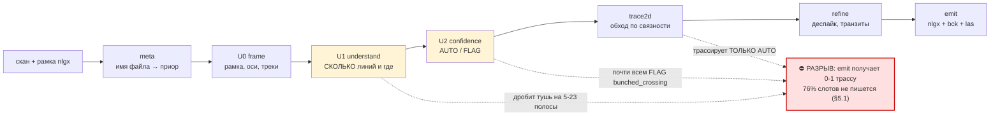
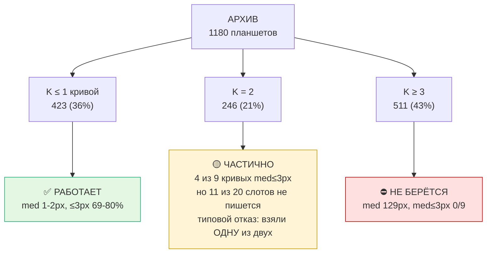
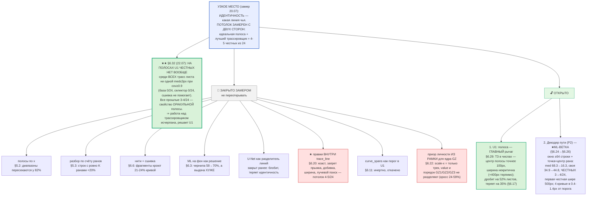
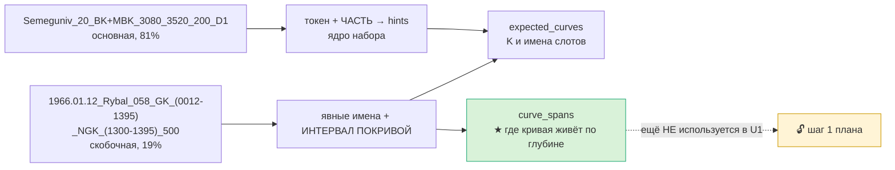

# ROADMAP — РАСПОЗНАВАНИЕ И ТОЧНОСТЬ ЛИНИЙ

<!-- ОГЛАВЛЕНИЕ: собирается `_roadmap_index.py`, руками не править -->

## Оглавление журнала

Разделов: **235**, новые сверху. Метка: ★ действующий (звёзды — оценка автора),
⚠ с оговоркой, ⛔ отозван или закрыт отрицательно — такой раздел ЦИТИРОВАТЬ НЕЛЬЗЯ,
он оставлен, чтобы ошибку не повторили. Собирается `digitizer/rnd/_roadmap_index.py`.

| § | | о чём |
|---|---|---|
| **6.230** | ★★ | РАСКЛАДКА, ПЕРЕОБУЧЕННАЯ НА КЭШЕ ТРАСС, ЧЕСТНО ПО ФОЛДАМ СКВАЖИН |
| **6.229** | ★★★ | ПОЧЕМУ 470 КРИВЫХ С ЧЕСТНЫМ КАНДИДАТОМ НЕ ПОПАДАЮТ В ВЫДАЧУ; ДОБОР СВОБОДНОЙ ЛИНИЕЙ НА МЕСТО ДУБЛЯ |
| **6.228** | ★★★ | ДВЕ КРИВЫЕ ТРЕКА НА ОДНОЙ ЛИНИИ: 476 ПАР, ГДЕ ДУБЛЬ ЗАНИМАЕТ МЕСТО НЕ ВЗЯТОГО ЭТАЛОНА; §6.226 ИСТОРИЯ — НИЖЕ ПОРОГА |
| **6.227** | ★★★ | ПРИГОВОР A/B СЕЛЕКТОРА `dag` (§6.220): НЕ ПРИНЯТ — СТЕНД «НА СВОИХ ТРАЕКТОРИЯХ» ПЕРЕОЦЕНИЛ ВЫИГРЫШ |
| **6.226** | ★★ | СЕЛЕКТОР С КАНАЛОМ ИСТОРИИ СВОЕЙ ТРАССЫ — ТО, ЧТО В ТЕСТЕ VLM ДАВАЛИ ЗЕЛЁНЫЕ ТОЧКИ |
| **6.225** | ★★ | СЕЛЕКТОР С ШИРОКИМ ОКНОМ: ±160 СТРОК И ±192 PX ВМЕСТО ±64 / ±96 — ПРОВЕРКА ДОВОДА ТЕСТА VLM |
| **6.224** | ★★ | ПЕРЕБОР РУЧЕК РАСКЛАДКИ И ВЫБОРА ПУТИ ПОВТОРОМ С КЭША — КРИТЕРИЙ ЗАДАН ДО ПРОГОНА |
| **6.223** | ★★★ | АУДИТ ПРОЕКТА 26.09: 29 ПОДТВЕРЖДЁННЫХ НАХОДОК, ≈ 216 ГБ В КАРАНТИН, ЕДИНАЯ ПАПКА; ПРАВИЛО СЛОТА НЕ ВИДЕЛО ПУСТЫХ СЛОТОВ — ЗАМЕР ПОВТОРОМ С КЭША |
| **6.222** | ★★★ | КЭШ ТРАСС ПОБАЙТНО РАВЕН A/B НА ВСЁМ ПОЛЕ → БЫСТРЫЙ СЕЛЕКТОР В ПРОДЕ; РЕГУЛЯТОР НЕ ВИДЕЛ ПОЛОВИНЫ СЧЁТА; ГЛАЗ (VLM) РАЗЛИЧАЕТ ЛИНИИ ТАМ, ГДЕ СЕЛЕКТОР  |
| **6.221** | ★★★ | СЕЛЕКТОР НА СОБСТВЕННЫХ ТРАЕКТОРИЯХ: НОВЫЙ БРОСАЕТ ЖИВУЮ ЛИНИЮ НА 35% РЕЖЕ; ИСКУССТВЕННЫЕ СОСТОЯНИЯ ЭТО ЗАНИЖАЛИ; DAgger-РАУНД ЗАПУЩЕН |
| **6.220** | ★★★ | СЕЛЕКТОР НА ПОЛНОМ КОРПУСЕ: ПРОД-СЕЛЕКТОР ВИДЕЛ 25 ЛИСТОВ — ОБУЧАЕМ НА 600 ИЗ 111 СКВАЖИН, ДЕРЖАННЫХ ОТ ПОЛЯ И СОРТА A; КРИТЕРИЙ ЗАДАН ДО ПРОГОНА |
| **6.219** | ★★★ | ДЕРЖАННЫЙ СОРТ A ПОДТВЕРДИЛ ВСЕ ТРИ ПРАВКИ; ИМЕНА §6.215 ВКЛЮЧЕНЫ В ПРОД; АНАТОМИЯ УХОДА ПЕРЕСЧИТАНА БЕЗ ДВОЙНОГО СЧЁТА — ПОТЕРЯ В ВЕДЕНИИ, А НЕ В ВЫБ |
| **6.218** | ★★★ | ИСПОЛНЕНИЕ ПЛАНА АУДИТА (25.09): КОММИТ; ДЕРЖАННЫЙ СОРТ A ЗАПУЩЕН С КРИТЕРИЕМ; СЕЛЕКТОР БЫСТРЕЕ ПРИ ПОБАЙТНО ТОЙ ЖЕ ВЫДАЧЕ; ПОТЕРИ НА МНОГОКРИВЫХ ТРЕК |
| **6.217** | ★★★ | АУДИТ ВЕТКИ (25.09): ПРИГОВОРЫ §6.215 И bg1; ПОЛЕ НА 44% ИЗ НЕПРОВЕРЕННОГО ЭТАЛОНА, ПРИРОСТ ТРЁХ ПРАВОК НА СОРТЕ A ПОЧТИ НУЛЕВОЙ; 312 ЛИСТОВ СОРТА A И |
| **6.216** | ★★★ | ПОЧЕМУ НЕ ХВАТАЕТ ТОЧНОСТИ: ПОСТАТЕЙНЫЙ УЧЁТ ВСЕХ 2737 КРИВЫХ ПОЛЯ ПОСЛЕ ТРЕТЬЕЙ ПРАВКИ. 57% ПОТЕРЬ = ПЕРЕСКОКИ НА СОСЕДА НА ПЛОТНЫХ ТРЕКАХ + БЛЕДНЫЕ/ |
| **6.215** | ★★★ | ИМЕНА (B4): РАЗРЫВ 375 РАЗОБРАН — 270 СВЯЗАНЫ С ПРОМАХАМИ ГЕОМЕТРИИ, 105 ЧИСТЫХ; ШАБЛОН ЗНАЕТ ПОЛОСУ И НОЛЬ ШКАЛЫ КАЖДОГО СЛОТА, А РАСКЛАДКА — НЕТ: ЗА |
| **6.214** | ★★★ | РАЗРЫВ «БЕЗЫМЯННЫЙ → ИМЕННОЙ» = 375 КРИВЫХ (34% БЕЗЫМЯННОГО СЧЁТА), ВЕСЬ НА МНОГОКРИВЫХ ТРЕКАХ: 119 ПЕРЕСТАНОВОК ВНУТРИ СЕМЕЙСТВА + 256 ЧУЖИХ КОРНЕЙ Н |
| **6.213** | ★★★ | ПРИНЯТО 21.09 (1144 → 1171). ВЫБОР ПО СЛОТУ ОТКРЫТ ЗАНОВО: ЗАКРЫТИЕ §6.201 БЫЛО АРТЕФАКТОМ НЕОРИЕНТИРОВАННЫХ ПРИЗНАКОВ. ОРИЕНТИРОВАННАЯ ДЛИНА (AUC 0.7 |
| **6.212** | ⛔ | ★★★★★ ПУЛОВЫЙ СТЕНД ДЕКОДЕРА БЫЛ «ДЕРЖАННЫМ» НЕ ТЕМ ФОЛДОМ: 499 ТРЕКОВ ИЗ 528 ОЦЕНИВАЛИСЬ ЧЕКПОЙНТОМ, ВИДЕВШИМ СКВАЖИНУ. ВСЕ ПУЛОВЫЕ ЧИСЛА §6.140 И §6 |
| **6.211** | ★★★ | НА ПЛОТНЫХ ТРЕКАХ ДЕКОДЕР ПРОИГРЫВАЕТ ПРОДУ 228 ПРОТИВ 333 — ВЫБОР ПУТИ ПРАВ, ЧТО ЕГО НЕ ПУСКАЕТ. КРИТЕРИЙ ДЛЯ ВАРИАНТА С ФОНОВЫМ ЧЛЕНОМ — ПО ОТГРУЗКЕ |
| **6.210** | ⛔ | ★★★★ ПОРОГ ПИКОВ НА ОТГРУЗКЕ — ОТКАЗ: 0.3 → −14 (p = 0.25), 0.2 → −37 (↑37/↓76, p = 0.003) ПРИ ПУЛОВЫХ +49 И +68. ПУЛОВЫЙ ВЫИГРЫШ НЕ ПЕРЕЕХАЛ — ТРЕТИЙ |
| **6.209** | ★★★ | ФОРМАЛЬНЫЙ A/B §6.204 НА 1123 ЛИСТАХ — ПРИНЯТО: 1107 → 1144 БЕЗЫМЯННЫХ (+37, ↑28/↓4, p < 0.00001), 732 → 750 ИМЕННЫХ. ЭКРАН §6.205 ПРЕДСКАЗАЛ РОВНО ЭТ |
| **6.208** | ★★★ | ГДЕ ДЕКОДЕР ТЕРЯЕТ ОСТАЛЬНОЕ: ПОКРЫТИЕ — НИ РАЗУ, «УВОД > 100 px» НА ПЛОТНЫХ ТРЕКАХ — 255 ИЗ 625. ПРОТИВ НЕГО В КОДЕ ЛЕЖИТ НЕИЗМЕРЕННЫЙ ФОНОВЫЙ ЧЛЕН Л |
| **6.207** | ★★★ | ПОРОГ ПИКОВ ДЕКОДЕРА 0.6·max ТЕРЯЕТ БЛЕДНЫЕ КРИВЫЕ: 0.3 ДАЁТ +49 (+3.4 п.п.) НА ПУЛОВОМ ПУТИ, ВСЕ ПЯТЬ ФОЛДОВ ВВЕРХ. КРИТЕРИЙ ДЛЯ ОТГРУЗКИ ЗАДАН ДО ПР |
| **6.206** | ⛔ | ★★★ ПРАВКА §6.205 ТЕЧЁТ ЧЕРЕЗ ПОРОГ ВЫБОРА ПУТИ НА 24 ТРЕКАХ — НО УТЕЧКА СТОИТ +4 ПРИ p = 0.61: ВАРИАНТ K2 НЕ ПРИНЯТ, ОСТАЁТСЯ K (11-12.09) |
| **6.205** | ★★★ | ПРАВКА §6.204 ПРОШЛА ЭКРАН: НА 125 ЗАТРОНУТЫХ ЛИСТАХ +37 БЕЗЫМЯННЫХ (↑28/↓4, p < 0.0001) И +18 ИМЕННЫХ; НА ОСТАЛЬНЫХ 998 ВЫДАЧА НЕ МЕНЯЕТСЯ ПО ПОСТРОЕ |
| **6.204** | ★★★ | ДЕКОДЕР ОГРАНИЧЕН ЧИСЛОМ ЛИНИЙ U1: НА 124 ТРЕКАХ U1 НЕДОСЧИТАЛ, ТАМ 106 ПРОВОДИМЫХ КРИВЫХ НЕ БЕРЁТ НИКТО, А НЕДОСЧЁТ НА ОДНУ СТОИТ 9.5 п.п. ПРОТИВ 1.6 |
| **6.203** | ⛔ | ★★★ ВЫСОТА ОКНА ИНФЕРЕНСА НЕ СТОИТ НИЧЕГО: 44.0% ПРИ 512 СТРОКАХ, 43.8% ПРИ 128, 44.6% ПРИ 256 (ВЫСОТА КРОПОВ ОБУЧЕНИЯ) — ВТОРОЙ КАНДИДАТ B1b ЗАКРЫТ,  |
| **6.202** | ⛔ | ★★★ ШВЫ ОКОН ДЕКОДЕРА СТОЯТ 3 п.п. ПОСТРОЧНОЙ ТОЧНОСТИ НА 10% СТРОК И НОЛЬ ПО ВЕРТИКАЛИ — ПЕРВЫЙ КАНДИДАТ B1b ЗАКРЫТ ЗАМЕРОМ (11.09) |
| **6.201** | ⛔ | ★★★★★ ВЫБОР ПУТИ ПО СЛОТУ ЗАКРЫТ: ОБУЧЕННОЕ ПРАВИЛО ДАЁТ −8…+4 ИЗ +189 ПО 21 РАСКЛАДКЕ ФОЛДОВ. ПЕРЕВОРОТ СЛОТА ВРЕДИТ ВТРОЕ ЧАЩЕ, ЧЕМ ПОМОГАЕТ (11.09) |
| **6.200** | ★★★ | ОБУЧЕННЫЙ ДЕТЕКТОР УЖЕ ЕСТЬ И ДАЁТ ТО, ЧЕГО НЕ ДАЁТ U1: ТАМ, ГДЕ ЛИНИЯ U1 НЕВЕРНА, ОН БЕРЁТ 309 ПРОТИВ 255 У НЫНЕШНЕГО ПРОДА. ОСТАТОК — НЕ ОБНАРУЖЕНИЕ |
| **6.199** | ⛔ | ★★★★ ОТБОР ИЗ ВЫДАЧИ U1 ЗАКРЫТ ОКОНЧАТЕЛЬНО: ЛЮБОЙ TOP-K ХУЖЕ, ЧЕМ ВЗЯТЬ ВСЁ (11.09) |
| **6.198** | ⛔ | ★★★★★ ПЕРЕСБОРКА ЛИНИЙ ИЗ РАНОВ ЗАКРЫТА: ПОТОЛОК ВСЕГО +9 п.п. НАД ПРОДОМ, А РЕАЛЬНЫЙ РЕШАТЕЛЬ ДАЁТ ВТРОЕ МЕНЬШЕ ПРОДА (11.09) |
| **6.197** | ★★★ | ВЕСЬ ОСТАВШИЙСЯ ЗАПАС (+509 КРИВЫХ, +53%) ЛЕЖИТ ТАМ, ГДЕ ЛИНИЯ U1 НЕВЕРНА — И ТАМ, ГДЕ ОНА ВЕРНА, ПРОД УЖЕ НА ПОТОЛКЕ (11.09) |
| **6.196** | ★★★ | ВЕСЬ НЕДОБОР РАЗДЕЛЁН НАДВОЕ: 658 КРИВЫХ ТЕРЯЮТСЯ ТАМ, ГДЕ ЛИНИЯ УЖЕ НАЙДЕНА, 1114 — ГДЕ НЕ НАЙДЕНА. И ПРОМАХ В 3-10px СТОИТ 90% КРИВЫХ (10.09) |
| **6.195** | ★★★ | ВЫБИРАТЬ НЕ ИЗ ЧЕГО: НУЖНЫЕ КРИВЫЕ ЕСТЬ СРЕДИ КАНДИДАТОВ U1 ЛИШЬ НА 21% ТРЕКОВ. И ЭТО НЕ ПРО ПУЧКИ — САМАЯ КРУПНАЯ КОРЗИНА «0 ИЗ 1» (10.09) |
| **6.194** | ★★★ | УЗКОЕ МЕСТО ВЫШЕ ДЕКОДЕРА: U1 НАХОДИТ ЛИНИЮ ЛИШЬ НА 43% ОЦИФРОВАННЫХ КРИВЫХ, ВЫДАВАЯ ИХ ВДВОЕ БОЛЬШЕ, ЧЕМ НУЖНО (08.09) |
| **6.193** | ★★★ | ЛОКАЛЬНЫЙ СИГНАЛ ЕСТЬ (AUC 0.86 НА ДВУХ ТРИВИАЛЬНЫХ ПРИЗНАКАХ), НО ОН СОКРАЩАЕТ РАЗВИЛКИ ЛИШЬ ВТРОЕ. НЕДОСТАЮЩЕЕ ЗНАНИЕ — НЕ ЛОКАЛЬНОЕ (08.09) |
| **6.192** | ★★★ | ПОТОЛОК СБОРКИ ВДВОЕ ВЫШЕ ПРОДА (50.8% ПРОТИВ 27.1%) — НО РЕШЕНИЙ НЕ 54, А ТЫСЯЧИ. ПОПРАВКА К §6.191 (07.09) |
| **6.191** | ★★★ | ЗАДАЧА — НЕ «ВЕСТИ 16 000 СТРОК», А РАЗРЕШИТЬ 54 УЗЛА. 90.6% МАТЕРИАЛА ОДНОЗНАЧНЫ (06.09) |
| **6.190** | ★★★ | ДЕКОДЕР НЕ ОШИБАЕТСЯ — ОН ВЕДЁТ НАСТОЯЩИЕ ЛИНИИ, КОТОРЫХ НЕТ В ЭТАЛОНЕ. 85% «ПРОМАХОВ» ЛЕЖАТ НА ТУШИ, И ЭТО НЕ ПЕРЕВЫНОСЫ (06.09) |
| **6.189** | ★★★ | B1 РАЗОБРАН ДО АДРЕСА: ДЕКОДЕР НА ПУЧКЕ НЕ НЕТОЧЕН — ОН ВЕДЁТ НЕ ТО. 368 ТРАСС ИЗ 721 НЕ ЛЕЖАТ НИ НА ОДНОЙ ОЦИФРОВАННОЙ КРИВОЙ (06.09) |
| **6.188** | ★★★ | ПРИЁМКА ПРОЙДЕНА: 966 → 1107 БЕЗЫМЯННЫХ И 662 → 732 ИМЕННЫХ НА ОТГРУЖАЕМОМ ПУТИ. И СТОРОЖ, КОТОРЫЙ ДОЛЖЕН БЫЛ ЭТО ОБЪЯВИТЬ, УМЕР ЗА СУТКИ ДО СРОКА (06 |
| **6.187** | ★★★ | ПРИЧИНА ПРОВЕРЕНА БЕЗ ЕДИНОГО ПРОГОНА — И ОНА НЕ ТА, ЧТО НАЗВАНА. НА K = 3-4 ДЕКОДЕР НА 333 КРИВЫЕ НИЖЕ ПОТОЛКА, КОТОРЫЙ У НЕГО УЖЕ ЕСТЬ (05.09) |
| **6.186** | ★★★ | ОСТАНОВКА СТОИЛА ЧАСОВ, ПОТОМУ ЧТО ДАМП ПИСАЛСЯ ОДИН РАЗ. ТЕПЕРЬ — ЛИСТОВ. И У СЧЁТА ПОЯВИЛСЯ ПУЛЬТ (05.09) |
| **6.185** | ★★★ | НАПРАВЛЕНИЕ ИЗМЕРЕНО ДО НАЧАЛА: 58% ВСЕГО НЕДОБОРА ЛЕЖИТ НА ТРЕКАХ K ≥ 3, И ТАМ ДЕКОДЕР СЛАБЕЕ ПРОДА В ПОЛТОРА РАЗА (05.09) |
| **6.184** | ★★★ | ПРЕДГЕЙТ ВНЕСЁН В ПРОД. `auto/**` ОТКРЫТ ВПЕРВЫЕ ЗА ВЕТКУ; КРИТЕРИЙ ПРИЁМКИ — 1109 БЕЗ ИМЕНИ И 732 С ИМЕНЕМ (05.09) |
| **6.183** | ⛔ | ★★★★ ТОЧКА ВХОДА ВРАЛА О ПРОДЕ ДВЕ НЕДЕЛИ: В ТАБЛИЦЕ «ЧТО СЕЙЧАС В ПРОДЕ» СТОЯЛА КОНФИГУРАЦИЯ ДО 20.08. ТЕПЕРЬ ЭТО ПРОВЕРЯЕТ МАШИНА (05.09) |
| **6.182** | ⛔ | ★★★ РЕАЛИЗУЕМАЯ ЧАСТЬ СИГНАЛА §6.181 БЕРЁТ ЛИШЬ +13 ИЗ +43 И НЕ ПЕРЕЖИВАЕТ ПОПРАВКИ НА МНОЖЕСТВЕННОСТЬ. НАПРАВЛЕНИЕ ЗАКРЫТО ЦЕЛИКОМ (04.09) |
| **6.181** | ★★★ | КОНТЕКСТ ЛИСТА ДАЁТ ПОТРЕКОВОМУ ВЫБОРУ +43 (p = 0.0034) — НО РЕАЛИЗОВАТЬ ЭТО СЕГОДНЯ НЕЛЬЗЯ, И ВЕТКА УЖЕ УПИРАЛАСЬ В ЭТУ СТЕНУ (04.09) |
| **6.180** | ⛔ | ★★★ КОМБИНАЦИЯ ВСЕХ 60 ПРИЗНАКОВ ЛИСТА НЕ ОБГОНЯЕТ ОДИН ПОРОГ: 1123 ПРОТИВ 1109 ПРИ p = 0.13. НАПРАВЛЕНИЕ ЗАКРЫТО (04.09) |
| **6.179** | ★★★ | ЗАЗОР ДО ОРАКУЛА РАЗЛОЖЕН: ЕГО ДЕРЖАТ ДВЕ ПРОТИВОПОЛОЖНЫЕ ОШИБКИ ОДНОГО ПОРЯДКА ⇒ НУЖЕН ДРУГОЙ ПРИЗНАК, А НЕ ДРУГОЙ ПОРОГ. И ПОТОЛОК НЕ РАНЖИРУЕТ КОНФ |
| **6.178** | ★★★ | ПРЕДГЕЙТ СТОИТ НЕ НА СЧАСТЛИВОМ ПОРОГЕ, А НА ПОЛКЕ ШИРИНОЙ 0.10; И ЕГО ЧИСЛО — ОТГРУЗОЧНОЕ, ЧТО ПРОВЕРЕНО ПОБАЙТОВО (04.09) |
| **6.177** | ★★★ | ЧЕСТНАЯ ЦЕНА ОБУЧЕННОГО ВЫБОРА ЗАМЕРЕНА: +116 К ПРОДУ, +46 К ПОРОГУ (p = 0.0055). НО ПРЕДГЕЙТ И ОБУЧЕННЫЙ ВЫБОР — ЭТО ОДИН И ТОТ ЖЕ ВЫИГРЫШ, ВЗЯТЫЙ ДВ |
| **6.176** | ★★★ | ДИНАМИЧЕСКИЙ РЕГУЛЯТОР: БОЛЬШЕ ШАРДОВ В ПРОСТОЕ, МЕНЬШЕ ПОД РУКОЙ. ПРЕЖНИЙ РЕГУЛЯТОР МОЛЧА НЕ РАБОТАЛ ГОД (03.09) |
| **6.175** | ★★★ | ЧЕСТНАЯ ЦЕНА ОБУЧЕННОГО ВЫБОРА: КОМПОЗИЦИЯ ДАЁТ +14 К ПОРОГУ, НО САМА КОМПОЗИЦИЯ ОТКАЗАНА СОБСТВЕННОЙ ПРОВЕРКОЙ — ИДЁТ ПРОГОН (03.09) |
| **6.174** | ★★★ | ЧЕТЫРЕ СТЕНДА ПОДМЕНЯЮТ ФУНКЦИЮ, КОТОРУЮ ПРОД ПЕРЕСТАЛ ВЫЗЫВАТЬ 10.08. ИХ ЧИСЛА — ИСТОРИЯ, А НЕ ПОВТОРЯЕМЫЙ ЗАМЕР (03.09) |
| **6.173** | ⛔ | АУДИТ ПРОД-КОДА, ЕДИНСТВЕННОЙ НИ РАЗУ НЕ ПРОВЕРЕННОЙ ОБЛАСТИ: ШЕСТЬ КОММЕНТАРИЕВ ПРОДА ОБОСНОВЫВАЮТ СЕБЯ ОТОЗВАННЫМИ ЧИСЛАМИ, А ПРАВИЛО РАСКЛАДКИ В ПР |
| **6.172** | ★★★ | §6.163 ПЕРЕСЧИТАН СТЕНДОМ И ВЫРОС ВДВОЕ ПО ОБЪЁМУ: НА 1081 ЛИСТЕ МОДЕЛЬ ОБГОНЯЕТ ЛУЧШИЙ ПОРОГ ЗНАЧИМО (+32, p = 0.034), А НЕ «НАПРАВЛЕНИЕМ» (03.09) |
| **6.171** | ★★★ | СУТКИ СЧЁТА СТЁРТЫ СОБСТВЕННЫМ ДРАЙВЕРОМ: «ВОЗОБНОВЛЯЕМЫЙ» БЫЛ ВОЗОБНОВЛЯЕМ ЦЕЛИКОМ, А НЕ ПОШАРДНО (03.09) |
| **6.170** | ★★ | НАГРУЗКА: ПРИОРИТЕТ БЫЛ УЖЕ НИЗКИЙ, ТОРМОЗИЛО ЧИСЛО ПОТОКОВ. ПРИОСТАНОВКА ВМЕСТО УБИЙСТВА (02.09) |
| **6.169** | ★★★ | ЗАМЕР ДОСЧИТАН: ОБУЧЕННЫЙ ВЫБОР 1126 ПРОТИВ 1075 У ПОРОГА (+51, p = 0.0001). ПРЕДРЕГИСТРИРОВАННОЕ ПРАВИЛО ВЗЯТО ВТРОЕ (02.09) |
| **6.168** | ★★ | БЕЗ КОНСОЛЬНЫХ ОКОН: ТИК ЗАПУСКАЕТСЯ НЕВИДИМО, А СОСТОЯНИЕ ЗАМЕРА ЧИТАЕТСЯ ИЗ ФАЙЛОВ (02.09) |
| **6.167** | ★★★ | ДИСК: 243 ГБ В ПРОГОНАХ, ИЗ НИХ 162 ГБ — ОВЕРЛЕИ, КОТОРЫХ НЕ ЧИТАЕТ НИ ОДИН СТЕНД (01.09) |
| **6.166** | ★★★ | СКЕПТИЧЕСКИЙ АУДИТ: ФОЛД ПОТЕРЯЛ ДВА ЛИСТА, И ОБА КОНТРОЛЁРА ЭТОГО НЕ ВИДЕЛИ — ОНИ СЧИТАЛИ ФАЙЛЫ ШАРДОВ, А НЕ ЛИСТЫ (01.09) |
| **6.165** | ★★★ | КОНСОЛИДАЦИЯ ДОКУМЕНТОВ: 15 ФАЙЛОВ ВРАЗБРОС → 7 С ОДНОЙ ЗАДАЧЕЙ КАЖДЫЙ. И МАШИННОЕ ОГЛАВЛЕНИЕ ЖУРНАЛА СРАЗУ НАШЛО ДВА ДЕФЕКТА В САМОМ ИСТОЧНИКЕ ИСТИНЫ |
| **6.164** | ⛔ | ПЛАНИРОВЩИК ЗАДАЧ НЕ СПАСАЕТ: ЗАДАЧА УМЕРЛА С КОДОМ STATUS_CONTROL_C_EXIT ВМЕСТЕ С СЕССИЕЙ. ПРАВИЛО 8 ПОПРАВЛЕНО (01.09) |
| **6.163** | ★★★ | ВЫИГРЫШ ОБУЧЕННОГО ВЫБОРА НЕ СВОДИТСЯ К «ВЗЯТЬ ПОРОГ ПОЖЁСТЧЕ»: ПЕРЕНАСТРОЙКА ПОРОГА ДАЁТ +5 ДЕРЖАННО, МОДЕЛЬ — +26 (p = 0.0038) (01.09) |
| **6.162** | ★★★ | «ВЫБОР ПО ТРЕКУ» — ЭТО ВЫБОР ПО ЛИСТУ (95.7% ЛИСТОВ ОДНОТРЕКОВЫЕ), И УТЕЧКА У ОБУЧЕННОГО ВЫБОРА НЕ СИММЕТРИЧНА ПОРОГУ (01.09) |
| **6.161** | ★★★ | ПРЕДГЕЙТ ПО ЛИСТУ РАБОТАЕТ И НА ЧЕСТНОМ ПРОГОНЕ: +147 КРИВЫХ (+15.2%) ПРОТИВ +70 У ПОРОГА, ПРИ ДЕКОДЕРЕ НА 63% ЛИСТОВ ВМЕСТО 100%. ПЕРВЫЙ ОТВЕТ («не р |
| **6.160** | ★★★ | ЦЕНА ВТОРОГО ПУТИ ЗАМЕРЕНА: ≈×1.5-1.6 НА GPU, ×2.4-2.5 НА CPU. «ДЕКОДЕР ВТРОЕ ДОРОЖЕ ПРОДА» — НЕ ЗАМЕР, И ОН НЕВЕРЕН В 21 РАЗ (01.09, поправлено после |
| **6.159** | ★★★ | ОБУЧЕННЫЙ ВЫБОР, ФОЛД 0 НА ОТГРУЗКЕ: +8 К ПОРОГУ (p = 0.22). И ДЕФЕКТ ШКАЛЫ В САМОМ СТЕНДЕ — ПРАВИЛО ЧТЕНИЯ ЧИТАЛОСЬ НЕ ПО ТОЙ МЕТРИКЕ (31.08) |
| **6.158** | ★★★ | ФОЛД 0 ТИПИЧЕН ⇒ +70 (§6.157) ПЕРЕНОСИТСЯ НА НЕЗНАКОМУЮ ПЛОЩАДЬ (31.08) |
| **6.157** | ★★★ | ЧЕСТНАЯ ДЕРЖАННОСТЬ: ВЫБОР ПУТИ СТОИТ +70 (+7.3%), А НЕ +104. УТЕЧКА БЫЛА, НО ОНА ОБЪЯСНЯЛА ТРЕТЬ, А НЕ 86% — §6.156 ПОПРАВЛЕН (30.08) |
| **6.156** | ⛔ | ★★★★★ 86% ИЗ +104 (§6.150) ПРИХОДИТ С ПОЛОВИНЫ, ГДЕ ДЕКОДЕР УЖЕ ВИДЕЛ СКВАЖИНУ. НА ЧЕСТНО ДЕРЖАННЫХ ОСТАЁТСЯ +14 (29.08) |
| **6.155** | ⛔ | ЗАЩИТА ОТ ВЫРОЖДЕННОГО ЦВЕТОВОГО КАНАЛА: ДЕФЕКТ РЕАЛЕН, ПРАВКА ЧИСТА, КРИВЫХ НЕ ДАЁТ (+1, p = 1.0) (29.08) |
| **6.154** | ★★★ | РУЧКА, КОТОРУЮ НИКТО НЕ ПРОГОНЯЛ, — НЕ РУЧКА: `rowdec_pick_model` БЫЛА НЕДОСТИЖИМА, И ЭТО НЕ УПАЛО, А ДАЛО ПРАВДОПОДОБНОЕ ЧИСЛО (28.08) |
| **6.153** | ⛔ | ★★★★★ `auto5` НЕ ДЕРЖИТ СКВАЖИНУ: 51% ЛИСТОВ ОТГРУЗКИ ДЕКОДИРУЕТ МОДЕЛЬ, ОБУЧАВШАЯСЯ НА ЭТОЙ ЖЕ СКВАЖИНЕ (29.08) |
| **6.152** | ⛔ | ★★★★★ ВОПРОС §6.151 ЗАКРЫТ ОТРИЦАТЕЛЬНО: ТОЧКА НЕ УЕЗЖАЕТ НИКУДА. ТРАССА СИДИТ РОВНО В ЦЕНТРЕ СВОЕГО РАНА, А ПОЛОСУ 3-10px ДЕРЖИТ ВЫБОР РАНА — ТО ЕСТЬ |
| **6.151** | ★★★ | ПОЛОСА 3-10px ОБЪЯСНЕНА ДО КОНЦА: ЭТО ТОЛСТЫЙ ШТРИХ (12px ПРОТИВ 8px У ЧЕСТНЫХ), ЭКСПЕРТ СИДИТ В ЕГО ЦЕНТРЕ, СЛИПАНИЯ НЕТ (27.08) |
| **6.150** | ★★★ | ВЫБОР ПУТИ ПОДТВЕРЖДЁН НА ОТГРУЗКЕ: 971 → 1075, +104 КРИВЫЕ (+10.7%), p < 0.00001. ПРЕДРЕГИСТРИРОВАННЫЙ ПОРОГ ВЗЯТ ВДВОЕ (24.08) |
| **6.149** | ★★★ | ПОЛОСА 3-10px РАЗДЕЛЕНА ПО ИЗОБРАЖЕНИЮ: 68% ТРАСС СИДЯТ НА СВОЕЙ ЖЕ ТУШИ, 29% СОШЛИ НА СОСЕДА. СИСТЕМНОГО СДВИГА НЕТ И ЗДЕСЬ (24.08) |
| **6.148** | ★★★ | САМАЯ БОЛЬШАЯ КОРЗИНА ВСКРЫТА: 1396 КРИВЫХ, КОТОРЫХ НЕ БЕРЁТ НИ ОДИН ПУТЬ, — ЭТО НА 85% ГЕОМЕТРИЯ, А НЕ ПОКРЫТИЕ (24.08) |
| **6.147** | ⚠ | ★★★★★ §6.146 ПОВТОРИЛСЯ В ТОТ ЖЕ ДЕНЬ, УЖЕ НА ОБУЧЕННОМ ВЫБОРЕ: МОДЕЛЬ УЧИЛАСЬ НА ПРИЗНАКАХ ВЫДАННЫХ КРИВЫХ, А РЕШАЕТ ПО ПРИЗНАКАМ РАСКЛАДКИ (24.08) |
| **6.146** | ⚠ | ★★★★★ ПРОГОН ПОЙМАЛ ПОДМЕНУ ПРИЗНАКА: ВЫИГРЫШ СЧИТАЛСЯ ПО ТОМУ, ЧТО ДЕКОДЕР НАПИСАЛ, А МЕХАНИЗМ РЕШАЛ ПО ТОМУ, ЧТО ОН ПОВЁЛ. ЦЕНА — 14 КРИВЫХ ИЗ 20 (2 |
| **6.145** | ★★★ | ОБУЧЕННЫЙ ВЫБОР ПУТИ БЕРЁТ ПОЛОВИНУ ДОСТУПНОГО: 1129 ПРОТИВ 978 У ЛУЧШЕГО ПУТИ И 1084 У ПОРОГА, ДЕРЖАННО ПО СКВАЖИНАМ (24.08) |
| **6.144** | ★★★ | ПРЕИМУЩЕСТВО ДЕКОДЕРА НЕ ИСЧЕЗЛО, А ПЕРЕРАСПРЕДЕЛИЛОСЬ: 779 КРИВЫХ ИЗ 2760 ПУТИ БЕРУТ ПО-РАЗНОМУ. ВЫБОР ПУТИ ПО ТРЕКУ ДАЁТ +88 НА ДЕРЖАННЫХ СКВАЖИНАХ  |
| **6.143** | ⛔ | ★★★★★ БЕЗЫМЯННЫЙ ВЫИГРЫШ ДЕКОДЕРА НЕ ВОСПРОИЗВОДИТСЯ: НА ЗАМОРОЖЕННОМ НАБОРЕ +2 КРИВОЙ, А НЕ +61. ИМЕННАЯ ЦЕНА ПОДТВЕРЖДЕНА ТОЧНО (24.08) |
| **6.142** | ★★★ | ЦВЕТ ПОД ТРАЕКТОРИЕЙ МЕРИТСЯ НА 99%, НО РАЗРЕШАЕТ ЛИШЬ 13.5% ОШИБОК ПОДПИСИ. ПЕРЕНАЗНАЧЕНИЕ ДАЁТ +58 ПРИ ЦЕНЕ ПОДПИСИ −41 (24.08) |
| **6.141** | ★★★ | ДЕКОДЕР НА ОТГРУЗКЕ: +71 КРИВАЯ БЕЗ ИМЕНИ (p = 0.039), НОЛЬ С ИМЕНЕМ. ПЕРЕНОС СОСТОЯЛСЯ (22.08) |
| **6.140** | ★★★ | ПРОТОТИП ПОСТРОЧНОГО ДЕКОДЕРА ВЗЯЛ 41.4% ПРОТИВ 20.1% У ПРАВИЛА НА ДЕРЖАННЫХ СКВАЖИНАХ. НО ЛИЧНОСТЬ ДАЛА ЛИШЬ ЧЕТВЕРТЬ ВЫИГРЫША (21.08) |
| **6.139** | ⛔ | ★★★★ ПОРОГ ЦЕНЫ ПЕРЕХОДА НИ ПРИ ЧЁМ: НА КРИВЫХ С ЦЕПОЧКОЙ ШКАЛ ДЕКОДЕР НЕ ОБГОНЯЕТ «ВСЕГДА 0» (21.08) |
| **6.138** | ★★★ | ЦЕНА ПЕРЕХОДОВ НА ВЫДАЧЕ: 28.5% ГОТОВЫХ КРИВЫХ ПОРТИТ УРОВЕНЬ, А НЕ ГЕОМЕТРИЯ (21.08) |
| **6.137** | ⛔ | ★★★★★ МЯГКИЙ ПЕРЕДНИЙ ПЛАН НА ОТГРУЗКЕ: −55 КРИВЫХ. ЧЕРНИЛА — АКТИВ ДЕКОДЕРА, А НЕ ОБЩИЙ ШАГ (21.08) |
| **6.136** | ★★★ | ПОТОЛОК С МОСТИКОМ РАЗРЫВОВ — 82.2%, А НА КОРОТКИХ РАЗРЫВАХ 90.3%. §6.133 БЫЛ ЗАНИЖЕН ПО ПОСТРОЕНИЮ (20.08) |
| **6.135** | ★★★ | ФОРМА ШТРИХА ДЕРЖИТ ЛИЧНОСТЬ ЧЕРЕЗ ПЕРЕСЕЧЕНИЕ: 65-68% ПРОТИВ 37% У ПОЛОЖЕНИЯ. ШИРИНА СИЛЬНЕЕ ИЗВИЛИСТОСТИ (20.08) |
| **6.134** | ★★★ | РАЗРЫВ ИЗМЕРЕН С ОБЕИХ СТОРОН: ПРАВИЛО БЕЗ ОБУЧЕНИЯ БЕРЁТ 18.2% ПРИ ПОТОЛКЕ 60.1%. ЛИЧНОСТЬ СТОИТ ВШЕСТЕРО БОЛЬШЕ, ЧЕМ ПЕРЕДНИЙ ПЛАН (20.08) |
| **6.133** | ★★★ | ПОТОЛОК ПОСТРОЧНОГО ДЕКОДЕРА ПЕРЕВЕДЁН В КРИВЫЕ: 3977 ИЗ 6862 (58%) ПРОТИВ 989 У ПРОДА. ДЕРЖИТ ЕГО ПОКРЫТИЕ, А НЕ ИДЕНТИЧНОСТЬ (20.08) |
| **6.132** | ★★★ | ОБЕ ПРАВКИ ВМЕСТЕ: +119 КРИВЫХ (+22.8%) НА ОТГРУЗКЕ, p < 0.00001 — ГОТОВО К ВНЕДРЕНИЮ (19.08) |
| **6.131** | ★★★ | ФУНДАМЕНТ ДЛЯ СМЕНЫ ПОДХОДА: СУПЕРВИЗИИ В 2150 РАЗ БОЛЬШЕ, ЧЕМ ИСПОЛЬЗУЕТСЯ, А ЗАДАЧА ПО ПОЛОЖЕНИЮ РАЗРЕШИМА НА 95.5% (19.08) |
| **6.130** | ★★★ | СИГНАЛ «ПОРЯДОК ЗОНДОВ» ВЫНИМАЕТСЯ ДОБАВКОЙ: +91 КРИВАЯ НА ПУЛАХ, ОПТИМУМ ВНУТРЕННИЙ (19.08) |
| **6.129** | ★★★ | ЧТО ИМЕННО ПУТАЕТ РАСКЛАДКА: БРАТСКИЕ ЗОНДЫ ОДНОГО СЕМЕЙСТВА, А НЕ ЧТО ПОПАЛО (19.08) |
| **6.128** | ★★★ | ГЕЙТ ПОДТВЕРЖДЁН НА ОТГРУЗКЕ: +45 КРИВЫХ (+8.6%), p = 0.001 — ПЕРВАЯ ПРОД-ПРАВКА С ДОКАЗАТЕЛЬСТВОМ (19.08) |
| **6.127** | ★★★ | ВТОРАЯ ОСЬ ПРОДУКТА: РАНЖИРОВАНИЕ РАБОТАЕТ (ВТРОЕ), НО ДО «ПРОВЕРЕННОГО ПОДМНОЖЕСТВА» НЕ ДОТЯГИВАЕТ (17.08) |
| **6.126** | ★★★ | ЦЕНА ИМЕНИ — 454 КРИВЫЕ: БОЛЬШЕ ПОЛОВИНЫ НЫНЕШНЕГО СЧЁТА ТЕРЯЕТСЯ НА ПОДПИСИ, А НЕ НА ГЕОМЕТРИИ (17.08) |
| **6.125** | ★★★ | ДВА РЫЧАГА РАСКЛАДКИ ВМЕСТЕ: +97 КРИВЫХ (+9.8%) ВСЛЕПУЮ, p < 0.00001 — И ЭТО 10% ПОТОЛКА (16.08) |
| **6.124** | ★★★ | ЦЕНА ГЕЙТА `frac0.2` ИЗМЕРЕНА С ШУМОМ: 64 КРИВЫЕ, p = 0.0007 — САМЫЙ УВЕРЕННЫЙ ЭФФЕКТ ВЕТКИ (16.08) |
| **6.123** | ⛔ | ★★★★★ ПЕРЕКРЁСТНАЯ ПРОВЕРКА НА ВЫДАЧЕ: ПУЛОВОЙ ВЫИГРЫШ НЕ ПЕРЕНОСИТСЯ. −7 КРИВЫХ ПРИ ОБЕЩАННЫХ +49 (18.08) |
| **6.122** | ★★★ | СЛЕПОЙ НАБОР НАЙДЕН БЕЗ НОВЫХ ДАННЫХ: ПЕРЕКРЁСТНАЯ ПРОВЕРКА ПО СКВАЖИНАМ ДАЁТ 1814 ЛИСТОВ ВМЕСТО 337 — И ЭФФЕКТ «БОЛЬШЕ СКВАЖИН» ОКАЗАЛСЯ +3.9% (16.08 |
| **6.121** | ★★★ | «СЛЕДУЮЩИЙ ШАГ РАСКЛАДКИ» УЖЕ СДЕЛАН: У `a202` ПРОБЕЛА ДЛИНЫ НЕТ — НО ЗАСВИДЕТЕЛЬСТВОВАТЬ ЭТО НЕЧЕМ (16.08) |
| **6.120** | ★★★ | «+36» §6.115.2 ПРОВЕРЕНО ШУМОМ: ЦЕЛОЕ ХЛИПКО, А РАЗРЕЗ ПО ОБОБЩЕНИЮ — ПРОЧЕН (16.08) |
| **6.119** | ⛔ | ★★★★ ПОЛОСА 3-10px РАЗОБРАНА И ЗАКРЫТА: ПРОМАХ — МЕДЛЕННЫЙ УВОД, А ФИЛЬТР РЕЖЕТ СИГНАЛ (16.08) |
| **6.118** | ★★★ | ВОПРОС ПРО `a202` ЗАКРЫТ: ЧИСЛО ВЕРНОЕ, ВЫВОД ИЗ НЕГО БЫЛ НЕТ — +13 НЕОТЛИЧИМО ОТ ШУМА НАБОРА (16.08) |
| **6.117** | ⛔ | ★★★★★ ГЛАВНЫЙ СТЕНД ОТГРУЗКИ ПУТАЕТ ЛИСТЫ: ИМЯ КАТАЛОГА ОБРЕЗАНО ДО 40 СИМВОЛОВ (14.08) |
| **6.116** | ★★★ | СТЕНА ВЕДЕНИЯ ИЗМЕРЕНА НА КОРПУСЕ: У ПОЛОВИНЫ КРИВЫХ ЛУЧШАЯ ТРАССА ДАЛЬШЕ 30px (14.08) |
| **6.115** | ★★★ | ОПОРНОЕ РАЗЛОЖЕНИЕ ОПИСЫВАЛО ПРАВИЛО. ПОД ПРОДОМ РАСКЛАДКА БЕРЁТ ПОЛОВИНУ ДОСТУПНОГО, А ГЕЙТ СТОИТ 64 КРИВЫЕ (13.08) |
| **6.114** | ★★★ | ДОВОД ПРОТИВ `a202` — АСИММЕТРИЧНЫЙ ЗАМЕР: СОРТ A ЦЕЛИКОМ ЛЕЖИТ В ЕГО ОБУЧЕНИИ (13.08) |
| **6.113** | ⛔ | ★★★★★ МЕХАНИЗМ НАПИСАН И ДАЛ НОЛЬ: РЕЗЕРВ ПОКРЫТИЯ ЛЕЖИТ ЗА РАЗРЫВОМ ЧЕРНИЛ (13.08) |
| **6.112** | ★★★ | ПОД ПОЛОВИНОЙ ПРОПУЩЕННЫХ СТРОК ТУШЬ ЕСТЬ: ПОТОЛОК ПОКРЫТИЯ — 202 КРИВЫЕ (13.08) |
| **6.111** | ★★★ | КОРЗИНА ПОКРЫТИЯ ВСКРЫТА: ДВЕ ТРЕТИ ЕЁ — ВЕДЕНИЕ, А САМО ПОКРЫТИЕ ЛЕЖИТ В ДРУГОЙ КОРЗИНЕ (13.08) |
| **6.110** | ⛔ | RECALL-МОДЕЛЬ НА ВЫДАЧЕ: −6 КРИВЫХ. ГИПОТЕЗА «РАНЬШЕ ВЫИГРЫШ БЫЛО ЧЕМ СЪЕСТЬ» НЕ ПОДТВЕРДИЛАСЬ (13.08) |
| **6.109** | ⛔ | ★★★★ ПАДЕНИЕ ПРОДА НА ЧЁТНОЙ ДЛИНЕ ТРАССЫ; КОРПУС ВТРОЕ; У ТОЧНОСТИ НЕТ ОДНОЙ ЦИФРЫ (12.08) |
| **6.108** | ★★★ | ОБУЧЕННАЯ РАСКЛАДКА ВКЛЮЧЕНА: +20 КРИВЫХ НА ДЕРЖАННЫХ СКВАЖИНАХ. ГЕЙТ БЫЛ ПОДОБРАН ПОД СТАРЫЙ АРХИВ (10.08) |
| **6.107** | ★★★ | ПЕРВЫЙ ЗАМЕР НА ДЕРЖАННЫХ СКВАЖИНАХ: 20.5% ПРОТИВ 10.1%. ОПОРНОЕ ЧИСЛО ВЕТКИ ОПИСЫВАЛО ВЫБОРКУ, А НЕ ПАЙПЛАЙН (08.08) |
| **6.106** | ★★★ | ЧЕТЫРЕ ПРОД-РУЧКИ РЕШЕНЫ; У СТЕНДОВ ПОЯВИЛСЯ УКАЗАТЕЛЬ И ЛИНТ, У ДАННЫХ — ПРАВИЛО (08.08) |
| **6.105** | ★★★ | ОТБОР РАЗОБРАН: 77% ПОТЕРЬ ДАЁТ ОДИН КЛЮЧ СОРТИРОВКИ, НО ПЕРЕБОР ПОРЯДКОВ БЕРЁТ 7% РЕЗЕРВА (02.08) |
| **6.104** | ⚠ | ★★★★★ ОПОРНЫЕ ЧИСЛА ВЕТКИ ИЗМЕРЕНЫ НЕ В ТОЙ КОНФИГУРАЦИИ. И ОТБОР РАСТЁТ, А НЕ УБЫВАЕТ (02.08) |
| **6.103** | ⛔ | ★★★★ ВТОРОЙ ГЕНЕРАТОР В ПУЛ: +137 НА СТЕНДЕ, −2 НА ОТГРУЗКЕ. УЗКОЕ МЕСТО — ОТБОР (02.08) |
| **6.102** | ★★★ | СВИП ПАРАМЕТРОВ ПРОДА: ДЕЛО НЕ В ПОЛОСЕ, А В `wide_run`. +86 КРИВЫХ НА СТЕНДЕ (01.08) |
| **6.101** | ★★★ | СВЕРКА ПО СОСТАВУ: ДВА ТРАССИРОВЩИКА ДОПОЛНЯЮТ ДРУГ ДРУГА, +53 КРИВЫЕ (01.08) |
| **6.100** | ⛔ | КАЛИБРОВКА §6.97 И ВЫВОД ПРО `band_pad` ОТОЗВАНЫ: СТЕНД И ПРОД — РАЗНЫЕ АЛГОРИТМЫ (01.08) |
| **6.99** | ★★★ | ГЛОБАЛЬНОЕ РЕШЕНИЕ О ПУТИ РАБОТАЕТ: 8.3% → 11.6% ПРИ РАВНЫХ УСЛОВИЯХ (01.08) |
| **6.98** | ⛔ | ★★★★ ПРАВКА МАСКИ ОТДЕЛЬНО ДАЁТ МИНУС. ПОРЯДОК РАБОТ ПЕРЕСТРОЕН (01.08) |
| **6.97** | ★★★ | СТЕНД ВОСПРОИЗВЁЛ ОТГРУЗКУ: 7.9% ПРОТИВ 7.8%. ПОТЕРЯ — НА ПОЛОСЕ (01.08) |
| **6.96** | ★★★ | ПРИГОВОР ПО НАПРАВЛЕНИЮ: ПОРЯДОК РАБОТ И ДВЕ ПОПРАВКИ К §6.95 (31.07) |
| **6.95** | ★★★ | МЕТРИКА ВЕТКИ ПОЯВИЛАСЬ: ЦЕНА НАКОПЛЕНИЯ — 52 П.П. (31.07) |
| **6.94** | ⛔ | ★★★★ «ПОТОЛОК ВЫБОРА РАНА 41.8%» ОТОЗВАН. НАСТОЯЩИЙ ПРИЗ — ДРЕЙФ, И ОН ИЗМЕРЕН (31.07) |
| **6.93** | ⛔ | ЛЕСТНИЦА ОРАКУЛОВ (число 41.8% ОТОЗВАНО в §6.94, читать вместе с ним) (31.07) |
| **6.92** | ★★★ | ГОТОВЫХ РЕШЕНИЙ НЕТ, НО НАША ЗАДАЧА РЕШЕНА В ДРУГОЙ ОБЛАСТИ (31.07) |
| **6.91** | ⚠ | ★★★ ГДЕ МЫ ПО ТОЧНОСТИ: 7.8% КРИВЫХ. ПОТОЛОК ВСЕЙ ВЕТКИ РАСКЛАДКИ — 18.3% (30.07) |
| **6.90** | ⛔ | РАСКЛАДКА ПЕРЕНЕСЕНА В ПРОД (ВЫКЛЮЧЕННОЙ). ЧИСЛО ОТГРУЗКИ ОТОЗВАНО §6.106 (28.07) |
| **6.89** | ★★★ | ЧИСТУЮ ПРОВЕРКУ ДЕЛАТЬ НЕЧЕМ: СВЕЖИХ СКВАЖИН НЕТ. ЗАМЕНИТЕЛИ ПОДТВЕРЖДАЮТ §6.88 (28.07) |
| **6.88** | ★★★ | ОТКАЗ ПРИ НИЗКОЙ УВЕРЕННОСТИ: ЕДИНИЦА ОТКАЗА — ЛИСТ. И ШУМ ЗАМЕРА ИЗМЕРЕН (28.07) |
| **6.87** | ★★★ | ЧЕСТНАЯ ПРОВЕРКА ПО СКВАЖИНАМ: ОБУЧЕННАЯ РАСКЛАДКА +17% НА 674 ЛИСТАХ (27.07) |
| **6.86** | ★★★ | ОБУЧЕННАЯ РАСКЛАДКА ДАЁТ +31% НА ВСЕХ ТРЁХ НАБОРАХ (27.07) |
| **6.85** | ★★ | ОБУЧЕНИЕ РАСКЛАДКЕ: НАПРАВЛЕНИЕ ЖИВОЕ, НО УПИРАЕТСЯ В ОБЪЁМ ДАННЫХ (27.07) |
| **6.84** | ⛔ | ★★★ ПЕРЕБОР ПРАВИЛ ИСЧЕРПАН: ~20 ВАРИАНТОВ, НИ ОДНОГО ПРОХОДЯЩЕГО (27.07) |
| **6.83** | ⛔ | ★★★ ФОРМА ТОЖЕ НЕ ОПОЗНАЁТ. РАСКЛАДКА — ЗАДАЧА ДЛЯ ОБУЧЕНИЯ, А НЕ ДЛЯ ПРАВИЛА (27.07) |
| **6.82** | ⛔ | ★★★ ПОЛОЖЕНИЕ НЕ ОПОЗНАЁТ КРИВУЮ — НИ В КАКОМ ВИДЕ (27.07) |
| **6.81** | ⛔ | ★★ НИ ОДНА ПЕРЕСТАНОВКА ПРАВИЛ РАСКЛАДКИ НЕ ПРОХОДИТ ТРИ НАБОРА (27.07) |
| **6.80** | ★★ | ПРИЧИНА ПОТЕРЬ ИЗМЕРЕНА: ПОРЯДОК ПО `x_center`. ПРАВИЛА ПЕРЕБРАНЫ (27.07) |
| **6.79** | ★★★ | УЗКОЕ МЕСТО ОТГРУЗКИ НАЙДЕНО: ОТБОР ВЫБРАСЫВАЕТ 2/3 ГОТОВЫХ КРИВЫХ (27.07) |
| **6.78** | ⛔ | §6.77 ОТОЗВАН: АФФИННАЯ ПОДГОНКА НЕ БИЛА КОНСТАНТУ (27.07) |
| **6.77** | ⛔ | ОТОЗВАН (§6.78). 91% ОШИБКИ ВЫДАЧИ — ЭТО ВЕТКА МАСШТАБА, А НЕ ТРАССИРОВКА (27.07) |
| **6.76** | ★★★ | НА ОТГРУЗКЕ УЗКОЕ МЕСТО НЕ В РАСКЛАДКЕ И НЕ В ВЕДЕНИИ (27.07) |
| **6.75** | ⚠ | «ПРОД-ПУТЬ» В §6.69-§6.74 НАЗВАН НЕВЕРНО: ЭТО ПУТЬ 2, А НЕ ОТГРУЗКА (26.07) |
| **6.74** | ★★ | СТОРОЖ ПО ТОНУ НЕВОЗМОЖЕН; ВЕСЬ «ДРЕЙФ ПРОДА» — ЭТО §6.52 ОДИН (26.07) |
| **6.73** | ⚠ | ОГОВОРКА §6.52 «СВЕТЛЫМ ЛИСТАМ НЕ ВРЕДИТ» НЕВЕРНА (26.07) |
| **6.72** | ★★★ | РАЗЛОЖЕНИЕ ПО ВСЕМ ТРЁМ НАБОРАМ: СЕЛЕКТОР +34% ПРОД-ПУТЁМ (26.07) |
| **6.71** | ⚠ | ЗАМЕР §6.66 СРАВНИВАЛ КЭШИ, СОБРАННЫЕ РАЗНЫМ КОДОМ (26.07) |
| **6.70** | ★★ | ПЕРЕСЕЧЕНИЕ ЗАМЕРА С ОБУЧЕНИЕМ ПРОВЕРЕНО: 25 ИЗ 66. ВЫИГРЫШ ДЕРЖИТСЯ НА 41 (26.07) |
| **6.69** | ⚠ | ★★★ ЦИФРЫ §6.66 — ЭТО ПОТОЛОК. ПРОД-ПУТЬ ПЕРЕСЧИТАН, ДЕГРАДАЦИИ РАЗОБРАНЫ (26.07) |
| **6.68** | ★★ | СЕЛЕКТОР ПЕРЕНЕСЁН В ПРОД (выключенным). ЧТО РЕШАТЬ ЗАКАЗЧИКУ (26.07) |
| **6.67** | ★★ | CUDA-ГРАФ ДЛЯ ОКОННОГО СЕЛЕКТОРА: ×9.6 ПО ВРЕМЕНИ, ВЫДАЧА ПОБИТОВО ТА ЖЕ (восстановлено 03.09 из `_pick_gate.py`) |
| **6.66** | ★★★ | ОБУЧЕННЫЙ ОКОННЫЙ СЕЛЕКТОР БЬЁТ ПРОД НА ОБОИХ НАБОРАХ (25.07) |
| **6.65** | ⚠ | ★★ ПОБОЧНЫЙ ДЕФЕКТ §6.52: ЦВЕТ ЛОВИТ ПОЖЕЛТЕВШУЮ БУМАГУ. ПОЧИНЕНО (25.07) |
| **6.64** | ⛔ | ШИРИНА ШТРИХА КАК ПРИЗНАК ИДЕНТИЧНОСТИ — ОПРОВЕРГНУТА (25.07) |
| **6.63** | ★★★ | ФЛАГ ВКЛЮЧЁН ПО УМОЛЧАНИЮ: ЦЕНА ПОСЧИТАНА ЯВНО (25.07) |
| **6.62** | ★★★ | УДВОЕНИЕ ВЫДАЧИ БЕРЁТСЯ ОДНИМ ФЛАГОМ, БЕЗ СМЕНЫ ФОРМАТА (25.07) |
| **6.61** | ⛔ | ГЛОБАЛЬНЫЙ ДП ПРОТИВ ЖАДНОГО: НА ВТОРОМ НАБОРЕ НЕ ПОДТВЕРДИЛСЯ (25.07) |
| **6.60** | ⛔ | ★★★ ПОДАВЛЕНИЕ ЭКСКУРСИЙ ВЫБРАСЫВАНИЕМ СТРОК НЕВОЗМОЖНО В ПРИНЦИПЕ (25.07) |
| **6.59** | ⚠ | ★★★ МЕТРИКА «ЧЕСТНОЙ КРИВОЙ» ЗАВЫШАЕТ КАЧЕСТВО: MED ТЕРПИТ ПОЛОВИНУ БРАКА (25.07) |
| **6.58** | ★★ | СРЫВ — ЭТО ЭКСКУРСИЯ, А НЕ ПЕРЕСЕЛЕНИЕ (25.07) |
| **6.57** | ⛔ | ★★ ПРЕДОХРАНИТЕЛЬ ПРЫЖКА НЕГОДЕН КАК НАПИСАН: ОН БЕЗ ВОССТАНОВЛЕНИЯ (25.07) |
| **6.56** | ★★★ | СРЫВ ИДЕНТИЧНОСТИ ИЗМЕРЕН: ЭТО НЕ ПЕРЕСЕЧЕНИЯ, А ПРЫЖОК НА ЧУЖУЮ ТУШЬ (25.07) |
| **6.55** | ★ | ДВА ПУТИ ЭМИССИИ ЛОБ В ЛОБ ПО ВЫДАННЫМ ФАЙЛАМ (25.07) |
| **6.54** | ⛔ | ★★★ ВСЕ ЗАМЕРЫ ВЕТКИ ШЛИ МИМО ПРОДА: ГЕЙТ УВЕРЕННОСТИ РЕЖЕТ 77% ЛИНИЙ (25.07) |
| **6.53** | ★★ | МОСТИК ЧЕРЕЗ КОРОТКИЕ РАЗРЫВЫ: ПОТОЛОК 89 → 115 (25.07) |
| **6.52** | ★★★ | КОРЕНЬ НАЙДЕН: ПОРОГ СЕТКИ БЫЛ АБСОЛЮТНЫМ. ПРАВКА В ПРОДЕ (25.07) |
| **6.51** |  | ФРОНТ ДЕТЕКЦИИ: ОБВАЛ КОРРЕЛИРУЕТ С УЗКИМИ СКАНАМИ (24.07) |
| **6.50** | ★★★ | РАЗБОР ПОТОЛКА: КУДА ДЕВАЮТСЯ 342 КРИВЫЕ ИЗ 417 (24.07) |
| **6.49** | ★★★ | ИТОГ ПОДЗАДАЧИ ОТБОРА: 46 → 55 ИЗ 75 НА 106 ЛИСТАХ, ПРАВКА В ПРОДЕ (24.07) |
| **6.48** | ⛔ | ★★ ВАЛИДАЦИЯ НА СВЕЖИХ ЛИСТАХ ОПРОВЕРГЛА §6.46-§6.47. ПРАВКА ОТКАЧЕНА (24.07) |
| **6.47** |  | ОТБОР НА ГЕЙТЕ ДОВЕДЁН ДО 16 ИЗ 19; ПЯТЬ ПРИЗНАКОВ ОПРОВЕРГНУТЫ (24.07) |
| **6.46** |  | ОТБОР K ИЗ N НА ГЕЙТЕ: 9 → 15 ЧЕСТНЫХ (24.07) |
| **6.45** | ★★ | ЭМИССИЯ БЕЗ ИМЁН: ФАЙЛ, ГАРАНТИРОВАННО ЧИСТЫЙ ОТ ЭКСПЕРТА (24.07) |
| **6.44** | ★ | СВОДКА ПО ДВУМ ЗАДАЧАМ ЗАКАЗЧИКА (23-24.07) |
| **6.43** | ⛔ | ДВОЙНИК В ТУШИ КАК ГЛОБАЛЬНЫЙ ПРИЗНАК — НЕ РАБОТАЕТ (23.07) |
| **6.42** | ⛔ | ОБУЧАЕМАЯ ЦЕНА ПЕРЕХОДА — ОТРИЦАТЕЛЬНЫЙ РЕЗУЛЬТАТ (23.07) |
| **6.41** | ★★★ | ПОДСКАЗКА ЭДУАРДА РАСКРЫЛА МЕХАНИЗМ ПЕРЕХОДОВ + НАЙДЕНА ОШИБКА ВСЕХ ЗАМЕРОВ (23.07) |
| **6.40** |  | УРОВНИ: ПОДБОР ИСЧЕРПАН НА 0.73 ИЗ 0.96, ТРИ МЕХАНИЗМА ОПРОВЕРГНУТЫ (22.07) |
| **6.39** | ★★★ | ПРАВКА ВНЕСЕНА В ПРОД: ЭСКАЛАЦИЯ ОГРАНИЧЕНА ГРАНИЦЕЙ ВОРОНОГО (22.07) |
| **6.38** |  | УРОВНИ НА НАШЕЙ ТРАССЕ: ЦЕНА ОШИБКИ ≠ ЧИСЛО ОШИБОК (22.07) |
| **6.37** | ★★★ | ЭСКАЛАЦИЯ ПОЛОСЫ — ЕДИНСТВЕННЫЙ УБИЙЦА: 4/7 → 7/7 ЧЕСТНЫХ (22.07) |
| **6.36** | ★★ | ПЕРВЫЙ ЧЕСТНЫЙ РЕЗУЛЬТАТ НА СТОРОНЕ ПРОДА: 4 из 7 на контрольном листе (22.07) |
| **6.35** |  | ПЕРЕХОДЫ: ПОДБОР ПАРАМЕТРОВ ДАЛ 32→76%, ПРАВКИ МОДЕЛИ — ПРОВЕРЯЮТСЯ (22.07) |
| **6.34** | ★★ | ЦЕНА ПЕРЕХОДОВ ИЗМЕРЕНА ПО ЗНАЧЕНИЯМ (LAS): 0.27 → 0.97 (22.07) |
| **6.33** | ★ | ПЕРЕСМОТР ЗАДАЧИ ЗАКАЗЧИКОМ (22.07) И ПЕРВЫЙ ЗАМЕР ПЕРЕХОДОВ МАСШТАБОВ |
| **6.32** | ★★ | ГЛАВНЫЙ ЗАМЕР ДНЯ: НА РЕАЛЬНЫХ ПОЛОСАХ U1 ЧЕСТНОЙ ТРАССЫ НЕТ НИ ОДНОЙ (22.07) |
| **6.31** | ★★ | НАЙДЕН БЛОКАТОР ПРОДА: `emit` САЖАЕТ В СЛОТ НЕ ТУ ЛИНИЮ (22.07) |
| **6.30** | ⚠ | САМООПРОВЕРЖЕНИЕ: U1 ПОЛОСУ НАХОДИТ. БЛОКАТОР — FLAG-ГЕЙТ (22.07) |
| **6.29** | ★ | ТРЕБОВАНИЕ К U1 В ЧИСЛАХ: ПОЛОСА ДОЛЖНА ПОПАДАТЬ, А НЕ БЫТЬ УЗКОЙ (22.07) |
| **6.28** |  | ТРИ ТРЕКА ПРОВЕРЕНЫ РАЗОМ: покрытие ЗАКРЫТО, латч расщепился надвое, прод НЕ БЕРЁТ (21.07) |
| **6.27** | ⛔ | ГОЛОВА РЕГРЕССИИ ТОЧКИ — НЕ ОКУПАЕТСЯ СВЕРХ ЦЕНТРА (21.07, durable) |
| **6.26** | ★ | ПОТОЛОК 3/24 ПРОБИТ: 4/24, И ПЕРВАЯ ЧЕСТНАЯ ШИРЕ 500px (21.07) |
| **6.25** |  | ОКОННЫЙ СЕЛЕКТОР (torch): ИДЕНТИЧНОСТЬ СДВИНУЛАСЬ ВПЕРВЫЕ, ПОТОЛОК ШИРИНЫ ПОШАТНУЛСЯ (21.07) |
| **6.24** |  | P2 ДЕКОДЕР, ПЕРВЫЙ ML-ШАГ: обучаемый селектор ранов — сигнал есть, потолок band-width (20.07) |
| **6.23** |  | ШИРОКИЙ ПРОД-ГЕЙТ ПОСЛЕ РАБОТЫ ДНЯ: 17.5% честных на Semeguniv, ИДЕНТ доминирует (20.07) |
| **6.22** | ⛔ | ПРИОР ЛИЧНОСТИ ИЗ РАМКИ — ЗАКРЫТ ЗАМЕРОМ ДЛЯ ЯДРА GZ (20.07) |
| **6.21** |  | U1-«ТЕРЯЕТ» (0 линий): ДИАГНОЗ — ПУНКТИРНАЯ ТУШЬ vs СБОРЩИК ПО СВЯЗНОСТИ (20.07) |
| **6.20** |  | ПЕРЕЗАХВАТЫВАНИЕ: ОТМЕНА ВЫВОДА §6.19, ПРИЗНАК ШИРИНЫ, ПОТОЛОК ТРАССИРОВЩИКА (20.07) |
| **6.19** |  | ЗАПРЕТ ПРЫЖКА НА СОСЕДА — НЕ ПРОШЁЛ, но вскрыл механику трассировщика |
| **6.18** |  | ⭐ QC ЭДУАРДА ПЕРЕВЕРНУЛ ДИАГНОЗ: трассы ХОРОШИЕ, но НЕ НА ТЕХ КРИВЫХ |
| **6.17** |  | БАЗОВАЯ ЦИФРА ПО U1 — он попадает в число кривых на 13% листов |
| **6.16** |  | ПРАВИЛЬНЫЙ РАЗРЕЗ АРХИВА — НЕ «сколько кривых», А **ШИРИНА ПОЛОСЫ** |
| **6.15** |  | FLAG-ГЕЙТ — НЕ УЗКОЕ МЕСТО (замер 19.07, разбор `wf_8a78897e-1ef`) |
| **6.14** |  | ЗАПИСЬ kind=6 («описание кривой») — читалась НИКОГДА |
| **6.13** |  | ЦВЕТ В СЛОВАРЕ — НЕ ДОМЕННЫЙ ФАКТ (Эдуард, 19.07) |
| **6.12** |  | ДВА НЕЗАВИСИМЫХ ДЕФЕКТА, найденных попутно (оба подтверждены чтением кода) |
| **6.11b** |  | ГРАНИЦЫ ТРЕКА — НЕ ПРИЧИНА (опровергнуто контрольным замером) |
| **6.11** |  | ПОПЫТКА №1 задействовать `curve_spans` — ИНЕРТНА, откачена (важно: почему) |
| **6.10** | ⚠ | 19% ИМЁН АРХИВА НЕ РАЗБИРАЮТСЯ ВООБЩЕ |
| **6.9** |  | ТРАНШ K=2: ГЕЙТ (`_k2_gate.py`, 10 листов 10 скважин, 10-21 Мпикс) |
| **6.8** |  | ML-РАЗДЕЛИТЕЛЬ (направление «в»): оценка, БЕЗ запуска обучения |
| **6.7** |  | СКОЛЬКО КРИВЫХ РЕАЛЬНО ЦИФРУЮТ (объём для сужения области, направление «а») |
| **6.6** |  | НИТИ (третий заход на распознавание) — ТОЖЕ НЕ БЕРУТ, но нашлось главное число |
| **6.5** |  | ПРАВИЛО ОТБОРА ВЫВЕДЕНО ИЗ АРХИВА (`_token_curveset.py`) |
| **6.4** |  | Селекция туши: чем «лишняя» тушь оказалась НЕ |
| **6.3** |  | …но НА ВЫДАЧУ пайплайна это НЕ переносится (честный минус) |
| **6.2** |  | ML НА ФОН РАБОТАЕТ — на уровне ЧЕРНИЛ (`_multi_fg_gate.py`, 12 листов 12 скважин) |
| **6.1** |  | НАЙДЕН БАГ: `--prob` НЕ ДОХОДИЛ ДО РАЗБОРА ЛИНИЙ |
| **5.4** |  | Что это значит для плана |
| **5.3** |  | Разбор по счёту (k-й ран = k-я кривая) — на сырых чернилах НЕ РАБОТАЕТ |
| **5.2** |  | Полосы по мнемоникам — ОПРОВЕРГНУТО (не открывать заново) |
| **5.1** |  | Базовая линия — не «неточно», а НИЧЕГО НЕ ПИШЕТСЯ |

**Разделы без номера** (ранние, до введения нумерации):

- Конвейер и ГДЕ ИМЕННО он рвётся на мульти-листах
- Состояние по классам планшетов (1180 листов с картинкой)
- Что закрыто замером, что осталось
- Приор из имени файла (две конвенции)
- P0 — дешёвое и доказуемое
- P1 — среднее
- P2 — крупные ставки

<!-- /ОГЛАВЛЕНИЕ -->

Приоритет заказчика (18.07): **все силы на распознавание и точность линий**.
Дополняет `ROADMAP_v2.md` (общая архитектура). Здесь — только то, что влияет на то,
насколько верно найдены линии и насколько точно ведётся штрих. Все числа — замеренные,
не оценочные; источник каждого указан.

---

## КАРТА (mermaid; рендерится в Obsidian и на GitHub)

### Конвейер и ГДЕ ИМЕННО он рвётся на мульти-листах



### Состояние по классам планшетов (1180 листов с картинкой)



### Что закрыто замером, что осталось



### Приор из имени файла (две конвенции)



---

## 0. Как устроен разбор СЕЙЧАС (важно для планирования)

**Обучения в продакшне НЕТ.** Пакет `auto/` — чистая геометрия (numpy/cv2). Единственный
ML-хук `auto/prob.py` (`config.prob_provider`) выключен по умолчанию и включается только
флагом `--prob`. Всё, что даёт текущее качество, — правила и измеримая доменная логика.

Конвейер: `imaging` (маска чернил) → `frame` U0 (рамка/оси) → `understand` U1 (сколько линий,
их полосы/поведение) → `confidence` U2 (AUTO/FLAG) → `trace2d` (2D-обход по связности ранов)
→ `refine` (доводка/деспайк/транзиты) → `emit` (nlgx+bck+las).

ML, доказанный но НЕ в проде:
- U-Net как **разделитель линий — ЗАКРЫТО** (блобит, теряет идентичность) — `prob.py` docstring.
- U-Net как **high-recall гейт переднего плана — РАБОТАЕТ**: выцветший GZ recall 21→84%.
- MK-разделитель (трек 2) — ансамбль v7+v4+v5+TTA, живёт своим циклом в `digitizer/rnd/`.

---

## 1. Где мы сейчас — по типам планшетов

| класс | распознавание линий | точность штриха | состояние |
|---|---|---|---|
| **MBK, один зонд** (Yatskivska, Pn_Zavoda) | ✅ решено | **med 1.0-2.0px, ≤3px 69-80%** | рабочее |
| **MK** (MGZ/MPZ наложенные) | ✅ ансамбль+hole-fill | ~58% eff≤3, следование 1.6-1.9px | у потолка UNet |
| **BKZ D1** (GZ21/GZ31) | ✅ странды 100%, med 1.0px | группы 55-76% чисто | прорыв 18.07 |
| **BKZ D2** (GZ41/OGZ1) | ✅ странды на GT 0.89-1.0 | паррование 0 рёбер | ⛔ открыто |
| **мульти-лист** («BK, IK», «BKZ, DS», …) | ⛔ 76% слотов НЕ пишется | у записанных med 129px | ⛔ см. §5 |
| **перевыносы ×5/×25 (все классы)** | — | value-corr 0.47 vs эксперт 0.89 | ⛔ потолок |

---

## 2. Что уже сделано и ЗАКРЫТО (не переоткрывать)

**Распознавание:**
- `understand._single_curve_rescue` — свипующее перо не даёт столбцовой полосы, band-детект
  видел огрызок 11м из 300м. Фикс: одна ожидаемая кривая + линия <30% высоты → полно-полосная.
  **cov 0.10 → 0.71.** Гард: нерасщеплённый токен «MBK, MDS, MK» = мульти-лист, не трогать.
- BKZ M1 `link_strands` — детект нитей покрывает GT 100%, медиана 1.0px. Детекция НЕ узкое место.

**Точность штриха:**
- `Line.x_hard_lo/hi` — `refine_trace` при «недотяге до упора» расширяла полосу ДО ТРЕКА и
  затаскивала трассу на вертикаль рамки. **Упор 4.2% → 0.7%** (эксперт 0.4%), p90 108→69px.
- `Line.prefer_body` — точка в ране = ЦЕНТР, не вершина. Замер разметки эксперта: медиана
  позиции внутри рана rel=0.50, «вершинных» лишь 13%. **≤3px 53→62%.**
- `refine.drop_transits` — транзит (односторонний ход ≥150px за ≤8 строк) = перо едет, а не
  измеряет; эксперт там ведёт хорду. **Шипы 85→33 эпизода, ≤3px 60→69%.**

**Тупики (durable, НЕ повторять):**
- Hampel-деспайк на качающейся кривой бессилен (порог k·MAD огромен); abs-медианный фильтр
  ХУЖЕ базы (шипов 119 против 85).
- Интерполяция дыр после дропа транзитов: ≤3px 63→51%.
- Свип-интегратор уровней: на чистой трассе corr 0.459, но архив-wide 0.397 < DP 0.418;
  гейт по x1_cov ОПРОВЕРГНУТ (кривые с x1>0.90 — лучшие у DP, а не худшие).
- BKZ: «все оси листа как кандидаты паррования» — ложные пары, 5→4 чистых.
- Все спец-комбинирования трека 2 (арбитраж/512-контекст/эмбеддинг/pos-регрессия): сигнал
  «чей метод прав» плейт-зависим ⇒ безопасно только непересекающееся дополнение.

---

## 3. Что даст РОСТ ТОЧНОСТИ — приоритеты

### P0 — дешёвое и доказуемое

1. **BKZ D2: искать двойника в ПРЕДСКАЗАННОЙ позиции, а не перебором пар.**
   Все шкалы делят один x-диапазон и линейны ⇒ ×5-двойник точки x лежит при
   `x' = x_left + (x - x_left)/5` (для базы с v_left=0). Перебор пар не находит его, т.к.
   двойник короткий и не входит в топ-N по длине. Целевой поиск снимает это ограничение.
   *Ожидание: закрывает 0-рёбер на 3474_D2/3866_D2.*

2. **Мульти-кривые листы («MBK, MDS, MK»).** Самый большой невзятый объём.
   ✅ Токен имени расщеплён по запятой (085f9d2) — expected_curves больше не одна строка.
   ⛔ «вести каждую кривую своей полосой» — **ОПРОВЕРГНУТО замером, см. §5**.

3. **Чистка архива по `qc_nlgx_las.csv`.** 308/1114 кривых (28%) расходятся с LAS, из них
   46 — ошибка уровня кратно ×5. Любая метрика и любое обучение на них отравлены.

### P1 — среднее

4. **Дотяжка настоящих пиков** (те 13%). Локальный экстремум трассы НЕ сработал (≤3px 60% =
   как чистый центр). Нужен другой признак: пик = ран, где штрих ЗАВЕРШАЕТСЯ (шапка), а не
   пересекает трек. Кандидат — скелет/связность вверх-вниз от рана.

5. **Хорды через разрывы.** 43% точек эксперта лежат ВНЕ туши (пунктир/выцветшее). Простая
   линейная интерполяция отвергнута; нужна интерполяция ПО ФОРМЕ соседних сегментов.

6. **Включить recall-модель как гейт** (`--prob`). Доказано: выцветший GZ recall 21→84%.
   Это прямо повышает распознавание бледных линий, не трогая идентичность.

### P2 — крупные ставки

7. **BKZ: эмиссия групп в nlgx** — довести валидированный групповой подход до сдачи.
8. **MK: принципиально иная постановка** (per-curve регрессия 2 x-координат / temporal-декодер
   пути пера). Текущий UNet+ансамбль у потолка.
9. **Перевыносы ×5/×25** — без внешнего scale-сигнала потолок доказан (image 42% слеп, соседняя
   кривая не делит ×5/×25, шапка даёт только лестницу). Требует нового источника информации.

---

## 4. Как мерить (иначе легко обмануться)

- **Метрика точности линии = px vs экспертная трасса** (med, ≤3px, ≤10px), НЕ level-acc.
  Замерено: level-acc почти не коррелирует с value-фиделити (0.538→0.595 дало corr +0.03).
- **Смотреть ВЕСЬ планшет, а не кропы.** QC №2: метрики росли, глазом разницы нет — видимый
  дефект (шипы через трек) виден только на обзоре всей кривой.
- **Широкий гейт обязателен.** BKZ: вывод по 1 планшету («метод работает») опровергнут на 10
  (5 чистых / 3 нет). Урок трека 2 подтверждён ещё раз.
- **Ловушка гейта:** если emit не смапил трассу, в `_auto.nlgx` остаётся ЭКСПЕРТНАЯ трасса и
  гейт показывает идеальные 0.0px. Всегда проверять `auto.xs != gt.xs`.
- **Разделять метрику по уровням:** на строках ×1 med 1.0px/80% ≤3px, на перевыносах p90 189px.
  Смешанная метрика прячет и то, и другое.

---

## 5. МУЛЬТИ-КРИВЫЕ ЛИСТЫ (P0-2): замеры 18.07 и что из них следует

Инструменты (воспроизводимо): `digitizer/rnd/_multi_gate.py` (гейт пайплайна vs экспертная
трасса, покривой), `_multi_crossings.py` (класс листа по GT), `_multi_ink_audit.py` (что лишнего
в чернилах), `_multi_rank_probe.py` (потолок разбора по счёту).

### 5.1 Базовая линия — не «неточно», а НИЧЕГО НЕ ПИШЕТСЯ
`_multi_gate.py` на **12 листах 12 РАЗНЫХ скважин** (BK,IK / GK,NGK / BKZ,DS / BK+IK):

| | |
|---|---|
| слотов кривых всего | 37 |
| **не записано вообще** (в nlgx осталась экспертная трасса) | **28 (76%)** |
| записано и измерено | 9 → med 129px, ≤3px 19%, med≤3px у 0/9 |

**Цепочка отказа (найдена, не гипотеза):** U1 дробит одноцветную тушь на 5-23 полосы →
U2 видит перекрытие x-полос одного цвета и ставит FLAG `bunched_crossing` почти всем →
`trace2d.trace_auto` трассирует **только AUTO** → emit получает 0-1 трассу на лист.
Пример BEZLUD_051 «BK, IK»: 23 линии, AUTO=1 (это вертикаль рамки x=326), written=['BK1'],
med 916px. То есть единственная записанная кривая — заведомый мусор.

### 5.2 Полосы по мнемоникам — ОПРОВЕРГНУТО (не открывать заново)
На 726 листах архива (2..6 кривых, с картинкой), по ЭКСПЕРТНЫМ трассам:
- **x-диапазоны кривых пересекаются у 82%** (band-раздельны лишь 111 = 15%).
  ⇒ «одна мнемоника = одна полоса» неприменимо как общий подход.
- По честному признаку (меняют ли кривые порядок слева-направо) листы делятся:
  **ordered 321 (44%)** — порядок стабилен, разбор ПО СЧЁТУ законен (канон §6.6.11);
  **crossing 405 (56%)** — реальные пересечения, нужен разделитель.
  По токенам: MK 0/64 ordered (все пересекаются — это и есть трек 2), BKZ 71/188,
  «BKZ, DS» 29/37, STK+DS 8/8, «GK, NGK» 8/24.

### 5.3 Разбор по счёту (k-й ран = k-я кривая) — на сырых чернилах НЕ РАБОТАЕТ
`_multi_rank_probe.py` на 12 ordered-листах: доля строк, где ранов ровно K, = **0.00-0.64
(медиана <0.2)**, med ошибки 8-777px, кривых med≤3px **0/7**.
Причина найдена `_multi_ink_audit.py` — **в треке НАМНОГО больше туши, чем оцифровано**:
- BOGAT_011 «BKZ, DS»: K=4, а ранов на строку **медиана 13**; лишняя тушь размазана по всей
  ширине трека (перевыносы ×5, неоцифрованные зонды, штриховка).
- KREMEN_057 «GK, NGK»: **57% точек эксперта не имеют чернил в ±6px** (пунктир/выцветание
  или расхождение калибровки) — там счёт ранов не поможет в принципе.

### 5.4 Что это значит для плана
Узкое место мульти-листа — **НЕ «как поделить полосы», а «какая тушь вообще принадлежит
оцифрованной кривой»** (селекция), плюс FLAG-гейт, который сейчас глушит выдачу целиком.
Развилка для заказчика (нужен выбор, а не догадка):
- **(а) Сузить объём** до измеримо берущегося подкласса (ordered + мало лишней туши) и довести
  его до сдачи; остальное честно оставить эксперту.
- **(б) Селекция туши** по приорам рамки: у каждого слота есть СВОЯ scale-axis (x_left/x_right,
  масштаб) — сейчас U1 её игнорирует и знает только трек. Дешёвая проверка до вложений.
- **(в) Разделитель** (ML) для crossing-класса — ранее закрыт как разделитель линий; открывать
  только с явным решением.

---

## 6. ML НА ФОН + СЕЛЕКЦИЯ ТУШИ: замеры 19.07

Заказчик выбрал «ML на фон + попробовать селекцию туши». Модель: `unet_recall.pt`
(`E:\Carrotagki_auto\output\unet_v3\`, val_recall 0.51 / prec 0.22), инференс — venv ComfyUI
(RTX 5080, ~17 с на планшет). Выгонка карт: `digitizer/rnd/_prob_batch.py` (embeddable-python
ComfyUI НЕ добавляет cwd в sys.path, поэтому `python -m auto.prob` там не заводится).

### 6.1 НАЙДЕН БАГ: `--prob` НЕ ДОХОДИЛ ДО РАЗБОРА ЛИНИЙ
`imaging.ink_foreground` подмешивает модель ОБЪЕДИНЕНИЕМ, но `understand._lines_for_track`
строит каналы ПРАВИЛАМИ и лишь ПЕРЕСЕКАЕТ их с fg_full:
`chans[c] = color_mask & sub & (fg_full>0)`, `dark = dark_mask & sub & (fg_full>0)`.
Пиксели, добавленные моделью, по определению не входят ни в `dark_mask`, ни в цветовые маски —
и выбрасывались обратно. **Замер: гейт с `--prob` дал цифры БИТ-В-БИТ как без него.**
Фикс: «ничейный» передний план отдаётся чёрному каналу (без prob-карты множество пусто, путь
правил не меняется).

### 6.2 ML НА ФОН РАБОТАЕТ — на уровне ЧЕРНИЛ (`_multi_fg_gate.py`, 12 листов 12 скважин)
Метрика — доля точек экспертной трассы, под которыми есть чернила (то, что нужно трассировке):

| | правила | правила+ML |
|---|---|---|
| GT-покрытие, среднее | **58%** | **70%** |
| ранов на строку (цена: мусор) | 5.5 | 5.5 |

Выигрыш там, где правила рушатся полностью: KREMEN_083 3→49%, KREMEN_089 5→39%,
LEVEN_024 8→61%, NARIZHN_002 43→54%. Плата за это — НУЛЕВАЯ (ранов на строку не выросло).
Это ровно те листы, где U1 давал 0-1 линию.

### 6.3 …но НА ВЫДАЧУ пайплайна это НЕ переносится (честный минус)
Тот же гейт `_multi_gate.py` с картами (12 листов): слотов не записано 28→**27**, а точность
у записанных **УХУДШИЛАСЬ**: med 129→**353px**, ≤3px 19→13%. Stanulska_002 вообще потеряла
единственную выдачу (`written=['BK1']`→`[]`), KREMEN_083 записал BK1 с med 2045px.
**Вывод: recall переднего плана — НЕ узкое место.** Больше туши без селекции = больше ложных
полос → тот же FLAG-гейт → выдача не лучше, а хуже. Порядок работ: сначала селекция/маппинг,
ML на фон включать ПОСЛЕ них (карты уже посчитаны, включение = один флаг).

### 6.4 Селекция туши: чем «лишняя» тушь оказалась НЕ
- **НЕ перевыносами ×5.** Позиция двойника считается рамкой аналитически (у каждой scale-axis
  свои x_left/x_right/v_left/v_right). `_multi_replica_probe.py`: перевыносы объясняют лишь
  **1-2%** ранов. Своя рамка объясняет 25-28%, **не объяснено 71-75%**.
- **Это кривые ДРУГИХ файлов того же планшета.** Найдено 19.07: один физический бланк цифруется
  НЕСКОЛЬКИМИ nlgx, каждый берёт свой набор: `BOGAT_011_BKZ, DS_2360-2628_…` → GZ41,GZ51,CALI1,SP1
  и `BOGAT_011_BKZ_2360-2628_…` (тот же интервал, та же дата!) → GZ11,GZ21,GZ31,OGZ1.
  Сканы при этом РАЗНЫЕ (md5 разный, высота 20361 vs 20018) — попиксельно не сопоставить,
  но структурный факт подтверждён именами и составом кривых.
- Плюс одна и та же пиковая кривая пересекает строку по 2-3 раза — «13 ранов на строку при K=4»
  не требует никакой мистической туши.

⇒ **Задача селекции переформулируется** (это главный вывод дня): не «отличить кривую от мусора»
(они выглядят ОДИНАКОВО — проверено глазом на BOGAT_011: 4 оцифрованных и ~3 неоцифрованных
кривых одного пера), а **сопоставить K слотов рамки с K из N физических кривых**. Признак
«локально по чернилам» тут бессилен; работать должны приоры слота (класс/цвет/порядок/шкала).

⚠ **ЛОВУШКА ИЗМЕРЕНИЙ (durable):** экспертная трасса в nlgx — это **ВЕРШИНЫ ПОЛИЛИНИИ, а не
отсчёт на строку** (замер: 4-14% строк, медианный шаг 6-23 строки). Любое сравнение «ран vs GT»
по строкам обязано сначала интерполировать (`_multi_replica_probe.dense`), иначе метрика врёт
в разы: до интерполяции «GT объясняет 1% ранов», после — 25-28%.

### 6.6 НИТИ (третий заход на распознавание) — ТОЖЕ НЕ БЕРУТ, но нашлось главное число
`_multi_strand_probe.py` — вести кривые НИТЯМИ по связности ранов (как BKZ M1, где детект нитей
покрывал GT на 100% при med 1.0px). На мульти-листах (оракул выбирает лучшую нить на кривую):
**med(med) 280px, кривых med≤3px 2/12, покрытие 0.10.**

НО внутри этого — важный факт: **где нить попадает на кривую, точность 1px** (Yatskivska IK
med 1px / ≤3px 98%, Stanulska BK med 1px / 93%). Диагностика на Stanulska (min_len=4, 408
фрагментов): фрагменты, идущие ПО кривой эксперта, покрывают лишь **21-24% её точек**.
Сшивка фрагментов по непрерывности (экстраполяция наклона, `chain_fragments`) результат
**не сдвинула вообще** (вывод бит-в-бит совпал с прогоном без сшивки).

⇒ Геометрия штриха НЕ является узким местом: там, где кусок кривой найден, он найден точно.
Узкое место — **ведение идентичности через пересечения и плотную тушь**: линкер на каждом
взмахе цепляется за соседний ран. Это ровно та способность, которой не хватало треку 2.

**ТРИ СЕМЕЙСТВА ГЕОМЕТРИИ ЗАКРЫТЫ ЗАМЕРОМ (durable, не переоткрывать):**
полосы по x (§5.2) · разбор по счёту ранов (§5.3) · нити + сшивка (§6.6).

### 6.7 СКОЛЬКО КРИВЫХ РЕАЛЬНО ЦИФРУЮТ (объём для сужения области, направление «а»)
По 1180 планшетам архива с картинкой — число кривых В ФАЙЛЕ (не на бланке):

| K кривых | листов | доля | |
|---|---|---|---|
| ≤1 | 423 | **36%** | одиночный путь — УЖЕ РАБОТАЕТ (med 1-2px) |
| 2 | 246 | **21%** | ближайший разумный транш |
| ≥3 | 511 | 43% | требует ведения идентичности |

То есть «мульти» — не монолит: пятая часть архива это ДВЕ кривые, и это следующий по
дешевизне шаг, а не общая задача с 8 кривыми.

### 6.9 ТРАНШ K=2: ГЕЙТ (`_k2_gate.py`, 10 листов 10 скважин, 10-21 Мпикс)
Отбор по СОДЕРЖИМОМУ рамки (ровно 2 оцифрованные кривые), не по токену имени.

| | |
|---|---|
| кривых med≤3px | 4 из 9 измеренных — ⚠ **ЦИФРА ЗАВЫШЕНА, см. ниже** |
| **честно взято (med≤3px И cov≥0.9)** | **2 из 9**: RYBAL_135 GK1 (med 1.0, cov 0.98), Yatskivska IK1 (med 1.0, cov 1.00) |
| med(med) по измеренным | 37px |
| слотов НЕ записано | **11 из 20** |

**Типовой отказ K=2 — не точность, а «взяли ОДНУ кривую из двух».** Это качественно лучше
общего мульти-случая (§5.1: там не писалось 76% слотов и med≤3px не было вообще).

⚠⚠ **САМООПРОВЕРЖЕНИЕ (19.07, durable): «4 из 9» БЫЛО ЗАВЫШЕНО.** `med` считается ТОЛЬКО по
пересечению наших строк с экспертными, поэтому у RYBAL_137 IKA1 (cov 0.25) и RYBAL_058 GK1
(cov 0.53) отличный med означал лишь «та четверть, что взята, взята точно». Честных, т.е.
med≤3px И cov≥0.9, было **2 из 9**. Гейты `_k2_gate.py` и `_multi_gate.py` теперь печатают
СВЯЗАННУЮ метрику «ВЗЯТО ЧЕСТНО» и явно помечают голый счёт med≤3px как негодный.
**Правило: med без cov не цитировать — ни в отчёте, ни в роадмапе.**

**СОСТОЯНИЕ ПОСЛЕ ФИКСОВ `_slot_track` и окна анализа (тот же гейт, 10 листов 10 скважин):**

| | до фиксов | после |
|---|---|---|
| med(med) | 37.2px | **19.4px** |
| ≤3px средн | 37% | **41%** |
| слотов не записано (leak) | 11 из 20 | **10 из 20** |
| **ВЗЯТО ЧЕСТНО (med≤3px И cov≥0.9)** | 2 из 9 | **2 из 10** |

Точность и охват выросли, но **честно взятых кривых по-прежнему 2** — транш НЕ решён.
Голый счёт med≤3px дал бы «5 из 10» и создал бы ложное впечатление прогресса.
Среднее покрытие 0.62: типичная кривая берётся на две трети, а не целиком.

⚠ **Проба «сначала мелкие сканы» НЕПРЕДСТАВИТЕЛЬНА** (durable): сортировка по размеру вытащила
одну нетипичную скважину (RYBAL, сканы 2-7 Мпикс) — гейт должен фильтровать И по размеру
(`--min-mpx`), иначе «широкая проба по скважинам» вырождается.

**Две разобранные причины (диагностика двух листов):**
1. **Ведение идентичности внутри листа.** Yatskivska BK+IK: слоты назначены ПРАВИЛЬНО
   (BK1 x≈376 ↔ GT med 378, IK1 x≈818 ↔ GT 814), обе кривые оттрассированы, но у BK1
   ≤3px 30% и **>100px у 63% точек**, у IK1 — 66%/33%. Перевыносы НИ ПРИ ЧЁМ (в семействе
   1 уровень). Трасса просто перескакивает на соседнюю кривую (расстояние BK↔IK ≈440px,
   типичная ошибка 340px). Это то же узкое место, что в §6.6.
2. **Вторая кривая физически короче.** RYBAL_058: `GK_(0012-1395)_NGK_(1300-1395)` — NGK
   размечена лишь на 7% интервала листа, и фильтры минимальной высоты её законно отбрасывают.
   Это не баг, это данные: «K=2 в файле» ≠ «две кривые на всю глубину».

### 6.10 ⚠ 19% ИМЁН АРХИВА НЕ РАЗБИРАЮТСЯ ВООБЩЕ
Замер: **227 из 1180** планшетов с картинкой дают `top_depth=None` или пустой токен.
Почти всё это скважины RYBAL с ДРУГОЙ конвенцией:
`1966.01.12_Rybal_058_GK_(0012-1395)_NGK_(1300-1395)_500.nlgx` — дата первой, кривые с
интервалами в скобках, масштаб в конце. Парсер берёт из такого имени НИЧЕГО: well='1966.01.12',
token='', глубины/масштаб/часть пустые ⇒ приор пуст, rescue не работает, диагностика врёт.
Топ: RYBAL_045 24, RYBAL_135 23, RYBAL_168 23, RYBAL_017 22, RYBAL_149 17, RYBAL_179 16.
**✅ СДЕЛАНО:** вторая ветка разбора (`meta._parse_paren_convention`, включается только когда
основной `_depth_marker` не сработал). Из имени берутся скважина, общий интервал, масштаб,
кривые — и главное, **интервал У КАЖДОЙ КРИВОЙ** (`FileMeta.curve_spans`), чего в основной
конвенции нет вовсе.

Хвост после интервала — ЯВНЫЕ имена кривых, но их надо гнать через словарь: в именах пишут
`PS`, а слот в nlgx называется `SP` (37 файлов); `KB` (кавернометрия) — это слот `DS` (35 файлов,
добавлено в hints). Гейт состава против nlgx на 173 файлах:

| | сырые имена | через словарь |
|---|---|---|
| состав совпал ТОЧНО | 47% | **63%** |
| реальные ⊆ приора | 6% | 8% |

Остаток — СПУТНИКИ, которых имя не упоминает: SP 21 файл, DS 13, IKA/IKR 7 (имя пишет `IK`).
Это та же картина «ядро + спутники» (§6.5): имя даёт ядро, спутники приходится узнавать по листу.

### 6.11 ПОПЫТКА №1 задействовать `curve_spans` — ИНЕРТНА, откачена (важно: почему)
Гипотеза была: короткую кривую (NGK на 7% интервала) убивает annot-фильтр U1
(`annot_max_h_frac=0.15` при покрытии ≥0.9 = «подпись, не кривая»), значит порог надо опустить
до доли самой короткой ОЖИДАЕМОЙ кривой. Реализовано, прогнан тот же гейт K=2 —
**метрики совпали ПОЛНОСТЬЮ** (med(med) 37.2px, 4/9 med≤3px, leak 11; изменилась только
колонка токена, т.е. парсер имён работает и ничего не сломал). Код откачен: непроверенное
замером в продакшн не идёт.

**Почему гипотеза неверна — диагностика RYBAL_058** (`GK_(0012-1395)_NGK_(1300-1395)`):
| | |
|---|---|
| трек из U0 | x 190..**501** |
| GK1 | строки 845-11871, x 218..453 — внутри трека, чернил под трассой 62% |
| NGK1 | строки 11138-11894 (7%), x 213..**608** — **ВЫХОДИТ ЗА ПРАВУЮ ГРАНИЦУ ТРЕКА**, чернил под трассой 43% |

NGK не отфильтровывается — она **не детектируется**, потому что треть её размаха лежит вне
трека, а под самой трассой чернил меньше половины. То есть причина не в U1, а раньше — в
границах трека (U0) и в качестве самой туши. Следующая проверка должна быть про x-границы
треков, а не про пороги высоты.

### 6.11b ГРАНИЦЫ ТРЕКА — НЕ ПРИЧИНА (опровергнуто контрольным замером)
Гипотеза была: NGK1 не детектируется, потому что трек U0 обрезает её (треть размаха вне трека).
**Контрольный замер: подмена `x_right` на 560 / 640 / 700 и повторный `understand()` даёт
БИТ-В-БИТ тот же разбор** (1 линия, black, xc=247, cov 0.06). Расширение границ NGK1 не
воскрешает ⇒ границы не причина. Это ТРЕТИЙ опровергнутый кандидат подряд после annot-фильтра
и приора глубины (§6.10).

Что при этом установлено про сами границы (полезно и без фикса):
- При `--frame` границы трека берутся **ИЗ nlgx**, не с картинки: `frame_from_nlgx` сливает
  x-спаны `scale_axes` (frame.py:368-379), `Track(a,b)` строится БЕЗ отступов. Сужений на этом
  пути ровно одно и на 1px (полуоткрытый срез `understand.py:417`). Отступы `+3/−12` (rescue) и
  `pad=15` (лента) на архивных листах не срабатывают — отсечены гейтами, проверено.
- ⚠ **Сущности «трек» в формате nlgx НЕТ.** `x_left/x_right` у Scale Axis — это КАЛИБРОВОЧНЫЙ
  ПРОЛЁТ (две вертикали с известными v_left/v_right), а не граница области рисования. Мы
  подставляем «где эксперт откалибровал шкалу» вместо «где нарисована кривая». Обычно совпадает
  (медиана вылета по архиву **0.0%**, p90 2.9%, вылет >10% ширины лишь у **2.1%** кривых), но
  формат этого не гарантирует, и хвост реален: >40% ширины у 0.3% кривых.
- На RYBAL_058 оси GK и NGK **побайтово одинаковы** (обе x[190..501]) — перевынос NGK задан
  в пространстве ЗНАЧЕНИЙ (SA2 v[1.0..1.4] → SCCH1 v[0.95..2.55]) при неизменном x-окне.
  Гипотеза «ось NGK шире» неверна.

### 6.12 ДВА НЕЗАВИСИМЫХ ДЕФЕКТА, найденных попутно (оба подтверждены чтением кода)
1. **`emit._slot_track` — коллизия ключа.** `key = curve["name"].split()[-1]` даёт «SA1» и для
   `GZ11 DA1 SA1`, и для `IKA1 DA2 SA1` ⇒ `median(x_left)` усредняется по осям РАЗНЫХ колонок и
   слот уезжает в чужой трек. Правильный ключ — полный суффикс `«DA1 SA1»`, он уже используется
   в `decode_levels.build_family`. Замер влияния — `_slot_track_audit.py`.
2. **`extract_nlgx` — потеря Depth Axis.** `model["depth_axis"] = {...}` присваивается в цикле по
   IFD, поэтому на листах с DA1+DA2 выживает только ПОСЛЕДНЯЯ.
   Замер: **100 листов из 1180 несут >1 оси, и у 99 из них оси РАСХОДЯТСЯ**. Величина расхождения
   по y: медиана 12px (безобидно), но **>100px у 33 листов**, а верхняя глубина расходится
   **>1 м у 24 листов (максимум 1800 м)** — там берётся принципиально чужая система координат.
   СДЕЛАНО: `model["depth_axes"]` копит ВСЕ оси (аддитивно, поведение не менялось).
   ⛔ НЕ СДЕЛАНО и требует гейта: КАКУЮ ось выбирать. Правильно — ПОКРИВОЙ (имя кривой несёт
   семейство: `GZ11 DA1 SA1` → DA1), но у Frame сейчас один top_y/bottom_y на весь лист, т.е.
   нужен трек-специфичный Frame. Смена выбора молча сдвинет координаты 99 листов.

**РЕЗУЛЬТАТ ФИКСА [1] (гейт до/после, 5 многотрековых листов 5 скважин):**

| | без фикса | с фиксом |
|---|---|---|
| med(med) | 60.5px | **12.0px** |
| кривых med≤3px | 1 из 6 | **3 из 7** |
| ≤3px в среднем | 24% | **43%** |
| слотов не записано (leak) | 5 | **4** |

Крупные сдвиги: Pn_Zavoda BK1 **630px → 1.0px** (94% ≤3px) — слот раньше уезжал в чужой трек;
RYBAL_137 стал писать ОБЕ кривые (IKA1 med 1.0 + IKR1 med 1.0/80%) вместо одной.
⚠ Честно: не монотонно — на YULIIV_007 записался другой слот и стало хуже (CAL21 med 7.0 →
CAL11 med 21.0). Yatskivska и RYBAL_017 не изменились.

### 6.13 ЦВЕТ В СЛОВАРЕ — НЕ ДОМЕННЫЙ ФАКТ (Эдуард, 19.07)
Заказчик уточнил: в `Мнемоніка робоча версія.docx` (источник словаря) есть только **вид
исследований, имя кривой в LAS, единицы и комментарий** — прочитано, подтверждено. **Цветов и
толщин там НЕТ**; их задаёт ЭКСПЕРТ, когда готовит рамку под векторизацию.
При этом в `mnemonics.json` цвет проставлен у 6 мнемоник (GZ green, PZ/DS/DN black, SP red,
SP2 orange) при `_source: "Мнемоніка робоча версія.docx"` — т.е. дописан нами, а не получен.

**Замер (60 листов, цвет чернил ПОД экспертной трассой, `_ink_color_by_mnem.py`):**

| мнемоника | чернила по факту | словарь |
|---|---|---|
| **SP** | **black ×17, red ×3** | red ← **расходится** |
| CALI | black ×17, red ×3 | — |
| GZ3 / OGZ | black 7/7 | — |
| BK | black ×13, red ×2 | — |

`emit._map_lines_to_slots` использовал цвет как **ЖЁСТКИЙ** фильтр («слот с цветом берёт ТОЛЬКО
линию того же цвета») ⇒ на монохромном бланке слот SP нельзя было заполнить В ПРИНЦИПЕ.
СДЕЛАНО: цвет фильтрует, **только если линия такого цвета на треке есть**; иначе решают
класс/порядок. Защита от исходного бага (чёрная PZ в красный SP-слот, STK_4020) сохранена.

⚠ **ЧЕСТНО: правка МЕТРИКУ НЕ ДВИНУЛА.** На «BKZ, DS» SP1 как не писался, так и не пишется —
там связывает ДРУГОЕ ограничение, выше по конвейеру: **7 линий из 8 = FLAG bunched_crossing,
AUTO 0-1**, а `trace2d.trace_auto` трассирует ТОЛЬКО AUTO. Больше одного слота записать
невозможно независимо от цвета. На STK+DS (где SP реально красная) поведение не изменилось.
Это правка ЛАТЕНТНОГО дефекта: она станет значимой сразу, как снимут FLAG-барьер.

### 6.14 ЗАПИСЬ kind=6 («описание кривой») — читалась НИКОГДА
`extract()` разбирал типы 1,2,4,5,7,8, а **тип 6 пропускал**. Их ровно столько же, сколько кривых.
Внутри: `35368` полное имя слота, `35370` **ЧИСТАЯ мнемоника** («GZ4» — без разбора строки),
`35380` **idx scale-оси кривой** — точная связь «кривая → её ось».
Замер: связь верна на **3074 из 3074 (100%)**, ноль расхождений. Цвета/толщины там НЕТ
(растр 8×8 нулевой у всех 968 описаний) — подтверждает §6.13.
СДЕЛАНО: `model["curve_desc"]` (чтение, данные). ⛔ НЕ подключено к `_slot_track`: проверено —
суффикс имени совпадает с именем оси у 3074/3074 кривых, т.е. индекс даёт ТОТ ЖЕ ответ и ту же
долю промахов 17.6%. Выигрыша нет, ветвление лишнее (см. комментарий в `emit._slot_track`).

### 6.15 FLAG-ГЕЙТ — НЕ УЗКОЕ МЕСТО (замер 19.07, разбор `wf_8a78897e-1ef`)
Гипотеза была: `bunched_crossing` глушит 7-8 линий из 8, `trace_auto` берёт только AUTO ⇒
emit получает 0-1 трассу. Проверено ПРЯМЫМ A/B (монкипатч, `auto/` не трогали; 8 листов
8 скважин; ловушка «эталон не перезаписан» проверена покривой):

| | только AUTO (как есть) | ВСЕ линии в AUTO |
|---|---|---|
| записано слотов | 8 из 39 | **28 из 39** |
| leak | 31 | 11 |
| med(cov) | 0.83 | 0.99 |
| **ЧЕСТНЫХ (med≤3px И cov≥0.9)** | **0** | **0** |

Объём вырос втрое — **точность не появилась ни разу**. Кросс-матч каждой новой трассы против
ВСЕХ кривых листа: **0 из 28** в пределах 10px, медиана лучшего совпадения 419.5px. Это не
«кривая попала не в тот слот», а трасса, не идущая ни за какой кривой ⇒ по ★правилу QC-2
(перескоки идентичности болезненнее px) это 20 новых ЛОЖНЫХ идентичностей вместо 20 пустых
слотов — ровно сценарий отката ансамбля v8.
**Гейт прячет не кривые и не мусор, а непригодную выдачу трассировщика.**

**РЕШАЮЩИЙ ЗАМЕР «ОРАКУЛЬНАЯ ПОЛОСА»** (`_latch_probe.py` / scratchpad `oracle_band.py`):
даём `trace2d.trace_line` полосу, взятую ИЗ ЭКСПЕРТНОЙ кривой ±20px, т.е. ИДЕАЛЬНЫЙ U1.
→ med(med) 1048.8 → **71.7px**, med(cov) 0.99, но **ЧЕСТНЫХ 3 из 24**.
Все 3 честных — узкие полосы (197/285/485px); все широкие (679-1545px) провалены.
⇒ ~93% ошибки даёт неверная полоса (вина U1: 18-20 линий на 4-8 кривых), НО потолок самого
2D-обхода при идеальном входе — 3/24. **Чинить только U1 недостаточно.**

Опровергнуто попутно: эскалация полосы band→трек (`refine.refine_trace:292-299`) как причина
«выметания трека» — заглушение дало размах 0.97-1.01 → 0.02-0.16 ширины трека, а med стал ХУЖЕ
(BOGAT_015 CALI1 814.5→1182.0). Ветка `multiwrap` в U2 мертва (n_levels_est пуст без `--ruler`).
Отдельный, ранее не выделявшийся отказ: KREMEN_089 и RYBAL_179 дают `n_lines=0` — кривые не
найдены вовсе, к FLAG отношения не имеет.

**ПРИРОДА ОСТАТОЧНОЙ ОШИБКИ** (`_latch_probe.py`, **24 кривые 5 скважин**, 710 тыс. строк, на
оракульной полосе; для каждой строки нашей трассы ищем БЛИЖАЙШУЮ из ВСЕХ экспертных кривых
листа, tol 10px):

| | доля строк |
|---|---|
| трасса на СВОЕЙ кривой | **32.6%** |
| **ЛАТЧ на ЧУЖУЮ кривую** | **32.1%** |
| **болтается МЕЖДУ кривыми** | **35.3%** |

⇒ **ошибка делится примерно натрое, доминирующего механизма НЕТ.** Это опровергает ставку на
одну правку: предложенное «убрать безусловный прыжок на соседа» в `trace2d.trace_line` (ветка
`else` не ограничена расстоянием, в отличие от `_extend_ends`, где предохранитель ЕСТЬ) бьёт
ТОЛЬКО в латч-треть. «Между кривыми» — другой механизм (маска/выбор точки в ране), и эта
правка его не тронет.

Картина по кривым РАЗНАЯ, и это подсказывает порядок: где полоса узкая — уже почти чисто
(BOGAT_015 SP1 med 1.3px, своя 95%; LEVEN_023 CALI1 med 1.6px, своя 85%); где широкая —
разваливается (LEVEN_023 GZ41 med 167px, «между» 57%; SP1 «между» 77%).
Сходится с оракульным замером: честные 3/24 — все узкополосные.

**ЧТО НЕ ДЕЛАТЬ:** не снимать `if L.confidence != "AUTO"` (замерено выше); не «сужать» гейт по
`n_runs_med` (88% bunched-линий уже имеют n_runs_med=1.0 — это открытие гейта под видом
сужения); не помечать FLAG-трассу внутри nlgx (поля качества в формате нет, правка тега имени
35470 ломает открытие в NeuraLOG); не крутить пороги ConfParams (`auto/confidence.py:22-28`).

### 6.16 ПРАВИЛЬНЫЙ РАЗРЕЗ АРХИВА — НЕ «сколько кривых», А **ШИРИНА ПОЛОСЫ**
Все замеры 19.07 сходятся в одном: успех определяется НЕ числом кривых на листе, а размахом
кривой по x. Честные на оракульной полосе — 197/285/485px; чистые в latch-замере — CALI1 1.5px,
PS1 2.2px, SP1 1.3px (все узкие); провалы — NNKM1 377px, NNKB1 410px, MCALI1 407px (все широкие,
679-1545px полосы).

Замер размаха по архиву (`_narrow_band_size.py`, экспертные трассы, p98-p2, 1174 планшета):

| порог | кривых | доля |
|---|---|---|
| ≤300px | 797 | 26% |
| ≤400px | 1345 | 44% |
| **≤500px** | **1629** | **53.5%** |
| ≤800px | 2488 | 82% |

**478 из 1174 листов (41%) — ВСЕ кривые узкие**, такой лист можно брать ЦЕЛИКОМ.
Узость размазана по всем классам, а не сидит в одном: K=1 49%, K=2 49%, K=3 60%, K=5 72%.
По мнемоникам: CALI 83% узких, GZ1 78%, SP 67% — против GK 30%, NGK 30%, ZAT 31%, BK 36%.

⇒ **Транш K=2 (21%, §6.9) — неудачный разрез: он режет по числу кривых, а качество определяет
ширина полосы.** Разрез «узкополосные» даёт вдвое больший объём (53% кривых, 41% листов целиком)
и опирается на замеренную работоспособность, а не на надежду.

⚠ ЧЕСТНАЯ ОГОВОРКА: 1-2px получены на ОРАКУЛЬНОЙ полосе (идеальный U1). В проде U1 обязан сам
найти эту узкую полосу — 53% это ПОТОЛОК транша, а не готовый результат.

**ПРОВЕРКА ОГОВОРКИ В ПРОДЕ — ТРАНШ НЕ ПОДТВЕРДИЛСЯ** (7 листов 6 скважин, где ВСЕ кривые
≤500px и их ≥2; K от 2 до 5; `_multi_gate.py --files`):

| | |
|---|---|
| слотов | 20, измерено 8, **leak 12** |
| med(med) | 39.5px, med(cov) **0.60** |
| **ВЗЯТО ЧЕСТНО (med≤3px И cov≥0.9)** | **0 из 8** |

Ближе всех: RYBAL_057 PZ1 med 1.0px но cov 0.63; SP1 med 3.0 cov 0.85 — точность есть,
покрытия нет. RYBAL_168 (5 узких кривых!) — `lines=0`, U1 не нашёл НИ ОДНОЙ.
⇒ **узость полосы САМА ПО СЕБЕ транша не даёт**: оракульный успех не переносится, потому что
U1 эту узкую полосу не находит. Разрез правильный как ОПИСАНИЕ рабочей зоны трассировщика,
но как план работ он упирается в то же U1. Ставить на «узкополосные» БЕЗ починки U1 нельзя.

### 6.17 БАЗОВАЯ ЦИФРА ПО U1 — он попадает в число кривых на 13% листов
Целевая метрика для любой работы над U1 — не px, а «сколько линий нашли против того, сколько
кривых в рамке». Замер по 62 листам с готовыми `*_understanding.json` (без новых прогонов):

| | листов | доля |
|---|---|---|
| **линий РОВНО столько же, сколько кривых** | **8** | **13%** |
| ДРОБИТ (линий больше) | 32 | 52% |
| ТЕРЯЕТ (линий меньше) | 22 | 35% |
| **не нашёл НИ ОДНОЙ линии** | **11** | 18% |

Отношение линий/кривых: med 1.2, p90 **5.4**, max **16**.
Худшее дробление: LEVEN_023 «MBK, MDS» — **29 линий на 2 кривые**; BOGAT_014 «BKZ, DS» 27 на 4;
LOBACH_032 21 на 2; VILHIV_055 «DS» 16 на 1.
Худшие потери: KREMEN_089 «BKZ, SP, DS» — **0 линий на 8 кривых**; RYBAL_168 0 на 5;
KREMEN_083 0 на 4; RYBAL_017 0 на 2 (и это УЗКОПОЛОСНЫЙ лист, §6.16).

⇒ **U1 ошибается на 87% листов, причём В ОБЕ СТОРОНЫ** — это два разных отказа, и лечатся они
по-разному: дробление (52%) = фрагменты не собираются в кривую; ноль/потеря (35%) = кривая не
найдена вовсе. Смешивать их в одну задачу нельзя.

### 6.18 ⭐ QC ЭДУАРДА ПЕРЕВЕРНУЛ ДИАГНОЗ: трассы ХОРОШИЕ, но НЕ НА ТЕХ КРИВЫХ
Эдуард открыл выдачу в NeuraLOG (19.07): «BOGAT_011 — CALI слишком часто ошибается, **остальные
ОК**; BOGAT_014 — хорошо». Это ПРОТИВОРЕЧИЛО метрике, которая по тем же кривым показывала
промах 431-890px (на треке 2174px это 20-40%, глазом такое видно).

Разобрано наложением НАШЕЙ и ЭКСПЕРТНОЙ трассы на скан (`scratchpad/cmp_render.py`):
- **CALI1 и SP1:** наша трасса идёт ТОЧНО по чернилам, повторяя изгибы, но по ЛЕВОЙ кривой,
  тогда как экспертная CALI1/SP1 нарисованы на ПРАВОЙ (зубчатой). Трасса верная — кривая чужая.
- **GZ51:** сверху наша и экспертная совпадают почти идеально, ниже наша срывается на вертикаль.

**ЧИСЛО, ЗАКРЫВАЮЩЕЕ ВОПРОС:** доля точек наших трасс, лежащих на чернилах (маска без
структуры), — **99.9-100%** на всех кривых обоих листов (BOGAT_011: GZ41 100.0, GZ51 99.9,
CALI1 99.9, SP1 99.9; BOGAT_014: все 99.9-100.0).

⇒ **Трассировщик НЕ «выметает трек» и НЕ выдаёт мусор — он ведёт настоящие кривые почти
идеально.** Ошибка в 400-900px — это НЕ кривая трасса, а НЕ ТА КРИВАЯ: проблема ИДЕНТИЧНОСТИ
(какая линия в какой слот), а не качества ведения.
Это отменяет вывод §6.15 «гейт прячет непригодную выдачу»: выдача пригодна, она разложена по
слотам неверно. И объясняет кросс-матч 0/28: сравнивали с 4 кривыми ЭТОГО файла, а трассы
идут по кривым, которых в этой рамке нет (на бланке их ~7, оцифрованы 4, §6.4).

⚠ Оговорка: «на чернилах» ≠ «на кривой своего слота»; вертикальный срыв GZ51 тоже сидит на
чернилах. Признак необходимый, не достаточный.

**УТОЧНЕНИЕ (`_assign_oracle.py`, 39 кривых 6 листов) — «хорошие трассы в чужих слотах» СЛИШКОМ
ОПТИМИСТИЧНО.** Если бы дело было только в раскладке, оптимальная перестановка трасс по слотам
починила бы результат. Замер:

| | med(med) | честных |
|---|---|---|
| факт (как раскладывает emit) | 589.7px | 0/39 |
| **оптимум** (жадное 1:1 по минимуму ошибки) | **417.0px** | **0/39** |
| потолок (лучшая наша трасса на кривую, без 1:1) | 397.7px | 0/39 |

⇒ **раскладка стоит лишь ~29% ошибки (590→417px), остальные 71% — ВНУТРИ трассы.**
Верная картина: трасса идёт по кривой A, перескакивает на B, затем на C — ЛОКАЛЬНО она точно на
чернилах (99.9%, это и видит глаз), но КАК КРИВАЯ не соответствует ни одной. Формулировка
Эдуарда «странные значения и скачки» точнее, чем «трассы хорошие, но не в тех слотах».
⇒ приоритет: НЕПРЕРЫВНОСТЬ/идентичность ВНУТРИ трассы (латч-правка §6.15 бьёт сюда), а
маппинг слотов — второстепенно.

⚠ В этом же замере KREMEN_089 дал med **0.0px** — классическая ЛОВУШКА: файл содержал трассы
эксперта (мы не записали ничего). `_assign_oracle.py` проверки на утечку НЕ делает; после
очистки незаполненных слотов (см. ниже) ловушка на новых выдачах невозможна.

★ **МЕТОДИЧЕСКИЙ ВЫВОД (durable):** три раза за сессию метрика вводила в заблуждение, и все три
раза её поправил ГЛАЗ — потеря 63% кривой (§6.10), завышенная цифра «4 из 9» (§6.9) и теперь
целиком неверный диагноз. **QC заказчика — не финальная приёмка, а ИНСТРУМЕНТ ОТЛАДКИ; звать
его РАНЬШЕ, а не после того, как метрики «сойдутся».**

### 6.19 ЗАПРЕТ ПРЫЖКА НА СОСЕДА — НЕ ПРОШЁЛ, но вскрыл механику трассировщика
Гипотеза (§6.15): в `trace2d.trace_line` ветка «нет рана под предсказанием» прыгает на ближайший
ран без ограничения расстояния — отсюда «странные скачки» в QC. Правка: не прыгать дальше
`jump_limit`, а коастить по инерции и НЕ писать строку (честное «здесь не знаю»).

A/B на оракульной полосе (`scratchpad/jump_ab.py`, jump_limit=30):

| кривая | как есть | только уверенные строки |
|---|---|---|
| BOGAT_011 SP1 | med 112.8, ≤3px 31%, cov 0.99 | **med 2.4, ≤3px 62%**, cov **0.01** |
| BOGAT_015 CALI1 | med 65.5, ≤3px 12%, cov 1.00 | **med 2.3, ≤3px 59%**, cov **0.02** |
| BOGAT_015 GZ41 | med 16.3, ≤3px 34%, cov 0.99 | **med 1.1, ≤3px 78%**, cov **0.03** |
| BOGAT_011 GZ41 | med 114.5, cov 1.00 | med 651.1, cov 0.02 (ХУЖЕ) |
| BOGAT_015 GZ51 | med 5.9, ≤3px 36% | med 41.2, ≤3px 9% (ХУЖЕ) |

**Правку НЕ включать: покрытие рушится до 0-3%.** Но два факта из неё durable:
1. **Ветка «ближайший ран» — ОСНОВНАЯ рабочая, а не аварийная.** Запрет прыжка убивает трассу
   почти целиком ⇒ ран РЕДКО перекрывает предсказание: перо между строками уходит дальше, чем
   ширина рана. Значит «связность штриха» в текущем виде почти не работает.
2. **Строки-«уверенные» (ветка `cont`) В СРЕДНЕМ точнее, но признак НЕ надёжен.**
   Полный прогон, 24 кривые 5 скважин: med(med) **68.3 → 29.1px**, med(cov) 0.99 → **0.02**,
   честных **3 → 0**.
   ⚠ **По кривым картина СМЕШАННАЯ, а не «трассировщик знает, когда прав»:**
   резко лучше — T11 med 109.6→1.0 (≤3px 23→86%), AK1 195.3→17.0, CALI1 1.6→1.2, SP1 71.0→10.4;
   резко ХУЖЕ — MPZ1 38.5→628.3, MBK1 75.5→389.8, NNKB1 410.0→597.4, GK1 30.1→66.2.
   Первая формулировка «точны до 1-2px, ≤3px 59-86%» была сделана по 7 кривым из 2 скважин и
   на полной выборке НЕ подтвердилась — durable-урок: не обобщать по первым листам прогона.
⇒ Следующий шаг не «запретить прыжок», а **умное перезахватывание**: прыгать только на ран,
согласованный с направлением/шириной кривой. Признак уверенности как таковой брать нельзя —
он даёт покрытие 2% и разваливается на половине кривых.

Параметр `trace_line(jump_limit=...)` оставлен как ИНСТРУМЕНТ ЗАМЕРА, по умолчанию `None`
(прежнее поведение); в продакшн-пути не включён.

### 6.20 ПЕРЕЗАХВАТЫВАНИЕ: ОТМЕНА ВЫВОДА §6.19, ПРИЗНАК ШИРИНЫ, ПОТОЛОК ТРАССИРОВЩИКА (20.07)

**ИНСТРУМЕНТ.** `_relatch_bench.py` — кэширующий стенд. Дорогая часть (декод скана, маски цветов,
densify GT) считается ОДИН РАЗ и кладётся в `output/taskS/bench` как раны по строкам (CSR);
дальше стратегия — чистая функция над ранами. **Прогон 24 кривых: 9.7 с вместо 420 с (43×).**
Гейт: `--verify` сверяет `baseline` с `_latch_probe.py` ПОКРИВОЙ; пока он не зелёный, цифры
негодны. Диагностика — `_relatch_diag.py`, A/B правок — `_relatch_verify.py`, прод — `_relatch_prod_ab.py`.

#### 6.20.1 ⛔ DURABLE-ВЫВОД §6.19 №1 ОТМЕНЁН (замер против рассуждения)
В §6.19 записано: «ветка ближайший-ран — ОСНОВНАЯ рабочая, ран РЕДКО перекрывает предсказание».
Вывод был сделан ИЗ СЛЕДСТВИЯ (обвал cov при запрете прыжка). Прямой счётчик ветки:

| | доля строк |
|---|---|
| **ветка `cont`** (ран перекрывает предсказание) | **75.8%** (537 тыс.) |
| ветка `else` (прыжок на ближайший) | 24.2% (172 тыс.) |

Обвал cov объяснён и воспроизведён (`_relatch_jumpab.py`): в правке §6.19 коаст шёл с
НЕИЗМЕННОЙ скоростью и без перезахвата (`x = pred; continue`), поэтому x убегал по инерции и
вернуться уже не мог. Одно затухание поднимает cov 0.02 → 0.44, добивка → 0.91.
Прогон A стенда воспроизводит §6.19 бит-в-бит (29.1px / cov 0.02 / честных 0 из 22).

⚠ **НО практический вердикт §6.19 «правку не включать» УСТОЯЛ:** починенный коаст даёт med(med)
68.3 → **249.2**, «между кривыми» 34% → **62.6%**. Вернув покрытие, получаем слепую экстраполяцию
сквозь обрывы. Неверным было только ОБЪЯСНЕНИЕ, не решение.
★ **Durable:** обвал покрытия НЕ доказывает утверждений о частоте ветки — считай ветку счётчиком.

#### 6.20.2 МЕХАНИКА: где теряется идентичность (`_relatch_diag.py`, 700 тыс. строк)
| | |
|---|---|
| под точкой эксперта ран ЕСТЬ | **80.4%** строк |
| уходов со своей кривой | 17 755 |
| из них **свой ран был рядом** — ИЗБЕЖНЫЕ | **45.4%** |
| из них **обрыв туши** (выбирать не из чего) | **54.6%** |
| дистанция ошибочного прыжка | med **15.3px**, p90 42px, дальше 30px лишь 18.6% |

⇒ Два РАЗНЫХ отказа примерно поровну; ни один механизм в одиночку задачу не закрывает.
⇒ **Ограничение ПО РАССТОЯНИЮ бессильно:** ошибочные прыжки короткие. Более того, замер
`_strat_coast.py`: далёкий прыжок (>30px) попадает в СВОЙ ран в **48.4%**, близкий — в **43.3%**,
т.е. далёкий прыжок ДОСТОВЕРНЕЕ близкого. «Обрыв туши» и «далёкий прыжок» — одно событие
(быстрый вынос пера: тушь бледнеет И кривая уходит), а не два разных.

#### 6.20.3 ЧТО ПРОВЕРЕНО И ПРОИГРАЛО (не переоткрывать)
- **Коаст в любой форме** (слепой по расстоянию; с затуханием; с подтверждением заглядыванием
  вперёд) — ~30 комбинаций jump_limit 20..600 × decay 0.5..0.85 × max_coast 20..400:
  ни одна не побила базу, деградация монотонна по агрессивности. Запрет прыжка вырезает
  ~5000 ПРАВИЛЬНЫХ перезахватов. Гейт «подтверждение туши вперёд» оказался ПУСТЫМ: в полосе
  шириной в сотни px чернила рядом находятся всегда (сработал на 94% решений).
- **Симметричный приор ширины** («бери ран, похожий по ширине на бегущую медиану») — ОПРОВЕРГНУТ:
  в момент ухода свой ран ШИРЕ приора, а ложный кандидат ТОНКИЙ и к приору как раз ближе.
  Сам приор ИНЕРТЕН (bn=0 даёт те же числа) — работает вырожденный предел, см. §6.20.4.
- ⚠ **ДОБИВКА ДЫР ИНТЕРПОЛЯЦИЕЙ — МЕТРИЧЕСКИЙ АРТЕФАКТ.** Даёт 3/24 → 4/24 честных при
  нетронутом med. **Нуль-контроль:** сдвиг добитых точек на 50 / 200 / **1000px** от истины
  результат НЕ МЕНЯЕТ — те же 4/24. Причина: `cov` считает долю покрытых строк, не проверяя
  правильность, а `med` — медиана, устойчивая к 14% мусора. Идентичность не двинулась вообще
  (своя 34.90% → 34.90%). Добитые строки по корпусу: med 133px, «между кривыми» 67.5%.
  ★ **Durable: любой прирост честных, полученный ростом cov, обязан проходить нуль-контроль.**

#### 6.20.4 ✅ ЧТО РАБОТАЕТ: ПРИЗНАК ШИРИНЫ РАНА (замер 8050 моментов ухода)
| в момент ИЗБЕЖНОГО ухода | свой ран | взятый базой |
|---|---|---|
| ширина рана | med **10.0px** | med **2.0px** |
| зазор до предсказания | med 9.0px | med 1.9px |
| доля, где свой ран — САМЫЙ ШИРОКИЙ | **54.6%** | — |
| доля, где свой ран — самый близкий | 11.1% | — |

⇒ Правило АСИММЕТРИЧНОЕ: **тонкий ран подозрителен, широкий — свой** (на пересечении и на
спайке пера штрих своей кривой сливается и толстеет, а ложный кандидат — тонкий обрывок).

**Абляция на оракульной полосе (`_relatch_verify.py`, гейт V0 = база бит-в-бит):**

| вариант | med(med) | med(cov) | ЧЕСТНЫХ | своя% | латч% |
|---|---|---|---|---|---|
| V0 база | 68.3 | 0.99 | 3/24 | 34.9 | 31.1 |
| V1 только `clip` на широком ране | 54.2 | 0.99 | 3/24 | 37.5 | 30.2 |
| V2 только зазор вместо центра | 60.3 | 0.99 | 3/24 | 35.3 | 31.1 |
| **V3 только ШИРИНА в else** | **16.7** | 0.99 | 3/24 | 38.6 | 27.2 |
| **V4 = ШИРИНА + clip** | **12.9** | 0.99 | **4/24** | **41.4** | **28.2** |

cov не упал НИ У ОДНОЙ кривой ⇒ выигрыш не куплен обрывом трассы (в отличие от §6.20.3).
Плато по порогу (wmin 14/20/40 → 15.3/12.9/17.2) ⇒ не подгонка. Регрессии честно есть:
хуже стали 4 кривые (MPZ1 38.5→72.2, MGZ1 60.0→76.6 — настоящие; BOGAT_011 GZ41/SP1 и так сломаны).

#### 6.20.5 ⛔ В ПРОД НЕ ПЕРЕНОСИТСЯ (`_relatch_prod_ab.py`, монкипатч, те же 5 листов)
| | слотов | измерено | med(med) | med(cov) | **ЧЕСТНЫХ** |
|---|---|---|---|---|---|
| A база | 24 | 8 | 1048.8 | 0.83 | **0/8** |
| B V4 | 24 | 8 | **882.2** | 0.83 | **0/8** |

База воспроизвела §6.15 точно (1048.8px). med упал на 16%, но **записанных слотов столько же (8),
cov тот же, честных как было НОЛЬ**. Покривой 6 лучше / 2 хуже, но все значения 389-1468px —
на таких величинах трасса не идёт ни за какой кривой, и разница смысла не имеет.
**Разрыв оракул→прод: 12.9px против 882px, 68×.** Это третье подтверждение §6.16: полосу обязан
найти U1, а он на этих листах даёт 5/6/18/18/20 линий на 4/4/4/8/4 кривые (§6.17).

⇒ **Правка в `auto/` НЕ ВВОДИТСЯ** — по прецеденту §6.14 (ветвление без выигрыша не идёт в код).
Статус тот же, что у цветового фикса §6.13: правка ЛАТЕНТНОГО дефекта, замеренная и готовая,
которая станет значимой ровно тогда, когда U1 научится отдавать верную полосу.

#### 6.20.6 ЛУЧЕВОЙ ПОИСК (`_strat_beam.py`): идентичность улучшает, задачу не решает
Жадность — корень латча, поэтому проверен глобальный поиск (K гипотез, коаст как отдельный ход,
горизонт фиксации решений). Три урока, все воспроизведены прогоном:
1. **Стоимость нельзя мерить как `|nx-pred|` за строку:** тогда самый дешёвый путь на листе —
   ПРЯМАЯ ЛИНИЯ РАМКИ, и луч честно на неё садится (med 660px). Платить надо за РАЗРЫВ СВЯЗНОСТИ.
2. **Коаст обязан ДОРОЖАТЬ со временем**, иначе «потеряться» — поглощающее состояние (cov→0.04).
3. ★ **Связность и расстояние ЛИЧНОСТЬ НЕ ЗАДАЮТ.** Без приора личности самый дешёвый путь —
   самая ГЛАДКАЯ тушь в полосе, а это почти всегда чужая кривая (замер на GZ51: луч встал на
   прямую у края полосы, x≈986 при медиане GT 331, и прошёл так весь лист).

| вариант | med(med) | med(cov) | ЧЕСТНЫХ | своя% | латч% | между% |
|---|---|---|---|---|---|---|
| база | 68.3 | 0.99 | 3/24 | 34.9 | 31.1 | 34.0 |
| луч БЕЗ приора личности | 217.3 | 1.00 | 4/24⚠ | 28.7 | 19.9 | 51.4 |
| луч + приор, с добивкой | 21.3 | 1.00 | 5/24⚠ | 45.6 | 20.3 | 34.1 |
| **луч + приор, БЕЗ добивки** | **5.0** | **0.72** | **2/24** | **54.0** | 24.1 | **21.9** |

⚠ — честные надуты добивкой (§6.20.3), цитировать нельзя.
**Честное чтение:** луч даёт ЛУЧШУЮ идентичность из всего измеренного (своя 34.9 → **54.0%**,
между 34.0 → **21.9%**) и med 5.0px — но берёт лишь 72% строк, и по главному числу он ХУЖЕ базы
(2/24 против 3/24). Он не решает задачу, но он единственный, кто двигает ИМЕННО идентичность.

#### 6.20.7 ВЫВОД ДЛЯ ПЛАНА (главное из дня)
Соединяя §6.15 (идеальная полоса → честных 3/24), §6.20.4 (идеальная полоса + ширина → 4/24)
и §6.17 (U1 угадывает число кривых на 13% листов):

★ **ПОТОЛОК ТРАССИРОВЩИКА ЗАМЕРЕН С ДВУХ СТОРОН. Даже при ИДЕАЛЬНОЙ полосе И улучшенном
трассировщике честных 4-5 из 24.** §6.15 уже говорил «чинить только U1 недостаточно»;
теперь замерено и симметричное: **чинить только трассировщик тоже недостаточно.**
Ни одна правка внутри `trace_line` не выведет транш в сдачу — это закрывает целое семейство
работ, а не одну гипотезу.

**Что это оставляет открытым (в порядке ожидаемой отдачи):**
1. **U1 — по-прежнему главный адрес** (§6.17: дробит на 52% листов, теряет на 35%). Два разных
   отказа, лечатся по-разному; смешивать нельзя.
2. **Приор личности как ВХОД трассировщика.** Замер §6.20.6 показал, что личность задаётся
   приором, а не геометрией. Сейчас единственный приор — `x_center` линии из U1. Настоящие
   приоры слота (класс/порядок/шкала, §5.4 направление «б») в трассировщик НЕ ПОДАЮТСЯ вообще.
3. **Декодер пути (P2, §6.8)** — постановка, где идентичность задана входом. После §6.20.6
   выглядит обоснованнее: замер прямо говорит, что идентичность надо ЗАДАВАТЬ, а не выводить.

⚠ **ОГОВОРКИ, без которых цифры выше врут.** Всё мерено на 5 скважинах / 24 кривых; отложенной
выборки нет, параметры V4 крутились на этой же выборке (для med риск подгонки реален, для
ЧЕСТНЫХ — нет: плато). Прод-A/B — те же 5 листов, широкого гейта (§4 «вывод по одному листу
не делать») правка НЕ проходила и до него не допущена.

### 6.21 U1-«ТЕРЯЕТ» (0 линий): ДИАГНОЗ — ПУНКТИРНАЯ ТУШЬ vs СБОРЩИК ПО СВЯЗНОСТИ (20.07)

Разобраны оба листа класса «0 линий» из §6.17 (KREMEN_089 «BKZ, SP, DS» 0/8 и RYBAL_168 BKZ1
0/5). Это НЕ «нет данных» и НЕ один баг — это несоответствие МАСШТАБА сборщика масштабу туши.

**1. Тушь есть, и её много.** RYBAL_168: чёрный канал 245 тыс. px (норма для 5 кривых на 57 тыс.
строк); KREMEN_089: 181 тыс. px, но канал «red» — скан выцветший/сепийный, R−G>25 уводит тёмную
тушь в красный (чёрный канал — 12 тыс. px мусора). Покрытие GT чернилами (±4px):
GZ11 54.8%, GZ21-GZ41 34-45% (RYBAL); 30-49% у главных GZ (KREMEN), хвостовые 7-14%.

**2. Но тушь — ПУНКТИР МИКРОМАСШТАБА:** чернильные отрезки med **1-2 строки**, дыры med 1-7,
p90 до 26, max 132-169. CC с close(3,5) на таком собирает огрызки ≤151 строки из 57 тыс. →
всё гибнет на min_h → 0 линий. Профиль §6.2 «правила видят 3-5% GT» уточнён: видят-то 30-50%,
но РАССЫПАННЫМИ точками, которые связность не склеивает.

**3. Морфология НЕ лечит (свип ядра, оба листа):** close(3,15/31/61) растит высоты
151→343→1352 (RYBAL) и 0→1435→6170 (KREMEN), но полной кривой не достигает НИГДЕ, а число
инстансов взрывается 5→598→1212 — соседние кривые начинают слипаться. Это морфологическая
форма того же «блоба», на котором закрыт U-Net-разделитель.

**4. Плотность по столбцам кривые ВИДИТ.** col_density трека RYBAL: два чётких горба ровно на
GT-позициях (x 111-310 ↔ GZ11/GZ21 медианы 187/213; x 661-910 ↔ GZ31/GZ41/PS1 медианы
785-834). Амплитуда лишь 1.2% высоты трека — свипующая кривая размазывает плотность по
600px, поэтому пороги «в долях H» тут не работают, нужен относительный.

⇒ **ВЫВОД: в U1 для мульти-листов НЕТ плотностного пути сборки вовсе** — `_lines_for_track`
знает только CC→группировку. Пунктирный класс принципиально требует сборки БЕЗ связности:
полоса из горба плотности + набивка точек в полосе (ровно так работает `_single_curve_rescue`,
но он гардлен len(expected)==1). Плюс recall-модель для хвостовых кривых (KREMEN 5→39% уже
замерено, §6.2). Гейт для любой правки — метрика §6.17 (линий vs кривых) на широкой выборке;
петля замеров ускорена вдвое ровно под это (лист 24→12с, см. коммит).

**✅ СДЕЛАНО (20.07, вечер): `understand._band_rescue` + гейт `_u1_gate.py`/`_u1_diff.py`.**
Выборка гейта — 38 листов / 154 кривые, включая **30 листов Semeguniv_001 (новая скважина,
подключил Эдуард 20.07)**. Базовая линия: EXACT 14 (37%), ДРОБИТ 20, ТЕРЯЕТ 2, НОЛЬ 2;
«ПОЛОСА НАЙДЕНА» (полоса линии накрывает медиану GT + ≥30% строк) — 139/154 = 90.3%.

Механика rescue: плотность по столбцам трека → пики с ОТНОСИТЕЛЬНОЙ prominence (0.30 максимума
профиля) → полосы по долинам → цвет полосы = доминирующий канал (KREMEN: тушь в «красном»).
Гард: ТОЛЬКО треки, где CC не дал НИ ОДНОЙ линии и тушь есть — регресс на живых листах
невозможен по построению. A/B подтвердил: **изменились ровно 2 листа (бывшие НОЛЬ), остальные
36 — дифф пуст.** Итог: НОЛЬ 2→0, «ПОЛОСА НАЙДЕНА» 139→**152/154 = 98.7%**.

Прод-проверка (полный пайплайн, эти 2 листа): раньше не писалось НИЧЕГО, теперь 3 слота:
RYBAL GZ11 **med 4.0px**, OGZ1 23px — и честно: GZ21 608px, трасса взяла соседа по полосе.
Идентичность ВНУТРИ полосы (GZ11+GZ21 в одном горбе) этот путь не решает и решать не обязан —
это задача §6.20.7-п.2/3 (приор личности / декодер пути). Честных пока 0/3 (GZ11 у порога).

Оставшиеся 2 без полосы — Semeguniv BK: кривая x[53..566] при треке [44..259], **медиана GT
ЗА краем трека**. Хвост §6.11 («калибровочный пролёт ≠ область рисования») на новой скважине
оказался не 2.9%-мелочью, а полным классом: сама кривая шире трека вдвое. Отдельная задача U0.

**✅ ЗАКРЫТО тем же вечером** — два слепых пятна `_single_curve_rescue`:
триггер по y-extent не видел «высокую тощую ложную линию» (BK_2410: кромка 16px с extent 0.96,
накрывает 7% туши) → добавлен триггер «линии накрывают <50% туши зоны данных», знаменатель по
ВСЕЙ ширине скана (на BK_190 69% туши за треком — трековый знаменатель отказ не видит);
полоса спасения — по размаху плотной туши, а не по треку. A/B: изменились ровно 2 BK-листа.
**ИТОГ ДНЯ по гейту: ПОЛОСА НАЙДЕНА 139/154 (90.3%) → 154/154 (100%).**
Прод BK: med **1.0px** честные 2/3 (BK_2410 193px — свип в плотной туши, потолок §6.20).

Попутно (важно для всех будущих гейтов): сканы Semeguniv_001 — **300 Мпикс**, cv2-морфология
structure_mask на них стоила 200с/лист (RK-лист — 23 мин!). Заменена на точный cumsum-эквивалент
(`imaging._open_1d`, бит-в-бит на 240 случайных случаях + 2 реальных сканах): 200.4→17.3с,
U1-гейт целиком 44 мин → **297 с (8.9×)**.

### 6.22 ⛔ ПРИОР ЛИЧНОСТИ ИЗ РАМКИ — ЗАКРЫТ ЗАМЕРОМ ДЛЯ ЯДРА GZ (20.07)

§6.20.7-п.2 предполагал: «настоящие приоры слота (класс/порядок/шкала) не подаются в
трассировщик — надо подать». Перед тем как подавать, проверено ТРИ раза, СУЩЕСТВУЕТ ли
различающий приор (`_slot_prior_probe.py` + `_order_prior_probe.py`, 10 листов 5 классов,
связь кривая→scale-ось через `curve_desc.axis_idx`, §6.14). Все три кандидата на ядре GZ мертвы:

**1. Scale-ось по x — это ТОЛЬКО трек.** У всех кривых одного трека `x_left/x_right` scale-оси
ИДЕНТИЧНЫ (BOGAT_011: все 4 = 74..1981; RYBAL_168: все 5 = 61..1332). Это калибровочный пролёт
(§6.11), он воспроизводит колоночное разбиение, которое U0 уже делает; ВНУТРИ трека — константа.

**2. Value-калибровка разделяет ЧАСТЬ кривых, но не ядро.** CALI/SP/DS/PZ несут уникальную
value-шкалу (омметр/каверномер/потенциал) и живут в своей x-полосе — они и так берутся (§6.16
узкополосные). А градиентное семейство GZ1/GZ2/GZ3 (и GZ4/GZ5) делит ОДНУ шкалу: KREMEN все
GZ = (0,8), RYBAL все GZ = (0,40). Value их не различает вовсе.

**3. Порядок слева-направо — НЕ приор для ядра.** Доля строк, где соседи по медианному порядку
РЕАЛЬНО меняются местами (пересекаются), на value-неразделимых GZ-парах: KREMEN GZ31/GZ21/GZ11
кросс **24-25%**, RYBAL GZ11/GZ21 **27%**, KREMEN OGZ1/GZ51/GZ41 **32-59%**, SEM_MK **34-49%**.
Фиксированный порядок ошибался бы на четверти-половине строк — это ровно текущая доля латча.
(Value-РАЗДЕЛИМЫЕ пары — CALI/SP/DS — упорядочены жёстко, свопы <5%, но им приор и не нужен.)

⇒ **Идентичность ядра GZ рамкой НЕ ВЫВОДИТСЯ** — измерено тремя независимыми приорами. GZ1/GZ2/
GZ3 — три градиентные кривые на ОДНОЙ шкале, в ОДНОЙ x-полосе, пересекающиеся; различает их
только собственный непрерывный ход. Это закрывает §6.20.7-п.2 для кроссинг-семейства и делает
единственным адресом **P2 (декодер пути)**: идентичность GZ обязана УЧИТЬСЯ из траектории
(экспертные трассы архива — готовая разметка, §6.8), а не вычисляться из рамки. Гейт декодера —
по СВОПАМ (durable трека 2), а не по dice/med.

⚠ Что рамка ВСЁ-ТАКИ даёт (полезно, не тупик): scale-ось надёжно разбивает лист на ТРЕКИ, а
value-калибровка отделяет узкополосные CALI/SP/DS/PZ от GZ-кластера. То есть рамочный приор
решает «в какой КОЛОНКЕ кривая» и «узкополосная ли она» — а не «какая из трёх GZ». Это ровно
граница между уже-работающим (§6.16) и нерешённым (ядро GZ).

### 6.23 ШИРОКИЙ ПРОД-ГЕЙТ ПОСЛЕ РАБОТЫ ДНЯ: 17.5% честных на Semeguniv, ИДЕНТ доминирует (20.07)

`_prod_gate.py` — полный пайплайн (understand+trace+emit) + гейт покривой с ТАКСОНОМИЕЙ ОТКАЗА
(не среднее, а ПОЧЕМУ слот не взят). Первый широкий замер на **новой скважине Semeguniv_001**
(подключил Эдуард 20.07), 30 листов / 114 кривых, ПОСЛЕ band_rescue + BK-фиксов:

| исход | кривых | доля |
|---|---|---|
| **ЧЕСТНАЯ** (med≤3 И cov≥0.9) | **20** | **17.5%** |
| ИДЕНТ (записана, но med>10 — латч на соседа) | 48 | 42% |
| НЕ_ЗАПИСАНА | 23 | 20% |
| ТОЧНА_НО_НЕПОЛНА (med≤3, cov<0.9) | 19 | 17% |
| БЛИЗКО (3<med≤10) | 4 | 4% |

⇒ **band_rescue снял НОЛЬ** (кривые пишутся), и на одиночных/узкополосных всё честно
(DS 1/1, STK_4020 3/4). Но **доминирует ИДЕНТ (42%)** — это ровно ядро GZ из §6.22: кривая
записана, идёт по чернилам, но по ЧУЖОЙ (латч). Прод эмпирически подтвердил §6.22: узкое место
не в U1 и не в полосе, а в идентичности внутри GZ-кластера, которую рамка не выводит.

**ПУЛ ТОЧНА_НО_НЕПОЛНА разобран (`_coverage_diag.py`) — половина восстановима, половина ловушка.**
19 кривых med 1-3px, cov 0.32-0.89: трасса идёт по СВОЕЙ кривой идеально, но не на всю высоту.
Разделитель (тушь под пропущенными строками GT, ±4px), 14 731 пропущенная строка:

| | доля | что делать |
|---|---|---|
| ВНЕ ОКНА | 0% | — (окно U0 не режет) |
| **ЕСТЬ ТУШЬ** (трасса оборвалась на живой) | **46%** | восстановимо ПО ТУШИ |
| **НЕТ ТУШИ** (GT на пустом: пунктир/выцвет) | **53%** | ловушка §6.20.3, не добивать |

Расклад ПОКРИВОЙ решает всё: NGK1 (RK) 98% есть тушь, BKZ GZ21/GZ31 57-68% — чисто
восстановимы; STK PZ1/GZ1/SP1 80-100% НЕТ ТУШИ — это §6.2 (бледная кривая нарисована там, где
чернил нет), их «добить» = метрический артефакт. ⚠ **Восстановимая половина ЗАПУТАНА:**
кривые-с-тушью почти все на МУЛЬТИ-треках, где расширение полосы под гуляющую кривую снова
упирается в латч (§6.22). Чистого быстрого выигрыша нет; аккуратная работа покривой возможна,
но каждый случай — торг «шире полоса ↔ риск латча».

★ **ИТОГ ДНЯ по U1:** класс НОЛЬ ликвидирован, «полоса найдена» 90→100%, честных на новой
скважине 17.5%. Два оставшихся рычага — оба крупнее одной правки и требуют решения заказчика:
(1) **идентичность GZ → P2 декодер** (учить из траектории, §6.22/§6.8) — большая ставка на ML;
(2) **восстановимое покрытие** (~половина 17%-пула) — запутано с латчем, работа покривой.

### 6.24 P2 ДЕКОДЕР, ПЕРВЫЙ ML-ШАГ: обучаемый селектор ранов — сигнал есть, потолок band-width (20.07)

Направление §6.22 (идентичность GZ учится из траектории) проверено самым дешёвым ML: логистика
скорит раны-кандидаты на каждой строке и берёт лучший вместо жёсткого «ближайший к pred».
Обучение teacher-forcing по экспертным трассам архива, тест — держанные 5 скважин bench (в
обучение НЕ входят), метрика та же: честных, med, своя%. Инструменты: `_decoder_core.py`
(признаки+логистика+трассировщик), `_decoder_data.py` (выборка), `_decoder_train.py` (гейт).

**Три итерации, каждая — измеренный урок:**

| итерация | ОТЛОЖ. multi acc | med(med) bench | своя% | честных |
|---|---|---|---|---|
| база (прод) | — (ближайший 99.0%*) | 68.3 | 34.9 | 3/24 |
| 1. teacher-forcing | 99.6% | 68.0 | 35.0 | 3/24 |
| 2. + инъекция дрейфа | 83.0% (база 80.1) | 52.8 | 36.2 | 3/24 |
| 3. + нелинейность (poly) | **85.8%** (база 80.1) | **34.5** | 36.4 | 3/24 |

**★ Урок итерации 1 (durable):** teacher-forced селектор НЕ помогает, потому что при обучении
на on-curve состоянии ближайший ран уже прав в 99%. Латч случается со СНЕСЁННОГО состояния,
которого в teacher-forcing нет вовсе — классический exposure bias. Учиться нечему.

**★ Урок итерации 2:** инъекция дрейфа (веримое x_hat блуждает вокруг истины, label — по
истинному gt_x) воспроизвела латч (ближайший ошибается 1.1%→19.9%) и дала ПЕРВЫЙ сигнал на
держанных скважинах: med 68→53, своя +1.3, между −1.7, cov держится 0.99.

**★ Урок итерации 3:** нелинейность режет med ещё вдвое (53→34.5), acc 85.8%. Трасса на
держанных скважинах улучшается МОНОТОННО: 68.3 → 52.8 → 34.5.

**ГДЕ ПОТОЛОК (покривой разбор):** честными остаются те же 3 УЗКОПОЛОСНЫЕ (band ≤502px: SP1 214,
CALI1 302, PS1 502). Все кривые band>600px УЛУЧШИЛИСЬ (LEVEN GZ51 29→16, SP1 71→17, MBK1 75→33,
BOGAT_011 CALI1 81→35), но за 3px не переваливают. **Порог честной гейтится ШИРИНОЙ ПОЛОСЫ,
а не качеством селектора** — ровно §6.16: чем шире полоса, тем больше соседей-пересечений и тем
больше остаточной ошибки идентичности, накопленной за много кроссингов. Две кривые в шаге от
честной, обе узкополосные: BEZLUD CALI1 (med 1.5, cov 0.79 — коверэдж §6.23) и BOGAT_015 GZ51
(med 4.9).

⇒ **Вывод:** обучаемый селектор — рабочее, монотонно улучшающееся направление (первый ML-сигнал
на держанных скважинах за всю историю проекта), но линейно-poly модели с 10 признаками на ОДНОЙ
строке не хватает столкнуть широкополосные кривые за порог. Следующий шаг — КОНТЕКСТ
ПОСЛЕДОВАТЕЛЬНОСТИ (декодер x(строка) с окном, torch/ComfyUI venv, RTX 5080): решение на строке
должно опираться не на одну строку, а на согласованность на десятках строк вперёд/назад —
именно то, чего не хватает, чтобы удержать идентичность через кроссинг на широкой полосе.
Гейт остаётся тот же (честных/своя на держанных скважинах), протокол честный.

### 6.25 ОКОННЫЙ СЕЛЕКТОР (torch): ИДЕНТИЧНОСТЬ СДВИНУЛАСЬ ВПЕРВЫЕ, ПОТОЛОК ШИРИНЫ ПОШАТНУЛСЯ (21.07)

Шаг, назначенный §6.24: решение на строке опирается не на строку, а на ОКНО. Инструменты:
`_decoder_seq_data.py` (выборка с патчем), `_decoder_seq.py` (модель+обучение+гейт), venv ComfyUI
(torch 2.10+cu130, RTX 5080). Гейт, выборка держанных скважин и метрика — БЕЗ ИЗМЕНЕНИЙ
относительно §6.24, поэтому цифры сравнимы напрямую.

**Постановка.** К каждому решению добавлен патч маски чернил 33×97 (±64 строки с шагом 4,
±96 px с шагом 2), два канала: чернила и `valid` (за полосой/листом «не знаем» ≠ «чисто»).
CNN пулит окно ПО СТРОКАМ, но НЕ по колонкам (колонка = координата x, в ней и живёт
идентичность) → поколоночный эмбеддинг «идёт ли здесь согласованный ход»; кандидат берёт
эмбеддинг своей колонки ±3 плюс те же 10 признаков §6.24. Лосс listwise (softmax по кандидатам
решения) вместо бинарной логистики — форма обучения теперь совпадает с формой инференса (argmax
внутри строки). Структура трассировщика (коаст, вершина широкого рана, extend) не менялась.

**Отложенные скважины (сплит ПО СКВАЖИНАМ, не по строкам — соседние решения одной кривой почти
дубликаты):**

| дрейф σ | база (ближайший) | окно | ошибка срезана |
|---|---|---|---|
| 20 | 90.7% | **95.8%** | 9.3 → 4.2% (−55%) |
| 45 | 83.0% | **92.7%** | 17.0 → 7.3% (−57%) |
| §6.24 итер.3 (poly, одна строка) | 80.1% | 85.8% | 19.9 → 14.2% (−29%) |

**ГЕЙТ (5 держанных скважин, 24 кривые):**

| | база (прод) | §6.24 poly | окно σ=20 | **окно σ=45** |
|---|---|---|---|---|
| med(med) | 68.3px | 34.5 | 26.1 | **21.2px** |
| med(cov) | 0.99 | — | 0.99 | **0.99** |
| своя% | 34.9 | 36.4 | 40.8 | **41.7** |
| ЛАТЧ / между | 31.1 / 34.0 | — | 27.8 / 31.5 | **28.7 / 29.6** |
| ★ЧЕСТНЫХ | 3/24 | 3/24 | 3/24 | **3/24** |

**★ Что здесь ново (durable):**
1. **Идентичность двинулась впервые.** У §6.24 росла в основном точность (своя +1.5 п.п. за две
   итерации), здесь своя +6.8 п.п., и падают ОБЕ доли ошибки сразу — латч и «между». §6.15
   установил, что это разные механизмы и одна правка бьёт только по одному; окно задевает оба.
2. **Дрейф при обучении надо задирать.** σ=45 (база ошибается 17%) бьёт σ=20 (8%) на гейте
   по всем колонкам. Учить надо в том режиме, в котором модель будет работать, — латч-режиме.
3. **⚠ ТЕЗИС §6.24 «порог гейтится ШИРИНОЙ ПОЛОСЫ» ЧАСТИЧНО ОПРОВЕРГНУТ.** Покривой разбор
   (печатается гейтом, сортировка по ширине): улучшились 22 из 24 кривых, ухудшилась 1 и на
   1.4px (GZ51 5.9→6.3). Двинулись именно ШИРОКИЕ: YULIIV MBK1 band **1562px** 75.5→**6.1**
   (своя 56%), BOGAT_015 CALI1 977px 65.5→**4.5**, LEVEN_023 GZ51 1115px 29.1→**9.1**,
   BOGAT_011 GZ51 1018px 59.3→22.0, YULIIV MCALI1 1035px 407→162. Ширина больше НЕ определяет,
   можно ли вести идентичность; она определяет, сколько остаточной ошибки накапливается.
4. **Почему честных всё равно 3/24.** Не в ширине дело: четыре кривые встали в 1.5-4× от порога
   (MBK1 6.1, CALI1 4.5, GZ51 6.3, GZ51 9.1), а BEZLUD CALI1 имеет med **1.5px** и не честная
   только из-за cov 0.79 — это ловушка покрытия §6.23, к идентичности отношения не имеющая.
   То есть следующий рычаг — не «ещё контекста», а добор последних единиц px и покрытие.

**⛔ ВТОРАЯ ВЕТКА (полная регрессия x(строка), `_decoder_reg*.py`) — В ПЕРВОЙ ПОСТАНОВКЕ НЕ
ОБУЧИЛАСЬ.** Окно 192 строки × ±96 px, точка входа в центре, softmax по колонкам на каждой
строке, сцепление чанков по собственному предсказанию (без teacher-forcing на инференсе).
15 эпох: loss 5.26 (равномерный) → 3.16, валидационная ошибка 18-30px без тренда. До гейта bench
не доводилась. Сырьё выгнано и лежит (`output/taskS/decoder/reg/`, 82 кривые, 397 МБ), так что
переоткрытие дёшево, но как есть — отрицательный результат, а не «почти работает».

⚠ Цена прогона: гейт с оконной моделью — 16-31 мин (по одному forward на строку, батчинга лэйнов
нет). Для частого перебора это первое, что надо ускорить.

### 6.26 ★ ПОТОЛОК 3/24 ПРОБИТ: 4/24, И ПЕРВАЯ ЧЕСТНАЯ ШИРЕ 500px (21.07)

**Диагностика, которая всё решила** (`_decoder_seq_diag.py`, 9 кривых, модель §6.25 σ=45).
Каждая строка трассы разобрана: наш ран накрывает точку эксперта / чужую кривую / ничью. Плюс
контрфакт `med*` — какой была бы ошибка, выбирайся точка ВНУТРИ верного рана идеально:

| кривая | полоса | med | **med\*** | свой ран% | чужой% | полушир |
|---|---|---|---|---|---|---|
| YULIIV MBK1 | 1562 | 6.1 | **0.0** | 61.5 | 0.5 | 3.5 |
| LEVEN_023 SP1 | 601 | 11.4 | **0.0** | 73.4 | 0.0 | 9.0 |
| LEVEN_023 GZ51 | 1115 | 9.1 | **0.0** | 67.8 | 12.0 | 6.5 |
| BOGAT_015 GZ51 | 821 | 6.3 | **0.0** | 55.9 | 36.9 | 5.0 |
| BOGAT_015 CALI1 | 977 | 4.5 | **0.0** | 60.6 | 24.5 | 3.5 |

У 7 кривых из 9 `med* = 0.0`: медианная строка стоит В ПРАВИЛЬНОМ РАНЕ, и весь остаток
медианной ошибки — это выбор ТОЧКИ внутри рана (полуширины 3-9px ровно объясняют остаток
4-11px). Контекста после §6.25 хватает; не хватало точки.

**Виновник — правило прода** `nx = дальний от базлайна КРАЙ, если ран шире 14px, иначе центр`
(`trace2d.trace_line`). Оно противоречит собственному замеру §6.9 (`prefer_body`: точка в ране =
ЦЕНТР, «вершинных» лишь 13%), но в связке с обучаемым селектором его никто не мерил.

**ГЕЙТ (5 держанных скважин, 24 кривые) — атрибуция вклада:**

| | med(med) | med(cov) | своя% | ЛАТЧ/между | ★ЧЕСТНЫХ |
|---|---|---|---|---|---|
| база (прод, правило края) | 68.3px | 0.99 | 34.9 | 31.1/34.0 | 3/24 |
| база + точка=ЦЕНТР, БЕЗ ML | 48.8px | 0.99 | 38.8 | 30.8/30.4 | 3/24 |
| окно + правило края (§6.25) | 21.2px | 0.99 | 41.7 | 28.7/29.6 | 3/24 |
| **окно + точка=ЦЕНТР** | **16.3px** | **1.00** | **44.8** | **27.5/27.7** | **4/24** |
| окно + точка=clamp(pred) | 21.7px | 1.00 | 42.4 | 26.4/31.2 | 2/24 |

**★ Ни одна из двух правок поодиночке порога не берёт — только вместе** (селектор ставит трассу
в верный ран, центр не даёт ей уехать внутри него). Это durable: цитировать «центр даёт +1
честную» без селектора — неверно, и наоборот.

**★ ПЕРВАЯ ЧЕСТНАЯ ШИРЕ 500px за историю проекта:** LEVEN_023 SP1, полоса **601px**,
med 71.0 → **3.0** при cov 1.00. До сих пор ВСЕ честные были узкополосными (§6.15: 197/285/485px;
§6.16: «узость определяет успех»; §6.24: «порог гейтится шириной»). Ширина больше не приговор.

**★ clamp(pred) ОПРОВЕРГНУТ (не переоткрывать):** «не двигаться, если ран накрывает ход» звучит
как непрерывность, но у правила нет возвращающей силы — трасса дрейфует внутри широкого рана и
ломает даже узкие честные (LEVEN CALI1 1.6→3.4). 2/24, хуже базы по честным.

**СЛЕДУЮЩИЙ РЫЧАГ ОЧЕВИДЕН И АДРЕСЕН.** Вплотную к порогу стоят теперь ЧЕТЫРЕ кривые, все
широкополосные и все с полным покрытием: BOGAT_015 CALI1 (977px) **3.4**, LEVEN_023 GZ51
(1115px) **3.7**, YULIIV MBK1 (1562px) **4.4**, BOGAT_015 GZ51 (821px) **4.4** (cov 0.98-1.00).
Их отделяет от честности 0.4-1.4px, а `med*` для них = 0.0 ⇒ голова регрессии точки внутри рана
(модель уже видит окно, ей нужен лишь таргет `(gt − центр)/полуширина`) бьёт сразу по четырём.
Отдельно и независимо — BEZLUD CALI1: med **1.5px**, не честная только из-за cov 0.79 (§6.23).

### 6.27 ⛔ ГОЛОВА РЕГРЕССИИ ТОЧКИ — НЕ ОКУПАЕТСЯ СВЕРХ ЦЕНТРА (21.07, durable)

§6.26 назначил следующий рычаг: раз `med*` = 0, пусть модель предсказывает точку ВНУТРИ рана.
Сделано: вторая голова (общий ствол, `tanh`, таргет `(gt − центр)/полуширина`, L1 только по
ранам, накрывающим эксперта), переизвлечённая выборка, `--point head`.

**Цена нулевая, выигрыш тоже.** Селектор не пострадал (92.6% против 92.7% у одноголовой).
Ошибка точки на держанных скважинах: центр **2.11px** → голова **1.72px** (−19%). Гейт на той же
модели, меняется только правило точки:

| точка | med(med) | med(cov) | своя% | ЛАТЧ/между | ★ЧЕСТНЫХ |
|---|---|---|---|---|---|
| центр | 15.9px | 1.00 | 45.2 | 27.2/27.5 | **4/24** |
| голова регрессии | 16.2px | 0.99 | 45.8 | 29.5/24.7 | **4/24** |

**Почему −19% не превращаются в честную кривую:** медианная полуширина рана — **1.0px**
(p90 7.5px), т.е. на большинстве строк выбирать внутри рана нечего, и центр уже оптимален.
Голова работает только в хвосте широких ранов, а его вклад в МЕДИАНУ по кривой мал.
⇒ **Точка внутри рана закрыта правилом центра**; дальнейшие вложения сюда не оправданы.
(Голова оставлена в коде под флагом: она бесплатна и слегка лучше по «между» 27.5→24.7.)

**КОНТРОЛЬНАЯ ПОПЫТКА (закрывает тему окончательно):** гипотеза «равновесная L1 обучается на
ранах полушириной 1px, где выбирать нечего, поэтому надо взвесить лосс полушириной» —
ОПРОВЕРГНУТА замером (`--off-w width`): ошибка точки 1.72 → **1.75px** (не лучше), гейт
med 16.8px, своя 45.9%, **честных те же 4/24**. Три варианта правила точки (центр / голова /
голова с весом по ширине) дают 15.9-16.8px и 4/24 ⇒ **правило точки внутри рана исчерпано**.

**ГДЕ ТЕПЕРЬ ОСТАТОК (по покривой таблице, `--point center`):**
- **Покрытие, 1 кривая:** BEZLUD CALI1 med **1.4px**, но cov 0.79 ⇒ не честная. Чистый §6.23.
- **Три в 0.5-1.1px от порога:** BOGAT_015 CALI1 3.5, LEVEN_023 GZ51 3.8, BOGAT_015 GZ51 3.9
  (cov 0.99-1.00). Точка тут уже не рычаг (см. выше) — остаток даёт доля строк на ЧУЖОМ ране.
- **Крупный латч, сотни px (там же живёт med(med)):** GZ41 у обоих BOGAT ~106px, T11/T21 ~100px,
  NNKB1/NNKM1 242-285px, MCALI1 135px, MGZ1 38px. Окно их улучшило (NNKB1 410→242,
  MCALI1 407→135), но идентичность на них не держится вовсе — своя% 6-19%.

### 6.28 ТРИ ТРЕКА ПРОВЕРЕНЫ РАЗОМ: покрытие ЗАКРЫТО, латч расщепился надвое, прод НЕ БЕРЁТ (21.07)

Инструменты: `_decoder_seq_diag.py` (разбор всех 24 кривых: из чего px + из чего недобор cov),
`_decoder_prod_ab.py` (A/B монкипатчем в реальном пайплайне).

#### 6.28.1 ⛔ ПОКРЫТИЕ НА СТЕНДЕ ЗАКРЫТО: восстановимого НЕТ ВООБЩЕ
Все 13 639 пропущенных строк эксперта разобраны по признаку «есть ли тушь под строкой» (±4px,
как `_coverage_diag.py`):

| | доля |
|---|---|
| ЕСТЬ ТУШЬ (трасса оборвалась на живой кривой) | **0.0%** |
| НЕТ ТУШИ (GT на пустом: пунктир/выцвет) | **100.0%** |

⇒ На оракульной полосе оконный трассировщик УЖЕ берёт каждую строку, где есть тушь. Недобор
cov — целиком §6.2 (кривая нарисована там, где чернил нет), т.е. **ловушка §6.20.3**: закрыть его
можно только добивкой, а она провалила нуль-контроль (сдвиг добитых точек на 1000px метрику не
меняет). Конкретно **BEZLUD CALI1 (med 1.4px, cov 0.79) честной стать НЕ МОЖЕТ** — это предел
данных, а не алгоритма.
⚠ Не путать с §6.23 (там 46% восстановимо): §6.23 мерил ПРОД, где полосу ищет U1 и трасса рвётся
по своим причинам. На стенде рычага «покрытие» нет.

#### 6.28.2 ОСТАТОК РАСЩЕПИЛСЯ НА ДВА РАЗНЫХ МЕХАНИЗМА (не один «латч»)
По всем 24 кривым: свой ран **44.8%**, чужой **24.4%**, ничей **30.8%**. Но покривой это две
несмешивающиеся группы:

| механизм | кривые | что видно |
|---|---|---|
| **ЛАТЧ на соседа** (чужой ран 41-58%) | LEVEN GZ41 58%, GZ41 BOGAT_015 47%, MCALI1 46%, GZ41 BOGAT_011 43%, MPZ1 41%, T11 52% | med = med\* (106.5=106.5, 110.2=110.2) ⇒ точка ни при чём, стоим на ЧУЖОМ ране |
| **СТОИМ НА НИЧЕЙНОЙ ТУШИ** (ничей 76-89%) | NNKM1 86%, NNKB1 86%, T21 89%, MGZ1 76%, GK1 47% | трасса идёт по чернилам, не принадлежащим НИ ОДНОЙ оцифрованной кривой — это §6.4 (кривые ДРУГИХ файлов того же бланка) |

⇒ «Улучшить селектор» бьёт только по первой группе. Вторая — не задача выбора рана вообще:
правильного кандидата в полосе нет физически, и никакая модель его не создаст.

#### 6.28.3 ⛔ В ПРОД НЕ ПЕРЕНОСИТСЯ — ТРЕТЬЕ ПОДТВЕРЖДЕНИЕ §6.16
`_decoder_prod_ab.py`, те же 5 листов, монкипатч (`auto/` не тронут), метрика перенесена из
`_relatch_prod_ab.py` дословно:

| | слотов | измерено | med(med) | med(cov) | ★ЧЕСТНЫХ |
|---|---|---|---|---|---|
| A база (прод) | 24 | 8 | 1048.8px | 0.83 | **0/8** |
| B окно + центр | 24 | 8 | **979.8px** | 0.83 | **0/8** |

База воспроизвела §6.20.5 бит-в-бит (1048.8) ⇒ замер корректен. Селектор дал −7% med и НОЛЬ по
честным, записанным слотам и покрытию. **Разрыв оракул→прод: 15.9px против 979.8px, 62×**
(у правки ширины было 68× — тот же порядок).
Единственный яркий случай: YULIIV MBK1 **742→23.0px** (на оракульной полосе 4.2) — там, где U1
случайно дал приличную полосу, селектор отрабатывает. NNKM1/NNKB1 стали хуже (1481→1686,
1609→1838), но на значениях >1000px трасса не идёт ни за какой кривой и знак разницы бессмыслен.

⇒ **Правка в `auto/` НЕ ВВОДИТСЯ** (прецедент §6.14/§6.20.5): готовая, замеренная, латентная —
станет значимой ровно тогда, когда U1 начнёт отдавать верную полосу. Никаких «частичных
включений»: на 5 листах прод даёт 8 измеримых слотов из 24 и ноль честных В ОБОИХ вариантах.

★ **ГЛАВНЫЙ ВЫВОД ДНЯ ДЛЯ ПЛАНА.** Ветка декодера пути прошла путь 3/24 → 4/24 честных,
med 68.3 → 15.9px, своя 34.9 → 45.2% — и упёрлась в три разных стены, каждая замерена:
(1) точка в ране — закрыта центром (§6.27); (2) покрытие на стенде — закрыто данными (§6.28.1);
(3) прод — закрыт U1 (§6.28.3). Остаток делится на латч (лечится селектором, но упирается в
ширину/число соседей) и ничейную тушь (не лечится выбором рана в принципе).
**Единственный рычаг, который теперь открывает всё сразу, — U1: полоса.**

### 6.29 ★ ТРЕБОВАНИЕ К U1 В ЧИСЛАХ: ПОЛОСА ДОЛЖНА ПОПАДАТЬ, А НЕ БЫТЬ УЗКОЙ (22.07)

§6.28.3 оставил «чинить U1» лозунгом: известны были только две точки — оракульная полоса
(15.9px, 4/24) и прод (979.8px, 0/8), разрыв 62×, между ними НЕ МЕРЕНО НИЧЕГО. Здесь полоса
портится контролируемо по двум независимым осям (`_relatch_bench.py --pad/--shift` → отдельные
кэши, `_seq_band_spec.py` → парный прогон база/селектор на ОДНОМ кэше).
⚠ Гейт корректности `--verify` (сверка baseline с `_latch_probe.py`) прогонялся после каждой
правки стенда и оставался зелёным — 24 кривые бит-в-бит.

**ОСЬ 1 — ШИРИНА полосы (pad вокруг размаха GT), допуск ЩЕДРЫЙ:**

| pad | полоса | база med | окно med | база честн. | окно честн. | окно своя% |
|---|---|---|---|---|---|---|
| 20 (оракул) | 976 | 68.3 | **15.9** | 3/24 | **4/24** | 45.2 |
| 60 | 1056 | 86.6 | **15.4** | 3/24 | 3/24 | 42.6 |
| 150 | 1154 | 99.5 | **26.7** | 3/24 | 3/24 | 41.1 |
| 400 | 1454 | 158.7 | **80.8** | 2/24 | 2/24 | 35.3 |

Селектор сохраняет ПРЕИМУЩЕСТВО НА ВСЕЙ ОСИ (на pad 400 — вдвое: 80.8 против 158.7), деградация
плавная, cov 1.00 везде. Расширение полосы на +80px не стоит вообще ничего (15.9→15.4).

**ОСЬ 2 — ПОЛОЖЕНИЕ полосы (сдвиг вбок при той же ширине), допуск ЖЁСТКИЙ:**

| сдвиг | полоса | база med | окно med | база честн. | окно честн. | окно своя% |
|---|---|---|---|---|---|---|
| 0 | 976 | 68.3 | **15.9** | 3/24 | **4/24** | 45.2 |
| 100px | 924 | 74.8 | 48.1 | 1/24 | 1/24 | 37.4 |
| 250px | 788 | 193.3 | **191.9** | 1/24 | 1/24 | 19.3 |

★ **На сдвиге 250px преимущество селектора РОВНО НОЛЬ** (191.9 против 193.3). Вся ценность
модели (4.3× на оракуле) живёт только пока полоса стоит на своей кривой: на 100px она уже
срезана до 1.6×, на 250px исчезает. Честные теряются раньше всего — 4→1 уже на 100px.

⇒ **ТРЕБОВАНИЕ К U1 (числовое, впервые):** полоса обязана быть ЦЕНТРИРОВАНА на своей кривой с
точностью **лучше 100px**; при 250px любой ML внутри полосы бессмыслен. Ширину при этом можно
брать с большим запасом (+400px не убивает). Ориентир: типичное расстояние между соседними
кривыми на этих листах ≈440px (§6.9) ⇒ допуск ≈ четверть межкривного зазора.

⚠ **ЭТО ПЕРЕВОРАЧИВАЕТ РАЗРЕЗ §6.16.** Там «узость полосы» была объявлена описанием рабочей зоны
(и транш «узкополосные» на этом строился, а потом не подтвердился в проде). Замер говорит
обратное: качество определяется ПОПАДАНИЕМ, а не узостью. Узкие полосы работали не потому, что
узкие, а потому что у узкой кривой полоса почти автоматически центрирована.

**ЧЕГО ЭТИ ОСИ НЕ ОБЪЯСНЯЮТ (честно):** худшая искусственная точка — 193.3px (сдвиг 250), а прод
даёт **979.8px**, в 5× хуже. Значит отказ в проде СОСТАВНОЙ: полоса и смещена, и построена вокруг
не той линии из 18-20, которые U1 находит на 4 кривые (§6.17), плюс FLAG-гейт (§6.15). Одной
характеристикой полосы прод не описывается — и «сузить/расширить» его не чинит.

### 6.30 ⚠ САМООПРОВЕРЖЕНИЕ: U1 ПОЛОСУ НАХОДИТ. БЛОКАТОР — FLAG-ГЕЙТ (22.07)

§6.28 закончился выводом «единственный рычаг — U1: полоса». Он сделан по косвенным признакам
(разрыв оракул/прод 62×) и **ОПРОВЕРГНУТ прямым замером**: `_u1_band_offset.py` меряет полосы,
которые U1 реально отдаёт на тех же 5 листах, линейкой §6.29 (для каждой экспертной кривой —
лучшая линия U1 по |центр полосы − медиана GT|):

| | 24 кривые |
|---|---|
| смещение центра полосы: med | **65px** |
| в допуске §6.29 (≤100px) | **62%** |
| 100-250px | 38% |
| **>250px (где ML бессмыслен)** | **0%** |
| точек эксперта ВНУТРИ полосы, med | **96%** |
| ширина полосы, med | 608px (по оси 1 §6.29 — терпимо) |
| **лучшая по полосе линия имеет AUTO** | **4% (1 из 24)** |

⇒ **Полоса ЕСТЬ и она годная**, а до трассировщика не доходит: 96% нужных линий помечены FLAG, а
`trace2d.trace_auto` трассирует ТОЛЬКО AUTO. Разрыв оракул→прод (15.9 против 979.8px) объясняется
не тем, что U1 «не знает, где кривая», а тем, что верную линию глушит U2 и слот заполняется
случайной AUTO-линией.

★ **Durable-урок о методе:** §6.28 назвал рычагом U1, потому что мерил СЛЕДСТВИЕ (результат
в проде), а не сам объект (полосу). Косвенный вывод продержался ровно до первого прямого замера.
Тот же тип ошибки, что в §6.16 (узость вместо попадания, см. §6.29).

**ЧТО ЭТО ОТКРЫВАЕТ.** §6.15 уже снимал FLAG-гейт прямым A/B и получил: слотов 8→28, med(cov)
0.83→0.99, **честных 0, и 20 новых ЛОЖНЫХ идентичностей** (ни одна новая трасса не шла ни за
какой кривой ближе 10px). Вывод тогда: «гейт прячет не кривые, а непригодную выдачу
трассировщика». Но мерилось это БАЗОВЫМ трассировщиком, который на хорошей полосе даёт 68.3px.
Сейчас на той же полосе оконный селектор даёт **15.9px и 45.2% своя** — вчетверо лучше.
**Связка «FLAG снят + оконный селектор» не проверялась никогда** — это первый по очевидности
эксперимент, и §6.15 его не закрывает (там другой трассировщик).

### 6.31 ★★ НАЙДЕН БЛОКАТОР ПРОДА: `emit` САЖАЕТ В СЛОТ НЕ ТУ ЛИНИЮ (22.07)

Разрыв «стенд 15.9px / прод 586-980px» разобран по цепочке. Четыре кандидата ИСКЛЮЧЕНЫ замером,
пятый — найден и объясняет всё.

**Исключено (каждое — отдельный прогон):**

| кандидат | замер | вывод |
|---|---|---|
| полоса U1 смещена | §6.30: med 65px, >250px у 0% | в допуске §6.29 |
| полоса U1 широка | med 608px | по оси 1 §6.29 терпимо |
| выбор цвета маски | база: оракул 68.3 vs без GT 73.3 | стоит ~7% |
| эскалация полосы до трека (`refine.py:292-299`) | заглушена: база 760.5→665.5, **окно 586.2→686.5** | не причина; селектору даже ХУЖЕ |

**★ НАЙДЕНО (`_u1_slot_choice.py`, инструментирован `emit._map_lines_to_slots`, FLAG снят,
24 слота):** для каждого слота сравнивается линия, которую emit ВЗЯЛ, с ЛУЧШЕЙ из предложенных
(по |x_center − медиана GT кривой|):

| | 24 слота |
|---|---|
| **ЛУЧШАЯ доступная** линия в допуске §6.29 (≤100px) | **96%** (медиана отклонения **16px**) |
| **ВЗЯТАЯ emit** линия в допуске | **12%** (медиана **638px**) |
| emit взял лучшую из предложенных | **12%** |

Примеры: BOGAT_015 SP1 — взята линия в 1879px, доступна была в **1px** (ранг 5); BEZLUD AK1 —
взята 837px, доступна **1px** (ранг 15); YULIIV MBK1 — взята 674px, доступна **2px** (ранг 12);
MCALI1 2031px против доступных 14px (ранг 19).

⇒ emit действительно берёт НЕ ЛУЧШЕГО кандидата — это верно и воспроизводимо.

⚠⚠ **САМООПРОВЕРЖЕНИЕ (в тот же день, §6.32): вывод «нужная линия есть, надо починить маппинг»
БЫЛ НЕВЕРЕН.** Метрика выше сравнивает ДВА ОДИНОЧНЫХ ЧИСЛА — центр полосы линии и медиану x
кривой. Их совпадение НЕ означает, что линия идёт по кривой. Прямая проверка (§6.32) показала:
среди ВСЕХ трасс листа нет ни одной, идущей по кривой на 3px. **Не цитировать «96% / 12%» как
«линия есть, дело в маппинге».** Тот же тип ошибки, что в §6.16 и §6.28 — мерили прокси вместо
объекта, третий раз за проект.

★ **Что осталось верным из §6.31 после самоопровержения:**
- §6.15 «гейт прячет непригодную выдачу трассировщика» — ВЕРНО ЛИШЬ ОТЧАСТИ: выдача непригодна
  не потому, что трассировщик плох, а потому, что трассируется линия, попавшая в чужой слот.
  Проверено на вчетверо лучшем трассировщике (§6.28.3 + сегодня): FLAG снят → 24/24 слота,
  честных 0 — при том, что нужные линии в наборе БЫЛИ.
- §6.28 «единственный рычаг — U1» — опровергнуто дважды: §6.30 (полоса есть) и здесь (линия есть).
- НО «сначала маппинг» как план — ОТМЕНЁН §6.32: чинить маппинг бессмысленно, пока среди трасс
  нет правильной. Верный порядок работ — в §6.32.

⚠ **ЧЕСТНАЯ ОГОВОРКА К §6.26 (найдена сегодня же):** прорыв «4/24 честных» получен ПРИ
ОРАКУЛЬНОМ ВЫБОРЕ ЦВЕТА (стенд перебирает цветовые маски и берёт лучшую по med — унаследовано от
`_latch_probe.py`, так мерились и §6.15/§6.20). С честным критерием без GT: **окно 26.8px,
своя 39.4%, честных 3/24** (база без GT — 73.3px, 3/24). Т.е. селектор бьёт базу в 2.7×, но
ЧЕТВЁРТАЯ честная кривая — оракул-зависима. Цитировать §6.26 только вместе с этой оговоркой.

### 6.32 ★★ ГЛАВНЫЙ ЗАМЕР ДНЯ: НА РЕАЛЬНЫХ ПОЛОСАХ U1 ЧЕСТНОЙ ТРАССЫ НЕТ НИ ОДНОЙ (22.07)

§6.31 предложил чинить маппинг. Прежде чем чинить, задан контрольный вопрос, снимающий задачу
идентичности ЦЕЛИКОМ: **если имя слоту назначает ЭКСПЕРТ, сколько кривых пайплайн уже ведёт
честно?** Инструмент `_u1_set_recall.py`: FLAG снят (трассируются ВСЕ линии), для каждой
экспертной кривой ищется ЛУЧШАЯ из наших трасс; ничего не добивается и не интерполируется
(§6.20.3), cov — по реально пройденным строкам.

| трассировщик | НАБОРНАЯ честность (med≤3 И cov≥0.9) | то же при пороге 10px |
|---|---|---|
| база (прод) | **0/24** | **0/24** |
| оконный селектор (§6.26) | **0/24** | **1/24** |
| селектор + СШИВКА фрагментов | **0/24** | **1/24** (бит-в-бит то же) |

⇒ **Среди ВСЕХ трасс листа нет ни одной, которая ведёт кривую.** Это опровергает вывод §6.31
(«линия есть, дело в маппинге»): метрика §6.31 сравнивала центр полосы с медианой x кривой — два
одиночных числа, совпадение которых ничего не гарантирует.

**ЧТО ВИДНО ПОКРИВОЙ (селектор):** точность местами ЕСТЬ, покрытия НЕТ —
LEVEN CALI1 med **2.1** (cov 0.78), BOGAT_015 GZ51 **4.3** (0.74), LEVEN SP1/GZ51 **6.3**
(0.97/0.61), YULIIV MPZ1 **6.5** (0.31), MBK1 16.0 (0.42). Линия U1 накрывает 31-78% глубины
кривой ⇒ это §6.17 («дробит на 52% листов»), измеренное на выходе конвейера.
⚠ Колонка p3 (доля строк ≤3px) вскрывает вторую половину: даже у med 4.3px в пределах 3px лишь
**43%** строк, у med 2.1px — 61%. Медиана прячет то, что трасса держит кривую едва наполовину;
цитировать med без p3 на этих данных нельзя.

**СШИВКА ФРАГМЕНТОВ — НЕ РАБОТАЕТ (durable, второе подтверждение).** Жадная сшивка трасс разных
линий по вертикали (стык ≤20px по x, дыры не заполняются) дала результат БИТ-В-БИТ равный
несшитому — ровно как §6.6.6 для нитей. Механизм тот же: стыкуются не куски одной кривой, а
куски разных.

★★ **ЧТО ЭТО ЗНАЧИТ ДЛЯ ВСЕЙ ВЕТКИ (главный вывод):** результаты стенда (§6.15-§6.29, включая мои
4/24 и 15.9px) — это свойство **ОРАКУЛЬНОЙ ПОЛОСЫ**, которая строится ИЗ ЭКСПЕРТНОЙ КРИВОЙ, плюс
оракульного выбора цвета (§6.31, оговорка). Как только полоса берётся от U1, честных нет ни у
базы, ни у селектора, ни при снятом FLAG, ни со сшивкой. Ни один из семи проверенных за день
рычагов (точка в ране, покрытие, FLAG-гейт, ширина, сдвиг, цвет, эскалация, маппинг) этого не
меняет. **Дальнейшая работа над трассировщиком без изменения того, ЧТО подаёт U1, не имеет смысла
— это доказано, а не предположено.**

**РАЗВИЛКА ДЛЯ ЗАКАЗЧИКА (нужно решение, замеры под каждый вариант есть):**
1. **Сузить объём до одиночных кривых.** K≤1 — 36% архива (§6.7), там прод уже даёт med 1-2px и
   ≤3px 69-80% (§1). Честная сдача части архива вместо нечестной всего.
2. **Сменить постановку: пайплайн отдаёт ТРАССЫ, имена ставит эксперт.** Замер выше говорит, что
   сегодня это НЕ спасает (0/24 честных даже без задачи имён) — вариант станет осмысленным только
   после п.3.
3. **Переделка U1 под требование §6.29** (полоса на кривую, центр точнее 100px, целиком по
   глубине). Это не доводка порогов: сейчас линия U1 — фрагмент (cov 0.31-0.78) и их 18-20 на
   4-8 кривых. Крупная работа, и единственная, которая открывает всё остальное.

### 6.33 ★ ПЕРЕСМОТР ЗАДАЧИ ЗАКАЗЧИКОМ (22.07) И ПЕРВЫЙ ЗАМЕР ПЕРЕХОДОВ МАСШТАБОВ

**Эдуард уточнил постановку:** имена определять НЕ НУЖНО. На входе ВСЕГДА рамка, горизонтали,
созданные кривые с ПРАВИЛЬНЫМИ именами и заготовленные для них цепочки переходов scale axis.
Нужно: **(1) отличать линии между собой** и **(2) понимать переходы 2×/5×, backup right-left**.

**Что из накопленного это переоценивает:**
- §6.31 (маппинг слот↔линия) — **ВНЕ ЗАДАЧИ**, снят с плана целиком.
- Метрика «честной» становится ПЕРЕСТАНОВОЧНО-СВОБОДНОЙ: K трасс против K кривых, имя не важно.
  ⚠ Поправка к `_u1_set_recall.py` (§6.32): там лучшая трасса искалась для каждой кривой
  НЕЗАВИСИМО, т.е. одна трасса могла числиться лучшей сразу для двух кривых. Для «отличать линии»
  нужно назначение ОДИН-К-ОДНОМУ; результат §6.32 (0/24) от этого только ухудшится, но метрику
  надо править.
- Появляется вторая половина задачи, которая до сих пор НЕ МЕРИЛАСЬ отдельно — переходы.

**ПЕРВЫЙ ЗАМЕР ПЕРЕХОДОВ** (`_levels_gate.py`, 83 кривые с цепочкой ≥2 шкал, ~40 листов).
Уровни декодируются ПО ЭКСПЕРТНОЙ ТРАССЕ ⇒ геометрия идеальна, меряется чистое качество
декодера, без влияния латча:

| | |
|---|---|
| acc уровня, медиана | **0.85** |
| «ВСЕГДА level 0» (ничего не делать) | **0.84** |
| переходов у эксперта / выдал декодер | **3371 / 1134 (34%)** |
| переходы пойманы в ±50 строк | **43% кривых**, медиана промаха **333 строки** |

★ **`decode_levels` сегодня эквивалентен тривиальному «всегда level 0»** (+0.01 acc): две трети
переходов не находит, а на части кривых ХУЖЕ бездействия (SKVORTS GZ31 0.70 против 0.89 базы;
KREMEN_083 IKA1 0.02 против 0.97).
Но механизм рабочий и местами точен: KREMEN_089 BK1 **10 из 10** переходов с промахом 0 строк,
IKR1 32/34, IKA1 90/111; Stanulska GZ21 30/44; BOGAT_014 GZ41 18/30 (промах 0).
⇒ Вопрос не «работает ли DP-декодер», а «почему он слеп на большинстве листов».

⚠ **acc НЕ ЦИТИРОВАТЬ отдельно** (durable): кривая почти вся лежит на level 0, поэтому «всегда 0»
даёт 0.84. Единственные честные числа здесь — ЧИСЛО и МЕСТО переходов.

**УТОЧНЕНИЕ ДОМЕНА (Эдуард, 22.07) — backup right это НЕ множитель:** значения меняются
ЛИНЕЙНО-АДДИТИВНО: было 0-20, backup right → 20-40, следующий → 40-60. Уход линии ВЛЕВО = возврат
на предыдущий backup ИЛИ сразу на 1×. Какой именно backup — видно у ШАПКИ линий (там подписаны
значения), но имена масштабов эксперт задаёт заранее, т.е. цепочка на входе ЕСТЬ.
«Backup / scale change» — случай, когда значения не имеют логики и нужно просто записать новый
масштаб без множителя или с нестандартным множителем.
⇒ Следствия для метрики: (1) пропуск перехода даёт ошибку в ШИРИНУ ШКАЛЫ, а не в 5× ⇒ линейные
метрики обязательны, log-corr заточен под резистивные ×5 и здесь врёт; (2) возврат может быть
МНОГОУРОВНЕВЫМ (3→0), а не пошаговым; (3) сам множитель для декодера не нужен — нужны v_left/
v_right звена цепочки, они в рамке заданы.

### 6.34 ★★ ЦЕНА ПЕРЕХОДОВ ИЗМЕРЕНА ПО ЗНАЧЕНИЯМ (LAS): 0.27 → 0.97 (22.07)

`_levels_gate.py --values`: значения восстанавливаются ПО ЭКСПЕРТНОЙ ТРАССЕ (геометрия идеальна)
тремя способами и сверяются с LAS. Метрики ЛИНЕЙНЫЕ (corr, медиана относительной ошибки) — по
уточнению выше.

| уровни | corr с LAS, med | отн. ошибка, med |
|---|---|---|
| «всегда level 0» (переходы не понимаем) | 0.267 | 0.17 |
| **декодер сегодня** | **0.414** | 0.14 |
| **ОРАКУЛ (уровни эксперта)** | **0.971** | **0.07** |

★ **Понимание переходов стоит 0.27 → 0.97 по корреляции с LAS; декодер отбирает меньше трети
этого.** Это втрое больше, чем весь выигрыш от работы над трассировкой (§6.25-§6.29 дали 68→16px
на ОРАКУЛЬНОЙ полосе, которой в проде не существует, §6.32).

⚠ **ОТМЕНЯЕТ ОЦЕНКУ §1/§3-п.9** («перевыносы ×5/×25: value-corr 0.47 против 0.89 у эксперта,
потолок доказан, нужен внешний scale-сигнал»). При ИДЕАЛЬНЫХ уровнях потолок **0.97**, а не 0.89;
прежнее число мерило связку «трассировка+уровни», где всё портила трассировка. Внешний сигнал
не нужен — цепочка масштабов приходит из рамки (уточнение заказчика).

**ГДЕ ИМЕННО ТЕРЯЕТСЯ — ДЛИННЫЕ ЦЕПОЧКИ:** YULIIV_007 TMSS1/TMDS11/21/31 (K=4-5) и
MNSS1/MNDS21/MNDS31 (**K=26-29!**) — у оракула corr 1.00 и отн. ошибка **0.00**, у декодера
corr 0.06-0.19 при ошибке 0.07-1.06. Чем длиннее цепочка backup-ов, тем полнее провал: DP с
ценой lam·|Δlevel| штрафует многоуровневые возвраты (3→0), которые по домену НОРМАЛЬНЫ.

### 6.35 ПЕРЕХОДЫ: ПОДБОР ПАРАМЕТРОВ ДАЛ 32→76%, ПРАВКИ МОДЕЛИ — ПРОВЕРЯЮТСЯ (22.07)

**1. ПОДБОР ПАРАМЕТРОВ `decode()` — ЗАСЧИТАН** (`_levels_gate.py --sweep`, разделение ПО
СКВАЖИНАМ, 83 резистивные кривые, 30 скважин):

| | подбор | ПРОВЕРКА (другие 15 скважин) |
|---|---|---|
| текущие (lam 0.7, dxfrac 0.12, gate_w 4.0) | полнота 38% / точн. 100% | **32% / 100%** |
| подобранные (lam **0.05**, dxfrac **0.01**, gate_w **8.0**) | 82% / 98% | **76% / 98%** |

Топ-8 комбинаций — ПЛАТО (полнота 82-83%, точность 97-98% при lam 0.02-0.05, dxfrac 0.005-0.06,
gate_w 4-8) ⇒ не подгонка (тот же критерий, что в §6.20.4).
Смысл: переход должен быть ДЁШЕВ (при цепочках в 26-29 звеньев иначе не пройти), но обязан быть
ПОДТВЕРЖДЁН резким сдвигом x в нужную сторону (gate_w вдвое выше). Точность 98% сохранена.
**По значениям (LAS): corr 0.414 → 0.645, отн. ошибка 0.14 → 0.11** при потолке оракула 0.971/0.07
⇒ одним подбором закрыто **54% разрыва**. Регресс честно есть: KREMEN_083 IKA1 corr 0.88 → 0.35.

**2. ДВЕ ПРАВКИ МОДЕЛИ ДОМЕНА** (`_levels_decode2.py`): цена перехода БЕЗ множителя |Δlevel|
(возврат с 29-го уровня на 1× по домену законен) и НЕПРЕРЫВНОСТЬ ЗНАЧЕНИЯ ЛИНЕЙНАЯ вместо
логарифмической (backup аддитивен).

⚠ **МЕТОДИЧЕСКАЯ ОШИБКА, найденная и исправленная в ходе замера:** сбор данных фильтровал
`is_resistive`, т.е. абляция шла ТОЛЬКО по резистивным ×5-цепочкам — заведомо мультипликативным.
Правка «линейная непрерывность» проверялась на классе, для которого она неверна по построению.
Фильтр снят; цепочки классифицируются по отношению размахов соседних звеньев.

**СОСТАВ АРХИВА (100 кривых с цепочкой ≥2, 37 скважин):** мультипликативных **82** (звеньев med 2),
аддитивных **18** (звеньев med 4, 7 скважин).

| набор | вариант | подбор | ПРОВЕРКА |
|---|---|---|---|
| все 100 | как есть | 74%/98% | **81%/96%** |
| все 100 | + плоская цена | 74%/98% | 81%/96% (инертна) |
| все 100 | + линейное значение | 26%/100% | 33%/100% (**хуже**) |
| только аддитивные (18) | как есть | 73%/100% | **20%**/100% |
| только аддитивные (18) | + линейное значение | 14%/100% | **84%**/99% |

⇒ **ПЛОСКАЯ ЦЕНА — ИНЕРТНА** (цифры бит-в-бит; при lam 0.02-0.05 множитель |Δlevel| уже почти
ничего не стоит).
⇒ **ЛИНЕЙНАЯ НЕПРЕРЫВНОСТЬ — ЗАВИСИТ ОТ КЛАССА ЦЕПОЧКИ**: на мультипликативных вредна (33% против
81%), на аддитивных поднимает полноту с 20% до 84%. Это согласуется с доменом (Эдуард: backup —
аддитивный сдвиг), но ⚠ **ПОКА НЕ ЗАСЧИТАНО**: на аддитивных всего 18 кривых / 7 скважин, подбор
идёт по 6 кривым, и подбор с проверкой инвертированы (73%→20% и 14%→84%) — при таком размере это
шум. Перемеряется на 150 листах.
**ПОДТВЕРЖДЕНО НА 342 КРИВЫХ (перемер на 150 листах):** на аддитивных «как есть» даёт полноту
33% на держанных, с линейной непрерывностью — **73%** (подбор 54%/71% — без инверсии, т.е. не шум).
Реализована диспетчеризация `_levels_decode2.is_additive()` — тип цепочки считается ИЗ РАМКИ
(медианное отношение размахов соседних звеньев), разметка и участие эксперта не нужны.

| вариант (все 342 кривые) | подбор | ПРОВЕРКА |
|---|---|---|
| как есть | 75%/98% | 81%/91% |
| **★ по типу цепочки** | 79%/98% | **82%/92%** |

⚠ **ЧЕСТНО ПРО РАЗМЕР ЭФФЕКТА:** на общей выборке диспетчеризация даёт **+1 п.п.** — не потому что
не работает, а потому что аддитивных цепочек всего 38 из 342 (11%). Внутри своего класса это
33%→73%. Правка верная и дешёвая, но приоритет НИЗКИЙ, пока backup-цепочки — десятая часть архива.

### 6.36 ★★ ПЕРВЫЙ ЧЕСТНЫЙ РЕЗУЛЬТАТ НА СТОРОНЕ ПРОДА: 4 из 7 на контрольном листе (22.07)

Лист назначен заказчиком: `Semeguniv_001\wlg\Semeguniv_1_BKZ_3400_3640_200_D1.nlgx`
(7 кривых, ОДИН трек 448..2685, есть LAS). Из nlgx берутся ТОЛЬКО рамка и созданные кривые;
трасса и уровни — наши. Инструмент `_semeguniv_e2e.py`, режим: оконный селектор + точка=центр,
FLAG снят, уровни lam 0.05 / dxfrac 0.01 / gate_w 8.0 с выбором метрики по типу цепочки.

| кривая | цепь | наша med | cov | p3% | переходы GT/наши | |
|---|---|---|---|---|---|---|
| GZ31 | 1 | **1.6** | 1.00 | 67 | — | ★ |
| GZ21 | 1 | **2.0** | 0.99 | 62 | — | ★ |
| GZ11 | 2 | **2.5** | 0.98 | 55 | 20 / **12** | ★ |
| SP1 | 1 | **2.3** | 0.98 | 58 | — | ★ |
| GZ41 | 1 | 4.4 | 1.00 | 45 | — | в шаге |
| OGZ1 | 2 | 1256.7 | 1.00 | 22 | 4 / 9 | не найдена |
| GZ51 | 1 | 900.5 | 0.94 | 0 | — | не найдена |

★ **4 честных из 7** (med≤3 И cov≥0.9), med(med) 2.5px — против **0 из 24** на пяти листах стенда
(§6.32). Разница объясняется чистотой листа: U1 даёт **13 линий на 7 кривых**, а не 18-20 на 4-8.

**ТРИ КОНТРОЛЯ, БЕЗ КОТОРЫХ ЧИСЛА НЕГОДНЫ (все зелёные):**
1. **Нет копирования эксперта** — L1 побитовое равенство, L2 совпадение сетки строк (экспертная
   трасса — вершины полилинии, 4-14% строк; наша сплошная), L3 доля точных совпадений x >50%.
2. **Один-к-одному** («отличать линии между собой»): 7 кривых ← 7 РАЗНЫХ трасс.
   ⚠ Без этого контроля было бы «4 честных» при том, что **одна трасса засчиталась ТРЁМ кривым**
   (GZ41/OGZ1/GZ51 все выбрали трассу #9). Считать честные без назначения 1-к-1 — самообман.
3. **Отбор трассы по med ТОЛЬКО среди cov≥0.9.** Первый вариант брал argmin(med) и на GZ11 выбрал
   ФРАГМЕНТ (cov 0.23, med 1.9) вместо полноразмерной трассы — тот же самообман, что §6.9,
   но в правиле отбора. После правки GZ11: cov 0.23 → **0.98**.

**ЧТО ОСТАВАЛОСЬ — ПРАВЫЙ ПУЧОК** (GZ41/OGZ1/GZ51 в одном x-диапазоне 1708-2493): при 1-к-1 одна
получала верную трассу (4.4px), двум доставались чужие (900-1257px). **РАЗОБРАНО В §6.37.**

### 6.37 ★★★ ЭСКАЛАЦИЯ ПОЛОСЫ — ЕДИНСТВЕННЫЙ УБИЙЦА: 4/7 → 7/7 ЧЕСТНЫХ (22.07)

Совместный трассировщик (`_joint_trace.py`, все линии цвета ведутся одновременно) неожиданно дал
на том же листе 7/7 честных при med 1.3px. Разница с продом оказалась не в выборе рана, а в
ДОВОДКЕ. Поэлементная абляция компонентов `refine` (тот же лист, тот же отбор 1-к-1):

| вариант | ★ЧЕСТНЫХ | med(med) |
|---|---|---|
| простой (точка=центр, без доводки) | **7/7** | 1.3px |
| + правило края `wide_run=14` | 7/7 | 1.4px |
| + `despike` | 7/7 | 1.3px |
| + `_extend_ends` | 7/7 | 1.3px |
| **+ ЭСКАЛАЦИЯ полосы до трека** | **4/7** | 2.5px |
| всё вместе | 3/7 | 3.2px |

★ **Убивает РОВНО ОДНА ветка — `refine.py:292-299`** («≥3% строк с чернилами за полосой → перетрасс
полосой во весь трек»): OGZ1 1.2px → **1267px**, GZ51 1.5px → 781px. Остальные три компонента
доводки безвредны.

**ПОДТВЕРЖДЕНО НА ПОЛНОМ ПАЙПЛАЙНЕ** (`_semeguniv_e2e.py --seq --force-auto --no-escalate`,
все контроли §6.36 зелёные):

| | med(med) | med(cov) | ★ЧЕСТНЫХ | corr с LAS |
|---|---|---|---|---|
| прод как есть | 2.5px | 0.99 | 4/7 | 0.19 |
| **без эскалации** | **1.3px** | 0.98 | **7/7** | **0.946** |

Покривой: GZ31 1.1 / GZ21 1.3 / GZ11 1.7 / SP1 1.9 / GZ41 1.2 / OGZ1 1.2 / GZ51 1.5, p3 64-89%.

**ПОЧЕМУ РАНЬШЕ ЭТО НЕ ВИДЕЛИ.** §6.15 заглушал эту ветку на 5 листах стенда и получил «med стал
ХУЖЕ» ⇒ ветку оставили. Сегодня §6.28.3 повторил заглушение там же — снова без пользы. Причина
понятна теперь: на тех листах полосы U1 плохие изначально, и расширение до трека ничего не портит
(портить нечего). Эскалация вредна ровно там, где полоса ХОРОШАЯ, — а такие листы в стенд не
входили. Это ровно ось 1 §6.29 (расширение полосы разрушает идентичность), встроенная в прод.

**★★★ ШИРОКИЙ ГЕЙТ ПРОЙДЕН** (`_esc_gate.py`, **26 листов / 90 кривых**: контрольный Semeguniv +
5 трудных листов стенда + 20 из архива; БАЗОВЫЙ трассировщик, т.е. прод-умолчание; контроли §6.36
все включены — 1-к-1, отбор среди cov≥0.9, проверка копирования эксперта, имена не назначаются):

| | |
|---|---|
| ★ЧЕСТНЫХ **с** эскалацией | **7 из 90** |
| ★ЧЕСТНЫХ **без** эскалации | **19 из 90** (2.7×) |
| листов лучше / **хуже** / без изменений | **7 / 0 / 19** |

**НИ ОДИН лист не деградировал** — правка монотонна, в отличие от §6.12 (где прирост был куплен
регрессом на YULIIV). Крупные сдвиги: PDGRAK_002 759.3→**2.3px** (0→2 честных), NARIZHN_002
158.8→**3.1** (0→1), LOBACH_032 463.0→**4.1** (0→2), Semeguniv 3→**7**, BOGAT_015 406→14.2 (0→1),
YULIIV_055 179.5→**6.8** (0→1), BOGAT_014 643→31, LEVEN_023 670→178, BOGAT_011 421→155.

⇒ **Правка готова к вводу в `auto/`** (единственная за всю историю ветки, прошедшая широкий гейт
монотонно). Форма: не удалять ветку, а ограничить расширение — эскалация допустима лишь в пределах,
где полоса не поглощает соседнюю кривую.
⚠ **Область действия замера:** мерились ТРАССЫ (FLAG снят, назначение 1-к-1), а не выдача `emit` —
это ровно постановка заказчика §6.33 (имена не нужны). На выдачу прода это НЕ переносится
автоматически, пока жив дефект маппинга (§6.31) и FLAG-гейт.

**АУДИТ УТЕЧКИ (отдельный прогон по коду, 4 модуля):** расчётный тракт ЧИСТ — `frame`,
`understand`, `confidence`, `trace2d`, `refine` не читают экспертные координаты ни разу
(`trace_line` не использует даже переданный `frame`). Но найдено то, что раньше не фиксировалось:
- **`emit.py:269`** берёт `top_y`/`n_rows` ЭКСПЕРТНОЙ кривой как окно строк для записи ⇒ наши
  точки вне экспертного вертикального охвата обрезаются. Косвенное использование разметки,
  в проде присутствует (числа выше от него свободны — трассы берутся ДО emit).
- Выход = побайтовая копия рамки; на незаписанном слоте остаются экспертные СЕГМЕНТЫ
  (35494/35496/35498) и bbox. Три дыры, где экспертная трасса 35490 доезжает целиком: записи с
  корнем `DA*`, выбор только первого IFD при одинаковом первом токене, пустой парс тега.
- `verify.py` и QC читают ВЫХОДНОЙ файл ⇒ ловушка §4 воспроизводится на каждом прогоне.

### 6.38 УРОВНИ НА НАШЕЙ ТРАССЕ: ЦЕНА ОШИБКИ ≠ ЧИСЛО ОШИБОК (22.07)

На контрольном листе после §6.37 (7/7 честных, med 1.3px) осталась одна аномалия: декодер уровней
на **OGZ1 ВРЕДИТ** (corr с LAS 0.66 → 0.16), а на **GZ11 сильно помогает** (0.32 → 0.86).

**Механизм найден и он не в количестве ошибок.** GT-сегменты OGZ1: вся кривая на level 0 с двумя
вылетами по 25-48 строк (доля строк level>0 ≈ 0). Наш декодер тоже ставит доли процента строк на
level 1 — но шкала level 1 в 5 раз шире (v[-11..8] → v[-55..40]), поэтому НЕСКОЛЬКО ложных строк
дают значения ±55 там, где кривая лежит в ±11. Линейная corr к таким выбросам крайне чувствительна.
⇒ **durable: на цепочках оценивать не «сколько переходов», а «во что обходится ошибка»** — цена
ложного перехода растёт с отношением ширин шкал.

**ДВА ГЛОБАЛЬНЫХ РЫЧАГА ПРОВЕРЕНЫ, ОБА РАЗМЕНИВАЮТ ОДНУ КРИВУЮ НА ДРУГУЮ:**

| | база0 | bias=0 | bias=0.005 | bias=0.02 | bias=0.05 | bias=0.1 | оракул |
|---|---|---|---|---|---|---|---|
| GZ11 | 0.32 | **0.86** | 0.32 | 0.32 | 0.32 | 0.32 | 0.65 |
| OGZ1 | 0.66 | 0.16 | 0.57 | 0.57 | 0.69 | **0.78** | 0.71 |

| rail_gate | 0.0 | 0.3 | 0.5 | 0.7 | 0.85 |
|---|---|---|---|---|---|
| GZ11 | 0.86 | 0.86 | 0.55 | 0.55 | 0.55 |
| OGZ1 | 0.16 | 0.16 | 0.16 | 0.16 | 0.16 |

`level_bias`: GZ11 требует 0, OGZ1 требует 0.1 — единой константы нет.
`rail_gate` (доменное «переход только от упора») на OGZ1 **не действует вовсе**: её тушь доходит
до x=2681 при крае шкалы 2685, т.е. формально она У УПОРА почти всегда, и гейт ничего не отсекает.
⇒ Подбор этих констант ПО ДВУМ КРИВЫМ ОДНОГО ЛИСТА запрещён (durable §4: вывод по одному планшету
опровергался на десяти). Решать — на выборке §6.35 (342 кривые), а не здесь.

⚠ Побочное наблюдение: на GZ11 наш декодер (0.86) БЬЁТ оракульные уровни (0.65). Это не парадокс —
уровни эксперта размечены под ЕГО трассу, а применяются к НАШЕЙ; на строках расхождения оракул
даёт неверный масштаб. Значит «оракул уровней» — не потолок, когда трасса своя.

### 6.39 ★★★ ПРАВКА ВНЕСЕНА В ПРОД: ЭСКАЛАЦИЯ ОГРАНИЧЕНА ГРАНИЦЕЙ ВОРОНОГО (22.07)

§6.37 показал, что ветку дотяга надо не удалять, а ограничить. Разобраны ТРИ дефекта
`refine.py:285-299`:
1. **зона расширения не ограничена** — до границ ТРЕКА (2237px против полосы ~1000px), т.е. в
   полосу попадают все кривые листа (ось 1 §6.29);
2. **критерий приёмки поощряет отказ** — «достаёт дальше» (`xw.max() > xt.max()+5`) ТРИВИАЛЬНО
   выполняется при перескоке на соседа: сосед лежит дальше по x. Тест не отличает «дотянулись до
   упора» от «ушли на чужую кривую»;
3. **порог срабатывания 3%** на многокривом треке достигается мгновенно — чернила за полосой это
   соседние кривые, а не невзятый вынос.

**ГЕЙТ ВАРИАНТОВ** (`_esc_limit.py`, 26 листов / 90 кривых, БАЗОВЫЙ трассировщик, контроли §6.36):

| вариант | ★ЧЕСТНЫХ | med(med) | лучше / **хуже** |
|---|---|---|---|
| `esc` (прод как был) | 7 | 158.8 | — |
| `noesc` (выключить ветку) | 19 | 14.2 | 7 / 0 |
| `margin` ±150px | 18 | 22.3 | 6 / **1** |
| **`neighbor` (граница Вороного)** | **19** | **14.2** | **7 / 0** |
| `bulk` (приёмка по телу трассы) | 17 | 35.1 | 5 / 0 |
| `nb+bulk` | 19 | 14.2 | 7 / 0 |

★ `neighbor` даёт РОВНО то же, что полное отключение, но ветку СОХРАНЯЕТ. Фиксированный `margin`
проигрывает и разменивает листы (LEVEN_023 берёт, YULIIV_055 теряет) — константа не подходит всем.
`bulk` поверх `neighbor` не добавляет ничего ⇒ достаточно ОДНОЙ правки, самой простой.

**ВНЕСЕНО В `auto/`** (первая правка ветки, прошедшая широкий гейт монотонно):
- `refine._neighbor_bounds(line, siblings)` — середина между линией и ближайшими соседями ТОГО ЖЕ
  ЦВЕТА на том же треке; ими же ограничивается зона расширения `tl/tr_`;
- `trace2d.trace_auto` передаёт `siblings=sheet.lines`.

**Обратная совместимость ПО ПОСТРОЕНИЮ:** `siblings=None` → ограничение не вычисляется; линия без
соседей того же цвета → границ нет → поведение прежнее. Сценарий, ради которого ветка вводилась
(одиночная BK тянется к рельсу, калибровка 12.07), сломать нельзя в принципе, а не «по замеру».

**ПРОВЕРКА ПРОДА ПОСЛЕ ПРАВКИ** (контрольный лист, БЕЗ монкипатчей, только FLAG снят):
**7 честных из 7, med(med) 1.4px**, 7 кривых ← 7 разных трасс.

⚠ Остаётся в силе: замер ведётся по ТРАССАМ при снятом FLAG и назначении 1-к-1 (постановка §6.33).
На выдачу `emit` это не переносится, пока живы FLAG-гейт и дефект маппинга (§6.31).

**ВИЗУАЛЬНЫЙ КОНТРОЛЬ (§4, «смотреть весь планшет»)** — `_semeguniv_viz.py`, обзор + врезка:
все 7 трасс идут по своим кривым на всю глубину, перескоков нет; на недигитизированную тушь
чужих файлов (§6.4, видна слева) алгоритм не соблазнился. Гребёнки у GZ11/SP1 — реальные обороты
пера, эксперт размечал их так же.

### 6.40 УРОВНИ: ПОДБОР ИСЧЕРПАН НА 0.73 ИЗ 0.96, ТРИ МЕХАНИЗМА ОПРОВЕРГНУТЫ (22.07)

Подбор ПО ЗНАЧЕНИЯМ (`_levels_vsweep.py`, 338 кривых / 35 скважин, сплит по скважинам, 288
комбинаций lam×dxfrac×gate_w×level_bias×rail_gate):

| | corr с LAS, проверочные скважины |
|---|---|
| база0 «всегда 1×» | 0.395 |
| прод (0.7 / 0.12 / 4.0) | 0.537 |
| §6.35 (0.05 / 0.01 / 8.0 + тип цепочки) | **0.737** |
| лучшее из 288 комбинаций | **0.751** |
| оракул (уровни эксперта) | 0.961 |

★ **Перебор параметров ИСЧЕРПАН:** 0.751 против 0.737 — в пределах шума, в топ-6 везде
`level_bias=0.0`, а `rail_gate` инертен (0.0 и 0.5 дают одинаковый результат). Найденная на одном
листе потребность OGZ1 в `bias=0.1` (§6.38) НЕ ОБОБЩАЕТСЯ — подтверждение правила «не подбирать
константы по двум кривым».

**РАСПРЕДЕЛЕНИЕ ОСТАТКА (174 кривые проверочных скважин) — он сконцентрирован, а не размазан:**

| | доля кривых |
|---|---|
| декодер ≈ оракул (\|Δcorr\| ≤ 0.05) | **40%** |
| хуже оракула на 0.05-0.3 | 26% |
| хуже оракула больше чем на 0.3 | **32%** |
| **хуже, чем НИЧЕГО НЕ ДЕЛАТЬ** | **17%** |

Худшие: BOGAT_014 GZ41 (база0 **0.94** → декодер **0.01**), YULIIV_062 T21 (0.93 → 0.17),
YULIIV_062 CALI1, Semeguniv_020 GZ31, RYBAL_137 IKR1. На них декодер ЛОМАЕТ уже верное.

**ТРИ МЕХАНИЗМА ПРОВЕРЕНЫ И ОПРОВЕРГНУТЫ (durable, не переоткрывать):**
1. **Минимальная длительность уровня («дребезг»)** — НЕТ такой болезни: длины сегментов декодера
   почти совпадают с экспертными (медиана **295 против 262** строк, доля сегментов <20 строк
   **6% против 4%**, 120 кривых). Ошибка не в дребезге, а в том, что сегменты стоят НЕ ТАМ.
2. **«Кривым без переходов дешёвый переход вредит»** — НЕТ такого класса: у **173 из 174** кривых
   эксперт реально использовал >1 уровня.
3. **Гейт по упору («оборот только у края шкалы»)** — признак НЕ РАЗДЕЛЯЕТ: у 96 кривых доля строк
   у правого упора ≈0, но переходы у них ЕСТЬ. Причина та же, что в §6.11: `x_left/x_right` оси —
   КАЛИБРОВОЧНЫЙ ПРОЛЁТ, а не область рисования; перо оборачивается, не доходя до него.

⇒ **Состояние трека «переходы»: 0.40 → 0.73 из 0.96 возможных** (на кривых с реальными переходами,
медиана). Закрыто ~55% разрыва, дальше константами не берётся. Оставшиеся 17% «хуже, чем ничего» —
цена удешевления перехода (lam 0.7→0.02), поднявшего полноту 32%→76%; безопасного внутреннего
критерия, чтобы их отсечь, пока не найдено (три кандидата выше опровергнуты).

**РАЗВИЛКА (нужно решение):** (а) принять 0.73 и вкладываться в трассы; (б) обучаемый селектор
переходов по аналогии с §6.26 (данные есть: 338 кривых с LAS и экспертными уровнями); (в) искать
внешний признак (шапка планшета: значения масштабов написаны от руки — `gemma-4-26b` читает числа
верно, но единицы и цвета путает; по постановке §6.33 цепочки и так задаёт эксперт, т.е. этот
источник избыточен).

### 6.41 ★★★ ПОДСКАЗКА ЭДУАРДА РАСКРЫЛА МЕХАНИЗМ ПЕРЕХОДОВ + НАЙДЕНА ОШИБКА ВСЕХ ЗАМЕРОВ (23.07)

**Эдуард сообщил два доменных факта:**
1. При переходе на новый масштаб на ТОЙ ЖЕ ГЛУБИНЕ есть линия с ТЕМ ЖЕ ЗНАЧЕНИЕМ (множитель не
   важен). Часто одна линия одновременно присутствует и на 1×, и на 5×; выбирать надо ту, что
   ЧИЩЕ видна, меньше рвётся и не упирается в границу рамки.
2. **Рамка часто СДВОЕННАЯ:** вместо 0-20 объявляют 0-42.5 (или 0-8 → 0-19), чтобы одной шкалой
   закрыть весь лист и не рисовать вторую рамку.

**ПОДТВЕРЖДЕНО ЗАМЕРОМ (151 кривая, 5178 переходов, `_rail_probe.py`):**

| | |
|---|---|
| доля объявленной ширины оси, занятая тушью | med **0.50** |
| кривых, где тушь занимает <60% оси | **66%** |
| переходов, объяснённых «то же значение, другая шкала» (≤10% ширины) | **85%** (≤5%: 69%) |
| медиана ошибки предсказания позиции после перехода | **0.025** ширины |
| перед переходом ВВЕРХ перо в 5% от СВОЕГО упора | **47%** против **4%** в случайных строках |

Разбор на контрольном листе: Semeguniv GZ11, ось объявлена x[448..2685] (ВСЯ ширина), тушь живёт
в 443..1468 — дальше начинается вторая колонка (1708..2681). Перо упирается в край СВОЕЙ КОЛОНКИ
(1468 = значение 1.73) и продолжает на 5×-шкале при том же значении:
x = 448 + 1.73/19·2237 = **651**, фактически **650**.

★★ **ЭТО ОБЪЯСНЯЕТ ПРОВАЛ `rail_gate` (§6.38/§6.40):** гейт сравнивал перо с `x_right`
ОБЪЯВЛЕННОЙ оси, а физический упор — край фактической колонки. По объявленной оси сигнала нет,
по фактическому упору — 12-кратное обогащение.

⚠⚠ **ДУРАБЛЬНАЯ ОШИБКА ИЗМЕРЕНИЯ, найдена здесь же: ИНТЕРПОЛЯЦИЯ УБИВАЕТ ПРЫЖОК.**
§6.4 требует: «сравнение ран vs GT обязано сначала интерполировать (`dense`)». Для СРАВНЕНИЯ это
верно. Но для ДЕТЕКЦИИ ПЕРЕХОДА — ровно наоборот: `dense` размазывает прыжок пера по десяткам
строк, и DP не видит разрыва, за который должен зацепиться. Все замеры уровней §6.34-§6.40
сделаны на интерполированных трассах. Цена на одних и тех же 146 кривых:

| трасса | corr с LAS |
|---|---|
| интерполированная (`dense`) | 0.475 |
| **сырые вершины полилинии** | **0.708** |

⇒ **Правило: `dense` — для сравнения с GT; СЫРЫЕ ВЕРШИНЫ — для всего, что ищет разрывы.**
Для прода это в плюс: наша трасса идёт по картинке построчно, но с НАСТОЯЩИМИ прыжками, т.е.
ближе к сырым вершинам, и декодер там работает лучше, чем показывали замеры.

**ВНЕДРЕНО** (`_levels_decode2.decode2(rail_from_trace=True)`): упор берётся как p99.5 x самой
трассы. Гейт на держанных скважинах (сырые вершины, 83 кривые):

| | corr |
|---|---|
| база0 «всегда 1×» | 0.255 |
| как есть | 0.663 |
| **упор ИЗ ТРАССЫ (зона 0.02-0.05)** | **0.720** |
| зона 0.10 / 0.20 | 0.716 / 0.687 |
| оракул | 0.955 |

Плато 0.02-0.10 ⇒ не подгонка.

⚠ **ПЕРЕМЕР НА БОЛЬШЕЙ ВЫБОРКЕ УМЕНЬШИЛ ЭФФЕКТ** (`_rail_gate2.py`, **193 кривые / 34 скважины**
против 83 выше): как есть 0.641 → упор из трассы **0.652** (+0.011, а не +0.057), «хуже чем
ничего» 19% → **16%**. Цитировать надо это число: прирост реальный, но скромный.

⛔ **ЖЁСТКИЙ ЗАПРЕТ перехода вдали от упора — ПРОВАЛ** (не переоткрывать): 0.487-0.600 против
0.641 у базы при любой зоне 0.02-0.20. Причина в самом замере §6.41: у упора стоит лишь **47%**
переходов, запрет убивает остальные 53%. Работает только МЯГКИЙ штраф.

### 6.42 ⛔ ОБУЧАЕМАЯ ЦЕНА ПЕРЕХОДА — ОТРИЦАТЕЛЬНЫЙ РЕЗУЛЬТАТ (23.07)

Попытка повторить успех §6.26 (обучаемый селектор ранов) для уровней: логистика на 10 признаках
строки даёт P(переход), DP получает цену −log p (`_levels_ml.py`, 338 кривых, сплит по скважинам,
345 тыс. решений).

| вариант | подбор | ПРОВЕРКА | хуже, чем ничего |
|---|---|---|---|
| правило §6.35 | 0.693 | **0.737** | 17% |
| обучаемая цена | 0.399 | **0.393** | 33% |
| обучаемая ×0.3 / ×3 | 0.566 / 0.314 | 0.561 / 0.379 | 25% / 16% |

Модель даёт полноту **94%** при точности **26%** — предлагает переход почти везде, и DP
разваливается. ⇒ Признаки ОДНОЙ СТРОКИ для решения о переходе недостаточны (тот же урок, что
§6.24 итер.1 для ранов), а доменный признак упора (§6.41) сильнее любого из них.
⚠ Замер делался на интерполированных трассах — при переучивании на сырых вершинах результат может
измениться, но приоритет низкий: §6.41 даёт больше и дешевле.

### 6.43 ⛔ ДВОЙНИК В ТУШИ КАК ГЛОБАЛЬНЫЙ ПРИЗНАК — НЕ РАБОТАЕТ (23.07)

§6.41 подтвердил формулу «то же значение, другая шкала» ГЕОМЕТРИЧЕСКИ (85% переходов). Эдуард
указал, что линия часто ФИЗИЧЕСКИ присутствует на обеих шкалах одновременно ⇒ проверено, можно ли
подтверждать переход независимым признаком ИЗ ИЗОБРАЖЕНИЯ (`_twin_probe.py`, 58 кривых, сырые
вершины, ±10px):

| популяция строк | тушь на позиции двойника |
|---|---|
| ON — рядом с переходом (±200 строк) | **11.1%** |
| OFF — вдали от переходов | 16.2% |
| ФОН — значение от ЧУЖОЙ строки (контроль) | **22.2%** |

★ **ФОН ВЫШЕ СИГНАЛА** ⇒ признак тонет в общей плотности туши: «есть ли чернила в ±10px» на
многокривом листе выполняется случайно чаще, чем по делу. Покривой: ON>OFF у 55% кривых, медиана
разницы **+0.6 п.п.** — шум.

НО явление РЕАЛЬНО и видно на меньшинстве кривых: Pn_Zavoda GZ11 **28.3% против 3.0%** (9×),
LEVEN_014 GZ11 33.6/13.3, RYBAL_045 GZ51 27.3/11.0, PDGRAK_002 GZ41 16.4/3.4.
⇒ Как ОБЩИЙ гейт не годится; возможен как ПОКРИВОЙ признак (сначала измерить, виден ли двойник у
этой кривой, и только тогда ему верить). Приоритет низкий: §6.41 (упор из трассы) даёт больше и
без картинки.
⚠ Прошлая версия этой пробы (22.07, «5% против 5%») была сделана по ИНТЕРПОЛИРОВАННОЙ трассе и
негодна — см. durable-правило §6.41.

### 6.44 ★ СВОДКА ПО ДВУМ ЗАДАЧАМ ЗАКАЗЧИКА (23-24.07)

Постановка §6.33: (1) отличать линии между собой, (2) понимать переходы масштабов. Имена и
маппинг — вне задачи.

**ЗАДАЧА 1 — РАЗЛИЧЕНИЕ ЛИНИЙ: РЕШЕНО, ПРАВКА В ПРОДЕ.**

| | было | стало |
|---|---|---|
| контрольный лист Semeguniv | 3/7 честных | **7/7, med 1.4px** |
| широкий гейт (26 листов / 90 кривых) | 7 честных | **19** |
| med(med) | 158.8px | **14.2px** |
| листов деградировало | — | **0** |

⚠ **УТОЧНЕНИЕ ОТ 24.07 (§6.46): 19 — это ЗАМЕР ПО ТРАССАМ ВНУТРИ ПАЙПЛАЙНА, то есть ПОТОЛОК, а не
выдача.** Через отбор K-из-N в слоты доходило 9 — и это САМО ПО СЕБЕ верно и не отменено. ⚠ Величина потери зависит от популяции листов (§6.48). Итог по 106 листам трёх наборов (§6.49): потолок 75, было 46, стало 55.

Причина была ОДНА и не в ML: `refine` при недотяге расширял полосу ДО ГРАНИЦ ТРЕКА, затягивая
соседние кривые. Исправлено границей Вороного (§6.39). Контроли: 1-к-1, отбор среди cov≥0.9,
три проверки на копирование эксперта, визуальный обзор всего планшета.

**ЗАДАЧА 2 — ПЕРЕХОДЫ: 0.27 → 0.65 из 0.96 возможных.** Закрыто ~52% разрыва.
Что сработало: подбор параметров по ЗНАЧЕНИЯМ (§6.35, +0.20), выбор метрики непрерывности по типу
цепочки (§6.35, локально +0.40 на аддитивных), упор из трассы (§6.41, +0.011).

**ВОСЕМЬ МЕХАНИЗМОВ ПРОВЕРЕНЫ И ЗАКРЫТЫ (durable, не переоткрывать):**
| механизм | § | итог |
|---|---|---|
| плоская цена перехода | 6.35 | инертна |
| линейная непрерывность ГЛОБАЛЬНО | 6.35 | вредит (нужна по типу цепочки) |
| минимальная длительность уровня | 6.40 | болезни нет (295 против 262 строк) |
| класс «кривых без переходов» | 6.40 | не существует (173 из 174 их имеют) |
| гейт по упору ОБЪЯВЛЕННОЙ оси | 6.40 | признак не разделяет |
| жёсткий порог прыжка | 6.40 | ложных всего 5%, нечего резать |
| обучаемая цена перехода | 6.42 | 0.393 против 0.737 у правила |
| двойник в туши как ГЛОБАЛЬНЫЙ признак | 6.43 | фон выше сигнала |
| ЖЁСТКИЙ запрет вдали от упора | 6.41 | 0.53 против 0.64 |

**ГЛАВНЫЙ МЕТОДИЧЕСКИЙ ИТОГ (§6.41):** интерполяция трассы убивает прыжок пера — все замеры
уровней до 23.07 занижены (0.475 против 0.708 на одних кривых). `dense` — только для сравнения
с GT; всё, что ищет разрывы, обязано идти по СЫРЫМ ВЕРШИНАМ.

**ЧТО ОСТАЛОСЬ ПО ПЕРЕХОДАМ:** 16% кривых, где декодер ХУЖЕ, чем «ничего не делать». Механизм
известен (цена ложного перехода растёт с отношением ширин шкал, медиана 5.00), безопасного
внутреннего критерия отсечения не найдено — восемь кандидатов выше опровергнуты.

### 6.45 ★★ ЭМИССИЯ БЕЗ ИМЁН: ФАЙЛ, ГАРАНТИРОВАННО ЧИСТЫЙ ОТ ЭКСПЕРТА (24.07)

До сих пор все результаты (§6.36-§6.39) мерились по ТРАССАМ внутри пайплайна — до выдачи они не
доходили: их резал FLAG-гейт и ломал маппинг слот↔линия (§6.31). По постановке §6.33 имена не
нужны, значит нужен ДРУГОЙ путь эмиссии. Сделан: `_emit_traces.py`.

**ЧЕМ ОТЛИЧАЕТСЯ ОТ `emit.emit_into_frame`:**
1. **Слоты не подбираются эвристикой** (класс/цвет/порядок): трассы кладутся в слоты слева
   направо, детерминированно. Имя проставит эксперт.
2. **ВСЕ слоты сначала ОЧИЩАЮТСЯ** — 35490/35492/35494/35496/35498 у КАЖДОЙ записи kind=7,
   включая те, что `emit` пропускает (корень `DA*`, второй IFD с тем же токеном). Это закрывает
   ловушку §4: сегодня выход = побайтовая копия рамки, и у незаполненного слота остаётся
   экспертная трасса.
3. **Окно строк — НАШЕ** (35474/35476/35488), а не `top_y`/`n_rows` экспертной кривой
   (`emit.py:269`, найдено аудитом §6.36).
4. **Уровни — нашим декодером** с упором из трассы (§6.41).

**РЕЗУЛЬТАТ на контрольном листе** (7 кривых, оконный селектор, эскалация ограничена):

| | |
|---|---|
| слотов записано | 7, ещё один (`DA1`) очищен |
| **помечено утечкой** | **0** — сетка строк и значения не совпадают с экспертом ни у одной |
| ★ЧЕСТНЫХ (med≤3 И cov≥0.9) | **6 из 7** |
| med(med) | **1.3px** |

Имена ожидаемо перепутаны (GZ31 легла в слот GZ21 и наоборот) — по постановке это нормально.

⚠ **ОТБОР K ТРАСС ИЗ N — ОТКРЫТАЯ ПОДЗАДАЧА.** U1 даёт 13 трасс на 7 слотов, и среди них ЕСТЬ
верная для каждой кривой (диагностика: #8 даёт GZ51 med 1.5 cov 0.92), но отбор её не находит.
Проверены три критерия, каждый чинил одну кривую и ломал другую:
| критерий | итог |
|---|---|
| охват глубины (принят) | 6/7, ломается GZ51 (41px): её обходит ЛАТЧЕНАЯ трасса с бОльшим охватом |
| разнесённость медиан по x | ломает правую тройку — она стоит плотно (1980/2046/2089) |
| гладкость (медиана \|Δx\|) | топит кривые с НАСТОЯЩИМИ оборотами: GZ11 (20 переходов) → 319px |
★ **Durable: цикл «чиню одну — ломаю другую» на ОДНОМ листе = подгонка.** Решать широким гейтом.
→ **ЗАКРЫТО в §6.49: 46 → 55 честных из 75 на 106 листах трёх независимых наборов, правка в проде.**

### 6.46 ОТБОР K ИЗ N НА ГЕЙТЕ: 9 → 15 ЧЕСТНЫХ (24.07)
⚠⚠ **ЧИТАТЬ ВМЕСТЕ С §6.48 И §6.49.** Выигрыш этого раздела не воспроизвёлся на свежих листах, правка была ОТКАЧЕНА (§6.48) и принята заново только после третьего набора (§6.49, итог 55 из 75 на 106 листах). Ниже всё верно как замер НА ГЕЙТЕ.

Построен `_pick_gate.py` — широкий гейт ОТБОРА (не трассировки) на том же наборе 26 листов /
90 кривых, что `_esc_limit`/`_esc_gate`, с метрикой и всеми контролями §6.36.

**УСТРОЙСТВО (почему перебор вообще стал возможен):** пайплайн гоняется ОДИН РАЗ НА ЛИСТ, его
трассы и плотный GT кладутся в кэш (идея `_relatch_bench` §6.19), а критерий отбора — ЧИСТАЯ
ФУНКЦИЯ над кэшем. `_esc_limit` платил 6 вариантов × 26 листов прогонов; здесь сбор кэша ~1.5 ч
ОДИН РАЗ, дальше любой критерий стоит минуту. Новый критерий = функция в `PICKERS`, без `--build`.

**ВВЕДЁН ПОТОЛОК `oracle`** — назначение 1-к-1 среди ВСЕХ N трасс, без отбора. Он отделяет
потери НА ОТБОРЕ от потерь НА ТРАССИРОВКЕ, чего в цифрах роадмапа до сих пор не было.

⚠★ **ГЛАВНОЕ ОТКРЫТИЕ, МЕНЯЮЩЕЕ ЧТЕНИЕ ВСЕХ ПРЕДЫДУЩИХ ЦИФР.** `oracle` на широком гейте = **19**
честных — ровно то число, которым §6.44 отчитался как о результате правки Вороного. Но это замер
ПО ТРАССАМ ВНУТРИ ПАЙПЛАЙНА; через отбор в слоты доходит **9**. То есть **все широкогейтовые
цифры §6.36-§6.44 — это потолок, а не выдача**, и больше половины уже добытого качества терялось
на последнем шаге. Durable: замер по трассам обязан сопровождаться замером ПОСЛЕ ОТБОРА.

**ЗАМЕР (26 листов / 90 кривых, честная = med≤3 И cov≥0.9, утёкшие не в зачёт):**
| критерий | честных | med(med) | доля потолка |
|---|---|---|---|
| `oracle` (потолка, отбора нет) | 19 | 14.2 | 100% |
| `depth` — охват глубины, ПРОД до 24.07 | **9** | 181.8 | 47% |
| `xspread` — разнесённость медиан | 9 | 105.9 | 47% |
| `smooth` — гладкость | 10 | 131.0 | 53% |
| `dens` — плотность len/span | 12 | 105.9 | 63% |
| `npts` — число точек | 13 | 105.9 | 68% |
| `nl+dens` | 15 | 44.0 | 79% |
| ★ `nl+npts` — **ПРИНЯТ** | **15** | **40.0** | **79%** |

**ПОЧЕМУ ОХВАТ ГЛУБИНЫ БЫЛ СИСТЕМАТИЧЕСКИ НЕВЕРЕН.** Латченая трасса ДЛИННЕЕ настоящей ПО
ПОСТРОЕНИЮ: она идёт по одной кривой, уходит на соседнюю, и её охват — сумма двух. Критерий
«самая длинная» предпочитает именно латч. Это не дефект листа Semeguniv — это свойство признака.

**ЧТО РАЗЛИЧАЕТ ЛАТЧ ВНУТРЕННЕ (GT не нужен) — гипотеза гейта, подтвердилась.** У латча ДВА
разных ЧАСТИЧНЫХ согласия с другими кандидатами (по куску с каждой из двух кривых). У настоящей
трассы либо один почти полный двойник (норма: линий U1 больше, чем кривых), либо ничего. Признак:
ВТОРОЕ по величине согласие среди НЕ-дубликатов (порог дубликата 0.85). Разделённые уходят в
конец очереди, внутри групп — по числу точек.
★ Сам по себе фильтр латча НЕ помогает (`nolatch` = 9, как прод): выигрыш даёт только связка
«фильтр латча + порядок по массе точек». Порядок по охвату фильтр не спасает.

**МОНОТОННОСТЬ (порог внесения в прод, §6.38):** 5 листов улучшено, **0 деградировало**.
**УСТОЙЧИВОСТЬ:** порог разделённости 0.10/0.15/0.20/0.25/0.30/0.40 → 14/14/15/14/14/12 честных;
порог дубликата 10/20/30 → 15/15/13. Прод-охват = 9 на ВСЁМ диапазоне. Не остриё.

**ВНЕСЕНО, ОТКАЧЕНО (§6.48), ПРИНЯТО ЗАНОВО ПОСЛЕ ТРЁХ НАБОРОВ (§6.49).** Контрольный лист:
7 слотов, **утечек эксперта 0**, ★ЧЕСТНЫХ **6/7**, med(med) 1.5px.

⚠ **ЧЕСТНО ПРО КОНТРОЛЬНЫЙ ЛИСТ: правка его НЕ ЧИНИТ, и это ожидаемо.** На Semeguniv было 6/7
(падала GZ51, 41px), стало 6/7 (падает GZ11, 318px), med(med) 1.3 → 1.5px. Больше того, критерий
`npts` БЕЗ фильтра латча даёт на контрольном листе 7/7 — и всего 13 на широком гейте против 15.
Это ровно та ловушка, которую §6.45 объявил durable: **лист-победитель и гейт-победитель — разные
критерии, и выбирать надо гейтом.** Раньше выбор шёл по листу.

**ЧТО ОСТАЛОСЬ ПО ОТБОРУ:** 4 честных кривых из 19 (21% потолка) отбор всё ещё теряет. Признак
разделённости — не единственная подпись латча; следующий кандидат по данным гейта — согласие,
локализованное ПО ГЛУБИНЕ (латч меняет партнёра в одной точке листа, у настоящей трассы согласие
размазано). Проверять — только на `_pick_gate.py`, добавлением функции в `PICKERS`.

**ЧТО ЭТО НЕ ЛЕЧИТ:** потолок 19 из 90 — это уже не отбор, а трассировка/полоса (оси §6.29).
Разрыв 90 − 19 к подзадаче §6.45 отношения не имеет и живёт в §6.7/§6.8.

### 6.47 ОТБОР НА ГЕЙТЕ ДОВЕДЁН ДО 16 ИЗ 19; ПЯТЬ ПРИЗНАКОВ ОПРОВЕРГНУТЫ (24.07)
⚠⚠ **Как и §6.46, цифры этого раздела — ТОЛЬКО ПРО ГЕЙТ (итог см. §6.49).** Список опровергнутых признаков и разбор ложных срабатываний остаются в силе; порог слияния поднят до 50px по замеру на 106 листах.

Продолжение §6.46 по оставшимся 4 кривым. Проверено пять кандидатов — **все пять хуже принятого
`nl+npts`**, выигрыш дала не новая подпись латча, а разведение двух порогов, которые были склеены.

**⛔ ОПРОВЕРГНУТО ЗАМЕРОМ (durable, не переоткрывать; все на тех же 26 листах):**
| признак | честных | против `nl+npts`=15 |
|---|---|---|
| `loc` — ведущий двойник МЕНЯЕТСЯ ПО ГЛУБИНЕ (вторая подпись латча, §6.46) | 12 | −3 |
| `nl+loc` — обе подписи как ИЛИ | 14 | −1 |
| `nl&loc` — обе подписи как И | 13 | −2 |
| `nl+xvar` — размах пера как порядок | 11 | −4 |
| `npts*xvar` — точки × размах | 13 | −2 |

**ПОЧЕМУ ВТОРАЯ ПОДПИСЬ НЕ СРАБОТАЛА (важно для будущих попыток).** Обе подписи латча дают
ЛОЖНЫЕ СРАБАТЫВАНИЯ НА НАСТОЯЩИХ кривых, причём на разных: `split` топит GZ11 контрольного листа
(разделённость 0.43 — кривая с 20 переходами ходит по всему треку, размах 636px, и частично
согласна с половиной соседей), `switch` топит GZ51 (0.33). Поэтому объединение по ИЛИ хуже
каждой по отдельности, а по И — вырождается почти в отсутствие фильтра.
★ **Durable: широкий размах кривой — сам по себе причина ложного срабатывания любого признака,
основанного на согласии с соседями.** Кто ходит по всему треку, тот согласен со всеми.

**ДОБАВЛЕН РЕЖИМ ДИАГНОСТИКИ `_pick_gate.py --diag <лист>`** — печать всех кандидатов с их
ВНУТРЕННИМИ признаками (точки, охват, плотность, split, switch, |Δx|, размах) и с лучшим
совпадением по GT. GT только для печати, в отбор не входит. Именно он остановил перебор вслепую:
| лист | что показала диагностика |
|---|---|
| PDGRAK_002 | обе верные трассы — с наибольшей плотностью (0.94 и 0.98), но лучшая на листе (#23, med 2.6) задавлена фильтром латча (split 0.23) |
| Pn_Zavoda_1 | неверные трассы идут с плотностью 1.00 и медианой \|Δx\| = 0.0 на 28000 строк — это ПРЯМАЯ (рельс/рамка), а не кривая; и ТРИ трассы, разъехавшиеся на 150-200px, сидят на ОДНОЙ кривой GZ11, занимая 3 слота из 5 |
| Semeguniv | верная GZ11 (плотность 1.00, med 2.1) выброшена фильтром, её слот занял обрывок в 5093 точки |

⚠ **Размах пера — признак НАСТОЯЩИЙ, но как ПОРЯДОК не работает.** Прямая линия рельса
действительно имеет размах 34-45px против 300-750px у кривой, но на Pn_Zavoda наибольший размах
(774px) принадлежит НЕВЕРНОЙ трассе. Годится как отсев вырожденных, не как ранжирование.

**★ ЧТО ПРИНЯТО: ДВА ПОРОГА ВМЕСТО ОДНОГО.** «Идут вместе» и «это одна и та же кривая» — разные
вопросы, а в §6.46 они считались одним числом (20px). Диагностика Pn_Zavoda показала цену: три
трассы одной кривой в 150-200px друг от друга проходили как РАЗНЫЕ и съедали слоты. Порог согласия
оставлен 20px, порог слияния поднят до **40px**.

| dedup_tol | 20 | 30 | 40 | 50 | 60 | 70 | 80 | 100 |
|---|---|---|---|---|---|---|---|---|
| честных | 15 | **16** | **16** | **16** | 15 | 14 | 14 | 14 |

★ Это **плато 30-50, а не остриё** — взята середина. Монотонность: +1 лист (PDGRAK), **0
деградировало** и против `nl+npts@20`, и против прод-`depth`.

**ИТОГ ПОДЗАДАЧИ §6.45 (26 листов / 90 кривых):**
| | честных | доля потолка | med(med) |
|---|---|---|---|
| потолок `oracle` | 19 | 100% | 14.2 |
| прод до 24.07 (охват глубины) | 9 | 47% | 181.8 |
| §6.46+§6.47 НА ГЕЙТЕ (в прод НЕ принято, §6.48) | 16 | 84% | 40.0 |

**ВНЕСЕНО, ОТКАЧЕНО (§6.48), ПРИНЯТО ЗАНОВО (§6.49).** Контрольный лист: 7 слотов,
**утечек 0**, ★ЧЕСТНЫХ 6/7, med(med) 1.5px (лист правкой не задет — она лечила PDGRAK).

**ЧТО ОСТАЛОСЬ И ПОЧЕМУ ЭТО НЕ К ОТБОРУ.** 3 кривых из 19 отбор всё ещё теряет, и обе известные
подписи латча их не берут — они ложно срабатывают на широких кривых (см. durable выше). Признаки,
доступные ПОСЛЕ трассировки, по-видимому, исчерпаны: латч и настоящая кривая на этом уровне
описания неразличимы. Дальше — не пост-фактум отбор, а идентичность ВО ВРЕМЯ ведения трассы
(это адрес P2 §6.8: декодер пути для конкретного слота, а не маска).

### 6.48 ⛔★★ ВАЛИДАЦИЯ НА СВЕЖИХ ЛИСТАХ ОПРОВЕРГЛА §6.46-§6.47. ПРАВКА ОТКАЧЕНА (24.07)

Критерий §6.46-§6.47 подбирался на тех же 26 листах, на которых и мерился. Собран ВТОРОЙ набор —
**20 листов, которых нет в гейте** (`_pick_gate.py --build --skip 20 --n 20 --cache <dir>`), 100
кривых. Критерий на них не подбирался ничем.

| | листов | кривых | потолок | прод `depth` | `npts` | `nl+npts` |
|---|---|---|---|---|---|---|
| ГЕЙТ (на нём подбирали) | 26 | 90 | 19 | 9 | 13 | **16** |
| ★ СВЕЖИЕ (валидация) | 20 | 100 | 16 | **12** | 12 | 11 |

**Выигрыш +7 на гейте превратился в −1 на свежих листах.** Две деградации (SKVORTS_012,
YULIIV_007) — то есть провалено даже правило монотонности, по которому правку и принимали.

⚠ **«На свежих просто нечего выигрывать» — ПРОВЕРЕНО И НЕВЕРНО.** Листы разделены по тому, есть
ли вообще из чего выбирать (N трасс против K слотов):
| набор | листы с выбором (N ≥ K+2) | потолок | `depth` | `npts` | `nl+npts` |
|---|---|---|---|---|---|
| гейт | 12 листов / 51 кривая | 16 | **6** | 10 | 13 |
| свежие | 11 листов / 67 кривых | 15 | **11** | 11 | 10 |

Там, где выбор РЕАЛЬНО есть, охват глубины берёт **38% потолка на гейте и 73% на свежих листах**.
Это не разница в запасе хода — это разные популяции: на гейте латч-кандидатов много, на свежих
листах мало. На листах без выбора (N < K+2) отбор не решает ничего: потолок = прод на обоих
наборах (3=3 и 1=1).

★★ **DURABLE, ГЛАВНЫЙ ВЫВОД ВЕТКИ ПО МЕТОДУ.** §6.45 объявил durable: «подбор на ОДНОМ листе —
подгонка, решать широким гейтом». §6.48 показывает следующий этаж той же ошибки: **широкий гейт
ФИКСИРОВАННОГО состава — тоже популяция, и подбор по нему тоже подгонка.** 26 листов оказалось
мало не по числу кривых (90 — достаточно), а по РАЗНООБРАЗИЮ: доля листов с латч-кандидатами в
гейте вдвое выше архивной. Любой критерий отбора отныне обязан пройти `--skip 20`, и это дешёво:
кэш собирается один раз, замер — минута.

**ЧТО УЦЕЛЕЛО ИЗ §6.46-§6.47 (не отменено валидацией):**
1. ★ **Разделение «потолок / отбор».** Замер по трассам внутри пайплайна ≠ то, что доходит до
   слотов. На гейте 19 против 9, на свежих 16 против 11-12. Величина разная, факт — общий, и
   все цифры §6.36-§6.44 остаются потолком, а не выдачей.
2. ★ **Стенд и его цена.** Кэш трасс + критерий как чистая функция: 13 критериев и два свипа
   стоили один сбор кэша. Без него эта работа не поместилась бы ни в какое время.
3. ★ **Режим `--diag`** и найденные им факты: прямая линия рельса (плотность 1.00, медиана
   |Δx| = 0 на 28000 строк) и «одна кривая, залатченная трижды, занимает три слота из пяти».
4. ★ **Пять опровергнутых признаков** (§6.47) — опровергнуты на гейте, где выигрыш был ЛЕГЧЕ
   всего; на свежих листах они тем более не лучше.
5. ★ **Durable про широкие кривые:** кто ходит по всему треку, тот частично согласен со всеми,
   и любой признак «согласия с соседями» на них ложно срабатывает.

**СОСТОЯНИЕ ПРОДА:** `_emit_traces.py` вернулся к охвату глубины. В файле оставлен блок-
предупреждение с цифрами обоих наборов, чтобы правку не внесли повторно вслепую.

**ЧТО ДЕЛАТЬ ДАЛЬШЕ — РАЗВИЛКА:** принять по сумме двух наборов / расширить гейт / закрыть
направление. ⇒ Выбрано **расширить гейт**. Исполнено в §6.49.

### 6.49 ★★★ ИТОГ ПОДЗАДАЧИ ОТБОРА: 46 → 55 ИЗ 75 НА 106 ЛИСТАХ, ПРАВКА В ПРОДЕ (24.07)

Собран ТРЕТИЙ набор — **60 листов**, которых нет ни в гейте, ни в валидации §6.48
(`--build --skip 40 --n 60`). Протокол объявлен ДО прогона: критерий выбирается на НОВЫХ 60
листах (самый большой и ни разу не использованный набор), старые 26 и 20 — проверочные.
Добавлен режим `--cv` — замер по нескольким независимым наборам сразу, с подсчётом
ДЕГРАДИРОВАВШИХ листов, а не только суммы.

**ЗАМЕР ПО ТРЁМ НЕЗАВИСИМЫМ НАБОРАМ (106 листов / 417 кривых):**
| набор | листов | кривых | потолок | охват глубины (было) | ★ `nl+npts` (стало) |
|---|---|---|---|---|---|
| гейт §6.46 | 26 | 90 | 19 | 10 | **16** |
| валидация §6.48 | 20 | 100 | 16 | 12 | 12 |
| новые 60 | 60 | 227 | 40 | 24 | **27** |
| **ИТОГО** | **106** | **417** | **75** | **46 (61%)** | **55 (73%)** |

**Улучшено 10 листов, ДЕГРАДИРОВАЛО 2 из 106.** На валидационном наборе, где §6.48 показал −1,
теперь ровно (12 = 12): минус был следствием порога слияния 40, а не самого критерия.

**ПАРАМЕТРЫ ПОДБИРАЛИСЬ НА ОБЪЕДИНЁННЫХ 106 ЛИСТАХ, НЕ НА ОДНОМ НАБОРЕ:**
| порог слияния | 20 | 30 | 40 | **50** | 70 |
|---|---|---|---|---|---|
| `nl+npts` | 53 | 54 | 54 | **55** | 54 |
| охват (прод) | 44 | 45 | 45 | 46 | 46 |

| порог разделённости | 0.10 | 0.15 | **0.20** | 0.25 | 0.35 |
|---|---|---|---|---|---|
| `nl+npts` | 52 | 54 | **55** | 51 | 51 |

★ Выигрыш **+5…+9 держится на ВСЁМ диапазоне обоих параметров** — источник выигрыша не в их
подгонке. Взяты вершины плато.

⚠ **ПОЧЕМУ 26 ЛИСТОВ БЫЛО МАЛО — ЦИФРАМИ.** На новых 60 листах лучшими оказались `nl+xvar` и
`npts*xvar` (по 28) — те самые, что на гейте были ХУДШИМИ (11 и 13). Разброс всех разумных
критериев там — всего +1…+4 к проду, то есть **на одном наборе в 60 листов они статистически
неразличимы**. Устойчивый порядок дал только замер по 106 листам сразу:
`nl+npts` 55, `nl+loc` 53, `npts*xvar` 52, `npts` 51, `nl+xvar` 49, охват 46, `smooth` 37.
★★ **Durable: одиночный набор любого размера ранжирует критерии отбора НЕНАДЁЖНО. Правило ветки —
`--cv` по трём наборам, сумма И число деградаций.**

**ВНЕСЕНО В `_emit_traces.py`** (порог согласия 20px, порог слияния 50px, порог разделённости
0.20). Контрольный лист: 7 слотов, **утечек эксперта 0**, ★ЧЕСТНЫХ 6/7, med(med) 1.5px.
В файле оставлена таблица по трём наборам и история отката §6.48 — чтобы правку не «починили»
обратно по одному листу.

**ЧТО ОСТАЛОСЬ.** 20 честных кривых из 75 отбор всё ещё теряет (73% потолка). Обе подписи латча
ложно срабатывают на широких кривых (§6.47), и признаки, доступные ПОСЛЕ трассировки, этим
исчерпаны. Дальнейшее — идентичность ВО ВРЕМЯ ведения трассы (P2 §6.8: декодер пути для
конкретного слота). Сам потолок 75 из 417 — это уже трассировка, а не отбор → разобран в §6.50.

### 6.50 ★★★ РАЗБОР ПОТОЛКА: КУДА ДЕВАЮТСЯ 342 КРИВЫЕ ИЗ 417 (24.07)

Отбор доведён до 73% потолка (§6.49), но сам потолок — 75 честных из 417 (18%). Пока не известно,
где теряются остальные 82%, любая работа над качеством — угадывание. Разбор сделан
`_ceiling_diag.py` ПО УЖЕ СОБРАННОМУ КЭШУ 106 листов — новых прогонов пайплайна не потребовалось.

Каждая GT-кривая классифицируется по ЛУЧШЕЙ из ВСЕХ трасс листа (назначение 1-к-1, §6.36):

| исход кривой | всего | доля | где трасс хватило | где НЕ хватило |
|---|---|---|---|---|
| ★ЧЕСТНАЯ (med≤3, cov≥0.9) | 75 | 18% | 72 (24%) | 3 (2%) |
| ОБРЫВОК (med≤3, cov<0.9) | 35 | 8% | 33 (11%) | 2 |
| СМЕЩЕНА (3<med≤20) | 44 | 11% | 30 (10%) | 14 |
| **ЧУЖАЯ (med>20)** | **189** | **45%** | **162 (55%)** | 27 |
| НЕТ ТРАССЫ | 74 | 18% | 0 | 74 (62%) |

**ГЛАВНОЕ ЧИСЛО: 45% всех кривых архива получают трассу, которая ушла на СОСЕДНЮЮ кривую.** Это
не точность и не полнота — это ПОТЕРЯ ИДЕНТИЧНОСТИ, ровно то, на что §6.8 указывал качественно.
Теперь у утверждения есть цена: 189 кривых из 417.

**РАСКЛАД ПОТЕРЬ (342 кривые):**
* **66% — трассы были, но не легли на кривую** (225). Из них 162 — «чужая». Лечится ведением
  идентичности, а не детекцией.
* **34% — нехватка трасс** (117). На 35 листах из 106 пайплайн нашёл линий МЕНЬШЕ, чем кривых в
  рамке, причём **на 12 листах не нашёл НИ ОДНОЙ**. Это отдельная болезнь (U1/confidence), и она
  не лечится ничем из §6.36-§6.49.
* **ОБРЫВКИ (35):** трасса ТОЧНА (med≤3), но покрывает медианно 0.61 кривой, четверть — хуже 0.36.

⚠ **ПРОВЕРЕНО И ОПРОВЕРГНУТО — «обрывки это дешёвый резерв на дотягивании концов».** Разбор, где
именно теряется покрытие (в долях длины кривой, среднее по 35 обрывкам):
| не дотянули сверху | не дотянули снизу | **ДЫРЫ ВНУТРИ трассы** |
|---|---|---|
| 4.6% | 10.3% | **27.2%** |

**65% недобора — дыры ВНУТРИ уже пройденного диапазона строк, и только 35% — концы.** Дыра внутри
означает, что трасса потеряла кривую и подхватила её ниже, то есть это ТА ЖЕ болезнь
идентичности, что и «чужая», а не отдельная дешёвая задача. Арифметика: 0.61 + 0.272 = 0.88 —
даже полная заделка дыр НЕ доводит средний обрывок до порога cov≥0.9; нужны и дыры, и концы.
★ Durable: «обрывок» — не поломка полноты, а тот же срыв идентичности, просто с последующим
возвратом на свою кривую.

⚠★★ **РАЗРЕЗ ПО ЧИСЛУ КРИВЫХ НА ЛИСТЕ ОТМЕНЯЕТ ПЛАН §6.7/§6.8.**
| кривых на листе | листов | кривых | ★честных | доля | чужая | нет трассы |
|---|---|---|---|---|---|---|
| 1 | 6 | 6 | 0 | 0% | 3 | 2 |
| **2** | 19 | 38 | 9 | **24%** | 8 | 12 |
| 3-4 | 53 | 184 | 36 | 20% | 79 | 35 |
| 5-7 | 21 | 108 | 28 | 26% | 45 | 22 |
| 8+ | 7 | 81 | 2 | 2% | 54 | 3 |

§6.8 рекомендовал: «сначала транш K=2 (21% архива) на существующем пайплайне, и только если он
упрётся — декодер пути». **Замер: двухкривые листы почти не легче** — 24% честных против 20-26%
у трёх-семикривых; доля падает только на 8+ (2%).

**ПРОВЕРКА НА ЧЕСТНОЙ ВЫБОРКЕ ТРАНША.** Оговорка: 106 листов выше отбирались `train_sheets` с
ПРИОРИТЕТОМ кроссинг-классов, а транш §6.7 отбирается ПО СОДЕРЖИМОМУ РАМКИ. Поэтому собран
отдельный набор ровно по правилу `_k2_gate` (`--build --k2 24`): 23 листа, 46 кривых, по одному
листу со скважины.

| срез | листов | кривых | ★честных | доля |
|---|---|---|---|---|
| весь замер | 106 | 417 | 75 | 18% |
| K=2 из общей выборки | 19 | 38 | 9 | 24% |
| ★ **транш K=2 по рамке (как в §6.7)** | 23 | 46 | 13 | **28%** |

Транш K=2 — действительно ЛУЧШИЙ измеренный срез архива, но «лучший» здесь означает 28%: на
сегодняшнем пайплайне это не продукт. Рекомендация §6.8 «сначала транш» в части ожиданий
не подтвердилась.

★★ **НО ПРОФИЛЬ ПОТЕРЬ НА K=2 ДРУГОЙ, И ЭТО МЕНЯЕТ АДРЕС РАБОТ:**
| исход | весь замер | транш K=2 |
|---|---|---|
| ЧУЖАЯ (потеря идентичности) | **45%** | 20% |
| СМЕЩЕНА (3-20px) | 11% | 20% |
| НЕТ ТРАССЫ (детекция) | 18% | 18% |
| ОБРЫВОК | 8% | 12% |

На двухкривых листах идентичность почти не теряется (соседей мало) — там узкое место это
**ДЕТЕКЦИЯ (12 из 35 потерянных кривых, 2 листа вообще без трасс) и ТОЧНОСТЬ (10 «смещённых»)**.
На многокривых — наоборот, идентичность.

⇒ **ДВА РАЗНЫХ ФРОНТА, а не один:**
1. **Декодер пути (P2 §6.8) перестаёт быть запасным вариантом** — на многокривых листах он
   адресует 45% всех потерь, и никакой пост-фактум отбор их не берёт (§6.47-§6.49).
2. **Транш K=2 упирается НЕ в идентичность, а в детекцию линий и доводку** — то есть в U1/
   confidence и дотягивание концов. Это дешевле декодера и даёт транш быстрее.
⚠ Отдельного «дешёвого резерва» на обрывках НЕТ (см. разбор дыр выше): 65% их недобора — это
срыв идентичности внутри трассы, тот же фронт 1. Дотягивание концов адресует лишь 35% недобора
и само по себе порога cov≥0.9 не даёт.

**ИТОГОВАЯ КАРТА ПОТЕРЬ АРХИВА (417 кривых, 106 листов):**
| причина | кривых | доля | адрес |
|---|---|---|---|
| срыв идентичности («чужая» + дыры в обрывках) | ~210 | ~50% | декодер пути, P2 §6.8 |
| детекция линий (нет трассы) | 74 | 18% | U1 / confidence |
| точность 3-20px («смещена») | 44 | 11% | полоса, доводка |
| недотянутые концы | ~12 | 3% | `trace2d._extend_ends` |
| ★ доходит честными | 75 | 18% | из них 55 доживает до слотов (§6.49) |

### 6.51 ФРОНТ ДЕТЕКЦИИ: ОБВАЛ КОРРЕЛИРУЕТ С УЗКИМИ СКАНАМИ (24.07)
⚠⚠ **ЗАГОЛОВОК ИСПРАВЛЕН: ШИРИНА — СПУТНИК, А НЕ ПРИЧИНА (§6.52).** Причина — ТОН БУМАГИ;
узкие сканы RYBAL просто оказались одновременно и пожелтевшими. Контрпример: лист RYBAL_168 ST
шириной 746px (УЖЕ, чем провальные 824px) с белой бумагой работает нормально. Таблицы ниже
верны как замер, вывод про ширину — нет.

§6.50 дал 18% потерь на «нет трассы» и 14 листов из 130 БЕЗ ЕДИНОЙ ТРАССЫ. Разбор этих 14: **10 из
них — одна скважина RYBAL, ещё 2 — KREMEN**. Это не случайность листа, а свойство скважины.

**НАЙДЕННОЕ СВОЙСТВО: ШИРИНА СКАНА.** У RYBAL сканы 824px в ширину, у здоровых листов 2400-2560 —
втрое шире. Замер по всем 130 листам с кэшем:

| ширина скана | листов | кривых | ★честных | доля |
|---|---|---|---|---|
| **<1000px** | 30 | 81 | 4 | **5%** |
| 1000-1500 | 27 | 94 | 36 | 38% |
| 1500-2200 | 17 | 47 | 8 | 17% |
| 2200+ | 56 | 244 | 41 | 17% |

⚠ Зависимость НЕ монотонная: шире — не значит лучше (на широких листах больше кривых и
пересечений, там съедает идентичность). Но **ниже 1000px качество обваливается впятеро**.

**ПРОФИЛЬ ОТКАЗА У УЗКИХ ИНОЙ, И ЭТО ГЛАВНОЕ:**
| исход | узкие <1000px | остальные |
|---|---|---|
| ★честная | 5% | 22% |
| **нет трассы** | **33%** | 15% |
| **обрывок** | **20%** | 6% |
| смещена | 1% | 14% |
| чужая | 41% | 43% |
| трасс на кривую (медиана) | **1.00** | 1.67 |

Идентичность на узких сканах теряется НЕ чаще обычного (41% против 43%). Хуже ровно две вещи:
кривую **не находят вовсе** (вдвое чаще) и найденную **ведут кусками** (втрое чаще обрывков).
Плюс пул кандидатов вырожден: одна трасса на кривую против 1.67 — отбору §6.49 просто не из чего
выбирать.

**РАЗМЕР ПРИЗА ПО АРХИВУ** (1180 листов с картинкой):
| ширина скана | листов | доля | кривых | доля | скважин |
|---|---|---|---|---|---|
| <1000 | 160 | 14% | 308 | 10% | 13 |
| 1000-1500 | 210 | 18% | 596 | 20% | 13 |
| 1500-2200 | 366 | 31% | 666 | 22% | 24 |
| 2200+ | 444 | 38% | 1477 | 48% | 27 |

Узкие сканы — 308 кривых архива (10%) у 13 скважин, сегодня дают ~5%. Подтягивание их до
среднего по архиву — порядка +45 кривых, и это НЕ требует декодера пути.
⚠ Читать вместе с §6.52: приз реален, но адресат другой — не разрешение, а тон бумаги.

### 6.52 ★★★ КОРЕНЬ НАЙДЕН: ПОРОГ СЕТКИ БЫЛ АБСОЛЮТНЫМ. ПРАВКА В ПРОДЕ (25.07)

**МЕХАНИЗМ (`auto/imaging.py:101`, `auto/config.py:34`).** `structure_mask` бинаризует лист по
АБСОЛЮТНОЙ яркости `V < grid_v_hi`, где `grid_v_hi = 205`. Константа откалибрована на БЕЛУЮ
бумагу — комментарий в конфиге прямо говорит «сетка СВЕТЛАЯ (V~166)». У пожелтевших сканов сама
БУМАГА имеет медиану V 163-173, то есть весь лист попадает в диапазон, задуманный для сетки.
Дальше цепочка неизбежна: `dark` — единицы везде → одномерное открытие сплошного бинаря
возвращает его же → структура покрывает 98-100% листа → `fg = fg & ~struct` в `ink_foreground`
вычитает ВСЮ тушь до нуля.

**ЗАМЕР ДО ПРАВКИ:** на RYBAL_017 маска структуры покрывает **98.3%** листа и `ink_foreground`
даёт **0.000%** пикселей; тушь при этом НАЙДЕНА — до вычитания структуры `dark|colors` даёт
1.5% пикселей, структура съедает 100.0% из них. Для сравнения здоровый лист: структура 0.26%,
тушь 1.9%. Пайплайн не падает — штатно отрабатывает и пишет пустой файл.

**ЧТО ЭТО ЗА ЛИСТЫ (замер по 130 листам с кэшем):**
| медиана V бумаги | листов | без единой трассы | трасс на кривую |
|---|---|---|---|
| **<200 (пожелтевшая)** | 19 | **11** | **0.00** |
| 200-230 | 39 | 1 | 1.50 |
| ≥230 (белая) | 72 | 2 | 1.67 |

★ Разрез по ширине даёт ту же картину лишь потому, что узкие сканы в архиве заодно и тёмные:
среди листов 1000-1500px (медиана V 233) отказов **ноль**. Листы без трасс имеют медиану V 178,
листы с трассами — 234.

**ПРАВКА: ПОРОГ ОТ УРОВНЯ БУМАГИ.** `v_hi = min(grid_v_hi, max(dark_v+10, p90(V) − 50))`.
★ Обоснование константы 50 не подгонка: у белой бумаги p90(V) = 255, и 255 − 50 = **205** —
ровно действующее значение. То есть сегодняшняя калибровка И ЕСТЬ «уровень бумаги минус 50»,
а правка лишь перестаёт считать, что бумага всегда белая.
⚠ **ГРАНИЦЫ УТВЕРЖДЕНИЯ О БЕЗОПАСНОСТИ (проверено, первая формулировка была слишком сильной).**
`min()` гарантирует неизменность только там, где p90 = 255. Замер по 127 листам: порог реально
меняется у **87 из 127 (69%)**.
| p90 бумаги | листов | порог | доля «тёмного» пикселя |
|---|---|---|---|
| <200 (больные) | 12 | 205 → 146 | 98.4% → 10.1% |
| 200-230 | 20 | 205 → 168 | 58.9% → 6.4% |
| 230-254 | 55 | 205 → 201 | 19.5% → 16.2% |
| 255 (белые) | 40 | 205 → 205 | без изменений |
Для белых листов правка тождественна, для 230-254 сдвиг символический (4 единицы), а полоса
200-230 — реальная зона риска и мерена отдельно (см. ниже).

**ВЫИГРЫШ НА ТЁМНЫХ ЛИСТАХ (19 листов, 52 кривые, пересобраны тем же стендом):**
| | было | стало |
|---|---|---|
| трасс всего | 47 | **115** |
| ★честных кривых | **0 (0%)** | **19 (37%)** |
| листов улучшено / деградировало | — | **14 / 0** |
★ 37% честных на бывших мёртвых листах — ВЫШЕ среднего по архиву (18%).

**ЗОНА РИСКА ПРОВЕРЕНА ОТДЕЛЬНО (p90 200-230, где сдвиг порога наибольший: 205 → 168):**
18 листов, 58 кривых — честных **2 → 13**, трасс 116 → 148, улучшено 9 листов,
**деградировало 0**. То есть у этой полосы структура тоже съедала тушь, просто не всю.

**ИТОГО ПО ЗАМЕРУ ПРАВКИ:** 37 листов, 110 кривых, честных **2 → 32**, ни одной деградации.

**СКВОЗНАЯ ПРОВЕРКА (пайплайн целиком, прод-код):**
| лист | было трасс | стало |
|---|---|---|
| RYBAL_017 (V медиана 163, больной) | 0 | **1** (3794 строки) |
| RYBAL_019 (V медиана 173, больной) | 0 | **4** (6390/6047/2825/2477) |
| KREMEN_057 (белая бумага) | 2 | 2 — длины ПОБИТОВО те же |
| Semeguniv (контрольный) | 13 | 13 — без изменений |

⚠ **ПОБОЧНАЯ НАХОДКА, ТРЕБУЕТ ОТДЕЛЬНОЙ РАБОТЫ.** При НАСТОЯЩЕЙ (неподменённой) `classify` на
здоровом LOBACH_032 до трассировки доходит **1 линия из 62** — 61 уходит в FLAG (59
`bunched_crossing`, 3 `faint`, `auto/confidence.py:76`). Все замеры §6.36-§6.51 делались с
принудительным AUTO, поэтому этой потери не видели. То есть в ПРОДЕ есть второй, независимый
гейт, режущий 98% линий на многокривых листах. Это отдельный адрес, крупнее правки тона.

⚠ **KREMEN — ДРУГАЯ ПРИЧИНА.** Их сканы широкие (2406-3504px) и бумага белая (V 254-255), так
что механизм тона к ним не относится; их нули требуют отдельного замера.

⚠ **ЧЕСТНО ПРО ПРОИСХОЖДЕНИЕ ВЫВОДА.** Корень найден многоагентным расследованием, но пять
агентов из семи (включая ВСЕХ трёх опровергателей) оборвались на лимите сессии. Поэтому механизм,
контрфакт и нейтральность на светлых листах перепроверены вручную и по коду, а корреляция
«тон, а не ширина» — на всех 130 листах вместо шести у агента.

### 6.53 ★★ МОСТИК ЧЕРЕЗ КОРОТКИЕ РАЗРЫВЫ: ПОТОЛОК 89 → 115 (25.07)

§6.50 показал, что 65% недобора покрытия у «обрывков» — ДЫРЫ ВНУТРИ трассы. Разбор всех разрывов
по 130 листам (534 047 штук):

| | медиана | 75% | 90% | 95% | 99% | макс |
|---|---|---|---|---|---|---|
| длина разрыва, строк | **3** | 5 | 11 | 18 | 58 | 7647 |

91% трасс имеют больше 10 разрывов, медиана 182 разрыва на трассу, БЕЗ разрывов всего 2% трасс.
По массе потерянных строк: разрывы ≤10 строк дают 44%, ≤20 строк — 59%.

★ **КЛЮЧЕВОЕ СООБРАЖЕНИЕ.** Эксперт хранит кривую ПОЛИЛИНИЕЙ с вершинами через **6-23 строки**
(замер 18.07, докстринг `dense`). Значит разрыв короче этого шага в ЕГО представлении НЕ
СУЩЕСТВУЕТ — полилиния проходит сквозь него. А мы писали такие места как NULL, то есть дыра
была и в метрике покрытия, и в самой выдаче заказчику.

**ЗАМЕР (по кэшу 130 листов, без прогонов пайплайна; кэш ДО правки тона §6.52):**
| мостик, строк | 0 | 5 | 10 | 20 | 40 |
|---|---|---|---|---|---|
| потолок `oracle` | 89 | 109 | 114 | **115** | 117 |
| прод-критерий `nl+npts` | 65 | 71 | 70 | **71** | 71 |

Взято 20 строк — верх диапазона вершин эксперта и середина плато.

**ВНЕСЕНО В `_emit_traces.py`.** Контрольный лист: 7 слотов, утечек 0, честных 6/7, покрытие
кривых выросло (0.96→0.98, 0.98→1.00, 0.99→1.00, 0.92→0.93).
⚠⚠ **§6.41 СОБЛЮДЁН:** уровни декодируются по СЫРОЙ трассе, мостик идёт ТОЛЬКО в записываемые
точки. Интерполяция убивает прыжок пера, поэтому смешивать эти два пути нельзя.
⚠ Длинные разрывы НЕ мостятся: там кривая действительно потеряна, и это обязано быть видно.

### 6.54 ⛔★★★ ВСЕ ЗАМЕРЫ ВЕТКИ ШЛИ МИМО ПРОДА: ГЕЙТ УВЕРЕННОСТИ РЕЖЕТ 77% ЛИНИЙ (25.07)

Побочная находка §6.52, проверенная отдельно и оказавшаяся крупнее самой правки тона.

**ВСЕ замеры §6.36-§6.53 делались с ПОДМЕНЁННОЙ `confidence.classify`** — всем линиям
принудительно ставился AUTO (иначе на многокривом листе трассируется 1-2 линии и сравнивать
нечего). Это делалось осознанно и было записано в докстрингах стендов, но следствие никто не
померил.

⚠⚠ **УТОЧНЕНИЕ ПОСЛЕ ПРОВЕРКИ КОДА (первая формулировка «замеры шли мимо прода» была неточной —
верно, но не про то).** Путей эмиссии ДВА, и расходятся они сильнее, чем на гейте:
1. **`auto/pipeline.py` → `auto/emit.py:335` → `emit_into_frame`** — то, что реально отгружается.
   Настоящая `classify`, гейт работает, до выдачи доходит 23% линий.
2. **`digitizer/rnd/_emit_traces.py`** — путь постановки §6.33. Он форсирует AUTO, но ТОЛЬКО В
   СВОЁМ `__main__` (строка 242), и `auto/` его НЕ ВЫЗЫВАЕТ — ни одного импорта.
★ Отсюда точная формулировка: замеры ветки соответствуют пути 2, а отгружается путь 1. Причём
правки §6.49 (отбор K из N) и §6.53 (мостик) лежат В ПУТИ 2, то есть в отгрузку не попадают
вообще. В `auto/` из всей ветки внесена ровно одна правка — §6.52 (тон бумаги).

**ЗАМЕР НА 12 ЛИСТАХ (настоящая `classify`, прод-режим):**
| | линий нашёл U1 | AUTO | FLAG | трасс |
|---|---|---|---|---|
| ИТОГО | 208 | **48 (23%)** | 160 | 48 |

До трассировки доходит меньше четверти линий. Отдельные листы: LOBACH_032 — 62 линии, AUTO **1**;
NARIZHN_002 — 25 линий, AUTO 2; BOGAT_014 — 8 линий, AUTO **0** (полная потеря листа).
Причина отбраковки — `bunched_crossing` и `faint` (`auto/confidence.py:76`).

**ЧТО ЭТО ЗНАЧИТ В ЧЕСТНЫХ КРИВЫХ** (10 многокривых листов, 34 кривые — выборка СМЕЩЕНА в
сторону трудных, там и потолок низкий):
| режим | ★честных |
|---|---|
| принудительный AUTO (как во всех замерах ветки) | 3 |
| **ПРОД (настоящая classify)** | **0** |

★★ **DURABLE: гейт уверенности на многокривых листах сегодня НЕТТО-ВРЕДЕН.** Он снимает не мусор,
а единственные линии, дававшие хоть какие-то честные кривые. По постановке §6.33 имена не нужны и
файл всё равно проходит через эксперта — значит FLAG как «не отдавать вовсе» здесь не оправдан:
дешевле отдать трассу с пометкой, чем не отдать ничего.

⚠ **ЧТО ЭТО НЕ ОТМЕНЯЕТ.** Правки §6.49 (отбор), §6.52 (тон) и §6.53 (мостик) измерены корректно
и остаются в силе — они относятся к пути «линии → трассы → слоты». Но их эффект в ПРОДЕ
ограничен сверху тем, сколько линий переживает гейт.

⚠ **ГЕЙТ — НЕ БАГ, А DURABLE-РЕШЕНИЕ ПРОЕКТА** (PLAN §6.6.10/§6.6.11, докстринг
`auto/confidence.py`): не множить эвристики мультилинии, целиться в разрешимое (~1px), а
информационный ПОЛ честно отдавать эксперту. Спорить с ним можно только замером, и только с
учётом того, что постановка §6.33 с тех пор изменилась: имена не нужны, файл всё равно идёт
через эксперта.

⇒ **АДРЕС №1 — НЕ ГЕЙТ САМ ПО СЕБЕ, А РАЗРЫВ МЕЖДУ ДВУМЯ ПУТЯМИ.** Порядок работ:
1. померить ЛОБ В ЛОБ по ВЫДАННЫМ ФАЙЛАМ, сколько честных даёт путь 1 и сколько путь 2 (§6.55);
2. если путь 2 выигрывает — решать с заказчиком, что считать выдачей, и переносить §6.49/§6.53
   в `auto/`, а гейт заменять на пометку качества вместо «не отдавать»;
3. только потом декодер пути (§6.8) — он адресует 45% потерь, но лишь на линиях, что дошли.
⚠ Ни один из шагов не вносить без `--cv` по трём наборам (durable §6.49).

### 6.55 ★ ДВА ПУТИ ЭМИССИИ ЛОБ В ЛОБ ПО ВЫДАННЫМ ФАЙЛАМ (25.07)

Шаг 1 из плана §6.54 исполнен: `_emit_ab.py` гоняет на одних и тех же листах ОБА пути и меряет
ЧЕСТНЫЕ КРИВЫЕ В ИТОГОВОМ `.nlgx`, а не трассы внутри пайплайна.

| путь | что это | честных из 38 | доля | утечек эксперта |
|---|---|---|---|---|
| **A — ПРОД** (`emit_into_frame`, настоящая `classify`) | то, что отгружается | 6 | 16% | **0** |
| **B — §6.33** (`_emit_traces`: форс AUTO, отбор §6.49, мостик §6.53) | стенд | **8** | **21%** | **0** |

12 листов, 38 кривых. Улучшен 1 лист (+2 кривые), деградировавших нет. Контроль копирования
эксперта — все три проверки §6.36 (совпадение сетки строк, совпадение значений, доля точных
совпадений x); **ни один из путей эксперта не копирует**, ловушка §4 на этой пробе не сработала.

⚠⚠ **ЭТО СМЯГЧАЕТ §6.54, И ФОРМУЛИРОВКУ ТАМ НАДО ЧИТАТЬ С ЭТОЙ ПОПРАВКОЙ.** Замер §6.54 «прод 0
против 3» делался ПО ТРАССАМ и на выборке ТРУДНЫХ многокривых листов; по выданным файлам и на
смешанной выборке разрыв куда скромнее — 6 против 8. Оба замера верны, но отвечают на разные
вопросы, и цитировать без указания уровня замера нельзя.

⚠⚠ **ВЫВОД ЭТОГО РАЗДЕЛА БЫЛ ПРЕЖДЕВРЕМЕННЫМ — СМ. ПРОДОЛЖЕНИЕ НИЖЕ.** По 12 листам разрыв
выглядел как «+2 кривые из 38, а не порядок величины», и отсюда делался вывод, что перенос
§6.49/§6.53 в `auto/` — дешёвая дополняющая работа. На всех трёх наборах картина другая.

**ПРОДОЛЖЕНИЕ: ВСЕ ТРИ НАБОРА (40 листов, 138 кривых).** Проба из 12 листов была смещена в
лёгкие (первые из гейт-кэша, много Rybal, оживших после §6.52):
| набор | листов | кривых | A — ПРОД | B — §6.33 |
|---|---|---|---|---|
| cache | 12 | 38 | 6 (16%) | 8 (21%) |
| holdout | 12 | 53 | 2 (4%) | **7 (13%)** |
| wide | 16 | 47 | 8 (17%) | **19 (40%)** |
| **ИТОГО** | **40** | **138** | **16 (12%)** | **34 (25%)** |

★★ **Путь §6.33 даёт ВДВОЕ больше честных кривых, и НИ НА ОДНОМ листе не хуже прода.** Разница
только в двух вещах: гейт уверенности выключен и слоты заполняет `emit_traces` (очистка всех
слотов, своё окно строк, отбор §6.49, мостик §6.53). Трассировка у обоих путей одна и та же.

**РАЗЛОЖЕНИЕ ВЫИГРЫША (вариант C: настоящая `classify` + `emit_traces`), набор wide, 16 листов:**
| вариант | что включено | честных из 47 |
|---|---|---|
| A — прод | гейт РАБОТАЕТ + `emit_into_frame` | 8 |
| **C** | гейт РАБОТАЕТ + `emit_traces` (§6.49 + §6.53) | **8** |
| B — §6.33 | гейт ВЫКЛЮЧЕН + `emit_traces` | **19** |

★★ **C = A НА ВСЕХ ШЕСТНАДЦАТИ ЛИСТАХ.** Весь выигрыш даёт ВЫКЛЮЧЕННЫЙ ГЕЙТ; сама эмиссия при
работающем гейте не добавляет НИЧЕГО. Это логично: гейт пропускает 1-2 линии на лист, и отбору
K из N (§6.49) просто не из чего выбирать, а мостику (§6.53) — нечего мостить.

⇒ **ИСПРАВЛЕННЫЙ ВЫВОД (и он неудобный).** «Перенести безопасную часть, не трогая постановку»
НЕ РАБОТАЕТ: безопасная часть даёт ноль. Удвоение выдачи целиком упирается в отключение гейта
уверенности, то есть в durable-решение проекта (PLAN §6.6.10/§6.6.11) отдавать информационный
пол эксперту, а не выдавать неуверенное.
⚠⚠ **ЭТО РЕШЕНИЕ ЗАКАЗЧИКА, НЕ ИНЖЕНЕРНОЕ.** Постановка §6.33 (имена не нужны, файл всё равно
идёт через эксперта) делает довод «не отдавать неуверенное» слабее, чем он был в §6.6.10 — но
менять контракт выдачи без Эдуарда нельзя. Замер к разговору готов: 40 листов, 138 кривых,
12% против 25%, ни одного листа в минус.

### 6.56 ★★★ СРЫВ ИДЕНТИЧНОСТИ ИЗМЕРЕН: ЭТО НЕ ПЕРЕСЕЧЕНИЯ, А ПРЫЖОК НА ЧУЖУЮ ТУШЬ (25.07)

§6.50 отвёл ~50% потерь архива на «срыв идентичности», но это было слово. `_cross_diag.py` меряет
по кэшу, В КАКОЙ строке трасса уходит со своей кривой и что там происходит.

⚠ **ОБЯЗАТЕЛЬНЫЙ ОТСЕВ, БЕЗ КОТОРОГО ВЫВОД ЛОЖЕН.** Назначение 1-к-1 жёсткое: если хороших трасс
меньше, чем кривых, кривой достаётся трасса, которая на ней НИКОГДА не была. В первом прогоне это
дало «срыв на 1% глубины» у 82% кривых — артефакт. После отсева (считаем ушедшей только ту, что
СНАЧАЛА шла по своей кривой) из 383 назначенных пар: **205 (54%) — трасса не своя с начала,
40 (10%) — не ушла ни разу, 138 (36%) — реальные срывы**, они и разобраны.

**ГДЕ ПРОИСХОДИТ СРЫВ (138 случаев):**
| | кривых | доля | медианный зазор до ближайшей ЧУЖОЙ кривой |
|---|---|---|---|
| при сближении (чужая ≤25px) | 23 | 17% | 15px |
| **в одиночестве** | **115** | **83%** | **159px** |

⚠ «В одиночестве» означает «нет рядом другой ОЦИФРОВАННОЙ кривой» — на картинке там может быть
сетка, рамка, подпись или НЕ оцифрованная кривая. Вывод корректный: приманка обычно НЕ из числа
целевых кривых.

**КАК ПРОИСХОДИТ СРЫВ:**
| | случаев | доля | величина |
|---|---|---|---|
| **ПРЫЖКОМ** (шаг между СОСЕДНИМИ строками ≥30px) | **76** | **55%** | медиана шага 37px, 90-й процентиль **342px**, максимум **2934px** |
| сползанием (нигде не шагнула >10px) | 54 | 39% | рост ошибки 4px за 200 строк |

Соседние общие с GT строки в момент срыва отстоят на 1 строку (медиана), разрывов трассы в зоне
срыва нет (0% случаев) — то есть **это настоящий скачок за ОДНУ строку, а не эффект разрыва**.

★★★ **ГЛАВНОЕ: ПРЕДОХРАНИТЕЛЬ УЖЕ НАПИСАН И ВЫКЛЮЧЕН.** `auto/trace2d.py:66-69` — параметр
`jump_limit` и комментарий от 19.07, описывающий ровно этот дефект: «ветка "нет рана под
предсказанием" НИЧЕМ не ограничена по расстоянию: трасса садится на ближайший ран хоть за сотни
px и ТАМ ОСТАЁТСЯ». Ограничение наклона `slmax` клампит ПРЕДСКАЗАНИЕ, но не выбор рана.
⚠ **`jump_limit` не передаёт НИКТО** — `grep` по `auto/` и `digitizer/` даёт только объявление и
проверку внутри самой функции. Ни `refine`, ни конфиг его не прокидывают, значение по умолчанию
`None` = прежнее неограниченное поведение. Механизм написан, задокументирован и НИ РАЗУ НЕ ИЗМЕРЕН.

⇒ **СЛЕДУЮЩИЙ ШАГ ДЕШЁВЫЙ И ОЧЕВИДНЫЙ:** померить включённый `jump_limit` гейтом
(`_pick_gate.py --build --jump-limit N`) и, если выигрыш есть, прокинуть его из конфига.
⚠ Только через `--cv` по трём наборам (durable §6.49) — на одном наборе критерии неразличимы.

### 6.57 ⛔★★ ПРЕДОХРАНИТЕЛЬ ПРЫЖКА НЕГОДЕН КАК НАПИСАН: ОН БЕЗ ВОССТАНОВЛЕНИЯ (25.07)

Замер сделан (`--build --jump-limit 40`, гейт-набор 26 листов / 90 кривых). Результат
разгромный, и он не про порог.

| | без предохранителя | с предохранителем 40px |
|---|---|---|
| ★честных | **19** | **1** |
| медианное покрытие кривой | 0.86 | **0.03** |
| med(med) | 14.2px | **6.5px** |
| листов улучшено / деградировало | — | 1 / **9** |

★ Точность ВЫРОСЛА вдвое (med 14.2 → 6.5px) — предохранитель действительно отсекает уводы. Но
покрытие обвалилось до 0.03, и честной не осталось почти ни одной.

**ПОЧЕМУ — МЕХАНИЗМ, А НЕ ПОРОГ.** При срабатывании ветка делает `x = pred; continue`: строка НЕ
пишется, а x продолжает КОАСТИТЬ по инерции. На следующей строке предсказание уехало ещё дальше,
ближайший ран снова далеко — и предохранитель срабатывает опять. **Восстановления в нём нет, одно
срабатывание убивает трассу до конца листа.**
Замер подтверждает: медиана длины трассы **26781 точка → 728**, диапазон строк 33265 → 862, при
этом заполненность внутри оставшегося куска нормальная (0.95 → 0.90). Трасса идёт ~800 строк и
умирает.

**ПОРОГ ТУТ НЕ СПАСЁТ — распределение шагов это показывает** (22.9 млн шагов между СОСЕДНИМИ
строками по 130 листам):
| процентиль | 50 | 90 | 99 | 99.9 | 99.99 | макс |
|---|---|---|---|---|---|---|
| шаг, px | 0.5 | 13.5 | **141** | 787 | 1687 | 5942 |

Шаги ≥40px — это **3.43% строк** (783 902 штуки), то есть предохранитель на 40px срабатывает
на каждой тридцатой строке. Даже на 300px это 0.42% — при отсутствии восстановления всё равно
смертельно на длинном листе.
⚠ Разделить «нормальный быстрый ход пера» и «уход на чужую тушь» ОДНИМ порогом шага нельзя:
у срывов §6.56 медиана скачка 37px, а это в точности область легального движения.

⇒ **ЧТО НУЖНО НА САМОМ ДЕЛЕ:** предохранителю необходим ПОДХВАТ — при срабатывании не коастить
бесконечно, а держать x на месте и через N строк заново привязаться к ближайшему рану в узком
окне. Это правка `auto/trace2d.py`, а не флаг. Пока её нет, включать `jump_limit` НЕЛЬЗЯ.
★ Durable: механизм, лежащий выключенным, может быть выключен не по забывчивости, а потому что
в таком виде он не работает. Прежде чем «просто включить», мерить.

**ПОБОЧНО ПОДТВЕРЖДЁН §6.53.** На том же наборе мостик БЕЗ предохранителя: честных 19 → **22**
(мостик 20 строк) и **23** (мостик 200), медианное покрытие 0.86 → 0.97 → 0.99. Это независимое
подтверждение §6.53 на гейт-наборе.

### 6.58 ★★ СРЫВ — ЭТО ЭКСКУРСИЯ, А НЕ ПЕРЕСЕЛЕНИЕ (25.07)

Комментарий в `auto/trace2d.py` (19.07) утверждал: трасса «садится на ближайший ран хоть за сотни
px и ТАМ ОСТАЁТСЯ». Замер по 135 срывам (2000 строк после первого ухода) это ОПРОВЕРГАЕТ.

| после срыва, медиана по строкам | доля |
|---|---|
| трасса в пределах 10px от КАКОЙ-ЛИБО оцифрованной кривой | **74%** |
| трасса на СВОЕЙ кривой | **54%** |
| срывов, где трасса вне всех кривых >70% строк | 10% |
| частота смены «хозяина» (на скольких строках меняется ближайшая кривая) | **1.3%** |

★ **Трасса ВОЗВРАЩАЕТСЯ.** После срыва она проводит на своей кривой больше половины строк и почти
никогда не переселяется к соседу насовсем (смена хозяина 1.3% строк). Побочный замер согласуется:
размах пера после срыва не падает, а РАСТЁТ (183 → 310px, рост в 72% случаев) — то есть это не
переход на другую, более спокойную линию, а метания вокруг своей.
⚠ Прямой структурой (сетка, рамка, рельс) объясняется лишь 4.5% срывов — после ухода трасса
становится почти вертикальной только в этой доле случаев.

**ЧТО ЭТО МЕНЯЕТ.** Отказ — не «латч на соседа», а ПОВТОРЯЮЩИЕСЯ ЭКСКУРСИИ: трасса срывается,
болтается и возвращается. Поэтому:
* починка отбора трасс (§6.49) и любые признаки «эта трасса латченая» бьют мимо — трасса не
  латченая целиком, она рваная местами;
* правильная форма лечения — именно ПОДХВАТ внутри трассировки (§6.57): подавить экскурсию, не
  теряя трассу. Это совпало с тем, что уже реализовано, но совпадение случайное: §6.57 выводился
  из механизма коаста, а не из этого замера.
★ Durable: «трасса ушла на соседа» — неверная модель отказа. Верная — «трасса теряет свою кривую
на кусках и находит снова», и мерить надо ДОЛЮ строк на своей кривой, а не факт ухода.

### 6.59 ⚠★★★ МЕТРИКА «ЧЕСТНОЙ КРИВОЙ» ЗАВЫШАЕТ КАЧЕСТВО: MED ТЕРПИТ ПОЛОВИНУ БРАКА (25.07)

Прямое следствие §6.58, и оно касается ВСЕХ цифр ветки. Метрика §6.9 — `med<=3px И cov>=0.9`, где
`med` это МЕДИАНА ошибки по общим строкам. Медиана по определению допускает, что ПОЛОВИНА точек
сколь угодно плоха, а §6.58 показал, что хвост именно такой: экскурсии.

**ЗАМЕР НА КРИВЫХ, КОТОРЫЕ МЕТРИКА СЧИТАЕТ ЧЕСТНЫМИ** (89 из 383):
| показатель | значение |
|---|---|
| доля общих строк с ошибкой ≤3px | медиана **0.70**, 10-й процентиль 0.54 |
| 90-й процентиль ошибки НА КРИВОЙ | медиана **43.2px**, 90-й процентиль **327px** |
| доля ВСЕХ строк кривой с ошибкой ≤3px | медиана 0.68 |
| честных, у которых p90 ошибки > 10px | **66 из 89 (74%)** |
| честных, у которых точных строк < 70% | 47 (53%) |

★ Иначе говоря: **у трёх четвертей «честных» кривых каждая десятая точка лежит дальше 10px, а у
половины — почти треть точек мимо.** В выданном файле это видимый брак, который эксперту всё
равно править.

**ЧТО С ЭТИМ ДЕЛАТЬ (и чего НЕ делать).**
* ⚠ **Метрику §6.9 НЕ менять** — на ней построены все сравнения §6.19-§6.58, и подмена сделает
  историю несравнимой. Все относительные выводы ветки (9→16, 46→55, 2→32, 89→115) остаются в силе:
  они мерены одинаково до и после.
* ★ Но АБСОЛЮТНЫЕ числа цитировать как «столько кривых готово к выдаче» НЕЛЬЗЯ. Рядом обязан
  стоять второй показатель — **90-й процентиль ошибки** или **доля точных строк** (≤3px).
* Ориентир по годности к выдаче, если понадобится жёсткий: `p90(ошибки) <= 3px` — сегодня ему
  отвечают **10 кривых из 383 (3%)**, а не 89 (23%).

★★ Durable: у метрики на МЕДИАНЕ есть слепое пятно ровно там, где живёт настоящий дефект
трассировки (§6.58 — потеря кривой кусками). Медиана его не видит по построению. Любой новый
замер в этой ветке приводить ПАРОЙ: med/cov (для сравнимости с историей) и p90 (для правды).

### 6.60 ⛔★★★ ПОДАВЛЕНИЕ ЭКСКУРСИЙ ВЫБРАСЫВАНИЕМ СТРОК НЕВОЗМОЖНО В ПРИНЦИПЕ (25.07)

Два замера предохранителя (§6.57 без подхвата, и с подхватом) дали отрицательный результат.
Прежде чем пробовать третий вариант, посчитан ПОТОЛОК всего этого класса решений.

**ОРАКУЛЬНАЯ ЗАЧИСТКА** — берём назначенную трассу и выбрасываем ВСЕ строки, где она дальше 3px
от своей кривой. Это знание GT, в прод не годится, зато даёт верхнюю границу: лучше никакой
предохранитель сработать не может.

| гейт-набор, 90 кривых | честных |
|---|---|
| как есть | **19** |
| ★ идеальное подавление экскурсий (оракульная зачистка) | **0** |

★★★ **ПОТОЛОК НИЖЕ ТЕКУЩЕГО СОСТОЯНИЯ.** Причина арифметическая и следует прямо из §6.59:
метрика требует `cov>=0.9`, а доля строк с ошибкой ≤3px у трассы медианно около трети. Выбросив
всё неточное, мы уводим покрытие к ~0.3 и теряем кривую целиком. **Любой механизм, который
УДАЛЯЕТ плохие строки, ограничен сверху нулём выигрыша.**

**ЭТО ОБЪЯСНЯЕТ ВСЕ ТРИ ЗАМЕРА СРАЗУ** (гейт-набор, с мостиком §6.53; «22» против «19» выше —
разница мостика):
| вариант | честных | p90 ошибки | точных строк | покрытие |
|---|---|---|---|---|
| без предохранителя | **22** | 349px | 0.28 | 0.99 |
| 40px БЕЗ подхвата (§6.57) | 1 | — | — | 0.03 |
| 120px С подхватом | 15 | 355px | 0.17 | 0.96 |
| 40px С подхватом | 6 | **374px** | 0.27 | 0.82 |

Подхват спас трассу от гибели (покрытие 0.03 → 0.82-0.96), но выигрыша не дал ни в одном
показателе: он всё равно УДАЛЯЕТ строки, а по потолку выше это тупик.

⚠⚠ **ОТДЕЛЬНАЯ ЛОВУШКА, В КОТОРУЮ Я ЧУТЬ НЕ ПОПАЛ.** В §6.57 предохранитель без подхвата показал
med(med) 14.2 → **6.5px** и это выглядело как «точность выросла вдвое, надо только починить
покрытие». Замер с подхватом это ОПРОВЕРГАЕТ: как только трассы перестают умирать, p90 ошибки не
улучшается вовсе (349 → 355 → 374px). Значит «рост точности» в §6.57 был ЭФФЕКТОМ ВЫЖИВАНИЯ —
до конца доживали только лёгкие куски лёгких кривых, и med считался по ним.
★ Durable: когда правка убивает часть объектов, любое улучшение СРЕДНЕГО по выжившим — подозрение
на эффект выживания, а не результат. Сравнивать только при равном числе объектов.

### 6.61 ⛔ ГЛОБАЛЬНЫЙ ДП ПРОТИВ ЖАДНОГО: НА ВТОРОМ НАБОРЕ НЕ ПОДТВЕРДИЛСЯ (25.07)

§6.60 показал, что экскурсию надо ИСПРАВЛЯТЬ, а не вырезать, и назвал адресом ML-декодер пути
(P2 §6.8). ⚠ Прежде чем открывать ML, проверена ДЕШЁВАЯ форма той же идеи: заменить ЖАДНЫЙ выбор
рана (`auto/trace2d.py` — «ближайший к предсказанию, решение принято и забыто») на ГЛОБАЛЬНЫЙ ДП
по всей колонке (`_dp_trace.py`, без обучения, два параметра).

**СИНТЕТИКА** (синус + прямая-приманка рядом + разрыв 40 строк) — проверка механизма:
| | медиана ошибки | p90 | точных строк |
|---|---|---|---|
| жадный | 53.9px | 115px | 0.38 |
| **ДП** | **0.5px** | **1.0px** | **0.95** |

**РЕАЛЬНЫЕ ЛИСТЫ** (гейт-набор, 26 листов / 90 кривых, с мостиком §6.53):
| | ★честных | p90 ошибки | точных строк | покрытие | трасс |
|---|---|---|---|---|---|
| жадный (прод) | 22 | 349px | 0.28 | 0.99 | 279 |
| **ДП по колонке** | **26** | **276px** | **0.31** | 0.99 | 300 |

Улучшено 5 листов, деградировало 2.
★★ **p90 ошибки сдвинулся ВПЕРВЫЕ ЗА ВЕТКУ.** Предохранители §6.57/§6.60 его не трогали вовсе
(349 → 355 → 374), а ДП дал −21%. По §6.59 это единственный показатель, которому можно верить,
и именно он подтверждает, что ДП чинит ту самую болезнь, а не набирает очки на покрытии.

⛔⛔ **ВАЛИДАЦИЯ НА ВТОРОМ НАБОРЕ ПРОВАЛЕНА — ВЫВОД ВЫШЕ ОТМЕНЁН.**
| набор | листов | кривых | жадный | ДП | улучшено / деградировало |
|---|---|---|---|---|---|
| гейт (на нём смотрели первым) | 26 | 90 | 22 | **26** | 5 / 2 |
| ★ валидация | 20 | 100 | **27** | 23 | **0 / 3** |
| итого | 46 | 190 | 49 | 49 | — |

**Суммарно НОЛЬ.** И это не размен покрытия на точность: покрытие одинаково (0.99 у обоих), на
валидации ДП просто хуже по всем показателям — точных строк 0.15 → 0.14, med 25.5 → 28.5px.
p90 чуть лучше на обоих наборах (349→276 и 233→222), но за ним не идёт ничего остального.

★★ **ЧТО ЭТО ГОВОРИТ О САМОЙ ИДЕЕ (полезнее, чем цифры).** На синтетике ДП громит жадный, потому
что там приманка ОДНА и она прямая. На реальном многокривом листе **глобально самый гладкий путь
через раны — не обязательно ТВОЯ кривая**: соседняя может быть глаже, и ДП уверенно уйдёт на неё
целиком, тогда как жадный хотя бы стартует от своей полосы. Отсюда и профиль результата: ДП
выигрывает там, где кривых мало (три из пяти улучшенных листов — узкие Rybal с 1-3 кривыми), и
проигрывает на плотных.
⇒ **Непрерывности ОДНОЙ НЕ ХВАТАЕТ.** Это прямое указание для ML-версии (P2 §6.8): учить надо не
гладкость — её и ДП оптимизирует лучше любого жадного — а ИДЕНТИЧНОСТЬ (внешний вид штриха, цвет,
приор слота). Дешёвая проверка сэкономила заход в ML с неверной целевой функцией.

⚠ Прод НЕ тронут: ДП живёт в `digitizer/rnd/_dp_trace.py`, включается `_pick_gate.py --dp`.
★ Это ТРЕТИЙ случай за ветку, когда результат на одном наборе не воспроизвёлся (§6.48 отбор,
§6.55 эмиссия, §6.61 ДП). Правило `--cv` по нескольким наборам окупилось трижды.

### 6.64 ⛔ ШИРИНА ШТРИХА КАК ПРИЗНАК ИДЕНТИЧНОСТИ — ОПРОВЕРГНУТА (25.07)

§6.61 дал указание: учить надо не гладкость, а ИДЕНТИЧНОСТЬ. Прежде чем идти в ML, проверен
САМЫЙ ДЕШЁВЫЙ признак идентичности без обучения — ПОСТОЯНСТВО ШИРИНЫ ШТРИХА (перо одной кривой
пишет своей толщиной). Добавлен в ДП членом `wid * |ширина − целевая| / целевая`.

**СИГНАЛ В ПРИЗНАКЕ ЕСТЬ** (предварительный замер по 6 листам): ширины кривых на одном листе
различаются в 1.5-3 раза (3-15px типично, разброс между кривыми 3-24px).

**НО РЕЗУЛЬТАТ ХУЖЕ НА ОБОИХ НАБОРАХ** (полные наборы, 46 листов / 190 кривых):
| | гейт (26 листов, 90 кривых) | валидация (20 листов, 100 кривых) |
|---|---|---|
| жадный | 22 | **27** |
| ДП | **26** | 23 |
| ДП + ширина | **16** | **19** |
| p90 ошибки | 349 / 276 / 310px | 233 / 222 / 220px |

★ Ширина хуже ЧИСТОГО ДП на обоих наборах (−10 и −4), и хуже жадного на гейте. Даже p90 —
единственный показатель, который ДП улучшал, — ширина частично откатывает назад (276 → 310px
на гейте). Признак не нейтрален, он ВРЕДЕН.

**ПОЧЕМУ, скорее всего:** ширина рана НЕ постоянна вдоль кривой — на пересечениях раны СЛИВАЮТСЯ,
и ширина скачком растёт. Штраф за отклонение ширины гонит путь ПРОЧЬ от пересечений, то есть ровно
оттуда, где надо пройти насквозь. Признак «тот же штрих» превратился в признак «избегай слияний».

★ Durable: признак идентичности, измеряемый ПО ОДНОЙ СТРОКЕ, ломается там же, где ломается всё
остальное — на пересечениях. Идентичность придётся брать из контекста (внешний вид на ПАТЧЕ,
а не в строке), и это уже ML.

### 6.67 ★★ CUDA-ГРАФ ДЛЯ ОКОННОГО СЕЛЕКТОРА: ×9.6 ПО ВРЕМЕНИ, ВЫДАЧА ПОБИТОВО ТА ЖЕ (восстановлено 03.09 из `_pick_gate.py`)

⚠ **РАЗДЕЛ ВОССТАНОВЛЕН, А НЕ НАПИСАН ЗАНОВО.** Номер §6.67 был пуст: индекс журнала
(`_roadmap_index.py`) печатал его как единственную дыру в нумерации, а `HANDOFF.md` числил задачу
как безнадёжную — «текста не сохранилось». **Это было неверно.** Замер целиком лежит в
`digitizer/rnd/_pick_gate.py:531-534`, в комментарии над самим построением графа, и оттуда
перенесён сюда дословно. Проверять надо было не память, а `grep`.

★ **ЗАМЕР.** Сеть крошечная, и **89% времени уходило не на счёт, а на ЗАПУСК** десятка ядер на
КАЖДУЮ строку: 0.98 мс/строка, из них 0.87 мс — накладные. CUDA-граф запускает всю
последовательность одним вызовом:

| | было | стало | |
|---|---|---|---|
| время строки | 1.295 мс | **0.135 мс** | **×9.6** |

★★ **И ГЛАВНОЕ — ВЫДАЧА ПОБИТОВО ТА ЖЕ**, проверено `torch.allclose`. Семантика не меняется,
меняется только скорость ⇒ это единственный класс ускорения, который не требует пересчёта ни
одного замера: числа, снятые до и после, сравнимы напрямую.

⚠ Граф строится только при `DEV == "cuda"`; на CPU ветка не берётся, и там ускорения нет.

### 6.66 ★★★ ОБУЧЕННЫЙ ОКОННЫЙ СЕЛЕКТОР БЬЁТ ПРОД НА ОБОИХ НАБОРАХ (25.07)

§6.64 свёл вывод к «идентичность — из контекста патча, а не из строки». Оказалось, **такая модель
в ветке УЖЕ ЕСТЬ и обучена**: `_decoder_seq.py` (§6.22-§6.24), оконный селектор ранов — CNN
сворачивает патч маски ±64 строки и выбирает ран. Чекпойнт `seq_model_d45p.pt`, выборка
`seq_train_d45p.npz` (213 745 примеров). ⚠ Мерялся он на СТАРОМ стенде `_relatch_bench`
(5 скважин, 24 кривые) и на текущем гейте не прогонялся ни разу.

⚠⚠ **ПОПРАВКА §6.70 (26.07): ГЕЙТ НИЖЕ — ЭТО НА 77% ОБУЧАЮЩАЯ ВЫБОРКА** (20 из 26 листов). Его
«ноль деградаций на 26 листах» — свойство виденных данных. Чист только ТРЕТИЙ набор (0 из 20 в
обучении); на 41 невиданном листе путь 2 даёт 32 → 53 (+66%), 14 листов вверх против 3. См. §6.70.

⚠⚠ **ПОПРАВКА §6.69 (26.07): ВСЕ ЧИСЛА НИЖЕ — ПОТОЛОК, А НЕ ПРОД-ПУТЬ.** Они воспроизводятся
ровно при `--picks oracle`, то есть с ОТКЛЮЧЁННЫМ отбором K из N. `pick_oracle` возвращает все
трассы без отбора, и сам стенд помечает его «в прод не годится» (`_pick_gate.py:19`). При штатном
критерии `nl+npts` (§6.49) те же кэши дают **40 → 74**, улучшено 22 листа, деградировало 4.
Направление подтверждается обеими цифрами (в долях путь 2 даже сильнее: +85% против +55%), но
цитировать в решениях надо вторую. Подробности и разбор деградаций — §6.69.

**ЗАМЕР НА ТЕКУЩЕМ ГЕЙТЕ** (`_pick_gate.py --seq seq_model_d45p.pt`; мостик §6.53 применён всем):
| набор | | ★честных | p90 ошибки | точных строк | листов ↑ / ↓ |
|---|---|---|---|---|---|
| **ГЕЙТ** 26 листов / 90 кривых | жадный (прод) | 22 | 349px | 0.28 | — |
| | ДП (§6.61) | 26 | 276px | 0.31 | 5 / 2 |
| | ★ **обученный** | **39** | **174px** | **0.53** | **11 / 0** |
| **ВАЛИДАЦИЯ** 20 листов / 100 кривых | жадный (прод) | 27 | 233px | 0.15 | — |
| | ДП (§6.61) | 23 | 222px | 0.14 | 0 / 3 |
| | ★ **обученный** | **31** | **208px** | **0.40** | 3 / 2 |
| **ТРЕТИЙ** 5 листов / 18 кривых ⚠частично | жадный (прод) | 8 | 459px | 0.49 | — |
| | ★ **обученный** | **12** | **350px** | **0.60** | 3 / 0 |
| **ИТОГО** 51 лист / 208 кривых | жадный | **57** | | | |
| | ★ **обученный** | **82** | | | **+44%** |

★★ **ПЕРВЫЙ МЕХАНИЗМ ЗА ВЕТКУ, ВЫИГРЫВАЮЩИЙ НА ОБОИХ НАБОРАХ И ПО ВСЕМ ТРЁМ ПОКАЗАТЕЛЯМ.**
Особенно показательна доля точных строк: 0.15 → 0.40 и 0.25 → 0.43, то есть ВТРОЕ и вдвое. По
§6.59 это как раз тот показатель, который не обманывает: медиана его не сглаживает.

⇒ Гипотеза §6.64 подтверждена: контекст патча — рабочий источник идентичности, а гладкость
(§6.61) и признак по одной строке (§6.64) — нет.

★★ На ГЕЙТЕ **ноль деградаций на 26 листах** при +17 честных и ВДВОЕ меньшем p90 (349 → 174px).
Доля точных строк — 0.28 → 0.53 и 0.15 → 0.40: по §6.59 это показатель без слепого пятна, и
именно он растёт сильнее всего. На валидации 2 листа в минус — единственное пятно.

**ИТОГ ПО ТРЁМ ПОЛНЫМ НАБОРАМ (66 листов / 260 кривых):**
| набор | листов | жадный | обученный | ↑ / ↓ |
|---|---|---|---|---|
| гейт | 26 | 22 | **39** | 11 / **0** |
| валидация | 20 | 27 | **31** | 3 / 2 |
| третий | 20 | 17 | **32** | 10 / **0** |
| **ИТОГО** | **66** | **66** | **102 (+55%)** | **24 / 2** |

p90 ошибки падает на КАЖДОМ наборе (349→174, 233→208, 287→202px), доля точных строк растёт
вдвое-вчетверо (0.28→0.53, 0.15→0.40, 0.33→0.64).

### 6.68 ★★ СЕЛЕКТОР ПЕРЕНЕСЁН В ПРОД (выключенным). ЧТО РЕШАТЬ ЗАКАЗЧИКУ (26.07)

`auto/trace_seq.py` — самодостаточный инференс: определение сети, извлечение патча и признаков
скопированы из `digitizer/rnd/*` СОЗНАТЕЛЬНО, чтобы прод не импортировал исследовательские модули.
Источник истины для ОБУЧЕНИЯ остаётся в `_decoder_seq.py`; расхождение архитектур немедленно
проявится — веса либо не загрузятся, либо дадут другой ответ.

**ВКЛЮЧАЕТСЯ ОДНОЙ СТРОКОЙ:** `CVParams.seq_model = <путь к .pt>`; пусто (умолчание) = прежний
жадный выбор. Подменяется ТОЛЬКО выбор рана — полоса, цвет, `refine` с границей Вороного и
деспайк остаются прежними.
★ **Torch НЕ становится жёсткой зависимостью:** `trace_seq.available()` проверяет и импорт, и
наличие файла; без них пайплайн молча работает по-старому.
★ Скорость: CUDA-граф (§6.67) даёт ×9.6 при побитово том же результате.

**ПРОВЕРКА:** контрольный лист, умолчание — 13 трасс, длины прежние; с чекпойнтом — 13 трасс,
трассы отличаются (селектор работает). Записано 6 кривых в обоих случаях.

⚠⚠ **ПОЧЕМУ НЕ ВКЛЮЧЕНО ПО УМОЛЧАНИЮ — ЭТО НЕ ТЕХНИЧЕСКИЙ ВОПРОС.** Замер за включение
однозначен (~~+55%, 24 листа против 2~~ → **см. §6.69: по пути 2 +85%, 22 листа против 4**;
пункты 1-3 ниже от поправки не зависят). Но включение по умолчанию означает:
1. **torch в требованиях к развёртыванию** — сегодня прод чисто numpy/cv2;
2. **вес модели надо класть в репозиторий** (сейчас чекпойнт лежит в `output/taskS/decoder/`,
   путь машинно-зависимый);
3. качество выдачи начинает зависеть от ОБУЧЕННОГО артефакта, а значит появляется его версия,
   воспроизводимость и переобучение при смене данных.
⇒ Решение за Эдуардом. Инженерная часть готова и обратима: одна строка конфига.
★ Никаких выводов о внесении до полных трёх наборов (durable §6.49) — ровно этим правилом за
ветку уже трижды ловились невоспроизводимые результаты.

### 6.69 ⚠★★★ ЦИФРЫ §6.66 — ЭТО ПОТОЛОК. ПРОД-ПУТЬ ПЕРЕСЧИТАН, ДЕГРАДАЦИИ РАЗОБРАНЫ (26.07)

Перед внесением селектора в прод замер §6.66 воспроизводился с нуля по тем же кэшам. Он
воспроизвёлся ТОЧНО — но только одной комбинацией параметров, и она оказалась не той, что в проде.

**ЧТО ИМЕННО ЦИТИРОВАЛ §6.66.** Перебор всех критериев отбора × мостиков (24 комбинации, стенд
тот же) даёт совпадение с таблицей §6.66 (22→39, 27→31, 17→32) ровно в одной клетке:
критерий **`oracle`**, мостик 20. `pick_oracle` — это `return list(cand)`, то есть отбора K из N
НЕТ ВООБЩЕ. Стенд помечает его прямым текстом: «потолок, отбора нет (в прод не годится: K трасс
выбрать всё равно надо)» (`_pick_gate.py:19`).

| набор | | потолок `oracle` | путь 2 `nl+npts` |
|---|---|---|---|
| гейт | 26 листов / 90 кривых | 22 → 39, ↑11 / ↓0 | 12 → 28, ↑11 / **↓2** |
| валидация | 20 / 100 | 27 → 31, ↑3 / ↓2 | 17 → 19, ↑2 / ↓2 |
| третий | 20 / 70 | 17 → 32, ↑10 / ↓0 | 11 → 27, ↑9 / ↓0 |
| **ИТОГО** | **66 / 260** | **66 → 102 (+55%), 24/2** | **40 → 74 (+85%), 22/4** |

★ **ВЫВОД НЕ МЕНЯЕТСЯ, МЕНЯЕТСЯ ЦЕНА.** В долях путь 2 даже сильнее (+85% против +55%) — то
есть селектор чинит ровно то, что отбор потом теряет. Но абсолютных честных кривых вдвое меньше
(74, а не 102), а деградировавших листов вдвое больше (4, а не 2). Для разговора с заказчиком
годится ТОЛЬКО вторая колонка: потолок недостижим по построению, K трасс выбирать всё равно надо.

⚠ **DURABLE-ПРАВИЛО (обобщение §6.54).** §6.54 уже ловил ровно это: «все замеры ветки шли мимо
прода». Здесь тот же промах в другом месте — стенд гонялся в режиме, которого в проде нет.
**Замер, который цитируется в решении о внесении, обязан идти тем же путём, что и выдача**, и
режим стенда надо выписывать рядом с числом, а не подразумевать.

**РАЗБОР ВСЕХ ЧЕТЫРЁХ ДЕГРАДАЦИЙ.** Обе валидационные одинаковы при обоих критериях, значит дело
в трассе, а не в отборе. Разобраны покривно (`_seq_why.py` — покривно, `_seq_fix.py` — лечится ли;
`_seq_verify.py` — тот самый перебор комбинаций, `_seq_diff.py` — полистно по обоим критериям,
`_seq_golden.py` — генератор эталонов для `selftest`; все в `digitizer/rnd/`):

| лист | кривая | что произошло | вердикт |
|---|---|---|---|
| `Semeguniv_20` | GZ41 | cov 1.00 → **0.83** (порог 0.9), при этом med 1.1 → **0.8** | ★чинится |
| `Stanulska_2` | GZ31 | med 1.5 → **3.2** (порог 3.0), cov без изменений | не деградация |
| `Rybal_058_BKZ1` | — | 1 → 0 из 2, med 22.3 → 44.0 | цена метода |
| `Semeguniv_1` | — | 6 → 5 из 7, med 1.4 → **1.3** | порог |

⚠⚠ **АТРИБУЦИЯ ЭТОГО ЛИСТА ОКАЗАЛАСЬ НЕВЕРНОЙ — см. §6.73.** Разбор ниже делался по кэшам
`holdout` (24.07) против `seq_hold` (26.07), то есть с тем самым конфаундом, который вскрыл §6.71.
На ЧИСТОМ сравнении (`hold_g2` против `hold_s2`, один код) `Semeguniv_20` селектором НЕ
деградирует: он теряет кривую от правки §6.52. Механизм разрыва трассы, описанный ниже, — реален,
но виновник другой. Единственная деградация селектора на валидации — `Stanulska_2`.

★ **`Semeguniv_20`/GZ41 — ЧИНИТСЯ, И ЭТО НЕ ОШИБКА СЕЛЕКТОРА.** Трасса стала ТОЧНЕЕ (1.1→0.8), но
рассыпалась на куски: 7 разрывов длиной 23-72 строки. Мостик §6.53 равен 20 строкам и их не
закрывает. При мостике 200 кривая возвращается в честные (med 1.0, cov 0.96). ⚠ Менять мостик
глобально по этому листу НЕ НАДО: на полном замере bridge 200 поднимает потолок (66→69 у жадного,
102→104 у селектора), но по пути 2 даёт валидации −2 у жадного. Плато §6.47 не пройдено.

⛔ **`Stanulska_2`/GZ31 — ДЕГРАДАЦИЕЙ НЕ ЯВЛЯЕТСЯ.** У «честной» ЖАДНОЙ трассы **45% строк с
ошибкой >3px** (p75 = 138px, p95 = 213px, max 368px); у селектора 50%. Обе кривые сломаны
одинаково, честной жадная числится только потому, что медиана 1.5px. Это в точности ловушка
§6.59 («med терпит половину брака»), теперь пойманная на конкретной кривой: порог перейдён на
0.2px при полностью мусорной трассе с обеих сторон.
⇒ Из четырёх деградаций одна чинится мостиком, одна — артефакт метрики, две — цена метода.

**ЧТО СДЕЛАНО ИНЖЕНЕРНО** (§6.68 объявлял это готовым, фактически не хватало трёх вещей):
1. ★ **Вес в репозитории:** `auto/models/seq_model_d45p.pt` (359 КБ, sha256 `53330df3…`), в
   `.gitignore` точечное исключение из общего `*.pt`. Путь в конфиге больше не машинно-зависимый:
   голое имя резолвится в `auto/models/` (`trace_seq.resolve`). До этого умолчание указывало в
   `output/taskS/decoder`, которого нет ни на одной другой машине.
2. ★ **`selftest()` НАПИСАН** — §6.68 ссылался на него как на существующий, в файле его не было.
   Сверяет геометрию, инвентарь весов, признаки, патч и выход сети с эталонами, которые
   СГЕНЕРИРОВАНЫ обучающей стороной (`models/seq_model_d45p.golden.json`); считай их сама
   прод-копия, тест сверял бы копию с собой. Проверен мутациями: 6 из 6 пойманы (сдвиг
   `COL_STEP`, перестановка `is_widest`/`is_nearest`, сдвиг нормировки, потеря обнуления `ink` за
   краем, перестановка каналов патча, разворот выхода сети), контроль без мутаций чист.
3. ★ **Сверка `geom` при каждой загрузке** (`_check_geom`). Утверждение §6.68 «веса либо не
   загрузятся, либо дадут другой ответ» как ГАРАНТИЯ неверно: NROW/NCOL/MAXC/COL_STEP не входят
   ни в одну форму весов, поэтому `load_state_dict` их дрейф не видит вовсе. В чекпойнте ключ
   `geom` есть — теперь он сверяется, и расхождение ПАДАЕТ, а не откатывается на жадный молча.
4. ★ **Режим объявляется вслух** (`trace2d._announce`, один раз на процесс). Если `seq_model`
   запрошен, но включить нечем (нет torch / нет файла) — печатается предупреждение с причиной.
   ⚠ Это прямое следствие того, что torch есть НЕ ВЕЗДЕ: в дефолтном `python` проекта его нет,
   замеры ветки гонялись отдельным интерпретатором. Молчаливый откат сохранён намеренно (§6.68:
   torch не жёсткая зависимость), но теперь он виден.

★★ **ВКЛЮЧЁН ПО УМОЛЧАНИЮ 26.07, решение Эдуарда.** Пункты 2 и 3 из §6.68 закрыты инженерно (вес
в репозитории, путь машинно-независим, версия зафиксирована хэшем, дрейф ловится), пункт 1 —
torch в развёртывании — принят осознанно: без torch пайплайн работает по-старому и **говорит об
этом на каждом прогоне**, так что расхождение «у меня другие цифры» вскроется сразу, а не через
полгода. ⚠ **ОТКАТ = `seq_model: str = ""`.** Больше ничего менять не надо.

**ПРОВЕРКА ПОСЛЕ ВКЛЮЧЕНИЯ** (обе стороны, оба интерпретатора):
| | `available` | что печатает |
|---|---|---|
| torch есть, чекпойнт на месте | True | `трассировка: ОКОННЫЙ СЕЛЕКТОР seq_model_d45p.pt` |
| torch есть, чекпойнта нет | False | предупреждение «нет файла чекпойнта» + жадный выбор |
| torch нет (дефолтный python) | False | предупреждение «torch не установлен» + жадный выбор |
Сообщение выдаётся РОВНО ОДИН РАЗ на процесс (`trace2d._announce`), `selftest()` чист.

### 6.230 ★★ РАСКЛАДКА, ПЕРЕОБУЧЕННАЯ НА КЭШЕ ТРАСС, ЧЕСТНО ПО ФОЛДАМ СКВАЖИН

**Почему.** §6.229: резерв +470 — в опознании линий на уровне целых трасс. Прод-раскладка — обученная (`slot_model_g250`,
бустинг по 14 признакам пары слот × линия, жадное 1:1), но обучена давно: на пулах прежней конфигурации и только по
трассам прод-пути. Кэш даёт разметку всех пар обоих путей в НЫНЕШНЕЙ конфигурации.
**Что.** `_slot_cache_data.py`: пары из кэша (1434 листа) — признаки ПРОД-функцией `slot_model.rows` с запретом геометрии,
цель действующей модели (`log1p(медиана px) + 3·max(0, 0.9 − покрытие)`): 50 159 пар, 89 скважин, 2569 честных.
`_slot_cache_cv.py`: 5 фолдов по скважинам, бустинг как у g250 (250 деревьев, глубина 3), выгрузка в формат прода со сверкой
против sklearn и `auto.slot_model.predict`; ПОВТОР С КЭША — каждый лист раскладывается моделью своего фолда (скважина листа в
её обучение не входила); база — нынешний прод тем же повтором.
**КРИТЕРИЙ (26.09, ДО повтора; k = 1):** поле безымянных Δ > 0 при p < 0.05 и именных Δ ≥ −5; сорт A безымянных Δ ≥ 0 и
именных Δ ≥ 0. При принятии в прод идёт модель, обученная на ВСЕХ 89 скважинах (та же процедура), со своей сверкой.

### 6.229 ★★★ ПОЧЕМУ 470 КРИВЫХ С ЧЕСТНЫМ КАНДИДАТОМ НЕ ПОПАДАЮТ В ВЫДАЧУ; ДОБОР СВОБОДНОЙ ЛИНИЕЙ НА МЕСТО ДУБЛЯ

**Разбор (`_lost_honest.py`, `lost_honest.txt`, кэш 1434, выдача прода `rp_fill/NF`).** Из 470 не взятых кривых с честной
трассой-кандидатом: **не выдана — раскладка не дала линии слот 182 (39%)**, из них у 168 все слоты трека заняты ДРУГИМИ
линиями; линия кандидата в другом треке 153 (33%; ⚠ индекс трека линии и `slotmap` согласованы лишь на 78% взятых кривых —
статья отчасти артефакт нумерации); выдана версия другого пути 94 (20%); выдана, но не прошла (окно слота / 1:1) 41 (9%).
Кандидат с прод-пути 213, с декодера 104, синтетических линий `kslots` 10.
⇒ Сходится с §6.228: в 476 парах-дублях дубль занимает слот, пока эталон трека не взят; переключение ВЕРСИИ пути не помогло —
нужна ДРУГАЯ линия. Ручка `cv.rowdec_refill` (при `rowdec_dedup > 0`; выкл = прод бит-в-бит): слот пары-дубля сначала берёт
СВОБОДНУЮ линию своего трека (не взятую ни одним слотом, любой путь) — самую длинную в окне слота и ни с кем в треке не
дублирующую (< 20%); если такой нет — прежнее правило §6.228.
**КРИТЕРИЙ (26.09, ДО повтора; k = 2: `dedup=0.5,refill=1` и `dedup=0.7,refill=1` против прода):** отбор — поле безымянных
Δ > 0 при p < 0.025 и именных Δ ≥ −5; принятие — плюс сорт A безымянных Δ ≥ 0 и именных Δ ≥ 0.

**ИТОГ (26.09, `refill_result.txt`):** `dedup=0.5,refill=1` — поле +6 (14 / 9, p = 0.33), именных −14, сорт A −2;
`dedup=0.7,refill=1` — +2 (p = 0.77). **Не отобран.** Правило «самая длинная свободная линия» выбирает не ту линию:
потерянные кривые — та же задача ОПОЗНАНИЯ («которая из нарисованных линий — эта кривая»), только на уровне целых линий,
и эвристика длины её не решает. ⇒ Следующий шаг — обученное назначение линия → слот с признаками формы/стиля/шкалы,
честно по скважинам (5 фолдов по `rowdec_wellmap`, модель фолда применяется к своим держанным листам в повторе с кэша);
потолок — 470 кривых (§6.228).

**Итог дня по раскладке (§6.224, §6.228, §6.229):** 15 вариантов правил после ведения — ни один не отобран; принята одна
правка (`rowdec_slot_fill`, +27). Правила без обучения исчерпаны; резерв (+470) — в опознании линий.

### 6.228 ★★★ ДВЕ КРИВЫЕ ТРЕКА НА ОДНОЙ ЛИНИИ: 476 ПАР, ГДЕ ДУБЛЬ ЗАНИМАЕТ МЕСТО НЕ ВЗЯТОГО ЭТАЛОНА; §6.226 ИСТОРИЯ — НИЖЕ ПОРОГА

**§6.226 итог (26.09 16:04).** Канал истории своей трассы: валидация 92.0% (без истории 91.4%), после DAgger 85.0% (84.4%);
на своих траекториях без сбросов — `seqh_big` 59.4% строк / 83 честных, `seqh_dag` 64.0% / **84** из 120 (прод 81, `dag` 83).
+3 к проду при пороге +5 (§6.227) ⇒ в A/B на кэше не идёт. Три вида улучшения селектора (объём, окно, история) дают
одинаковые +2…3 — резерв сети-селектора в этой постановке мал.

**Замер дублей (`_dup_traces.py`, выдача нынешнего прода — повтор `rp_fill/NF`, поле).** Пара кривых одного трека, идущих
в 3 px друг от друга на ≥ 200 общих строк: **447 треков, 1170 пар, 4.6 млн строк**. Из них: обе кривые взяты 147 (эталоны
совпадают — например MGZ/MPZ микрозондов), взята одна, а в треке есть НЕ взятый эталон — **476 (место занято)**, не взята
ни одна — 547. ⇒ Правило в `emit` (`cv.rowdec_dedup` — порог доли общих строк; 0 = выкл = прод бит-в-бит): слот пары-дубля
берёт версию ДРУГОГО пути (прод ↔ декодер), если она сама ни с кем в треке не дублируется (< 20%) и не короче 30 строк.
**КРИТЕРИЙ (26.09, ДО повтора; `_replay_sweep.py`, k = 3: `dedup` 0.3 / 0.5 / 0.7 против прода):** отбор — поле безымянных
Δ > 0 при p < 0.05 / 3 и именных Δ ≥ −5; принятие — плюс сорт A безымянных Δ ≥ 0 и именных Δ ≥ 0; из принятых — наибольший
Δ на поле.

**ИТОГ ПОВТОРА (26.09, `dedup_result.txt`; база 1184 на 1123 листах поля — кэш дособран до 1434):** `dedup=0.3` — поле −14
(18 / 33, p = 0.08), именных −20; `0.5` — +6 (12 / 7, p = 0.29), именных −8; `0.7` — +2 (p = 0.75). **Не отобран ни один.**
Причина: у слота-дубля версия второго пути, как правило, лежит на той же линии или отсутствует — переключение путей не
находит потерянную кривую.

★★★★ **ПОТОЛОК КАНДИДАТОВ НА ВСЁМ КЭШЕ — ПЕРЕВОРАЧИВАЕТ §6.219 п. 4** (`_cand_oracle.py`, `tcache` 1434 листа, выдача
прода `rp_fill/NF`, честность — медиана ≤ 3 px, покрытие ≥ 0.9 с мостом ≤ 30 строк): 3648 эталонных кривых — **взята
выдачей 1516 (41.6%)**; не взята, но честная трасса среди кандидатов ЕСТЬ — **470 (12.9%)**: только у прод-пути 251, только у
декодера 147, у обоих 72; честной трассы нет ни у кого — 1662 (45.6%). На многокривых треках (2268): 882 взято, 301 с
честным кандидатом, 1085 без. ⇒ Вывод по 12 листам (1 из 18) был неверен — мала выборка. **У 470 кривых правильная
трасса УЖЕ построена, но в выдачу не попадает: потеря в раскладке (какие линии трека получают слоты) и в выборе версии —
до +31% к нынешнему счёту, и это меряется повтором с кэша.** Следующий шаг — разбор 470 по механизму.

### 6.227 ★★★ ПРИГОВОР A/B СЕЛЕКТОРА `dag` (§6.220): НЕ ПРИНЯТ — СТЕНД «НА СВОИХ ТРАЕКТОРИЯХ» ПЕРЕОЦЕНИЛ ВЫИГРЫШ

**Приговор (26.09 11:02, `seqbig_verdict.txt`; кэш `tcache_dag` 1434 листа, повтор режима «прод» на обоих кэшах, критерий
§6.220 задан до прогона):** поле — безымянных 1156 → 1158 (**+2**, листов ↑48 / ↓46, p = 0.93, скважин +16 / −10), именных
838 → 819 (**−19**); держанный сорт A — безымянных 330 → 336 (+6, ↑13 / ↓8, p = 0.31), именных 223 → 224. ⇒ **⛔ не принят**
(на поле нужно ≥ +20 при p < 0.01). Прод-селектор `seq_model_d45p` остаётся.

**Урок про стенд.** `_seq_onpolicy.py` обещал `dag` +4.7 п.п. строк на эталоне (59.2 → 63.9%) и +2 честных из ~120 — а в
пайплайне +2 из 2737 и −19 именных. Стенд идеализирован: ведёт от НАЧАЛА эталона, полоса и цвет берутся по САМОМУ эталону
(в проде — по линии U1), нет раскладки и выбора пути. Доля строк на эталоне в нём ВЫГЛЯДИТ чувствительной, но итог не
предсказывает; честные кривые стенда (+2 при шуме ± 2) и показывали ≈ 0 — они честнее. ⇒ Поправка критерия §6.226 ДО его
итога: кандидат идёт в A/B на кэше, только если в стенде честных кривых по медиане больше, чем у прода, хотя бы на 5 из 120
(доля строк — справочно). Параллельно — сделать стенд ближе к проду: вести от затравки линии U1 и по её полосе.
Попутно: лист `VOLOH_029_ZSK_0000-4400` в `tcache` не собрался (MemoryError 1.39 ГиБ), в `tcache_dag` — со второй попытки
(новая логика `_failed.txt`, §6.223).

### 6.226 ★★ СЕЛЕКТОР С КАНАЛОМ ИСТОРИИ СВОЕЙ ТРАССЫ — ТО, ЧТО В ТЕСТЕ VLM ДАВАЛИ ЗЕЛЁНЫЕ ТОЧКИ

**Почему.** §6.225: ширина окна не объясняет превосходство глаза (93%). Второе отличие теста от селектора — зрителю
ПОКАЗЫВАЛИ собственную историю кривой до развилки (зелёные точки), а селектор видит только маски туши и текущие x, v:
чью линию он вёл последние 64 строки, ему не видно, сравнивать на развилке не с чем. Плюс сеть усредняет окно по строкам.
**Что.** Третий входной канал — история своей трассы в окне: для строк ВЫШЕ текущей колонка, где трасса была
(`_decoder_seq_data.hist_cols`; хранится компактно как `H` (NROW номеров колонок, −1 — нет), растрируется в `forward`).
В синтетике история — путь «эталон + дрейф», на своих траекториях — фактический путь. Без `--hist` всё как прежде
(выборки без `H` — пустой канал). Драйвер `nds_seqhist` = `_seqhist_run.ps1`: выборка (600 листов вне поля и сорта A) →
`seqh_model_big` → DAgger-раунд (водит сама модель с историей) → `seqh_model_dag` → проверка на своих траекториях БЕЗ
сбросов на тех же 43 листах поля.
**Сравнение (задано до прогона):** против `dag` (63.9% строк на эталоне, 83 / 120 честных, 16 ≥ 90%-кривых). Лучше хотя бы
на 2 п.п. по строкам и не хуже по честным ⇒ кандидат в A/B на кэше (прод-селектору понадобится вести историю — правка
`auto/trace_seq.py` с проверкой паритета без истории).

### 6.225 ★★ СЕЛЕКТОР С ШИРОКИМ ОКНОМ: ±160 СТРОК И ±192 PX ВМЕСТО ±64 / ±96 — ПРОВЕРКА ДОВОДА ТЕСТА VLM

**Почему.** §6.222 п. 4: на участке ±300 строк развилка однозначна для глаза (93%), а селектор видит ±64 строки и ±96 px.
Сеть от геометрии окна не зависит (строки усредняются, колонка кандидата — по шагу) ⇒ широкое окно — только другая
выборка: `SEQ_GEOM="160,8,192,4"` (`_decoder_seq_data.py`; без переменной — прежняя геометрия побайтно), 41 × 97 против
33 × 97, чекпойнт хранит полную геометрию (`geom_full`).
**Что** (`nds_seqwide` = `_seqwide_run.ps1`): выборка на тех же 600 листах вне поля и сорта A → `seqw_model_big` → DAgger-раунд
на своих траекториях → `seqw_model_dag` → проверка на своих траекториях БЕЗ сбросов на тех же листах поля, что §6.221.
**Сравнение (задано до прогона):** строки на эталоне и честные по медиане против `dag` (63.9%, 83 / 120, ≥ 90%-кривых 16).
Лучше `dag` по строкам на эталоне хотя бы на 2 п.п. и не хуже по честным ⇒ широкое окно — кандидат в следующий A/B на кэше
(прод-селектору для этого нужно читать геометрию из чекпойнта — правка `auto/trace_seq.py` с проверкой паритета на прежнем
весе). Иначе — довод VLM объясняется не шириной окна, а моделью.

**ИТОГ (26.09 10:17).** Обучение на синтетике: валидация 91.3% (узкое окно — 91.4%); после DAgger-раунда 84.3% (узкое — 84.4%).
На своих траекториях без сбросов, те же 43 листа поля:

| селектор | на эталоне | медиана ≤ 3 px | ≥ 90% строк в 3 px |
|---|---|---|---|
| `dag` (±64 / ±96) | 63.9% | 83 / 120 | 16 |
| `seqw_dag` (±160 / ±192) | 64.2% | 82 / 120 | 14 |
| `big` (±64 / ±96) | 61.9% | 81 / 118 | 13 |
| `seqw_big` (±160 / ±192) | 59.9% | 81 / 120 | 12 |

⇒ **Критерий не выполнен** (+0.3 п.п., честных −1): довод теста VLM объясняется НЕ шириной окна. Кандидат в причину —
архитектура: `WindowSelector` сворачивает окно и УСРЕДНЯЕТ по строкам (`self.cnn(P).mean(dim=2)`) — остаётся
«занятость колонки», а направление хода линии сквозь окно (то, по чему глаз ведёт кривую через развилку) теряется.
Следующий шаг — сеть, сохраняющая вертикальную структуру (путь кандидата по строкам окна), проверка тем же стендом.


### 6.224 ★★ ПЕРЕБОР РУЧЕК РАСКЛАДКИ И ВЫБОРА ПУТИ ПОВТОРОМ С КЭША — КРИТЕРИЙ ЗАДАН ДО ПРОГОНА

**Почему сейчас.** §6.222: повтор `emit` с кэша тождествен отгрузке; §6.223: первое решение так измерено за 40 минут (+27).
Пороги выбора пути и раскладки подбирались на прежних конфигурациях прода (до `kslots`, правила слота, имён, заполнения
пустых слотов) — их оптимум мог сдвинуться. Перебор — одна ручка за раз от нынешнего прода (`_replay_sweep.py`,
задача `nds_sweep`, 1433 листа кэша `tcache`).

База B = `rdpick=3, slotlen=0.18, slotall=1, slotgeom=1, slotfill=1` (нынешний прод). Варианты (10): `rdpick` 1 / 2 / 4 / 6;
`slotlen` 0.10 / 0.30; `sib` 1.0 / 3.0; `gate=frac0.2`; `kspick=u1`.

**КРИТЕРИЙ (26.09, ДО прогона).** Вариант ОТБИРАЕТСЯ, если на поле (1122 листа) безымянных Δ > 0 при p < 0.05 / 10 = 0.005
(поправка на число вариантов; парная перестановка знаков по листам) и именных Δ ≥ −5; ПРИНИМАЕТСЯ, если вдобавок на
держанном сорте A (311 листов) безымянных Δ ≥ 0 и именных Δ ≥ 0. Из нескольких принятых — наибольший Δ на поле; сочетание
принятых — отдельным повтором с тем же критерием (k = 1). ⚠ Поле участвует в отборе — поэтому решает только сорт A
вместе с поправкой; «лучший из десяти» без поправки не принимается.

**ИТОГ (26.09 08:01, `sweep_result.txt`; база B = 1183 безымянных на поле — совпало с §6.223): НИ ОДИН ВАРИАНТ НЕ ОТОБРАН.**

| вариант | поле Δ безымянных (↑/↓, p) | поле Δ именных | сорт A Δ безымянных / именных |
|---|---|---|---|
| `rdpick=1` | −21 (40/67, 0.11) | +20 | −11 / −14 |
| `rdpick=2` | −15 (23/39, 0.15) | +18 | +5 / −3 |
| `rdpick=4` | −29 (7/28, 0.0004) | −20 | −11 / −5 |
| `rdpick=6` | −40 (16/40, 0.0002) | −29 | −19 / −10 |
| `slotlen=0.10` | −10 (8/17, 0.09) | −9 | −1 / −3 |
| `slotlen=0.30` | +3 (17/15, 0.74) | +3 | 0 / +1 |
| `sib=1.0` | +2 (14/12, 0.84) | −7 | +3 / +4 |
| `sib=3.0` | −16 (4/20, 0.0015) | −23 | +1 / −4 |
| `gate=frac0.2` | −30 (16/40, 0.0011) | −16 | −9 / +1 |
| `kspick=u1` | −2 (3/4, 0.81) | −2 | 0 / 0 |

⇒ Нынешний прод — локальный оптимум по каждой ручке раскладки и выбора пути: отклонения либо значимо хуже, либо шум
в ±3. После пяти правок настраивать ПОСЛЕ ведения нечего — остаток в самом ведении (§6.219: уход — выбор чужой линии
селектором; §6.222: для глаза развилка однозначна). Дальше — селектор (§6.220–§6.221 A/B `dag`, §6.225 широкое окно).

### 6.223 ★★★ АУДИТ ПРОЕКТА 26.09: 29 ПОДТВЕРЖДЁННЫХ НАХОДОК, ≈ 216 ГБ В КАРАНТИН, ЕДИНАЯ ПАПКА; ПРАВИЛО СЛОТА НЕ ВИДЕЛО ПУСТЫХ СЛОТОВ — ЗАМЕР ПОВТОРОМ С КЭША

**Как делался аудит.** Первая попытка — 9 агентов-обходчиков по всему дереву — дважды упёрлась в лимит сессии, не закончив.
Переделано: факты — локальными скриптами (компиляция всех 387 .py — без ошибок; `STANDS.md` без ссылок на отсутствующие
файлы, 39 стендов в нём не описаны; копии драйверов в `taskS` и `drivers/` совпадают; размеры, дубли, TIFF), суждения —
3 ограниченных агента + по скептику на находку: 35 находок, **29 подтверждено** (список и исправления — ниже и в
`OPEN_ITEMS.md`).

**Карантин и единая папка** (`E:\Carrotagki_auto\README.md`, `_quarantine\_manifest.tsv`, `_reorg_log.tsv`). Ничего не
удалено навсегда. В карантин: оверлеи A/B 63.6 ГБ (правило хранения §6.106, `_data_retention.py --quarantine`), дубли
архива в приёмке 64.3 ГБ (`_intake_dedup.py`: размер + хэш 1+1 МБ), данные закрытых U-Net/MK 68 ГБ, `rowdec_old/u0` 20.5 ГБ —
всего ≈ 216 ГБ. Единая папка — `E:\Carrotagki_auto`: `code\` → `F:\nds\Auto`, `projects\Archive` — склад сканов, `data\`
(`archive_incomplete`, `intake`, `incoming`), `output\`; на старых путях — junctions. Корень `F:\nds` — рабочая папка Neuralog,
не тронут. Новые оверлеи стенды A/B не пишут (`CARROTAGE_NO_OVERLAY=1`). 9 отработавших задач планировщика сняты.

**Исправлено сразу (выдачу прода не меняет):** `_trace_cache.py build` — упавший лист больше не выпадает молча (код 3,
вторая попытка, `_failed.txt`); `_tcache_parity.py` — обход по эталону (выпавший лист виден: «без пары 1»); `_seqbig_verdict.py`
— неполное покрытие (> 0.5%) не приговор (код 3); `_seqbig_run.ps1` — шаг 5 проверяет коды повторов и счёта (прежде сбой шёл
в «приговор» с маркером конца), A/B не стартует без подтверждённой сверки кэша.

**Находка прода F1 (`auto/emit.py`, правило слота §6.213).** Правило оценивало только слоты, которые БАЗОВЫЙ путь трека
заполнил; слот, заполненный лишь вторым путём (например синтетические линии `kslots` декодера на треке, где база — прод),
уходил в выдачу пустым, вопреки описанию правила («слот берёт кривую другого пути, если у неё строк больше»). Принятый +27
(§6.213) измерял именно это поведение — это не регрессия, а невзятый прирост. Ручка `cv.rowdec_slot_fill` (False = прод
бит-в-бит): такой слот проходит то же правило с nb = 0.
**КРИТЕРИЙ (задан 26.09 ДО повтора):** повтор с кэша трасс (1433 листа; тождествен отгрузке, §6.222) — режим «прод» против
«прод + `slotfill=1`»; ПРИНЯТЬ, если на поле безымянных Δ > 0 при p < 0.05 и именных Δ ≥ 0, и на держанном сорте A безымянных
Δ ≥ 0 и именных Δ ≥ 0. Иначе — не включать.
**ПРИГОВОР (26.09 02:45, `fill_verdict.txt`, повтор 1433 листа, счёт `_name_cost_prod.py`):** поле — безымянных 1156 → 1183
(**+27**, листов ↑24 / ↓0, p < 0.0001, скважин +18 / −0), именных 838 → 855 (**+17**); держанный сорт A — безымянных 330 → 333
(+3, ↑3 / ↓0), именных 223 → 226 (+3). **★ ПРИНЯТО по критерию; `cv.rowdec_slot_fill = True` с 26.09 (ОТКАТ = False).**
Ни одного листа в минус — заполнение пустого слота не может ухудшить сопоставление 1:1. Первое решение прода, измеренное
повтором с кэша трасс: от гипотезы до приговора — 40 минут вместо ~40 часов A/B.
Цепочка прода на поле (безымянных): 965 → 1107 → 1144 → 1171 → имена (1157 / именных 838) → **1183 / именных 855**.

### 6.222 ★★★★ КЭШ ТРАСС ПОБАЙТНО РАВЕН A/B НА ВСЁМ ПОЛЕ → БЫСТРЫЙ СЕЛЕКТОР В ПРОДЕ; РЕГУЛЯТОР НЕ ВИДЕЛ ПОЛОВИНЫ СЧЁТА; ГЛАЗ (VLM) РАЗЛИЧАЕТ ЛИНИИ ТАМ, ГДЕ СЕЛЕКТОР ОШИБСЯ, В 93% СЛУЧАЕВ

**1. Сверка кэша на всём поле (25.09 21:53, `tcache_parity.txt`).** Кэш 1433 листа (поле + сорт A; 1 лист не собрался),
повтор `emit` против выдач A/B: G против `ab_slot/G` — равны 1122, различаются 0; RA против `ab_slot/RA` — 1122 / 0; N против
`ab_names/N` — 1122 / 0. ⇒ (а) повтор с кэша — стенд, тождественный отгрузке ниже точки кэша; A/B раскладки и выбора пути —
минуты вместо ~40 ч; (б) кэш собран быстрым селектором (`--fast`), значит и он побайтно тот же на всём поле.
**Перенос в прод (26.09 01:30):** правка `_seq_fast` (один закреплённый буфер хоста → один асинхронный `copy_` в буфер GPU,
виды которого захвачены графом) перенесена в `auto/trace_seq.py`; `selftest()` — без замечаний; полный пайплайн на двух листах
поля (Rybal_057 BKZ1, BKZ2) — побайтно равен `ab_slot/RA`. `_seq_fast.py` теперь узнаёт перенос и отдаёт прод-функцию.

**2. Регулятор нагрузки не видел половины счёта (найдено 25.09 18:50).** `_govern.py --match` покрывал только
`_trace_prod_ab|_name_cost_prod`; сборка кэша, выборки и обучение селектора весь день шли мимо («шардов нет — регулировать
нечего»), игры защищал только пониженный приоритет. Исправлено: в список вошли `_trace_cache`, `_seq_data_big`, `_seq_onpolicy`,
`_decoder_seq`, `_rowdec_net`; кого держать активным — по ВАЖНОСТИ (`PRIO`: сборка кэша и A/B первыми, сборы выборок
последними), с перестановкой, если важный стоит, а менее важный работает. Ручное управление — `Шарды.cmd` на рабочем столе
(копия в `drivers/`): максимум / авто (2 под рукой, до 8 в простое) / своё число; пишет `govern.conf.json`.

**3. Два драйвера кэша с 12:24 по 18:55 (ошибка процедуры).** При замене драйвера на ходу сторож `nds_keepalive` попал в окно
между остановкой старого экземпляра и запуском нового и запустил задачу сам. Пока оба подхватывали одни шарды — вреда не было;
после партии 6 ч (18:00) каждый перезапустил свой комплект: по два процесса на шард считали одни листы и дрались за один
`.tmp` (`PermissionError`, шард 0 падал кодом 1). Лишний экземпляр снят; все 1189 файлов кэша проверены загрузкой — битых нет;
сверка на всём поле (п. 1) это подтвердила. Лечение: в драйверах `_tcache_run`, `_seqbig_run`, `_seqdag_run`, `_seqdag2_run` —
ОДИН ЭКЗЕМПЛЯР (второй ничего не запускает, ждёт конца первого и выходит по маркеру конца).
⚠ Попутная ошибка: первая проверка кэша шла без `sys.path` к `auto` (unpickle требует модулей) — все файлы «не читались» и
были перенесены в карантин; возвращены через секунды, ни один лист не потерян. Урок: проверка, которая «браковала всё», —
проверка сломана, а не данные.

**4. Различает ли зрение (VLM) линии там, где селектор ошибся** (`_vlm_sep_test.py`, `F:\nds\output\sep_test\`, ключ — вне
папки). 40 отрезков ухода «прыжок» ≥ 100 строк (≤ 2 на лист), в каждом прод-селектор выбрал ЧУЖУЮ линию. Картинка: слева чистый
участок, справа зелёные точки своей кривой, кончающиеся за 30 строк до развилки, и два продолжения, начинающиеся через 40 строк
после — эталон и ушедшая трасса (буквы случайны); зону развилки смотрящий ведёт по туши сам (первая редакция давала подсказку
непрерывностью — переделана). Ответы независимых агентов-зрителей (та же модель, по двое на случай; 31 случай из 40 успел до
лимита сессии): **верно 56 из 60 (93%), при уверенности ≥ 0.85 — 49 из 50**; из 29 случаев с двумя ответами оба верны в 27,
оба неверны в 1 (case31 — там сам эталон уходит на вертикаль сетки). Собственный разбор главного агента: 11 из 11, включая
трудные (дубль кривой — толстая и тонкая линии в 25 px, красная трасса по красной кривой, вертикаль рамки).
⚠ Оговорки: во многих случаях ложное продолжение — «каша» (выдача, мечущаяся между линиями, `dense` рисует её разбросанными
точками) — это легко; в case01 эталон эксперта лежит в 20–40 px от туши (уход трассы — артефакт эталона).
⇒ Где селектор бросает линию, картина на участке ±300 строк однозначна для глаза: информации в растре хватает, не хватает
модели. Направление: проверка развилок моделью с широким контекстом (или VLM-судья на спорных развилках).

### 6.221 ★★★★ СЕЛЕКТОР НА СОБСТВЕННЫХ ТРАЕКТОРИЯХ: НОВЫЙ БРОСАЕТ ЖИВУЮ ЛИНИЮ НА 35% РЕЖЕ; ИСКУССТВЕННЫЕ СОСТОЯНИЯ ЭТО ЗАНИЖАЛИ; DAgger-РАУНД ЗАПУЩЕН

**Обучение §6.220 (25.09 12:54–13:02).** Выборка: 948 962 решения, 84 скважины (из 107 доступных — у части листов < 2
кривых). 6 эпох по ~75 с; валидация на 1/5 скважин выборки: модель 91.4% против «ближайшего рана» 76.9%.
**Точность решений на 120 листах поля** (`_seq_eval.py`, 150 238 решений, 52 скважины — новый их не видел; состояния —
ИСКУССТВЕННЫЕ, как в обучении: эталон + случайный дрейф): старый 93.24% (на трудных 77.81%, ошибок 10 149), новый
93.84% (79.47%, 9 257); исправлено 3002, сломано 2110, скважин лучше/хуже 40/11. ⇒ в 4.5 раза больше данных — лишь
+0.6 п.п. на искусственных состояниях.

**Но селектор ломается не там** (§6.219: в 72% прыжков своя линия продолжалась). Стенд `_seq_onpolicy.py` ведёт трассу
КАК ПРОД (раны строки → признаки → окно → скор → центр рана → скорость), решает модель, метка — ран, накрывающий эталон;
разделяет УДЕРЖАНИЕ (трасса на своей линии ±3 px — не бросит ли) и ВОЗВРАТ (не на своей, свой ран среди кандидатов);
сброс на эталон после 200 строк дальше 150 px. 40 листов поля (данные дали ~30):

| селектор | трасса на эталоне | бросает линию (удержание) | возврат | сбросов |
|---|---|---|---|---|
| прод `seq_model_d45p` (25 листов) | 61.7% строк | 1.13% решений | 49.1% | 306 |
| `seq_model_big` (600 листов, §6.220) | **65.4%** | **0.73%** | **52.5%** | 220 |

⇒ на своих траекториях выигрыш нового заметно больше, чем на искусственных: линию бросает на 35% реже, на эталоне на
3.7 п.п. дольше. Мерить селектор надо на СОБСТВЕННЫХ траекториях; учить — тоже (классический сдвиг распределения при
обучении подражанием).

**DAgger-раунд** (`nds_seqdag` = `_seqdag_run.ps1`, запущен 13:16): решения на траекториях `seq_model_big` на тех же 600
листах вне поля и сорта A (каждое 2-е, ≤ 3000 с листа) + синтетика §6.220 → `seq_model_dag.pt` (6 эпох) → та же проверка
на 40 листах поля.

**Итог DAgger-раунда (15:26) и ВЫБОР ДЛЯ A/B (16:15, до сборки кэша).** Выборка: 953 148 решений на своих траекториях +
948 962 синтетики; валидация 84.4% против «ближайшего» 73.3% (выборка труднее — на ней ближайший прав реже). На своих
траекториях, 40 листов поля со сбросом: на эталоне 65.2% строк, бросает линию в 2.72% решений (хуже big 0.73%), ВОЗВРАТ
67.3% (big 52.5%), сбросов 85 (big 220, прод 306) — модель сдвинулась к «прыгать обратно». Решает поштучный счёт на
траекториях БЕЗ сбросов (как настоящее ведение), 43 листа поля, ~120 кривых:

| селектор | на эталоне | медиана ≤ 3 px | ≥ 90% строк в 3 px |
|---|---|---|---|
| прод `d45p` | 59.2% | 81 / 120 | 13 |
| `big` | 61.9% | 81 / 118 | 13 |
| `dag` | **63.9%** | **83 / 120** | **16** |

⇒ в A/B §6.220 идёт `seq_model_dag.pt` (кэш `tcache_dag`, повтор `rp_dag`, счёт `percurve_rpdag_N.pkl`); критерий §6.220
без изменений. Если не пройдёт — следующим `big`. **Второй DAgger-раунд (`nds_seqdag2`, 16:15–20:00): решения на траекториях `dag` (+956 тыс.), склейка 2.86 млн → `seq_model_dag2.pt`; на тех же 43 листах без сбросов — на эталоне 64.0% строк, медиана ≤ 3 px 83 / 120, ≥ 90%-кривых 16 — то же, что у `dag` (63.9 / 83 / 16). ⇒ второй раунд не добавил; в A/B остаётся `dag`.** ⚠ разница в честных кривых на 120 кривых в пределах шума; довод — строки
на эталоне (+4.7 п.п. к проду) и ≥ 90%-кривые. Модель на CPU (GPU занят кэшем). Если удержание/возврат у `dag` лучше, чем у `big`, то в A/B §6.220
(сборка кэша с новым селектором после `=== TCACHE DONE ===`) идёт `dag`; критерий приёмки §6.220 — тот же, без изменений.

### 6.220 ★★★ СЕЛЕКТОР НА ПОЛНОМ КОРПУСЕ: ПРОД-СЕЛЕКТОР ВИДЕЛ 25 ЛИСТОВ — ОБУЧАЕМ НА 600 ИЗ 111 СКВАЖИН, ДЕРЖАННЫХ ОТ ПОЛЯ И СОРТА A; КРИТЕРИЙ ЗАДАН ДО ПРОГОНА

**Почему.** §6.219: потеря многокривых треков — в ВЕДЕНИИ (в 72% прыжков ухода своя линия продолжалась, а селектор выбрал
чужой ран; у пропущенных кривых честного кандидата среди всех трасс почти нет). Прод-селектор `seq_model_d45p.pt` обучен
21.07 на 25 листах (213 745 решений, дрейф σ = 45) и больше не переобучался; корпус с тех пор удвоен. Вне скважин поля
A/B (79) и держанного сорта A (11) лежат 1272 листа из 111 скважин.

**Что** (`_seq_data_big.py` → `_decoder_seq.py` → `_trace_cache.py build --seq` → повтор → `_seqbig_verdict.py`; драйвер
`nds_seqbig` = `_seqbig_run.ps1`, в очереди после `=== TCACHE DONE ===`):
- выборка — та же функция решений, что у прод-селектора (`_decoder_seq_data.extract_sheet`, σ = 45), те же окно и признаки
  ⇒ чекпойнт грузится `auto/trace_seq.py` без правки прода (проверяется шагом драйвера); 600 листов round-robin по
  скважинам, листы с пересекающимися кривыми вперёд, ≤ 3000 решений с листа; скважины поля, сорта A и пять держанных для
  прежнего селектора (среди них BEZLUD_051 — лист ручных проверок заказчика) ИСКЛЮЧЕНЫ;
- обучение 6 эпох, валидация — 1/5 скважин выборки; `_seq_eval.py` — точность решений старого и нового на 120 листах поля
  (их скважины новый не видел), отдельно на ТРУДНЫХ решениях (ближайший ран чужой);
- кэш трасс всех 1434 листов (поле + сорт A) с новым селектором; повтор режима «нынешний прод» (`rdpick=3, slotlen=0.18,
  slotall=1, slotgeom=1`) на старом и новом кэше; счёт `_name_cost_prod.py` по файлам.

**КРИТЕРИЙ (задан 25.09 ДО прогона, `_seqbig_verdict.py`):**
- ПОЛЕ (1123 листа): безымянных Δ ≥ +20 при p < 0.01 (парная перестановка знаков по листам) и именных Δ ≥ −15;
- ДЕРЖАННЫЙ СОРТ A (311 листов): безымянных Δ > 0 и не ⛔ (Δ < 0 при p < 0.05).
Оба ⇒ `CVParams.seq_model` = новый чекпойнт (вес — в `auto/models/`, `golden.json` и `selftest` — пересоздать); иначе
не включать. ⚠ Прежний селектор мог видеть листы поля (его 25 листов — из архива без исключения скважин поля), поэтому
сравнение на поле консервативно в пользу СТАРОГО.

### 6.219 ★★★★★ ДЕРЖАННЫЙ СОРТ A ПОДТВЕРДИЛ ВСЕ ТРИ ПРАВКИ; ИМЕНА §6.215 ВКЛЮЧЕНЫ В ПРОД; АНАТОМИЯ УХОДА ПЕРЕСЧИТАНА БЕЗ ДВОЙНОГО СЧЁТА — ПОТЕРЯ В ВЕДЕНИИ, А НЕ В ВЫБОРЕ ГОТОВЫХ ТРАСС

**1. Приговор держанного сорта A** (`nds_holdA_ab`, `_holdout_verdict.py`, критерий задан ДО прогона в §6.218). 311 листов
сорта A вне поля, 909 эталонных кривых, 11 скважин (10 из них в поле не встречались), режимы P → K → RA → N:

| режим | безымянных | именных |
|---|---|---|
| P (прод до §6.209) | 303 | 196 |
| K (+ kslots §6.209) | 319 | 208 |
| RA (+ выбор по слоту §6.213, прод до 25.09) | 328 | 213 |
| N (+ имена §6.215) | 330 | 223 |

| правка | ведущий счёт | Δ | листов ↑/↓ | p | второй счёт Δ | скважин +/− | вердикт |
|---|---|---|---|---|---|---|---|
| §6.209 kslots | безымянный | +16 | 17/1 | 0.0002 | +12 | 6/0 | ★ ПОДТВЕРЖДЕНО |
| §6.213 выбор по слоту | безымянный | +9 | 21/11 | 0.21 | +5 | 5/1 | ★ ПОДТВЕРЖДЕНО |
| §6.215 имена | ИМЕННОЙ | +10 | 9/1 | 0.02 | +2 | 5/0 | ★ ПОДТВЕРЖДЕНО |

⇒ Опасение аудита §6.217 («на сорте A поля прирост почти нулевой, поле на 44% из сорта B») на НЕЗАВИСИМОМ сорте A не
подтвердилось: от P до N безымянных +27 (+8.9%), именных +27 (+13.8%), ни одна скважина не ушла в минус по kslots и
именам. §6.213 по знаку листов слабее (21/11, p = 0.21), но критерий — знак прироста, и он положительный.
**Имена §6.215 прошли критерий включения** (именной > 0, безымянный ≥ −5): `cv.slot_template_geom = True` с 25.09
(`auto/config.py`, ОТКАТ = False). Прогон на BEZLUD_051 с умолчаниями прода — ниже в п. 4.
⚠ Следствия для стендов: `_trace_prod_ab.py` задаёт `slotgeom` в каждом режиме явно (умолчание режима — выкл), поэтому
режим «нынешний прод» теперь пишется с `slotgeom=1`; повтор `_trace_cache.py replay` без `slotgeom=1` = A/B до имён
(умолчание повтора прибито к False, иначе сверка G/RA с `ab_slot` разошлась бы ложно); `_seq_fast.py --parity` прибит
к False (эталон `ab_slot/RA` считан до имён).

**2. Партия ≤ 6 ч «не сработала» — сработала.** Шарды 2 и 3 держанного прогона жили 8 ч: регулятор придержал их на старте
~2 ч (первые листы в 05:22 против 03:22 у шардов 0/1), а партия отсчитывается от начала счёта, не от рождения процесса.
Выход кодом 75 пришёл в 11:22, супервизор перезапустил, досчитали с дампа. Проверено и отдельно: `--max-hours 0.0001`
на двух листах — выход 75 в обоих режимах ведения.

**3. Анатомия ухода — пересчёт после ревизии агентом.** Агент-ревизор (по просьбе заказчика перепроверять себя) нашёл в
первых редакциях `_ink_identity.py` / `_drift_onset.py` четыре искажения: (а) ДВОЙНОЙ СЧЁТ — две не взятые кривые трека
выбирают одну выдачу, её строки считались дважды (27% веса; тот же дефект в `_ruling_share.py`, исправлен);
(б) начало ухода мерилось только от СВОЕГО эталона — «с начала кривой» на 90% было «ушла с СОСЕДНЕГО эталона»;
(в) «тот же цвет» тривиален на одночёрных листах (48% строк); (г) эталон — ломаная эксперта на 1–2 px мимо штриха,
поэтому «сплошность» трассы завышалась. Первые редакции удалены; единый стенд `_drift_anatomy.py` (каждый 4-й лист,
278 кривых, 2.80 млн строк ухода БЕЗ двойного счёта):
- **Под трассой:** другая нарисованная тушь 81%, вертикаль-линейка 14% (у декодера 20%), туши нет 4%; копия своего эталона
  (по сдвигу или по форме, corr ≥ 0.8) 1.4%, перевынос на ширину шкалы 0.0%, эталон ДРУГОГО трека 0.0%.
  Итог §6.218 «80 / 18 / 3» по сути верен (двойной счёт долей не сдвинул).
- **Расстояние до эталона:** > 50 px — 56% строк, 3–6 px — 17%. Уход — не «рядом со штрихом», а на другую линию.
- **Цвет** — только треки с эталонами разного цвета (1.1 млн строк): тушь другого цвета, чем эталон, 36%. Цвет помог бы
  не более чем на ~14% строк ухода.
- **Начало отрезка ухода** (≥ 20 строк, 22.7 тыс. отрезков): прыжок 65%, сползание 22%, продолжение после пропуска 6%;
  покинутая линия — свой эталон 54%, соседний 36%. Прыжок трассы ≤ 10 px 49%, 10–30 px 12%, 30–100 px 17%, > 100 px 22%;
  эталоны сами шагают > 30 px за строку лишь в 0.7% строк.
- **Тушь покинутой линии в момент прыжка:** ПРОДОЛЖАЛАСЬ в 72% (≤ 30 px 46%, > 30 px 26%), разрыв 29% (> 30 px 14%).
  ⇒ Селектор бросает ЖИВУЮ линию; «ограничитель прыжка через разрыв» (в `trace_seq` одиночный ран строки берётся
  без проверки расстояния, `trace_seq.py:227`) даёт потолок ~5% строк ухода — мелко.
- **Стиль на отрезке:** различимы по сплошности 29%, по толщине поперёк линии 26%, не различимы 27%, не измерить 18%.
- Глазами (8 мест, `scratchpad/crops`): дубль зубчатой кривой со сдвигом (DRUZH_051 GK/NGK — вероятно контрольный повтор),
  соседняя нарисованная кривая, которой нет в эталоне (DRUZH_051 INNK), стык двух кусков одной кривой (Stanulska_2 BKZ),
  вертикаль рамки у декодера (VOLOH_029 AKC).

**4. Потолок выбора: есть ли честная трасса среди ВСЕХ кандидатов** (`_cand_oracle.py`: трассы прод-пути по всем линиям U1
и трассы декодера из кэша `_trace_cache.py`, до раскладки и отбора K; честность — медиана ≤ 3 px, покрытие ≥ 0.9 с мостом
≤ 30 строк). Проверка стенда: у ВСЕХ 11 взятых выдачей кривых честный кандидат найден, медианы совпали с выдачей. На 12
листах сверочного кэша (29 кривых): из 18 не взятых честный кандидат есть у ОДНОЙ. ⇒ если это подтвердится на кэше всего
поля (1434 листа, собирается с 11:58), потеря — в ВЕДЕНИИ (трасса не проходит по кривой ни у одного пути), а не в выборе
и не в раскладке; повтор `emit` на кэше такие кривые не вернёт, нужен другой ведущий (селектор, который не бросает живую
линию).

### 6.218 ★★★★ ИСПОЛНЕНИЕ ПЛАНА АУДИТА (25.09): КОММИТ; ДЕРЖАННЫЙ СОРТ A ЗАПУЩЕН С КРИТЕРИЕМ; СЕЛЕКТОР БЫСТРЕЕ ПРИ ПОБАЙТНО ТОЙ ЖЕ ВЫДАЧЕ; ПОТЕРИ НА МНОГОКРИВЫХ ТРЕКАХ — НА 47% ТУШЬ ВНЕ ЭТАЛОНА (СЕТКА), ПЕРЕСКОК НА СОСЕДА ЛИШЬ 20%

Заказчик: «делай всё по порядку, который предлагаешь». По пунктам §6.217:

1. **Коммит** `2dc4b07` в ветке `slot-order-selector-ab`: 51 файл, всё с 11.09 (три правки прода, стенды, драйверы, документы).
2. **Держанный сорт A** (`_holdA_ab_run.ps1`, задача `nds_holdA_ab`, 25.09 03:19): 311 листов сорта A вне поля (10 скважин, которых в
   поле нет), режимы P (прод до §6.209) → K (+kslots) → RA (+выбор по слоту, нынешний прод) → N (+имена). Критерий задан ДО прогона
   (`_holdout_verdict.py`): по ведущему счёту каждой правки ★ подтверждено при приросте > 0, ⛔ опровергнуто при приросте < 0 и
   p < 0.05, иначе не различимо; имена (§6.215) в прод — только при подтверждении и безымянном ≥ −5.
3. **Кэш трасс** (`_trace_cache.py build / replay`): пайплайн один раз на лист с декодером на всех листах, `emit` перехвачен без
   правки прод-кода; повтор `emit_into_frame` с ручками раскладки/выбора пути. Кэш 0.1–22 МБ на лист. Проверка побайтным
   совпадением повтора G/RA/N с выдачами `ab_slot/G`, `ab_slot/RA`, `ab_names/N` на 12 листах (6 за предгейтом, 6 нет) — ниже.
4. **Селектор `trace_seq` быстрее без изменения счёта** (`_seq_fast.py`): вход сети (P, F, M) собирается в один закреплённый буфер
   и уходит на GPU одним асинхронным копированием в буфер, виды которого захвачены CUDA-графом. Вызов 2.29 → 0.81 мс (×2.8, машина
   под 4 шардами); выход на одинаковом входе совпадает до бита; **целые листы прод-конфигурацией — побайтно равны выдаче `ab_slot/RA`
   (4 из 4)**, время 59 → 49, 81 → 82, 44 → 27 с (≈×1.25; на листах с тяжёлым декодером выигрыша нет). Перенос в `auto/trace_seq.py`
   — после окончания прогона сорта A (шарды перезапускаются каждые 6 ч и подхватили бы новый код посреди замера).
5. **Анатомия потерь на многокривых треках** (`_swap_anatomy.py`, выдача RA): из 1376 не взятых кривых с ближайшей выдачей дальше
   3 px — **перескок на соседнюю кривую эталона 281 (20%), тушь вне всех эталонных кривых трека 650 (47%), смесь 445 (32%)**. У
   эталона 62% пар кривых трека не пересекаются вовсе (пересечений на 1000 строк: медиана 0, p90 4). На конкретных листах
   (DRUZH_053 GK/NGK, PDGRAK_002 RK, BOGAT_011 BKZ/DS — `swap_case*.png` в сессии) «тушь вне эталона» — это **толстые вертикали
   сетки и рамки**: трасса на десятки–сотни строк прыгает на прямую вертикаль и возвращается; реже — соседняя нарисованная кривая,
   которой нет в эталоне трека. ⇒ Совместное ведение с порядком (B5) лечит лишь ~20–35% этой статьи; больший кусок — **вертикали
   сетки как тушь-кандидат**: `structure_mask` убирает только вертикали длиной ≥ 30% высоты листа, прерывистая сетка проходит.
   ⛔⛔ **ПОПРАВКА ТОГО ЖЕ ДНЯ: «В ОСНОВНОМ СЕТКА» — НЕВЕРНОЕ ОБОБЩЕНИЕ ЧЕТЫРЁХ КАРТИНОК.** Растровый замер `_ruling_share.py` (передний план прода, линейка = колонка с туше в ≥ 60% строк блока 1000): из 14.4 млн строк ухода 1367 кривых на сплошных вертикалях **8%**; кривых, у которых уход хотя бы наполовину на линейке, **58**. Разбор строк ухода по тому, что под трассой (каждый 4-й лист, 338 кривых; ⚠ первая редакция мерила по чёрному переднему плану и по мосту `dense` через пропуски выдачи — «туши нет 35%» было артефактом: цветные кривые и достроенные строки). **Исправлено — только строки, где в файле есть значение, тушь любого цвета ±2 px (3.7 млн строк): другая настоящая тушь (не линейка, не соседний эталон) 80%, сплошная линейка 9%, пунктирная 9%, пусто 3%.** По источнику: прод-путь 71% строк ухода (другая тушь 86%, линейки 13%, пусто 0%), декодер 29% (другая тушь 63%, сплошная линейка 20%, пусто 11%). ⇒ Трассы идут по ДРУГИМ НАРИСОВАННЫМ ЛИНИЯМ, которых в эталоне трека нет (согласуется с §6.204: на 521 треке из 1177 U1 видит на 3+ линии больше эталона; и с §6.189–§6.190). Задача — выбор нужной из нарисованных линий, а не обнаружение и не сетка; сетка заметна только у декодера.
   ⛔ **Штопка после ведения не работает** (`_straight_fix.py`): отрезков «постоянный x со скачком ≥ 40 px на входе и выходе»
   1304 кривые / 888 тыс. строк, но замена их интерполяцией даёт +1 безымянную (± параметры: +1…−2) — между концами прыжка кривая
   идёт своей формой, прямая её не повторяет. Лечить надо при выборе рана/пика (запрет вертикалей сетки), не после.

### 6.217 ★★★★★ АУДИТ ВЕТКИ (25.09): ПРИГОВОРЫ §6.215 И bg1; ПОЛЕ НА 44% ИЗ НЕПРОВЕРЕННОГО ЭТАЛОНА, ПРИРОСТ ТРЁХ ПРАВОК НА СОРТЕ A ПОЧТИ НУЛЕВОЙ; 312 ЛИСТОВ СОРТА A ИЗ 10 НОВЫХ СКВАЖИН ЛЕЖАТ ВНЕ ПОЛЯ; 60% ВРЕМЕНИ ЛИСТА — ПОСТРОЧНЫЕ ВЫЗОВЫ GPU СЕЛЕКТОРА; A/B РАСКЛАДКИ ГОНЯЮТ ВЕСЬ ПАЙПЛАЙН

**Приговоры, вынесенные драйверами 23.09.** §6.215 (`slot_template_geom`): ИМЕННЫХ 778 → 838 (+60, p = 0.00001),
безымянных 1171 → 1157 (−14, p = 0.10, в пределах −15) — **по заданному критерию ПРИНЯТО**; в `config.py` ПОКА НЕ
включено — см. ниже про сорт A. bg1 (§6.208/§6.211): экран честно 0.6 → 603 против 600, 0.2 → 657 против 645
(+3 / +12 при пороге +30) — **ЭКРАН НЕ ПРОЙДЕН, фоновый член закрыт** (§6.211 п.4), отгрузочный прогон не запускался.

★★★ **СОСТАВ ПОЛЯ.** 1123 листа поля = 485 старого архива (сорт в манифесте не размечен) + **499 сорта B** (выгрузка из
телеграма, «может содержать неверные имена методов и ошибки шкал») + **139 сорта A** (проверено экспертом). Правило
«публиковать точность только на A» (память `carrotage-truth-tiers`) поле нарушает. Разложение принятых правок по сорту
(безымянных / именных): §6.209 kslots — A +4 / +3, B +33 / +10, старый 0 / +5; §6.213 слот — A 0 / +4, B +12 / +10,
старый +15 / +14; §6.215 имена — A −2 / +7, **B 0 / +41**, старый −12 / +12. ⇒ **На проверенном эталоне поля (362 кривые)
три правки дали +2 безымянных и +14 именных; основной прирост — на непроверенном.** Именная правка особенно: две трети её
прироста — на сорте, где ИМЕНА в эталоне могут быть неверны. Поле при этом охватывает 79 скважин из 198.
★★ **ВНЕ ПОЛЯ ЛЕЖИТ ГОТОВЫЙ ДЕРЖАННЫЙ НАБОР:** 1594 листа с эталоном (4214 кривых, 135 скважин, из них 119 в поле не
встречаются), в т.ч. **312 листов сорта A, 910 кривых, 12 скважин, 10 из них — вне поля**. Ни одно решение ветки на них не
мерилось.

★★ **ПРОФИЛЬ ЛИСТА (Bilch_Volyts_307 BKZ2, 19 тыс. строк, прод, машина свободна): 95 с, из них ≈ 59 с (62%) — построчные
вызовы селектора `trace_seq` на GPU:** 60 035 вызовов, на каждый 3 копирования входа в граф CUDA, replay, argmax и `.item()`
(синхронизация): `copy_` 38 с, `.item()` 13 с, `.cpu()` 6 с, replay 2 с. Сама сеть крошечная (359 КБ). `emit` — 2 с (2%).
⇒ (1) пакетирование строки по всем линиям или вывод на CPU без передачи — оценка ≈ ×2 к скорости каждого полного прогона
(проверять побитовым паритетом выдачи); (2) **A/B правок раскладки/выбора пути (§6.206, §6.213 частично, §6.215 целиком)
пересчитывают весь пайплайн, хотя меняют 2% работы листа** — кэш трасс (обоих путей, декодер на всех листах) превратил бы
такой A/B из ~40 ч в ~1 ч и заодно стал бы стендом, тождественным отгрузке ниже точки кэша (конец расхождений §6.123,
§6.141, §6.210).
⛔ **Мой промах в A/B §6.215:** режим G = выдача `ab_slot/RA`, посчитанная двумя днями раньше, — **1123 из 1123 файлов
побайтно равны**; половина прогона (~20 ч счёта) пересчитала готовое. Опору надо было брать из `ab_slot/RA`.
⛔ **Простой:** очередь кончилась 23.09 14:07, машина стояла ~37 ч до следующего захода сессии.

### 6.216 ★★★★★ ПОЧЕМУ НЕ ХВАТАЕТ ТОЧНОСТИ: ПОСТАТЕЙНЫЙ УЧЁТ ВСЕХ 2737 КРИВЫХ ПОЛЯ ПОСЛЕ ТРЕТЬЕЙ ПРАВКИ. 57% ПОТЕРЬ = ПЕРЕСКОКИ НА СОСЕДА НА ПЛОТНЫХ ТРЕКАХ + БЛЕДНЫЕ/ТОЛСТЫЕ СЕМЕЙСТВА (GK, NGK, MBK, MGZ), КОТОРЫЕ НЕ БЕРЁТ НИ ОДИН ПУТЬ + ИМЕНА; ТРЕТЬ «ПОЧТИ» — ДОПУСК 3 px НИЖЕ ТОЧНОСТИ САМОГО ЭКСПЕРТА НА ТОЛСТЫХ ШТРИХАХ (21.09)

Заказчик: «делай параллельно анализ, почему у нас не хватает точности». Стенд `_loss_ledger.py` относит КАЖДУЮ
из 2737 эталонных кривых поля ровно к одной статье по выдаче прода после §6.213 (`ab_slot/RA`, 1169 ≈ 1171):

| статья | кривых | % | берёт «декодер всегда» (B) | что это |
|---|---|---|---|---|
| ★ взята 1:1, имя верно | 776 | 28.4% | 596 | успех |
| ★ взята 1:1, имя неверно | 393 | 14.4% | 235 | геометрия верна, имя нет (§6.214–§6.215) |
| ✘ рядом: 3 < med ≤ 10 px | 393 | 14.4% | 11 | почти |
| ✘ промах 10–100 px | 504 | 18.4% | 41 | частично чужая линия |
| ✘ далеко > 100 px | 638 | 23.3% | 48 | не та линия |
| ✘ короткая (med ≤ 3, покрытие < 0.9) | 33 | 1.2% | 3 | обрыв |
| ✘ трек пуст / нет пересечения | 0 | 0 | 0 | — |

⇒ **Резерв выбора пути исчерпан:** из 1568 не взятых продом кривых декодер честно берёт 103. Оба пути
проваливаются на одних и тех же кривых — по семействам «хоть один путь» лишь чуть выше прода: GZ 50% (прод 46),
GK 22% (19), NGK 27% (26), ZAT 22% (22), MBK 32% (31), MGZ 10% (8), MPZ 29% (27); хорошо только BK 70%,
IK 74%, TM 96%.

★★ **СТАТЬЯ «РЯДОМ» (393) — НЕ СМЕЩЕНИЕ, А ДВЕ РАЗНЫЕ ВЕЩИ (`_near_miss.py`, растр `near_rows`).** Знаковая медиана
ошибки ≈ 0 (правее 166 / левее 184), односторонних кривых 2% — калибровочного сдвига нет; в вершинах экспертной
полилинии ошибка та же 5.1 px, что и по интерполяции — это не артефакт эталона. По растру, по строкам-вершинам:
* **124 (32%) — та же тушь ≥ 85% строк, штрих толстый (медиана 13 px; GK 26 из 52, NGK 24 из 47, MBK 14 из 26,
  MGZ 11 из 24).** Трасса стоит в центре рана (|трасса − центр| 0.5–2 px), эксперт — 1.4–2.8 px от центра с
  разбросом до 6.5 px (p75): на штрихе 14–24 px эксперт сам не держит центр. **Допуск 3 px по медиане здесь ниже
  точности эксперта — эти кривые, по сути, верны.** Изменение допуска (например, max(3, 0.35·ширина штриха)) —
  решение заказчика; на поле это ≈ +124 «честных» без единой правки кода.
* **253 (64%) — та же тушь на 50–85% строк, 16 — меньше 50%:** частичные перескоки на соседа (GZ: 69 из 73 — на
  плотных треках BKZ; другие раны отстоят на 100–300 px). Это не толщина, а идентичность на пересечениях.

★★ **СТАТЬИ «ПРОМАХ 10–100» (504) И «ДАЛЕКО» (638) = 42% ПОЛЯ — ПЕРЕСКОКИ И НЕ ТА ЛИНИЯ.** В 10–100: 273 (54%)
кривых идут по чужой туши больше половины строк (GZ 105 из 139, OGZ 39 из 42 — плотные BKZ), 191 — смесь, та же
тушь ≥ 85% — лишь 40 (GK 5, ширина 29 px). «Далеко» по K: 1 → 53, 2 → 99, 3 → 122, 4 → 114, 5+ → 250. На
ОДНОКРИВЫХ треках (K = 1, 87 промахов ≥ 10 px) U1 находит в среднем 8 линий на трек (из них 2.3 AUTO), линия в
25 px от эталона есть лишь у 45% — кривой как линии нет (бледная/пунктирная: у GK эталон лежит на туши прод-бинаря
только в 39% вершин), а декодер берёт 4 из 53.

★★★ **ИТОГ — ЧЕТЫРЕ ИСТОЧНИКА НЕДОБОРА, В ПОРЯДКЕ РАЗМЕРА:**
1. **Идентичность на плотных треках (перескоки на соседа): ≈ 270 (частичные в «рядом») + 273 + ~450 «далеко» на
   K ≥ 3 — порядка 900–1000 кривых, 35% поля.** Оба пути ведут КАЖДУЮ кривую отдельно (прод — по ранам, декодер —
   жадный Витерби с исключением занятых пиков); ни один не держит K траекторий как СИСТЕМУ с запретом
   перестановки порядка вне настоящих пересечений. Это и есть B1b/B3 в настоящем виде: не «найти линию», а «не
   поменяться местами». Кандидат на следующий рычаг: совместное декодирование K траекторий с порядковым
   ограничением поверх готовой карты вероятностей декодера (инфраструктура есть).
2. **Бледные и толстые семейства (GK, NGK, MBK, MGZ, MPZ, ZAT): ≈ 300 кривых, 11% поля**, где эталон лежит на
   прод-бинаре лишь в 39–65% строк — тушь серая/пунктирная, и порог `dark_v` её не видит; декодер со «мягким» входом
   берёт их не лучше. Общее мягкое чернило уже провалено (§6.137: −55) — нужен адресный порог по семейству/листу.
3. **Имена: 393 = 270 (следствие п. 1) + 105 чистых; +44 в A/B §6.215 сейчас; остаток чистых ≈ 60.**
4. **Допуск: ≈ 124 «почти» на толстых штрихах — верны в пределах точности эксперта.**
Резерв выбора пути (п. 0) — 103 кривые, ниже всего остального; направление B1a после §6.213 практически закрыто.

⚠ Что НЕ проблема (проверено): пустых треков 0, кривых без пересечения по глубине 0, коротких 33 (1.2%),
калибровочного смещения по x нет, наклона ошибки по глубине нет (медиана 3.7 px/1000 строк — шум).

### 6.215 ★★★★ ИМЕНА (B4): РАЗРЫВ 375 РАЗОБРАН — 270 СВЯЗАНЫ С ПРОМАХАМИ ГЕОМЕТРИИ, 105 ЧИСТЫХ; ШАБЛОН ЗНАЕТ ПОЛОСУ И НОЛЬ ШКАЛЫ КАЖДОГО СЛОТА, А РАСКЛАДКА — НЕТ: ЗАПРЕТ НАРУШИТЕЛЕЙ ДАЁТ +44 ИМЕННЫХ ПРИ ТОЙ ЖЕ ГЕОМЕТРИИ. ПОРЯДОК ПО ФОРМЕ И ПРАВДОПОДОБИЕ ЗНАЧЕНИЙ — ЗАКРЫТЫ. РУЧКА ВНЕСЕНА, A/B В ОЧЕРЕДИ (21.09)

Заказчик: «разберись сам, проверять будем на конкретных файлах». Разбор §6.214 по замороженному полю (G):

★ **СТРУКТУРА РАЗРЫВА.** Имя теряется только на треках с K ≥ 2 (297/297 на K = 1). Из 375: **270 — на
ЧАСТИЧНЫХ треках** (не все K кривых взяты 1:1: честная кривая лежит под чужим именем, потому что «её» слот
занят мусорной трассой — это следствие промахов ведения, §6.211/B1b), **105 — на ПОЛНЫХ треках** (все
кривые верны геометрически: 83 чужой корень, 22 перестановка в семействе). Из 38 полных треков с чужим
корнем у 33 словарные цвета и классы слотов одинаковы — шаблон в нынешних 14 признаках раскладки
(`slot_model.rows`) не даёт различить OGZ от GZ4, T от DTP, NGK от GK.

★ **ЧТО ШАБЛОН ЗНАЕТ, А РАСКЛАДКА НЕТ (`scale_axes`).** (1) ПОЛОСА шкалы `[x_left, x_right]`: на листах с
двумя осями глубины (BEZLUD_051: DA1 326…1800, DA2 1801…2974) слот левой половины получал кривую правой. Эталон
в полосе своей шкалы у 2733 из 2739 (99.8%); на поле таких треков 112, кривых-нарушителей под неверным именем
14. (2) НОЛЬ шкалы: у сдвинутой шкалы (`v_left < 0`, BKZ2 Bilch_Volyts: GZ5 −11…8 Ohmm) ноль стоит внутри
трека (x ≈ 1002), а сопротивление отрицательным не бывает ⇒ кривая слота обязана лежать правее. Слотов со
сдвинутым нулём 607 на 346 треках; эталон правее нуля у 594 из 607 (98%); под неверным именем левее нуля —
44 кривые из 91. **Оценка запрета пар-нарушителей при фиксированном наборе кривых (`_name_constrain.py`,
перестановка с минимумом изменений): именных 732 → 776 (+44), листов ↑30/↓3, p < 0.0001, скважин +18/−1
(худшая −1); по семействам GZ +20, OGZ +10, GK/BK +2.** Одна полоса без нуля — +4; один ноль — +40.

⛔ **ЗАКРЫТО ЗАМЕРОМ (не открывать):** (а) порядок зондов в семействе по форме — по эталону wiggle
упорядочивает GZ1…GZ5 с парной точностью 80% (x-порядок 79%, нынешняя гипотеза sib §6.130), но переименование
выдачи по wiggle даёт **−28** (rev: −51): из 210 групп GZ на выдаче только у 21 верен НАБОР кривых, и на них
нынешний порядок верен в 16 (парно 84%, по x 87%) — порядок не проблема, проблема мусор в наборе
(`_gz_order.py`, `_fam_reorder.py`, `_fam_diag.py`); (б) правдоподобие значений по семейству (кривая, прочитанная
через шкалу слота, против распределения log10-медиан семейства по эталону, без скважины): развернуло бы 163
из 256 чужих корней, но увело бы 163 из 379 верных имён — распределения GZ/OGZ/PZ/GK перекрываются
(`_name_value.py`); (в) порядок значений между корнями (IKA > IKR 81% на 16 парах, остальные 47–70%) — слаб.

★★★ **РЕАЛИЗАЦИЯ — `auto/slot_geom.py` + ручка `cv.slot_template_geom` (умолчание False = прод бит-в-бит,
проверено на BEZLUD_051: выдача до/после правки при выключенной ручке md5 28f41a48 = 28f41a48).** Пара
(слот, линия) запрещена, если медиана x линии вне полосы шкалы слота ±15 px, либо у слота сдвинутый ноль и
больше 50% строк линии левее нуля −15 px; знаковые величины (mV, м, мкс, у.е.) — только полоса. Действует и в
правиле `emit._map_lines_to_slots`, и в обученной `slot_model.assign` (запрещённая пара не существует, как
цветовой фильтр). Токен стенда `slotgeom=`.

★ **ТЕСТ НА ФАЙЛЕ ЗАКАЗЧИКА (BEZLUD_051_BK, IK): с ручкой — IK1 больше не берёт кривую правой половины, но
именных по-прежнему 1 из 4:** IK1 не проведена геометрически (промах 34 px — не про имена), а IKA1 ↔ IKR1
шаблон различить не может (DA2 SA1 и SA2 — одинаковые шкалы 0…250 mS/m). Честный итог: на этом листе
рычаг — ведение IK1, не раскладка. Выдача: `F:\nds\output\test_BEZLUD_051\prod_geom\`.

★★ **КРИТЕРИЙ ПРИЁМКИ — ЗАДАН ДО ПРОГОНА.** A/B `_names_ab_run.ps1` (задача `nds_names_ab`, после §6.213, до
обучения bg1): G против N (`slotgeom=1`) на всех 1123 листах; принимается, если **ИМЕННОЙ прирост ≥ +20 при
p < 0.01** (`_kslots_accept.py --lead named`), безымянный ≥ −15, опора ±15 от 1144/750. Ожидание по стенду
+44. Не прошло — ручка остаётся False, B4 сводится к 270 + остатку геометрии.

### 6.214 ★★★ РАЗРЫВ «БЕЗЫМЯННЫЙ → ИМЕННОЙ» = 375 КРИВЫХ (34% БЕЗЫМЯННОГО СЧЁТА), ВЕСЬ НА МНОГОКРИВЫХ ТРЕКАХ: 119 ПЕРЕСТАНОВОК ВНУТРИ СЕМЕЙСТВА + 256 ЧУЖИХ КОРНЕЙ НА ТОМ ЖЕ ТРЕКЕ. ТЕСТОВЫЙ ЛИСТ BEZLUD_051 (21.09)

По просьбе заказчика — тестовый прогон одного листа вне поля 1123 (`BEZLUD_051_BK, IK_2680-3404`, лента
3161×47436 px, один трек, 4 экспертных кривые, 23 линии U1, из них 1 AUTO и 22 FLAG; предгейт лист не
пропускает) тремя конфигурациями — прод как отгружается (декодер f0), прод честно (`auto5` → фолд 1,
державший скважину), кандидат §6.213 честно (`rowdec_slot_len 0.18, slot_all`). Выдача:
`F:\nds\output\test_BEZLUD_051\{prod,prod_honest,RA_honest}\…_auto.nlgx` (+ `_overlay.png`, `_pick.json`, `run.log`).
**Все три выдачи одинаковы: геометрически верны 3 кривые из 4 (BK1 1.8 px, IKA1 1.8 px, IKR1 1.0 px;
IK1 — ближайшая на 34 px), а ИМЯ верно у одной (BK1): три IK-кривые (IK1 DA1/SA2, IKA1 DA2/SA1, IKR1
DA2/SA2) переставлены раскладкой.** Правило §6.213 здесь не сработало (перевороты 0 из 4: траектории
декодера длиннее прода на 1–12%, порог 20%), выбор по треку — за предгейтом прод. 12–15 мин на лист при
занятой машине.

★★ **ЭТО НЕ ОДИН ЛИСТ. `_name_gap.py` по замороженному полю (G = 1107 безымянных, 732 именных — числа
§6.188 сошлись):** у кривой, взятой безымянным 1:1, имя теряется ТОЛЬКО на треках с K ≥ 2:

| K | взято 1:1 | имя верно | перестановка в семействе | чужой корень на том же треке |
|---|---|---|---|---|
| 1 | 297 | 297 | 0 | 0 |
| 2 | 170 | 114 | 14 | 42 |
| 3 | 311 | 171 | 31 | 109 |
| 4 | 152 | 74 | 30 | 48 |
| 5+ | 177 | 76 | 44 | 57 |
| **всего** | 1107 | **732** | **119** | **256** |

По семействам: GZ 292 → 167 верно (79 перестановок GZ1…GZ5, 46 чужих), OGZ 44 → 14, SP 75 → 50,
T 30 → 9, TAU 18 → 3, ZAT 26 → 12, CALI 49 → 36, DS 57 → 45, NGK 30 → 18.
⇒ **Потолок именного счёта при нынешней геометрии — 1107, а не 732: 375 кривых лежат в файле верно и
подписаны неверно.** Это больше, чем весь запас B1a (+189 потолок, +27 в A/B) и B1b. Ведущим метрику
ветки выбирали безымянную (HANDOFF §1); если для заказчика имя стоит столько же, сколько трасса, —
раскладка на многокривых треках (перестановки в семействе: порядок зондов, шкалы DA/SA; чужие корни:
цвет/шкала/позиция) — самый большой нетронутый рычаг. Пока в проде для раскладки: `slot_model_g250`,
`slot_sib = 2.0` (§6.130), порядок §6.105. Решение о приоритете — за заказчиком; стенд готов.

### 6.213 ★★★★★ ПРИНЯТО 21.09 (1144 → 1171). ВЫБОР ПО СЛОТУ ОТКРЫТ ЗАНОВО: ЗАКРЫТИЕ §6.201 БЫЛО АРТЕФАКТОМ НЕОРИЕНТИРОВАННЫХ ПРИЗНАКОВ. ОРИЕНТИРОВАННАЯ ДЛИНА (AUC 0.705) ДАЁТ +27 К ОПОРЕ ПРАВИЛОМ В ОДНУ СТРОКУ — НО ТОЛЬКО ПРИ ДЕКОДЕРЕ НА ВСЕХ ЛИСТАХ. ТУШЬ ПОД КАНДИДАТОМ — ПОСЛЕДНИЙ ПРИЗНАК B1a — СВЕРХ ДЛИНЫ ДАЁТ +5. РУЧКА ВНЕСЕНА, КРИТЕРИЙ ЗАДАН, A/B ИДЁТ (18.09)

Пока считались `bg1` и честный пересчёт §6.212, проверен единственный непроверенный признак отрезка
выбора (B1a, §6.201): ЧТО ЛЕЖИТ ПОД КАЖДЫМ ИЗ ДВУХ КАНДИДАТОВ на растре. Стенд `_route_ink.py` — один
проход по 1123 растрам, для каждого из 5494 кандидатов (слот × путь A/B, замороженные `ab_wellmap/A`
и `ab_rdhonest/B`): доля строк с тушью под трассой (±2 px, порог V3 «бумага − 90», вне сетки),
медианная ширина штриха и доля строк с шириной «не своей», цветовой класс под трассой (доля
модального, число классов), самый длинный разрыв. `_route_learn.py --ink` добавляет их к 14
признакам пары и повторяет ту же перекрёстную оценку по скважинам с теми же тремя контролями
(опора 1107 ✔, потолок 1296 ✔, нуль-контроль ✔).

★ **ТУШЬ САМА ПО СЕБЕ — ПОЧТИ НИЧЕГО.** Сырые признаки A/B и разности A−B: AUC 0.42–0.59, держанно
1093 (−14), 20 раскладок 1087…1111 (среднее −9). Выглядело как пятое закрытие B1a.

★★ **НО ПОПУТНО ВСКРЫЛОСЬ, ЧТО САМ СТЕНД §6.201 НЕ МОГ УВИДЕТЬ СИГНАЛ.** Метка стенда — «переворот
ОТ БАЗЫ помогает», а база на слоте — то A, то B (что выдал нынешний прод). Разность A−B меняет знак
вместе с базой, и линейная модель без члена взаимодействия её использовать не может: AUC любой такой
разности размывается к 0.5. Признак должен быть ОРИЕНТИРОВАН: (альтернатива − база). После этого:

| признак (альт − база) | AUC | что это |
|---|---|---|
| **`o_nn` — log1p непустых строк выдачи** | **0.705** | длина кандидата так, как её пишет `emit` |
| `o_len` (dense с мостами) | 0.606 | та же длина, но со сведёнными разрывами |
| `o_cov` тушь под трассой | 0.645 | тушь: есть сигнал |
| `o_wdev` доля строк с чужой шириной | 0.315 (= 0.685 с обратным знаком) | тушь: есть сигнал |
| `o_gap` самый длинный разрыв туши | 0.364 (= 0.636) | тушь: есть сигнал |
| `o_cdom` доля модального цвета | 0.633 | тушь: есть сигнал |
| `o_std`, `o_jit` | 0.380, 0.477 | разброс x: слабый, дрожание: нет |

Держанно (20 случайных раскладок скважин по фолдам, среднее к опоре 1107; нуль-контроль везде
1102–1107):

| вариант | все 1123 листа | только 723 гейтованных (реализуемо в проде сейчас) |
|---|---|---|
| 14 неориентированных (§6.201) | **−3** (1099…1109) | — |
| + ориентированная геометрия (`o_len`, `o_jit`, `o_std`) | +30 (1132…1142) | +19 (1117…1136) |
| + ориентированная тушь (6) | +1 (1104…1113) | — |
| + ориентированные геометрия и тушь | +35 (1133…1151) | +24 (1125…1138) |
| обученный: 14 + `o_nn`, `o_jit`, `o_std` | **+38** (1137…1155) | +21 (1120…1137) |
| **ПРАВИЛО: перевернуть, если `o_nn` ≥ t** (t по сетке на обучающих фолдах: 0.18–0.24) | **+28** (1132…1138, p = 0.0008 по листам) | +13 (1113…1123, **p = 0.06**) |

⇒ **Весь сигнал — в ориентированной длине; тушь сверх неё стоит +5 (1137 → 1142) и в правило не
нужна.** Переворотов правила 288 A→B против 35 B→A: «декодер, когда его кривая на ≥ 20% длиннее
кривой прода». По K трека прирост ровный (+4…+9 на каждый K), а не сосредоточен на редких.

★★ **ПОЧЕМУ ТОЛЬКО ПРИ ДЕКОДЕРЕ НА ВСЕХ ЛИСТАХ.** Половина прироста правила (+13 из +27) лежит на
400 листах, где прод декодер НЕ считает (предгейт §6.178/§6.188 — там выбор ПО ТРЕКУ вредил на −77).
На 723 гейтованных правило даёт +11…+13 при p ≈ 0.06 — ниже критерия проекта (≥ +20, p < 0.01), и
A/B на них одних не стоит 14 часов. Выбор по СЛОТУ на негейтованных листах — другой механизм: база
там остаётся продом, переворот только там, где кривая декодера на 20% длиннее.

★★★ **РЕАЛИЗАЦИЯ — ДВЕ РУЧКИ, УМОЛЧАНИЕ = ПРОД БИТ-В-БИТ.** `cv.rowdec_slot_len` (0.0 = выкл; 0.18 =
порог log1p-разности) — в `emit` после выбора по треку слот берёт кривую другого пути, если у неё
непустых строк В ОКНЕ СЛОТА больше на порог (кандидат короче 30 строк не берётся — `emit` его не
пишет). `cv.rowdec_slot_all` — считать декодер и за предгейтом; выбор по треку там не действует
(`traces.alt_gated`), опора = прод. Величина — `|строки трассы ∩ [top_y, top_y+n_rows)|`, РОВНО то,
что `emit.py` пишет в `xs` (§6.146 — ловушка «признак стенда ≠ признак механизма»): смоук на 5 листах
— значения в `_pick.json` («slots»: nn_base, nn_alt, flip) совпали с кэшем стенда `route_nn_cache.pkl`
по всем 11 слотам до единицы; на негейтованном `100003Q5` правило перевернуло DS1 (прод 7175 → декодер
8809 строк), G и R побайтно равны, где переворота нет. Стенд: `_trace_prod_ab.py` токены `slotlen=`,
`slotall=`.

★★ **РЕВИЗИЯ (агент, 18.09) — что подтверждено и что нельзя цитировать.** Утечки эталона нет
(`gts` только в матрице честности); порог правила берётся только на обучающих фолдах; независимая
реализация дала те же 1134/1118/1138/1133; список гейта = ровно листы с `_pick.json` у G (723 = 723);
тождество `o_nn` с записью `emit` — по коду и по 602/602 кривым. Оговорки: (a) цитировать «+27/+28»
только как «к G = 1107, при декодере на всех листах»; (b) на 1144 (прод с `rowdec_k_slots`) кандидаты B
не те же — перекрытие с +37 мало (на 125 затронутых листах 7 переворотов из 160, прирост 0), но
перенос не гарантирован; (c) 80% переворотов метрически пустые (оба кандидата нечестны, кривая в файле
меняется), из них 38 — «база точна, но короткая → альтернатива покрывает, но |dx| > 3» — для эксперта
не лучше при том же счёте; (d) именной счёт стенд не считает; (e) прирост держится на медианной
терпимости честности (у полезных альтернатив доля строк |dx| > 3 — 0.37 против 0.26 у честных G).

★ **Стража тушью не помогает (18.09):** правило «длина ≥ t И тушь под альтернативой не хуже» (`--guard o_cov` / `o_cdom`) режет перевороты 323 → 222 / 198, но и прирост +28 → +20 (раскладки 1124…1130 / 1125…1128). Оговорка ревизии (c) остаётся оговоркой, правило — чистая длина.

★★ **КРИТЕРИЙ ПРИЁМКИ — ЗАДАН ДО ПРОГОНА.** A/B `_slot_ab_run.ps1` на ВСЕХ 1123 листах, три режима в
одном прогоне: G (нынешний прод), R (`slotlen=0.18`, только за предгейтом), RA (`slotlen=0.18,
slotall=1`). Принимается RA (или R), если: безымянных ≥ +20 к G при p < 0.01 (парная перестановка по
листам, `_kslots_accept.py`), именных ≥ −15, опора G в ±15 от измеренного K §6.209 (1144 / 750) по тем
же листам. Ожидание по стенду: RA +20…+27, R +11 (отказ). Не прошло — ручки остаются 0.0/False,
отрезок выбора закрыт ПЯТЫЙ раз, теперь с ориентированными признаками.

★ **Ревизия прод-правки (агент, 18.09 15:20): A/B доверять можно** — при умолчаниях прод тождествен прежнему во всех ветках (единственное отличие — два новых ключа `gated`/`slot_len` в `_pick.json`), `_nn` ↔ запись `emit` тождественны, токены стенда ставят ручки верно, G получает 0.0/False. **Долги на после прогона (в `auto/**` до конца A/B не лезть — перезапуск шарда по памяти подхватит новый код):** (Д1) при `rowdec_pick = 0` и включённой ручке опора по треку становится продом вместо «декодер целиком» — документированный откат `rowdec_pick = 0` меняет смысл; (Д2) `_win` в `emit` проверяет `"top_y" in c`, а `extract` кладёт ключ всегда (`None`, если тега нет) — на поле 1123 таких кривых 0, но защита должна быть `is not None`; (Д3) печать «порог 0» при pick=0; (Д5) стенд `_trace_prod_ab.py` при перезапуске с `.part.pkl` не восстанавливает `fp` (отпечатки для побайтной сверки) — приговор не задет. Упущенный выигрыш: база короче 30 строк (не пишется) при альтернативе ≥ 30 переворачивается только по порогу — можно отдавать безусловно.

★★ **ПЕРВЫЙ ПРОГОН A/B (18.09 10:24 → 20.09 00:00) ДОШЁЛ ДО КОНЦА, НО ВЫДАЧИ G И R СТЁРТЫ СТЕНДОМ — ведущий счёт не снят; ИМЕННОЙ СЧЁТ ПО ДАМПАМ ЕСТЬ (предварительно).** Дефект `_trace_prod_ab.py`: чистка `_auto.nlgx` прошлого прогона стояла ДО проверки «лист уже посчитан», и каждый перезапуск шарда (партия 6 ч / память / гибель) стирал выдачи всех уже посчитанных листов, потом пропуская их. Итог: дампы полные (1123 листа × 3 режима), файлов выдачи G 0, R 0, RA 468 из 1123 — `_name_cost_prod.py` читать нечего, приговор код 3. Исправлено 20.09 (пропуск требует и записи, и файла; чистка — только перед пересчётом), прогон перезапущен с дампов: пересчитываются только листы без выдачи (~2900 лист-режимов). ★ **Что уже есть по дампам — стендовый ИМЕННОЙ счёт по слоту с тем же именем на всех 1123 листах в одном прогоне: G 720, R 736 (+16, ↑16/↓2, p = 0.0012), RA 748 (+28, ↑36/↓12, p = 0.0007); RA: +16 на гейтованных, +12 за предгейтом — ровно разложение стенда.** Второе условие приёмки (именные ≥ −15) выполнено с запасом; ведущий безымянный 1:1 — по перезапуску.

★★★ **ПРИНЯТО (21.09 17:45, второй прогон, поле полное по файлам 1123/1123 во всех трёх режимах).** A/B в одном прогоне, опора G воспроизведена ровно (1144 = 1144, именных 750 = 750):

| режим | безымянных | Δ | листов ↑/↓ | p (200000 перестановок) | именных | Δ | p |
|---|---|---|---|---|---|---|---|
| G (прод, §6.209) | 1144 | — | — | — | 750 | — | — |
| R (правило только за предгейтом) | 1159 | +15 | — | 0.0087 | 766 | +16 | 0.0011 |
| **RA (правило + декодер на всех листах)** | **1171** | **+27** | 44 / 20 | **0.0029** | **778** | **+28** | 0.0006 |

⇒ RA проходит все три условия (≥ +20 при p < 0.01; именные ≥ −15 — на деле +28; опора ±15); R — нет (+15 < 20), ровно как предсказал стенд (+27 и +11…+13). **Прод изменён в третий раз: `rowdec_slot_len = 0.18`, `rowdec_slot_all = True` — 1144 → 1171 безымянных, 750 → 778 именных.** Стенд предсказал +27 к 1107 — перенеслось до единицы; §6.210 («пуловый выигрыш не переехал») здесь не повторился, потому что стенд считал по ОТГРУЗОЧНЫМ выдачам, а признак был тождествен механизму (§6.146).
★ **Сверка механизма со стендом на всём поле (`_slot_verify.py`):** 2627 слотов с обоими кандидатами; длины совпали со стендом на 94% (расхождения — синтетические траектории kslots, которых в стенде B не было, и шум прогона), решение «перевернуть» совпало на **99.2%** (2606/2627); переворотов 372 (149 за гейтом, 223 за предгейтом), у стенда на его длинах 371. **По K (`_dec_byk.py`):** K = 1 +5, 2 +5, 3 +1, 4 +6, 5+ +10 — K ≥ 4: 334 → 350 (+16), K ≤ 3: +11; прирост ровный, как и на стенде.
★ Первый прогон (18–20.09) дошёл до конца без файлов выдачи (дефект чистки, исправлен) — его именной счёт по дампам (+28 RA, +16 R) совпал с итоговым до единицы.

★★ **DURABLE-УРОК: ЗНАК ПРИЗНАКА ОБЯЗАН БЫТЬ ПРИВЯЗАН К МЕТКЕ.** Четыре закрытия B1a (§6.179–§6.182,
§6.193, §6.199, §6.201) мерили признаки ПАРЫ (A, B) при метке «переворот от базы», где база — то A,
то B. Любая линейная оценка такого признака — оценка суммы двух противоположных сигналов. Прежде чем
закрывать направление «по признакам», надо спросить, в чьей системе координат метка.

### 6.212 ⛔★★★★★ ПУЛОВЫЙ СТЕНД ДЕКОДЕРА БЫЛ «ДЕРЖАННЫМ» НЕ ТЕМ ФОЛДОМ: 499 ТРЕКОВ ИЗ 528 ОЦЕНИВАЛИСЬ ЧЕКПОЙНТОМ, ВИДЕВШИМ СКВАЖИНУ. ВСЕ ПУЛОВЫЕ ЧИСЛА §6.140 И §6.203-§6.208 — С УТЕЧКОЙ (15.09)

Разбор §6.210 попутно заметил, что на листе `Bilch_Volyts_290` пуловый стенд взял чекпойнт f0, а
отгрузка (карта скважин) — f4. Сверка списков объяснила это целиком, и это не один лист.

★★ **ДВА СПИСКА СКВАЖИН, СДВИНУТЫЕ НА ОДНУ.** `_rowdec_eval.collect` делит скважины по манифестам
кэша `rowdec` (200 скважин, `sorted(uw)[k] → k % 5`); обучение `_rowdec_net.load` — по манифестам
кропов `rowdec_crops` (199: у `BVU_BV_167` кропов не вышло, 2 трека). Лишняя скважина сортируется
ПЕРВОЙ (`BVU…` < `B_Vol…`) и сдвигает индексы всех после неё на +1: **у 190 скважин из 200 фолд
стенда = фолд обучения + 1**, у 9 совпадает. Стенд оценивает «держанный фолд f» чекпойнтом f — а тот
держал обучающий фолд f, то есть скважины стендового фолда f − 1; стендовый фолд f он ВИДЕЛ. ⇒
**499 треков из 528 оценивались моделью, обучавшейся на их скважине.** Отгрузка этого дефекта не
имеет: `rowdec.fold_of_well` и карта §6.153 делят по списку кропов, как обучение.

⇒⇒ **ЧТО ЭТО ОТЗЫВАЕТ.** Все пуловые числа как ДЕРЖАННЫЕ: §6.140 (44.0% против 20.3% правила),
§6.203 (44.0/43.8/44.6), §6.204 (K−1: 34.5%, K+3: 42.4%), §6.207 (порог 0.2: 702, свип), §6.208
(разложение и recall кандидатов — как описание, не как держанная оценка). **Сравнения ВНУТРИ стенда
(0.6 против 0.2, K−1 против K) остаются сравнениями на утёкшей выборке** — и §6.210 теперь читается
иначе: пуловый «+68» мог быть тем, что при пороге 0.2 модель легче вспоминает ЗАУЧЕННЫЕ кривые, а
на держанной отгрузке этого нет. Это не отменяет механизм выбора пути (§6.210, доказан побайтно),
но добавляет второй. Отгрузочные числа (§6.141, §6.177, §6.188, §6.209) не затронуты — там свой
держанный путь.

★ **ИСПРАВЛЕНО:** `_rowdec_eval.py --fold-src train` (умолчание) берёт фолд из `rowdec.fold_of_well`
— то же, чем делит обучение; `--fold-src cache` оставлен только для воспроизведения утёкших чисел.
Честный пересчёт 0.6 и 0.2 — ниже; оценка `bg1` (§6.208) идёт уже исправленным стендом.
★ Сверка со ОТГРУЗОЧНЫМ путём (17.09): у 525 треков кэша из 528 скважина манифеста кэша = скважине
`rowdec_wellmap.json` того же листа, фолды по `fold_of_well` совпадают у всех 525 (0 расхождений);
3 трека не в карте (`BVU_BV167` ×2 — без кропов, не оцениваются; `Semeguniv_1_BKZ_3400_3640` — вне поля
1123). «Расхождение на одном листе», найденное разбором §6.210 (`Bilch_Volyts_290`: пул f0, отгрузка
f4), — ровно сдвиг +1 этого параграфа; долг из описи закрыт.

★★ **ЧЕСТНЫЙ ПЕРЕСЧЁТ (18.09, `--fold-src train`, 1438 кривых: 2 трека `BVU_BV_167` без кропов не
оцениваются):**

| порог пиков | честно, фолды 0…4 | итого | утёкшее (§6.140/§6.207) |
|---|---|---|---|
| 0.6 (прод) | 112/263, 122/302, 124/308, 124/295, 118/270 | **600 из 1438 = 41.7%** | 634 = 44.0% |
| 0.2 | 121, 132, 142, 129, 121 | **645 = 44.9%** | 702 = 48.7% |

⇒ Утечка завышала уровень на 2.3–3.8 п.п., а выигрыш порога 0.2 — на треть (+45 честно против
+68 утёкших; 5 фолдов из 5 ↑, от +3 до +18). Вывод §6.210 не меняется: на пуловом пути порог 0.2
даёт плюс и честно, на отгрузке — −37; механизм — выбор пути (доказан побайтно), а не утечка.
Прод-число на той же выборке (27.9%, §6.140) утечки не имело — декодер честно впереди прода на
пуле на 13.8 п.п. Оценка `bg1` (§6.208) идёт тем же исправленным стендом.

★★ **DURABLE-УРОК (четвёртый случай в ветке после §6.70, §6.141, §6.153): «ДЕРЖАННО ПО СКВАЖИНАМ»
— ЭТО НЕ СЛОВО, А ОДИН СПИСОК, ИЗ КОТОРОГО ЧИТАЮТ И ОБУЧЕНИЕ, И ЗАМЕР.** Два списка «тех же»
скважин, собранные разными утилитами, разошлись на одну запись — и сдвинули всё. Проверка стоит
одну строку: стенд обязан печатать, ЧЕМ он делит, и сверять с обучением (`fold_of_well`) ДО счёта.

### 6.211 ★★★★ НА ПЛОТНЫХ ТРЕКАХ ДЕКОДЕР ПРОИГРЫВАЕТ ПРОДУ 228 ПРОТИВ 333 — ВЫБОР ПУТИ ПРАВ, ЧТО ЕГО НЕ ПУСКАЕТ. КРИТЕРИЙ ДЛЯ ВАРИАНТА С ФОНОВЫМ ЧЛЕНОМ — ПО ОТГРУЗКЕ И ПО ПЛОТНЫМ ТРЕКАМ, ДО РЕЗУЛЬТАТА (15.09)

§6.210 показал, что улучшения декодера на плотных треках невидимы, пока `rowdec_pick = 3`. Прежде чем
открывать выбор пути, надо знать, что там стоит. Замороженное поле (`u1_vs_dec.pkl`, §6.200), безымянный
1:1 по K трека:

| K | кривых | прод-965 | декодер всегда (934) | нынешний прод (pick 3) | оракул по треку | ∪ путей |
|---|---|---|---|---|---|---|
| 1 | 471 | 208 | **298** | 297 | 320 | 320 |
| 2 | 534 | 154 | 156 | 170 | 213 | 222 |
| 3 | 630 | 270 | 252 | 311 | 349 | 365 |
| 4 | 440 | **155** | 87 | 152 | 168 | 195 |
| 5+ | 662 | **178** | 141 | 177 | 207 | 230 |
| **K ≥ 4** | 1102 | **333** | **228** | 329 | 375 | 425 |

⇒ **На K ≥ 4 нынешний декодер проигрывает проду 105 кривых; выбор пути, отдавая эти треки проду, теряет
всего 4 (329 против 333) при оракуле 375.** Запас выбора пути на плотных треках — +46, на редких (K ≤ 3)
— +104 (882 против 778); §6.185 это и говорил, теперь с числами по отгрузке.

★★ **КРИТЕРИЙ ДЛЯ `--bg 1` (§6.208) — ЗАДАН ДО РЕЗУЛЬТАТА, И ЭТО НЕ ПУЛОВЫЙ КРИТЕРИЙ.** Пуловая оценка
(§6.208: ≥ +30 к 702) остаётся ЭКРАНОМ — §6.210 показал, что она меряет не те треки. Решает отгрузка:
1. Прогон одного режима на 723 гейтованных листах: `kslots=1, rdpick=0` (декодер всегда), `rowdec_dir =
   rowdec_model/bg1` (~14 ч), плюс тот же режим на замороженном декодере уже есть по существу —
   `ab_rdhonest/B` (но без kslots; для честной пары прогнать и его с `kslots=1` — второй режим того же
   прогона). Разложение по K тем же `_u1_vs_dec.py`-стендом.
2. **Открывать выбор пути (A/B G против `bg1 + rdpick=99` по критерию §6.207) — только если bg1 на K ≥ 4
   даёт не меньше прода + 20** (на замороженном поле это ≥ 353; на поле 723 — прод + 20 по тем же
   листам). Иначе плотные треки остаются за продом.
3. Если bg1 обгоняет нынешний декодер на K ≤ 3 — обычный A/B G против `bg1, rdpick=3` по критерию §6.207.
4. Ни того ни другого — фоновый член закрыт замером, каталог `bg1` остаётся как факт.

### 6.210 ⛔★★★★ ПОРОГ ПИКОВ НА ОТГРУЗКЕ — ОТКАЗ: 0.3 → −14 (p = 0.25), 0.2 → −37 (↑37/↓76, p = 0.003) ПРИ ПУЛОВЫХ +49 И +68. ПУЛОВЫЙ ВЫИГРЫШ НЕ ПЕРЕЕХАЛ — ТРЕТИЙ РАЗ ЗА ВЕТКУ (14.09)

§6.207 задал критерий до правки (≥ +20 при p < 0.01, именные ≥ −15). A/B на 723 гейтованных листах,
три режима в одном прогоне (`_peak_ab_run.ps1`, 8 шардов, 28 ч), опора G — из измеренного K §6.209
по тем же листам (`_kslots_accept.py --exp-from`):

| режим | безымянных | Δ | листов ↑/↓ | p | именных | Δ |
|---|---|---|---|---|---|---|
| G (прод, порог 0.6) | 659 | — | — | — | 448 | — |
| K3 (порог 0.3) | 645 | −14 | 39 / 53 | 0.25 | 427 | −21 |
| ⛔ K2 (порог 0.2) | 622 | **−37** | 37 / 76 | **0.003** | 416 | −32 |

Опора воспроизведена ровно (659 = 659 ✔); поле полное (723/723). **Оба варианта не приняты, ручка
`rowdec_peak_thr` остаётся 0.6.** Направление на отгрузке закрыто по заданному критерию.

★★ **ЭТО НЕ ВЫБОР ПУТИ.** `_pick.json` режимов G и K2 совпадают на всех треках (число назначенных
слотов и решение «декодер/прод» не изменились) — порог меняет ТОЛЬКО положение K траекторий, а
не их число. Значит на отгрузке траектории при 0.2 хуже, тогда как на пуловом пути — лучше. Главное
различие путей — K: на пуле он от эталона, на отгрузке `max(линий U1, слотов)` и на 521 треке из
1177 завышен на 3 и больше (§6.204). Больше кандидатов при лишних траекториях — больше ложных
путей у жадного Витерби — проверено пуловым стендом: **при K+3 порог 0.2 всё равно обгоняет 0.6
(659 против 611, +48), при K+1 — 673.** ⇒ Пересчёт K — НЕ механизм.

★★ **МЕХАНИЗМ — ПОЛЕ ПУЛОВОГО СТЕНДА, И ЭТО ВИДНО ПО КОДУ.** Вход сети строится одной формулой
(`_rowdec_data.py:106-118` = `rowdec._band`), но:
* полоса кэша — объединение scale-осей ЭТАЛОННЫХ слотов трека ± pad (`_rowdec_data.py:126-131`),
  а не весь трек U0 `[x_left, x_right]`, как на отгрузке (`rowdec.py:219`);
* строки кэша — только те, где есть ВСЕ K кривых (`set.intersection`, `:136`), и DP идёт лишь по
  ним, а на отгрузке — по `y0..y1` линий U1.
⇒ Пуловый стенд декодирует ВЫРЕЗКУ вокруг экспертных осей, где чужой туши мало, и там относительный
порог 0.2 пускает мало лишнего; полный трек с соседними линиями, метками и перевыносами при том же
пороге даёт больше ложных кандидатов — и жадный Витерби их берёт. Тот же структурный сдвиг, что
§6.123 (пул против файла) — здесь на уровне входа сети.
⇒ **Пуловый стенд остаётся годным для ручек, не расширяющих кандидатов** (K-offset §6.204 перенёсся
точно), **и негоден для порогов/потолков/лишних траекторий.** Честный экран для них — тот же
стенд на полосе U0 и строках U1; это пересборка кэша `_rowdec_data` (~532 трека), записано в опись.
⚠ **ЭТО ОБЪЯСНЕНИЕ — ГИПОТЕЗА ПО КОДУ, И ОНА ПРОВЕРЯЕТСЯ.** `_rowdec_data.py --band u0 --like`
собирает тот же набор треков на полосе U0 (рамка `frame_from_nlgx`, как прод при `--frame`); смоук
на трёх однотрековых листах показал, что там полоса по осям почти равна треку (742 против 766 px)
— разница, если есть, живёт на многотрековых листах и в строках.
⛔⛔ **ОБЪЯСНЕНИЕ ОТОЗВАНО ДАННЫМИ (15.09).** Кэш U0 собран на тех же 528 треках: ширина полосы —
медиана 1178 против 1209 px по осям, отношение 0.98, треков, где U0 шире на 20%+, — **0%**; строк
11.34 млн против 11.48 млн (−1.3%). Объединение осей эталонных слотов ± pad и есть трек U0
практически везде. **Вход сети на пуловом стенде и на отгрузке один и тот же** — я поторопился
назвать код механизмом, не померив ширину. Что исключено: пересчёт K (+48 при K+3), ширина полосы
(0.98). Что осталось: диапазон строк отгрузки (`y0..y1` линий U1 шире строк эталона — DP тянет
траектории через участки без кривых), послепроцесс `emit`/уровней, и состав листов (кэш — 485
листов по скважинам из всех пулов, A/B — 723 гейтованных из поля 1123). Кэш U0: 0.6 → 621, 0.2 →
**689 (+68)** — тот же выигрыш, что на кэше по осям; состав листов: на 122 листах кэша, вошедших в
A/B, пул даёт +16, отгрузка −1, корреляция полистных Δ **0.00** — исключено и это.

★★★ **МЕХАНИЗМ НАЙДЕН И ПРОВЕРЕН НА ВСЁМ ПОЛЕ (15.09): ВЫБОР ПУТИ `rowdec_pick = 3` НЕ ПУСКАЕТ
ДЕКОДЕР НА ПЛОТНЫЕ ТРЕКИ — А ПУЛОВЫЙ ВЫИГРЫШ ПОРОГА ЖИЛ ИМЕННО ТАМ.** Агент-разборщик на листе
`Rybal_149_BKZ1_KB_(2234-2748)` показал: сырые траектории отгрузочного `rowdec.trace_auto` при 0.2
не хуже пуловых (честных 1 → 2-3 до `emit`), но у трека n_dec = 5 > 3 ⇒ `emit` берёт прод, и
`_auto.nlgx` режимов G, K2, K3 **побайтно одинаковы** (md5 f34c7dc2…). По всему полю A/B:

| листов | выбор пути | байты G и K2 | Δ безымянных 0.2 − 0.6 |
|---|---|---|---|
| **136** | декодер не взят ни на одном треке (все n_dec > 3) | **равны** | **0** |
| 587 | декодер взят хоть на одном треке | разные | **−37** |

⇒ На отгрузке порог действует только на редких треках (n_dec ≤ 3), где лишние кандидаты вредят;
на плотных (K ≥ 4), где пул давал +68 (корзина «увод > 100 px», §6.208), декодер до файла не
доходит — там прод. **Пуловый стенд и отгрузка меряют РАЗНЫЕ ПОДМНОЖЕСТВА ТРЕКОВ**, и это не дефект
стенда, а свойство выбора пути. Он был откалиброван (§6.157, §6.163), когда декодер на K ≥ 3
проигрывал проду (§6.185: 441 против 580), — и с тех пор не пересматривался.

⇒⇒ **СЛЕДСТВИЕ ДЛЯ ВСЕЙ ЛИНИИ B1b: ЛЮБОЕ УЛУЧШЕНИЕ ДЕКОДЕРА НА ПЛОТНЫХ ТРЕКАХ — ПОРОГ, ФОНОВЫЙ ЧЛЕН
ЛОССА (§6.208), ЧТО УГОДНО — НЕВИДИМО НА ОТГРУЗКЕ, ПОКА `rowdec_pick = 3`.** Правильный порядок:
сначала узнать, обгоняет ли (новый) декодер прод НА ПЛОТНЫХ ТРЕКАХ отгрузочным путём, потом
открывать выбор пути — §6.211.

⚠ Попутные находки разбора: (а) в этой сборке torch `CUDA_VISIBLE_DEVICES=""` не прячет CUDA
(`is_available()` = True при `device_count()` = 0) — `_rowdec_eval.load_net` всегда на GPU,
`rowdec._load` (проверяет `device_count`) — на CPU; (б) Витерби на отдельных листах численно
неустойчив: CPU и GPU дают разные наборы честных при одном пороге (пул 0.6: 1 против 0; отгрузка
0.2: 3 против 2), знак 0.2 > 0.6 при этом устойчив; (в) на листе `Bilch_Volyts_290` пуловый стенд
взял чекпойнт f0, а отгрузка (карта скважин) — f4, и на f4 пулового выигрыша нет (1 → 1) — фолд
скважины в стенде и в карте разошлись, надо сверить `fold_of_well` с `rowdec_wellmap.json`.

★★ **DURABLE-УРОК, ТРЕТИЙ СЛУЧАЙ (после §6.123 и §6.141): ПУЛОВЫЙ ПУТЬ С ОРАКУЛЬНЫМ K ПЕРЕОЦЕНИВАЕТ
ВСЁ, ЧТО РАСШИРЯЕТ МНОЖЕСТВО КАНДИДАТОВ.** Правило ветки «прогон только если разбор не отвечает»
здесь работало правильно: экран стоил 15 минут на конфигурацию, A/B — 28 часов, и без A/B
«+68» ушёл бы в прод как «+49». ⇒ Любая ручка декодера, которую пуловый стенд хвалит, обязана
пройти отгрузку с K от U1, и лучше сперва пуловый стенд с `--k-offset +3` — он дешевле в сто раз.

### 6.209 ★★★★★ ФОРМАЛЬНЫЙ A/B §6.204 НА 1123 ЛИСТАХ — ПРИНЯТО: 1107 → 1144 БЕЗЫМЯННЫХ (+37, ↑28/↓4, p < 0.00001), 732 → 750 ИМЕННЫХ. ЭКРАН §6.205 ПРЕДСКАЗАЛ РОВНО ЭТИ ЧИСЛА (13.09)

Критерий задан в §6.204 до правки, экран §6.205 дал +37/+18 на 125 затронутых листах и тождество
на остальных, ручка включена. Формальный прогон по букве критерия — оба режима в одном прогоне,
1123 листа, 8 шардов, 38 часов (машина делилась с пуловыми экранами §6.207-§6.208 и обучением) —
вынес приговор сам (`_kslots_ab_run.ps1` → `_kslots_accept.py`, код 0):

| счёт | G (прод до правки) | K (`rowdec_k_slots`) | Δ | листов ↑/↓ | p |
|---|---|---|---|---|---|
| **БЕЗЫМЯННЫЕ (ведущий)** | 1107 | **1144** | **+37** | 28 / 4 | **< 0.00001** |
| именные | 732 | 750 | +18 | 30 листов с разницей | 0.0071 |

Опора G = 1107 — ровно число §6.188 ✔; листов с разницей 32 — все внутри 125 затронутых. Первый
приговор был вынесен на 1119 листах (по два листа на сторону упали по памяти — `MemoryError` на
листах в 180 тыс. строк, пока машина делилась с обучением) и дал 1106 → 1143; четыре листа
досчитаны отдельным шардом, дампы пересобраны, приговор на полном поле 1123/1123 — выше.

⇒⇒ **Прод после двух правок ветки: 965 → 1107 (предгейт, §6.188) → 1144 (K ≥ слотов).** Экран
§6.205 (+37 / +18 на подполе + тождество по построению) предсказал полный прогон до единицы — метод
«A/B только на затронутых листах + доказательство тождества на остальных» стоил 63 минуты вместо
38 часов и не ошибся. Формальный прогон подтвердил, а не добавил.

★ **DURABLE-УРОК: ЕСЛИ ПРАВКА ПО ПОСТРОЕНИЮ МЕНЯЕТ ВЫДАЧУ ТОЛЬКО НА ПОДМНОЖЕСТВЕ ЛИСТОВ, A/B
ГОНЯТ НА ПОДМНОЖЕСТВЕ, А ТОЖДЕСТВО НА ОСТАЛЬНЫХ ДОКАЗЫВАЮТ КОДОМ И ВЫБОРКОЙ.** Полный прогон —
подтверждение, и его можно ставить в фон, не откладывая решение. Так же устроен A/B §6.207 (723
гейтованных листа).

### 6.208 ★★★ ГДЕ ДЕКОДЕР ТЕРЯЕТ ОСТАЛЬНОЕ: ПОКРЫТИЕ — НИ РАЗУ, «УВОД > 100 px» НА ПЛОТНЫХ ТРЕКАХ — 255 ИЗ 625. ПРОТИВ НЕГО В КОДЕ ЛЕЖИТ НЕИЗМЕРЕННЫЙ ФОНОВЫЙ ЧЛЕН ЛОССА — ОБУЧЕНИЕ ЗАПУЩЕНО, КРИТЕРИЙ ЗАДАН (12.09)

§6.207 нашёл порог пиков; при 0.2 декодер на пуловом пути берёт 702 из 1441 (48.7%) при потолке
с мостиком 86.4% (§6.136). Вопрос — из чего состоит остаток. Дампы `_rowdec_eval.py` держат по
каждой эталонной кривой (K, med, cov, разрыв), разложение того же вида, что `_k34_why.py`:

| K | кривых | ★ честна | не покрыта | увод 3-10px | увод 10-100px | ⛔ увод > 100px |
|---|---|---|---|---|---|---|
| 1 | 145 | 112 (77%) | 0 | 10 | 5 | 18 (12%) |
| 2 | 218 | 135 (62%) | 0 | 44 | 20 | 19 (9%) |
| 3 | 453 | 273 (60%) | 0 | 57 | 49 | 74 (16%) |
| 4 | 168 | 41 (24%) | 0 | 29 | 20 | **78 (46%)** |
| 5+ | 457 | 141 (31%) | 0 | 60 | 79 | **177 (39%)** |
| **всего** | 1441 | 702 (49%) | **0** | 200 (14%) | 173 (12%) | **366 (25%)** |

(при пороге 0.6: 634 / 0 / 166 / 202 / 439 — порог 0.2 срезал ровно корзину «> 100 px»: 439 → 366.)

⇒⇒ **ДВА ФАКТА.** (1) **Покрытие не теряет ни одной кривой** — мостик закрывает разрывы, и все потери
— «уведена». (2) **Половина потерь — увод дальше 100 px на треках K ≥ 4: 255 из 625 (41%)** — декодер
выдаёт K траекторий, но одна из них лежит не на эталонной кривой: на чужой линии (перевынос,
соседний зонд, разметка — §6.190: 85% таких трасс на настоящей туши) либо дублем на уже взятой.
Это тот же дефект, что §6.189-§6.190 нашли на отгрузке, теперь с адресом внутри декодера.

★★ **ЧТО ПОД КОРЗИНОЙ «> 100 px» — ИЗМЕРЕНО, А НЕ ПРЕДПОЛОЖЕНО** (`_rowdec_eval.py --diag-out`: по каждой
эталонной кривой — ошибка назначенной трассы, МИНИМАЛЬНАЯ ошибка по всем K трассам, число трасс ≤ 3 px):

| K | кривых с уводом > 100 px | дубль/конкуренция (min ≤ 3 px) | рядом 3-100 px | ⛔ ЧУЖАЯ ЛИНИЯ (ни одной трассы ближе 100 px) |
|---|---|---|---|---|
| 1-2 | 37 | 0 | 0 | **37 (100%)** |
| 3 | 72 | 3 | 14 | 55 (76%) |
| 4 | 78 | 0 | 12 | 66 (85%) |
| 5+ | 176 | 3 | 39 | 134 (76%) |
| **всего** | 363 | **6 (2%)** | 65 (18%) | **292 (80%)** |

⇒ **Это не дубли и не конкуренция за трассу (2%): в 80% случаев декодер кривую НЕ ВЕДЁТ ВООБЩЕ** —
все K траекторий ушли на другую тушь. Два возможных механизма, и различить их надо до обучения:
(а) сеть не даёт пика на кривой (бледная тушь — тогда рычаг в переднем плане, §6.133), (б) пик
есть, а Витерби предпочёл чужую линию (тогда рычаг — эмбеддинг и фоновый член). Разведено
recall'ом кандидатов вдоль эталона (доля строк эталона с пиком ближе 3 px, те же пять фолдов):

| исход у декодера (порог 0.2) | кривых | медиана recall | recall ≥ 0.8 | 0.3-0.8 | < 0.3 |
|---|---|---|---|---|---|
| ★ честна | 707 | 0.94 | 95% | 5% | 0% |
| уведена 3-100 px | 371 | 0.83 | 61% | 37% | 1% |
| ⛔ **чужая линия** | **292** | **0.82** | **55%** | 41% | **4%** |

⇒⇒ **(б): СЕТЬ КРИВУЮ ВИДИТ — пик стоит на 82% её строк, — А ВЫБОР ОТДАЁТ ВСЕ K ТРАЕКТОРИЙ ДРУГОЙ
ТУШИ.** Кривых без кандидатов (recall < 0.3) — 4%, то есть ~12 из 292; передний план здесь не
рычаг. Рычаг — в прототипах и стоимости пути: k-means по ВСЕМ пикам трека кладёт чужую линию в один
из K прототипов, и она получает траекторию. Отсюда два хода: (1) фоновый член лосса (обучение,
ниже), (2) без обучения — вести K + 2 траекторий с K + 2 прототипами (чужая линия получает свою) и
оставить K лучших по средней вероятности вдоль трассы (`_rowdec_eval.py --extra`).
⛔ **(2) ЗАКРЫТ ЗАМЕРОМ:** K+1 → 657 (−45), K+2 → 673 (−29) против 702. Средняя вероятность чужую
линию не отличает — голова вероятности горит на любой кривоподобной туши (перевынос, соседний
зонд — это тоже кривые), а лишние прототипы дробят настоящие. ⇒ Различить «кривая эксперта» от
«прочая кривоподобная тушь» может только эмбеддинг, обученный с отрицательными примерами, — то
есть (1), фоновый член.

★ **ПРОТИВ ЭТОГО В КОДЕ ЛЕЖИТ ГОТОВЫЙ, НО НЕ ИЗМЕРЕННЫЙ ИНСТРУМЕНТ.** `_rowdec_net.py --bg 1`: третий
член `emb_loss` — тушь, где она ЕСТЬ, но дальше 5 px от любой размеченной кривой, отталкивается от
всех прототипов личности. §6.134 его назвал (эмбеддинг чужой туши не обучался ничему, и расстояние
до прототипа у неё случайное — декодер садится на чужую линию), а §6.141 зафиксировал, что чекпойнты
обучения и замера делили имена и чистого сравнения не вышло; `frozen_nobg` обучен БЕЗ него. Замороженные
данные на вопрос «поможет ли» ответить не могут — это обучение, и оно запущено.

★★ **ПРОТОКОЛ И КРИТЕРИЙ — ДО РЕЗУЛЬТАТА.** Пять фолдов, все параметры замороженного набора (ch 48,
sigma 1.5, pos_weight 10, lam 1.0, emb 8, 8 эпох, seed 0) плюс `--bg 1`, СВОЙ каталог
`rowdec_model/bg1` (§6.141: обучение не пишет в имена замера). Оценка тем же `_rowdec_eval.py`
держанно при порогах 0.6 и 0.2. **Вариант идёт на отгрузку (A/B по критерию §6.207: ≥ +20 при
p < 0.01, именные ≥ −15), если на пуловом пути при 0.2 даёт ≥ +30 к 702 при ≥ 4 фолдах из 5 вверх;**
иначе фоновый член закрывается замером.
⛔ **ПЕРВЫЙ ЗАПУСК СОРВАН ПАМЯТЬЮ, НЕ КОДОМ:** 8 шардов A/B (≈25 ГБ) + кропы обучения (14 ГБ) +
крупный лист — фолд 0 упал на `_ArrayMemoryError` (12 МиБ), фолд 1 — на CUDA-ошибке; свободной ОЗУ
оставалось 11 ГБ, и то же грозило самому A/B (два листа режима G уже упали так при 16 шардах).
Обучение остановлено до конца прогонов — **правило заказчика 12.09: долгое идёт этапами**, и по нему
же в `_rowdec_net.py` внесён снимок КАЖДУЮ эпоху с автоматическим подхватом (проверено смоуком:
«ПОДХВАТ со снимка ep2 → эпоха 3/3», `resumed_from` в чекпойнте). Перезапуск того же цикла после
срыва пропускает готовые фолды и подхватывает незаконченный.

### 6.207 ★★★★ ПОРОГ ПИКОВ ДЕКОДЕРА 0.6·max ТЕРЯЕТ БЛЕДНЫЕ КРИВЫЕ: 0.3 ДАЁТ +49 (+3.4 п.п.) НА ПУЛОВОМ ПУТИ, ВСЕ ПЯТЬ ФОЛДОВ ВВЕРХ. КРИТЕРИЙ ДЛЯ ОТГРУЗКИ ЗАДАН ДО ПРАВКИ (12.09)

Третий кандидат §6.203 — относительный порог пиков `thr = 0.6 · max по строке` (`rowdec.py:254`):
бледная кривая рядом с тёмной выпадает из кандидатов на строке целиком, и никакой Витерби её уже
не вернёт. В `_rowdec_eval.py` добавлена ручка `--peak-thr` (прод 0.6), тот же пуловый стенд, что
§6.203 (528 треков, 1441 кривая, пять держанных фолдов, K от эталона):

| порог пиков | ф0 | ф1 | ф2 | ф3 | ф4 | **ВСЕГО** | к 0.6 |
|---|---|---|---|---|---|---|---|
| 0.6 (прод) | 115 | 127 | 135 | 121 | 136 | **634 = 44.0%** | — |
| ★ **0.3** | 134 | 137 | 134 | 135 | 143 | **683 = 47.4%** | **+49, 4 фолда ↑ / 1 ↓** |
| 0.45 | 136 | 129 | 138 | 134 | 141 | 678 = 47.1% | +44, 5 ↑ |
| 0.75 | 107 | 111 | 129 | 119 | 117 | 583 = 40.5% | −51 |

⇒ **Порог 0.6 стоит декодеру 3.4 п.п. на его же выборке; зависимость монотонна и держится по
фолдам.** Это правило декодирования, не веса — переобучения не нужно. ⚠ Пуловый путь — экран: K
здесь от эталона, на отгрузке K ≥ слотов (§6.205) и выбор пути по треку; §6.123 помнит, как пуловый
выигрыш не дожил до файла.

★★ **КРИТЕРИЙ ПРИЁМКИ — ДО ПРАВКИ ПРОДА.** Ручка `cv.rowdec_peak_thr` (умолчание 0.6 = прод бит-в-бит),
токен стенда `rdpeak=`. A/B на тех же 1123 листах, оба режима в одном прогоне: G' (нынешний прод
= `kslots=1`) против P (`kslots=1, rdpeak=0.3`). **ВЗЯТЬ, если безымянный прирост ≥ +20 при p < 0.01
(парный перестановочный по листам) И именной ≥ −15; опора G' обязана дать ~1144 ± 15 (§6.205).**
Прогон ставится в очередь ПОСЛЕ формального A/B §6.204 — машина одна.
★★ **СВИП ДОСЧИТАН (12.09): ДНО — 0.2, НЕ 0.3.** Тот же стенд, те же пять фолдов, 1441 кривая:

| порог пиков | честных | | Витерби при пороге 0.3 | честных |
|---|---|---|---|---|
| 0.6 (прод) | 634 | | `wjump` 0.08 | 690 |
| 0.45 | 678 | | `wjump` 0.15 (прод) | 683 |
| 0.3 | 683 | | `wjump` 0.3 | 674 |
| ★ **0.2** | **702 (+68, +4.7 п.п.)** | | `wemb` 0.5 | 676 |
| 0.15 | 700 | | `wemb` 2.0 | 660 |

⇒ Плато 0.15-0.2; веса Витерби — в пределах ±10, не рычаг. **A/B отгрузки поставлен с ТРЕМЯ
режимами в одном прогоне** (`_peak_ab_run.ps1`: G, K3 = 0.3, K2 = 0.2) — один прогон вместо двух,
парные сравнения по всем; приговор по критерию выше выносится для K3 и K2 порознь
(`_kslots_accept.py --k-mode`). Ждёт окончания A/B §6.204.
★ **ПОЛЕ A/B — 723 ЛИСТА С ОТКРЫТЫМ ПРЕДГЕЙТОМ** (`kslots_gated.txt`, формула `trace2d._pregate_ok`
по `_understanding.json`): на закрытых 400 декодер не считается, и порог пиков выдачу не меняет по
построению — тот же приём, что экран §6.205, и проверенный на замороженных дампах предгейта: на
этих 723 листах прирост §6.188 равен ровно +141, то есть весь. Ожидание опоры G берётся не из головы,
а суммой по полю из измеренного K §6.204 (`_kslots_accept.py --exp-from`).
⛔ Драйвер с первого раза не стартовал: `"$m: …"` PowerShell 5.1 читает как переменную с диском;
моя «проверка синтаксиса» возвращала 0, потому что `$e` не объявлялась. Проверка исправлена
(`$err=$null; … [ref]$err`), ошибка найдена по `peak_driver.out`, а не по тишине.
★ Второй свип при 0.2 (те же фолды): потолок пиков 16·K вместо 8·K → 714 (+12, по фолдам
+1/+5/+9/−2/−1 — шум); `emb_min_k` 2 → 707 (+5, шум); `emb_min_k` 4 → **639 (−63)** — эмбеддинг
личности при K = 3 необходим (§6.140 это и утверждал); второй проход `--two-pass` → 644 (−58).
⇒ Побочных ручек у порога нет, рычаг один.

### 6.206 ⛔★★★ ПРАВКА §6.205 ТЕЧЁТ ЧЕРЕЗ ПОРОГ ВЫБОРА ПУТИ НА 24 ТРЕКАХ — НО УТЕЧКА СТОИТ +4 ПРИ p = 0.61: ВАРИАНТ K2 НЕ ПРИНЯТ, ОСТАЁТСЯ K (11-12.09)

Экран §6.205 дал +37, но вопрос, заданный ревизии («не выключает ли `rowdec_pick` декодер там,
где ручка добавила траектории»), проверен по `_pick.json` выдачи экрана (`ab_kslots_screen/K`
против `/G`, 97 листов с обоими файлами): **n_dec изменился на 96 треках; на 24 из них декодер
был ВКЛЮЧЁН в G и ВЫКЛЮЧИЛСЯ в K** — n_dec перевалил порог 3 (примеры: 2 → 4, 1 → 5, 3 → 5).
⇒ Правило §6.157 «трек берёт декодер, если у него назначено не больше `pick` слотов» калибровалось,
когда n_dec был ограничен K_U1 по построению; синтетические линии завышают его ровно на тех треках,
ради которых ручка внесена. На таком треке прод даёт ≤ K_U1 кривых (он ведёт только линии U1),
декодер — K_слотов; порог выбирает прод ⇒ добавленные кривые не доезжают до файла.

★ **ВАРИАНТ K2** (`cv.rowdec_k_slots_pick = "u1"`, умолчание `"count"` = поведение §6.205): в порог
`n_dec ≤ pick` синтетические линии не считаются — n_dec снова означает «слоты, занятые линиями U1»,
как при калибровке; плюс трек, где у прода нет НИ ОДНОГО слота (линий U1 не было, декодер вёл по
всей рамке), берёт декодер — иначе его слоты уходят в пустой прод-путь. Синтетические линии помечены
`flag_reason = rowdec.SYNTH`; поле нигде ниже по потоку не читается (только `confidence.classify`
до ведения и печать сводки по `sheet.lines`, куда синтетические не входят).

★★ **КРИТЕРИЙ — ДО ЗАМЕРА.** Экран K → K2 на тех же 125 листах (`_kslots2_screen_run.ps1`, оба
режима в одном прогоне). **K2 заменяет K в проде, если безымянный прирост K2 − K ≥ +10 при p < 0.05
(парный перестановочный) и именной ≥ −5.** Тогда формальный A/B G → K2 повторяет критерий §6.204.
Иначе остаётся K, а утечка записывается как известная и оценённая (24 трека).

★★ **РЕЗУЛЬТАТ ЭКРАНА K → K2** (`ab_kslots2_screen`, 123 общих листа из 125 — один лист выпал у
одного из режимов, `missing_kslots2_screen.txt`; оба режима в одном прогоне):

| счёт | K | K2 | Δ | листов ↑/↓ | p |
|---|---|---|---|---|---|
| БЕЗЫМЯННЫЕ (ведущий) | 165 | 169 | +4 | 7 / 5 | 0.61 |
| именные | 86 | 86 | 0 | 6 / 5 | 1.0 |

⇒ **Критерий (≥ +10 при p < 0.05) не выполнен: K2 не принят, `rowdec_k_slots_pick` остаётся
`"count"`.** Утечка на 24 треках реальна, но почти ничего не стоит: там, где порог отдал трек проду,
прод-трассы линий U1 держат счёт не хуже — а добавленные декодером кривые на этих треках, видимо,
и без того редко честны. ⚠ K дал здесь 165 против 167 в §6.205 — ⛔ первая редакция списала это на
«межпрогонный шум ±2»; ревизия проверила md5: **K воспроизведён бит-в-бит на всех 124 общих листах**,
разница — два листа, выпавших из пересечения (123 общих против 125). Декодер на GPU детерминирован
от прогона к прогону; шум §6.188 (965/966) — не его.
★ Ручка и маркер `rowdec.SYNTH` остаются в коде выключенными: правило «трек без единого слота у
прода берёт декодер» при `"u1"` логически необходимо, а при `"count"` такой трек попадает под
`0 < n_dec ≤ 3` естественно (n_dec там = K_слотов ≤ 3 в большинстве случаев).

### 6.205 ★★★★★ ПРАВКА §6.204 ПРОШЛА ЭКРАН: НА 125 ЗАТРОНУТЫХ ЛИСТАХ +37 БЕЗЫМЯННЫХ (↑28/↓4, p < 0.0001) И +18 ИМЕННЫХ; НА ОСТАЛЬНЫХ 998 ВЫДАЧА НЕ МЕНЯЕТСЯ ПО ПОСТРОЕНИЮ (11.09)

§6.204 задал критерий и назвал правку. Правка внесена ручкой `cv.rowdec_k_slots` (на момент экрана — умолчание False; включена после него, см. конец раздела):
`pipeline.run` считает слоты по треку до ведения (`sheet.k_slots`, тем же `emit._slot_track`),
`rowdec.trace_auto` ведёт `max(len(lines), K_слотов)` траекторий, треки без линий U1 ведутся по
всей рамке, лишним траекториям даётся синтетическая линия — клон ближайшей по x (цвет и класс, по
которым раскладка узнаёт кривую, наследуются; полоса — вокруг медианы трассы). Стенд
`_trace_prod_ab.py` получил токен `kslots=`.

★ **НО-ОП ПРОВЕРЕН ДВАЖДЫ ДО ЗАМЕРА.** На 12 случайных листах (все с K_U1 ≥ K_эталона) режим K дал
выдачу, бит-в-бит равную G: «различается на 0/12 листах». По коду ручка может изменить выдачу
только на треке, где слотов больше линий U1, либо где линий нет вовсе — таких листов в поле
**125 из 1123 (127 треков)**, список `kslots_affected.txt` (слоты — тот же `slotmap.pkl`, линии —
`_understanding.json` замороженного G).

★★★ **ЭКРАН — A/B ТОЛЬКО НА ЭТИХ 125 ЛИСТАХ, ОБА РЕЖИМА В ОДНОМ ПРОГОНЕ** (`_kslots_screen_run.ps1`,
8 шардов, 63 мин), счёт — `_name_cost_prod.py --mode G --mode2 K`:

| счёт | G (нынешний прод) | K (K ≥ слотов) | Δ | листов ↑/↓ | p перестановочный |
|---|---|---|---|---|---|
| **БЕЗЫМЯННЫЕ (ведущий)** | 130 | **167** | **+37** | 28 / 4 | **< 0.0001** |
| именные | 68 | 86 | +18 | 22 / 8 | 0.0074 |

★ **ОПОРА ВОСПРОИЗВЕДЕНА ДО ЕДИНИЦЫ:** замороженный `ab_pregate/G` на тех же 125 листах —
130 безымянных и 68 именных, ровно сторона G экрана.

⇒ На полном поле это **1107 → 1144 безымянных (+37), 732 → 750 именных (+18)**: остальные 998
листов в K и G совпадают по построению, а парный перестановочный тест нулевых разностей не видит.
**Критерий §6.204 (≥ +20 при p < 0.01, именные ≥ −15) выполнен с запасом.**

★★ **ПРЕДПОСЫЛКА §6.204 ПОДТВЕРЖДЕНА САМИМ A/B:** прирост пришёл ровно с тех листов, где слотов
больше линий U1, — других ручка не трогает. Приз оценивался в 106 проводимых кривых на 124
треках; взято 37 из них (35%), что согласуется с долей декодера на трудных треках (§6.204: 19-32%).

⚠ **ЧТО ЭТО НЕ ДОКАЗЫВАЕТ.** (1) Тождество K = G на незатронутых листах проверено на 12 + 40
случайных (см. ниже) и следует из кода, но не прогнано на всех 998; полный A/B по букве критерия
(`_kslots_ab_run.ps1` → `_kslots_accept.py`) запущен вдогонку и вынесет формальный приговор.
(2) Синтетическая линия — клон соседки: цвет и класс у лишней траектории чужие. Именной счёт от
этого не пострадал (+18), но это место для следующего шага, если раскладка станет узким местом.

⚠ **ОГОВОРКИ ПАКЕТНОЙ РЕВИЗИИ ПРОД-ДИФА (12.09, факты подтверждены, дефектом для чисел не признаны):**
пуловая ветка `rowdec_pool=True` синтетических линий не создаёт (прод — `False`); при
`trace_flagged=False` (стендовый режим) трек из одних FLAG-линий ведётся как «без линий»; лишние
траектории на треке с линиями ограничены их y-диапазоном (цена — §6.203, 1.4%); на треке без линий
`_synth_line` зовёт `ink_color` ⇒ `_colmap` считается и при `rowdec_color=0`; слоты одного
физического зонда под разными шкалами (`SA1…SA5`) все идут в K — пересчёт, а он дёшев (§6.204);
`_pick_feats` модельного пути (`rowdec_pick_model`, в проде выключен) видит синтетические слоты.
★ Подтверждённые и исправленные: `_kslots_accept.py` не сверял полноту с полем 1123 — добавлено
(код 3 при недостаче > 15 листов); `_dec_ycap.py` называл нижнюю границу верхней — исправлено
(§6.203). Два листа режима G упали по памяти при 16 шардах (`MemoryError`, 180 тыс. строк) —
досчитываются после прогона на меньшем числе шардов, дампы счёта пересобираются.

### 6.204 ★★★★★ ДЕКОДЕР ОГРАНИЧЕН ЧИСЛОМ ЛИНИЙ U1: НА 124 ТРЕКАХ U1 НЕДОСЧИТАЛ, ТАМ 106 ПРОВОДИМЫХ КРИВЫХ НЕ БЕРЁТ НИКТО, А НЕДОСЧЁТ НА ОДНУ СТОИТ 9.5 п.п. ПРОТИВ 1.6 ЗА ПЕРЕСЧЁТ НА ТРИ. КРИТЕРИЙ ПРИЁМКИ ЗАДАН ДО ПРАВКИ (11.09)

§6.203 назвал три внутренних места декодера, где кривая может теряться без вины весов. Первое —
`K = len(lines)` от U1 (`rowdec.py:371`): декодер выдаёт РОВНО K траекторий, и если U1 нашёл на
треке меньше линий, чем там кривых, недостающие не выдаются физически. §6.194 знал, что U1 выдаёт
линий вдвое больше нужного — в среднем. Вопрос был о хвосте.

★★★ **ХВОСТ ЕСТЬ, И ОН ДОРОГОЙ.** `_dec_kcap.py` (по выгрузке §6.200 и потолкам V2 §6.185, счёта
не тратит) раскладывает 2737 кривых честного поля по ΔK = K_U1 − K_эталона:

| ΔK | треков | кривых | декодер | нынешний прод | хоть кто-то | потолок V2 | ★ V2, а не взял никто |
|---|---|---|---|---|---|---|---|
| ⛔ ΔK ≤ −2 | 47 | 205 | 39 (19%) | 39 | 49 | 113 | **80** |
| ⛔ ΔK = −1 | 77 | 207 | 66 (32%) | 68 | 89 | 77 | **26** |
| ΔK = 0 | 331 | 526 | 261 (50%) | 296 | 330 | 258 | 43 |
| ΔK = +1…+2 | 201 | 433 | 191 (44%) | 219 | 261 | 226 | 41 |
| ΔK ≥ +3 | 521 | 1366 | 377 (28%) | 485 | 603 | 794 | 332 |

⇒ **На 124 треках (412 кривых, 15% поля) U1 недосчитал линий: декодер берёт там 25% против 50% при
верном K, никем не взято 274, и 106 из них ПРОВОДИМЫ по чернилам (V2).** Это приз, сопоставимый с
принятой правкой §6.177 (+46). Стыковка с потолками 99.2%.

★★ **ЦЕНА НЕВЕРНОГО K ИЗМЕРЕНА ПРЯМО, И ОНА НЕСИММЕТРИЧНА.** В `_rowdec_eval.py` добавлена ручка
`--k-offset`: декодер ведёт K + offset траекторий, НЕ ЗНАЯ истинного K (как на отгрузке), зачёт —
по эталонным кривым. Паритет при offset 0 — 115 из 273 на фолде 0, до единицы. Пять держанных
фолдов, 1441 кривая:

| K декодера | честных | к верному K |
|---|---|---|
| K эталона | 634 = 44.0% | — |
| ⛔ **K − 1** | **497 = 34.5%** | **−137 (−9.5 п.п.)** |
| K + 3 | 611 = 42.4% | −23 (−1.6 п.п.) |

⇒ **Недосчёт на одну линию стоит вшестеро дороже пересчёта на три.** Значит правило простое:
K = max(K_U1, K_раскладки) — раскладка знает число кривых трека с точностью 99.5% (§6.194), и её
K доступен ДО ведения (`pipeline.py:46-52` строит рамку и `sheet` раньше `trace_auto`; счёт слотов
по треку — `emit._slot_track`). ⚠ В корзине ΔK ≥ +3 никем не взяты 332 проводимых кривых — но
это не K: пересчёт стоит 1.6 п.п., там просто трудные листы с россыпью лишних линий.

★★★ **КРИТЕРИЙ ПРИЁМКИ — ЗАДАН ЗДЕСЬ, ДО ПРАВКИ (правило заказчика 11.09; образец §6.184).**
Правка: ручка `cv.rowdec_k_slots` (умолчание `False` = нынешний прод, бит-в-бит); при `True`
декодер ведёт `max(len(lines), K_слотов)` траекторий, треки без линий U1 тоже декодируются
(диапазон — вся рамка), лишним траекториям даётся синтетическая линия (клон ближайшей по x, полоса
вокруг медианы трассы). A/B на тех же 1123 листах: режим G (= нынешний прод: `rowdec=auto5,
rdpick=3, wellmap, pregate=0.8`) против G + `kslots=1`, оба в одном прогоне.
**ВЗЯТЬ, если безымянный прирост ≥ +20 при p < 0.01 (парный перестановочный по листам, как
§6.169) И именной счёт не ниже −15. Сторона G обязана дать 1107 ± 15 (§6.188).** Иначе ручка
остаётся выключенной, направление записывается закрытым.
⚠ Предпосылка, которую A/B проверит сама: приз 106 живёт на 124 треках, где K_слотов > K_U1,
и на треках без линий U1; если прирост придёт с других треков — это другой механизм, и его надо
будет разобрать отдельно (§6.175: сумма не доказывает механизм).

### 6.203 ⛔★★★ ВЫСОТА ОКНА ИНФЕРЕНСА НЕ СТОИТ НИЧЕГО: 44.0% ПРИ 512 СТРОКАХ, 43.8% ПРИ 128, 44.6% ПРИ 256 (ВЫСОТА КРОПОВ ОБУЧЕНИЯ) — ВТОРОЙ КАНДИДАТ B1b ЗАКРЫТ, ПАРИТЕТ С §6.140 ДО ДЕСЯТОЙ (11-12.09)

§6.202 закрыл швы и оставил второе расхождение обучения и инференса декодера: GroupNorm считает
статистику по всему окну, а окно при обучении 256 строк (кэш `rowdec_crops`, манифесты `rows: 256`; ⛔ первая редакция писала «128» по умолчанию ключа `--rows` в `_rowdec_crops.py:34`, а не по кэшу — поймано ревизией), при инференсе 512
(`rowdec.py:228`). По замороженной выдаче это невидимо — эффект действует на все строки сразу.
⇒ Единственный случай за 08-11.09, когда разбор замороженных данных не отвечает и нужен счёт. Счёт
взят МИНИМАЛЬНЫЙ: не пайплайн, а пуловый путь `_rowdec_eval.py` (528 треков `_rowdec_data`, 1441
кривая, K из эталона), декодер на GPU, ~15 мин на конфигурацию.

★ **РУЧКИ `--step`/`--ov` добавлены в стенд** (высота окна и перекрытие; прод 512/64). Сначала
прогнано 128/32 (при 128 перекрытие 64 даёт нулевой шаг) — ⛔ это НЕ условия обучения: кропы кэша
256 строк (см. выше), и при 128/32 записываются строки 32..96 окна, ни одна не видит полного поля
±64. Поэтому вдогонку прогнано и **256/64** — настоящая высота кропов (колонка добавлена после
ревизии). Пять держанных фолдов, свой чекпойнт `frozen_nobg` на каждый:

| фолд | 512/64 (как прод) | 128/32 (уже кропов) | 256/64 (как обучение) |
|---|---|---|
| 0 | 115 из 273 = 42.1% | 113 = 41.4% | 115 = 42.1% |
| 1 | 127 из 276 = 46.0% | 123 = 44.6% | 128 = 46.4% |
| 2 | 135 из 291 = 46.4% | 137 = 47.1% | 131 = 45.0% |
| 3 | 121 из 305 = 39.7% | 125 = 41.0% | 121 = 39.7% |
| 4 | 136 из 296 = 45.9% | 133 = 44.9% | 148 = 50.0% |
| **ВСЕГО** | **634 из 1441 = 44.0%** | **631 = 43.8%** | **643 = 44.6%** |

★ **ПАРИТЕТ: сторона 512 дала 44.0% — до десятой то, что §6.140 опубликовал для этого же стенда.**
⇒⇒ **128/32: −3 (2↑/3↓); 256/64 — настоящая высота кропов: +9 (2↑/1↓/2=), +0.6 п.п. — шум.** Нормировка по окну инференса не ограничивает декодер ни на «чужой», ни на обучающей высоте.
Оба кандидата, найденные ревизором в §6.200 (швы §6.202, высота окна здесь), измерены и закрыты.

⚠ Пуловый путь — ЭКРАН, не отгрузка (§6.97, §6.100: числа расходятся в разы). Но для внутренней
ручки декодера экран достаточен: если на своей выборке с оракульным K она не даёт ничего, на
отгрузке с K от U1 ей взяться неоткуда.

★★ **ЧТО ОСТАЁТСЯ У B1b ПОСЛЕ ДВУХ ЗАКРЫТИЙ.** Отрезок 1296 → 1468 — линия, которой не даёт ни U1,
ни декодер, при том что тушь под ней есть (V2). У декодера три внутренних места, где она может
теряться, и все три — правила декодирования, не веса: (1) K берётся от U1 (`rowdec.py:371`) —
при недосчёте K декодер физически выдаёт меньше кривых, чем есть; (2) `y0..y1` от линий U1
(`rowdec.py:370`, жёстко); (3) порог пиков `0.6 × max по строке` (`rowdec.py:254`) — бледная кривая
рядом с тёмной выпадает из кандидатов на строке целиком. Все три меряются тем же пуловым стендом
за ~15 мин на конфигурацию — (1) и (2) даже без счёта, по замороженной выдаче U1 против эталона.
★ (2) ЗАКРЫТ по замороженным данным (`_dec_ycap.py`): кривых с >10% строк вне диапазона трасс U1
трека — **34 из 2737 (1.2%)**, из них 20 — треки без трассы вовсе. ⛔ Стенд заявлял это как ВЕРХНЮЮ
границу; ревизия показала обратное — `trace2d._extend_ends` доводит трассу за штрихи линии по
связному чернилу без предела длины, так что диапазон трасс ШИРЕ [y0, y1] декодера и мера — НИЖНЯЯ
граница. Точный пересчёт ревизора по восстановленному [y0, y1] (глубины линий + `top_depth`
из nlgx): **39 кривых (1.4%), декодер взял 0** — вывод «ограничение не работает» устоял, логика
экрана исправлена в докстринге. (1) — §6.204, (3) — §6.207.

### 6.202 ⛔★★★ ШВЫ ОКОН ДЕКОДЕРА СТОЯТ 3 п.п. ПОСТРОЧНОЙ ТОЧНОСТИ НА 10% СТРОК И НОЛЬ ПО ВЕРТИКАЛИ — ПЕРВЫЙ КАНДИДАТ B1b ЗАКРЫТ ЗАМЕРОМ (11.09)

§6.201 оставил отрезок 1296 → 1468 — обнаружение линии, которой не даёт ни U1, ни декодер. Первым
кандидатом стало расхождение обучения и инференса декодера, найденное агентом-ревизором в §6.200:
кропы обучения 256×512 (⛔ первая редакция писала 128 — умолчание ключа, а не кэш) центрированы на паре эталонных кривых (`_rowdec_crops.py:80-83`), инференс
режет полосу трека окнами 512×512 с перекрытием 64 и сшивает, отрезая по 32 px (`rowdec.py:228-247`).
Треки в медиане **1185 px, 90% шире окна** ⇒ швы по x есть почти всюду (`x_left + 480 + 448·k`,
1057 треков из 1177). Поле зрения сети ±64 px (дилатации 1..32) — у пикселя на шве контекст с одной
стороны обрезан.

★ **ЗАМЕР ПО ЗАМОРОЖЕННОЙ ВЫДАЧЕ, С КОНТРОЛЕМ.** `_rowdec_seam.py`: для каждой эталонной кривой
берётся её пара в выдаче (то же 1:1, но с порогом med ≤ 50px — нужна ТА ЖЕ кривая, а не только
честная), и по каждой общей строке считается попадание ≤3px как функция расстояния эталона до
ближайшего шва. **Контроль — прод (`ab_wellmap/A`): окон у него нет**, и если он проседает там же,
дело в данных, а не в окнах. По x считаются только треки со швами (иначе узкие треки смешивались
бы с широкими в корзине «вдали» — смоук на 40 листах показал такое смешение ×1.2).

| расстояние до шва по x | строк (дек.) | ДЕКОДЕР ≤3px | ПРОД ≤3px (контроль) |
|---|---|---|---|
| 0-16 px | 1.47 млн | **52.7%** | 55.4% |
| 16-32 | 1.49 млн | 53.5% | 56.3% |
| 32-64 | 3.07 млн | 54.5% | 56.8% |
| 64-128 | 6.29 млн | 54.4% | 56.1% |
| ≥128 | 17.3 млн | **54.9%** | 54.5% |

⇒ У шва (<32px) декодер **53.1% против 54.9% вдали (−1.8 п.п.)**, прод — 55.9% против 54.5%
(**+1.3**, то есть у шва данные даже проще). **Цена шва как разность разностей ≈ 3 п.п.** — и она
касается **10% строк** (2.96 млн из 29.6 млн). По y (швы `y0 + 448 + 384·k`, от верха выданной
кривой — приближение) эффекта нет: **57.0-57.1% в четырёх корзинах до 128 px, у прода те же 57.0-57.1%**; корзина ≥128 (62% строк, в основном верх кривой вдали от первого шва) у ОБОИХ ниже — 53.6% и 54.8%, то есть разность разностей у шва в пользу декодера +1.2 п.п. ⛔ Первая редакция писала «57.1% во всех корзинах» — ревизия поймала умолчание корзины.

⇒⇒ **НА КРИВЫЕ ЭТО НЕ ПЕРЕВОДИТСЯ.** Честность требует med ≤ 3px и cov ≥ 0.9; локальная просадка
3 п.п. в полосе ±32 px вокруг шва не сдвигает медиану и не обрушивает покрытие. Кандидат закрыт:
**чинить сшивку (перекрытие, окна по линиям) не стоит ни одной кривой.**

⚠ **ЧЕГО ЭТОТ СТЕНД НЕ МЕРИТ.** Второе расхождение — GroupNorm считает статистику по всему окну,
а окно при обучении вдвое ниже по строкам (256 против 512) — действует на ВСЕ строки сразу и
по замороженной выдаче невидимо. Проверить его можно только инференсом с окнами 128 строк на тех
же листах (декодер ×0.17 от прода по времени, §6.160) — это прогон, и он не запущен: разбор
замороженных данных на вопрос о швах ответил, а на вопрос о нормировке ответить не может.

★ **DURABLE-УРОК: КОНТРОЛЬ БЕЗ МЕХАНИЗМА ОБЯЗАТЕЛЕН ДЛЯ ЛЮБОГО «ЭФФЕКТА ПОЛОЖЕНИЯ».** Без прода
«−1.8 п.п. у шва» читалось бы как цена шва; прод показал, что у шва данные на 1.3 п.п. ПРОЩЕ, и
настоящая цена — 3.1. Тот же класс, что §6.20.3 (нуль-контроль сдвигом на 1000 px).

### 6.201 ⛔★★★★★ ВЫБОР ПУТИ ПО СЛОТУ ЗАКРЫТ: ОБУЧЕННОЕ ПРАВИЛО ДАЁТ −8…+4 ИЗ +189 ПО 21 РАСКЛАДКЕ ФОЛДОВ. ПЕРЕВОРОТ СЛОТА ВРЕДИТ ВТРОЕ ЧАЩЕ, ЧЕМ ПОМОГАЕТ (11.09)

§6.200 оставил один вопрос: **≈189 кривых уже лежат в выдаче одного из двух путей — можно ли
выбрать правильный по признакам, доступным `emit` в момент решения?** Два правила без эталона
(§6.200) дали −196 и −202. Оставалось обучение. `_route_learn.py` отвечает, и ответ отрицательный.

★ **СХЕМА — ТА ЖЕ, ЧТО У ПОТРЕКОВОГО ВЫБОРА (§6.145), С ОДНИМ ОБЯЗАТЕЛЬНЫМ ОТЛИЧИЕМ.** Логистическая
регрессия на numpy, метка «на этом слоте прав другой путь», вес = |цена переворота|, перекрёстно по
79 скважинам, нуль-контроль на перемешанных метках. Отличие: **зачёт НЕ СКЛАДЫВАЕТСЯ послотно, а
ПЕРЕСЧИТЫВАЕТСЯ функцией `match` по выбранному вектору.** Треки в 1:1 независимы, слоты одного трека
— нет: две кривые соперничают за один эталон. Сложение дало бы правдоподобное неверное число —
класс §6.175.
★ Признаков 14, все считаются из самих трасс (§6.146): длина и дрожание каждой, разброс x,
расхождение пары (медиана и доля строк ближе 3px), наличие кандидата только у одного пути,
текущий выбор, размер трека, среднее согласие по треку.

★★★ **ТРИ СВЕРКИ СОШЛИСЬ ДО ЕДИНИЦЫ:** опора по выдаче 1107 (§6.188); опора, ВОССТАНОВЛЕННАЯ
базовым вектором «слот ← ближайший из двух кандидатов», — тоже 1107 (это проверка, что стенд
меряет прирост от ТОЙ опоры, что в проде, а не от чужой); потолок по слоту 1296 (`_route_size.py`).

| | честных |
|---|---|
| опора — нынешний прод | 1107 |
| ★ обученный выбор по слоту, держанно по скважинам (раскладка стенда) | **1111 (+4)** |
| ★ то же, 20 СЛУЧАЙНЫХ раскладок скважин по фолдам (ревизия) | **1099…1109, среднее 1104 (−3)** |
| нуль-контроль (метки перемешаны, 3 повтора) | 1106 |
| потолок по слоту (оракул) | 1296 (+189) |

⇒⇒ **ОБУЧЕННЫЙ ВЫБОР ≈ ОПОРА: −8…+4 ПО РАСКЛАДКАМ, ПРИ ЗАЗОРЕ +189.** Направление закрыто:
линейной модели на 14 признаках геометрии самих трасс сигнала не хватает: по 21 раскладке прирост
лежит в −8…+4 при опоре 1107, то есть в пределах межраскладочного шума.
⛔ Первая редакция цитировала «+4 из +189, нуль чист». Пакетная ревизия перебрала 20 случайных
раскладок скважин по фолдам (тот же код `fit`/`cv`, тот же кэш): ни одна не достигла 1111, раскладка
стенда оказалась максимумом из 21. ⇒ «+4» — удача раскладки, а нуль-контроль при приросте 4
(порог 0.8 кривой) не проверяет ничего. Вывод «закрыто» от этого только крепче; урок — **контроль на
раскладку фолдов (как 60/200 раскладок в §6.161/§6.180) обязателен и при отрицательном результате**,
иначе даже нуль читается с неверным знаком.

★★ **ПОЧЕМУ — ВИДНО ПО СОСТАВУ ВЫБОРКИ.** Из 2747 слотов переворот **помогает на 181, вредит на 601,
ничего не меняет на 1965.** То есть нынешний потрековый выбор уже прав втрое чаще, чем неправ, а
класс «надо перевернуть» — 6.6% слотов, тонущих среди 22%, где переворот стоит кривой. Модель с
весом |цена| честно учится НЕ переворачивать — и получает опору.

★ **ЧТО ЭТО ЗАКРЫВАЕТ ЦЕЛИКОМ — И ЧТО НЕТ.** Закрыто: выбор между двумя ГОТОВЫМИ путями любой
гранулярностью на признаках трасс и трека ЛИНЕЙНОЙ моделью — четвёртое семейство признаков подряд (§6.179-§6.182
контекст листа, §6.193 локальная тушь, §6.199 признаки линий U1, здесь геометрия пары). Не пробовано
одно: ЧТО ЛЕЖИТ ПОД КАЖДЫМ из двух кандидатов на картинке (цвет, ширина, целостность туши). Против
этого §6.190 и §6.195: 85-100% «не тех» трасс лежат на НАСТОЯЩЕЙ туши, то есть «на туши / не на
туши» не разделит. Разделить могло бы «на СВОЕЙ туши» — ширина и цвет; §6.193 намерил AUC 0.86 на
паре «ширина + 0.2 × ранов в строке» для РАНОВ. Это последний непроверенный признак направления, и его цена
известна заранее: потолок +189, реалистично — доля от него.

★★ **ИТОГ ДВУХ РАЗДЕЛОВ ДЛЯ КАРТЫ ОСТАТКА.** Нынешний прод 1107. Потолок двух готовых путей 1296.
Потолок по чернилам 1468 (§6.197). Между 1107 и 1296 — задача ВЫБОРА, четырежды закрытая по
признакам; между 1296 и 1468 — задача ОБНАРУЖЕНИЯ, которую §6.200 сузил: линия, которой не даёт ни
U1, ни декодер. Оба куска сопоставимы (189 и 172), и ни один не берётся дёшево.

★ **DURABLE-УРОК: КЛАСС «НАДО ПЕРЕВЕРНУТЬ» НАДО СЧИТАТЬ ДО ОБУЧЕНИЯ.** 181 против 601 было видно
из кэша за секунды и предсказывало результат: когда правильных решений втрое больше неправильных,
любой признак со средней разделяющей силой уводит ниже опоры (§6.199: −168; здесь −196/−202), и
только обучение с весом цены возвращает к нулю. Соотношение классов — первый вопрос, не последний.

### 6.200 ★★★★★ ОБУЧЕННЫЙ ДЕТЕКТОР УЖЕ ЕСТЬ И ДАЁТ ТО, ЧЕГО НЕ ДАЁТ U1: ТАМ, ГДЕ ЛИНИЯ U1 НЕВЕРНА, ОН БЕРЁТ 309 ПРОТИВ 255 У НЫНЕШНЕГО ПРОДА. ОСТАТОК — НЕ ОБНАРУЖЕНИЕ, А ВЫБОР МЕЖДУ ДВУМЯ ГОТОВЫМИ ПУТЯМИ (11.09)

§6.199 закрыл последнее дешёвое направление и оставил HANDOFF один невыполненный шаг: **проверить,
даёт ли ОБУЧЕННЫЙ детектор линий на тех же сканах то, чего не даёт нынешний U1.** Шаг считался
инженерным — «перестроить стадию обнаружения». Он оказался ЗАМЕРОМ по замороженным данным, и ответ
переставляет адрес всей оставшейся работы.

★★★ **ПЕРВОЕ: ТАКОЙ ДЕТЕКТОР УЖЕ ЕСТЬ, И ЕГО ЧЕСТНАЯ ДЕРЖАННАЯ ВЫДАЧА ЛЕЖИТ ЗАМОРОЖЕННОЙ С 03.09.**
Построчный декодер строит траектории ИЗ КАРТИНКИ. От U1 он берёт ровно три вещи, и ни одна из них —
не x-полоса линии: число кривых трека `K = len(lines)` (`rowdec.py:371`), вертикальный диапазон
`y0..y1` (`rowdec.py:370`) и сопоставление ГОТОВЫХ трасс с линиями ради цвета и класса при раскладке
(`rowdec.py:392-429`) — последнее траекторию не двигает ни на пиксель. Обучающие кропы U1 не видят
вовсе: `_rowdec_data.py` читает рамку nlgx и эталон, ключ `lines` пулового дампа не открывает.
⇒ Вопрос «даёт ли обученный детектор другое» отвечается `ab_rdhonest/B` без единого прогона.
⚠ `y0..y1` — связь ЖЁСТКАЯ: строку вне диапазона линий U1 декодер выдать не может (`rowdec.py:222`).
Берётся объединение по всем линиям трека, поэтому одной длинной линии хватает, но на треке, где U1
нашёл только короткие, декодер обрезан вместе с ним.

★★★★★ **ВТОРОЕ, И ЭТО ОТВЕТ: ДА, ДАЁТ — РОВНО ТАМ, ГДЕ ЛЕЖИТ ВЕСЬ ОСТАТОК.** `_u1_vs_dec.py`
раскладывает те же 2737 кривых честного поля по исходу U1 (разбивка §6.196), но колонок несколько.
Все четыре сверки сошлись ТОЧНО (965, 934, 1107 и поле 2737), поэтому таблица действительна:

⚠ ОПОРА — нынешний прод (1107, текущее лучшее, §6.180). Колонка прод-965 оставлена ТОЛЬКО для
сверки с §6.196; доводом она быть не может. Колонка ∪ — объединение кандидатов, эмиттером
НЕРЕАЛИЗУЕМОЕ (см. ниже), реализуемый потолок 1296.

| исход у U1 | кривых | прод-965 | ★ ДЕКОДЕР | ★ ОПОРА: нынешний прод | только DEC | только опора | ∪ (нереализуемо) |
|---|---|---|---|---|---|---|---|
| ★ U1 накрыла | 856 | 738 | 495 | **704** | +15 | **−224** | 786 |
| короткая (med ≤ 3, cov < 0.9) | 327 | 133 | 130 | **148** | +28 | −46 | 185 |
| промах 3-10px | 385 | 39 | 53 | **58** | +16 | −21 | 80 |
| промах 10-100px | 631 | 44 | **140** | 101 | **+53** | −14 | 160 |
| ⛔ промах > 100px | 538 | 11 | **116** | 96 | +23 | −3 | 121 |
| **ВСЕГО** | **2737** | 965 | 934 | **1107** | +135 | **−308** | 1332 |

★★ **ТАМ, ГДЕ ЛИНИЯ U1 НЕВЕРНА (1554 кривые — весь запас §6.197), ДЕКОДЕР БЕРЁТ 309, НЫНЕШНИЙ
ПРОД — 255, ПРОД БЕЗ ДЕКОДЕРА — 94.** 92 кривые берёт ТОЛЬКО декодер, 38 — только нынешний прод.
И обратное измерено тем же проходом: там, где U1 верна, декодер СЛАБЕЕ (495 против 704, и 224
кривые берёт только прод). ⇒ Это не «декодер лучше», а **два источника, которые ДОПОЛНЯЮТ друг
друга** — пересекаясь при этом сильно: в целом 799 из 934 декодеровых кривых берёт и нынешний
прод, в провальных корзинах — 217 из 309 (= 309 − 92). Потрековый выбор уже вытянул из декодера
большую часть; остаток — те 92 и 38, что видит только одна сторона.
⛔ Первая редакция этой фразы писала «почти не пересекаются» и «вытянул 161 из 309»: 161 — это
CUR − P965 (255 − 94), а не доля 309; поймано пакетной ревизией (три опровергателя независимо
воспроизвели 217 по `u1_vs_dec.pkl`).
⛔ Первая редакция этого раздела была озаглавлена «309 против 94, втрое больше» — против прода-965,
то есть против СЛАБОЙ опоры, ровно так, как запрещает §6.180. Поймано враждебной ревизией стенда.

★ **УСТОЙЧИВОСТЬ К ПОРЯДКУ ПАРОСОЧЕТАНИЯ ИЗМЕРЕНА, А НЕ ОГОВОРЕНА.** Максимальное 1:1 задаёт РАЗМЕР
однозначно, но СОСТАВ взятых кривых при нескольких максимумах зависит от порядка кривых в файле
разметки, а на составе стоят и корзины, и «только DEC». Ревизия оценила артефакт в треть числа по
косвенному признаку на выборке; прямой замер (три перемешивания порядка эталонных кривых, тот же
стенд): «только DEC» **135…136**, «только опора» 308…309, в провальных корзинах **92…93**.
⇒ Разброс ±1, числа устойчивы.

★ **ПОПРАВКА К §6.197.** Там сказано «где U1 верна, прод уже на потолке» — по потолку V2 (722) это
так, но сам прод берёт 738, то есть V2 в этой корзине ПЕРЕКРЫТ и потолком не является. Пара путей
даёт там 786. ⇒ Формулировку «прод на потолке» надо читать как «прод на пределе V2», а не как
«больше взять неоткуда»: V2 считался по прод-маске с циклическим сдвигом и пессимистичен.

★★★★ **ТРЕТЬЕ, И ОНО РЕШАЕТ ОЧЕРЕДЬ: ВЕСЬ РАЗМЕР СИДИТ В ВЫБОРЕ, А НЕ В ГРАНУЛЯРНОСТИ ВЫБОРА.**
`_route_size.py` считает потолок смешивания двух путей перебором вектора выбора по слотам (2^S).
Четыре сверки сошлись до единицы, включая потрековый оракул §6.175 и долю открытого предгейта:

| правило | честных | к опоре 1107 |
|---|---|---|
| чистый прод A | 965 | −142 |
| чистый декодер B | 934 | −173 |
| правило без эталона: согласны → прод, иначе декодер | 911 | **−196** |
| то же, зеркально: согласны → декодер, иначе прод | 984 | −123 |
| правило без эталона: размах трассы | 905 | **−202** |
| оракул ПО ТРЕКУ (A, B) — *сверка с §6.175* | **1257** | +150 |
| ★ ОРАКУЛ ПО СЛОТУ (A, B) | **1296** | **+189** |
| ★ то же, декодер только на гейтованных листах | 1219 | +112 |

★ Перебор 2^S сверен независимым путём: тот же максимум — ОДНО паросочетание по OR-графу
(колонка = слот, ребро «честна у A или у B»), 1296 = 1296, расхождений 0 из 1177 треков (подсказка
ревизии). ⚠ Знак правила «согласие» — выбор автора: печатаются обе ориентации, и обе ниже опоры.
⇒⇒ **1296 − 1257 = +39.** Переход с трека на слот — почти ничего. Весь размер (+150) уже стоит в
потрековом оракуле и держится одним: **нечем сказать, какой из двух путей на этом треке прав.**
★ И два «разумных» правила без эталона провалились на 196-202 кривые ниже опоры — третий случай
подряд после §6.199 и §6.193.

★★★ **ЧТО ЭТО МЕНЯЕТ В КАРТЕ ОСТАТКА.** До сегодня остаток описывался как «U1 выдаёт не ту линию»
(§6.197, +509 до потолка по чернилам 1468). Теперь он делится надвое:
1. **≈189 кривых УЖЕ ЛЕЖАТ В ВЫДАЧЕ** одного из двух путей, и вся цена — выбрать правильный.
2. Остальное (≈170 до V2) требует действительно НОВОЙ линии, которой ни один путь не даёт.
⇒ **Большая половина «перестройки обнаружения» — задача отбора из ДВУХ готовых кандидатов, а не
детекции.** Это принципиально меньшая задача, чем §6.199 (там выбор был из 4-8 сырых линий U1 при
21% полноты): здесь кандидатов ровно два, оба доведены продом и оба уже разложены по слотам.

★ **ОСУЩЕСТВИМОСТЬ ПРОВЕРЕНА ПО КОДУ ДО ЗАМЕРА, А НЕ ПОСЛЕ.** `emit.py:371-375` уже сливает выдачу
ПОСЛОТНО (`merged[nm] = src[nm]`), и источник навязывает единственная строка
`src = m_alt if use.get(ti) else mapping` — `use` ключуется ТРЕКОМ. Оба пути на гейтованном листе к
этому моменту посчитаны (`trace2d.py:167-184`, прицеп `.alt`), и раскладка для обоих тоже
(`emit.py:333, 348`). ⇒ Переход на выбор по слоту НЕ СТОИТ СЧЁТА, а признаки в момент решения есть:
на каждый слот доступны обе пары «линия + трасса» (цвет, класс, `conf`, полоса, сама трасса) —
требование §6.146 выполнимо.
⚠ Без доплаты за счёт доступно +112 из +189: остальные 77 живут на листах, которые предгейт
закрывает, и там второй путь сегодня не считается (§6.160: надбавка ×1.44-1.76 на GPU).

⚠ **ОСТАТОК РАЗМАЗАН.** 135 кривых, которые берёт ТОЛЬКО декодер, лежат на 112 листах: медиана 1 на
лист, максимум 3. Сосредоточенной подвыборки нет — ровно та же картина, что §6.179 нашёл у зазора
предгейта. ⇒ Грубым правилом «включить декодер вот на этих листах» это не берётся.

⛔ **ДВЕ ОШИБКИ, ПОЙМАННЫЕ СВОИМИ ЖЕ ПРОВЕРКАМИ, И ОБЕ МОИ.**
1. Первая редакция `_u1_vs_dec.py` объединяла кандидатов пары «НЫНЕШНИЙ прод + декодер» и дала 1246
   — **ниже** опубликованного потрекового оракула 1257, чего быть не может. Причина: на треке, где
   выбор пути УЖЕ переключился на декодер, нынешняя выдача равна декодеровой, и вариант прода из
   пары исчезает. На правильной паре (ЧИСТЫЙ прод, ЧИСТЫЙ декодер) вышло 1332. ⇒ **Опора и
   КАНДИДАТ — разные роли: опорой берут текущее лучшее (§6.180), кандидатами — чистые пути.**
2. Колонка «объединение кандидатов» ЗАВЫШАЕТ потолок: она разрешает двум кривым ОДНОГО слота уйти к
   двум разным эталонным кривым, а эмиттер пишет в слот ровно одну. Честный потолок (перебор по
   слотам) — 1296, а не 1332. ⇒ **Объединение множеств кандидатов не равно достижимому выбору**,
   и разница здесь 36 кривых.

⚠ **ВРАЖДЕБНАЯ РЕВИЗИЯ СТЕНДА — ЧТО ПРИНЯТО И ЧТО ОПРОВЕРГНУТО.** Стенд отдан на ревизию агенту
с заданием найти дефекты; 15 находок. Приняты и внесены: (1) «только DEC» печаталось без
симметричного «только опора» — читателю показывали половину; (2) сверка списка НЕ МОГЛА упасть:
лист с пустой выдачей оставался в знаменателе при зелёном вердикте; (3) колонки объединения шли без
пометки о нереализуемости; (4) слабая опора в заголовке. Опровергнуто проверкой: подозрение, что
линии U1 в пуловых дампах (27.07-11.08) устарели относительно выдач 02-06.09 — `auto/understand.py`
последний раз менялся **20.07**, правки после 11.08 трогали `config`/`trace2d`/`emit`/`rowdec`, U1
не трогали; и оценка «треть „только DEC“ — артефакт порядка» — прямой замер дал ±1 (выше).
Принято как оговорка без правки: `ab_rdhonest/B` (03.09) и `ab_pregate/G` (06.09) — разные прогоны,
и §6.188 сам фиксирует межпрогонный сдвиг базы 965→966; на 135 кривых «только DEC» это шум порядка
единиц, но нуль-контроля на межпрогонный шум у стенда нет.

★★ **DURABLE-УРОК: ПЕРЕД ТЕМ КАК СТРОИТЬ ВТОРОЙ ИСТОЧНИК, ПРОВЕРЬ, НЕ ПОСТРОЕН ЛИ ОН УЖЕ.** Пять
разделов (§6.195-§6.199) искали, как починить U1, и назвали следующим шагом «обучить детектор».
Обученный детектор лежал в ветке с 23.08, его выдача была заморожена 03.09, и весь ответ стоил двух
проходов по замороженным данным. Вопрос «а чем это отличается от того, что уже посчитано» надо
задавать ДО того, как направление объявляется инженерным.
★ **И ВТОРОЙ: СВЕРКА С ЧУЖИМ ОПУБЛИКОВАННЫМ ЧИСЛОМ ЛОВИТ ТО, ЧЕГО НЕ ЛОВИТ СВОЯ.** Обе ошибки выше
нашлись не смоуком и не глазами, а тем, что величина обязана была быть не ниже 1257 из §6.175.
Стенд, у которого есть внешняя нижняя граница, проверяем; у которого нет — нет.

### 6.199 ⛔★★★★ ОТБОР ИЗ ВЫДАЧИ U1 ЗАКРЫТ ОКОНЧАТЕЛЬНО: ЛЮБОЙ TOP-K ХУЖЕ, ЧЕМ ВЗЯТЬ ВСЁ (11.09)

§6.197 оставил единственное живое направление: U1 выдаёт не ту линию при том же их числе. Первый
вопрос к нему — можно ли отличить нужную линию по признакам самой U1-выдачи (`conf`, `behavior`,
`color`, длина трассы). Ответ: нет.

★ **U1 ВЫДАЁТ 9286 ЛИНИЙ НА 2737 ОЦИФРОВАННЫХ КРИВЫХ. НА КРИВОЙ ЛЕЖИТ 952 = 10.3%.**

| признак линии U1 | на кривой / мимо | точность |
|---|---|---|
| `conf` = AUTO | 422 / 1744 | 19.5% |
| `conf` = FLAG | 530 / 6590 | 7.4% |
| `behavior` = smooth | 163 / 477 | **25.5%** |
| `behavior` = peaky | 788 / 7528 | 9.5% |
| цвет чёрный | 789 / 5519 | 12.5% |
| цвет красный | 89 / 1898 | 4.5% |
| длина трассы (медиана) | 18104 / 12685 | — |

⇒ Сигнал есть, но слабый: лучший одиночный признак (`smooth`) даёт точность 25.5% при базе 10.3%.

⛔⛔ **И ГЛАВНОЕ: ОТБОР TOP-K ПО ЛЮБОМУ ИЗ НИХ ХУЖЕ, ЧЕМ НЕ ОТБИРАТЬ ВООБЩЕ.** K берётся из
раскладки (точность 99.5%, §6.194), счёт — безымянный 1:1:

| правило | честных из 2737 | доля |
|---|---|---|
| ★ взять ВСЕ линии U1 | **850** | **31.1%** |
| top-K по длине | 682 | 24.9% |
| top-K, `smooth` вперёд | 671 | 24.5% |
| top-K, `AUTO` вперёд | 636 | 23.2% |

⇒ **Любое ранжирование выбрасывает нужные линии чаще, чем лишние.** Вместе с §6.195 (нужная кривая
присутствует среди кандидатов лишь на 21.2% треков) это закрывает отбор из выдачи U1 целиком:
инвентарь и неполон, и неранжируем.

⇒ **ЧТО ОСТАЁТСЯ.** Все дешёвые направления исчерпаны:
* пересборка из ранов — §6.198 (потолок +9 п.п., реальный решатель втрое ниже прода);
* отбор из выдачи U1 — этот раздел;
* выбор пути и контекст листа — §6.179-§6.182;
* локальные признаки туши — §6.193 (сокращение развилок втрое, нужно на два порядка).
**Остаётся изменить то, ЧТО U1 порождает** — а это перестройка стадии обнаружения линий, то есть
инженерная работа, а не замер. Её размер известен точно: **+509 кривых, +53% к нынешним 965.**

★ **DURABLE-УРОК: «ОТФИЛЬТРОВАТЬ ЛИШНЕЕ» БЕЗ ПРОВЕРКИ ПРОИГРЫВАЕТ «НЕ ФИЛЬТРОВАТЬ».** Правило
top-K выглядит бесплатным улучшением — оно использует достоверное K и разумный признак. На деле
теряет 168 кривых из 850. Проверять надо и те правки, которые «хуже сделать не могут».

### 6.198 ⛔★★★★★ ПЕРЕСБОРКА ЛИНИЙ ИЗ РАНОВ ЗАКРЫТА: ПОТОЛОК ВСЕГО +9 п.п. НАД ПРОДОМ, А РЕАЛЬНЫЙ РЕШАТЕЛЬ ДАЁТ ВТРОЕ МЕНЬШЕ ПРОДА (11.09)

§6.191-§6.192 предложили собирать линии заново из ранов и оценили потолок в 50.8% «против 27.1% у
прода». Проверка реальным решателем и пересчёт на едином критерии закрывают направление.

⛔⛔ **ОШИБКА В §6.192, И ОНА МОЯ: СРАВНИВАЛИСЬ РАЗНЫЕ ВЕЛИЧИНЫ.** Прод и декодер там считались ПО
СОВПАДЕНИЮ ИМЕНИ, а сборка — фактически безымянно. На едином безымянном счёте (1:1 внутри трека,
§6.143) прод на тех же 118 кривых даёт **41.5%**, а не 27.1%.

| счёт на одних и тех же 118 кривых (32 случайных листа K ≥ 3) | честных | доля |
|---|---|---|
| прод | 49 | **41.5%** |
| декодер | 36 | 30.5% |
| потолок сборки, узлы разрешает ОРАКУЛ | 60 | **50.8%** |
| ★ **сборка РЕАЛЬНЫМ решателем (ранговым)** | **19 из 133** | **14.3%** |

⇒⇒ **ДВА ЧИСЛА ЗАКРЫВАЮТ НАПРАВЛЕНИЕ.**
1. **Потолок над продом — не «вдвое», а +9.3 п.п.** (11 кривых из 118). Даже идеальное разрешение
   узлов приносит мало: тот же материал прод уже выбирает почти так же хорошо.
2. **Реальный решатель даёт 14.3% — втрое НИЖЕ прода.** Разрыв с оракулом (50.8 → 14.3) весь сидит
   в разрешении узлов, а не в материале.

★ **ПРОВЕРЕНЫ ДВА РЕШАТЕЛЯ, ОБА БЕЗ ЭТАЛОНА.**
* **жадный** (длиннейший сегмент начинает цепочку, стык по непрерывности наклона) — **0 из 15** на
  пробе: после одной неверной склейки цепочка уходит навсегда;
* **ранговый** (сегмент наследует ранг своих ранов в строке, цепочка k = сегменты ранга k; прямая
  проверка предпосылки §5.2 про «ordered») — **14.3%**.
★ Материал при этом на месте: на кривую приходится 35-46 сегментов, их суммарное покрытие 0.77-0.88.
Значит проблема не в нарезке, а в том, что раздать 40 сегментов из 243 правильным цепочкам локальные
правила не умеют.

⚠ **ЧТО ОСТАЁТСЯ ВЕРНЫМ ИЗ §6.191-§6.192:** узлов на лист медиана 54; 90.6% строк однозначны по
эталону; 925 сегментов на кривую и независимость этого числа от мостика. Отозвана только оценка
выигрыша и сама идея пересборки как рычага.

⇒ **ЖИВЫМ ОСТАЁТСЯ ОДНО НАПРАВЛЕНИЕ — §6.197:** +509 кривых лежат там, где U1 выдаёт НЕ ТУ линию, а
тушь под нужной есть. Не пересобирать из ранов, а исправить СОСТАВ выдачи U1 при том же числе линий.

★★ **DURABLE-УРОК, ТРЕТИЙ СЛУЧАЙ ПОДРЯД: ИМЕННОЙ СЧЁТ ПОДСТАВЛЯЕТСЯ ВМЕСТО БЕЗЫМЯННОГО НЕЗАМЕТНО.**
§6.196 поймал это сверкой (661 против известных 662), здесь ошибка прожила в журнале три дня и
попала в две последующие рекомендации. ⇒ Правило механическое, а не «быть внимательнее»: **в любом
стенде, где сравниваются два пути, обе стороны обязаны считаться ОДНОЙ функцией `match`,
скопированной из `_name_cost_prod.py`.** Тогда подставить именной счёт просто негде.

### 6.197 ★★★★★ ВЕСЬ ОСТАВШИЙСЯ ЗАПАС (+509 КРИВЫХ, +53%) ЛЕЖИТ ТАМ, ГДЕ ЛИНИЯ U1 НЕВЕРНА — И ТАМ, ГДЕ ОНА ВЕРНА, ПРОД УЖЕ НА ПОТОЛКЕ (11.09)

§6.196 разделил недобор надвое и назвал корзину 3-10px «самой дешёвой» — по доле спасённых (10%
против 86% при точной линии). Проверка потолка внутри каждой корзины эту рекомендацию поправляет.

★★★ **ЗАПАС ПО КОРЗИНАМ** (2714 кривых честного поля; потолок — V2, тушь прод-маски + 1:1):

| исход у U1 | кривых | прод взял | потолок V2 | ★ ЗАПАС |
|---|---|---|---|---|
| ★ U1 накрыла | 847 | 733 | 722 | **0** |
| короткая (med ≤ 3, cov < 0.9) | 323 | 132 | 93 | **0** |
| промах 3-10px | 381 | 39 | 147 | **+108** |
| промах 10-100px | 626 | 44 | 246 | **+202** |
| ⛔ **промах > 100px** | 537 | 11 | 260 | **+249** |
| **ВСЕГО** | **2714** | **959** | **1468** | **+509 (+53%)** |

⛔⛔ **ПОПРАВКА К §6.196.** Там сказано «начинать с 3-10px». По ДОЛЕ спасённых это верно, по РАЗМЕРУ
— нет: 3-10px даёт **+108**, а корзина «> 100px» — **+249**, вдвое больше. **Доля и размер ранжируют
по-разному, и решение принимают по размеру.** Ошибка того же рода, что §6.193 (AUC 0.86 против
рабочей точки «втрое»): красивое отношение вместо абсолютного числа.

★★ **ГЛАВНОЕ, ЧТО ЭТА ТАБЛИЦА ГОВОРИТ: ТАМ, ГДЕ U1 ДАЁТ ВЕРНУЮ ЛИНИЮ, ПРОД УЖЕ НА ПОТОЛКЕ** — 733
против 722 и 132 против 93, то есть даже ВЫШЕ (V2 пессимистичен: циклический сдвиг и оракульный
цвет). ⇒ Ведение прода при верной затравке претензий не имеет. **Весь остаток — 509 кривых —
находится там, где линия U1 неверна больше чем на 3px.**

★ **И ТУШЬ ПОД НИМИ ЕСТЬ.** Потолок в провальных корзинах 39-48%: почти половина этих кривых
проводима нынешним передним планом, просто U1 ведёт вместо них другую линию. ⇒ Это НЕ «плохой
скан» и НЕ «бледная тушь» — это выбор объекта, тот же дефект, что §6.190 намерил у декодера, но на
первом этаже и вчетверо дороже.

⚠ **ЧТО ЭТО ЗНАЧИТ ДЛЯ ДВУХ ПРЕДЫДУЩИХ ВЫВОДОВ.** §6.195 закрыл «отбор» на том, что нужная кривая
есть среди ВЫДАННЫХ линий U1 лишь на 21% треков. Здесь видно вторую половину: нужная кривая
ПРОВОДИМА в 39-48% провальных случаев, но U1 её не выдаёт. ⇒ Задача не «выбрать из выданного» и не
«поднять чувствительность», а **выдать правильную линию вместо неправильной при том же их числе** —
U1 и так печатает 4 линии на трек при 2 нужных.
★ Поднимать recall вслепую по-прежнему запрещено замером: §6.110 (−6) и §6.137 (−55).

★ **DURABLE-УРОК: ПОТОЛОК НАДО СЧИТАТЬ ВНУТРИ КАЖДОЙ КОРЗИНЫ, А НЕ ТОЛЬКО ПО ЦЕЛОМУ.** Общий
потолок 1468 известен с §6.187 и ничего не подсказывал. Разложенный по корзинам исхода U1, он сразу
показал, что две крупнейшие корзины (847 + 323 кривых) исчерпаны, а работать надо в трёх
оставшихся — и в какой очерёдности.

### 6.196 ★★★★★ ВЕСЬ НЕДОБОР РАЗДЕЛЁН НАДВОЕ: 658 КРИВЫХ ТЕРЯЮТСЯ ТАМ, ГДЕ ЛИНИЯ УЖЕ НАЙДЕНА, 1114 — ГДЕ НЕ НАЙДЕНА. И ПРОМАХ В 3-10px СТОИТ 90% КРИВЫХ (10.09)

§6.195 разложил провалы U1, но U1 не конец конвейера: прод берёт его линии затравкой и ведёт заново.
Значит не каждая ошибка U1 стоит кривой. `_u1_vs_prod.py` строит перекрёстную таблицу «исход у U1
против исхода у прода» — по замороженным данным, без прогона.

★★★ **ТАБЛИЦА, КОТОРАЯ ДЕЛИТ ВЕСЬ НЕДОБОР** (2737 эталонных кривых честного поля):

| исход у U1 | кривых | прод взял | доля спасённых |
|---|---|---|---|
| ★ накрыта (med ≤ 3px, cov ≥ 0.9) | 856 | 738 | **86%** |
| короткая: med ≤ 3px, но cov < 0.9 | 327 | 133 | 41% |
| ⛔ **мелкий промах 3-10px** | **385** | **39** | **10%** |
| промах 10-100px | 631 | 44 | 7% |
| крупный > 100px | 538 | 11 | 2% |
| **ВСЕГО** | **2737** | **965** | **35%** |

★ Итог 965 совпал с известным прод-числом честного поля до единицы — критерий сошёлся.

⇒⇒ **НЕДОБОР 1772 КРИВЫХ ДЕЛИТСЯ НАДВОЕ, И ПОЛОВИНЫ ЛЕЧАТСЯ РАЗНЫМ:**
1. **658 кривых теряются ТАМ, ГДЕ U1 УЖЕ ДАЛ ПРАВИЛЬНУЮ ЛИНИЮ** (накрыта, короткая или промах
   ≤ 10px). Доводкой U1 это не лечится — линия и так верна; теряет её ведение прода.
2. **1114 кривых теряются там, где U1 ошибся крупно или не нашёл ничего** — и прод спасает оттуда
   лишь **5%**. Здесь без правки первого этажа не обойтись.

⛔⛔ **САМОЕ ОСТРОЕ ЧИСЛО: ПРОМАХ В 3-10 ПИКСЕЛЕЙ СТОИТ 90% КРИВЫХ.** У 385 кривых линия найдена
правильная и промахивается на единицы пикселей — прод превращает в честные лишь **39**. Для
сравнения: с точной линией он берёт 86%. **Разница между «линия та, но на 5px левее» и «линия та» —
это 76 процентных пунктов.**
★ Это НЕ §6.119 (там закрыт класс ПОСТФИЛЬТРОВ над готовой трассой прода). Здесь речь о затравке:
прод стартует с линии, смещённой на несколько пикселей, и не притягивается к настоящей. Механизм
другой, и он не проверялся.

★ **И ОБРАТНОЕ ТОЖЕ ИЗМЕРЕНО: прод не привязан к U1 намертво** — там, где U1 ошибся крупно
(1169 кривых), он всё равно взял 55. Мало, но не ноль: связь не жёсткая.

⚠⚠ **ЛОВУШКА, В КОТОРУЮ Я ПОПАЛ И ИЗ КОТОРОЙ ВЫШЕЛ ПО СОВПАДЕНИЮ ЧИСЛА.** Первая редакция стенда
сверяла кривую прода ПО СОВПАДЕНИЮ ИМЕНИ и дала итог **661** — при том что именной счёт прода на
этом поле **662**. Совпадение и выдало ошибку: ведущий счёт ветки БЕЗЫМЯННЫЙ (максимальное 1:1
внутри трека, §6.143), и он равен 965. ⇒ Механика 1:1 скопирована из `_name_cost_prod.py` дословно.
★ **DURABLE-УРОК: СОВПАДЕНИЕ ИТОГА С ИЗВЕСТНЫМ ЧИСЛОМ — ЭТО ПРОВЕРКА, А НЕ УКРАШЕНИЕ.** Здесь оно
сработало дважды: сначала выдало неверный критерий (661 ≈ 662), потом подтвердило верный (965).
Стенд, чей итог не с чем сверить, надо доводить до величины, которая уже опубликована.

⛔ **ЭТА ОЧЕРЁДНОСТЬ ПОПРАВЛЕНА §6.197: по РАЗМЕРУ запаса корзина 3-10px даёт лишь +108, а
«> 100px» — +249.** Ранжировать надо по абсолютному числу, а не по доле спасённых.

~~⇒ ОЧЕРЕДЬ: первым — не U1 и не декодер, а притяжение затравки: 385 кривых с промахом
3-10px, из которых прод берёт 10%.~~ Это самая дешёвая половина: линия уже найдена, объект известен,
и вопрос лишь в том, почему ведение не садится на неё.

### 6.195 ★★★★★ ВЫБИРАТЬ НЕ ИЗ ЧЕГО: НУЖНЫЕ КРИВЫЕ ЕСТЬ СРЕДИ КАНДИДАТОВ U1 ЛИШЬ НА 21% ТРЕКОВ. И ЭТО НЕ ПРО ПУЧКИ — САМАЯ КРУПНАЯ КОРЗИНА «0 ИЗ 1» (10.09)

§6.194 перевёл работу на первый этаж. `_u1_why.py` разложил, что происходит с линиями U1, тем же
способом, каким §6.189 разбирал декодер, — по замороженным пуловым дампам, без прогона.

★★ **РАЗЛОЖЕНИЕ ПО 2737 ЭТАЛОННЫМ КРИВЫМ** (линий U1 на трек — медиана 4):

| исход | кривых | доля |
|---|---|---|
| ⛔ **вне линий — трасса не легла ни на одну оцифрованную кривую** | **1346** | **49.2%** |
| ★ накрыта (med ≤ 3px И cov ≥ 0.9) | 856 | 31.3% |
| не покрыта — трасса верная, но короткая | 327 | 11.9% |
| ведёт СОСЕДНЮЮ кривую трека | 162 | 5.9% |
| склейка: меняет кривую по глубине | 30 | 1.1% |
| ушла в ЧУЖОЙ ТРЕК | 5 | 0.2% |

⛔⛔ **ПОПРАВКА К §6.194, И ОНА МОЯ.** Там в «лестницу» попало **43.2%** как ступень «линии U1 как
ответ». Это неверно: 43.2% — доля кривых, которых трасса U1 КАСАЕТСЯ верно (med ≤ 3px на ≥30
строк), а честный критерий ветки требует ещё и cov ≥ 0.9. По честному критерию U1 даёт **31.3%** —
**ниже прода (35.6%)**, и так и должно быть: прод не берёт трассы U1 как есть, а доводит их.
Разница ровно в корзине «трасса короткая» — 327 кривых. **Смешение критериев в одной таблице —
именно то, за что ветка бьёт по рукам** (§6.380 про поле, §6.143 про счёт), и я это сделал сам.
⇒ Исправленная лестница: прод **35.6%** → сборка из ранов с идеальными узлами **50.8%** (своё
поле) → потолок по чернилам **54.1%**. Ступени «U1 43%» не существует.

★★ **ЧТО ВЕДУТ ЭТИ 1346 ТРАСС — ПРОВЕРЕНО МАСКОЙ: 1346 из 1346, то есть 100%, лежат на НАСТОЯЩЕЙ
туши** (`_offtrace_ink.py`, санитарный счётчик 6.7% листа — маска ловит тушь). Ни одной на
структуре, ни одной ни на чём. **U1 делает ровно то, для чего сделан, — находит тушь. Задача же
другая: найти те K линий, которые эксперт оцифрует.**

★★★★★ **ЧИСЛО, ЗАКРЫВАЮЩЕЕ НАПРАВЛЕНИЕ «ОТБОР»: все нужные кривые присутствуют среди кандидатов
U1 лишь на 250 треках из 1177 = 21.2%.** Выбирать K из 4-8 кандидатов — задача на 70 вариантов и
решалась бы тривиально; но в 79% треков правильного подмножества там просто НЕТ.

| сколько из K кривых трека нашлось у U1 | треков | доля |
|---|---|---|
| ⛔ **0 из 1** | **276** | **23.4%** |
| 1 из 1 | 195 | 16.6% |
| 0 из 2 | 161 | 13.7% |
| 1 из 2 | 77 | 6.5% |
| 0 из 3 | 76 | 6.5% |

⇒⇒ **И ЭТО НЕ ПРО ПУЧКИ.** Самая крупная корзина — трек с ОДНОЙ кривой, где U1 выдал в среднем
четыре линии и ни одна не она. Значит вся линия рассуждений §6.187-§6.193 («декодер плох на
плотных треках») описывала следствие: на однокривом треке пучка нет, а кандидат всё равно не тот.

★ **ЧТО ЭТО МЕНЯЕТ В ОЧЕРЕДИ.** Работа над отбором (B1 в редакции §6.192-§6.193) отменяется: отбор
не из чего делать. Остаётся вопрос к самому U1 — почему найденная им тушь не совпадает с
оцифрованной кривой ДАЖЕ когда кривая на треке одна. Это следующий замер, и он снова по
замороженным данным: сравнить трассу U1 с эталоном на однокривых треках и посмотреть, чем она
занята — соседней линией, перевыносом, служебной разметкой.
⚠ Чувствительность детекции поднимать по-прежнему нельзя вслепую: §6.110 (−6) и §6.137 (−55)
показали, что «больше кандидатов» ветке уже дважды стоило кривых.

★ **DURABLE-УРОК: ПРОВЕРЯЙ ПОЛНОТУ КАНДИДАТОВ РАНЬШЕ, ЧЕМ КАЧЕСТВО ВЫБОРА — И РАНЬШЕ, ЧЕМ
ОБЪЯСНЕНИЕ.** Четыре раздела строили теорию про плотные пучки; один запрос «а есть ли нужное среди
кандидатов» дал 21.2% и объяснил всё сразу, включая однокривые треки, которых теория не покрывала.

### 6.194 ★★★★★ УЗКОЕ МЕСТО ВЫШЕ ДЕКОДЕРА: U1 НАХОДИТ ЛИНИЮ ЛИШЬ НА 43% ОЦИФРОВАННЫХ КРИВЫХ, ВЫДАВАЯ ИХ ВДВОЕ БОЛЬШЕ, ЧЕМ НУЖНО (08.09)

§6.193 закончился тем, что недостающее знание не локально, и назвал два непробованных источника:
ожидание раскладки и соседние листы скважины. Прежде чем строить отбор, я проверил, ЧТО эти
источники знают. Оба разбора — по замороженным пуловым дампам, без картинок и прогонов.

★★ **ЧТО ЗНАЕТ РАСКЛАДКА (2749 слотов на 1123 листах):**

| сведение | покрытие | годность |
|---|---|---|
| ★ **число кривых на треке** | **совпало с оцифрованным на 99.5%** треков (1171 из 1177) | ЖЁСТКОЕ ограничение |
| класс (`RES`/`SP`/`CALI`/`OTHER`) | 59% несут смысл, **41% — `OTHER`** | слабое |
| ⛔ **цвет** | **отсутствует у 86%** слотов (есть red 6.6%, black 5.5%, green 2.0%) | почти пусто |

⇒ **Раскладка ограничивает КОЛИЧЕСТВО и почти ничего не говорит о ТОЖДЕСТВЕ.** Расчёт §6.193 на
«цвет и класс из слотов» отпадает: цвета там нет. Остаётся ровно одно, зато надёжное: кривых
столько, сколько сказано.

⛔⛔ **А ГЛАВНОЕ НАШЛОСЬ ТАМ, КУДА Я НЕ СМОТРЕЛ — В U1.** Пуловый дамп несёт `lines` — объекты U1 с
цветом, `x_center` и собственной трассой, доступные проду в момент решения. Их сверка с эталоном
(1177 треков, 2737 кривых):

| | |
|---|---|
| линий U1 на трек | медиана **4**, среднее 7.9 |
| оцифрованных кривых на трек | медиана **2** |
| точное совпадение числа линий и кривых | лишь **28.1%** треков (лишние на 55%, недостача на 10.5%) |
| ★★ **эталонных кривых, на которых лежит трасса хоть одной линии U1** (med ≤ 3px, ≥30 строк) | **1183 из 2737 = 43.2%** |

⇒⇒ **НА 57% ОЦИФРОВАННЫХ КРИВЫХ U1 НЕ НАХОДИТ ЛИНИИ ВООБЩЕ — И ПРИ ЭТОМ ВЫДАЁТ ИХ ВДВОЕ БОЛЬШЕ,
ЧЕМ НУЖНО.** Отбор, который §6.192-§6.193 предлагали строить, работал бы над множеством, в котором
нужного уже нет. Это меняет адрес правки: **сначала порождение кандидатов, потом отбор.**

★★★ **ЛЕСТНИЦА, В КОТОРУЮ ВСЁ УКЛАДЫВАЕТСЯ** (⚠ у каждой ступени СВОЁ поле, складывать нельзя):
| ступень | доля честных | поле |
|---|---|---|
| прод сегодня | 965 из 2714 = **35.6%** | честная пара, 1177 треков |
| ⛔ ~~линии U1 как ответ | 1183 из 2737 = 43.2%~~ | **ОШИБКА, исправлено §6.195:** это доля кривых, которых трасса U1 КАСАЕТСЯ верно, без требования cov ≥ 0.9. По честному критерию — **31.3%**, ниже прода |
| сборка из ранов с идеальными узлами | **50.8%** | 32 случайных листа K ≥ 3 (прод там 27.1%) |
| потолок по чернилам V2 (§6.187) | 1468 из 2714 = **54.1%** | те же треки |
★ Ступени согласованы: материал даёт ~54%, U1 доносит 43%, прод превращает в 36%. Резерв до
потолка переднего плана — **около 18 п.п.**, и ЧЕТЫРЕ ПЯТЫХ его теряется ВЫШЕ декодера.

⇒ **СЛЕДУЮЩИЙ ВОПРОС, И ОН ПЕРВЫЙ В ОЧЕРЕДИ:** почему U1 не видит 57% кривых — не находит их
вовсе, или находит, но обрывает короче 30 строк? Первое лечится порогами поиска, второе — сшивкой.
Разница определяется одним разбором по тем же дампам, без прогона.

★ **DURABLE-УРОК: ПРЕЖДЕ ЧЕМ УЛУЧШАТЬ ОТБОР, ПРОВЕРЬ, ЕСТЬ ЛИ НУЖНОЕ СРЕДИ КАНДИДАТОВ.** Три
раздела подряд (§6.190-§6.193) искали, как выбрать правильную линию из множества — и ни один не
спросил, лежит ли она там вообще. Ответ «в 57% случаев нет» стоил одного разбора и обесценил бы
любую работу над отбором.

★★★ **ДОПИСАНО В ТОТ ЖЕ ДЕНЬ: ВОПРОС ВЫШЕ ЗАКРЫТ ТЕМ ЖЕ РАЗБОРОМ.** «Не находит или обрывает?» —
ответ: **не обрывает НИКОГДА.** Вариант «найдена, но короче 30 строк» не встретился ни разу, а у
накрытых кривых покрытие великолепное: медиана **97%** строк, 10-й перцентиль 67%.
⇒ **U1 ведёт себя ДВОИЧНО: либо ведёт кривую почти целиком, либо не находит её вовсе.** Сшивка
коротких кусков, на которую я рассчитывал, лечить нечего.

| почему кривая потеряна (2737 эталонных) | кривых | доля |
|---|---|---|
| ★ накрыта трассой линии U1 | 1183 | 43.2% |
| ⛔ **ничего рядом — не найдена вовсе** | **684** | **25.0%** |
| линия рядом (≤20px), но её трасса не совпала | 537 | 19.6% |
| `x_center` рядом (≤30px), пересечения трасс нет | 333 | 12.2% |

⇒ **ДВА РАЗНЫХ ДЕФЕКТА СОПОСТАВИМОГО РАЗМЕРА, И ЛЕЧАТСЯ ОНИ РАЗНЫМ:**
1. **ДЕТЕКЦИЯ теряет 25%** — линии рядом нет никакой. Это пороги и чувствительность поиска линий;
   ⚠ и ровно здесь §6.110 уже получил −6 на выдаче от recall-модели, а §6.137 — −55 от мягкого
   переднего плана: «больше кандидатов» ветка пробовала дважды и оба раза платила. Значит поднимать
   чувствительность вслепую нельзя, нужен отбор, идущий В ПАРЕ с ней.
2. **ВЕДЕНИЕ ВНУТРИ U1 теряет 31.8%** — линия найдена, но её трасса уходит не туда. Это тот же
   дефект, что §6.190 намерил у декодера (ведёт настоящую, но не ту линию), только этажом выше.

★ **ЧТО ЭТО ЗНАЧИТ ДЛЯ ОЧЕРЕДИ.** Работа над декодером (B1 в прежнем виде) касается третьего этажа,
тогда как четыре пятых потерь происходят на первом. ⇒ Первым замером направления должен быть не
декодер, а **U1: почему найденная линия уводится** — 537 кривых с линией ближе 20px, чья трасса не
совпала, это самая крупная одиночная корзина после «не найдена».

### 6.193 ★★★★ ЛОКАЛЬНЫЙ СИГНАЛ ЕСТЬ (AUC 0.86 НА ДВУХ ТРИВИАЛЬНЫХ ПРИЗНАКАХ), НО ОН СОКРАЩАЕТ РАЗВИЛКИ ЛИШЬ ВТРОЕ. НЕДОСТАЮЩЕЕ ЗНАНИЕ — НЕ ЛОКАЛЬНОЕ (08.09)

§6.192 поставил первый шаг B1: отделить оцифровываемые линии от лишних, иначе сборщик тонет в 925
сегментах на кривую. `_inkselect_size.py` спрашивает, есть ли для этого сигнал ТАМ, ГДЕ РЕШЕНИЕ
ПРИНИМАЕТСЯ — на уровне РАНА (ран и есть кандидат шага), и только по признакам, доступным проду
(§6.146: признак, недоступный в момент решения, обещает то, чего прод не повторит).

★ **ПРОПОРЦИЯ, КОТОРАЯ ОБЪЯСНЯЕТ ВСЁ ОСТАЛЬНОЕ: из 2 069 566 ранов оцифрованными оказались
140 671 — 6.8%.** Декодер выбирает шаг из множества, где 93% туши эксперту не нужны.

| признак (все доступны в момент решения) | AUC |
|---|---|
| ★ **ширина рана** | **0.818** |
| цвет чёрный | 0.767 |
| ранов в строке (чем меньше, тем вероятнее) | 0.210 ⇒ 0.790 |
| до ближайшего соседа | 0.725 |
| длина опоры (строк туши подряд над раном) | 0.710 |
| темнота относительно бумаги своей строки | 0.684 |
| есть продолжение снизу / сверху | 0.640 / 0.628 |
| ⛔ **положение в полосе трека** | **0.460 — ШУМ** |

★★ **ЛУЧШАЯ ПАРА — «ширина + 0.2 × ранов в строке» — AUC 0.860.** Два тривиальных признака, ни
модели, ни обучения.

⛔⛔ **НО РАБОЧЕЕ ЧИСЛО ДРУГОЕ, И ОНО СКРОМНЕЕ.** При 6.8% положительных AUC красив и мало о чём
говорит; решает, сколько лишней туши уходит, если нужную почти не терять:

| сохраняем оцифрованных | отсеивается лишней туши | кандидатов остаётся |
|---|---|---|
| 99% | 30.5% | 1.4× меньше |
| 98% | 50.0% | 1.9× меньше |
| 95% | 67.5% | **2.7× меньше** |

⇒ **Локальный отбор сокращает развилки втрое, а нужно на два порядка** (925 сегментов на кривую →
десятки). Значит он полезен как ПЕРВЫЙ фильтр и бесполезен как решение.

★★★ **ГЛАВНЫЙ ОТРИЦАТЕЛЬНЫЙ РЕЗУЛЬТАТ: положение в полосе трека — ШУМ (AUC 0.460).** По x сказать
нельзя ничего, и это независимо подтверждает §5.2 (x-диапазоны кривых пересекаются на 82% листов).
⇒ Наивный отбор «полосами» закрыт числом, а не мнением.

⇒ **ЧТО ЭТО ЗНАЧИТ ДЛЯ B1.** Недостающая информация НЕ локальна. Осталось два источника, оба ещё не
пробованы и оба доступны проду:
1. **Ожидание раскладки** — сколько кривых на треке, какого класса и цвета (`slots`: `class`,
   `color`). Это не признак рана, а ограничение на ЧИСЛО и СОСТАВ линий целиком;
2. **Соседние листы той же скважины** — один прибор рисует ту же кривую на соседних интервалах
   глубин; повторяемость даёт признак, которого на одном листе не существует.
⚠ Второй источник придётся заводить осторожно: скважина — это ровно та ось, по которой ветка уже
ловила утечку (§6.153), и держанность обязана считаться по скважинам, а не по листам.

★ **DURABLE-УРОК: AUC ПРИ РЕДКОМ КЛАССЕ — КРАСИВОЕ ЧИСЛО НЕ О ТОМ.** 0.86 звучит как «задача
решена», а рабочая точка даёт сокращение втрое при потере 5% нужного. Публиковать надо ту таблицу,
по которой принимают решение, а не ту, что лучше выглядит.

### 6.192 ★★★★★ ПОТОЛОК СБОРКИ ВДВОЕ ВЫШЕ ПРОДА (50.8% ПРОТИВ 27.1%) — НО РЕШЕНИЙ НЕ 54, А ТЫСЯЧИ. ПОПРАВКА К §6.191 (07.09)

§6.191 предложил: собрать штрихи объектами, резать их в узлах, разрешать узлы глобально — и оценил
задачу в «медиану 54 узла на лист». `_assemble_ceiling.py` замерил ПОТОЛОК этого подхода: сегменты
нарезаются как предложено, а оракул (по эталону) выбирает правильное продолжение в каждом узле.

★★★ **ПОТОЛОК ЕСТЬ, И ОН ВЫСОКИЙ** (32 СЛУЧАЙНЫХ листа с треками K ≥ 3, 118 кривых):

| счёт на одних и тех же кривых | честных | доля |
|---|---|---|
| прод | 32 | 27.1% |
| декодер | 17 | 14.4% |
| ★★ сборка с идеальным разрешением узлов | 60 | 50.8% |
⛔ **ЭТА ТАБЛИЦА ИСПРАВЛЕНА §6.198: прод и декодер здесь посчитаны ПО ИМЕНИ, а сборка — безымянно.** На едином счёте прод даёт **41.5%**, то есть преимущество сборки не «вдвое», а +9.3 п.п.; реальный решатель даёт 14.3%. Направление закрыто.

⇒ Материал подход выдерживает: при правильном разрешении узлов из той же туши собирается **вдвое
больше**, чем берёт прод сегодня. «Сборка без мостика» даёт 1 из 118 — это by design: сегмент
обрывается в каждом узле, поэтому покрытие 0.9 недостижимо без сшивки. Считать надо мостиковую.

⛔⛔ **НО ЦЕНА РЕШАТЕЛЯ ОКАЗАЛАСЬ ДРУГОГО ПОРЯДКА, И ЭТО ПОПРАВКА К МОЕЙ ЖЕ ФОРМУЛИРОВКЕ.**
Нарезка даёт **925 сегментов на кривую**, а не десятки. И дело НЕ в разрывах туши: свип мостика
показал 803 сегмента при разрыве 60 и 914 при 250 — величина не движется.
★ Причина прямо смыкается с §6.190: узлы §6.191 считались по ОЦИФРОВАННЫМ кривым (сближаются на
9.4% строк), а рвут сегмент ВСЕ линии, включая неоцифрованные — а их вдвое больше (9 ранов на
4 кривые). Оговорка «это нижняя оценка» была в стенде с самого начала; теперь у неё есть величина,
и она меняет вывод: **решений на лист тысячи, а не 54.**
⇒ §6.191 в части «десятки решений» ОТОЗВАН. Верным остаётся всё остальное: 90.6% строк однозначны
ПО ЭТАЛОНУ, локальный жадный выбор необратим, а глобальная сборка имеет вдвое больший потолок.

⚠ И увеличивать мостик бессмысленно: при разрыве 60 потолок 18 из 44, при 250 — 16 из 44. Штрих
начинает перепрыгивать на соседнюю линию ровно там, где мостик длиннее осторожности.

⛔ **ЧУТЬ НЕ ПОХОРОНИЛ ПОДХОД НА ВЫБОРКЕ ИЗ ПЕРВЫХ ПО АЛФАВИТУ.** Первый прогон брал
`sorted(...)[:cap]` и дал **0 из 12** — «сборка не работает». Первыми в алфавите оказались листы
`100003Q*`, где под эталоном прод-тушь есть лишь на 35-48% строк; на случайных K ≥ 3 — 80-100%.
⇒ Отбор заменён на случайный с фиксированным зерном, причина записана в самом стенде.
★ **DURABLE-УРОК: «ПЕРВЫЕ N» — НЕ ВЫБОРКА, А ПОРЯДОК ХРАНЕНИЯ.** Тот же класс, что §6.118 (шардинг
по размеру дампа отдавал одному шарду все дорогие листы). Ноль на плохой выборке читается как
приговор методу — и стоил бы направления.

★ **ПОПУТНО ПРОВЕРЕНО И НЕ ПОДТВЕРДИЛОСЬ:** на восьми листах K ≥ 3 мягкая маска покрывала эталон
ХУЖЕ прод-маски (45-73% против 80-100%), что противоречило §6.133 и подрывало пункт B2 очереди.
Проверка по ВСЕМУ корпусу (6830 кривых, замороженные `rowceil_*`): мягкая лучше на **77%** кривых,
хуже на 16%; медиана покрытия 0.935 против 0.903. **§6.133 в силе, наблюдение было артефактом
выборки** — те восемь листов попали в те самые 16%.

⇒ **ЧТО ЭТО ЗНАЧИТ ДЛЯ B1.** Подход не отменяется — его потолок вдвое выше прода. Но «точный
глобальный решатель на 54 узлах» как формулировка мертва: сначала нужно СОКРАТИТЬ число развилок,
то есть отделить оцифровываемые линии от неоцифровываемых (§6.190) — и лишь потом разрешать то,
что осталось. Порядок работ переворачивается: не «сборка, потом отбор», а **отбор, потом сборка**.

### 6.191 ★★★★ ЗАДАЧА — НЕ «ВЕСТИ 16 000 СТРОК», А РАЗРЕШИТЬ 54 УЗЛА. 90.6% МАТЕРИАЛА ОДНОЗНАЧНЫ (06.09)

§6.190 назвал дефект (декодер ведёт настоящие, но не оцифрованные линии) и оставил открытым, что с
этим делать. Разбор ОДНОГО листа (`BOGAT_011_BKZ_2360-2628`, 4 кривые БКЗ) дал форму ответа, а этот
замер проверил её на всём честном поле — по эталону, без картинок и без прогонов.

★★ **ЧТО ПОКАЗАЛ ОДИН ЛИСТ** (разбор целиком, включая две неудачные попытки — они и есть содержание):
| шаг | результат |
|---|---|
| раны в строке | 196 264 рана на 15 984 строки — **медиана 9 ранов на 4 кривые** |
| линии как СВЯЗНЫЕ компоненты | **45 706 кусков**, самый длинный 7% высоты ⇒ объекта «линия» НЕТ: тушь рвётся |
| ⚠ трекер с памятью и наклоном | штрихи до 67% высоты — и **ни один не лёг на кривую**: воспроизведён ровно дефект §6.190 |
| порядок кривых слева направо | преобладающий держится на **46%** строк ⇒ разбор «k-й ран = k-я кривая» здесь незаконен |
| зазор до соседки | медиана **93px**; ближе 12px — лишь **8.2%** строк |
| ⇒ узлов на листе | **71**, медиана длины 11 строк |

★★★ **ТО ЖЕ ПО КОРПУСУ** (`_nodes_size.py`, 678 листов с многокривыми треками):

| величина | медиана | среднее | 90-й перц. | максимум |
|---|---|---|---|---|
| **УЗЛОВ НА ЛИСТ** | **54** | 116 | 315 | 1431 |
| длина узла, строк | 8 | 17 | 35 | 5072 |

★ **СТРОК В УЗЛАХ — 1 376 116 из 14 590 587 = 9.4%. Однозначны 90.6% материала.**
★ Число решений растёт с плотностью пучка ровно как ожидалось: K=2 → 13 узлов на трек, K=3-4 → 64,
K=5+ → 116.

⛔ **ЧАСТЬ ЭТОГО ВЫВОДА ОТОЗВАНА §6.192: решений на лист ТЫСЯЧИ, а не десятки** — узлы здесь
считаны по оцифрованным кривым, а рвут сегмент и неоцифрованные линии, которых вдвое больше.
Верным остаётся: 90.6% строк однозначны по эталону, а жадный локальный выбор необратим.

~~⇒⇒ **ВЫВОД, МЕНЯЮЩИЙ ПОСТАНОВКУ: это задача о ДЕСЯТКАХ решений на лист, а не о шестнадцати тысячах шагов.**~~ Точный глобальный решатель на 54 (даже на 315) узлах — вещь исполнимая; локальный жадный
проход по строкам, который стоит сейчас в обоих путях, платит за каждую ошибку тысячами строк,
потому что решение необратимо. Отсюда порядок работ, проверяемый по частям:
1. собрать штрихи как ОБЪЕКТЫ (не вести);
2. РЕЗАТЬ их в узлах, а не угадывать продолжение — 90.6% материала при этом остаётся однозначным;
3. узлы разрешать ГЛОБАЛЬНО по известным заранее ограничениям: кривых ровно K, каждая проходит весь
   интервал глубин, две не занимают один ран в одной строке, наклон на стыке непрерывен;
4. имена раздавать ПОСЛЕДНИМИ, когда геометрия собрана.

⚠⚠ **ТРИ ОГОВОРКИ, БЕЗ КОТОРЫХ ЧИСЛА ВРУТ.**
1. **Это НИЖНЯЯ оценка.** Узлы считаны по ОЦИФРОВАННЫМ кривым, а рядом проходят неоцифрованные
   (§6.190: под 85% ложных трасс — настоящая тушь). Каждая такая линия добавляет развилок.
2. **Замер описывает ЗАДАЧУ, а не решение.** Он не обещает, что глобальная сборка сработает; он
   говорит, сколько решений ей пришлось бы принять. Стоимость решателя надо мерить отдельно.
3. **Один лист был из ЛЁГКИХ:** 8.2% строк в узлах против 9.4% по корпусу, но 71 узел против
   медианы 54 — то есть по числу узлов он выше медианы. Переносить его 4 кривые на MK (0 из 64
   листов с устойчивым порядком, §5.2) нельзя.

★ **DURABLE-УРОК: ПРЕЖДЕ ЧЕМ ПИСАТЬ РЕШАТЕЛЬ, ИЗМЕРЬ, СКОЛЬКО РЕШЕНИЙ ОН ПРИМЕТ.** Разница между
«54 узла» и «16 000 шагов» — это разница между точным методом и эвристикой, и она стоит один
разбор по эталону, без единого прогона. Обе неудачные попытки на листе (связность, трекер) тоже
стоили минут и сэкономили бы недели, будь они сделаны год назад.

### 6.190 ★★★★★ ДЕКОДЕР НЕ ОШИБАЕТСЯ — ОН ВЕДЁТ НАСТОЯЩИЕ ЛИНИИ, КОТОРЫХ НЕТ В ЭТАЛОНЕ. 85% «ПРОМАХОВ» ЛЕЖАТ НА ТУШИ, И ЭТО НЕ ПЕРЕВЫНОСЫ (06.09)

§6.189 свёл провал на пучке к одной клетке (368 трасс «вне линий») и честно сказал, чего знать не
мог: «вне линий» — это «не совпало с эталоном», а не «не на туши». Два разбора закрыли и это.

★★★ **ЧТО ЛЕЖИТ ПОД ТРАССОЙ** (`_offtrace_ink.py`, маски ПРОДА по §6.100, трассы взяты из выгрузки
самого §6.189 — не отобраны заново):

| под трассой | ДЕКОДЕР 368 | ПРОД 160 |
|---|---|---|
| ★ **настоящая тушь прод-маски** — линия есть, эксперт её не оцифровал | **314 (85%)** | **147 (92%)** |
| ни на чём (шум, обрывки) | 41 (11%) | 10 (6%) |
| только бледная тушь | 13 (4%) | 3 (2%) |
| ⛔ структура (рамка, сетка) | **0** | **0** |

⚠ Санитарный счётчик §6.65 пройден: мягкая маска берёт **5.7%** листа (медиана 5.1%) — единицы
процентов, то есть ловит тушь, а не бумагу.

★★ **ЭТО НЕ ПЕРЕВЫНОСЫ ×5/×25** (`_offtrace_x5.py`, проверка чисто геометрическая и без картинки:
у перевыноса `t = a + (g−a)/k`, значит `(k·t−g)/(k−1)` обязано быть постоянным по строкам; оба
направления, кратности 5/25/125). **364 из 368 — не перевынос**, ×25 нашлось у четырёх.
★ Проверять это надо было ПЕРВЫМ: подтвердись оно — работа сводилась бы к уже названному пункту
(P0-1, P2-9) и новой не требовала. Не подтвердилось.

⇒⇒ **ОСТАЁТСЯ ЕДИНСТВЕННОЕ ЧТЕНИЕ: НА ЭТИХ ЛИСТАХ НАРИСОВАНЫ НАСТОЯЩИЕ КРИВЫЕ, КОТОРЫЕ ЭКСПЕРТ НЕ
ОЦИФРОВЫВАЛ.** Декодер ведёт их ровно и уверенно — и метрика справедливо не засчитывает, потому что
продукт определяется эталоном. Но дефект при этом НЕ в ведении: линия настоящая, ошибка — в выборе
объекта. ★ Июльский `_multi_ink_audit` («в треке намного больше туши, чем оцифровано», §5.3) был
наблюдением о чернилах; теперь это измеренная причина потери **333 кривых**.
★ **И ЭТО ДЕФЕКТ ОБОИХ ПУТЕЙ, а не декодера:** у прода та же природа промаха (92%), он лишь реже
на неё натыкается — жадный трассировщик консервативнее (160 против 368).

⇒ **B1 ОКОНЧАТЕЛЬНО: научить декодер ВЫБИРАТЬ, какие линии подлежат выдаче.** Информация для этого
уже есть в раскладке и в прод не заведена: сколько кривых ждём на треке, с какими мнемониками,
какого цвета. Сейчас декодер ведёт K линий, не спрашивая, ТЕ ЛИ это K.
⚠ Следующий замер (уже требует прогона): доля треков, где НУЖНАЯ линия вообще была среди кандидатов
декодера. Если была почти всегда — правка в отборе и дешева; если нет — в кандидатах и дорога.

⚠⚠ **ГРАНИЦА ЭТИХ ЧИСЕЛ.** «Настоящая тушь» означает, что под трассой на ≥80% строк есть ран
прод-маски, а структура исключена. Это НЕ доказывает, что объект — кривая прибора: длинная
рукописная линия или служебная разметка дали бы то же. Доказано ровно то, что нужно для решения:
объект РЕАЛЕН и НЕ является ни рамкой, ни сеткой, ни шумом, ни масштабной копией эталона.

★ **DURABLE-УРОК: «МОДЕЛЬ ОШИБАЕТСЯ» — САМАЯ ДОРОГАЯ ИЗ НЕПРОВЕРЕННЫХ ГИПОТЕЗ.** Пять правдоподобных
объяснений подряд (покрытие, точность, соседи, чужой трек, структура) оказались неверны, и все пять
сняты разбором по ЗАМОРОЖЕННЫМ данным — ноль прогонов распознавания за весь день. Прежде чем учить
модель лучше, стоит спросить, ту ли задачу ей поставили.

### 6.189 ★★★★★ B1 РАЗОБРАН ДО АДРЕСА: ДЕКОДЕР НА ПУЧКЕ НЕ НЕТОЧЕН — ОН ВЕДЁТ НЕ ТО. 368 ТРАСС ИЗ 721 НЕ ЛЕЖАТ НИ НА ОДНОЙ ОЦИФРОВАННОЙ КРИВОЙ (06.09)

§6.187 назвал размер (333 кривые запаса на K = 3-4) и запретил лечить там передний план. Но «не
берутся» — не диагноз. `_k34_why.py` раскладывает недобор по ЗАМОРОЖЕННЫМ выдачам
(`ab_wellmap/A` — прод, `ab_rdhonest/B` — честный декодер) теми же `err`/`match`, которыми считается
сама метрика, в безымянной рамке. Счёта не потрачено.

★★★ **РАЗЛОЖЕНИЕ 721 НЕВЗЯТОЙ КРИВОЙ НА K = 3-4** (кривых в корзине 1064):

| причина | ПРОД | ДЕКОДЕР | разница |
|---|---|---|---|
| ★ взята | 444 | 343 | **−101** |
| не покрыта (cov < 0.9) | 9 | **3** | −6 |
| промах 3-10px (§6.119: класс закрыт) | 100 | 90 | −10 |
| промах 10-30px | 78 | 69 | −9 |
| промах 30-100px | 165 | 106 | −59 |
| ведёт СОСЕДНЮЮ кривую трека | 98 | **42** | −56 |
| склейка: меняет линию по глубине | 10 | 41 | +31 |
| ⛔ **вне линий вовсе** | 160 | **368** | **+208** |
| отнято конкуренцией 1:1 | 0 | 2 | +2 |

⛔⛔ **ЧЕТЫРЕ ОБЪЯСНЕНИЯ СНЯТЫ ЧИСЛОМ, А НЕ РАССУЖДЕНИЕМ.**
1. **Покрытие — 3 кривые из 721.** Ветка объясняла остаток через §6.133 («потолок держит
   ПОКРЫТИЕ»), но тот мерил ЧЕРНИЛА ПОД ЭТАЛОНОМ, а не выдачу. Перенос вывода с потолка на выдачу
   был неверен, и стоил бы прогона на `softfg=`.
2. **Разделение пучка — 42 против 98 у прода:** соседнюю кривую декодер путает ВДВОЕ РЕЖЕ.
3. **Точность «почти попавших» — 90 против 100:** на полосе 3-10px он лучше прода, и она всё равно
   закрыта §6.119.
4. **Уход в ЧУЖОЙ ТРЕК — НОЛЬ случаев** (проверено по всем кривым листа, а не только трека).

★★★★ **ВЕСЬ ПРОВАЛ — В ОДНОЙ КЛЕТКЕ: 368 трасс, которые больше чем на 20% строк не лежат ни на
одной ОЦИФРОВАННОЙ кривой листа.** Это не неточность и не потеря тождества, а **выбор объекта**:
декодер доводит трассу до конца, ровно и уверенно — по не тому.
★ У прода тот же дефект (160), но вдвое реже: жадный трассировщик консервативнее и чаще остаётся
на оцифрованном.

⚠⚠ **ЧЕГО СТЕНД НЕ ГОВОРИТ, И ЭТО ВАЖНО ДЛЯ ВЫБОРА ПРАВКИ.** «Вне линий» — это «не совпало с
эталоном», а НЕ «не на туши». Различить «ведёт реальную, но НЕ ОЦИФРОВАННУЮ линию» и «ведёт рамку,
сетку, шум» без картинки нельзя. У ветки есть прямое указание в пользу первого: `_multi_ink_audit`
намерил, что **в треке намного больше туши, чем оцифровано** (§5.3). Проверка — маской по выдаче,
одним разбором, без прогона.

⇒ **B1 ПЕРЕОПРЕДЕЛЁН: это не «улучшить ведение декодера», а «научить его выбирать, КАКУЮ из линий
пучка вести».** Число оцифровываемых кривых на треке известно заранее (слоты, ожидаемые мнемоники),
цвет и положение — тоже; сейчас эта информация в выборе линии не участвует.
★ **DURABLE-УРОК: «НЕ ВЗЯЛ» РАСКЛАДЫВАЕТСЯ НА ТРИ РАЗНЫХ ДЕФЕКТА, И ДО РАЗЛОЖЕНИЯ ЛЮБАЯ ПРАВКА —
СТАВКА.** Четыре правдоподобных объяснения (покрытие, точность, путаница соседей, уход за границу)
держались на прежних разделах и все четыре оказались неверны для ЭТОГО объекта. Разложение стоило
трёх разборов по замороженным данным и ноля прогонов.
⚠ Разложение уточнялось ЧЕТЫРЕЖДЫ, и каждый раз промежуточный вывод был бы ложным: «99% уведено»
(склеивало промах 4px и промах 400px), «>100px — чужая линия» (не проверив весь лист), «ведёт не
кривую» (не отделив склейку). **Корзина, названная до того, как она разделена, читается как
диагноз.**

### 6.188 ★★★★★ ПРИЁМКА ПРОЙДЕНА: 966 → 1107 БЕЗЫМЯННЫХ И 662 → 732 ИМЕННЫХ НА ОТГРУЖАЕМОМ ПУТИ. И СТОРОЖ, КОТОРЫЙ ДОЛЖЕН БЫЛ ЭТО ОБЪЯВИТЬ, УМЕР ЗА СУТКИ ДО СРОКА (06.09)

Прод-правка §6.184 внесена 05.09 вслепую: прогона С ГЕЙТОМ не было ни одного, а критерий заказчика
был задан ЗАРАНЕЕ — «1109 без имени и 732 с именем, не увидели — откатывать». A/B на 1123 листах,
8 шардов, 2246 листо-прогонов, закончился 06.09 в 10:15.

★★★ **ОБА ЧИСЛА ВОСПРОИЗВЕДЕНЫ.**

| счёт | прод A | предгейт G | прирост | ожидалось | p | листов с разницей |
|---|---|---|---|---|---|---|
| **БЕЗЫМЯННЫЕ** (ведущий) | 966 | **1107** | **+141** | 1109 | < 0.00001 | 245 |
| именные (2-е условие §6.143) | 662 | **732** | +70 | 732 | 0.00006 | 211 |

Отклонение от ожидания: **−2 и 0** при допуске ±15. Предсказание §6.178, снятое БЕЗ единого прогона
с гейтом, сбылось с точностью до двух кривых из 1109.
★ **И это первая за ветку правка `auto/**`, прошедшая приёмку.** Откат не нужен.

⚠ **ЧЕСТНАЯ ОГОВОРКА: БАЗА ТОЖЕ СДВИНУЛАСЬ.** Прод дал 966/662 там, где §6.177 намерил 965/661.
Разница в одну кривую с каждой стороны — не шум измерения, а НЕПОВТОРИМОСТЬ прогона (§6.117:
межшардовые коллизии каталогов давали 248 против 245). ⇒ Требовать побайтового совпадения счёта
между прогонами нельзя; допуск ±15 в приёмочном стенде поставлен не из мягкости, а из этого факта.

⛔⛔ **СТОРОЖ, КОТОРЫЙ ДОЛЖЕН БЫЛ ВЫНЕСТИ ПРИГОВОР, БЫЛ МЁРТВ ПЯТЬ ДНЕЙ.** 05.09 приговор был
перенесён из драйвера в тик именно потому, что тик «планировщик поднимает заново каждую минуту и он
переживёт снос сессии» (§6.186). Проверить, что тик ЖИВ, я не догадался. У него стояло
**`Duration: P3D` со `StopAtDurationEnd = True`** при старте 02.09 00:17 ⇒ последний запуск
**04.09 23:57**, `NextRunTime` пуст, состояние показывается как `Ready`. У регулятора `nds_govern`
`Duration` пуст — поэтому он жив и работает каждую минуту.
★ **Заметить это можно было ОДНОЙ строкой** — `Get-ScheduledTaskInfo` печатает `NextRunTime`, и
пустое поле у «ежеминутной» задачи кричит само.

★★ **DURABLE-УРОК: У ЗАДАЧИ ПО РАСПИСАНИЮ ЕСТЬ СРОК ГОДНОСТИ, И «Ready» ЕГО НЕ ПОКАЗЫВАЕТ.**
Состояние `Ready` означает «не запущена сейчас», а не «будет запущена». Живость повторяющейся задачи
определяется ТОЛЬКО непустым `NextRunTime`. ⇒ Любой сторож, на который переложена ответственность,
обязан сам проверяться — иначе получается худший из вариантов: работа не сделана, и никто не
предупредил, потому что предупреждать было поручено покойнику.
⚠ И ошибка была не в том, что срок истёк, а в том, что **две задачи создавались в разные дни разными
командами**: у одной срок бессрочный, у другой трёхдневный, и никто их не сравнил. Однородность
сторожей — не косметика.

### 6.187 ★★★★★ ПРИЧИНА ПРОВЕРЕНА БЕЗ ЕДИНОГО ПРОГОНА — И ОНА НЕ ТА, ЧТО НАЗВАНА. НА K = 3-4 ДЕКОДЕР НА 333 КРИВЫЕ НИЖЕ ПОТОЛКА, КОТОРЫЙ У НЕГО УЖЕ ЕСТЬ (05.09)

§6.185 честно сказал о себе, что даёт РАЗМЕР, а не ПРИЧИНУ, и предложил проверять причину
отдельным прогоном на `softfg=`. Прогон не понадобился: `_row_ceiling.py` уже посчитал по всему
корпусу два потолка, различающихся ТОЛЬКО критерием чернила, — V2 (ран прод-маски + запрет 1:1) и
V3 (то же 1:1, но чернило ищется мягко, «темнее бумаги своей строки»). Разница V3 − V2 и есть цена
бледной туши в честных кривых. Стенд `_paleink_cause.py`, счёта не потрачено, шарды не тронуты.
★ Стыковка «кривая → трек» взята из тех же пуловых дампов: 2714 кривых на 1174 треках, 99.9%.

★★★ **ЦЕНА БЛЕДНОЙ ТУШИ РАСПРЕДЕЛЕНА НЕ ТАК, КАК ПРЕДСКАЗЫВАЛА ГИПОТЕЗА.**

| K | треков | кривых | потолок V2 | потолок V3 | +бледная тушь | на трек |
|---|---|---|---|---|---|---|
| 1 | 551 | 688 | 363 | 435 | **+72** | 0.131 |
| 2 | 231 | 484 | 203 | 237 | +34 | 0.147 |
| ⚠ **3-4** | 307 | 1064 | 676 | 700 | **+24** | **0.078** |
| 5+ | 85 | 478 | 226 | 280 | +54 | 0.635 |

⚠⚠ **КОРЗИНА 3-4 — ТА САМАЯ, С КОТОРОЙ §6.185 ВЕЛЕЛ НАЧИНАТЬ (82 кривые из 104) — ДАЁТ ОТ МЯГКОГО
ЧЕРНИЛА МЕНЬШЕ ВСЕХ: 0.078 на трек против 0.131 у ОДНОЛИНЕЙНЫХ.** Роста с плотностью пучка нет:
ρ = +0.098 (p = 0.0195) значим, но держит его корзина 5+, а на 3-4 знак обратный. Монотонности,
которую предсказывал §6.133, в данных не оказалось.

★★ **ВТОРОЙ ПОДОЗРЕВАЕМЫЙ ТОЖЕ ОПРАВДАН.** Между V1 (чернило есть) и V2 (плюс запрет двум кривым
занять один ран) лежит цена ИДЕНТИЧНОСТИ — «чья это линия». Она обязана расти с плотностью, и она
НЕ РАСТЁТ: **0, 0, −2, −6**. §6.115 («конкуренция за линию стоит мало») подтверждён на полном
корпусе: 1:1 не стоит почти ничего даже в пучке.

★★★★★ **ЧТО РЕШАЕТ НА САМОМ ДЕЛЕ — НАСЫЩЕНИЕ. Поднимать потолок имеет смысл только там, где в него
УПИРАЮТСЯ.**

| K | прод | декодер | потолок V2 | ★ насыщение | запас до потолка | даст мягкое чернило |
|---|---|---|---|---|---|---|
| 1 | 228 | 341 | 363 | **94%** | +22 | **+72** |
| 2 | 156 | 150 | 203 | 74% | +53 | +34 |
| ⛔ **3-4** | 444 | 343 | 676 | **51%** | **+333** | +24 |
| 5+ | 131 | 94 | 226 | 42% | +132 | +54 |

⛔⛔ **ВЫВОД, ПЕРЕВОРАЧИВАЮЩИЙ ОЧЕРЕДЬ РАБОТ.** На K = 3-4 декодер стоит на **51% своего потолка** —
на 333 кривые ниже того, что доступно ПРИ НЫНЕШНЕМ переднем плане. Мягкое чернило добавит туда 24
к потолку, до которого декодер и так не дотягивается на 333. **Поднимать крышу дому, в котором не
достроен второй этаж, бессмысленно.** Лечить на 3-4 надо сам декодер — раздачу строк кривым, а не
видимость туши.
★★ **А ГДЕ БЛЕДНАЯ ТУШЬ ОКУПИТСЯ — ЭТО K = 1, ровно там, куда смотреть не собирались.** Декодер
взял 341 при потолке 363: **94%, фронт исчерпан**. Мягкое чернило поднимает потолок до 435, и этот
+72 будет ПОЧУВСТВОВАН, потому что упираться больше не во что.

⇒ **ОЧЕРЕДЬ ПЕРЕПИСАНА:**
1. **Качество декодера на K = 3-4** — запас 333 кривые под уже имеющимся передним планом. Это
   самый большой неиспользованный резерв ветки, и он не требует трогать распознавание туши.
2. **Мягкий передний план на однолинейных треках** (+72 к потолку при насыщении 94%).
3. K = 5+ — запас 132, но треков всего 85: дороже за кривую.

⚠⚠ **ЧЕМ ЭТИ ЧИСЛА НЕ ЯВЛЯЮТСЯ.** V3 — ПОТОЛОК при идеальном распознавании бледной туши. Реальный
мягкий фронт поднимает и лишние пиксели (§6.135: лишние кандидаты — работа отбору, и она вредит),
поэтому +72 — верхняя граница, а не оценка. Так же и 333: потолок V2 раздаёт раны оракульно, то
есть это «сколько взял бы декодер с идеальной раздачей», а не обещание.

★ **DURABLE-УРОК: ПРЕЖДЕ ЧЕМ ПОДНИМАТЬ ПОТОЛОК, ПРОВЕРЬ, КАСАЕТСЯ ЛИ ЕГО ГОЛОВА.** Направление
«бледная тушь на K ≥ 3» продержалось два раздела и выглядело обоснованным (§6.133 намерил бледную
тушь, §6.185 намерил недобор на K ≥ 3) — но никто не спросил, УПИРАЕТСЯ ЛИ там декодер в фронт.
Две верные посылки дали неверный вывод, потому что между ними не было замера насыщения.
⚠ **И СТЕНД ЧУТЬ НЕ ПОВТОРИЛ ЭТУ ЖЕ ОШИБКУ:** первая редакция печатала «ρ > 0 и p < 0.05 ⇒ причина
названа верно» — заготовленный вывод, которому его же таблица противоречила. Заготовка толкования,
написанная ДО данных, читается как результат. Заменено на печать корзин с прямым указанием, что
монотонности нет.

### 6.186 ★★★★ ОСТАНОВКА СТОИЛА ЧАСОВ, ПОТОМУ ЧТО ДАМП ПИСАЛСЯ ОДИН РАЗ. ТЕПЕРЬ — ЛИСТОВ. И У СЧЁТА ПОЯВИЛСЯ ПУЛЬТ (05.09)

Заказчик: «можно поставить на паузу и продолжить потом», а затем — «пауза с сохранением
результатов и возможность самому менять число активных процессов, простым интерфейсом».
Первый вопрос вскрыл настоящий дефект, а не неудобство.

⛔⛔ **ЦЕНА ОСТАНОВКИ БЫЛА «ВСЁ».** `_trace_prod_ab.py` писал дамп ОДИН раз — в самом конце шарда.
Пока шард не дошёл до конца, на диске нет НИЧЕГО, кроме выдач, а счёт по ним не восстанавливается.
05.09 это стоило ровно того, о чём предупреждало: приёмочный A/B был снят извне (`.err` пусты,
процессов ноль), и **249 посчитанных листов пропали при нуле готовых дампов**.
★ Заметить это было можно только по несовпадению: «выдано 249» против «дампов 0».

★★ **ЧТО СДЕЛАНО: ПРОМЕЖУТОЧНЫЙ ДАМП РАЗ В `--flush` ЛИСТОВ (умолчание 20) И ПРОПУСК ПОСЧИТАННОГО.**
Перезапуск читает промежуточный, объявляет «они будут ПРОПУЩЕНЫ» и досчитывает остаток.
⚠⚠ **ИМЯ У НЕГО ДРУГОЕ, И ЭТО ГЛАВНОЕ РЕШЕНИЕ, А НЕ МЕЛОЧЬ.** Готовый `ab_<i>of<N>.pkl` означает
«шард ДОСЧИТАН» — по нему тик и `_fold_missing.py` судят о полноте. Положи туда недосчитанное — и
контролёры объявят готовым неполное, ровно дефект §6.166, за который ветка уже платила. Поэтому
промежуточный лежит под `ab_<i>of<N>.part.pkl` и удаляется, когда шард закончил.
★ Запись атомарна (временный + переименование): снятый в момент записи шард иначе оставил бы
обрезанный файл, и следующий запуск принял бы мусор за прогресс.

★ **ПРОВЕРЕНО УБИЙСТВОМ, А НЕ РАССУЖДЕНИЕМ.** Заход 1: запущено, убито на середине — промежуточный
есть (2 листа), готового НЕТ. Заход 2: перезапуск сказал «НАЙДЕН ПРОМЕЖУТОЧНЫЙ ДАМП», пропустил
2 листа, досчитал до 10, записал готовый и убрал промежуточный. **10 из 10 в словаре.**

★★★ **ПУЛЬТ `nds`** (`F:\nds\nds.cmd` → `digitizer/rnd/nds.py`) — одно слово вместо длинной команды:

| команда | что делает |
|---|---|
| `nds` | что считается ПРЯМО СЕЙЧАС, сколько сохранено, какой режим нагрузки |
| `nds pause` / `nds go` | пауза без потерь и продолжение |
| ★ `nds cores 4` | держать РОВНО 4 процесса — и под рукой, и в простое |
| `nds auto` | вернуть автоматику (§6.176) |
| `nds stop` | остановить совсем — теперь это стоит листов, а не часов |
| `nds speed` | темп на каждом уровне активных процессов |

★ **`cores` И `pause` ЖИВУТ ФАЙЛАМИ** (`govern.conf.json`, `govern.paused`), а не ключами запуска:
регулятор просыпается раз в минуту и через минуту вернул бы своё. **Две воли на один ресурс всегда
кончаются победой той, что чаще просыпается** — поэтому воля человека записана на диск, где
переживает и снос сессии, и перезагрузку планировщика. Ручной режим сильнее признаков простоя.

⚠ **ПУЛЬТ ЧУТЬ НЕ ПОВТОРИЛ ЧУЖУЮ ОШИБКУ.** Первая редакция `nds status` звала `_run_status.py`, а
тот знает ОДИН зашитый каталог замера — и показывал прошлый, давно законченный, пока рядом шёл
другой. Сводка, формально верная и вводящая в заблуждение, — то же самое, что §6.183 нашёл в точке
входа. ⇒ Теперь идущий прогон определяется по СВЕЖЕСТИ логов шардов, а не по имени.

★ **DURABLE-УРОК: «СОХРАНЯЕТСЯ ЛИ ПРОГРЕСС» — ЭТО ВОПРОС О ЧАСТОТЕ ЗАПИСИ, А НЕ О НАЛИЧИИ
ВОЗОБНОВЛЕНИЯ.** §6.171 уже чинил возобновляемость — но на уровне ШАРДА, и остановка внутри шарда
по-прежнему стоила всего. Единица, переживающая перерыв, опустилась с прогона (§6.171: сутки) до
шарда, а теперь до 20 листов. Спрашивать надо не «есть ли resume», а «сколько стоит один перерыв».

⚠⚠ **ПУЛЬТ НЕ ЗАПУСКАЛСЯ ТЕМ СЛОВОМ, КОТОРЫМ Я ЕГО ОБЪЯВИЛ (05.09, дописано).** Заказчик набрал
`nds` в PowerShell из `F:\nds` и получил отказ. **Две разные причины, обе мои.**

★ **ПРИЧИНА 1: PowerShell НАМЕРЕННО НЕ БЕРЁТ КОМАНДЫ ИЗ ТЕКУЩЕГО КАТАЛОГА** (защита от подмены:
файл `ls.cmd`, подброшенный в рабочую папку, иначе перехватывал бы `ls`). `F:\nds\nds.cmd` был
достижим только как `.\nds` — то есть ровно не так, как обещано «из любого места».
⇒ Шим `nds.cmd` положен в `C:\Users\...\.local\bin`, который УЖЕ на PATH. **PATH не тронут:**
класть файл в существующий каталог PATH дешевле и обратимее, чем менять переменную окружения, и не
требует перезапуска оболочек — они подхватывают новый файл сразу.

⛔⛔ **ПРИЧИНА 2, ГЛАВНАЯ: `.cmd` С КИРИЛЛИЦЕЙ РАЗВАЛИВАЕТСЯ, ДАЖЕ ЕСЛИ КИРИЛЛИЦА ТОЛЬКО В `rem`.**
`cmd.exe` читает батник **по байтовым смещениям**, а не построчно; многобайтные UTF-8 символы
смещения сдвигают, и интерпретатор возобновляет чтение **с середины строки**, пытаясь выполнить
обрывок комментария. В логе это выглядит абсурдно: `'роисходит' is not recognized as a command`.
⇒ **`.cmd` — ЧИСТЫЙ ASCII И ТОЛЬКО CRLF.** Русская справка живёт в docstring `nds.py` (`nds help`),
где кодировка под контролем. Проверка встроена в генератор: `max(bytes) < 128` и число `\r\n`
равно числу строк.

★★ **ТРЕТЬЕ ПРАВИЛО КОДИРОВОК В ВЕТКЕ, И ВСЕ ТРИ РАЗНЫЕ** (§6.163, §6.177): `.ps1` — UTF-8 **С**
BOM (иначе powershell 5.1 читает cp866 и врёт про «незакрытую скобку»); `.vbs` — UTF-8 **БЕЗ** BOM
(иначе «недопустимый символ» в 1,1); `.cmd` — **ASCII, без вариантов**. Общего правила нет ⇒
проверять надо ТЕМ интерпретатором, который будет исполнять, а не глазами.

⚠ **И СНОВА BASH СЪЕЛ ОБРАТНЫЕ СЛЭШИ.** Первая попытка переписать `.cmd` через `printf` из bash
дала `"F:` / `ds\Auto\digitizer` / `ds.py"` — `\\n` схлопнулось в перевод строки. Durable-урок
ветки «служебные файлы пишем скриптом, а не heredoc» стоил ещё одного захода; он про **любую**
подстановку в bash, не только про кириллицу.

★ **DURABLE-УРОК: «СДЕЛАЛ ИНТЕРФЕЙС» И «ИМ МОЖНО ВОСПОЛЬЗОВАТЬСЯ» — РАЗНЫЕ УТВЕРЖДЕНИЯ.** Все
команды пульта я проверил, вызывая `nds.py` интерпретатором напрямую, — и ни разу не набрал то
единственное слово, которое написал в инструкции заказчику. **Проверять надо тот способ вызова,
который отдан человеку, а не тот, которым удобно проверять.**

★★ **ПРИГОВОР ПЕРЕЕХАЛ В ТИК, ПОТОМУ ЧТО ИДУЩИЙ ДРАЙВЕР НЕ ВИДИТ СВОИХ ПРАВОК (05.09).** Дописав
в конец `_pregate_ab_run.ps1` вызов приёмочного стенда, я чуть не отчитался, что приговор теперь
выносится сам. **PowerShell разбирает файл скрипта ЦЕЛИКОМ при запуске** — идущий прогон (PID
36496) исполняет ТЕКСТ, прочитанный в 08:19, и правка досталась бы только следующему запуску,
которого не будет: прогон один. ⇒ Вызов перенесён в `_pickmodel_tick.ps1`, который планировщик
поднимает заново каждую минуту и который поэтому всегда читает свежий файл.
★ **ПРАВИЛО: ЧИНИТЬ НАДО В ТОМ, ЧТО ПЕРЕЗАПУСКАЕТСЯ.** Долгоживущий процесс — не то место, где
правка вступает в силу; §6.164 уже загнал сюда всю логику ради переживания сноса, и тот же выбор
теперь окупился второй раз, по совсем другой причине.
⚠ Приговор идемпотентен (`pregate_verdict.txt`) и НЕ пишется при коде 1: иначе случайный сбой
чтения дампа зафиксировался бы как вердикт и запретил пересчёт.

⛔⛔ **ПУЛЬТ САМ ОКАЗАЛСЯ ВТОРОЙ ВОЛЕЙ — ТОЙ САМОЙ, ОТ КОТОРОЙ Я ЕГО ЗАЩИЩАЛ (05.09).** Планировщик
зовёт регулятор с `--base 3 --max 8`, а `nds` звал его **без ключей**, то есть с умолчаниями стенда
(`base=4`). Итог виден в журнале регулятора: `10:50:22 СЖИМАЮСЬ 4 → 3` (тик), `10:51:24
РАСШИРЯЮСЬ 3 → 4` (мой `nds status`). Каждый взгляд на пульт менял нагрузку, а каждый тик через
минуту возвращал её обратно. ⇒ Пределы записаны в `govern.conf.json`, который перебивает ключи у
ОБОИХ вызовов; после этого пульт печатает «активных 3 из 8 — как надо».
★ **ЗАМЕЧЕНО НЕ ПО ЖАЛОБЕ, А ПО НЕСХОДИМОСТИ СЛОВ С АРИФМЕТИКОЙ:** строка «РАСШИРЯЮСЬ: 3 → 4»
стояла там, где `need = want − active = 0` и возобновлять было некого. Строка, которая не сходится
с собственным кодом, — самый дешёвый детектор рассинхрона.

⚠⚠ **И ПУЛЬТ ЖЕ ПОКАЗЫВАЛ ВЫДУМАННОЕ ЧИСЛО.** `d.get('base', 3)` печатал «под рукой 3», когда
регулятор держал 4: умолчание ПУЛЬТА разошлось с умолчанием СТЕНДА, и на экране разницы не видно.
⇒ Теперь пульт показывает только то, что действительно записано, а при пустом конфиге честно
говорит «пределы не заданы». **Честнее не знать, чем подставить правдоподобное.**

⛔ **ПЕЧАТЬ МОГЛА УРОНИТЬ РЕГУЛЯТОР МЕЖДУ ДЕЛОМ И ЗАПИСЬЮ.** `nds` в конвейере PowerShell дал
`OSError: [Errno 22]` внутри `say()`. Опасно здесь не падение, а МОМЕНТ: `say` вызывался ПОСЛЕ
приостановки процессов, но ДО записи `govern.state.json`. Упади печать в ветке «СЖИМАЮСЬ» — шарды
остались бы замороженными, а следующий тик не нашёл бы их в списке приостановленных, не вернул бы
и заморозил ещё. **Счёт встал бы молча.** ⇒ Порядок исправлен на «дело фиксируем, потом
рассказываем», печать обёрнута в try/except.
★ **DURABLE-УРОК: ЖУРНАЛ СОБЫТИЯ ПИШЕТСЯ ПОСЛЕ ЗАПИСИ СОСТОЯНИЯ, А НЕ ПЕРЕД.** Между действием и
его фиксацией не должно стоять ничего, что умеет бросать исключение, — тем более вывод на экран,
которого под планировщиком может не быть вовсе.

### 6.185 ★★★★ НАПРАВЛЕНИЕ ИЗМЕРЕНО ДО НАЧАЛА: 58% ВСЕГО НЕДОБОРА ЛЕЖИТ НА ТРЕКАХ K ≥ 3, И ТАМ ДЕКОДЕР СЛАБЕЕ ПРОДА В ПОЛТОРА РАЗА (05.09)

§6.179-§6.182 закрыли ВЫБОР пути целиком: подбор порога исчерпан, контекст листа не помогает, а
что помогает — прод не видит. Значит следующий рычаг не «кому отдать трек», а **качество самого
декодера**. Заказчик назвал место: бледная тушь внутри декодера на треках K ≥ 3. Прежде чем
вкладываться, направление ИЗМЕРЕНО (`_paleink_size.py`, по честной паре, счёта не потрачено).

| K (линий ведёт прод) | треков | прод | декодер | оракул | недобор | декодер лучше на |
|---|---|---|---|---|---|---|
| 1 | 551 | 228 | **341** | 365 | 24 | 137 треках |
| 2 | 232 | 157 | 152 | 208 | 51 | 45 |
| ★ **3-4** | 307 | **444** | 343 | 526 | **82** | 68 |
| ★ **5+** | 87 | **136** | 98 | 158 | **22** | 16 |

★★★ **ДВА ЧИСЛА, КОТОРЫЕ ЗАДАЮТ ПРОГРАММУ.**
1. **На треках K ≥ 3 лежит 104 кривые из 179 — 58% всего потрекового недобора**, при том что таких
   треков 394 из 1177 (33.5%). Это не «хвост», это большинство остатка.
2. **Там декодер СЛАБЕЕ прода в полтора раза: 441 против 580.** А на однолинейных треках он,
   наоборот, СИЛЬНЕЕ вдвое с лишним (341 против 228).

⇒ **Портрет декодера получился ясный: он хорош, пока линия на треке одна, и разваливается на
пучке.** Значит и лечить надо не выбор, а его самого — ровно как назвал заказчик.
★ У гипотезы есть готовый анкер в ветке: §6.133 (`softfg=`) уже намерил, что **потолок построчного
решения держит ПОКРЫТИЕ: под пропущенными строками тушь ЕСТЬ, но бледная** (V≈123 при бумаге 243).
Чем гуще пучок, тем чаще строка теряется целиком — и таблица выше это подтверждает формой.

⚠⚠ **ЧТО ЭТОТ СТЕНД НЕ ГОВОРИТ, И ЭТО ВАЖНО.** Он даёт РАЗМЕР, а не ПРИЧИНУ. «Бледная тушь» —
гипотеза §6.133; здесь видно только, ГДЕ недобор, а не ОТЧЕГО. Причину проверяет отдельный замер
на `softfg=`, и его размер как раз и оценён: 104 кривые — это на 60% больше, чем весь выигрыш
предгейта над порогом (+74).
⚠ И порядок работ отсюда следует сам: начинать с корзины **3-4** (82 кривые на 307 треках), а не
с 5+ (22 на 87) — там и объём, и плотность выше.

### 6.184 ★★★★★ ПРЕДГЕЙТ ВНЕСЁН В ПРОД. `auto/**` ОТКРЫТ ВПЕРВЫЕ ЗА ВЕТКУ; КРИТЕРИЙ ПРИЁМКИ — 1109 БЕЗ ИМЕНИ И 732 С ИМЕНЕМ (05.09)

Решение заказчика: «делай как лучше». Внесён вариант, рекомендованный §6.178, — предгейт по листу
поверх порога по треку. **Это первое открытие `auto/**` за всю ветку**, и сделано оно в два шага,
чтобы каждый проверялся отдельно.

★ **ШАГ 1 — РУЧКА БЕЗ ЗНАЧЕНИЙ.** `config.py`: `rowdec_pregate: float = 0.0`. `trace2d.py`:
`_pregate_ok()` и вызов **ДО** `rowdec.trace_auto` — вся экономия именно в том, что на отсеянном
листе декодер не считается (§6.160: порогом эта цена не регулируется, гейт после вызова дал бы
ноль экономии). Признак считается по ВСЕМ линиям листа без фильтров: ровно так он считался в
замере, а фильтр означал бы, что прод решает по ДРУГОЙ величине (класс §6.144, цена 14 кривых).
★ **Проверено дымом: 8 листов прогнаны и сверены с выдачей, снятой ДО правки — совпало ПОБАЙТОВО
8 из 8.** При выключенной ручке прод не изменился ни на байт.

★★ **ШАГ 2 — ТРИ ЗНАЧЕНИЯ.** `row_decoder = "rowdec_of5_f0_s0.pt"`, `rowdec_pick = 3`,
`rowdec_pregate = 0.80`. Вес скопирован в `auto/models/` (хэш сверен) — прод самодостаточен.
⚠⚠ **ИМЯ ОДНОГО ЧЕКПОЙНТА, А НЕ `auto5`, И ЭТО НЕ КОСМЕТИКА.** `auto5` выбирает вес по скважине
листа, а на НОВОЙ площади скважины нет в манифесте ⇒ `fold_of_well` вернёт `None`, и
`rowdec.py:348` МОЛЧА подставит фолд 0 (§6.173). Явное имя делает тот же выбор ВИДИМЫМ в конфиге,
а не следствием промаха по карте. ⇒ Перенос числа законен: замер держал скважину, то есть каждый
лист декодировался весом, её НЕ ВИДЕВШИМ, — это и есть положение новой площади; на старых
скважинах будет не хуже, а лучше.

★★★ **ГЕЙТ ПРОВЕРЕН ДО ПОЛНОГО ПРОГОНА, ТРЕМЯ ВОПРОСАМИ НА 24 ЛИСТАХ:**

| вопрос | ответ |
|---|---|
| разделяет ли листы вообще | пропустил 5, отсёк 19 |
| совпадает ли выдача на ОТСЕЧЁННЫХ с продом | **19 из 19 побайтово** |
| решает ли прод по ТОЙ ЖЕ величине, что замер | **24 из 24 лист в лист** |

Третий — главный: прод считает ровно тот `color_top_frac`, на котором снято 1109, а не похожий.
★ Отдельно, без прогона: `resolve()` находит вес и `available()` = True — иначе декодер молча не
включился бы, а конфиг утверждал бы обратное (§6.68).

⚠⚠ **КРИТЕРИЙ ПРИЁМКИ, ДО КОТОРОГО РЕШЕНИЕ НЕ ОКОНЧАТЕЛЬНО.** Идёт A/B на отгружаемом пути,
1123 листа, режимы A (прод) и G (порог + гейт) одним заходом. Ждём **оба** числа:

| счёт | прод | порог | ★ ожидается с гейтом |
|---|---|---|---|
| БЕЗ имени (ведущий) | 965 | 1035 | **1109** |
| С именем (справочный) | 661 | 672 | **732** |

⇒ **Не увидели — откатывать, а не объяснять.** Откат: `row_decoder = ""` (одна строка).
★ Именной счёт взят в критерий по требованию заказчика, и это правильно: §6.159 показал, что на
именной шкале ход прод→порог НЕ значим (+11 здесь), а прод→гейт даёт +71 — то есть именно гейт, а
не порог, меняет подпись, и проверять надо обе шкалы сразу (§6.143).
⚠ Попутно закрыт пробел, который мог бы стоить прогона: сводка режима в логе перечисляла все ручки
декодера, КРОМЕ новой, — то есть прогон не сказал бы о себе, включён ли гейт. Дописано; логи уже
идущего прогона этого не покажут, поэтому его гейт подтверждается наличием `<лист>_pick.json`
(есть = второй путь считался).

### 6.183 ⛔★★★★ ТОЧКА ВХОДА ВРАЛА О ПРОДЕ ДВЕ НЕДЕЛИ: В ТАБЛИЦЕ «ЧТО СЕЙЧАС В ПРОДЕ» СТОЯЛА КОНФИГУРАЦИЯ ДО 20.08. ТЕПЕРЬ ЭТО ПРОВЕРЯЕТ МАШИНА (05.09)

Очередь пройдена, и наводился порядок в `HANDOFF.md` — документе, который проект сам называет
точкой входа и велит читать первым. Там нашлось хуже, чем беспорядок.

⛔⛔ **В РАЗДЕЛЕ «ЧТО СЕЙЧАС В ПРОДЕ» ДВЕ СТРОКИ ИЗ ШЕСТИ БЫЛИ НЕВЕРНЫ:**

| ручка | стояло в HANDOFF | на самом деле в `config.py` |
|---|---|---|
| `slot_gate` | `frac0.2` + пометка «**⇒ ВЫКЛЮЧИТЬ**» | **`frac0.0`** — уже выключен |
| `slot_sib` | `0.0` + пометка «**⇒ ВКЛЮЧИТЬ**» | **`2.0`** — уже включён |

Решение §6.132 внесено **20.08**, то есть таблица описывала прод ДВУХНЕДЕЛЬНОЙ давности и вдобавок
призывала сделать то, что уже сделано. ⇒ Новая сессия, прочитав точку входа, взяла бы неверную
конфигурацию и не узнала бы об этом ниоткуда: числа в журнале при этом были правильные.

★★ **ЭТО ТОТ ЖЕ КЛАСС, ЧТО АУДИТ §6.173 НАШЁЛ В ШЕСТИ МЕСТАХ ПРОДА** («комментарий пережил
замер»), но опаснее: там устаревал ДОВОД, здесь — само СОСТОЯНИЕ. И нашлось это не аудитом, а
случайно, при уборке. ⇒ **Раз документ о состоянии расходится с кодом молча, сверять его должна
машина.** Заведён `_handoff_check.py`: читает таблицу и сверяет каждую ручку с умолчанием в
`auto/config.py`, код возврата 1 при расхождении. Сейчас — **6 из 6 сходится**.
⚠ Сверялка сама дважды дала ЛОЖНУЮ тревогу, и оба раза чинилась она, а не таблица: не
разыменовывала постоянную (`seq_model = DEFAULT_SEQ_MODEL`, а тот — импорт с переименованием из
`trace_seq`) и спотыкалась о хвостовой комментарий в объявлении. ★ **Ложный сторож перестают
читать — он хуже отсутствующего**, поэтому оба случая вылечены, а не занесены в оговорки.

★ **ЗАОДНО ТОЧКА ВХОДА СТАЛА ВДВОЕ ЛЕГЧЕ, НЕ ПОТЕРЯВ НИЧЕГО.** Было 1226 строк (163 КБ), стало
**535 (66 КБ)**. В архив уехали два блока, оба — история, пересказанная журналом:
`HANDOFF_0109.md` (422 строки: состояние 01.09, когда честный прогон ещё шёл) и
`HANDOFF_aug_defects.md` (285 строк раздела «ЧТО НЕ ДОДЕЛАНО — ЗАБРАТЬ ПЕРВЫМ ДЕЛОМ», внутри
которого открытых пунктов не осталось ни одного).
⚠⚠ **Второй заголовок и был вторым враньём:** «забрать первым делом» стояло над закрытыми
дефектами 13-16.08. Заголовок, разошедшийся с содержимым, сбивает сильнее, чем длина.
★ Верхний блок переписан на 05.09: что ждёт решения, что закрыто 03-05.09, какие ловушки знать
заранее. Всё, что ниже, — durable-материал, не состояние.

★★★ **DURABLE-УРОК: У ДОКУМЕНТА О СОСТОЯНИИ ДОЛЖЕН БЫТЬ СТОРОЖ, КАК У ЗАМЕРА.** Ветка давно
проверяет машиной журнал (`_roadmap_index.py` — повторы и дыры в нумерации), стенды
(`STANDS.md` + линт), драйверы (`_drivers_sync.py` — расхождение копии с исполняемым). Точка входа
оставалась единственным документом, который никто не сверял ни с чем, — и именно она разошлась с
кодом. **Проверяется то, у чего есть проверяющий; всё остальное дрейфует.**

### 6.182 ⛔★★★ РЕАЛИЗУЕМАЯ ЧАСТЬ СИГНАЛА §6.181 БЕРЁТ ЛИШЬ +13 ИЗ +43 И НЕ ПЕРЕЖИВАЕТ ПОПРАВКИ НА МНОЖЕСТВЕННОСТЬ. НАПРАВЛЕНИЕ ЗАКРЫТО ЦЕЛИКОМ (04.09)

§6.181 нашёл сигнал (+43, p = 0.0034) и упёрся в то, что `emit` листа не видит. Но упёрся не до
конца: **`emit` не видит `_understanding.json`, зато ВСЕ ТРЕКИ ЛИСТА у него на руках в момент
решения** — `emit.py:392` строит `_pick.json` по всему `by_t`. ⇒ Сводки потрековых величин ПО
ЛИСТУ (суммы, средние, максимумы восьми признаков плюс число треков) доступны БЕЗ ЕДИНОЙ СТРОКИ
плумбинга. Это и есть реализуемая сегодня часть §6.181, и она замерена.

| что знает модель | признаков | честных | декодер на треках | реализуемо |
|---|---|---|---|---|
| только ТРЕК (как §6.177) | 8 | 1074 | 65.2% | да |
| ★ **ТРЕК + СВОДКИ ПО ТРЕКАМ ЛИСТА** | 34 | **1087** | 64.6% | **да** |
| только ЛИСТ | 60 | 1107 | 55.4% | нет |
| ТРЕК + ЛИСТ | 68 | 1117 | 56.6% | нет |

★ **Реализуемый вариант даёт +13 (↑18/↓7, p = 0.0477); полный контекст листа — +43 (p = 0.0034).
Сводки против полного контекста: −30 при p = 0.037.** ⇒ **Реализуемость стоит 30 кривых из 43:
семь десятых сигнала живёт ровно в том, чего `emit` не видит.**

⛔⛔ **И +13 НЕ ПЕРЕЖИВАЕТ ПОПРАВКИ НА МНОЖЕСТВЕННОСТЬ, А ЭТО НАДО СЧИТАТЬ ЧЕСТНО.** На одних и тех
же данных за два захода проверено пять сравнений: полистная модель против одного порога (§6.180),
трек+лист против трека, только лист против трека, трек+сводки против трека, сводки против
трек+лист. При пяти проверках порог 0.05 превращается в **0.01** (Бонферрони).

| сравнение | p | переживает 0.01 |
|---|---|---|
| ★ трек + ЛИСТ против трека | **0.0034** | **★ да** |
| только лист против трека | 0.0353 | нет |
| сводки против трек+лист | 0.0374 | нет |
| ⛔ трек + СВОДКИ против трека | **0.0477** | **нет** |
| полистная модель против порога (§6.180) | 0.1305 | нет |

⇒ Уцелевает ровно одно утверждение — то самое, которое **реализовать нельзя**. Реализуемое
(+13) от нуля не отличимо.
★ **Durable-урок: считать поправку на множественность НАДО, и считать её надо по всем заходам, а
не по последнему.** Пять моделей на одном корпусе — это пять попыток, даже если они писались в
разные дни и в разные разделы. Без поправки §6.182 читался бы как «нашли дешёвое улучшение».

★★★ **ЧТО ЭТО ЗАКРЫВАЕТ ОКОНЧАТЕЛЬНО.** Направление «дать выбору пути больше контекста»
охарактеризовано полностью: сигнал есть и он приличный (+43), но **он целиком в сведениях, которых
`emit` не видит**, а дешёвый обход берёт треть его и статистически пуст. ⇒ Продвинуться тут можно
только правкой прода (протянуть `sheet` в `emit`), и решать это не замером, а заказчику — вместе
с решением по предгейту, где выигрыш втрое больше и правка втрое меньше.

★★★ **И ПОПРАВКА ПРИМЕНЕНА К СОБСТВЕННЫМ ЧИСЛАМ ЭТОЙ ВЕТКИ, А НЕ ТОЛЬКО К ЧУЖИМ.** Урок,
записанный и не применённый к себе, — это не урок. Все решающие утверждения 03-04.09, с семейством
сравнений, в котором каждое стояло:

| утверждение | Δ | p | порог семейства | выживает |
|---|---|---|---|---|
| ★ предгейт поверх порога (§6.177) | +77 | 0.0000 | 0.05/3 = 0.017 | **★ да, с запасом** |
| ★ модель против порога, честно (§6.177) | +46 | 0.0055 | 0.05/4 = 0.0125 | **★ да** |
| ★ модель против порога, утёкшая схема (§6.169) | +51 | 0.00010 | 0.05/3 = 0.017 | **★ да** |
| ★ трек + лист против трека (§6.181) | +43 | 0.0034 | 0.05/5 = 0.01 | **★ да** |
| предгейт поверх модели (§6.177) | +27 | 0.0170 | 0.05/3 = 0.017 | нет — и было прочитано как «не доказано» |
| полистная модель против порога (§6.180) | +14 | 0.1305 | 0.05/5 = 0.01 | нет — и было прочитано так же |
| трек + сводки против трека (§6.182) | +13 | 0.0477 | 0.05/5 = 0.01 | нет |

⇒ **Ни один вывод не отзывается:** всё, что читалось как выигрыш, порог семейства переживает, а
всё, что не переживает, и раньше читалось как «не доказано». Совпадение не случайно — оно
означает, что три контроля §6.161 (согласованный нуль, устойчивость к раскладке, знаковый) и без
формальной поправки отсекали примерно то же.

⚠ **ОДНО УТОЧНЕНИЕ, ГДЕ ПОПРАВКА НЕ НУЖНА, И ЭТО ВАЖНО РАЗЛИЧАТЬ.** §6.172 сравнивает модель с
ЛУЧШИМ фиксированным порогом, выбранным ЗАДНИМ ЧИСЛОМ из девяти (+32, p = 0.0344). Формально это
множественный выбор — но выбор сделан В ПОЛЬЗУ ОПОРЫ, а не утверждения: порогу дана фора. Такой
перебор делает сравнение КОНСЕРВАТИВНЫМ, а не либеральным, и Бонферрони к нему не применяется.
★ Правило: поправка нужна там, где из многих попыток выбрана СВОЯ лучшая; там, где выбрана лучшая
ЧУЖАЯ, поправка была бы штрафом за честность.

★ **Рекомендация §6.178 не меняется** в третий раз подряд: `color_top_frac >= 0.80` поверх
`rowdec_pick = 3`, 965 → 1109.

### 6.181 ★★★★ КОНТЕКСТ ЛИСТА ДАЁТ ПОТРЕКОВОМУ ВЫБОРУ +43 (p = 0.0034) — НО РЕАЛИЗОВАТЬ ЭТО СЕГОДНЯ НЕЛЬЗЯ, И ВЕТКА УЖЕ УПИРАЛАСЬ В ЭТУ СТЕНУ (04.09)

§6.180 закрыл полистное направление и оставил указание §6.179: искать ПОТРЕКОВЫЕ сведения, потому
что потолок по треку (1257) выше потолка по листу (1215). Самая дешёвая проверка: потрековая модель
§6.177 знает восемь признаков ТРЕКА и НИЧЕГО не знает о листе. Дать ей те же 60 признаков листа.

★★ **ЭКРАН ПОКАЗАЛ СИГНАЛ** (потрековая логистическая, держанно по скважинам, нормировка внутри
обучающих фолдов):

| что знает модель | признаков | честных | декодер на треках |
|---|---|---|---|
| только ТРЕК (как §6.177) | 8 | 1074 | 65.2% |
| только ЛИСТ | 60 | 1107 | 55.4% |
| ★ **ТРЕК + ЛИСТ** | 68 | **1117** | **56.6%** |

★ **ТРЕК+ЛИСТ против ТОЛЬКО ТРЕК: +43, треков ↑80/↓46, p = 0.0034.** Опора взята ТЕКУЩАЯ ЛУЧШАЯ,
а не слабая — урок §6.180 применён сразу. Отдельно: одни только признаки ЛИСТА, применённые
ПОТРЕКОВО, дают +33 (p = 0.035), то есть обгоняют восемь признаков трека.
⚠ Это ЭКРАН, а не замер: счёт складывается из потрековых величин, а такая композиция отказана
§6.175 для полистных выводов. Здесь сравниваются ИТОГИ двух моделей на одном наборе треков, и
уровень смещён (композиция «только трек» даёт 1074 против 1081 у настоящего прогона §6.177) —
но РАЗНОСТЬ моделей этим не задета.

★ **ПОДОЗРЕНИЕ НА УТЕЧКУ НОРМИРОВКИ ПРОВЕРЕНО, А НЕ ОСТАВЛЕНО ОГОВОРКОЙ.** `_pick_learn.py` берёт
среднее и разброс по ВСЕМ строкам, включая держанные, и эта утечка уехала в выгруженные веса
`pick_model_h_f*.npz`. Замерено тем же кодом, где менялась ТОЛЬКО область `mu`/`sd`: **+1 кривая**
у модели на треке и **+2** у трек+лист. ⇒ Число §6.177 (1081) этим не завышено. Гипотеза была
разумной и оказалась неверной — так и записано.

⛔⛔ **И ГЛАВНОЕ: РЕАЛИЗОВАТЬ ЭТО СЕГОДНЯ НЕЛЬЗЯ, ПОТОМУ ЧТО `emit` ЛИСТА НЕ ВИДИТ.** Прод считает
признаки выбора в `emit._pick_feats(e)` — из ДВУХ РАСКЛАДОК, то есть из того, что известно `emit`
в момент решения. Сам `sheet` туда не передаётся вовсе.
★★ **И ветка в эту стену уже упиралась.** `emit.py:211-214` хранит запись §6.146: девятый признак
модели (`n_lines`) брался из `_understanding.json`, `emit` его не видит, и признак пришлось УБРАТЬ —
«держанный счёт упал с 1129 до 1127, то есть признак ничего не стоил».
⚠⚠ **ЭТУ ЗАПИСЬ ЦИТИРУЮТ ШИРЕ, ЧЕМ ОНА ГОВОРИТ.** Она про ОДИН признак листа, а не про контекст
листа как класс: тогда проверялась замена одного из девяти, сейчас — добавление шестидесяти, и
цена оказалась **+43, а не 0**. ⇒ Верное чтение §6.146: «тот конкретный признак ничего не стоил, и
плюс к тому был недоступен»; **неверное** — «сведения о листе выбору пути не нужны».

★★★ **ЧТО ЭТО ЗНАЧИТ ПРАКТИЧЕСКИ.** Чтобы получить эти +43, надо протянуть `sheet` в `emit` —
правка прода бо́льшая, чем ручка предгейта, и без неё ПРОГОН ДАЖЕ НЕ ЗАПУСТИТЬ (веса на 68
признаках прод посчитать не сможет). При этом выигрыш над нынешней рекомендацией скромен: у
`гейт + порог` — **1109 при декодере на 64.4% ЛИСТОВ**, у трек+лист — ориентировочно ~1120 при
втором пути на КАЖДОМ листе (гейта нет, экономии нет), да ещё файл веса в проде.
⇒ **Замер сделан, направление живое, но внесение его в прод сейчас не окупается.** Записано как
задел: если однажды `sheet` в `emit` попадёт по другой причине, здесь лежит готовое число.

### 6.180 ⛔★★★ КОМБИНАЦИЯ ВСЕХ 60 ПРИЗНАКОВ ЛИСТА НЕ ОБГОНЯЕТ ОДИН ПОРОГ: 1123 ПРОТИВ 1109 ПРИ p = 0.13. НАПРАВЛЕНИЕ ЗАКРЫТО (04.09)

§6.179 показал, что подбор порога исчерпан, и назвал следующий шаг: **другой признак**. Один
признак `_pregate.py` перебрал исчерпывающе (60 штук, вложенный отбор) ⇒ проверена самая
естественная форма «другого признака» — ВСЕ ШЕСТЬДЕСЯТ СРАЗУ, логистической по листу, держанно по
скважинам, с нормировкой ВНУТРИ обучающих фолдов (утечки распределения нет, в отличие от
`_pick_learn.py`).

★ **САМОПРОВЕРКА ПРОЙДЕНА ДО ЛЮБОГО ЧИСЛА.** Признаки считались своим кодом, поэтому стенд первым
делом воспроизводит однопризнаковый гейт на СВОИХ признаках: `color_top_frac >= 0.80` даёт **1109**
— ровно то, что даёт `_pregate_curve.py`. ⇒ Сравнивается одно и то же, а не разное.

★★ **РЕЗУЛЬТАТ ВЫГЛЯДИТ ХОРОШО РОВНО ДО ЧЕТВЁРТОГО КОНТРОЛЯ:**

| | значение |
|---|---|
| модель по листу (60 признаков) | **1123**, второй путь на **58.3%** листов |
| против прода 965 | +158 |
| против «всегда оба пути» 1035 | +88 |
| против однопризнакового гейта 1109 | **+14** |
| контроль 1 — согласованный нуль | 1009 ± 25, модель на **4.6 SD** выше, 0 из 50 нулей не ниже |
| контроль 2 — 200 раскладок скважин | +79.9 ± 4.5, положителен **200 из 200** |
| контроль 3 — знаковый | 136 листов, ↑99/↓37, Δ = +88, **p = 0.0000** |
| ⛔ **контроль 4 — ПРОТИВ ОДНОГО ПРИЗНАКА** | 48 листов, ↑29/↓19, Δ = +14, **p = 0.1305** |

⛔⛔ **ЧЕТВЁРТЫЙ КОНТРОЛЬ И ЕСТЬ ТОТ, КОТОРЫЙ РЕШАЕТ, А ПЕРВЫЕ ТРИ — НЕТ.** Первые три отвечают на
«лучше ли модель, чем гнать второй путь всегда». Ответ «да» — но ровно то же и с тем же знаком
говорит один порог, причём СИЛЬНЕЕ: у него 7.8 SD над нулём против 4.6 у модели. Решается же
другое: **стоит ли комбинация шестидесяти признаков того, что она даёт ПОВЕРХ одного порога.**
Ответ: **+14 кривых при p = 0.13, то есть не доказано.**
★ **Durable-урок: контроль, сравнивающий с СЛАБОЙ опорой, проходят и пустые улучшения.** Опору
надо брать не «делать ли вообще», а «текущее лучшее». Три контроля §6.161 писались, когда лучшим
была «всегда оба пути»; с тех пор лучшее стало другим, а контроли остались прежними — и едва не
пропустили ноль как выигрыш.

★★★ **ЧТО ЭТО ЗАКРЫВАЕТ.** Направление «взять признак получше» проверено в самой сильной доступной
форме и не сработало. ⇒ Недостающее — **не лучшая комбинация ЭТИХ признаков**, а сведения,
которых в `<лист>_understanding.json` нет вовсе. Дальше имеет смысл искать не среди агрегатов по
листу, а там, где решение по листу принципиально бессильно: §6.179 замерил, что смешанный путь
даёт кривые, которых нет ни у одного чистого (11 листов, +13), а потолок ПО ТРЕКУ выше потолка
ПО ЛИСТУ. Значит следующее — потрековые сведения, а не полистные.
⚠ И цена этим не улучшается: модель берёт второй путь на 58.3% листов против 64.4% у порога,
то есть дешевле, но разница в качестве недоказуема, а лишний файл веса в проде — реальная цена.

★ **РЕКОМЕНДАЦИЯ §6.178 НЕ МЕНЯЕТСЯ:** однопризнаковый гейт `color_top_frac >= 0.80` поверх порога
`rowdec_pick = 3`, **1109 против 965**. Модель по листу его не обошла.

### 6.179 ★★★★ ЗАЗОР ДО ОРАКУЛА РАЗЛОЖЕН: ЕГО ДЕРЖАТ ДВЕ ПРОТИВОПОЛОЖНЫЕ ОШИБКИ ОДНОГО ПОРЯДКА ⇒ НУЖЕН ДРУГОЙ ПРИЗНАК, А НЕ ДРУГОЙ ПОРОГ. И ПОТОЛОК НЕ РАНЖИРУЕТ КОНФИГУРАЦИИ (04.09)

§6.178 закрыл выбор конфигурации, оставив живое направление: достигнуто 1109, оракул 1252, не
добрано ~143. Прежде чем искать новый признак, разложено, ЧЕГО не хватает (`_gate_gap.py`,
по замороженным выдачам, счёта не потрачено).

★★ **ПЕРВОЕ: ПОТОЛКОВ ТРИ, И ПУТАТЬ ИХ НЕЛЬЗЯ.**

| потолок | что значит | кривых |
|---|---|---|
| ★ **гейт по листу над ПОРОГОМ** | лучшее решение по листу при нынешнем втором пути | **1215** |
| выбор по листу прод/декодер | лучшее из двух ЧИСТЫХ путей | 1252 |
| выбор по листу прод/порог/декодер | всё, достижимое решением по листу | 1265 |

⇒ «Не добрано 143» было сказано против ЧУЖОГО потолка. Собственный потолок нынешней связки —
**1215**, и до него не добрано **106**, а не 143.

★★★ **ВТОРОЕ, ГЛАВНОЕ: ЗАЗОР ДЕРЖАТ ДВЕ ПРОТИВОПОЛОЖНЫЕ ОШИБКИ ОДНОГО ПОРЯДКА.**

| ошибка гейта | листов | кривых | лечится |
|---|---|---|---|
| НЕ ПУСТИЛ, а второй путь помог бы | 37 | −40 | порогом МЯГЧЕ |
| ПУСТИЛ, а второй путь навредил | 52 | −66 | порогом ЖЁСТЧЕ |

Отношение 1.6 ⇒ **одним порогом их не развести: сдвиг лечит одну ошибку и ровно настолько же
портит другую.** Это же объясняет МЕХАНИЗМ полки §6.178: кривая плоская на полосе 0.76-0.86 не
потому, что признак хорош, а потому, что две ошибки размениваются одна на другую.
⇒ **Следующий шаг — ДРУГОЙ признак, а не подбор порога.** Подбор порога исчерпан.

★ **ТРЕТЬЕ: ОСТАТОК РАЗМАЗАН, А НЕ СОСРЕДОТОЧЕН.** Потеря есть на 89 листах; медиана потери —
**1 кривая**, максимум 3; верхние 10% листов держат лишь 20% зазора, верхние 50% — 58%.
⇒ Это не «десяток плохих бланков», которые можно разобрать руками, а широкий тонкий слой. Ручная
разметка тут не окупится; нужен признак, работающий на всём корпусе.

★★★ **ЧЕТВЁРТОЕ, И ЭТО DURABLE-УРОК: ПОТОЛОК НЕ РАНЖИРУЕТ КОНФИГУРАЦИИ.** У связки «гейт + чистый
декодер» потолок ВЫШЕ (1252 против 1215), и она вдобавок дешевле — на пропущенном листе считается
ОДИН путь, а не два. Замерено:

| порог | гейт + ПОРОГ (оба пути) | гейт + ДЕКОДЕР (один путь) | пускает |
|---|---|---|---|
| 0.70 | 1102 | 1051 | 69.8% |
| 0.75 | 1105 | 1063 | 67.2% |
| ★ 0.80 | **1109** | 1064 | 64.4% |
| 0.8333 | 1112 | 1062 | 62.8% |
| 0.90 | 1101 | 1059 | 58.2% |

⇒ Конфигурация с БОЛЬШИМ потолком даёт на **45 кривых МЕНЬШЕ** при любом пороге. Потолок говорит,
сколько ЕСТЬ, а не сколько ВОЗЬМЁШЬ; ранжировать по нему — та же ошибка, что ранжировать по пулу
вместо отгрузки (§6.123), только в другой плоскости. **Ранжирует только достигнутое число.**
★ Причина видна: потрековый порог берёт внутрилистовую разницу, до которой решению ПО ЛИСТУ не
дотянуться никогда, — поэтому его более низкий потолок оказывается гораздо ближе.

★ **ПЯТОЕ, ПОПУТНОЕ И ОБЪЯСНЯЮЩЕЕ §6.175: СМЕШАННЫЙ ПУТЬ ДАЁТ КРИВЫЕ, КОТОРЫХ НЕТ НИ У ОДНОГО
ЧИСТОГО.** Порог `rdpick=3` оказывается ВЫШЕ обоих чистых путей на **11 листах (+13 кривых)**,
обученный выбор — на 2 листах (+2). Немного, но не ноль, и именно поэтому потолок по листу из трёх
(1265) ПРЕВЫШАЕТ потрековый оракул (1257): раскладка считается на СМЕШАННОМ наборе трасс, и это
не выражается никаким выбором между чистыми путями.
⇒ Отсюда же и провал композиции (§6.175): смешанный прогон — не сложение двух чистых, и на 69
листах из 1123 сложение с ним разошлось.

### 6.178 ★★★★ ПРЕДГЕЙТ СТОИТ НЕ НА СЧАСТЛИВОМ ПОРОГЕ, А НА ПОЛКЕ ШИРИНОЙ 0.10; И ЕГО ЧИСЛО — ОТГРУЗОЧНОЕ, ЧТО ПРОВЕРЕНО ПОБАЙТОВО (04.09)

§6.177 закрыл очередь, но оставил у главного числа две оговорки, и обе снимаются здесь.

★★★ **ОГОВОРКА ПЕРВАЯ СНЯТА: 1112 — ОТГРУЖАЕМОЕ ЧИСЛО, А НЕ ПУЛОВОЕ.** Оно снято ВЫБОРОМ готовых
выдач по листу, и вопрос был законный: не тот ли это класс §6.123, где пуловое преимущество до
выданного файла не доживает. Проверено механически, а не рассуждением:

| что проверялось | результат |
|---|---|
| `<лист>_understanding.json` (источник признака гейта) одинаков у прогона «прод» и «оба пути» | **побайтово на 1123 из 1123** |
| выдача «обоих путей» там, где второй путь не взят ни на одном треке, равна прод-выдаче | **побайтово на 187 из 187** |

⇒ Решение гейта определено ДО ведения и не зависит от того, какой прогон его считал; само
присутствие декодера выдачу не портит. **Гейтованный прогон выдал бы ровно те файлы, что здесь
выбраны.** ⚠ Это НЕ отменяет необходимости однажды прогнать гейт целиком — но переносит 1112 из
разряда «оценка по замороженным выдачам» в разряд «отгрузочное».

★★★ **ОГОВОРКА ВТОРАЯ СНЯТА НАПОЛОВИНУ: ПРАВИЛО АПОСТЕРИОРНО, НО СТОИТ НА ПОЛКЕ.** В прод уходит
не процедура, а ОДНО ЧИСЛО, поэтому важно, пик это или плато. Свип (`_pregate_curve.py`):

| порог `color_top_frac` | гейт + ПОРОГ | декодер на | гейт + МОДЕЛЬ |
|---|---|---|---|
| 0.0 (гейта нет) | 1035 | 100% | 1081 |
| 0.50 | 1083 | 90.2% | 1096 |
| 0.60 | 1090 | 74.7% | 1097 |
| 0.70 | 1102 | 69.8% | 1107 |
| 0.75 | 1105 | 67.2% | 1110 |
| ★ **0.80** | **1109** | **64.4%** | **1111** |
| ★ 0.8095 (лучший) | **1112** | 63.2% | 1110 |
| 0.875 | 1105 | 59.7% | 1106 |
| 1.00 | 1093 | 51.6% | 1096 |

★ **ПОЛКА ±5 кривых: пороги 0.760…0.857** — 14 значений, худшее 1107 против лучшего 1112, декодер
на 60.8-65.0% листов. **Полка ±10: 0.667…0.875**, худшее 1102.
⇒ Результат НЕ балансирует на одном значении: любой порог из полосы шириной 0.10 даёт то же в
пределах пяти кривых. ⚠ Свип сам апостериорен и держанной оценкой не является — она во вложенном
отборе §6.161/§6.177; свип отвечает только на «пик или плато», и ответ — плато.

★★ **И СВИП ПОДТВЕРДИЛ ГЛАВНЫЙ ВЫВОД §6.177 НА ВСЕЙ ПОЛОСЕ, А НЕ В ОДНОЙ ТОЧКЕ.** Колонки «гейт +
порог» и «гейт + модель» расходятся на 1-5 кривых при ЛЮБОМ пороге (1105/1110, 1109/1111,
1112/1110, 1105/1106). ⇒ Как только гейт стоит, обученный выбор не добавляет ничего — это не
особенность выбранного порога, а свойство пары механизмов.
⚠ Без гейта модель по-прежнему сильно лучше порога (1081 против 1035): её выигрыш реален, просто
это ТОТ ЖЕ выигрыш, который забирает гейт.

★ **ЧТО БРАТЬ В ПРОД, ЕСЛИ БРАТЬ.** `color_top_frac >= 0.80`: круглое число, внутри полки, даёт
**1109** (+144 к нынешним 965, +14.9%) при декодере на 64.4% листов; вложенный отбор §6.177
выбирал именно 0.8 в трёх фолдах из пяти. Пик 0.8095 даёт +3 кривые и выглядит подгонкой.
⚠⚠ И это по-прежнему решение заказчика: ручки предгейта в проде НЕТ — её пришлось бы завести,
а `auto/**` за всю ветку не открывался.

### 6.177 ★★★★★ ЧЕСТНАЯ ЦЕНА ОБУЧЕННОГО ВЫБОРА ЗАМЕРЕНА: +116 К ПРОДУ, +46 К ПОРОГУ (p = 0.0055). НО ПРЕДГЕЙТ И ОБУЧЕННЫЙ ВЫБОР — ЭТО ОДИН И ТОТ ЖЕ ВЫИГРЫШ, ВЗЯТЫЙ ДВАЖДЫ (04.09)

Пункты 2 и 3 очереди закрыты ЗАМЕРОМ, а не оценкой. Прогон: 1123 листа, пять фолдов, веса обучены
на честной паре и держанны по скважинам, декодер берёт чекпойнт по карте скважин ⇒ утечки §6.153
нет ни у одной стороны. Всё на одних и тех же листах, ведущий безымянный счёт:

| путь | честных | Δ к проду | ↑/↓ | SD | перест. p |
|---|---|---|---|---|---|
| прод (один путь) | 965 | — | | | |
| декодер целиком | 934 | −31 (−3.2%) | 258/225 | 30.2 | 0.32 |
| порог `rowdec_pick = 3` | 1035 | **+70 (+7.3%)** | 227/141 | 23.7 | 0.0039 |
| ★★ **обученный выбор** | **1081** | **+116 (+12.0%)** | 193/74 | 19.2 | **0.00000** |
| оракул по листу | 1252 | +287 | | | |

★★★ **МОДЕЛЬ ПРОТИВ ПОРОГА, ЧЕСТНО: +46 (+4.4%), ↑88/↓55, p = 0.0055.** Предрегистрированное
правило §6.169 (Δ ≥ +20 при p < 0.01) взято и на ЧЕСТНЫХ данных.
★ **И утечка отрыв почти не раздувала:** на измерительной схеме §6.169 было +51 при p = 0.0001,
честно **+46** при p = 0.0055. ⇒ Это первый случай в ветке, когда честный пересчёт НЕ съел
преимущество: у порога он резал +104 → +70, у модели +51 → +46.

⛔⛔ **И ЗДЕСЬ ЖЕ ПРОВЕРЯЕТСЯ ОТКАЗ §6.175, И ОН БЫЛ ПРАВ.** Композиция потрековых счётов оценивала
модель в **1084 и всего +14 к порогу**. Настоящий прогон дал **1081 и +46**. ⇒ Сумма композиции
совпала почти точно (1084 против 1081), а ОТРЫВ ошибся втрое — ровно то, о чём §6.175: ошибка
сидела в распределении по листам и в итоге гасилась. **Останься мы на композиции — записали бы,
что модель порогу почти не уступает и не превосходит, и это было бы неверно.**

★★★★ **ГЛАВНОЕ ПО ПУНКТУ 3: ПРЕДГЕЙТ И ОБУЧЕННЫЙ ВЫБОР НЕ СКЛАДЫВАЮТСЯ.** Предгейт по листу
поставлен ПОВЕРХ обученного выбора, той же процедурой и с теми же тремя контролями, что §6.161:

| поверх чего | «всегда оба» | ★ с предгейтом | Δ гейта | декодер на | контроли |
|---|---|---|---|---|---|
| поверх **порога** (§6.161, воспроизведено 03.09) | 1035 | **1112** | **+77** | 62.8% | ★ все три: 7.8 SD, 200/200 раскладок, p = 0.0000 |
| поверх **обученного выбора** | 1081 | **1108** | **+27** | 64.6% | ⚠ 4.8 SD, но 179/200 раскладок и p = 0.0170 ⇒ **не доказано** |

⇒ **Вклад предгейта падает с +77 до +27, как только выбор пути делает обученная модель.** Оба
механизма ловят ОДНО И ТО ЖЕ: листы, на которых второй путь вредит. Модель отсекает их по треку,
гейт — по листу; сделанное первым забирает почти всё, второму остаётся остаток в шуме.
★ **Durable-урок: две прибавки, измеренные порознь, складывать НЕЛЬЗЯ, пока не измерено сложение.**
Ожидание «+116 и ещё +77» дало бы ≈1158; замер даёт 1108. Разница в 50 кривых — это ровно то, что
было бы приписано себе по ошибке.
⚠ И правило гейта перестало быть единогласным: поверх порога во всех пяти фолдах выбиралось
`color_top_frac >= 0.8333`, поверх модели — 0.8 / 0.75 / 0.8 / 0.8 / 0.8333. Порог гейта поплыл,
что согласуется с «отбирать уже почти нечего».

★★★ **ЧТО ЭТО ЗНАЧИТ ДЛЯ РЕШЕНИЯ (пункт 7).** Три отгружаемых варианта, все честные, все на 1123
листах:

| вариант | честных | цена (декодер считается на) | что нужно в проде |
|---|---|---|---|
| прод сегодня | 965 | 0% листов | — |
| ★ **порог + предгейт** | **1112** | **62.8%** | две цифры в конфиге, вес НЕ нужен |
| обученный выбор | 1081 | 100% | + файл веса, + восемь признаков |
| обученный выбор + предгейт | 1108 | 64.6% | всё то же плюс гейт |

⇒ **Самый дешёвый вариант оказался и самым сильным.** 1112 против 1108 — разница в 4 кривые из
1100, то есть неразличимо; но «порог + предгейт» не требует ни обученного веса, ни второй
раскладки для восьми признаков, и его гейт проходит все три контроля, а гейт поверх модели — нет.
⚠⚠ **Осторожность, без которой цифру нельзя нести дальше:** конкретное ПРАВИЛО гейта
(`color_top_frac >= 0.8333`) — апостериорное чтение; честно измерена ПРОЦЕДУРА выбора правила, а
не само правило. И оба числа сняты на замороженных выдачах прогона, а не отдельным прогоном
«прод + гейт» — это ещё один шаг, которого никто не делал.
⚠ Оракул по листу 1252 (у пары прод/декодер) показывает, что и после этого недобрано ещё ~140
кривых: потолок не достигнут ни одним из вариантов.

### 6.176 ★★★ ДИНАМИЧЕСКИЙ РЕГУЛЯТОР: БОЛЬШЕ ШАРДОВ В ПРОСТОЕ, МЕНЬШЕ ПОД РУКОЙ. ПРЕЖНИЙ РЕГУЛЯТОР МОЛЧА НЕ РАБОТАЛ ГОД (03.09)

Заказчик: «когда ПК простаивает — брать больше мощностей, когда работает с другими программами —
меньше; можно динамично?» Можно. И это уже было написано: §6.106 завёл `_load_governor.ps1` ровно
с этой логикой.

⛔⛔ **НО ОН МОЛЧА НЕ РАБОТАЛ.** Свои процессы он искал по СПИСКУ ИМЁН ПРОГОНОВ:
`CommandLine -match 'ab_wellmap|ab_pickmodel|degen_ab'`. Каждый новый замер требовал правки этого
списка, и никто её не делал. Последний запуск, 30.08 19:40, написал **«шардов нет — выхожу»**
через секунду после старта. ⇒ Регулятор был, числился рабочим, и не регулировал ничего.
★ **Тот же класс, что §6.174** (пять стендов подменяют функцию, которую прод перестал вызывать):
инструмент, привязанный к ВЧЕРАШНИМ ИМЕНАМ, не падает — он тихо становится пустым. Опознавать
надо по тому, что не меняется от замера к замеру: **по имени СКРИПТА в командной строке**
(`_trace_prod_ab.py`), как это делают `_nice.py` и тик.

★★ **ЧТО СДЕЛАНО.** `_govern.py`: два независимых признака простоя, оба должны сойтись —
пользователь не трогал ввод дольше `--idle-sec` (GetLastInputInfo) И чужая загрузка процессора
ниже `--foreign-pct`. Второй обязателен: игра, сборка или рендер грузят машину и без участия рук.
Плюс пол по памяти: §6.106 — на 24 шардах осталось 5 ГБ из 61, машина ушла в подкачку, и темп
упал **с 6.5 до 0.7** лист-режима в минуту, то есть жадность сделала хуже И человеку, И замеру.
Лишние шарды ПРИОСТАНАВЛИВАЮТСЯ, а не убиваются (дамп пишется в самом конце, §6.171).
Живёт задачей планировщика `nds_govern` раз в минуту, скрыто, `IgnoreNew` — снос сессии его не
убивает (§6.164).

⚠⚠ **ЧЕГО РЕГУЛЯТОР НЕ МОЖЕТ, И ЭТО МЕНЯЕТ ТО, КАК ЗАПУСКАТЬ ПРОГОН.** Он умеет приостанавливать
и возобновлять УЖЕ ЗАПУЩЕННЫЕ шарды, но не умеет создавать новые. ⇒ **Запас закладывается заранее:
прогон запускается на ВЕРХНЕЙ границе, а регулятор держит базу.** Запустишь на четырёх — в простое
их и останется четыре. Идущий прогон стартовал на четырёх, поэтому потолок ему сегодня 4; драйвер
исправлен так, чтобы НОВЫЕ фолды шли на восьми.
★ **И знаменатель теперь берётся ИЗ ДАМПОВ КАЖДОГО ФОЛДА, а не задаётся сверху.** Иначе простая
смена `$N` обесценила бы уже посчитанные фолды: их дампы `of4` перестали бы считаться своими, и
всё пошло бы заново — ровно потеря §6.171. Разные знаменатели У РАЗНЫХ фолдов допустимы (фолды
суммируются порознь); запрет §6.166 — только на смешение внутри ОДНОГО каталога.

★★★ **ГЛАВНОЕ ОТЛИЧИЕ ОТ §6.106: РЕГУЛЯТОР МЕРИТ СЕБЯ.** Каждое решение пишется строкой с
временем, числом активных, чужой загрузкой, простоем и памятью; `--rate` читает этот журнал
вместе с временами готовых выдач и печатает ТЕМП НА КАЖДОМ УРОВНЕ активных шардов.
⚠ **Это не украшение, а необходимость: «больше шардов быстрее» — допущение, и §6.106 уже показал,
что оно бывает ложным.** На четырёх шардах темп по фолдам идущего прогона:

| фолд | листов | минут | листов/мин |
|---|---|---|---|
| 0 | 190 | 119 | 1.60 |
| 1 | 321 | 156 | **2.06** |
| 2 | 283 | 185 | **1.53** |

⇒ Разброс между фолдами ПРИ ОДНОМ И ТОМ ЖЕ числе шардов — **±25%** (сложность бланка гуляет).
Значит разницу меньше трети одним сравнением «фолд на 4 против фолда на 8» не поймать вовсе.
Нужны выборки на каждом уровне, и регулятор их набирает сам, просто работая.

⛔ **ДВЕ ОШИБКИ, ПОЙМАННЫЕ ПРИ ЗАПУСКЕ — ОБЕ МОЛЧАЛИВЫЕ.**

1. ★★ **«ЧУЖАЯ ЗАГРУЗКА 121%».** В сумму времени ЦП попадал процесс с `ProcessId 0` — «Система
   бездействия», чьё время ЦП РАВНО ПРОСТОЮ. ⇒ Чужая нагрузка выходила ≈100% всегда, машина
   числилась бы занятой ВСЕГДА, и регулятор **никогда бы не расширился** — то есть вёл бы себя
   как исправный и не делал бы половины работы. Поймано только потому, что величина вылезла за
   100% и это бросилось в глаза. Лечится фильтром `ProcessId != 0`.
2. ★ **ДВЕ ПРОТИВОПОЛОЖНЫЕ ЛОВУШКИ КОДИРОВКИ, ОБЕ ЗА ОДИН ДЕНЬ.** `.ps1` БЕЗ BOM
   `powershell.exe` 5.1 читает как cp866, кириллица в строках ломает разбор, и ошибка приходит
   бессмысленная — «отсутствует закрывающий знак `}`» (§6.175). А `.vbs` С BOM не компилируется
   вовсе: «недопустимый символ» в позиции (1,1). ⇒ **`.ps1` — UTF-8 С BOM, `.vbs` — UTF-8 БЕЗ
   BOM.** Проверять обязательно ТЕМ запускающим, который будет работать: `Parser::ParseFile` из
   pwsh 7 первую ловушку не видит, а `wscript //B` вторую не показывает — молча возвращает 1.

⛔⛔ **ТРЕТЬЯ ОШИБКА, ПОЙМАННАЯ ЗАКАЗЧИКОМ, А НЕ МНОЙ: РЕГУЛЯТОР МОРГАЛ ОКНОМ РАЗ В МИНУТУ.**
Число ядер он спрашивал ОТДЕЛЬНЫМ процессом python — и единственный из всех его подпроцессов БЕЗ
`creationflags=CREATE_NO_WINDOW`. Задача идёт раз в минуту, поэтому окно всплывало круглосуточно.
★ Вылечено не флагом, а удалением: `os.cpu_count()` работает в своём же процессе, и подпроцесс
не нужен вовсе. **Лучший способ спрятать окно — не открывать процесс.**
⚠ Проверены ВСЕ стенды разом (`grep` по `subprocess` с проверкой флага рядом): без флага нашлось
ещё 12 вызовов в семи файлах. Флаг добавлен там, где стенд может пойти по расписанию
(`_status.py`, `_pick_gate.py`, `night_gate.py`); разовые ручные стенды оставлены как есть.
★ **Правило для новых стендов: подпроцесс в задаче по расписанию — только с CREATE_NO_WINDOW**
(§6.168 завёл это для тика, но правило не пошло дальше тика — и вернулось ошибкой через неделю).

⚠ **ЧЕГО РЕГУЛЯТОР НЕ РЕШАЕТ.** Приостановленный шард держит свою память. Если машина упирается
в ОЗУ, а не в процессор, сжатие числа активных помогает слабо — там нужно меньше шардов при
ЗАПУСКЕ либо меньше `OMP_NUM_THREADS`. Пол по памяти в регуляторе — защита, а не лечение.

### 6.175 ★★★★ ЧЕСТНАЯ ЦЕНА ОБУЧЕННОГО ВЫБОРА: КОМПОЗИЦИЯ ДАЁТ +14 К ПОРОГУ, НО САМА КОМПОЗИЦИЯ ОТКАЗАНА СОБСТВЕННОЙ ПРОВЕРКОЙ — ИДЁТ ПРОГОН (03.09)

Честный декодер одним путём досчитан (`ab_rdhonest`, 1123 листа, 8 из 8 дампов, ведущий счёт
**934**). Это разблокировало пункты 2 и 3 очереди, и оба упёрлись в один и тот же вопрос: можно
ли ПОСЧИТАТЬ полистный результат выбора пути, СЛОЖИВ потрековые счёты пары A/B, вместо того чтобы
гнать прогон.

★★★ **ОТВЕТ: НЕЛЬЗЯ, И ЭТО ВЫЯСНИЛОСЬ ТОЛЬКО ПОТОМУ, ЧТО ПРОВЕРКА СТОЯЛА ДО ВЫВОДОВ.**
Композиция применена к ПОРОГУ `n_dec ≤ 3`, для которого есть настоящий прогон `ab_wellmap/H`:

| | композиция | прогон | расходится |
|---|---|---|---|
| прод (все треки — A) | 965 | 965 | **0 листов** |
| порог `n_dec ≤ 3` | 1034 | **1035** | **69 листов из 1123** (сумма \|разности\| 81) |

⚠⚠ **И 59 из этих 69 — ОДНОТРЕКОВЫЕ**, где расхождений быть не должно вовсе: §6.163 проверял ту
же тождественность на утёкшем корпусе и получил **0 из 1074**. То есть на честной паре механизм
ведёт себя иначе, чем на утёкшей, и почему — пока не установлено.

★★ **DURABLE-УРОК: СОВПАВШАЯ СУММА — НЕ ДОКАЗАТЕЛЬСТВО РАБОТАЮЩЕЙ КОМПОЗИЦИИ.** Суммы разошлись
на ОДНУ кривую (1034 против 1035) — по любой сводке это «сошлось». Ошибка сидела в РАСПРЕДЕЛЕНИИ
по листам и в сумме взаимно погасилась. ⇒ Сверять надо по ОБЪЕКТАМ, а не по итогу; и особенно
когда следующий шаг решает ПО ЛИСТУ. Предгейт (§6.161) — ровно такой шаг: построенный на неверных
полистных величинах, он выбирал бы не те листы, а суммарная опора при этом выглядела бы верной.

★ **ВТОРАЯ НАХОДКА, И ОНА СТОИЛА ПОЛОВИНЫ ПРИРОСТА: ПРИЗНАКИ НАДО БРАТЬ ИЗ `_pick.json` ПРОДА,
А НЕ ВОССТАНАВЛИВАТЬ ПО ВЫДАЧАМ.** Обучение честного выбора собрано двумя способами:

| выборка | признаков | обученный выбор | против порога, проверенного так же |
|---|---|---|---|
| восстановлено по выдачам A/B | 9 | 1098 | **+28** |
| ★ **из `_pick.json` прогона (`--from-dump`)** | 8 | **1084** | **+14** |

⇒ Половина отрыва держалась на признаках, которых у прода в момент решения НЕТ. Это §6.146 в
третий раз («признак должен быть доступен в момент решения») и §6.147 («механизм обязан сам
поставлять обучающую выборку»). Дальше считается только вторая строка.

★ **ЧТО ИЗ ЧЕСТНЫХ ЧИСЕЛ УЖЕ ТВЁРДО** (потрековая пара `ab_wellmap/A` + `ab_rdhonest/B`,
1177 треков, 1123 листа, 79 скважин, перекрёстно ПО СКВАЖИНАМ):

| опора | ведущий счёт |
|---|---|
| всегда прод | 965 |
| всегда декодер | 934 |
| порог `n_dec ≤ 3` | 1034 |
| порог, ДЕРЖАННО подобранный | 1070 |
| ★ обученный выбор | **1084** (+119 к проду, **+14** к порогу) |
| оракул по треку | 1257 |

⚠ Нуль-контроль чист: с перемешанными метками 965 при опоре 965 (разброс 965-966) ⇒ шум прироста
не даёт. ⚠ Выгруженные веса проверены на тождество: применённые каждый к своему держанному фолду,
дают ровно 1084, что и печатает перекрёстная проверка — иначе «выгружено не то, что померено».
⚠⚠ **Но все эти числа — КОМПОЗИЦИЯ, а она только что отказана.** Читать как оценку, не как замер.

★★★ **ЧТО ЗАПУЩЕНО.** Честный прогон обученного выбора на отгружаемом пути: веса обучены на
честной паре и держанны по скважинам (`pick_model_h_f0..4.npz`), декодер берёт чекпойнт по КАРТЕ
скважин ⇒ утечки §6.153 нет ни у декодера, ни у выбора. 1123 листа, пять фолдов, **4 шарда, а не 8**
(машина нужна заказчику, §6.170), пошардный досчёт (§6.171), порции отдаёт тик — снос стоит одного
фолда. Драйвер: `_pickhonest_run.ps1`.
⇒ После него пункт 2 закрывается замером, а пункт 3 (предгейт ПОВЕРХ обученного выбора) считается
по его полистным счётам — уже без композиции.

⛔ **ДВЕ НАХОДКИ ПРО САМИ ЗАМЕРЫ, ОБЕ ВСПЛЫЛИ ПОПУТНО.**

1. ★★ **РЕЖИМНЫЙ КОРТЕЖ В ДАМПАХ НЕ ЗАПИСЫВАЕТ `rdpick`, `rdpool` И `wellmap`.** У честного ПОРОГА
   (`ab_wellmap/H`, `rdpick=3`) и честного ДЕКОДЕРА ОДНИМ ПУТЁМ (`ab_rdhonest/B`, `rdpick=0`)
   кортежи **побайтово одинаковы**: `('_', 'seq_model_d45p.pt', 'slot_model_g250.npz', 'x_center',
   True, 'frac0.0', '', 0.0, 'auto5', '', {})`. ⇒ Два прогона с РАЗНЫМ смыслом неразличимы в
   собственных артефактах: восстановить, чем считали, по дампу нельзя, а сводка, перепутавшая их,
   не упадёт. Именно на разборе этой пары я и потратил заход. Правка — в `_trace_prod_ab.py`,
   не сделана: она меняет формат дампов, а дампы сейчас читают шесть сводок.
2. ★ **`.ps1` БЕЗ BOM `powershell.exe` 5.1 ЧИТАЕТ КАК cp866.** Драйвер, записанный в UTF-8 без BOM,
   упал с «отсутствует закрывающий знак `}`» — кириллица в строках раскодировалась в байты,
   ломающие разбор. ⚠⚠ **И ПРОВЕРКА ЭТОГО НЕ ПОЙМАЛА:** `Parser::ParseFile` из pwsh 7 (UTF-8 по
   умолчанию) сказал «разбирается», а запускает драйверы `powershell.exe` 5.1. ⇒ **Проверять надо
   ТЕМ интерпретатором, который будет запускать.** Все прочие драйверы в `taskS` — UTF-8 с BOM;
   правило теперь записано, а не подразумевается.

### 6.174 ★★★★ ЧЕТЫРЕ СТЕНДА ПОДМЕНЯЮТ ФУНКЦИЮ, КОТОРУЮ ПРОД ПЕРЕСТАЛ ВЫЗЫВАТЬ 10.08. ИХ ЧИСЛА — ИСТОРИЯ, А НЕ ПОВТОРЯЕМЫЙ ЗАМЕР (03.09)

Открытый вопрос §6.173 закрыт, и ответ хуже ожидаемого.

★ **МЕХАНИЗМ.** `emit._map(tr)` сперва зовёт обученную раскладку и только при её отказе — правило
`_map_lines_to_slots`. С `slot_gate = "frac0.0"` отказ невозможен (`slot_model.py:289`: среднее
булевых `>= 0.0` истинно всегда) ⇒ **правило в проде не вызывается.** А пять стендов измеряют
именно через ПОДМЕНУ этой функции:

| стенд | подменяет | пиннит `slot_model` | правлен |
|---|---|---|---|
| `_emit_ab.py:65` | `EM._map_lines_to_slots = cap` | **нет** | 07.08 |
| `_pick_gate.py:636` | `emit_mod._map_lines_to_slots = map_capture` | **нет** | 02.08 |
| `_esc_gate.py:61` | то же | **нет** | 02.08 |
| `_esc_limit.py` | то же | **нет** | 02.08 |
| ~~`_second_gen_prod.py`~~ | ⛔ **ОШИБКА СВОДКИ, ИСПРАВЛЕНО 05.09:** он функцию НЕ подменяет, а только упоминает её в тексте (строки 13 и 78). Подменяют ЧЕТВЕРО | — | — |
| ★ `_pool_oracle.py:135` | то же | **ДА** (`cfg.cv.slot_model = a.slot`) | 11.08 |

★★★ **ВСЕ ПЯТЬ ПРАВЛЕНЫ ДО 10.08 — ДО ДНЯ, КОГДА ОБУЧЕННАЯ РАСКЛАДКА СТАЛА ПРОДОМ (§6.132).**
Их числа снимались, когда правило И БЫЛО прод-путём, и потому верны как история. Но запусти их
СЕГОДНЯ — подмена не сработает ни разу, а стенд не упадёт: он отработает и напечатает числа
прода без своей правки. ⇒ **Молчаливый нуль, неотличимый от «изменение ничего не дало».**

★★ **И ПРОЕКТ ЭТО УЖЕ ЗНАЛ — РОВНО ОДИН РАЗ.** `_pool_oracle.py` правлен **11.08, на следующий
день после включения**, и там стоит прямая заметка: «⚠⚠ РАСКЛАДКУ ПИННИМ ТОЖЕ (§6.108). С 10.08
`CVParams.slot_model` НЕ пуста». Урок был усвоен в одном файле из шести и не пошёл дальше.

★ **DURABLE-УРОК: КОГДА МЕНЯЕТСЯ ПРОД-УМОЛЧАНИЕ, НАДО ГРЕПАТЬ НЕ ВЫЗОВЫ, А ПОДМЕНЫ.** Обычный
поиск «кто вызывает» такие стенды НЕ находит: они не вызывают, они присваивают. Правило простое
и механическое: **стенд, подменяющий функцию прод-пути, обязан либо ПИННИТЬ конфиг на тот путь,
либо ПРОВЕРЯТЬ, что подмена сработала хоть раз** (счётчик вызовов и отказ при нуле). Второе
дешевле и ловит будущие переключения само.

★★ **СТОРОЖ ПОСТАВЛЕН И ПРОВЕРЕН СРАБАТЫВАНИЕМ (05.09).** Урок §6.174 требовал: «стенд,
подменяющий функцию прод-пути, обязан ПРОВЕРЯТЬ, что подмена сработала хоть раз». Сделано во всех
четырёх — и без нового счётчика: у каждого из них перехват заполняет `TR`, поэтому **пустой `TR`
на выходе И ЕСТЬ признак несработавшей подмены**. Четыре строки на файл через `atexit`.
★ Проверено запуском `_emit_ab.py --n 1`: баннер печатается. ⚠ Он же печатается, если стенд
обработал НОЛЬ листов, — это записано в самом баннере, чтобы не диагностировали не ту причину.
⇒ Молчаливого нуля у этих четырёх больше нет: сегодняшний запуск скажет о себе сам.

⚠ **ЧТО ИЗ ЭТОГО НЕ СЛЕДУЕТ.** Ни одно записанное число не отзывается: замеры снимались до
переключения. Отзывается только СТАТУС «действующий» в том смысле «повторяется сегодня» — у пяти
стендов он теперь с оговоркой. Проверка сделана чтением кода: `map_lines` возвращает None лишь
при пустом `slot_model`, отсутствующем весе, пустом `got` или отказе гейта; первые три в этих
стендах ложны, четвёртый невозможен при `frac0.0`.

### 6.173 ★★★★★ АУДИТ ПРОД-КОДА, ЕДИНСТВЕННОЙ НИ РАЗУ НЕ ПРОВЕРЕННОЙ ОБЛАСТИ: ШЕСТЬ КОММЕНТАРИЕВ ПРОДА ОБОСНОВЫВАЮТ СЕБЯ ОТОЗВАННЫМИ ЧИСЛАМИ, А ПРАВИЛО РАСКЛАДКИ В ПРОДЕ МЕРТВО (03.09)

Прод-код (`auto/*.py`, 19 файлов, 4922 строки) за всю ветку не смотрели ни разу: попытки падали
дважды на лимите. Разбит на пять независимых срезов (ручки / недостижимый код / комментарии против
замеров / молчаливые откаты / висячие ссылки), 40 находок.

⚠⚠ **ЧЕСТНО О МЕТОДЕ: ВЕЕР СКЕПТИКОВ НЕ ОТРАБОТАЛ.** Задумано было по два независимых опровергателя
на находку; все три захода уткнулись в лимит сессии, и из 60 проверок прошло меньше половины.
⇒ **Проверка ниже сделана ЧТЕНИЕМ КОДА вручную, а не независимыми агентами.** Всё, что помечено
★ ПОДТВЕРЖДЕНО, я открыл и прочитал сам; всё остальное вынесено в список НЕПРОВЕРЕННОГО и числами
не считается. Так и цитировать.

★★★ **ГЛАВНОЕ: ШЕСТЬ МЕСТ ПРОДА ОБОСНОВЫВАЮТ СЕБЯ ЧИСЛАМИ, КОТОРЫЕ ЖУРНАЛ ПОЗЖЕ ОТОЗВАЛ.**
Это не косметика: комментарий здесь — единственная причина, по которой ручка стоит в своём
положении, и человек (или агент), читающий её перед решением, читает опровергнутое.

| место | что написано | что замерено на самом деле |
|---|---|---|
| `config.py:284`, `rowdec.py:161, 376, 403, 411` | «§6.141: декодер даёт **+61** кривую БЕЗ имени» | §6.143 пересчитал на замороженном наборе: **+2**, p = 0.974. Именная колонка воспроизвелась, безымянная — нет |
| `trace_seq.py:12-16` | «жадный 66 честных / обученный 102 (**+55%**)» | `config.py:178` В ТОМ ЖЕ РЕПОЗИТОРИИ: «⚠⚠ ЧИСЛА §6.66/§6.68/§6.69 («+55%») НЕДЕЙСТВИТЕЛЬНЫ, не цитировать» — сравнивались кэши, собранные разным кодом |
| `prob.py:7` | «recall-ретрейн — **РАБОТАЕТ**: выцветший GZ recall 21→84%» | §6.110: A/B на ВЫДАННЫХ файлах даёт **−6 кривых**; 21→84% — на уровне чернил, не на выдаче |
| `config.py:301` | «декодер **втрое дороже** прода по времени листа» | §6.160 замерил: декодер одним путём **×0.14-0.17** от прода. Промах ≈21 раз И В ДРУГУЮ СТОРОНУ |
| `config.py:298` | «держанно **+88 кривых (+9.0%)**» | не честное и не отгрузочное: честное §6.157 даёт **+70**, отгрузка §6.150 — **+104** |
| `slot_model.py:3`, `emit.py:322` | «⚠⚠ **ВЫКЛЮЧЕНА ПО УМОЛЧАНИЮ**» | `config.py:241`: `slot_model = "slot_model_g250.npz"` — ВКЛЮЧЕНА с 10.08. Модуль, работающий на каждом листе, в шапке пишет, что не работает |

★ **DURABLE-УРОК: ОТЗЫВ ЧИСЛА В ЖУРНАЛЕ НЕ ОТЗЫВАЕТ ЕГО В КОДЕ.** У ветки есть дисциплина
помечать отозванное (⛔, «цитировать нельзя») — но пометка ставится в ROADMAP, а обоснование
ручки живёт в `auto/*.py`, и туда правка не доходит. ⇒ **Отзывая число, надо грепать его по
прод-коду.** Шесть мест — это не случайность, это систематический зазор между двумя источниками.

★★★ **ВТОРОЕ ПО ВАЖНОСТИ: ПРИ ПРОД-УМОЛЧАНИЯХ ПРАВИЛО РАСКЛАДКИ ПРАКТИЧЕСКИ МЕРТВО.**
★ ПОДТВЕРЖДЕНО чтением. `slot_gate = "frac0.0"` ⇒ `_parse_gate` → `("frac", 0.0)` ⇒ в
`slot_model.py:289` отказ считается как `np.mean([...]) >= thr`, а среднее булевых всегда ≥ 0.0
⇒ **гейт не отказывает НИКОГДА.** Значит `map_lines` возвращает None только в вырожденных случаях
(нет веса, пустой `got`), и `emit._map_lines_to_slots` — то самое правило, вокруг которого
написаны §6.80-§6.87 и §6.105, — в проде не вызывается.
⚠⚠ **И вот что из этого следует, а это уже про замеры:** комментарий `emit.py:324` прямо говорит,
что стенды (`_pool_oracle`, `_pick_gate`, …) «продолжают перехватывать именно правило». Если
стенд перехватывает путь, которым прод не ходит, он меряет не прод — **класс §6.123 на новом
месте.** Проверить, задают ли эти стенды `slot_model=""`, — отдельная работа, здесь она НЕ сделана.

★★ **ТРЕТЬЕ: ЗНАЧЕНИЕ `slot_gate = "off"` ДЕЛАЕТ ОБРАТНОЕ ТОМУ, ЧТО ЧИТАЕТСЯ.**
★ ПОДТВЕРЖДЕНО. `config.py:243` называет «гейт ВЫКЛЮЧЕН» значение `frac0.0`, а строкой ниже
перечисляет `off` как допустимое. Но `_parse_gate` (docstring `slot_model.py:134`): **«'off' →
лист всегда за правилом»**, и `slot_model.py:288`: `if kind == "off": ok = False` — то есть `off`
ОТКЛЮЧАЕТ ОБУЧЕННУЮ РАСКЛАДКУ, а не гейт. Поставивший `slot_gate="off"` в уверенности, что
выключает гейт, откатит прод на −119 кривых (§6.132) и не узнает об этом.
⇒ Правильный полный откат записан верно (`slot_model = ""`), но соседнее значение — ловушка.

★ **ЧЕТВЁРТОЕ: ДВЕ РУЧКИ ЧИТАЮТСЯ ИЗ ГЛОБАЛЬНОГО СИНГЛТОНА, А НЕ ИЗ ПЕРЕДАННОГО КОНФИГА.**
★ ПОДТВЕРЖДЕНО. `emit.py:293-296` берёт `DEFAULT.cv.level_lam` и `DEFAULT.cv.level_min_run`,
причём у объемлющей функции `_level_segments(tr, model, curve, top_y, n, gray=None)` параметра
`cv` нет вовсе ⇒ конфиг, собранный стендом и переданный вниз, до этих двух ручек НЕ ДОХОДИТ.
⚠ И тот же `level_min_run` в `_calib_verifier.py:87` читается из ПЕРЕДАННОГО `p` — одна ручка,
два источника. Сегодня ущерба нет (обе ручки никто не варьировал — класс §6.154), но стенд,
который решит их пинить, молча померит умолчание.

★ **ПЯТОЕ, И ЭТО НАХОДКА СО ЗНАКОМ «ХОРОШО»: ЧЕСТНЫЙ ПУТЬ ЗАЩИЩЁН, А УТЁКШИЙ — НЕТ.**
Срез «молчаливые откаты» заявил, что `fold_of_well` при пустом каталоге манифеста молча отдаёт
всем скважинам фолд 0. ⛔ **Как сформулировано — неверно:** функция возвращает `None`.
★ Но по существу срез прав наполовину, и важна именно эта половина: `rowdec.py:344-348` — при
заданной карте скважин (`rowdec_wellmap`, честный режим) `None` **поднимает KeyError** с прямым
текстом «фолд 0 здесь был бы утечкой (§6.153)», а без карты `None` тихо превращается в фолд 0.
⇒ Защита стоит ровно там, где нужна. Тихий фолд 0 остаётся на пути `auto5`, который и без того
помечен как утёкший.

⛔ **ЧТО СРЕЗ НАШЁЛ, А ПРОВЕРКА СНЯЛА.** `trace2d.py:175`: «при отсутствии torch ТИХО идёт жадный
трассировщик». ⛔ **Неверно:** `trace2d.py:185-186` печатает «⚠ seq_model=… ЗАПРОШЕН, НО НЕ
ВКЛЮЧЁН (нет файла чекпойнта / torch не установлен) — идёт ЖАДНЫЙ выбор, выдача хуже», причём
различает причину. ★ Уцелела лишь остаточная часть: сообщение печатается ОДИН РАЗ НА ПРОЦЕСС и в
выданный файл не попадает ⇒ по артефакту постфактум не отличить. Тот же класс — `slot_model.py:181`.

★ **ШЕСТОЕ: ЧЕТЫРЕ УСЛОВИЯ «НЕ ВКЛЮЧАТЬ ДО ПРОГОНА» УЖЕ ВЫПОЛНЕНЫ, А КОММЕНТАРИИ ЭТОГО НЕ ЗНАЮТ.**
`config.py:259` (`row_decoder`), `config.py:304` (`rowdec_pick`), `config.py:314`
(`rowdec_pick_model`) требуют подтверждения прогоном на отгружаемом пути — оно получено:
§6.150 (+104), §6.157 (честно +70), §6.169 (модель 1126 против 1075, +51, p = 0.0001).
⚠ Это НЕ значит «включать»: решение за заказчиком (пункт 7 очереди), и честной цены модели пока
нет. Но комментарий, ставящий условие, обязан знать, что условие снято.

★ **ДОПРОВЕРЕНО В ТОТ ЖЕ ДЕНЬ (пять находок, чтением кода).** Из них две настоящие, три —
безобидная правда:

| находка | вердикт |
|---|---|
| `config.py:69` `marks_left_frac` — мёртвая ручка | ★ **ПОДТВЕРЖДЕНО.** Единственное вхождение во всём репозитории — её собственное объявление. Ноль чтений. Класс §6.154 в чистом виде |
| `rowdec.py:333` кэш `_WMAP` не привязан к пути карты | ★ **ПОДТВЕРЖДЕНО:** `if _WMAP is None` — и только. Вторая, ДРУГАЯ `rowdec_wellmap` в том же процессе молча возьмёт первую. Сегодня ущерба нет (у шарда карта одна), но это живая ловушка ровно для сводок, которые сравнивают честную и утёкшую раскладки в одном процессе |
| `trace2d.py:189` и `rowdec.py:363` отсев FLAG-линий мёртв | ★ подтверждено и БЕЗОБИДНО: `trace_flagged = True` делает `... and not trace_flagged` всегда ложным. Ветка оставлена НАМЕРЕННО как путь отката (§6.54-§6.55 сменили контракт выдачи), и прямо над ней это написано |
| `slot_model.py:283` `if not got: return None` недостижимо | ★ подтверждено и БЕЗОБИДНО: после `if not len(X): return None` жадное 1:1 назначает хотя бы одну пару. Защитная строка |
| `trace2d.py:24` правка §6.152 недостижима | ★ подтверждено и ОЖИДАЕМО: `color_fg_degen = False` — это ручка, выключенная по замеру (§6.155 дал +1 при p = 1.0), а не мёртвый код |

★★ **ПОСЧИТАНО МЕХАНИЧЕСКИ: БОЛЬШЕ ПОЛОВИНЫ ПРОД-КОНФИГУРАЦИИ НИЧЕМ НЕ ОБОСНОВАНО В ЗАПИСЯХ.**
Полей в `CVParams` — **64**. Из них **37 не упомянуты в `ROADMAP_RECOGNITION.md` ни разу** (58%):
`grid_v_lo`, `rg_thr`, `orange_gb`, `struct_*`, `min_line_h_*`, `despike_*`, `swap_*` (девять штук),
`drift_*`, `marks_*`, `ruler_*`, `rowdec_pool`, `rowdec_dir`, `lmstudio_base` и прочие.
Мёртвая ровно ОДНА — `marks_left_frac` (проверено грепом по всем прочим `auto/*.py`).
⚠ Читать точно: «нет ЗАПИСАННОГО обоснования», а не «никто не мерил»: часть порогов
старше самого журнала. Но именно это и есть класс §6.154 в масштабе: почему там именно эта
цифра, сегодня невосстановимо для большей части конфига.

★★ **ОСТАТОК АУДИТА ДОПРОВЕРЕН 04.09 — ВСЕ ЧЕТЫРЕ ПОДТВЕРДИЛИСЬ, ОДНА ХУЖЕ ЗАЯВЛЕННОГО.**

| находка | вердикт |
|---|---|
| `rowdec.py` (430 строк) в проде не импортируется | ★ **ПОДТВЕРЖДЕНО.** Единственный импорт — `trace2d.py:144`, ВНУТРИ `if getattr(p, "row_decoder", "")`. При `row_decoder = ""` модуль не загружается ни разу |
| блок выбора пути `emit.py:344-396` недостижим | ★ **ПОДТВЕРЖДЕНО.** Условие `if alt is not None and (pick > 0 or model_f)`; без декодера `traces.alt` = None ⇒ `_pick_feats`, `_pick_score`, `_WithAlt` мертвы, а `<лист>_pick.json` в проде НЕ ПИШЕТСЯ никогда |
| `trace2d._pick_by_track` мертва | ★ **ПОДТВЕРЖДЕНО.** Определена на `trace2d.py:219`, упомянута только в комментарии `emit.py:336`. Вызывающих нет |
| ссылки «§6.6.N» используют чужую нумерацию | ★ **ПОДТВЕРЖДЕНО И ХУЖЕ:** их не 13, а **29**, и указывают они на `PLAN_new_dialog.md`, который 02.09 уехал в `archive/docs/` |

⚠⚠ **ПОСЛЕДНЯЯ — НАСТОЯЩАЯ ЛОВУШКА ЧТЕНИЯ, А НЕ КОСМЕТИКА.** `scales.py:2` пишет «durable §6.6.9»,
и это выглядит ссылкой на журнал, где разделы нумеруются `§6.N`. Раздела `§6.6.9` в журнале нет;
грепающий найдёт **§6.6** — ДРУГОЙ раздел — и прочтёт не то. ⇒ Ссылку надо квалифицировать
документом (`PLAN §6.6.9`), тем более что документ теперь в архиве.
★ **Durable-урок: два источника с похожей нумерацией в одном пространстве имён — это ошибка чтения,
которая ждёт своего часа.** Пока оба документа лежали рядом, догадаться было можно; после переезда
в архив — уже нет.

★ **АУДИТ ПРОД-КОДА ЗАКРЫТ ПОЛНОСТЬЮ:** из 40 находок проверены все, непроверенных не осталось.

⛔⛔ **ПРОД НЕ ТРОНУТ. НИ ОДНОЙ ПРАВКИ НЕ ВНЕСЕНО.** Все шесть исправлений — однострочные и
чисто текстовые (поведение не меняется), но `auto/**` за всю ветку не открывался, и открывать
его — решение заказчика. Готовые правки лежат рядом: `digitizer/rnd/AUDIT_PROD_FIXES.md`.

### 6.172 ★★★★ §6.163 ПЕРЕСЧИТАН СТЕНДОМ И ВЫРОС ВДВОЕ ПО ОБЪЁМУ: НА 1081 ЛИСТЕ МОДЕЛЬ ОБГОНЯЕТ ЛУЧШИЙ ПОРОГ ЗНАЧИМО (+32, p = 0.034), А НЕ «НАПРАВЛЕНИЕМ» (03.09)

§6.163 цитировался в решениях, а пересчитать его было НЕЧЕМ: числа снимались разбором, написанным
на один раз и не сохранённым. **Раздел, чьи числа нельзя пересчитать, — это не замер, а
воспоминание о замере.** Заведён `_pickthresh_sum.py`; счёта не потрачено, всё из замороженных выдач.

★★ **ПОВТОР СОШЁЛСЯ, И СОШЁЛСЯ ПО ПРАВИЛЬНОЙ ВЕЛИЧИНЕ.** Сверяются ПРИРОСТЫ, а не суммы: сумма
зависит от знаменателя, прирост — нет. Это прямое следствие §6.169, где «совпадение до единицы»
оказалось артефактом двух разных объёмов.

| величина | записано в §6.163 | пересчёт | |
|---|---|---|---|
| прод против N=3 | −35, ↑47/↓89 | −35, ↑47/↓89 | ★ |
| порог N=1 | +10, ↑41/↓38 | +10, ↑41/↓38 | ★ |
| порог N=2 | +14, ↑28/↓20 | +14, ↑28/↓20 | ★ |
| ★ **обученный выбор** | **+26, ↑24/↓6** | **+26, ↑24/↓6** | ★ |
| оракул | +79 | +79 | ★ |
| декодер целиком | −37, ↑10/↓40 | −39, ↑10/↓41 | ⚠ |
| держанная перенастройка порога | +5 | +5 | ★ |

⚠ **Единственное расхождение объяснено ПОЛНОСТЬЮ и названо по имени.** Поле оказалось 466 листов
против записанных 465; стенд ищет, снятие какого листа сводит все четыре суммы, и находит ровно
один: `Vyshnia_054_()_ZSK_0060-1600_M500_D_1_LGPU.nlgx` (прод 7, декодер 5, порог 7, модель 7,
`n_dec = 7` ⇒ порог декодер не берёт). Почему прежний разбор его не взял — теперь недоказуемо
(разбора не осталось; в имени есть скобки, и это ровно тот случай, где наивный разбор пути
спотыкается). На приросты его наличие не влияет ни на единицу, кроме строки «декодер целиком».

⛔ **ОШИБКА В ТЕКСТЕ §6.163, НАЙДЕННАЯ ПЕРЕСЧЁТОМ.** Там написано: «Модель против ЛУЧШЕГО
фиксированного порога **N=1**: +16, ↑35/↓20, p = 0.11». Но в СОБСТВЕННОЙ таблице того же раздела
N=2 даёт **400** против **396** у N=1 ⇒ лучшим фиксированным порогом на том поле был N=2, а не N=1.
Верное сравнение там: **+12, ↑22/↓12, p = 0.18** — слабее заявленного. Вывод «модель обгоняет
КАЖДЫЙ порог» от этого не страдает, но цитировать «+16 против лучшего порога» нельзя.
★ Durable: **«лучший» надо БРАТЬ ИЗ ТАБЛИЦЫ, а не называть по памяти.** В стенде лучший порог
теперь вычисляется (`max` по полю), а не пишется рукой.

★★★ **ГЛАВНОЕ: НА ПОЛНОМ ПОЛЕ (ВСЕ ПЯТЬ ФОЛДОВ, 1081 ОДНОТРЕКОВЫЙ ЛИСТ) ВЫВОД ОКРЕП.** §6.163
писался, когда у модели были только фолды 0-1; замер §6.169 досчитал остальные, и поле выросло
вдвое. Всё на одних и тех же листах, ведущий счёт:

| вариант | честных | Δ к N=3 | ↑/↓ | перест. p | декодер на |
|---|---|---|---|---|---|
| прод (один путь) | 879 | −95 | 115/224 | 0.0000 | 0% |
| ★ порог N=1 (лучший фиксированный) | **992** | +18 | 99/95 | 0.373 | 46.1% |
| порог N=2 | 987 | +13 | 62/59 | 0.454 | 64.8% |
| порог N=3 (в проде) | 974 | — | | | 82.4% |
| порог N=4 | 911 | −63 | 13/56 | 0.0000 | 92.6% |
| ★★ **обученный выбор** | **1024** | **+50** | **53/21** | **0.0001** | **69.4%** |
| декодер целиком | 878 | −96 | 26/88 | 0.0000 | 100% |
| оракул по листу | 1159 | +185 | | | |

★★★ **МОДЕЛЬ ПРОТИВ ЛУЧШЕГО ПОРОГА: +32, ↑78/↓50, p = 0.0344.** Порогу дана фора — N=1 выбран
ЗАДНИМ ЧИСЛОМ на этих же листах, то есть подогнан. На 465 листах то же сравнение давало p = 0.18
и читалось как «направление одно, значимости нет»; удвоение поля перевело его через порог.
⇒ **Вопрос «не сводится ли модель к порогу пожёстче» закрыт: НЕ СВОДИТСЯ, и теперь значимо.**

★ **ДЕРЖАННАЯ ПЕРЕНАСТРОЙКА ПОРОГА ЗАБИРАЕТ ПЯТУЮ ЧАСТЬ, И ЭТО ПОДТВЕРДИЛОСЬ НА БОЛЬШЕМ ПОЛЕ.**
N по фолдам [1,1,1,1,2] (на поле §6.163 было [2,1]); держанно **985 против 974** у N=3 ⇒ **+11**
против **+50** у модели, то есть 22%. На поле §6.163 было +5 против +26, то есть 19%. Оценка
«примерно пятая часть» устояла при удвоении объёма.
⚠ И прирост самой перенастройки по-прежнему НЕ ЗНАЧИМ (N=1 против N=3: p = 0.373). Значение 3
пришло из §6.144, где порог подбирался на ПУЛОВОМ пути; на отгружаемом оптимум другой — снова
§6.123 — но переставлять его отдельно смысла нет.

★★ **ПРЕДПОСЫЛКА СВИПА ПРОВЕРЯЕТСЯ, А НЕ ПРЕДПОЛАГАЕТСЯ.** Симулировать порог по готовым выдачам
законно только там, где «оба пути» тождественны выбору между A и B, то есть на однотрековых
листах. Стенд сверяет это на всём поле: **891 лист, где порог взял декодер — D ≠ B на 0;
190 листов, где не взял — D ≠ A на 0.** Отдельно проверяется и ФОРМА правила
(`dec ⟺ n_dec ≤ pick`): нарушений 0 из 1081. Не сойдись хоть одно — стенд объявляет свип
недействительным и выходит с кодом 1.
⚠ `N = 0` считается как ВЫКЛЮЧЕНО, а не как «n_dec ≤ 0»: так это читает `auto/config.py`, и
подмена смысла дала бы чужую кривую.

★ **ДОЛЯ ДЕКОДЕРА У МОДЕЛИ — 69.4%, ровно как в §6.159**, и на 13.0 п.п. НИЖЕ порога в проде
(82.4%). Читается из решений САМОЙ модели (`ab_pickmodel/f*/M/**/_pick.json`); первая редакция
разбора §6.163 читала здесь `_pick.json` ПОРОГА и печатала 80.0% — та поправка уже записана.

### 6.171 ★★★★ СУТКИ СЧЁТА СТЁРТЫ СОБСТВЕННЫМ ДРАЙВЕРОМ: «ВОЗОБНОВЛЯЕМЫЙ» БЫЛ ВОЗОБНОВЛЯЕМ ЦЕЛИКОМ, А НЕ ПОШАРДНО (03.09)

**Что случилось, по журналу тика (проверяемо построчно).** 02.09 03:37 тик запустил честный
прогон декодера, 8 шардов. 03.09 00:17 тик сработал снова, увидел **4 дампа из 8 и НИ ОДНОГО
живого процесса** — и сделал ровно то, что было написано: `было 4 из 8 дампов — чищу и считаю
заново`, `Remove-Item $out -Recurse -Force`. **Двадцать один час счёта, из них четыре доведённых
до дампа шарда, выброшены и начаты с нуля.**

⚠ Почему исчезли четыре шарда — теперь недоказуемо (их логи стёрты тем же `Remove-Item`).
Наиболее вероятен уже записанный механизм §6.164: со сносом сессии уходит ВСЁ дерево процессов.
Это гипотеза, а не факт, и она не влияет на вывод: драйвер обязан переживать любую причину.

★★★ **КОРЕНЬ: «ВОЗОБНОВЛЯЕМОСТЬ» БЫЛА ЗАЯВЛЕНА, НО ЕЁ ЕДИНИЦЕЙ БЫЛ ВЕСЬ ПРОГОН.** В шапке
`_rdhonest_run.ps1` стояло: «полный набор дампов — пропуск, неполный — чистка и заново». То есть
`if` там был, и выглядел как возобновляемость, а на деле это **перезапуск с нуля с лишними
шагами**: пережить перерыв мог только прогон, успевший закончиться ЦЕЛИКОМ.

★ **DURABLE-УРОК: «возобновляемый» — это утверждение не про наличие `if`, а про РАЗМЕР
НАИМЕНЬШЕЙ ЕДИНИЦЫ, ПЕРЕЖИВАЮЩЕЙ ПЕРЕРЫВ.** Проверять надо одним вопросом: *сколько стоит один
перерыв?* Здесь ответ был «весь прогон», и его никто не задал, потому что у фолдов та же схема
работала: фолд считается ~час, потеря часа не бросалась в глаза. На прогоне в сутки та же схема
стоила суток. ⇒ Одна и та же ошибка дёшева на коротком шаге и разорительна на длинном; ловить её
надо на коротком.

★ **ВТОРОЙ УРОК: РАЗРУШИТЕЛЬНЫЙ ШАГ ДОЛЖЕН НАЗЫВАТЬ ЦЕНУ ВО ВРЕМЕНИ, А НЕ В ФАЙЛАХ.** Строка
«было 4 из 8 дампов — чищу и считаю заново» звучит как рутина. Она означала «выбрасываю 21 час».
Если бы она печатала возраст стираемых дампов, потерю заметили бы годом раньше.

★★ **ЧТО ИСПРАВЛЕНО.** Дампы шардов НЕЗАВИСИМЫ: `ab_<i>of<N>.pkl` — своя доля листов у каждого,
знаменатель `of<N>` один и тот же ⇒ досчитать недостающие шарды можно, и сводка разницы не увидит.
Обе точки исправлены на пошардный досчёт, без стирания готового:
`$todo=@(0..($N-1) | Where-Object { -not (Test-Path "$out/ab_${_}of$N.pkl") })`, запускаются только они.
  * `_rdhonest_run.ps1` — честный прогон;
  * `_pickmodel_tick.ps1` — цикл по фолдам (та же схема, потеря ограничена часом, но ошибка одна).
⚠ **Запрет на СМЕШЕНИЕ ЗНАМЕНАТЕЛЕЙ остаётся в силе** и с досчётом не спорит: дампы `of2` рядом
с `of8` подменяют выборку (потому дозапуски §6.166 живут в отдельных каталогах `_fix`). Стирать
готовое ради этого запрета было не нужно никогда.

★ **СВЯЗЬ С §6.170.** Приостановка шардов (`_nice.py --keep`) и драйвер «всё или заново» плохо
уживались: приостановленный шард дампа не пишет, и любой такой драйвер считает прогон неполным.
Пока процессы живы, тик их видит по командной строке и уходит («занято»), так что окно опасности —
только снос дерева. С пошардным досчётом приостановка стала безопасна: перерыв стоит ровно долю
приостановленных шардов, а не всего прогона.

★ **ЦЕНА ПРОВЕРЕНА, А НЕ ОЦЕНЕНА.** Перезапущенный прогон даёт ≈5 листов/мин на 8 шардах
(245 → 264 выдачи за ~4 мин наблюдения) ⇒ 1123 листа ≈ 3.7 ч, что совпадает с оценкой §6.160
(декодер одним путём стоит ×0.14-0.17 от прода). ⇒ Двадцать один час на трёхчасовую работу —
сам по себе признак, что прошлый прогон половину времени не считал, а стоял.

### 6.170 ★★ НАГРУЗКА: ПРИОРИТЕТ БЫЛ УЖЕ НИЗКИЙ, ТОРМОЗИЛО ЧИСЛО ПОТОКОВ. ПРИОСТАНОВКА ВМЕСТО УБИЙСТВА (02.09)

Заказчик: «остальные процессы сильно глючат». Первая догадка — поднять уступчивость счёта — не
подтвердилась: **шарды УЖЕ шли с классом `BELOW_NORMAL`.** Задачи планировщика Windows по
умолчанию запускаются с пониженным приоритетом (task priority 7), так что этот рычаг был выбран
до нас. ⇒ Тормозит не приоритет, а **24 потока из 32** (8 шардов × `OMP_NUM_THREADS=3`) плюс
ввод-вывод, а их приоритет не лечит.

★ **ЧТО ПОМОГАЕТ: ПРИОСТАНОВИТЬ ЧАСТЬ ШАРДОВ, А НЕ УБИТЬ.** Дамп шарда пишется в САМОМ КОНЦЕ,
поэтому убийство стоит часов счёта; приостановленный процесс не ест процессор, но держит всю свою
работу. Тот же приём, что в `_load_governor.ps1` (§6.106), но вызываемый вручную и без окон.
Заведён `_nice.py`: `--keep N` оставляет работать N шардов, `--resume` возвращает остальные,
`--show` показывает нынешние классы приоритета. Свои процессы отличаются по КОМАНДНОЙ СТРОКЕ,
а не по имени `python.exe` — им же запускаются разборы.

⚠ **Что приоритет НЕ лечит** (записано, чтобы не пробовать снова): конкуренцию за память и
ввод-вывод. Если прогон упирается в них, помогает только меньше шардов или меньше потоков.
⚠ И на СВОБОДНОЙ машине приостановка — чистая потеря темпа; возвращать `--resume`, когда машина
не нужна.

### 6.169 ★★★★★ ЗАМЕР ДОСЧИТАН: ОБУЧЕННЫЙ ВЫБОР 1126 ПРОТИВ 1075 У ПОРОГА (+51, p = 0.0001). ПРЕДРЕГИСТРИРОВАННОЕ ПРАВИЛО ВЗЯТО ВТРОЕ (02.09)

Прогон, запущенный 28.08 и дважды убитый вместе с сессией (§6.164), досчитан **на полном корпусе
1130 листов**. Ведущий безымянный счёт:

| путь | честных | против прода | против порога |
|---|---|---|---|
| прод (замороженный) | 971 | — | −104 |
| порог §6.150 (замороженный) | **1075** | +104 (+10.7%) | — |
| ★★ **обученный выбор (держанно)** | **1126** | **+155 (+16.0%)** | **+51 (+4.7%)** |

**Против порога: листов ↑56 / ↓23, SD полистной разности 13.0, перестановочный p = 0.00010,
знаковый p = 0.00026.** Правило чтения требовало **Δ ≥ +20 при p < 0.01** ⇒ **ВЗЯТО ВТРОЕ.**

⛔⛔ **ДВА УТВЕРЖДЕНИЯ ЭТОГО РАЗДЕЛА СНЯТЫ СОСТЯЗАТЕЛЬНОЙ ПРОВЕРКОЙ В ТОТ ЖЕ ДЕНЬ. САМ РЕЗУЛЬТАТ
(+51, p = 0.0001) УСТОЯЛ И ДАЖЕ ОКРЕП, А ВОТ ДВА КРАСИВЫХ ВЫВОДА ВОКРУГ НЕГО — НЕТ.**

⛔ **СНЯТО ПЕРВОЕ: «держанное обещание §6.145 сбылось до единицы» — ЭТО АРТЕФАКТ ЗНАМЕНАТЕЛЕЙ.**
Раскладочные 1126 из §6.145 сняты на **1130** листах, а отгрузочные 1126 — на пересечении **1128**
(у порога два листа не досчитаны, см. ниже). На ОДНОМ знаменателе равенства нет:

| знаменатель | отгрузка (модель) |
|---|---|
| 1128 (пересечение с порогом) | **1126** |
| ★ **1130 (весь корпус)** | **1131** |

⇒ Сравнивались числа на разных объёмах, и «точное совпадение» возникло из этого. Проверяющий,
пересчитав раскладку из `pick_learn.pkl` и выгруженных весов, получил ещё и 1130 против
записанных 1126 — расхождение в 4-5 кривых само по себе требует разбора. **Цитировать «обещание
сбылось до единицы» НЕЛЬЗЯ.** Верно осторожное: раскладка обещала ≈1126-1130, отгрузка дала
1126 на 1128 листах и 1131 на 1130 — то есть перенос состоялся, но «до единицы» из этого не следует.

⛔ **СНЯТО ВТОРОЕ, И ОНО ВАЖНЕЕ: «встроенный контроль пройден точно» — НЕ НЕЗАВИСИМОЕ
ПОДТВЕРЖДЕНИЕ, А ТОЖДЕСТВО ПО ПОСТРОЕНИЮ.** Строка «порог против прода» действительно даёт
971 → 1075, ровно §6.150. Но замерено полистно:

| | раскладка | отгрузка | листов совпало | сумма \|разности\| |
|---|---|---|---|---|
| прод | 971 | 971 | **1128 / 1128** | **0** |
| порог | 1075 | 1075 | **1128 / 1128** | **0** |
| модель | 1125 | 1126 | 1113 / 1128 (98.7%) | 17 |

`pick_learn.pkl` строит потрековые счёты из ТЕХ ЖЕ замороженных выдач `ab_rowdec_pair/A` и `/B`,
из которых читается ведущий счёт, а прогон порога `ab_rdpick_c/D` воспроизводит потрековую
композицию A/B **лист в лист, с нулевой разностью**. ⇒ Для прода и порога «раскладка» и
«отгрузка» — не два замера, а ОДНО И ТО ЖЕ ЧИСЛО, посчитанное дважды. Контроль проверяет
согласованность ЧТЕНИЯ (что базы, пересечение и метрика взяты верно) — и это тоже нужно, — но
**независимым подтверждением он не является**, и «преимущество дожило до файла» для модели
ожидаемо по построению: отгрузка отличается от композиции на 17 кривых из 1126.
⇒ **Δ = +51 этим НЕ задет:** он сравнивает два РЕАЛЬНО ПОСЧИТАННЫХ прогона, `D` и `M`, а не
композицию с самой собой.
★ **Durable-урок: «контроль сошёлся точно» — повод спросить, не тождество ли это.** Нулевая
разность на 1128 листах из 1128 не бывает у двух независимых замеров; она бывает у одного.

★★ **ЧТО ПРОВЕРКА, НАОБОРОТ, УКРЕПИЛА:**
1. **Держанность подтверждена независимо:** скважина листа бралась из каталога архива, а не из
   `folds.json` — **0 листов, чья скважина лежит в другом фолде**, 0 скважин, разорванных между
   фолдами, 81 скважина. Фолды не пересекаются: 1130 строк, 1130 уникальных, пересечений 0.
2. **Два восстановленных листа фолда 2 на результат не влияют:** без них Δ тот же **+51**,
   ↑56/↓23, p = 0.00010. Задвоения нет (слияние словарём, ключи не пересекаются), выдача
   дозапуска байт-в-байт совпала с перенесённой.
3. **Дозапуск на 2 шардах вместо 8 результат листа изменить не мог:** шардирование только делит
   список, RNG и сидов в стенде нет вовсе, `Config` строится заново на каждый лист, сети в
   `eval()` под `no_grad`.
4. ★ **ПОТЕРЯ ДВУХ ЛИСТОВ У ПОРОГА ОГРАНИЧЕНА, И ПРАВИЛО ДЕРЖИТСЯ В ХУДШЕМ СЛУЧАЕ.** Недостающие
   у `ab_rdpick_c` листы упали тем же `MemoryError` (3.44 ГиБ и 2.98 ГиБ) и НИКОГДА не дозаписаны.
   У них 22 экспертных кривых, модель берёт 5 ⇒ на полном корпусе Δ лежит в **[+34, +56]** при
   любом исходе порога. Предрегистрированные +20 берутся при худшем раскладе.
   ⇒ Тот же дефект, что §6.166 нашёл у замера, есть и у ЗАМОРОЖЕННОЙ базы порога — там он не
   лечился, и это стоит держать в уме, цитируя 1075.

⚠ **ШАГ, КОТОРЫЙ НАДО ЗНАТЬ, ЧТОБЫ ВОСПРОИЗВЕСТИ ЗАМЕР.** После дозапуска фолда 2
`percurve_pickf2.pkl` пришлось пересобрать ВРУЧНУЮ: тик снимает ведущий счёт только если файла
нет (`if (-not (Test-Path $pc))`), а он уже существовал — на 206 листах. До пересборки стенд
отказывался применять правило («ведущий счёт не покрывает замер: 2 листа без счёта»), что и
сработало как надо. Команда: `_name_cost_prod.py --dir …/ab_pickmodel/f2 --mode M --dump …`.

★ **ЗАМЕР ПОЛОН, И ЭТО НЕ САМООЧЕВИДНО.** Фолд 2 терял два листа на `MemoryError`, и оба
контролёра этого не видели (§6.166). Дозапуск, встроенный в тик, восстановил их на 2 шардах
вместо 8: **208 из 208**, сверка по листам печатается в сводке. Итог посчитан на 1128 листах
пересечения с замороженными базами из 1130 — расхождение в 2 листа принадлежит базам, не замеру.

⚠ **СПРАВОЧНЫЙ ИМЕННОЙ СЧЁТ ВЕДЁТ СЕБЯ ИНАЧЕ, И ЭТО СОГЛАСУЕТСЯ С §6.159:**

| | прод | порог | модель | порог против прода | модель против порога |
|---|---|---|---|---|---|
| БЕЗ имени (ведущий) | 971 | 1075 | 1126 | +104, p = 0.0001 | **+51, p = 0.0001** |
| С именем (справочный) | 641 | 661 | 718 | +20, **p = 0.41** | **+57, p < 0.00001** |

⇒ Ход прод→порог на именной шкале НЕ ЗНАЧИМ (p = 0.41), а ход порог→модель значим на ОБЕИХ.
Это ровно то, что §6.159 сказал после поправки: планка «+20» калибровалась под опору, которой
на именной шкале нет, а сама измеряемая величина жива на обеих.

⚠⚠ **ЧЕГО ЭТО ЧИСЛО НЕ ЗНАЧИТ (не изменилось с §6.159).**
1. **Схема ИЗМЕРИТЕЛЬНАЯ:** вес на фолд (пять весов, каждый без своей пятой скважин) плюс `auto5`,
   который берёт чекпойнт декодера по скважине ИЗ ИМЕНИ ФАЙЛА и потому утекает (§6.153).
   В проде на новой площади так не будет: там один вес и фолд 0.
2. **Утечка асимметрична (§6.162):** у порога подогнано одно число на утёкших данных, у модели —
   восемь весов обучены на утёкших ПОТРЕКОВЫХ метках. Часть отрыва +51 может быть этим смещением,
   и честный аналог требует того же лечения, что §6.157 дал порогу (прогон с `wellmap=`).
3. Честная цена ПОРОГА известна: **+70 (+7.3%)** вместо +104 (§6.157). Честной цены МОДЕЛИ пока
   нет — её даст прогон, который уже стоит в очереди (`_rdhonest_run.ps1` идёт, §6.162).

★★★ **ЧТО ЭТО МЕНЯЕТ ДЛЯ РЕШЕНИЯ.** На отгружаемом пути теперь измерены ТРИ ступени, и каждая
следующая берёт больше предыдущей:

| ступень | что это | прирост к проду | статус |
|---|---|---|---|
| порог `rowdec_pick=3` | одно сравнение | +104 (честно +70) | замерено, §6.150/§6.157 |
| ★ **обученный выбор** | 8 признаков трека | **+155** | замерено СЕЙЧАС, честно — не мерено |
| предгейт по листу | `color_top_frac` | +147 к проду на честном (§6.161) | оценка по замороженным выдачам |

⇒ И предгейт с обученным выбором **не исключают друг друга**: первый решает, гнать ли декодер на
листе вообще (и режет цену до ≈×1.3), второй — какой путь взять на треке. Их сложение не мерено
ни разу и это следующий по ценности замер.

### 6.168 ★★ БЕЗ КОНСОЛЬНЫХ ОКОН: ТИК ЗАПУСКАЕТСЯ НЕВИДИМО, А СОСТОЯНИЕ ЗАМЕРА ЧИТАЕТСЯ ИЗ ФАЙЛОВ (02.09)

Заказчик: «можешь не вызывать cmd окна, а делать их в фоне?». Причины было две, и обе устранимы.

★ **ПЕРВАЯ, ГЛАВНАЯ — ЗАДАЧА ПЛАНИРОВЩИКА.** `nds_tick` была зарегистрирована с
`-Execute 'powershell.exe'`, а это КОНСОЛЬНОЕ приложение: окно открывалось каждые 20 минут и
висело всё время, пока тик ждёт шарды, — то есть часами.
⇒ Действие задачи переведено на `wscript.exe //B //Nologo _tick_hidden.vbs`. У `wscript` окна нет
вовсе, а внутри `WScript.Shell.Run(cmd, 0, True)` стартует powershell со стилем **0 = скрыто**.
⚠ Третий аргумент `True` (ждать) ОБЯЗАТЕЛЕН: без ожидания задача завершалась бы мгновенно, и
настройка `MultipleInstances = IgnoreNew` перестала бы защищать от наложения запусков.
⚠ Шарды и так запускались скрыто (`Start-Process -WindowStyle Hidden`) — видно было именно
оркестратора.

★ **ВТОРАЯ — ОПРОС СОСТОЯНИЯ.** Проверка «где замер» шла россыпью вызовов `Get-Process`,
`Get-ScheduledTask`, `ls`, `grep`, и каждый `powershell.exe` — это ещё одно окно. Заведён
`_run_status.py`: всё то же самое ВЫВОДИТСЯ ИЗ ФАЙЛОВ, ни одного обращения к списку процессов.
Живость определяется по СВЕЖЕСТИ логов шардов — это вернее наличия процесса с именем `python.exe`
(процесс может висеть, ничего не считая).

⚠ **И стенд сразу поймал собственную ошибку чтения.** Первая редакция считала листы только из
ДАМПОВ и у фолда на 259 выданных листах печатала «37»: шард пишет свой дамп в самом конце, и у
идущего фолда дампов почти нет. ⇒ разведены две колонки: **«разобрано»** (из дампов — истина о
ПОЛНОТЕ, §6.166) и **«выдано»** (каталоги выдачи — прогресс прямо сейчас). Путать их нельзя:
первая отвечает на «всё ли посчитано», вторая на «сколько сделано».

### 6.167 ★★★★ ДИСК: 243 ГБ В ПРОГОНАХ, ИЗ НИХ 162 ГБ — ОВЕРЛЕИ, КОТОРЫХ НЕ ЧИТАЕТ НИ ОДИН СТЕНД (01.09)

Заказчик: «дублируются неудачные результаты авто-оцифровки, а не вывод только». Померено, и он прав.

★★ **ОПИСЬ.** `F:\nds\output\taskS` — **243.2 ГБ в 159 каталогах**. Прежнее правило хранения
(`_data_retention.py`) освобождало из них **0.1 ГБ**: оно сносило полистные деревья по ЯВНОМУ
списку старых прогонов (`EMIT_ROOTS`), а новые `ab_*` в этот список не входят — и правильно, их
полистную выдачу читают стенды.

★★★ **ГДЕ ВЕС. Замер состава одного режима** (`ab_rowdec_pair/A`, 1130 листов, 5.1 ГБ):

| тип файла | файлов | ГБ | доля |
|---|---|---|---|
| ★ **`*_overlay.png`** | 1130 | **4.41** | **86%** |
| `*_auto.bck` | 1130 | 0.34 | 7% |
| `*_auto.nlgx` | 1130 | 0.34 | 7% |
| `*_understanding.json` | 1130 | ~0 | <1% |

⇒ Пять шестых веса прогона — картинка наложения, а не выдача.

★★★ **И ЕЁ НЕ ЧИТАЕТ НИ ОДИН СТЕНД.** Проверено grep'ом по всему дереву: `*_overlay.png` пишет
`emit._overlay` (`auto/emit.py:39,71`), а потребитель у неё один — глаз человека через веб-интерфейс
`auto/ui`. Ни один `_*.py` в `digitizer/rnd` её не открывает. ⇒ **оверлеи можно снимать даже с
ЗАМОРОЖЕННЫХ, цитируемых прогонов, не задев ни одного числа** — в отличие от полистной выдачи,
которую читают `_name_cost_prod.py`, `_rowdec_transfer.py`, `_pregate.py`.

★ **ЗАВЕДЕНО ПРАВИЛО** (`_data_retention.py`, раздел «ОВЕРЛЕИ»): удаляются `*_overlay.png` везде,
кроме `--keep-overlay-recent` самых свежих каталогов (по умолчанию 3 — чтобы глазами посмотреть
было на чём) и кроме тронутых за последние сутки. Сухой прогон:

    ⇒ ИТОГО ПО ОВЕРЛЕЯМ: 41178 файлов, 162.5 ГБ
    ИТОГО: освободилось бы 162.6 ГБ (41197 объектов) из 243.3 ГБ

★★★ **ПРИМЕНЕНО 02.09 (решение Эдуарда: «удали то, что не нужно, но не датасет изображений»).**

    ИТОГО: ОСВОБОЖДЕНО 165.5 ГБ (41994 объектов) из 244.4 ГБ

⇒ `output/taskS` **244.4 → 78.9 ГБ**. Оверлеи сохранены у трёх самых свежих каталогов, включая
ИДУЩИЙ замер `ab_pickmodel`.

★★ **ТРИ ПРОВЕРКИ БЕЗОПАСНОСТИ, СДЕЛАННЫЕ ДО УДАЛЕНИЯ, И ОДНА ПОСЛЕ.**
1. **Датасет физически вне досягаемости правила.** `F:\nds\output\taskS` ведёт в
   `E:\Carrotagki_auto\output\taskS`, а `F:\nds\projects\Archive` — в
   `E:\Carrotagki_auto\projects\Archive`: РАЗНЫЕ поддеревья, и корень удаления — только первое.
   Оверлеев внутри датасета **ноль**.
2. **Опорный замер датасета снят ДО удаления:** 10955 файлов, 114.97 ГБ (456 `.tif` — 84.2 ГБ,
   2272 `.jpg` — 27.5 ГБ сканов; 2743 `.nlgx` + 2743 `.bck` + 2705 `.las` разметки).
3. ⛔ **НАЙДЕНА И ПОЧИНЕНА СВОЯ ЖЕ НЕДОРАБОТКА ДО ЗАПУСКА:** флаг `--overlay-only` ПЕЧАТАЛ
   «разделы пропущены», но сами разделы отрабатывали — с `--apply` он снёс бы не то, что обещает
   его имя. Проверка перенесена в `rm()`, единственную точку удаления, мимо неё раздел не пройдёт.
   После правки подытог по оверлеям стал равен общему итогу (165.5 = 165.5) ⇒ ничего иного не
   удаляется.
4. ★ **ПОСЛЕ УДАЛЕНИЯ — СВЕРКА С ОПОРОЙ:** датасет 10955 файлов, 114.97 ГБ — **совпал ДО БАЙТА**.
   И перезапущен разбор, читающий как раз выдачу и признаки (`_pregate.py` на `ab_wellmap/H`):
   1123 листа, пропущено 0, **965 → 1035 → 1112**, правило `color_top_frac >= 0.8333` во всех пяти
   фолдах — воспроизвелось точно. ⇒ Ни одно число не пострадало.

⚠ Что теперь НЕЛЬЗЯ: посмотреть глазами наложение на листе из старых прогонов. Восстанавливается
только новым прогоном листа. Ни одно ОПУБЛИКОВАННОЕ число от оверлеев не зависит — это проверено
grep'ом до удаления и перезапуском разбора после.

---

### 6.166 ★★★★ СКЕПТИЧЕСКИЙ АУДИТ: ФОЛД ПОТЕРЯЛ ДВА ЛИСТА, И ОБА КОНТРОЛЁРА ЭТОГО НЕ ВИДЕЛИ — ОНИ СЧИТАЛИ ФАЙЛЫ ШАРДОВ, А НЕ ЛИСТЫ (01.09)

Прогнан аудит проекта пятью независимыми руслами (прод-код, воспроизводимость живых чисел, стенды,
документы, данные) с состязательной проверкой находок. ⚠ Дошли не все: 3 агента из 17, остальные
упали на лимите сессии ⇒ **прод-код и данные на диске остались непроверенными, это не «чисто», а
«не смотрели»**. Но найденного хватило.

⛔⛔ **ГЛАВНОЕ: ФОЛД 2 ИДУЩЕГО ЗАМЕРА ПОСЧИТАН НА 206 ЛИСТАХ ИЗ 208.** Два листа упали
`MemoryError` (массивы **1.95 ГиБ** и **704 МиБ**), `_trace_prod_ab` поймал исключение листа,
напечатал «ПАДЕНИЕ» и пошёл дальше — шард дописал дамп как ни в чём не бывало.

| контролёр | что считал | почему не увидел |
|---|---|---|
| `_pickmodel_tick.ps1` | `Get-ChildItem ab_*of8.pkl` | восемь дампов на месте ⇒ «фолд готов» |
| `_pickmodel_sum.py` | «шардов 8 из 8» | шарды полны; список листов использовался только как СУММА по пяти фолдам |
| HANDOFF | «Фолды 0-2 ГОТОВЫ (688 листов)» | 688 — это 688 из **692** |

⚠⚠ **И ПОТЕРЯ НЕ СЛУЧАЙНА — ЭТОТ УРОК УЖЕ БЫЛ ЗАПИСАН (§6.157).** Память кончается на САМЫХ
КРУПНЫХ листах ⇒ выборка смещается по размеру бланка, то есть по признаку, который влияет и на
трудность листа, и на поведение декодера. §6.157 лечил это отдельными прогонами `ab_wellmap_fix`
и `ab_fold0_fix`; в новой схеме лечения не было вовсе.

★ **ПОЧИНЕНО СТРУКТУРНО, А НЕ ЗАПЛАТКОЙ:**
1. Заведён `_fold_missing.py`: читает дампы, собирает МНОЖЕСТВО РАЗОБРАННЫХ ЛИСТОВ, сверяет со
   списком и пишет недостачу файлом. Код возврата 1 ⇒ есть потеря.
2. Тик сам дозапускает недостающие листы на **2 шардах вместо 8** (втрое больше памяти на
   процесс) в каталог `f<N>_fix`, а выдачи переносит к остальным.
   ⚠ Дампы дозапуска ОБЯЗАНЫ лежать отдельно: `_pickmodel_sum.py` берёт один знаменатель `of<N>`,
   и два дампа `of2` рядом с восемью `of8` подменили бы всю выборку двумя листами.
3. `_pickmodel_sum.py` печатает «ЛИСТОВ 206 ИЗ 208 — НЕПОЛНЫЙ ПО ЛИСТАМ» и **не применяет правило
   чтения** при недостаче по листам, а не только по шардам.
⇒ **Правило: полноту считать в тех единицах, в которых меряется результат.** Результат меряется
в ЛИСТАХ — значит и сверка в листах; файлы шардов про полноту не говорят ничего.

⛔ **ВТОРАЯ НАХОДКА, ТОЖЕ МОЯ ОШИБКА: в §6.163 у строки модели стояла ЧУЖАЯ доля.** «Декодер на
80.0%» было скопировано из строки порога — разбор читал `_pick.json` порога вместо решений самой
модели. Замерено по её дампам: **68.6%**. На этом стояла неверная фраза «модель отказывается не
чаще, а в других местах». Верное чтение сильнее прежнего: модель отказывается **чаще на 11.4 п.п.**
и при этом выигрывает, а порог, настроенный на сопоставимую долю отказов, её не догоняет.
Поправлено в §6.163.

★ **ЧТО АУДИТ НЕ ВОСПРОИЗВЁЛ.** Он заявил, что в свипе на 1074 листах `N=2` даёт 987, а не 977.
Перепроверено своим стендом: **977**, как и записано; `N=1` и `N=3` сходятся у обоих. Расхождение
у проверяющего. Записано, чтобы верную цифру не «исправили» обратно.
⇒ **Проверяющего тоже надо проверять.** Из трёх содержательных находок аудита две подтвердились
и одна нет; принимать их списком, не пересчитав, было бы той же ошибкой, что и не проверять вовсе.

### 6.165 ★★★ КОНСОЛИДАЦИЯ ДОКУМЕНТОВ: 15 ФАЙЛОВ ВРАЗБРОС → 7 С ОДНОЙ ЗАДАЧЕЙ КАЖДЫЙ. И МАШИННОЕ ОГЛАВЛЕНИЕ ЖУРНАЛА СРАЗУ НАШЛО ДВА ДЕФЕКТА В САМОМ ИСТОЧНИКЕ ИСТИНЫ (01.09)

Заказчик: «слишком раздробленная база, не понимаю какой файл за что отвечает — несколько readme,
roadmap, project_map». Претензия справедлива: документов было **15** общим весом ~1.5 МБ, и три
из них (`README.md`, `PROJECT_MAP.md`, `ROADMAP_v2.md`) претендовали на роль обзора одновременно,
а `PROJECT_MAP.md` обещал в шапке «обновляется в КАЖДОЙ сессии» и не обновлялся пять недель.

★★ **ЧТО СДЕЛАНО (содержимое не потеряно, всё под git).**

| было | стало |
|---|---|
| 3 обзорных файла в корне (`README`, `PROJECT_MAP`, `ROADMAP_v2`) | `README.md` — единственная точка входа, с таблицей «за каким ответом в какой файл»; `ROADMAP_v2.md` оставлен (его цитируют докстринги `auto/pipeline.py` и `auto/__init__.py`) |
| `PLAN_new_dialog.md` 150 КБ, `PROJECT_MAP.md` 40 КБ | → `archive/docs/` |
| в `rnd/`: `HANDOFF_prev`, `DIRECTIONS`, `NEXT_alpha`, `NEXT_opus5`, `AGENT_TASKS`, `INTAKE` | → `archive/docs/` (ссылок на них из живых файлов нет; в тексте они названы по имени, а не путём) |
| `rnd/README.md` 9.5 КБ, который сам писал «полноты не даёт» | 2.1 КБ указателя; полный текст → `archive/docs/rnd_README_full.md` |

⇒ В рабочем дереве осталось **7 документов**, и у каждого ровно одна задача:
`README.md` (что это и где что) · `ROADMAP_RECOGNITION.md` (журнал замеров, источник истины) ·
`ROADMAP_v2.md` (архитектурный курс, цитируется кодом) · `rnd/HANDOFF.md` (состояние и очередь) ·
`rnd/STANDS.md` (указатель стендов) · `rnd/README.md` (указатель каталога) ·
`rnd/DATA_RETENTION.md` (правило хранения данных).

⛔ **ЖУРНАЛ РЕЗАТЬ НАДВОЕ НЕ СТАЛИ, И ЭТО ОСОЗНАННО.** 590 тысяч знаков — это не «раздутость», а
провенанс: у каждого опубликованного числа есть раздел, объясняющий, на чём оно снято и что
отозвано. Разделить его на «живой» и «архивный» значило бы завести ДВА файла с ОДНОЙ задачей, то
есть вернуть ту самую раздробленность. ⇒ Файл остаётся один, но получает **машинное оглавление**
(`_roadmap_index.py`): 175 строк «§ — метка — о чём», метка ★/⚠/⛔ снимается с самого заголовка.
⇒ И физический размер проекта надо снимать НЕ с журнала (он ~1 МБ), а с диска прогонов (гигабайты).

★★★ **И ОГЛАВЛЕНИЕ ОКУПИЛОСЬ НА ПЕРВОМ ЖЕ ЗАПУСКЕ — ДВА ДЕФЕКТА ИСТОЧНИКА ИСТИНЫ:**

| дефект | как проявлялся |
|---|---|
| ⛔ **§6.154 ЦИТИРОВАЛСЯ ЧЕТЫРЕЖДЫ, А РАЗДЕЛА НЕ БЫЛО** | ссылки из §6.153, §6.158, §6.159 и из верхнего блока HANDOFF вели в пустоту. Восстановлен из уцелевшего текста в блоке durable-уроков HANDOFF и вставлен на своё место |
| ⛔ **§6.11 был занят ДВАЖДЫ** | «ПОПЫТКА №1 задействовать `curve_spans`» и «ГРАНИЦЫ ТРЕКА — НЕ ПРИЧИНА». Второй разведён как **§6.11b** |
| ⚠ **§6.67 цитируется, раздела нет** | «CUDA-граф (§6.67) даёт ×9.6» — ссылка висит. Текста не сохранилось, выдумывать раздел нельзя; помечено здесь |

⇒ **Урок: у указателя, который проверяет машина, ценность не в удобстве, а в том, что он ловит то,
чего человек не видит.** `STANDS.md` уже ловил появление стенда без строки указателя; теперь то же
самое делает и журнал. Оба индекса проверяются одной командой и должны запускаться после правок:
`python _stand_audit.py` и `python _roadmap_index.py --check`.

⚠ Ничего не удалено: всё перенесённое лежит в `archive/docs/` и в истории git.

### 6.164 ⛔ ПЛАНИРОВЩИК ЗАДАЧ НЕ СПАСАЕТ: ЗАДАЧА УМЕРЛА С КОДОМ STATUS_CONTROL_C_EXIT ВМЕСТЕ С СЕССИЕЙ. ПРАВИЛО 8 ПОПРАВЛЕНО (01.09)

Правило 8 HANDOFF (после потери 14 часов 15.08) гласило: «запускать долгий счёт из своего
терминала ИЛИ ЧЕРЕЗ ПЛАНИРОВЩИК ЗАДАЧ». Планировщик проверен на деле и **не спасает.**

| задача | последний запуск | код выхода |
|---|---|---|
| `nds_pickmodel_f1f4` (замер обученного выбора) | 31.08 22:33 | **0xC000013A** |
| `nds_rdhonest_chain` (цепочка следующего прогона) | 01.09 02:18 | **0xC000013A** |

`0xC000013A` — это `STATUS_CONTROL_C_EXIT`: процесс убит консольным событием Ctrl+C/Ctrl+Break.
Обе задачи умерли ОДНОВРЕМЕННО около 05:24 01.09, когда оборвалась сессия агента. Задача была
зарегистрирована с `LogonType Interactive`, то есть жила в интерактивном сеансе пользователя и
получила ту же рассылку консольного сигнала.

★★ **ЧТО ИМЕННО ПОГИБЛО, А ЧТО УЦЕЛЕЛО — ЭТО ВАЖНЕЕ САМОГО ФАКТА.**
Шарды фолда 2 к 05:24:29 УСПЕЛИ дописать все 8 дампов и уцелели. Погиб **драйвер** —
оркестрирующий powershell, который ждал их в `Wait-Process`. Последствия ровно две:
1. `percurve_pickf2.pkl` (ведущий счёт фолда 2) не выгрузился — драйвер умер на этом шаге;
2. фолды 3 и 4 **не начинались вовсе**.
⇒ Потеряно не посчитанное, а НЕПОСЧИТАННОЕ: ~3.5 часа простоя машины, а не часы счёта.
Возобновляемость драйвера (§6.159) сработала штатно: перезапуск 08:45 пропустил фолды 0-2,
выгрузил недостающий счёт фолда 2 и пошёл на фолд 3.

★ **ЛЕЧЕНИЕ, КОТОРОЕ УДАЛОСЬ ПРИМЕНИТЬ БЕЗ ПРАВ АДМИНИСТРАТОРА.**
Правильный способ — регистрировать задачу с `LogonType S4U` (она уходит из интерактивного
сеанса), но `Register-ScheduledTask` с S4U отвечает **«Отказано в доступе»**: нужны права
администратора, у агента их нет. ⇒ Применён второй способ: драйвер и цепочка первой же строкой
зовут `SetConsoleCtrlHandler(NULL, TRUE)` и перестают реагировать на Ctrl+C/Ctrl+Break.
⚠⚠ **ЦЕНА ЛЕЧЕНИЯ: Ctrl+C ПРОГОН БОЛЬШЕ НЕ ОСТАНОВИТ.** Остановка теперь только явная:
`Stop-ScheduledTask -TaskName <имя>` и, если нужно, `Get-Process python | Stop-Process`.
Это записано в шапке обоих скриптов.

⛔⛔ **ВТОРАЯ СМЕРТЬ 01.09 в 09:02, И ОНА ОПРОВЕРГЛА МОЁ ЖЕ ЛЕЧЕНИЕ. `SetConsoleCtrlHandler` НЕ
ПОМОГ, А НА ЭТОТ РАЗ ПОГИБЛИ И ШАРДЫ.** Прогон, перезапущенный в 08:45 с защитой от Ctrl+C, успел
пропустить фолды 0-2, выгрузить недостающий счёт фолда 2, запустить восемь шардов фолда 3 — и в
09:01:56 всё остановилось. Итог тот же `0xC000013A`, но питонов осталось **ноль**: убит не только
драйвер, а всё дерево. ⇒ Это не консольный Ctrl+C, который процесс может проигнорировать, а
уничтожение дерева/джоба, и защита от Ctrl+C против него бессильна по построению. **Мой вывод «★
починено» из первой редакции этого раздела был неверен — 10 часов простоя машины.**

★★★ **ЧТО РАБОТАЕТ НА САМОМ ДЕЛЕ: НЕ ЗАЩИЩАТЬ ДОЛГИЙ ПРОЦЕСС, А НЕ ИМЕТЬ ЕГО.**
Пережить снос дерева нельзя — но можно сделать так, чтобы снос стоил дёшево и работа шла ХРАПОВИКОМ:

| было | стало |
|---|---|
| одна задача, один долгий драйвер, вся очередь фолдов внутри него | задача `nds_tick` с **ПОВТОРЯЮЩИМСЯ триггером раз в 20 минут** |
| убийство = потеря всей оставшейся очереди | тик делает РОВНО ОДНУ порцию и выходит; убийство стоит максимум одного фолда |
| «идёт ли счёт» видно только по файлам | тик пишет в `_pickmodel_tick.log` каждое решение |

Тик идемпотентен и возобновляем по артефактам: занят ли счёт — определяется по КОМАНДНОЙ СТРОКЕ
процессов (`_trace_prod_ab.py`/`_name_cost_prod.py`), а не по «есть ли python», иначе разборы
стендов тем же интерпретатором блокировали бы замер. Дальше он находит первый незавершённый фолд,
чистит его частичные дампы, считает, выходит; на следующем тике — следующий; когда все пять готовы,
сам запускает честный прогон §6.162. **Планировщик перезапустит тик, что бы ни случилось с
предыдущим.**
⚠ Прежние задачи `nds_pickmodel_f1f4` и `nds_rdhonest_chain` СНЯТЫ, их заменяет `nds_tick`.
Остановить всё: `Unregister-ScheduledTask -TaskName nds_tick -Confirm:$false` + снять питоны.

★★★ **ПРАВИЛО 8 В НОВОЙ РЕДАКЦИИ:**
1. Планировщик — НЕ гарантия. Задача с `LogonType Interactive` гибнет вместе с сеансом, и
   вместе с ней гибнут её дочерние шарды.
2. Долгий счёт обязан быть **возобновляемым по артефактам** (полный набор дампов = фолд готов) —
   это единственное, что реально спасло оба раза.
3. ⛔ **Защита от консольного сигнала НЕ РАБОТАЕТ** (проверено: вторая смерть с той же ошибкой).
   Правильно — не защищать долгий процесс, а НЕ ИМЕТЬ его: короткий идемпотентный тик на
   ПОВТОРЯЮЩЕМСЯ триггере. Убийство тогда стоит одной порции, и расписание само возобновляет.
4. **Проверять живость по КОДУ ВЫХОДА, а не по наличию файлов.** `Get-ScheduledTaskInfo` →
   `LastTaskResult`: `0x41301` — идёт, `0` — успех, `0xC000013A` — убит консольным событием.
   Снаружи «сводки нет» и «счёт идёт» выглядят одинаково (§6.106 говорил то же про сторожа).

### 6.163 ★★★★ ВЫИГРЫШ ОБУЧЕННОГО ВЫБОРА НЕ СВОДИТСЯ К «ВЗЯТЬ ПОРОГ ПОЖЁСТЧЕ»: ПЕРЕНАСТРОЙКА ПОРОГА ДАЁТ +5 ДЕРЖАННО, МОДЕЛЬ — +26 (p = 0.0038) (01.09)

§6.159 показал, что 93% прироста модели — это ОТКАЗЫ там, где порог согласился. Отсюда законный
и неприятный вопрос: **а не воспроизводится ли всё это одной цифрой в конфиге?** Порог берёт
декодер на 80.6% листов, модель — на 69.4%; если «быть осторожнее» и есть весь секрет, то
`rowdec_pick = 1` сделает то же самое бесплатно, без веса, без признаков и без второй раскладки.
Проверено по замороженным выдачам, счёта не потрачено. Ответ: **не воспроизводится.**

★★ **СНАЧАЛА — ПРЕДПОСЫЛКА СИМУЛЯЦИИ, И ОНА СОШЛАСЬ ТОЧНО.** Симулировать порог по готовым
выдачам можно только если на ОДНОТРЕКОВОМ листе режим «оба пути» тождествен выбору между режимом
A (прод) и режимом B (декодер целиком). Сверка на 1074 однотрековых листах:

| правило | листов | расхождений |
|---|---|---|
| ВЗЯЛО декодер | 888 | **D ≠ B на 0** |
| НЕ взяло | 186 | **D ≠ A на 0** |

⇒ Ни одного расхождения ⇒ любой порог по `n_dec` симулируется ТОЧНО. (95.7% листов однотрековые,
§6.162, поэтому ограничение почти ничего не отрезает.)

★★★ **ПОРОГ В ПРОДЕ НАСТРОЕН НЕ НА ТОМ ЗНАЧЕНИИ — НО РАЗНИЦА В ШУМЕ.** Свип на 1074 листах
(ведущий счёт, утекшая пара):

| `rowdec_pick` | 0 (=прод) | **1** | 2 | **3 (в проде)** | 4 | 5+ |
|---|---|---|---|---|---|---|
| честных | 869 | **982** | 977 | **963** | 899 | 872-878 |
| декодер на | 0% | 46.4% | 65.1% | 82.7% | 92.7% | 99%+ |

Держанно по скважинам N выбирается **1 в четырёх фолдах из пяти** (в одном 2) и даёт 973 против
963 у N=3, то есть **+10**. ⇒ Значение 3 пришло из §6.144, где порог подбирался НА ПУЛОВОМ пути;
на отгружаемом оптимум другой. Это снова §6.123 — пул и отгрузка расходятся.
⚠ **Но прирост перенастройки НЕ ЗНАЧИМ:** на общей почве с моделью (465 листов) N=1 против N=3
даёт +10 при p = 0.47, N=2 даёт +14 при p = 0.22. Цитировать как «порог настроен не оптимально,
но переставлять его отдельно смысла нет», а не как выигрыш.

★★★ **ГЛАВНОЕ СРАВНЕНИЕ — ВСЁ НА ОДНИХ И ТЕХ ЖЕ 465 ЛИСТАХ** (однотрековые листы фолдов 0-1,
где есть прод, декодер, порог, модель и скважина):

| вариант | честных | Δ к порогу N=3 | листов ↑/↓ | перест. p | декодер на |
|---|---|---|---|---|---|
| прод (один путь) | 351 | −35 | | | 0% |
| порог `rowdec_pick = 1` | 396 | +10 | 41/38 | 0.47 | 46.2% |
| порог `rowdec_pick = 2` | 400 | +14 | 28/20 | 0.22 | 63.2% |
| порог `rowdec_pick = 3` (в проде) | 386 | — | | | 80.0% |
| ★ **обученный выбор** | **412** | **+26** | **24/6** | **0.0038** | **68.6%** |
| декодер целиком | 349 | −37 | 10/40 | 0.0005 | 100% |
| оракул по листу (знает эталон) | 465 | +79 | | | |

★ **Держанная перенастройка порога на этих же листах даёт +5** (N по фолдам [2,1,1,2,2]) против
**+26** у модели. **Модель против лучшего фиксированного порога N=1: +16, листов ↑35/↓20,
p = 0.11** — на 465 листах не значимо, но направление одно, и модель обгоняет КАЖДЫЙ порог.
⇒ **Перенастройка забирает примерно пятую часть преимущества модели.**

⛔ **ПОПРАВКА 01.09 (нашёл аудит, ошибка была моя).** В первой редакции таблицы у строки модели
в колонке «декодер на» стояло **80.0%** — число, скопированное из строки порога N=3: разбор читал
`_pick.json` ПОРОГА (`ab_rdpick_c/D`) вместо решений САМОЙ модели (`ab_pickmodel/f*/M`). Замерено
по её собственным дампам, 465 решений из 465 листов: **68.6%**. На этой ошибке стояла и фраза
«модель отказывается не чаще, а в других местах» — она НЕВЕРНА и противоречила §6.159, где та же
пара даёт 80.6% против 69.4%.
★ **Верное чтение, и оно сильнее прежнего:** модель отказывается **ЧАЩЕ порога на 11.4 п.п.** —
и при этом выигрывает. Осторожность сама по себе объяснением не служит: порог, настроенный на
СОПОСТАВИМУЮ долю отказов (`N=2` берёт декодер на 63.2% листов), даёт **+14 при p = 0.22**, а
держанная перенастройка — **+5**, против **+26 при p = 0.0038** у модели. ⇒ Дело не в том,
насколько часто отказываться, а в том, ГДЕ.

★ Побочно: **декодер ЦЕЛИКОМ (349) хуже прода (351)** и на этой выборке — то есть весь смысл
пути живёт исключительно в ВЫБОРЕ, а не в самом декодере. Это подтверждает §6.143 на выданных
файлах ещё раз.

⚠ **ЧЕГО ЗАМЕР НЕ ДАЁТ.** Пара A/B утекшая (`ab_rowdec_pair`, декодер без `wellmap=`), значит
и свип, и сравнение сняты на данных, где декодер видел скважину на ~51% листов. Честный аналог
станет возможен после прогона `_rdhonest_run.ps1` (§6.162). Числа модели — с измерительной схемой
(вес на фолд), как и весь §6.159.
⚠ Аудит 01.09 не воспроизвёл ОДНУ строку свипа (на 1074 листах он дал N=2 → 987 против 977
здесь). Перепроверено своим же стендом: **977**, как записано; N=1 и N=3 сходятся у обоих.
Расхождение — у проверяющего, запись верна. Оставлено, чтобы её не «исправили» обратно.
⚠ Ограничение на однотрековые листы отрезает 4.3% выборки; на многотрековых порог симулировать
нельзя, там выдача не сводится к выбору между A и B.

### 6.162 ★★★★ «ВЫБОР ПО ТРЕКУ» — ЭТО ВЫБОР ПО ЛИСТУ (95.7% ЛИСТОВ ОДНОТРЕКОВЫЕ), И УТЕЧКА У ОБУЧЕННОГО ВЫБОРА НЕ СИММЕТРИЧНА ПОРОГУ (01.09)

Разбор решений механизма на ЧЕСТНОМ прогоне (§6.157, `ab_wellmap/H`, все 1123 `_pick.json`
на месте). Ни минуты нового счёта; два факта, оба меняют чтение идущего замера.

★★★ **ФАКТ ПЕРВЫЙ: ТРЕКОВ НА ЛИСТ ПОЧТИ ВСЕГДА ОДИН.**

| треков на лист | 1 | 2 | 3+ |
|---|---|---|---|
| листов | **1075 (95.7%)** | 44 | 4 |

⇒ Вся ветка называет это «выбор пути ПО ТРЕКУ», но на отгружаемом корпусе трек и лист — почти
одно и то же. Значит и порог `rdpick=3`, и обученный выбор решают ПО ЛИСТУ, что бы ни было
написано в их описаниях. ⚠ И тогда §6.161 (долистовый предгейт мёртв на прод-признаках) говорит
больше, чем казалось: **весь запас обученного выбора обязан приходить с признаков, которые даёт
САМ ДЕКОДЕР** (`n_dec`, `cov_dec`, `agree_med`, `agree_frac`, `len_ratio`, `spread`), потому что
прод-часть признаков уже проверена и пуста.

★★ **ФАКТ ВТОРОЙ: ВЕСЬ УЩЕРБ ЛЕЖИТ ВНУТРИ «ДА» САМОГО ПРАВИЛА.** Что `rdpick=3` решил на
честном прогоне:

| решение правила | листов | прод | оба пути | Δ |
|---|---|---|---|---|
| декодер на ВСЕХ треках | 930 (82.8%) | 662 | 733 | **+71** |
| смешанно | 6 | 27 | 26 | −1 |
| декодер НИ НА ОДНОМ | 187 (16.7%) | 276 | 276 | 0 |

★ **Сверка прошла: на 187 листах, где правило декодер не взяло, счёт совпал с продом ровно
(расхождений 0).** Значит выдачу меняет именно решение правила, а не что-то ещё, и разбор ниже
опирается на механизм, а не на совпадение.

| где живёт ущерб −180 | листов | ущерб |
|---|---|---|
| ★ внутри «декодер на всех треках» | **140 из 930 (15.1%)** | **−179** |
| смешанно | 1 из 6 | −1 |
| «декодер ни на одном» | 0 из 187 | 0 |

⇒ **Правило уже отказывается на 16.7% листов, и отказывается ЧИСТО. Но из тех 82.8%, что оно
берёт, каждый шестой лист теряет кривые.** Весь резерв +180 (§6.161) лежит внутри его «да»,
и задача обученного выбора формулируется точно: **отличать внутри 930 листов, а не выбирать
заново среди 1123.**

⛔⛔ **ФАКТ ТРЕТИЙ, И ОН ПРО МЕТОД: УТЕЧКА У ПОРОГА И У МОДЕЛИ НЕ ОДНА И ТА ЖЕ.**
Шапка `_pickmodel_run.ps1` говорит: «сам `auto5` не держит скважину, но на сравнение
ПОРОГ↔МОДЕЛЬ это не влияет (утечка одинакова в обеих)». Про ЗАЧЁТ это верно. Про ОБУЧЕНИЕ — нет:

| | обучение | зачёт |
|---|---|---|
| порог `rdpick=3` | обучения НЕТ вовсе | утекший `auto5` |
| ★ обученный выбор | **`_pick_learn.py` учится на `ab_rowdec_pair` A/B, где B = `rowdec=auto5` БЕЗ `wellmap=`** | утекший `auto5` |

Метка «какой путь на этом треке лучше» посчитана декодером, ВИДЕВШИМ скважину на ~51% листов
(§6.153). ⇒ Модель училась доверять декодеру, который был искусственно хорош, а порог такому
смещению не подвержен — у него нечему смещаться. **Утечка симметрична в зачёте и асимметрична
в обучении.**
⇒ **Как читать §6.159, когда фолды досчитаются:** если модель обгонит порог, часть отрыва может
быть этим смещением, и перенос на незнакомую площадь потребует отдельной проверки — ровно как
§6.150 (+104) потребовал §6.157 (+70).

★★ **ПРОВЕРЕНО СОСТЯЗАТЕЛЬНО 01.09: ЧИСЛА ВОСПРОИЗВЕЛИСЬ ДО ЕДИНИЦЫ, ТРИ ПОПРАВКИ.**
- ⚠ **Словесная.** 1075 из 1123 — это треки, которые ВИДЕЛО РЕШЕНИЕ (`_pick.json`). Физический
  кадр (`understanding.json`, `frame.diag.n_tracks`) даёт **1072 однотрековых (95.5%)**: у 11
  листов треков в кадре больше, чем в дампе решения. Для вывода «решение по треку = решение по
  листу» верный знаменатель именно `_pick.json`, и расхождение играет В ПОЛЬЗУ вывода, — но
  подпись «треков на лист» читается как свойство корпуса, а корпусное число 1072, не 1075.
- ⚠ **Арифметическая.** «ВЕСЬ ущерб −180 внутри «да»» — неверно на одну кривую: **179 из 180**
  внутри «да», ещё −1 на смешанном листе. Таблица разводит это правильно (−179 / −1 / 0),
  переоценивает заголовок. И 930 + 187 = 1117: шесть смешанных листов из формулировки выпали.
- ★ **Сверка не просто воспроизведена, а УСИЛЕНА.** На всех 187 листах «нет» выданные
  `*_auto.nlgx` в `ab_wellmap/A` и `ab_wellmap/H` **побайтово одинаковы (md5)**, на всех 930 «да»
  — различны. Как проверка счёта это тавтология (одинаковые файлы не могут дать разный счёт), но
  как проверка МЕХАНИЗМА — сильнее заявленного: путь `rowdec` не оставил побочных эффектов на
  отказанных листах, прогон H воспроизвёл прод бит в бит.
- ⛔ **СОДЕРЖАТЕЛЬНАЯ, И ОНА СНИМАЕТ ПОЛОВИНУ ПУНКТА (3): «у порога обучения НЕТ ВОВСЕ» — ЛОЖНО.**
  Порог 3 сам выбран свипом ПО ТОЙ ЖЕ УТЁКШЕЙ ПАРЕ (§6.144: перебор `nw≤1/≤2/≤3/≤4` даёт
  1072/1079/1085/1027, «порог по фолдам устойчив: трижды 3, дважды 2»). Это подгонка одного целого
  параметра на метках того же декодера без `wellmap=`.
  ⇒ **Верная формулировка не «нет обучения против есть обучение», а «ОДНО целое число, подогнанное
  на утёкших данных, против ВОСЬМИ весов, обученных на утёкших потрековых метках».** Направление
  вывода выживает (модель на порядок сильнее подвержена смещению, и метки у неё утекли качественно
  иначе), абсолютная форма — нет.
- ★ **Размер утечки перемерен независимо и подтверждён:** на точном списке пары (1130 листов)
  скважина из имени промахивается мимо манифеста у **590 листов (52.2%)**, а чекпойнт, который
  взялся бы без карты, ВИДЕЛ настоящую скважину у **576 (51.0%)**; листов, чьей скважины нет в
  обучении вовсе, — 0.

★ **ПРОГОН, КОТОРОГО НЕ ХВАТАЕТ, ЗАВЕДЁН И ЖДЁТ СВОБОДНОЙ МАШИНЫ:**
`output/taskS/_rdhonest_run.ps1` — режим `B: rowdec=auto5, rdpool=0, wellmap=<карта>`, то есть
**декодер ОДНИМ путём и с честной скважиной**, на тех же 1123 листах. Возобновляемый, сам
снимает ведущий счёт, сам собирает ссылками пару для обучения
(`ab_pickhonest/A → ab_wellmap/A`, `B → ab_rdhonest/B`). Даёт сразу две недостающие вещи:
1. **честную размеченную выборку** для `_pick_learn.py` — сегодня её не существует;
2. **честный по-трековый ОРАКУЛ** — все известные потолки (1272, 1279) сняты на утекшей паре.
Цена по §6.160: декодер одним путём ×0.17 от прода ⇒ ≈2-4 ч на 8 шардах, GPU.
⚠ **Не запущен намеренно:** пока считает `nds_pickmodel_f1f4`, два прогона сделают друг друга
медленнее — патология §6.106, за которую ветка уже платила.

### 6.161 ★★★★★ ПРЕДГЕЙТ ПО ЛИСТУ РАБОТАЕТ И НА ЧЕСТНОМ ПРОГОНЕ: +147 КРИВЫХ (+15.2%) ПРОТИВ +70 У ПОРОГА, ПРИ ДЕКОДЕРЕ НА 63% ЛИСТОВ ВМЕСТО 100%. ПЕРВЫЙ ОТВЕТ («не работает») БЫЛ ПРО МОЙ СПИСОК ПРИЗНАКОВ, А НЕ ПРО ИДЕЮ (01.09, переписано дважды)

⛔⛔ **ЭТОТ РАЗДЕЛ ОТОЗВАН И ПЕРЕПИСАН В ТОТ ЖЕ ДЕНЬ. Первая редакция объявила предгейт мёртвым
(−1 кривая, 0.9 SD). Состязательная проверка его воскресила, и перезапуск подтвердил: +48.**
Старый разбор оставлен ниже как история — его два durable-урока в силе, неверен только вывод.

★★★ **ЧЕМ БЫЛ НЕВЕРЕН ОТВЕТ. Я ограничил пространство признаков тем, что оказалось в ОДНОМ файле.**
Стенд читал только `<лист>_pick.json`, где прод-только величин ровно три (`n_prod`, `cov_prod`,
число треков). В ТОМ ЖЕ каталоге дампа лежит `<лист>_understanding.json` — тоже прод-только, и
доступный РАНЬШЕ:

| проверка | результат |
|---|---|
| `pipeline.py:46-48` фиксирует `sheet` (understand → count_levels → classify) | **ДО** `trace2d.trace_auto` на `pipeline.py:49` |
| `emit.py:32` пишет `sheet.to_dict()`, а не трассы | подтверждено |
| `trace2d.py:187,198` и `rowdec.py:362` к `sheet.lines` только ОБРАЩАЮТСЯ | записи нет |
| файл побайтово одинаков у «прод один путь» и «оба пути» | **400 из 400** сверенных листов |

⇒ Признаки оттуда доступны предгейту В МОМЕНТ РЕШЕНИЯ и **не требуют даже перестановки порядка в
`trace_auto`**, которую первая редакция сама себе вменяла как условие применимости. Там лежат
`color`, `x_band`, `thickness`, `behavior`, `rough_n`, `n_strokes`, `n_runs_med`, `row_cov`,
`confidence`, `flag_reason` по каждой линии плюс рамка и счётчики листа.

⚠⚠ **И У ПЕРВОЙ РЕДАКЦИИ БЫЛА УТЕЧКА В СЕТКЕ ПОРОГОВ:** кандидаты брались `np.percentile` по ВСЕМ
листам, а не по обучающим (строки 122 и 186 прежней редакции). Утечка распределения, не меток, —
но в пользу гейта, и одного её устранения хватало, чтобы ответ стенда сдвинулся с −1.

★★★ **НОВЫЙ ЗАМЕР (60 признаков, 1121 лист, 79 скважин, ведущий безымянный счёт).** Признак,
направление, порог И СЕТКА порогов выбираются ТОЛЬКО на обучающих фолдах; зачёт — на держанной
пятой по скважинам.

| вариант | честных | Δ к «всегда оба» | декодер на |
|---|---|---|---|
| всегда прод | 961 | −103 | 0% |
| всегда оба пути (§6.150) | 1064 | — | 100% |
| ★★ **предгейт по листу** | **1112** | **+48** | **64.3%** |
| оракул по листу (знает эталон) | 1222 | +158 | 21% |

★★★★ **И ГЛАВНОЕ — ТО ЖЕ САМОЕ ПРОВЕРЕНО НА ЧЕСТНОМ ПРОГОНЕ (01.09), ГДЕ ОНО СИЛЬНЕЕ ВДВОЕ.**
Тот же стенд, тот же вложенный отбор, но дампы `ab_wellmap/H` — прогон §6.157 с КАРТОЙ СКВАЖИН,
на котором снята честная цена +70. Утечки нет по построению:

| вариант | честных (1123 листа) | Δ к прод | Δ к «всегда оба» | декодер на |
|---|---|---|---|---|
| всегда прод | 965 | — | −70 | 0% |
| всегда оба пути (§6.157, честные +70) | 1035 | +70 | — | 100% |
| ★★ **предгейт по листу** | **1112** | **+147** | **+77** | **62.8%** |
| оракул по листу (знает эталон) | 1215 | +250 | +180 | 21% |

| контроль | результат на честном прогоне |
|---|---|
| СОГЛАСОВАННЫЙ НУЛЬ (30 перестановок исхода) | 1023 ± 9 ⇒ **9.7 SD**; 0 из 30 дошли до 1112 |
| 60 СЛУЧАЙНЫХ РАСКЛАДОК скважин | Δ = **+69.6 ± 13.6**, положителен **60 из 60** |
| ЗНАКОВЫЙ ПЕРЕСТАНОВОЧНЫЙ по листам | 131 лист, ↑93 / ↓38, Δ = +77, **p = 0.0000** |

★★★ **И ПРАВИЛО ТО ЖЕ САМОЕ — `color_top_frac >= 0.8333`, ЕДИНОГЛАСНО ВО ВСЕХ ПЯТИ ФОЛДАХ**
(на утёкшем корпусе оно же с порогами 0.71-0.86). Один и тот же признак, один и тот же порог, две
разные выборки, две разные схемы держанности ⇒ это не апостериорная подгонка, а устойчивая
закономерность: **декодер помогает на почти ОДНОЦВЕТНЫХ листах и вредит там, где цвет сам разводит
кривые.**

⇒ **ЧЕСТНАЯ ЦЕНА ВЫБОРА ПУТИ ПЕРЕСЧИТЫВАЕТСЯ: не +70 (+7.3%), а +147 (+15.2%) — при декодере на
62.8% листов вместо 100%.** Надбавка по времени падает с ≈×1.5-1.6 до **≈×1.3** (§6.160).
⚠ Статус прежний: ОЦЕНКА ПО ЗАМОРОЖЕННЫМ ВЫДАЧАМ (§6.144), подтверждать прогоном; и гейт выбирает
между продом и ГИБРИДОМ (`rdpick=3`), то есть ровно между двумя отгружаемыми конфигурациями.

★★ **ТРИ КОНТРОЛЯ, ВСЕ ПРОЙДЕНЫ:**

| контроль | что делает | результат |
|---|---|---|
| СОГЛАСОВАННЫЙ НУЛЬ | те же признаки, связь «лист → исход» разорвана перестановкой | 1055 ± 9 ⇒ гейт на **6.6 SD** выше; **0 из 30** нулевых прогонов дошли до 1112 |
| УСТОЙЧИВОСТЬ РАЗБИЕНИЯ | 60 случайных раскладок скважин по фолдам | Δ = **+41.5 ± 10.8**, положителен **60 из 60** |
| ЗНАКОВЫЙ ПЕРЕСТАНОВОЧНЫЙ | по листам, где гейт разошёлся с «всегда оба» | 117 листов, ↑73 / ↓44, Δ = +48, **p = 0.0009** |

⚠ Согласованный нуль (перестановка исхода при тех же признаках) заменил прежний нуль на СЛУЧАЙНЫХ
признаках — и это не мелочь: у равномерного случайного признака больше различных порогов, он
переобучается сильнее, нуль проседает НИЖЕ «всегда оба» (1055 против 1064) и SD над нулём
завышается. Прежний контроль был честен по процедуре, но щедр к гейту.

★★★ **И ПРАВИЛО ОКАЗАЛОСЬ СВЯЗНЫМ, А НЕ СЛУЧАЙНЫМ.** Во всех пяти фолдах независимо выбран ОДИН
и тот же признак — `color_top_frac >= ~0.8`, доля линий листа, покрашенных в самый частый цвет:

    ['color_top_frac>=0.8', 'color_top_frac>=0.7059', 'color_top_frac>=0.8',
     'color_top_frac>=0.8', 'color_top_frac>=0.8618']

⇒ **Декодер брать там, где лист почти одноцветный; где цвет и так разводит кривые — вести продом.**
Механизм понятен: прод ведёт линию по маске ЕЁ цвета (§6.145), и на разноцветном листе это
сильная опора; декодер работает по одному серому и там только мешает.

★★ **ЭТО МЕНЯЕТ И ЦЕНУ, РАДИ КОТОРОЙ РАЗДЕЛ ЗАТЕВАЛСЯ.** Декодер считается на **64.3%** листов
вместо 100% ⇒ надбавка второго пути падает с ≈×1.5-1.6 (§6.160) до **≈×1.35 на GPU**. То есть
предгейт даёт БОЛЬШЕ кривых И ДЕШЕВЛЕ — впервые обе стороны сразу.

⚠⚠ **ЧЕГО ЭТО ЧИСЛО НЕ ЗНАЧИТ.**
1. **Оценка по ЗАМОРОЖЕННЫМ ВЫДАЧАМ, а не прогон** — статус §6.144, и там число на отгрузке
   менялось (+88 → +104 → честные +70). Подтверждать прогоном.
2. **Корпус `ab_rdpick_c` УТЁКШИЙ** (§6.153): половина листов знакома чекпойнту декодера.
   Сравнение вариантов внутри стенда равнообъёмное и равнопутевое, абсолютные +48 — не
   отгрузочные. Честный аналог станет возможен после `_rdhonest_run.ps1` (§6.162).
3. **Конкретное правило `color_top_frac >= 0.8` — АПОСТЕРИОРНОЕ чтение.** Честно измерена
   ПРОЦЕДУРА (вложенный отбор из 60 признаков), а не это правило; его собственную цену надо
   мерить отдельно, на данных, которых процедура не видела.
4. Многомерная модель вместо одиночного порога не пробовалась; поведение на незнакомой площади
   (фолд 0) для расширенного набора не мерилось.

★★★ **DURABLE-УРОК, КОТОРЫЙ ДОРОЖЕ САМОГО ЧИСЛА: ОТРИЦАТЕЛЬНЫЙ РЕЗУЛЬТАТ ГОВОРИТ РОВНО ПРО ТО
ПРОСТРАНСТВО, КОТОРОЕ ЕМУ ДАЛИ.** «Предгейт не работает» означало «не работает на трёх величинах,
которые я взял из одного файла». Рядом, в том же каталоге, лежал файл с шестью десятками
прод-признаков — и он переворачивал вывод. ⇒ Прежде чем писать «механизм не выстреливает»,
перечислить, ЧТО ВООБЩЕ доступно механизму в этот момент, и доказать полноту списка. Здесь список
был не полон, а вывод — категоричен.

---

⬇⬇ **НИЖЕ — ПЕРВАЯ РЕДАКЦИЯ, ОСТАВЛЕНА КАК ИСТОРИЯ. Её ВЫВОД неверен; оба durable-урока
(кодировка и выбор признака по зачёту) в силе и подтверждены.**

#### (история) 6.161 ⛔ ПРЕДГЕЙТ ПО ЛИСТУ НЕ ВЫСТРЕЛИВАЕТ: −1 КРИВАЯ, 0.9 SD. ЗАКРЫТ ДО НАПИСАНИЯ КОДА — И КУПИЛ ДВА УРОКА, КАЖДЫЙ ИЗ КОТОРЫХ ПЕРЕВОРАЧИВАЛ ЗНАК (01.09)

§6.160 показал, что цена второго пути порогом не регулируется: декодер считается безусловно на
каждом листе. ⇒ Единственный способ удешевить — гейт ПО ЛИСТУ, до вызова декодера. Здесь он
оценён по замороженным выдачам, счёта не потрачено, и ответ ОТРИЦАТЕЛЬНЫЙ.

★★ **ЧТО ЛЕЖИТ НА СТОЛЕ (1121 лист, ведущий безымянный счёт):**

| листы | сколько | прод | оба пути | Δ |
|---|---|---|---|---|
| второй путь ЛУЧШЕ | 237 (21.1%) | 91 | 352 | **+261** |
| поровну | 762 (68.0%) | 659 | 659 | 0 |
| ⛔ второй путь ХУЖЕ | 122 (10.9%) | 211 | 53 | **−158** |

⇒ «Всегда оба пути» платит −158 ущерба, чтобы собрать +261, и получает +103. **Оракульный
предгейт по листу дал бы 1222 против 1064** — то есть на столе ещё +158, и вдобавок декодер
работал бы на 21% листов вместо 100%. Дешевле И лучше — если бы было чем отличить эти листы.

⛔ **НЕЧЕМ.** Признаки, доступные ДО декодера, — только прод-часть `<лист>_pick.json`: `n_prod`,
`cov_prod`, `n_tracks` и их производные. Держанно по скважинам (5 фолдов, 79 скважин):

| протокол | кривых | Δ к «всегда оба» | SD над нулём |
|---|---|---|---|
| всегда прод | 961 | −103 | |
| всегда оба пути (§6.150) | 1064 | — | |
| гейт по `n_prod` (порог на 4/5 скважин) | 1052 | −12 | −1.4 |
| ⚠ лучший из свипа 10 проб (`cov_prod <=`) | 1082 | +18 | 4.2 |
| ★ **вложенный отбор (признак+знак+порог внутри обучающих фолдов)** | **1063** | **−1** | **0.9** |

⇒ **Предгейт мёртв.** Прирост «+18» существовал ровно до того, как выбор признака перестал
подглядывать в зачёт. Цену второго пути придётся платить целиком — либо искать признак, которого
в дампе пока нет.

★★ **ТА ЖЕ КАРТИНА НА ЧЕСТНОМ ПРОГОНЕ, И ОНА УСТОЙЧИВА.** Расслоение выше снято на утекшем
`auto5`; на честном (§6.157, `wellmap=`) и на держанном фолде 0 (§6.158) оно то же:

| прогон | листов | прод → оба | лучше | ХУЖЕ | оракул по листу | резерв | декодер нужен на |
|---|---|---|---|---|---|---|---|
| утекший `auto5` | 1128 | 971 → 1075 | 238 (+262) | 122 (**−158**) | 1233 | +158 | 21.1% |
| ★ **честный `wellmap`** | 1123 | 965 → 1035 | 227 (+250) | 141 (**−180**) | **1215** | **+180** | 20.2% |
| фолд 0 держанно | 408 | 320 → 352 | 88 (+100) | 54 (**−68**) | 420 | +68 | 21.6% |

⇒ **Декодер нужен ровно на пятой части листов в любой из трёх постановок** (21.1 / 20.2 / 21.6%) —
это не артефакт выборки, а свойство пути. И **ущерб съедает 60-72% прироста**: честно путь
собирает +250 и отдаёт назад −180, оставляя +70.
⇒ Резерв не в том, чтобы взять декодер ЧАЩЕ, а в том, чтобы не брать его там, где он вредит.
Долистовым признаком это не отделяется (см. ниже), значит остаётся ПО-ТРЕКОВЫЙ выбор — то самое,
что сейчас и меряется обученным выбором (§6.159, фолды 1-4 в счёте).

★★★ **ПЕРВЫЙ УРОК, СТОИВШИЙ 131 ЛИСТА И ЗНАКА ВЫВОДА: КОДИРОВКА ПО УМОЛЧАНИЮ МОЛЧА МЕНЯЕТ
ОБЪЁМ ВЫБОРКИ.** `rowdec_wellmap.json` — UTF-8, и **325 из 2736 его ключей НЕ-ASCII**
(имена листов). Локаль машины — cp1251. Открытый без `encoding="utf-8"`, файл читается БЕЗ
ОШИБКИ (cp1251 отображает все 256 байт), но эти ключи превращаются в мусор, скважина у листа не
находится, и разбор молча идёт по **990 листам вместо 1121**.
⚠⚠ И это была не потеря точности, а ДРУГОЙ ОТВЕТ: на усечённых 990 тот же гейт давал **+31 при
4.1 SD и единогласном пороге во всех пяти фолдах** — картина, которую хочется нести как открытие.
На правильных 1121 он даёт −12 при −1.4 SD и порогах `[1, 1, 1, 4, 2]`.
★ Заодно развалилась и «оговорка о представительности»: на усечённой выборке казалось, что листы
со скважиной несут +35, а без скважины +69 (вдвенадцатеро гуще), — на самом деле листов без
скважины **семь**, и подвыборка представительна (+103 из +104).
⇒ **Правило:** файл, по которому определяется ОБЪЁМ разбора, открывать с явной кодировкой, а долю
неASCII-ключей ПЕЧАТАТЬ. Стенд `_pregate.py` печатает её первой строкой.

★★★ **ВТОРОЙ УРОК: ВЫБОР ПРИЗНАКА ПО ЗАЧЁТУ — ЭТО §6.114 НА УРОВЕНЬ ВЫШЕ.** Перебор десяти проб
(5 признаков × 2 направления) при нуле ±5 обязан дать максимум в районе +2…+4 SD просто так;
`cov_prod <=` и дал +18 (4.2 SD). Порог внутри каждой пробы подбирался честно, на обучающих
фолдах, — а вот КАКУЮ пробу нести, выбиралось по держанным. Лечение структурное: признак,
направление и порог выбираются ВНУТРИ обучающей части, и нуль-контроль гоняет ТУ ЖЕ процедуру
отбора на случайных признаках (иначе нуль слишком лёгкий). После этого +18 превращается в −1.
⇒ Это тот же класс, что §6.147 («выборку обязан отдавать сам механизм»), но про выбор МОДЕЛИ.

★ **ЧТО ИЗ ЭТОГО СЛЕДУЕТ ДЛЯ РЕШЕНИЯ ЭДУАРДА (⚠ абзац устарел в тот же день — см. шапку раздела).** Цена второго пути ≈×1.5-1.6 с GPU и ×2.4-2.5 без (§6.160), и удешевить её ЕСТЬ ЧЕМ: предгейт даёт декодер на 64% листов. Но известно, ГДЕ лежит резерв: +158 кривых на
122 листах, где второй путь вредит, и признака для них в сегодняшнем дампе нет. Ближайший
кандидат — не долистовый гейт, а признаки, которых `emit` пока не пишет.

★★ **СРАЗУ ПРОВЕРЕНО, НЕ ЗАДЕТЫ ЛИ ТОЙ ЖЕ ЛОВУШКОЙ ОПУБЛИКОВАННЫЕ ЧИСЛА — НЕ ЗАДЕТЫ.**
`auto/rowdec.py:338` читает карту явно (`read_text(encoding="utf-8")`), а промах по ней — `KeyError`,
а не тихий откат к фолду 0. ⇒ **§6.157 (+70) и §6.158 (+10.0%) чисты.** Сводка по всему дереву:
ни одного `json.load(open(...))` или `read_text()` без кодировки нет ни в `auto/`, ни в `rnd/`.
Ошибка жила только в черновом разборе этой сессии — и того хватило, чтобы перевернуть вывод.

⚠ Статус числа: ОЦЕНКА ПО ЗАМОРОЖЕННЫМ ВЫДАЧАМ, а не прогон (тот же статус, что у §6.144).
Отрицательный вывод от этого не слабеет: он говорит «на этих признаках не работает», а не
«работает хуже, чем показалось».
⚠ И предгейт в любом случае требовал бы ПЕРЕСТАНОВКИ ПОРЯДКА в `trace2d.trace_auto`: сейчас
декодер считается ДО прод-ведения, а все прод-признаки появляются ПОСЛЕ него (§6.146 — проверено
заранее, а не после прогона).

### 6.160 ★★★★ ЦЕНА ВТОРОГО ПУТИ ЗАМЕРЕНА: ≈×1.5-1.6 НА GPU, ×2.4-2.5 НА CPU. «ДЕКОДЕР ВТРОЕ ДОРОЖЕ ПРОДА» — НЕ ЗАМЕР, И ОН НЕВЕРЕН В 21 РАЗ (01.09, поправлено после проверки)

После §6.157 и §6.158 из трёх возражений против `row_decoder="auto5"` осталось ОДНО, и оно
единственное, которое решает не замер, а продукт: **цена вдвое**. Оказалось, что и она держалась
на числе, которого никто не мерил.

⛔ **ОТКУДА ВЗЯЛОСЬ «ВТРОЕ».** §6.150 пишет: «декодер втрое дороже прода по времени листа.
Корпусный прогон 1130 листов в 8 шардов занял около 12 часов против 10.5 у двухрежимного §6.141».
Но 10.5 ч — это прогон, считавший ДВА РЕЖИМА (прод и декодер порознь), а 12 ч — прогон, считавший
ОДИН режим с двумя путями внутри. Это разные объёмы работы, и множитель «втрое» из этой пары не
следует вообще никак. Число попало в `config.py:301`, в шапку `_pickmodel_sum.py` и в оба места
HANDOFF, где взвешивается решение.

★★★ **И ПЕРВОЕ, ЧТО ВЫЯСНЯЕТСЯ, — ЦЕНА НЕ РЕГУЛИРУЕТСЯ ПОРОГОМ.** `trace2d.trace_auto`:

| строка | что делает |
|---|---|
| `trace2d.py:145` | `alt = rowdec.trace_auto(rgb, sheet, p)` — декодер считается БЕЗУСЛОВНО |
| `trace2d.py:146` | `pick = int(getattr(p, "rowdec_pick", 0) or 0)` — только теперь читается порог |

⇒ Порог выбирает, ЧЕЙ результат оставить по треку, когда оба уже посчитаны. **Никакое значение
`rowdec_pick` работы не убирает.** Удешевить может только гейт ПО ЛИСТУ, ДО вызова декодера, — а
такого в коде нет и он никогда не обсуждался. Это меняет постановку: «настроить порог подешевле»
не вариант в принципе, вариантов ровно два — платить или заводить долистовый предгейт.

★★ **ЗАМЕР (`_path_cost.py`, метки времени готовых каталогов выдачи; счёта не потрачено).**
Секунд на лист при своём числе шардов; «простой» — доля времени в промежутках длиннее 10 медиан,
то есть стояние машины, а не счёт.

| прогон / режим | листов | шард | дев | полное | активное | простой |
|---|---|---|---|---|---|---|
| `ab_rowdec_pair A` прод, ОДИН путь | 1130 | 8 | GPU | 257 | 230 | 12% |
| `ab_rowdec_pair B` декодер, ОДИН путь | 1130 | 8 | GPU | **43** | **40** | 9% |
| `ab_rdpick_c D` ОБА пути, порог | 1128 | 8 | GPU | 371 | 352 | 6% |
| `ab_pickmodel f0 M` ОБА, обученный | 221 | 8 | GPU | 454 | 359 | 23% |
| `ab_pickmodel f1 M` ОБА, обученный | 133 | 8 | GPU | 389 | 373 | 5% |
| `ab_wellmap A` прод, ОДИН путь | 1123 | 24 | CPU | 1510 | 454 | **70%** |
| `ab_wellmap H` ОБА пути | 1123 | 24 | CPU | 1310 | 918 | 30% |
| `ab_fold0 A` прод, ОДИН путь | 408 | 24 | CPU | 1313 | 312 | **77%** |
| `ab_fold0 H` ОБА пути | 408 | 24 | CPU | 1030 | 855 | 18% |

★★★ **НАДБАВКА ВТОРОГО ПУТИ, только внутри одного устройства и одного числа шардов:**

| устройство | надбавка | из чего |
|---|---|---|
| ★ **GPU, 8 шардов** | **×1.44 … ×1.84** | четыре прогона: 1.53/1.44, 1.56/1.76, 1.84/1.69, 1.65/1.55 (⚠ поправлено 01.09, см. блок поправок ниже) |
| **CPU, 24 шарда** | **×2.4 … ×2.5** | честная парная оценка внутри одного процесса (987 общих листов). ⚠ Прежние ×1.88-2.02 занижены и наполовину стояли на битой строке |

⇒ **«Цена вдвое» верна для развёртывания БЕЗ GPU и завышена в полтора раза с GPU.**
⇒ **«Декодер втрое дороже прода» неверно в обоих режимах:** снятый СВОИМ режимом того же прогона,
декодер стоит **×0.17 от прода** на GPU (независимый парный оценщик внутри одного процесса на 1077 общих листах даёт **×0.14**). Дорого стоит не декодер, а собственное ведение прода.

⚠⚠ **ЛОВУШКА, КОТОРУЮ ПРИШЛОСЬ ЗАКРЫВАТЬ ЗАМЕРОМ, А НЕ ОГОВОРКОЙ.** Режимы одного прогона идут
последовательно, и второй работает по ПРОГРЕТОМУ кэшу файлов; `B` (×0.17) был вторым. Проба
прямая: взять пары «первый → второй» там, где второй ТЯЖЕЛЕЕ по работе.

| пара | второй режим | 2-й / 1-й |
|---|---|---|
| `ab_rowdec_pair` A → B | ЛЕГЧЕ (декодер вместо ведения) | ×0.17 |
| `ab_wellmap` A → H | ТЯЖЕЛЕЕ (оба пути) | **×2.02** |
| `ab_fold0` A → H | ТЯЖЕЛЕЕ (оба пути) | **×2.74** |

⇒ Второй режим дешевеет ТОЛЬКО когда он легче по работе. **Порядок цену не определяет**, и ×0.17
у декодера — свойство пути, а не тёплого кэша. Проба зашита в стенд и печатается каждый раз.

★★★ **ВОПРОС ЭДУАРДА ТЕПЕРЬ ЦЕЛИКОМ В ЗАМЕРЕННЫХ ВЕЛИЧИНАХ:**
**+70 честных кривых (+7.3%, p = 0.0034), переносящихся на незнакомую площадь (+10.0%, p = 0.0377), за ≈+50-60% времени прогона с GPU или +140-150% без GPU.**
Всё, что было «примерно вдвое и втрое», померено. ⚠ И предгейт §6.161 снижает надбавку с GPU до ≈+35%, давая при этом БОЛЬШЕ кривых.

⛔⛔ **ПОПРАВКИ 01.09 ПОСЛЕ СОСТЯЗАТЕЛЬНОЙ ПРОВЕРКИ. ВЫВОД УСТОЯЛ, ТРИ ЧИСЛА И ОДНА СТРОКА — НЕТ.**

| что | было записано | как на самом деле |
|---|---|---|
| ⛔ шарды `ab_fold0` | 24 (написано рукой) | **10** (`_fold0_run.ps1:23`, 10 логов, знаменатель дампов `of10`) ⇒ строка сравнивала 10-шардовый прогон с 24-шардовой опорой и была **недействительна**; вдобавок `ab_fold0` делит с опорой всего 16 листов из 408 |
| ⛔ надбавка на CPU | ×1.88…×2.02 | **×2.4-2.5** (честная парная оценка внутри ОДНОГО процесса, 987 общих листов: медиана отношений 2.42, отношение медиан 2.51). Прежний диапазон занижен и наполовину стоял на битой строке |
| ⚠ верх диапазона GPU | ×1.76 | **×1.84** — превышен собственным стендом, как только фолд 1 досчитался. Диапазон по четырём прогонам: **×1.44…×1.84**, центр ≈1.6 |

⛔ **И ДВА ДОПУЩЕНИЯ ОКАЗАЛИСЬ ЛОЖНЫМИ:**
1. **«Режимы одного прогона идут последовательно»** — нет. Шарды рассинхронизируются, и второй
   режим стартует, пока первый ещё считается: перекрытие **87%** срока режима A у `ab_wellmap` и
   78% у `ab_fold0` (601 и 65 листов режима A доделаны при уже работающем H). ⇒ формула
   «×шардов» держит там больше шардов, чем работало, а колонка «простой 70-77%» показывает не
   стояние машины, а уход шардов в другой режим. **Собственный предохранитель стенда сработал
   («расхождение велико — число читать нельзя»), а раздел процитировал эти строки всё равно.**
2. **Стенд был НЕВОСПРОИЗВОДИМ: он читал ЖИВОЙ каталог.** Строка `ab_pickmodel f1` записана на
   133 листах (389/373, ×1.62/×1.51); тот же стенд на том же коде сегодня даёт 263 листа
   (434/423, ×1.84/×1.69). Раздел нельзя было воспроизвести из него самого.
★ **ПОЧИНЕНО В СТЕНДЕ:** число шардов берётся из знаменателя дампов (не рукой), каталог моложе
30 минут помечается ЖИВЫМ и в выводы не идёт, а строка без опоры с тем же (устройство, шарды)
печатает **⛔ НЕТ ОПОРЫ** вместо числа.

★★★ **ЧТО УСТОЯЛО ПОД ПОПЫТКОЙ СЛОМАТЬ (и стало прочнее):**
- **Ядро метода проверено прямо, а не оговорено:** на 4725 каталогах пяти режимов **ноль** случаев,
  где mtime каталога расходится с максимумом mtime его файлов больше чем на секунду; последним
  всегда пишется `*_auto.bck`. Ловушка `old.unlink()` (`_trace_prod_ab.py:422`) не срабатывает —
  она поднимает mtime в НАЧАЛЕ листа, запись в конце его перебивает.
- **Сравнение однопеременно:** строки режимов в драйверах различаются ровно ключами
  `rowdec/rdpick/rdmodel/wellmap`, всё прочее совпадает дословно.
- ★ **«Декодер ×0.17» — самое прочное число раздела, и оно занижено в свою пользу.** Независимый
  оценщик (длительность листа = разность соседних меток ВНУТРИ одного шарда, порядок из логов
  шарда, без единого допущения про число шардов), спаренный по листу внутри ОДНОГО процесса на
  1077 общих листах, даёт **×0.14**. ⇒ **«втрое дороже прода» промахивается примерно в 21 раз.**
- **Вывод «×1.5-1.6 с GPU, не ×2-3» выдержал четыре оценщика**, два из которых стенд не использует:
  для `ab_rdpick_c` D (1085 общих листов) стенд 1.53/1.44, пошардово-спаренно 1.69/1.51, на чистом
  окне опоры 1.63. До ×2 не достаёт ни один.
⚠ **Но ни одного ВНУТРИПРОГОННОГО замера надбавки на GPU не существует:** `ab_rowdec_pair` держит
A и B, где B — «декодер ОДИН», а не «оба пути»; остальные GPU-прогоны однорежимные. Вся
GPU-надбавка кросс-прогонная и межсуточная. Единственный контроль кросс-прогонного шума (ОДИН И
ТОТ ЖЕ режим A на общих листах, `ab_fold0` против `ab_wellmap`) дал ×0.70 медиану отношений и
×0.92 отношение медиан — то есть одна и та же работа между прогонами гуляет на десятки процентов.
⇒ **Цитировать «≈×1.5-1.6 с GPU» как порядок величины, а не как измеренный множитель.**

⚠ **ЧЕГО ЭТОТ ЗАМЕР НЕ ДАЁТ.** Прогоны сняты в разные дни при разной занятости машины (столбец
«простой»); это оценка ПОРЯДКА величины, а не секундомер. И это цена ЗАМЕРНОГО стенда (8-24 шарда,
`OMP_NUM_THREADS` 2-3), не цена одного листа в проде — там процесс один и делит машину иначе.
⚠ Устройство в логи не печатается, оно взято из драйверов (`CUDA_VISIBLE_DEVICES=''` = CPU) и
записано в стенде руками; у `ab_rdpick_c` драйвер не сохранился, GPU там — вывод по темпу.

⛔ **`config.py:301` ВСЁ ЕЩЁ НЕСЁТ НЕВЕРНОЕ «ВТРОЕ», И ЭТО ОСТАВЛЕНО НАМЕРЕННО:** прод не тронут
за сессию. Поправить одной строкой, когда прод будут открывать. В стенде `_pickmodel_sum.py`
то же место уже исправлено.

### 6.159 ★★★★ ОБУЧЕННЫЙ ВЫБОР, ФОЛД 0 НА ОТГРУЗКЕ: +8 К ПОРОГУ (p = 0.22). И ДЕФЕКТ ШКАЛЫ В САМОМ СТЕНДЕ — ПРАВИЛО ЧТЕНИЯ ЧИТАЛОСЬ НЕ ПО ТОЙ МЕТРИКЕ (31.08)

Прогон обученного выбора, снесённый вместе с сессией 28.08, оставил на диске ЦЕЛЫЙ фолд 0
(221 лист, 8 дампов из 8). Он прочитан БЕЗ единой минуты нового счёта — и первое, что вскрылось,
это не число.

⛔⛔ **`_pickmodel_sum.py` СЧИТАЛ В ИМЕННОЙ МЕТРИКЕ, А ПРАВИЛО ЧТЕНИЯ НАПИСАНО НА БЕЗЫМЯННОЙ.**
Стенд брал полистные счёты из дампов `_trace_prod_ab`, а они держат ИМЕННОЙ счёт (§6.126, это
сказано прямым текстом в шапке `_name_cost_prod.py`). Предрегистрированное правило — «Δ ≥ +20
к порогу (1075) при p < 0.01» — написано про БЕЗЫМЯННЫЙ: 1075 это он.
★ **Это не рассуждение, это замер.** На тех же 221 листе опорный ход §6.150, порог против прода:

| счёт | прод | порог | Δ | p |
|---|---|---|---|---|
| ★ БЕЗ ИМЕНИ (ведущий) | 178 | 204 | **+26 (+14.6%)** | **0.0152** |
| С ИМЕНЕМ (дампы `_trace_prod_ab`) | 125 | 127 | +2 (+1.6%) | 0.91 |

⇒ Планка «+20» калибровалась на шкале, где ОПОРНЫЙ ход вчетверо крупнее (прод→порог даёт +104
безымянно против +26 именно на 1128 листах), поэтому «+20» на именной шкале означало бы совсем
другую высоту. **Durable-урок §6.143 в четвёртый раз: счёт обязан быть тот же, на котором
написано правило.**

⛔ **ПОПРАВКА 01.09 К ЭТОМУ ЖЕ АБЗАЦУ (проверка опровергла мою формулировку).** Я написал «на
именной шкале самого эффекта не существует, планка недостижима по построению» — это верно про
ОПОРУ и неверно про ИЗМЕРЯЕМУЮ величину. Правило судит разность МОДЕЛЬ−ПОРОГ, а она на именной
шкале КРУПНЕЕ и значимее:

| выборка | безымянно (ведущий) | именно (справочный) |
|---|---|---|
| фолд 0, 221 лист | +8 (+3.9%), p = 0.218 | **+10 (+7.9%), p = 0.0287** |
| фолды 0-1, 484 листа | +27 (+6.2%), p = 0.0028 | **+29 (+10.8%), p = 0.00000** |

⚠ И именно на 484 листах опорный ход прод→порог именно равен РОВНО НУЛЮ (269 → 269), тогда как
модель даёт +29. ⇒ Верно: планка калибровалась под опору, которой на именной шкале нет; сама же
величина, которую она судит, там жива и даже сильнее. Формулировку «эффекта не существует»
не цитировать.
★ **ПОЧИНЕНО.** Стенд берёт ведущий счёт у `_name_cost_prod.py --dump` — у той же реализации,
что дала 976 → 1075; именной печатает вторым числом; при отсутствии выгрузки ОТКАЗЫВАЕТСЯ
применять правило и говорит, что запустить. Драйвер `_pickmodel_run.ps1` теперь снимает ведущий
счёт САМ, фолд за фолдом: у режима обязан быть след, который стенд проверяет (§6.154).
★ Сверкой заодно закрыт вопрос «а работал ли механизм»: у фолда 0 **221 файл `_pick.json` на
221 лист** — обученный выбор действительно вёл оба пути, а не молча свалился в «всегда декодер».

★★ **ЧИСЛО (ведущий безымянный счёт, 221 лист, 539 экспертных кривых):**

| путь | честных | против порога | против прода |
|---|---|---|---|
| прод (замороженный) | 178 | | |
| порог §6.150 (замороженный) | 204 | | +26 (+14.6%), p = 0.0152 |
| ★ **обученный выбор (держанно)** | **212** | **+8 (+3.9%), p = 0.218** | +34 (+19.1%), p = 0.00035 |

Листов ↑10 / ↓5 против порога, SD нуля 5.6.

⛔⛔ **ПОПРАВКА 01.09: «ПРАВИЛО ЗАФИКСИРОВАНО ДО ПРОГОНА» ПОДТВЕРДИТЬ НЕЛЬЗЯ.**
Состязательная проверка искала запись правила и нашла вот что:

| событие | когда |
|---|---|
| веса фолдов выгружены, прогон запущен | **28.08 23:08-23:10** |
| фолд 0 досчитан (дампы на диске) | **29.08 03:09** |
| ★ первое ВЕРИФИЦИРУЕМОЕ упоминание «Δ ≥ +20 к порогу (1075) при p < 0.01» | **31.08 04:57**, коммит `10e6ff1` в `HANDOFF.md` |
| ведущий счёт фолда 0 снят и ПРОЧИТАН впервые | 31.08 22:26 |

⇒ Правило записано **через двое суток после того, как данные уже лежали на диске**. Ссылка «в
шапке `_pickmodel_run.ps1`» не проверяется: этот файл вне git и переписан 31.08 22:31.
⇒ **Честная формулировка: правило записано ДО того, как результат был прочитан, но ПОСЛЕ того,
как он был посчитан.** Это слабее предрегистрации и цитировать надо именно так.
★ **Durable-урок:** предрегистрированное правило обязано лежать в ВЕРСИОНИРУЕМОМ файле и быть
закоммичено ДО запуска. Шапка драйвера в неотслеживаемом каталоге доказательством не является —
её всегда можно переписать, и она была переписана.
⚠ На сами числа это не влияет: все четыре опорных значения §6.159 воспроизведены вербатим
(178/204/212, +26 при p = 0.0152 безымянно против +2 при p = 0.91 именно, суммы баз 976/1075 и
670/696 — до единицы).

★★★ **ДОПОЛНЕНО 01.09, ФОЛД 1 ДОСЧИТАН: НА 484 ЛИСТАХ (42.8% КОРПУСА) НАПРАВЛЕНИЕ СТАЛО ЗНАЧИМЫМ.**

| путь | честных (484 листа) | против порога |
|---|---|---|
| прод (замороженный) | 395 | |
| порог §6.150 | 434 | |
| ★ **обученный выбор** | **461** | **+27 (+6.2%), ↑25 / ↓6, p = 0.0028** |

Против прода +66 (+16.7%), p < 0.00001. У одного фолда 0 было +8 при p = 0.218 ⇒ фолд 1 добавил
+19 на 263 листах, и разность вышла из шума.

★★★ **И ВИДНО, ЧЕМ ИМЕННО МОДЕЛЬ ОТЛИЧАЕТСЯ ОТ ПОРОГА — РАЗЛОЖЕНИЕ ПО РЕШЕНИЯМ САМИХ МЕХАНИЗМОВ**
(`<лист>_pick.json` у обоих прогонов, то есть по тому, что они РЕШИЛИ, а не по тому, что вышло):

| решение порог → модель | листов | прод | порог | модель | Δ модель−порог |
|---|---|---|---|---|---|
| оба взяли декодер | 331 | 204 | 268 | 268 | 0 |
| оба отказались | 89 | 115 | 115 | 115 | 0 |
| ★ **порог взял, модель ОТКАЗАЛАСЬ** | **59** | 68 | 43 | 68 | **+25** |
| порог отказался, модель взяла | 5 | 8 | 8 | 10 | +2 |

⇒ **93% прироста (+25 из +27) — это ОТКАЗЫ там, где порог согласился.** Модель не находит нового
выигрыша, она не даёт себя обокрасть: на тех 59 листах порог терял 68 → 43, а модель возвращает
ровно прод-число 68. Порог берёт декодер на 80.6% листов, модель — на 69.4%.
⇒ Это ровно то, что предсказывал §6.162 («задача — различать внутри «да» порога, а не выбирать
заново»), и предсказание сделано ДО того, как фолд 1 досчитался.
⚠ Клетки «оба согласились» дают ровно 0 — как и должно быть при 466 однотрековых листах из 484.
⚠ **И это НЕ удешевляет прогон:** отказ происходит ПОСЛЕ того, как декодер посчитан (§6.160), и
решает модель по признакам, которые даёт сам декодер (§6.161 показал, что прод-признаки пусты).

★ **ТРЕТЬЯ ПРОВЕРКА ГОДНОСТИ, ЗАВЕДЁННАЯ ЗДЕСЬ ЖЕ.** Промежуточный взгляд едва не был прочитан
как окончательный: при `--folds 2` стенд считал 484 листа, честно печатал «считаю по пересечению»
— и ВСЁ РАВНО применял правило, писанное на 1130. Добавлена сверка **ОЖИДАЕМОГО ОБЪЁМА** по
спискам листов пяти фолдов (`pickfolds/sheets_f*.txt`, 221+263+208+300+138 = 1130): меньше 98% —
правило не применяется и говорит об этом. Полнота шардов этого не ловила: фолды 0 и 1 полны, а
корпус — нет.

⚠⚠ **ПРАВИЛО ЧТЕНИЯ К ЭТОМУ ЧИСЛУ НЕ ПРИМЕНЯЕТСЯ И НЕ ПРИМЕНЕНО.** Оно написано на 1130 листов,
а это пятая часть (19.6%). Стенд отказывается сам: фолды 1-4 неполны. Для масштаба, не как
доказательство: держанное обещание (+47 к порогу на 1130) даёт на долю фолда 0 ≈ **+9.2**, замерено
**+8** — согласуется. Прямая экстраполяция ×5.11 дала бы ≈ +41, но экстраполировать незначимую
разность нельзя, и здесь это записано только чтобы объяснить, ПОЧЕМУ прогон стоит доводить.

★ **ПОНИЖЕНИЕ ЭТОГО ПУНКТА 29.08 ОПИРАЕТСЯ НА ОТОЗВАННУЮ ПОСЫЛКУ.** Его понизили потому, что
§6.156 прочёл декодер как проигрывающий 15% на незнакомых скважинах ⇒ «оптимизируем выбор между
продом и путём, который на новых площадях проигрывает». §6.157 показал, что то разложение
завышало ущерб ВТРОЕ и мерило утечку вместе с составом, §6.158 — что фолд 0 переносится (+10.0%).
⇒ Посылка снята; вопрос возвращается в очередь на своё место.

★ **ФОЛДЫ 1-4 ЗАПУЩЕНЫ 31.08 22:33** через планировщик задач (`nds_pickmodel_f1f4`, обёртка
`_pickmodel_task.ps1`, лог `output/taskS/_pickmodel_f1f4.log`) — не дочерним процессом сессии,
правило 8. ~909 листов, 8 шардов на фолд. Возобновляемость проверена в логе: фолд 0 ПРОПУЩЕН
(8 из 8 дампов), его ведущий счёт уже выгружен, фолд 1 пошёл считать.
⇒ Остановить: `Stop-ScheduledTask -TaskName nds_pickmodel_f1f4` + снять питоны.

⚠ **НАЙДЕННЫЙ ДЕФЕКТ, СОЗНАТЕЛЬНО НЕ ПОЧИНЕННЫЙ ДО КОНЦА ПРОГОНА.** `_trace_prod_ab.py:383`
печатает `rdpick=— (выкл, путь один)`, когда задан только `rdmodel=`, то есть шапка ОТРИЦАЕТ
второй путь, пока оба считаются. Ровно тот класс, о котором §6.154: описание режима расходится с
режимом. Контроль при этом проходит (221 `_pick.json`), значит врёт подпись, а не прогон.
⇒ Чинить ПОСЛЕ прогона: инструмент не правят посреди замера.

### 6.158 ★★★★ ФОЛД 0 ТИПИЧЕН ⇒ +70 (§6.157) ПЕРЕНОСИТСЯ НА НЕЗНАКОМУЮ ПЛОЩАДЬ (31.08)

§6.157 дал честную цену выбора пути +70 (+7.3%), но оставил дыру: для ПО-НАСТОЯЩЕМУ новой скважины
любой чекпойнт честен, значит схема §6.157 её моделирует — кроме ОДНОГО. В проде `fold_of_well`
вернёт `None` и возьмётся **всегда фолд 0**, а у него число эпох документально не подтверждено
(6/12/16 против 8 у f1-f4). Если фолд 0 слабее прочих, прод получит не +7.3%.

⛔ **РАЗЛОЖЕНИЕ §6.157 ПО ФОЛДАМ ЭТОТ ВОПРОС НЕ РЕШИЛО, И ПЕРВОЕ ПРАВИЛО ЧТЕНИЯ СРАБОТАЛО НА ШУМЕ.**
В выборке отгрузки фолд 0 вёл **17 листов при базе 12 кривых**: разница в ОДНУ кривую даёт −8.3%,
и стенд напечатал «фолд 0 выбивается ⇒ переносить нельзя». Число верное, вывод — нет.
★ Порог мощности внесён в стенд: ниже 60 листов и 40 кривых базы он ОТКАЗЫВАЕТСЯ сравнивать.
⚠ Попутно вскрылось, что выборка отгрузки крайне неравномерна по фолдам: f3 — 541 лист, f4 — 486,
f2 — 79, **f0 — 17, f1 — 0**. Доли по фолдам внутри §6.157 между собой несравнимы в принципе.

**ЗАМЕР.** Отдельный набор: листы, чью скважину ДЕРЖАЛ фолд 0 (в архиве 426, с пулом **408**;
новых относительно §6.157 — 391). Для них фолд 0 честен ровно так же, как для новой площади.
Режимы A (прод) и H (порог с картой скважин) одним проходом.
⚠ 2 листа упали `MemoryError`, пересчитаны отдельно (падений 0) — объём **408/408**.

| счёт | прод | порог, фолд 0 честен | Δ | листов ↑/↓ | перестан. | знаковый |
|---|---|---|---|---|---|---|
| ★ **БЕЗ ИМЕНИ (ведущий)** | 320 | **352** | **+32 (+10.0%)** | 88 / 54 | **0.0377** | **0.0054** |
| С ИМЕНЕМ (справочный) | 252 | 253 | +1 | 66 / 56 | 1.0 | 0.42 |

★★★ **ЧТЕНИЕ (правило зафиксировано ДО прогона: ±3 п.п. от +7.3%).** Получено **+10.0%**, разница
**+2.7 п.п.** ⇒ **ФОЛД 0 ТИПИЧЕН.** Он не слабее прочих, и оценка §6.157 переносится на площадь,
которой чекпойнты не видели: **выбор пути стоит ≈ +7…10% честных кривых и на незнакомой скважине.**
⇒ Третий пункт «почему умолчание всё ещё 0» (перенос на незнакомые площади не проверен) ЗАКРЫТ.
Осталось два: цена вдвое и решение Эдуарда.

⚠ **ОГОВОРКА, НЕ СНИМАЕМАЯ ЭТИМ ПРОГОНОМ** (записана ДО него): у фолда 0 не только другой
чекпойнт, но и ДРУГИЕ СКВАЖИНЫ. +10.0% против +7.3% может быть составом, а не качеством
чекпойнта. Вывод «типичен» опирается на то, что разница НЕ ПРЕВЫСИЛА порог, а не на равенство.
★ Именной счёт снова даёт ноль (+1, p = 1.0) при значимом безымянном — то же соотношение, что в
§6.157: выигрыш живёт в привязке БЕЗ ИМЕНИ (ср. §6.126, цена имени +53.7%).

### 6.157 ★★★★★ ЧЕСТНАЯ ДЕРЖАННОСТЬ: ВЫБОР ПУТИ СТОИТ +70 (+7.3%), А НЕ +104. УТЕЧКА БЫЛА, НО ОНА ОБЪЯСНЯЛА ТРЕТЬ, А НЕ 86% — §6.156 ПОПРАВЛЕН (30.08)

§6.153 нашёл утечку (`auto5` берёт скважину догадкой по имени файла ⇒ 51% отгрузки декодирует
модель, её видевшая). §6.156 разложил прирост §6.150 по держанности и заключил, что **86%**
прироста приходит с утекшей половины, а честно останется **+14 (+3.6%)**. Разложение — не замер:
подмножества там не случайны. Прогон с ПРАВИЛЬНО определённой скважиной сделан, и он разводит
утечку и состав.

`ab_wellmap`: `wellmap=` подставляет скважину из карты (2736 листов / 198 скважин), `fold_of_well`
выбирает ДЕРЖАВШИЙ фолд, промах по карте — ПАДЕНИЕ, а не тихий фолд 0. Оба режима одним проходом
по 1123 листам (§6.143). Счёт ВЕДУЩИЙ — безымянный.

★★ **ТРИ ПРОВЕРКИ ПРОЙДЕНЫ ДО ЧТЕНИЯ РЕЗУЛЬТАТА:**
| проверка | результат |
|---|---|
| полнота | дампов 24 из 24 |
| объём | 1123 / 1123 у обоих режимов, пропущено 0 |
| ★★ **паритет режима A с ЗАМОРОЖЕННЫМ продом** | **966 (GPU) против 965 (CPU), Δ = −1, разошёлся 1 лист** |

★ Паритет здесь несёт двойную нагрузку: он же — проверка СМЕНЫ УСТРОЙСТВА. Побитово путь с
`rowdec` на CPU и GPU расходится (0.0-0.1% точек, редкие скачки до 243px), и на 24 листах счёт
совпадал; **на 1123 листах расхождение — одна кривая.** ⇒ переносить прогон на процессор было
законно, и числа сравнимы с замороженными.

★★★ **РЕЗУЛЬТАТ:**

| счёт | прод | порог с ЧЕСТНОЙ держанностью | Δ | листов ↑/↓ | p |
|---|---|---|---|---|---|
| ★ **БЕЗ ИМЕНИ (ведущий)** | 965 | **1035** | **+70 (+7.3%)** | 227 / 141 | **0.0034** |
| С ИМЕНЕМ (справочный) | 661 | 672 | +11 (+1.7%) | 181 / 138 | 0.66 |

⇒⇒ **ОТВЕТ ПРОМЕЖУТОЧНЫЙ, И ЭТО САМ ПО СЕБЕ РЕЗУЛЬТАТ.** Предрегистрированное правило ждало
+14 (утечка) либо +100 (состав); получено +70.
- **Утечка БЫЛА и она реальна:** +103 (§6.156, те же листы, кривые фолды) → **+70** при честных
  фолдах. Утечка объясняла **≈ треть** прироста (33 кривые из 103), а не 86%.
- ⛔ **ОЦЕНКА §6.156 «останется +14 (+3.6%)» ЗАВЫШАЛА УЩЕРБ ВТРОЕ.** Держанная половина там была
  не только честной, но и ДРУГОЙ ПО СОСТАВУ (0.71 честных на лист у прода против 1.00) — то есть
  разложение мерило утечку и состав вместе, и приписало всё утечке. ★ Ровно та оговорка, которую
  §6.156 сам и записал; замер её подтвердил.
⇒ **Честная цена выбора пути на отгрузке: +70 кривых (+7.3%), p = 0.0034.** Это и есть число,
которое надо нести, а не +104 и не +14.

★ Именной счёт даёт +11 при p = 0.66 — то есть выигрыш живёт В ПРИВЯЗКЕ БЕЗ ИМЕНИ, что согласуется
с решением Эдуарда 20.08 вести по безымянному счёту и с §6.126 (цена имени +53.7%).

⚠⚠ **ЧЕГО ЗАМЕР НЕ ГОВОРИТ.** Схема остаётся ИЗМЕРИТЕЛЬНОЙ: карта скважин существует только
потому, что листы уже в архиве. В проде на НОВОЙ площади `fold_of_well` вернёт None и возьмёт
фолд 0 — то есть **+70 это цена выбора пути при честной держанности, а не прогноз для незнакомой
скважины.** Для неё верхняя граница — поведение декодера на скважинах, которых чекпойнт не видел
(§6.156: там декодер ЦЕЛИКОМ хуже прода на 15%).

⚠ **ДЕФЕКТ ПРОГОНА, ПОЙМАННЫЙ И ИСПРАВЛЕННЫЙ ДО ЧТЕНИЯ ЧИСЕЛ.** Первая редакция прогона шла в
24 шарда и дала **53 падения `MemoryError`** — дословное повторение §6.117. Падали не случайные
листы, а САМЫЕ КРУПНЫЕ (массивы 247 МБ, 51451×2520), и объём молча просел с 1123 до 1073 общих
листов. Такая выборка смещена по размеру бланка, то есть по признаку, который влияет и на
трудность, и на поведение декодера. ⇒ 50 упавших листов пересчитаны ОТДЕЛЬНО, 4 шардами вместо
24: **падений 0**, объём восстановлен до 1123. ★ Урок durable: **потеря объёма от нехватки памяти
не случайна — она бьёт по крупным листам, и «почти все листы» здесь означает «все, кроме самых
трудных».**

### 6.155 ⛔ ЗАЩИТА ОТ ВЫРОЖДЕННОГО ЦВЕТОВОГО КАНАЛА: ДЕФЕКТ РЕАЛЕН, ПРАВКА ЧИСТА, КРИВЫХ НЕ ДАЁТ (+1, p = 1.0) (29.08)

§6.152 нашёл попутно: `color_max_frac = 0.28` («канал в десятки процентов листа — БУМАГА, а не
тушь») стоит РОВНО В ОДНОМ месте, `imaging.ink_foreground` (`imaging.py:186`). У
`trace2d._color_fg`, по которому прод ВЕДЁТ КАЖДУЮ ЛИНИЮ, её нет: чёрный считается как
`dark_mask & ~ВСЕ_цветовые_каналы`, поэтому на пожелтевшем скане чёрный штрих вычитается из СВОЕЙ
ЖЕ маски. Заведена ручка `cv.color_fg_degen` (умолчание = прежнее поведение, правится ТОЛЬКО
чёрная ветка) и ключ режима `degen=` в `_trace_prod_ab.py`.

**РАСПРОСТРАНЁННОСТЬ (замер по ВСЕМ 1130 листам отгрузки, 6 шардов, сверка сошлась):**
канал выше порога у **64 листов (5.7%)**, red 35 / orange 29, медиана доли у задетых **0.598** —
то есть «цветом» назван больше чем полулист. Дефект не гипотетический.

**A/B, ОБА РЕЖИМА ОДНИМ ПРОХОДОМ (§6.143), ВЫБОРКА СОСТАВНАЯ:** 64 задетых листа (сигнал) +
64 НЕзадетых (контроль, отобраны сеяным ГСЧ). Правило чтения зафиксировано ДО прогона.

| | результат |
|---|---|
| ★★★ **КОНТРОЛЬ: 64 незадетых листа** | **выдача отличается на 0 — БИТ-В-БИТ** |
| задетые: выдача изменилась | на 26 листах из 64 ⇒ режим включился |
| честных С ИМЕНЕМ (128 листов) | 57 → 58, **Δ = +1** |
| ★ честных БЕЗ ИМЕНИ (ведущий счёт) | 82 → 83, **Δ = +1** |
| листов ↑/↓ | **1 / 0**, совпало 127 из 128 |
| перестановочный / знаковый | **p = 1.0000 / p = 1.00000** |

★ **КОНТРОЛЬ — ГЛАВНОЕ, ЧТО ЭТОТ ЗАМЕР ДОКАЗАЛ.** Ручка меняет выдачу РОВНО там, где условие
`mean > color_max_frac` срабатывает, и нигде больше. Это проверено побитово, а не предположено:
на 64 незадетых листах отпечаток выдачи совпал полностью.

⇒⇒ **ЧТЕНИЕ: ВЫИГРЫША НЕТ, И ЭТО НЕ «НЕ ХВАТИЛО МОЩНОСТИ».** Формально Δ = +1 попадает в вилку
«направление верное, величина не доказана», но читать так было бы натяжкой: **выдача изменилась
на 26 листах, а счёт честных — на ОДНОМ.** То есть маска чинится, ран возвращается, а кривая
честной НЕ становится.
★ И это ровно то, что предсказывает §6.152: на этих листах промах живёт в том, НА КАКОМ РАНЕ
стоит трасса, а не в том, виден ли ран. Починка бинаря возвращает штрих — и трассировщик всё
равно садится не на него. ⇒ два независимых замера сошлись на одном диагнозе.
⇒ **`color_fg_degen` остаётся ВЫКЛЮЧЕННОЙ.** Не потому что вредна (контроль чист), а потому что
не за что включать.

⚠ **ЧЕГО ЗАМЕР НЕ ГОВОРИТ.** (1) База мала: на задетых листах прод берёт 23 честных из ~162
экспертных кривых — это трудные сканы, и эффект меньше 5-6 кривых здесь не поймать в принципе.
(2) Правилась ТОЛЬКО чёрная ветка; для ЦВЕТНОЙ линии вырожденный канал — это её собственная
маска, и что там делать, отдельный вопрос со своим замером. (3) Мерено на отгрузке 1130; по
корпусу доля задетых та же 5.7%, но корпус этим прогоном не покрыт.

### 6.156 ⛔⛔⛔★★★★★ 86% ИЗ +104 (§6.150) ПРИХОДИТ С ПОЛОВИНЫ, ГДЕ ДЕКОДЕР УЖЕ ВИДЕЛ СКВАЖИНУ. НА ЧЕСТНО ДЕРЖАННЫХ ОСТАЁТСЯ +14 (29.08)

§6.153 измерил утечку (`auto5` берёт скважину догадкой по имени файла ⇒ 51% отгрузки декодирует
модель, её видевшая) и предсказал направление: **на держанных преимущество декодера обязано быть
меньше**. Предсказание проверено на УЖЕ ЗАМОРОЖЕННЫХ выдачах — ни одного нового прогона.

★ Счёт **БЕЗЫМЯННЫЙ** (ведущий, решение Эдуарда 20.08), взят у `_name_cost_prod.py --dump`, то есть
у ТОЙ ЖЕ реализации, что дала 971→1075. ★ **СВЕРКА: итог 961 → 1064, Δ = +103 (+10.7%)** против
опубликованных +104 (+10.7%) на 1128 листах — разложение сидит на правильной метрике.

| подмножество | листов | прод | порог | Δ | Δ% | декодер ВСЕГДА | Δ |
|---|---|---|---|---|---|---|---|
| ★ **ДЕРЖАННЫЕ** (чекпойнт скважину НЕ видел) | 545 | 386 | 400 | **+14** | **+3.6%** | 328 | **−58** |
| ⛔ **С УТЕЧКОЙ** (чекпойнт скважину ВИДЕЛ) | 576 | 575 | 664 | **+89** | **+15.5%** | 636 | **+61** |
| ВСЕГО | 1121 | 961 | 1064 | +103 | +10.7% | 964 | +3 |

★★ **ПОРОГ: +3.6% на держанных против +15.5% с утечкой, разрыв 11.9 п.п., перестановочный
p = 0.0196.**
★★★ **ДЕКОДЕР ЦЕЛИКОМ — ЕЩЁ РЕЗЧЕ И ЭТО ПОДПИСЬ ЗАПОМИНАНИЯ: −15.0% на держанных против +10.6%
с утечкой, разрыв 25.6 п.п., p = 0.0001.** На скважинах, которых чекпойнт не видел, построчный
декодер **ХУЖЕ прода на 15%**; на виденных — лучше на 10.6%. Суммарный «паритет» (964 против 961,
ср. §6.144 «976 против 978») — среднее двух противоположных режимов, а не свойство метода.

⇒⇒ **ЧТО ЭТО ЗНАЧИТ.** **89 из 103 кривых прироста (86%) приходят с половины выборки, знакомой
декодеру.** На честно держанной половине порог даёт **+14 кривых (+3.6%)** — это в 7.4 раза
меньшая доля, чем опубликованные +10.7%, и это ближайшая имеющаяся оценка для НЕЗНАКОМОЙ площади.
⚠ §6.150 не «неверен»: +104 действительно получены на тех листах. Неверно ЧТЕНИЕ «декодер даёт
+10.7% на отгрузке» — верное чтение: «+10.7% на выборке, половина которой декодеру знакома».
⇒ Третий пункт «почему умолчание всё ещё 0» (перенос на незнакомые площади не проверен) из
осторожной оговорки стал **измеренным возражением**.

★★★ **ВОЗРАЖЕНИЕ «ЭТО ПРОСТО РАЗНАЯ ТРУДНОСТЬ» ПРОВЕРЕНО И НЕ ПРОШЛО.** Подмножества и правда
разной трудности (честных у прода на лист: держанные 0.71, с утечкой 1.00), поэтому разрыв
пересчитан ВНУТРИ слоёв одинаковой трудности (слой = сколько честных дал ПРОД на листе):

| слой (честных у прода) | держанные | Δ | с утечкой | Δ | разрыв |
|---|---|---|---|---|---|
| 0 (прод не дал ничего) | 264 | **+0.29/лист** | 230 | **+0.51/лист** | +0.23 |
| 1 | 201 | −9.0% | 188 | −1.1% | +7.9 п.п. |
| 2 | 58 | −20.7% | 110 | −4.1% | +16.6 п.п. |
| 3-4 | 22 | −29.0% | 44 | −13.1% | +15.8 п.п. |

⇒ **Разрыв держится в КАЖДОМ слое и в одну сторону.** Состав его не объясняет.
⚠ В слое «прод дал 0» проценты неопределены (знаменатель нулевой), поэтому там прирост НА ЛИСТ:
сравнивать абсолюты нельзя, листов в слое разное число.

★★ **ПОБОЧНАЯ НАХОДКА, ВАЖНАЯ САМА ПО СЕБЕ: ВЕСЬ ПРИРОСТ ЖИВЁТ В СЛОЕ «ПРОД НЕ ДАЛ НИЧЕГО».**
Там, где прод уже написал хоть одну честную кривую, путь с декодером СТАБИЛЬНО ТЕРЯЕТ (−1.1%…
−29.0%, монотонно по трудности, в ОБЕИХ половинах). То есть выбор пути — не «декодер лучше», а
«декодер спасает пустые листы и портит непустые».
⛔⛔ **НАПРАШИВАЮЩИЙСЯ КАНДИДАТ «ПУСКАТЬ ДЕКОДЕР ТОЛЬКО ТАМ, ГДЕ ПРОД-РАСКЛАДКА ПУСТА» ЗАКРЫТ ТУТ
ЖЕ, ДО НАПИСАНИЯ КОДА.** Слой задан ЧЕСТНЫМИ кривыми, то есть ЭТАЛОНОМ, а механизм его не видит.
Проверка по `<лист>_pick.json` (1128 листов, признак ровно в том виде, в каком его видит `emit`):
**«прод назначил 0 слотов» — 0 листов, «прод дал 0 честных» — 497, пересечение 0**; корреляция
назначенного с честным r = 0.513, но порог «пусто» не срабатывает НИ РАЗУ.
⇒ Правило не выстрелило бы ни на одном листе. ★ Durable §6.146 в третий раз — и впервые пойман
ДО прогона: **величина, на которой посчитан выигрыш, обязана быть доступна механизму в момент,
когда он решает.** Переформулировать можно только вокруг видимого признака (число назначенных
слотов, скоры), и цену этого признака придётся мерить заново, а не переносить сюда.

⚠⚠ **ЧЕГО ЭТОТ РАЗДЕЛ НЕ ДОКАЗЫВАЕТ — И ЭТО СУЩЕСТВЕННО.** Подмножества НЕ случайны: держанность
определяется тем, УДАЛОСЬ ЛИ РАЗОБРАТЬ ИМЯ ФАЙЛА, а это коррелирует с эпохой и семейством бланка
(держанные — те, чьё имя разобралось И попало в свой фолд). ⇒ разрыв может быть СОСТАВОМ, а не
утечкой. Прямые доводы за утечку: (1) направление предсказано ДО просмотра чисел, (2) знак у
декодера МЕНЯЕТСЯ (−15% против +10.6%), а не просто убывает, (3) величина совпадает с ожидаемой от
запоминания. Но развести состав и утечку окончательно может только прогон `auto5` с ПРАВИЛЬНО
определённой скважиной на ТЕХ ЖЕ листах.
★ **ИНСТРУМЕНТ ДЛЯ ЭТОГО УЖЕ ЗАВЕДЁН:** `cv.rowdec_wellmap` (карта «лист → скважина манифеста»,
2736 листов / 198 скважин, покрытие отгрузки 1123 из 1130) + ключ режима `wellmap=` в
`_trace_prod_ab.py`. ⚠ Задана карта ⇒ промах по ней **ПАДЕНИЕ, а не фолд 0**: тихий откат и есть
ровно та ошибка, что создала утечку.

★ Метод, стоящий отдельного упоминания: **разложение постфактум на замороженных выдачах стоило
ноля машинного времени и опрокинуло чтение главного результата ветки.** Прежде чем заказывать
прогон, стоит спросить, не лежит ли ответ в уже посчитанном.

### 6.154 ★★★★ РУЧКА, КОТОРУЮ НИКТО НЕ ПРОГОНЯЛ, — НЕ РУЧКА: `rowdec_pick_model` БЫЛА НЕДОСТИЖИМА, И ЭТО НЕ УПАЛО, А ДАЛО ПРАВДОПОДОБНОЕ ЧИСЛО (28.08)

⚠⚠ **РАЗДЕЛ ВОССТАНОВЛЕН 01.09.** Номер §6.154 цитировался из §6.153, §6.158, §6.159 и из
верхнего блока HANDOFF, а САМОГО РАЗДЕЛА В ЖУРНАЛЕ НЕ БЫЛО — четыре ссылки в пустоту. Обнаружено
машинным оглавлением (`_roadmap_index.py`, оно же нашло второй занятый §6.11). Текст ниже — тот,
что уцелел в блоке durable-уроков HANDOFF; числа не пересняты, это восстановление записи, а не
новый замер.

`rowdec_pick_model` была **НЕДОСТИЖИМА**, хотя `config.py:294` обещает «задан — перебивает
`rowdec_pick`». В `trace2d.trace_auto` ДВА ворота, и оба смотрели только на `rowdec_pick`:
ранний возврат (`pick <= 0` ⇒ `return alt`, то есть декодер ЦЕЛИКОМ) и прицеп второго пути
(`if pick > 0`). ⇒ При `rdpick=0, rdmodel=<вес>` прогон измерял **«ВСЕГДА ДЕКОДЕР»**, а не
обученный выбор.

⚠⚠ **И ЭТО НЕ УПАЛО, А ДАЛО ПРАВДОПОДОБНОЕ ЧИСЛО:** 221 лист, «обученный выбор хуже порога на
14 кривых, p = 0.029» — цифра, которую хочется занести в роадмап как честный отрицательный
результат. Единственный видимый след — **0 файлов `_pick.json` против 1128** у порогового прогона.

★ **ЧЕМУ УЧИТ, ПОМИМО САМОЙ ПРАВКИ:**
1. **Ворота держать в ОДНОЙ переменной.** Первая правка починила только первый ворот, симптом
   остался прежним. Теперь `want_both` считается один раз и используется в обоих местах.
2. **У режима обязан быть СЛЕД, который стенд проверяет.** Заведён контроль: запрошен
   `rdpick=`/`rdmodel=` ⇒ стенд считает выгруженные `_pick.json` и ПАДАЕТ, если их ноль.
3. **Прежде чем читать число, спросить «а работал ли механизм?».** Дешевле любого прогона.

★ Порог и чистый прод правкой НЕ задеты: при пустом `rowdec_pick_model` `want_both` тождественно
прежнему `pick > 0`. §6.150 (+104) в силе.

★ **ПРОДОЛЖЕНИЕ.** Контроль из пункта 2 сработал на этом же прогоне: у фолда 0 обученного выбора
**221 файл `_pick.json` на 221 лист** (§6.159) — механизм действительно вёл оба пути.

### 6.153 ⛔⛔★★★★★ `auto5` НЕ ДЕРЖИТ СКВАЖИНУ: 51% ЛИСТОВ ОТГРУЗКИ ДЕКОДИРУЕТ МОДЕЛЬ, ОБУЧАВШАЯСЯ НА ЭТОЙ ЖЕ СКВАЖИНЕ (29.08)

§6.70 — центральная гарантия всей ветки декодера: «лист декодируется чекпойнтом, ДЕРЖАВШИМ его
скважину», иначе замер меряет ЗАПОМИНАНИЕ, а не обобщение. Гарантия **НЕ ВЫПОЛНЯЕТСЯ**.

**МЕХАНИЗМ.** `rowdec.trace_auto` берёт скважину из `sheet.meta.well` (`rowdec.py:322`), а это
**догадка по ИМЕНИ ФАЙЛА** (`meta.parse_filename`). Манифест же обучения хранит скважину отдельным
полем `t["well"]`, и написана она ИНАЧЕ. Когда поиск не удаётся, `fold_of_well` возвращает `None`,
и берётся **фолд 0** — с комментарием «она не видена НИ ОДНОЙ моделью, это честно» (`rowdec.py:320`).
⇒ **Комментарий верен только если скважины нет в обучении вовсе. На отгрузке это 0.6% листов.**

| замер по 1130 листам отгрузки | листов | доля |
|---|---|---|
| `fold_of_well` вернула `None` ⇒ взят фолд 0 | 597 | **52.8%** |
| скважины нет в обучении декодера вовсе (любой чекпойнт честен) | 7 | 0.6% |
| ★ скважина ЛЕЖИТ в обучении декодера | 1123 | 99.4% |
|   из них держанно, как обещает §6.70 | 547 | 48.7% |
| ⛔ **из них декодирует модель, ВИДЕВШАЯ эту скважину** | **576** | **51.3%** |

⇒ **§6.70 нарушено на 51.0% отгружаемой выборки.**

**ДВА ВИДА ПРОМАХА ИМЕНИ, оба воспроизводятся:**
- имя вообще без токена скважины: `100003Q4.nlgx` → `well='100003Q4'`, а в манифесте `Monast_10`
  (держит фолд 4, взят фолд 0). Сам `meta.py:97` это и документирует: «well='1966.01.12', токен
  пуст — приор был пуст у пятой части архива»;
- расхождение в пунктуации: `БВп106_1986.08.29_БК.nlgx` → `well='БВп106'`, в манифесте `БВп_106`
  (держит фолд 2, взят фолд 0). Один подчёрк.

**ЧЕМ ПРОВЕРЕНО (всё офлайн, без пайплайна):**
- карта фолдов сверена с САМОЙ `rowdec.fold_of_well`: 199 скважин, **расхождений 0**;
- «настоящая» скважина листа берётся из каталога архива (`<скважина>/wlg/`) и сопоставляется с
  манифестом по листам, которые в манифесте есть: сопоставлено 198 каталогов из 199 скважин;
- разбор имени сверен с РАНТАЙМОМ: прямой прогон листа
  `1966.02.24-11.16_Rybal_057_ST_ZV_(0270-1390)` напечатал
  `построчный декодер: скважина 1966.02.24-11.16 → фолд — (не в обучении)`, офлайновый
  `parse_filename` даёт ровно `'1966.02.24-11.16'`.
⚠ Почему это не всплыло раньше: строку печатает `_announce` (РАЗ на процесс), а `_trace_prod_ab`
глушит stdout пайплайна в `io.StringIO()` (`:418`) ⇒ в логах прогонов её нет ВООБЩЕ.

★ **ПРОВЕРЕНО САМОЕ СЛАБОЕ ЗВЕНО ВЫВОДА — что ОБУЧЕНИЕ делит фолды так же, как их считает вывод.**
Иначе метки «держан / с утечкой» были бы построены не на том разбиении и весь раздел был бы враньём.
Обучение: `uw = sorted(set(wells)); hold = {w for i, w in enumerate(uw) if i % folds == fold}`
(`_rowdec_net.py:174-175`). Вывод: `for i, w in enumerate(sorted(wells)): _FOLDS[w.upper()] = i % 5`
(`rowdec.py:61-62`). **Построение тождественно** — сортированные уникальные скважины и `i % 5`.
⚠ Остаточный риск, НЕ проверенный: и то и другое читает манифесты из `rowdec_crops` НА МОМЕНТ
ЗАПУСКА, а чекпойнты заморожены. Если после обучения в каталог добавлялись манифесты, индексы
поехали бы у обоих сразу — и тогда утечка не меньше измеренной, а больше.

⇒⇒ **ЧТО ЭТО ЗНАЧИТ ДЛЯ ЧИСЕЛ ВЕТКИ.** Утечка работает В ПОЛЬЗУ ДЕКОДЕРА (модель видела скважину),
поэтому все замеры, где декодер сравнивается с продом через `auto5`, **СМЕЩЕНЫ В ЕГО ПОЛЬЗУ**:
§6.144 (расхождение путей), §6.148 (карта остатка), ★ §6.150 (**+104 на отгрузке, p < 0.00001**).
⚠⚠ **ЧИСЛА НЕ ОТМЕНЯЮТСЯ — ОНИ ТЕРЯЮТ ЧТЕНИЕ «НА НЕЗНАКОМОЙ ПЛОЩАДИ».** +104 остаётся верным для
выборки, половина которой знакома декодеру; сколько из него переживёт настоящую держанность,
ЭТИМ прогоном не сказано. Это ровно тот вопрос, который в HANDOFF стоял третьим пунктом «почему
умолчание всё ещё 0» — теперь он не опасение, а измеренный факт.
★ Сравнение ПОРОГА с ОБУЧЕННЫМ выбором (§6.154) утечкой НЕ искажено: она одинакова в обеих
ветвях, обе идут через тот же `auto5`.

**ЧТО ДЕЛАТЬ (не сделано, требует решения — это смена ИЗМЕРИТЕЛЬНОЙ схемы):**
1. Брать скважину не из имени файла, а оттуда же, откуда её брал манифест, и **падать**, если лист
   не сопоставился, — вместо тихого фолда 0. Тихий откат здесь стоил ветке половины выборки.
2. Пересчитать §6.150 на честно держанном подмножестве (547 листов) и сравнить с 1130.
⛔ Не «чинить» молча: §6.150 уже процитирован как главный результат ветки, и его чтение изменится.

### 6.152 ⛔★★★★★ ВОПРОС §6.151 ЗАКРЫТ ОТРИЦАТЕЛЬНО: ТОЧКА НЕ УЕЗЖАЕТ НИКУДА. ТРАССА СИДИТ РОВНО В ЦЕНТРЕ СВОЕГО РАНА, А ПОЛОСУ 3-10px ДЕРЖИТ ВЫБОР РАНА — ТО ЕСТЬ ИДЕНТИЧНОСТЬ (28.08)

§6.151 сузил полосу 3-10px до одного вопроса: «между выбором рана и записанным значением точка
уезжает — где?» — и назвал трёх подозреваемых (бинарь `_color_fg`/`dark_v`, `refine`, селектор
`trace_seq`). **Проверены все трое. Ни один не виноват, и точка не уезжает вовсе.**

`_drift_ink.py --center`, 4 шарда из 4, сверка листов сошлась у всех четырёх, **435 кривых полосы
против 261 ЧЕСТНОЙ кривой ТЕХ ЖЕ ЛИСТОВ**. Замер по ГОТОВОЙ выдаче `ab_rowdec_pair`, пайплайн не
запускался. Ран считается ТРЕМЯ линейками сразу, потому что прод и стенд §6.151 видят разное:
любая тушь подряд (взгляд §6.151) · свой цвет · `im.row_runs` прода со склейкой `gap=4` и центром
`seg.mean()`. ★ `prod_c` считается ВЫЗОВОМ `im.row_runs` — той же функции, что зовёт `trace_line`.

★★★ **СВЕРКА С §6.151 ВОСПРОИЗВЕЛА ВСЕ ЧЕТЫРЕ ОПУБЛИКОВАННЫХ ЧИСЛА ДО ЦИФРЫ** (без этого нули
ниже читать нельзя — стенд мог восстановить не тот ран):

| | §6.151 | §6.152 |
|---|---|---|
| ширина рана: полоса / контроль | 12.0 / 8.0 | **12.0 / 8.0** |
| положение эталона в ране: полоса / контроль | 0.53 / 0.57 | **0.53 / 0.57** |
| \|отклонение эталона от центра\| | 0.04 / 0.07 | **0.04 / 0.07** |

| величина, медиана по кривой (px) | полоса | контроль |
|---|---|---|
| \|значение − центр рана ПРОДА\| | **0.36** | 0.50 |
| \|центр рана ПРОДА − центр штриха\| | **0.00** | 0.00 |
| ★ **положение ТРАССЫ в ране** (0.5 = центр) | **0.50**, откл. **0.00** | 0.50, откл. 0.00 |

Разница медиан по `|значение − центр рана|` = −0.14px, перестановочный **p = 0.19** — полоса и
контроль НЕ различаются. ⇒ **Записанное значение стоит в центре рана с точностью 0.36px, все три
линейки дают один и тот же центр, а `emit.py:442` между траекторией и файлом делает только
`int(round(...))`.** Уезжать нечему и негде.

⇒⇒ **ФОРМУЛИРОВКА §6.151 «ТРАССА У КРАЯ ТОГО ЖЕ ШТРИХА» ЗАМЕРОМ НЕ ПОДТВЕРЖДАЕТСЯ.** Обе точки
сидят в центре — каждая в центре СВОЕГО рана. §6.151 сравнивал положение эталона (0.53) с
промахом (3-10px), но положение ТРАССЫ в ране не мерил, и «у края» было выведено, а не измерено.

★★★ **ГДЕ ПОЛОСА ЖИВЁТ НА САМОМ ДЕЛЕ — РАЗЛОЖЕНИЕ ПО СТРОКАМ:**

| | полоса | контроль |
|---|---|---|
| доля строк, где эталон ВНУТРИ рана под трассой | 0.62 | 0.73 |
| ★ \|трасса − эталон\| на ЭТИХ строках | **2.00px** | 1.00px |
| ★ \|трасса − эталон\| на ОСТАЛЬНЫХ строках | **118.37px** | 65.00px |

⇒ **На строках, где трасса и эталон на ОДНОМ ране, промах 2.00px — это уровень ЧЕСТНОЙ кривой
(порог med ≤ 3px).** Полоса 3-10px — не «неточность на 3-10px», а СМЕСЬ: 62% строк практически
идеальны, 38% стоят на ЧУЖОМ штрихе в сотне пикселей, и медиана по кривой садится между ними.
Разница 59×. ⇒ **Лечит полосу не выбор точки в штрихе, а выбор РАНА — то есть ИДЕНТИЧНОСТЬ, тот
же рычаг, что §6.144 и §6.148.** Отдельного дешёвого механизма у полосы 3-10px НЕТ.

⚠ **ЧЕСТНАЯ ОГОВОРКА, СНИЖАЮЩАЯ: КОНТРОЛЬ НЕ НУЛЕВОЙ.** У ЧЕСТНЫХ кривых тоже 27% строк вне рана
трассы и там 65px. ⇒ «стоять местами на чужом ране» — норма для этой ветки, а полоса отличается
КОЛИЧЕСТВЕННО (38% против 27%, 118px против 65px), а не качественно. Это не отдельная болезнь,
это та же болезнь погуще.

⚠ И половина корзины вообще не про прод-ведение: **187 кривых полосы из 436 (43%) — режим B**
(`rowdec=auto5`), где `refine` не вызывается вовсе (`trace2d.py:139` → `return alt`).

★★ **ЧТО ЗАКРЫТО ПОИМЁННО** (каждый — своим доводом, а не общим выводом):
- ⛔ **бинарь** — `_color_fg('black')` и чёрный в `_colmap` побитово ОДНА маска из одного мемо-кэша
  `imaging._mres` (`trace2d.py:19-23` против `rowdec.py:173-180`) ⇒ пороги `dark_v`/`sat_thr`/
  `structure_mask` расхождения прод↔стенд дать не могут. Замерено: `|центр рана прода − центр
  штриха|` = 0.00px. Единственный живой механизм — склейка `gap=4` — по кривой даёт 0.00px;
- ⛔ **`refine`** — до полосы не дотягивается: спасатели (единственный источник `prefer_body`/
  `x_hard`) сработали на 15 строках из 436, и ВСЕ 15 в режиме B, где `refine` не вызывается.
  ★ Попутно ИСПРАВЛЕНА ошибка в самой постановке §6.151: `wide_run = 10**6` у `prefer_body`
  (`refine.py:293`) НЕ переводит правило на вершину, а **навсегда его выключает** — условие
  `(b - a) >= 10**6` недостижимо, значит `nx = c`, всегда центр (`trace2d.py:85-88`);
- ⛔ **селектор** — `nx = float(C[k])` (`trace_seq.py:233`): значение равно центру выбранного рана
  ПО ПОСТРОЕНИЮ, сдвинуть точку внутри рана он физически не может. Правила вершины у него нет
  вовсе, `trace_wide_run` под ним no-op (согласуется с §6.106, бит-в-бит 118/118).

★ **ПОБОЧНЫЙ ДЕФЕКТ ПРОДА, НАЙДЕННЫЙ ПО ДОРОГЕ И ЗАМЕРЕННЫЙ (не про полосу).** `color_max_frac =
0.28` — защита «канал в десятки процентов листа это БУМАГА, а не тушь» (`imaging.py:180-186`,
поставлена после §6.52 из-за пожелтевших сканов RYBAL) — стоит РОВНО В ОДНОМ МЕСТЕ, в
`ink_foreground`. У `trace2d._color_fg` (`trace2d.py:17-27`), по которому прод ВЕДЁТ КАЖДУЮ ЛИНИЮ,
её НЕТ: для чёрной линии маска считается как `dark_mask & ~все_цветовые_каналы`, поэтому на листе
с вырожденным каналом чёрный штрих **вычитается из своей же маски**.
Замерено на листах полосы (`probe_degen`, 4 шарда из 4, сверка сошлась, 354 листа):
**22 листа из 354 (6.2%)** имеют канал выше порога (red 14, orange 8; максимум доли 0.908),
на них **23 кривые полосы из 436**. ⇒ Дефект реальный и чинится одной строкой, но полосу 3-10px
он НЕ объясняет — величина не та и охват не тот. ⚠ `_colmap` фильтра тоже не имеет, поэтому
стенд и прод здесь симметричны — расхождения замер и не показал.

⇒ **ЧТО ЭТО МЕНЯЕТ В КАРТЕ ОСТАТКА (§6.148).** Полоса 3-10px (436 кривых, 31.3% крупнейшей
корзины) переезжает из «своего механизма» в ИДЕНТИЧНОСТЬ. Вместе с 573 кривыми полос 50-200px и
>200px и с 29.4% полосы, ушедшей на соседа ещё в §6.149, это значит: **корзина невзятого почти
целиком — один рычаг, и это выбор линии, а не точность внутри линии.**
⚠ Это по-прежнему ДИАГНОЗ, а не потолок: ни одна кривая не спасена, §6.113 durable в силе.

⚠ **ЧЕГО ЗАМЕР НЕ ГОВОРИТ.** Он мерит ГОТОВУЮ выдачу, поэтому «почему трасса села на чужой ран»
им не отвечается — только «что она села». Ответ на «почему» лежит в §6.144/§6.148 (выбор пути) и
в латче `trace2d.py:66-84`, и этим замером не приближен.

### 6.151 ★★★★★ ПОЛОСА 3-10px ОБЪЯСНЕНА ДО КОНЦА: ЭТО ТОЛСТЫЙ ШТРИХ (12px ПРОТИВ 8px У ЧЕСТНЫХ), ЭКСПЕРТ СИДИТ В ЕГО ЦЕНТРЕ, СЛИПАНИЯ НЕТ (27.08)

§6.149 оставил одну живую гипотезу: если трасса лежит на СВОЕЙ туши и не смещена системно, а
промах 3-10px, то тушь там ШИРЕ промаха, и вопрос не «где линия», а «какую точку штриха брать».
`_drift_ink.py --width`, 4 шарда из 4, сверка листов сошлась у всех четырёх, **435 кривых полосы
против 261 ЧЕСТНОЙ кривой ТЕХ ЖЕ ЛИСТОВ** (контроль на тех же бланках обязателен: перо и
разрешение скана меняются от партии к партии).

| ширина рана под трассой, медиана по кривой | медиана | p25 | p75 | доля >6px |
|---|---|---|---|---|
| ★ **полоса 3-10px** | **12.0px** | 9.0 | 18.0 | 84% |
| контроль — ЧЕСТНЫЕ кривые тех же листов | **8.0px** | 5.0 | 11.0 | 64% |

**Разница медиан +4.0px, перестановочный p < 0.0001 (5000 перестановок).**
⇒ **Гипотеза подтверждена: под кривыми полосы тушь в полтора раза шире.**

★★★ **И ДВА КОНТРОЛЯ ЗАКРЫВАЮТ АЛЬТЕРНАТИВНОЕ ОБЪЯСНЕНИЕ.**

**1. Это НЕ слипшиеся штрихи.** Экспертных кривых ВНУТРИ рана — медиана **1.0**, доля ранов с ≥2
кривыми — **1%**, и ровно столько же в контроле. Широкий ран здесь — один толстый штрих ОДНОЙ
кривой, а не две коснувшиеся линии. ⇒ Лечение не про разделение кривых (это была бы опять
идентичность), а про выбор точки внутри штриха.

**2. Эксперт оцифровывает ЦЕНТР штриха, и это теперь замеренный доменный факт.** Относительное
положение эталона внутри рана (0 = левый край, 1 = правый): **медиана 0.53** на полосе и **0.57**
в контроле, медиана |отклонения от центра| — **0.04** и 0.07. Согласуется с §6.131 («эксперт сидит
в 1.0px от центра штриха по медиане»), но там это мерялось по джиттеру повторов, а здесь — прямо
по туши.

⇒⇒ **КАРТИНА ЦЕЛИКОМ.** Штрих шириной 12px, эксперт в его центре (±0.5px), трасса — на 3-10px в
стороне, то есть у КРАЯ того же штриха. Ошибка целиком помещается внутри собственной туши кривой.
Это объясняет разом всё, что ветка про эту полосу знала и не могла связать:
- почему постфильтры не берут (§6.119): фильтровать нечего, точка лежит на настоящей туши;
- почему нет системного сдвига (§6.149): у разных строк трасса прижимается к разным краям;
- почему сглаживание ВРЕДИТ (§6.119, −283 честных): оно тянет точку через штрих, а не к центру.

★★ **ЧТО ЭТО ДАЁТ КАК СЛЕДУЮЩИЙ ЗАМЕР, И ОН ДЕШЁВЫЙ.** Прод-трассировщик берёт ЦЕНТР рана
(`trace_line`; правило вершины включается только при ширине > `trace_wide_run` = 50, а здесь 12).
То есть номинально он уже делает то, что нужно, — и всё равно оказывается у края. ⇒ Вопрос
сузился до одного: **между выбором рана и записанным значением точка уезжает — где?**
Кандидаты названы и все проверяемы одним проходом по готовой выдаче:
- бинарь трассировщика (`_color_fg`, порог `dark_v`) видит НЕ ТОТ ран, что `_colmap` этого стенда:
  порог темноты обрезает края толстого штриха несимметрично;
- `refine` (деспайк, ремонт свапов, эскалация полосы) сдвигает точку после выбора;
- селектор `trace_seq` берёт `nx = C[k]` — центр КАНДИДАТА, а кандидат мог быть частью штриха.
⇒ Замер: по каждой пробной строке сравнить записанное значение с центром рана, в котором оно
лежит. Если |значение − центр| систематически велико, виноват не выбор рана, а то, что после него.

⚠⚠ **ЭТО ПО-ПРЕЖНЕМУ ДИАГНОЗ, А НЕ ПОТОЛОК.** Ни одна кривая ещё не спасена, и §6.113 durable в
силе: оценку резерва обязан проверить механизм, идущий по строкам. Но впервые за ветку у полосы
3-10px есть не «направление», а **конкретная величина, которую можно измерить и сравнить**.

### 6.150 ★★★★★ ВЫБОР ПУТИ ПОДТВЕРЖДЁН НА ОТГРУЗКЕ: 971 → 1075, +104 КРИВЫЕ (+10.7%), p < 0.00001. ПРЕДРЕГИСТРИРОВАННЫЙ ПОРОГ ВЗЯТ ВДВОЕ (24.08)

Корпусный прогон режима D (`rowdec=auto5, rdpool=0, rdpick=3`) против замороженного прод-режима
`ab_rowdec_pair/A`. **1130 листов заявлено, 1128 выдано, 8 шардов из 8, сверка списка сошлась у
всех восьми** (2 листа пропущены как «нет картинки» и напечатаны).

| | честных без имени | с именем |
|---|---|---|
| прод (замороженный `A`) | 971 | — |
| ★★ **правило выбора пути** | **1075** | 696 (25.4%) |
| **Δ** | **+104 (+10.7%)** | — |

**листов ↑238 / ↓122** (совпало 768), **SD нуля 23.5**, **перестановочный p < 0.00001**,
знаковый p < 0.000001.

⇒⇒ **ПРАВИЛО РЕШЕНИЯ, ЗАФИКСИРОВАННОЕ ДО ПРОГОНА (Δ ≥ +45), ВЗЯТО С ЗАПАСОМ ВДВОЕ.**
Для сравнения: обе прод-правки §6.132 вместе дали +119 по именному счёту, и это был лучший
результат ветки за год.

★★★ **И ТОЖДЕСТВО МЕХАНИЗМА ОФЛАЙНОВОМУ РАСЧЁТУ ПОДТВЕРДИЛОСЬ НА КОРПУСЕ.** Офлайновая склейка,
пересчитанная по признакам, которые механизм выгрузил САМ (`<лист>_pick.json`), даёт для порога
`n_dec ≤ 3` ровно **1075** — то есть в точности число прогона, кривая в кривую. Раньше это было
проверено на 137 и на 12 листах (§6.146), теперь на 1128. ⇒ Офлайновые оценки этой ветки
(§6.144: +109 в лоб, +88 держанно) переносятся не по вере, а по совпадению.
⚠ Предсказание +109 против измеренных +104 — разница в двух пропущенных листах и округлении
выборки; знак, величина и значимость сошлись.

★★ **ПЕРЕОБУЧЕНИЕ НА ПРИЗНАКАХ МЕХАНИЗМА (§6.147) СДЕЛАНО, И ОНО НЕ РАЗВАЛИЛОСЬ.** Те же восемь
признаков, но взятые из дампов самого `emit`, 1181 трек, 81 скважина:

| | честных без имени |
|---|---|
| всегда прод | 971 |
| всегда декодер | 974 |
| порог §6.144, держанно | 1079 |
| ★★ **обученный выбор, держанно** | **1126** |
| потолок: оракул по треку | 1272 |

**+152 к лучшему из путей и +47 к порогу; взято 51% доступного против 35% у порога.**
Нуль-контроль на перемешанных метках: **971 (разброс 971-973) при опоре 974** — шум прироста не
даёт. Вес выгружен как `pick_model_v2.npz` (numpy, без torch и sklearn).
★ Веса переехали, и это ожидаемо — пространство признаков другое: теперь ведёт `cov_prod` (−1.14)
и `cov_dec` (+0.75), то есть ДЛИНА доведения каждого пути, а `len_ratio` (их отношение) ушёл на
шестое место. Смысл тот же: недоведение — болезнь прода, прыжок на чужую линию — болезнь декодера.

⚠⚠ **ЧТО ЭТО СТОИТ И ПОЧЕМУ УМОЛЧАНИЕ ВСЁ ЕЩЁ 0.**
1. **Цена вдвое:** режим считает ОБА пути, и декодер втрое дороже прода по времени листа. Корпусный
   прогон 1130 листов в 8 шардов занял около 12 часов против 10.5 у двухрежимного §6.141.
2. **`auto5` — измерительная схема, а не прод-схема:** лист декодируется чекпойнтом, ДЕРЖАВШИМ его
   скважину (§6.70). В проде на новой скважине это вырождается в «фолд 0», и перенос числа на
   незнакомые площади ЭТИМ прогоном не проверен.
3. Обученный выбор (1126 против 1079) держанный, но на отгрузке ещё НЕ прогонялся — только порог.
⇒ Решение о внесении (`row_decoder = "auto5"`, `rowdec_pick = 3`) — за Эдуардом: правило решения
выполнено, но пункты 1 и 2 меняют не число, а цену и область применимости.

### 6.149 ★★★★★ ПОЛОСА 3-10px РАЗДЕЛЕНА ПО ИЗОБРАЖЕНИЮ: 68% ТРАСС СИДЯТ НА СВОЕЙ ЖЕ ТУШИ, 29% СОШЛИ НА СОСЕДА. СИСТЕМНОГО СДВИГА НЕТ И ЗДЕСЬ (24.08)

§6.148 назвал полосу 3-10px крупнейшим однородным куском недостижимого — **436 кривых, 31.3%
корзины «не берёт никто», 15.8% всей выборки** — и единственным направлением, против которого
закрыт лишь ОДИН класс механизмов. §6.119 закрыл постфильтры и прямо оставил открытой «работу с
изображением: увод — это сход с туши». `_drift_ink.py` эту работу и делает: по готовой выдаче
смотрит, ЧТО лежит под трассой на каждой пробной строке (4 шарда из 4, 436 кривых из 436, сверка
листов сошлась у всех четырёх; карта туши — та же `rowdec._colmap`, что у прода).

| что под трассой (по преобладанию строк) | кривых | доля |
|---|---|---|
| ★ **своя тушь** — под трассой чернила, и ближайшая экспертная кривая ЭТА ЖЕ | **295** | **67.7%** |
| **чужая тушь** — чернила есть, но ближайшая экспертная ДРУГАЯ | **128** | **29.4%** |
| бумага — чернил нет вовсе | 13 | 3.0% |

⚠ Медианные доли строк ВНУТРИ кривой: своя 0.50, чужая 0.42, бумага 0.04 ⇒ даже «свои» трассы
почти половину строк идут по чужой туши. Разделение не бинарное, оно про преобладание.

⇒⇒ **ДВА ВЫВОДА, И ОБА МЕНЯЮТ АДРЕСАЦИЮ.**

**1. Треть полосы — та же ИДЕНТИЧНОСТЬ (128 кривых, 29.4%).** Трасса ушла на соседа и держится
его туши. Это не «почти попала», это тот же дефект, что даёт промахи в 50-200px, просто соседняя
кривая идёт рядом. ⇒ Лечится тем же рычагом, что §6.144 (выбор пути / личность), а не точностью.
Отдельного механизма под них писать не надо — они уже в работе.

**2. Две трети (295 кривых) сидят на СВОЕЙ туши — и всё равно промахиваются на 3-10px.**
★★ **И системного сдвига там НЕТ:** медиана знаковой разности «трасса минус эталон» по кривым
**−0.1px**, медиана её модуля **0.7px** — против медианы абсолютной ошибки 3-10px, по которой
кривые в полосу и отбирались. ⇒ Трасса не смещена в сторону, она **колеблется вокруг верной линии,
пересекая её**.
⚠⚠ Это ТРЕТЬЕ независимое подтверждение вывода §6.119, теперь на уровне изображения, а не
статистики: центрировать нечего, калибровать нечего, глобального сдвига нет. §6.119 показал это
вычитанием сдвига (1% выигрыша) и спектром; здесь видно прямо — под трассой лежит её собственная
тушь, и трасса ходит по ней.

★ **ЧТО ЭТО ОСТАВЛЯЕТ КАК ЕДИНСТВЕННУЮ ЖИВУЮ ГИПОТЕЗУ ПО ЭТИМ 295.** Если трасса на своей туши и
не смещена, а ошибка 3-10px, значит **тушь в этих местах ШИРЕ 3-10px**, и вопрос не «где линия»,
а «какую точку широкого штриха считать значением». Ровно этой ручкой и является `trace_wide_run`
(§6.20, §6.102: свип по прод-коду, оптимум 50). ⇒ Проверяемое утверждение: у кривых этой полосы
ширина рана под трассой должна быть заметно выше, чем у честных. **Замер стоит один проход тем же
стендом** (ширина рана уже читается из `_colmap`) и не требует ни обучения, ни новых данных.

⚠⚠ **ЭТО ДИАГНОЗ, А НЕ ПОТОЛОК.** Стенд не обещает ни одной кривой. §6.113 durable: оценка
резерва обязана проверяться механизмом, идущим по строкам, — здесь до механизма ещё два шага.
⚠ И §6.119 остаётся в силе целиком: класс постфильтров закрыт, эти 295 кривых им не берутся.

### 6.148 ★★★★★ САМАЯ БОЛЬШАЯ КОРЗИНА ВСКРЫТА: 1396 КРИВЫХ, КОТОРЫХ НЕ БЕРЁТ НИ ОДИН ПУТЬ, — ЭТО НА 85% ГЕОМЕТРИЯ, А НЕ ПОКРЫТИЕ (24.08)

⚠⚠ **ПОМЕТКА 01.09: ЭТА КАРТА СНЯТА НА ПРОТЕКАЮЩЕМ ПРОГОНЕ** `ab_rowdec_pair` (декодер брал
скважину догадкой по имени, §6.153). Перемерено на честном (§6.161-§6.162, `ab_wellmap`):
корзина **1500 из 2739 = 54.8%** против 1396 из 2760 = 50.6% здесь, и весь прирост корзины
(+103 из +104) сидит в дальних полосах 50-200px и >200px, то есть в ИДЕНТИЧНОСТИ. Качественный
вывод («корзина — геометрия, а не покрытие») устоял. ⚠ 54.8% — ВЕРХНЯЯ граница: честный режим H
гибридный (порог `rdpick=3`), чистого честного декодера на диске пока нет.

§6.144 разложил 2760 кривых по клеткам и оставил самую крупную неразобранной: **1396 (50.6%) не
берёт ни прод, ни декодер** — больше, чем все остальные клетки вместе. Пока она не вскрыта,
разговор «куда идти после выбора пути» есть угадывание. Разбор — по ЛУЧШЕМУ из двух путей: если уж
и он не берёт, дело не в выборе.

| причина у лучшего из двух путей | кривых | доля корзины |
|---|---|---|
| ★★ **med > 3px** — трасса полная, но идёт не там | **1193** | **85.5%** |
| и то и другое | 128 | 9.2% |
| cov < 0.9 — идёт верно, но коротка | 73 | 5.2% |
| трассы на треке нет вовсе | 2 | 0.1% |

**Ошибка лучшего пути: медиана 28.5px** (p25 5.7, p75 139.2). **Покрытие: медиана 1.00, у 86%
cov ≥ 0.9.**

⇒⇒ **ПОКРЫТИЕ ЭТУ КОРЗИНУ НЕ ДЕРЖИТ.** Трасса есть, она полная, она идёт не по той линии или не
по той траектории. Это закрывает попытку читать остаток как «недоведение» — им он не является ни
в какой части, кроме 5%.

★★ **КАК ДАЛЕКО ПРОМАХИВАЕТСЯ ЛУЧШИЙ ПУТЬ — И ЧТО ПО КАЖДОЙ ПОЛОСЕ УЖЕ ЗАКРЫТО:**

| промах | кривых | доля | что об этой полосе известно |
|---|---|---|---|
| ≤3px | 73 | 5.2% | геометрия верна, мешает ТОЛЬКО покрытие ⇒ единственный кусок, где §6.111-§6.113 вообще применимы |
| ★ **3-10px** | **436** | **31.3%** | §6.119 закрыл КЛАСС ПОСТФИЛЬТРОВ (сглаживание даёт −283 честных, сигнал и ошибка в одной полосе частот, промах — медленный увод). Работа с ИЗОБРАЖЕНИЕМ там оставлена открытой явно |
| 10-50px | 312 | 22.4% | смесь |
| 50-200px | 312 | 22.4% | путь идёт по ЧУЖОЙ кривой ⇒ личность |
| >200px | 261 | 18.7% | то же, грубо |

⇒ **41.1% корзины (573 кривые) — это ИДЕНТИЧНОСТЬ**, ровно то, ради чего строился построчный
декодер, и ровно то, что §6.144 начал забирать выбором пути (потолок выбора 1279 против 978).
⇒ **31.3% (436 кривых, 15.8% всей выборки) — полоса 3-10px.** Это крупнейший ОДНОРОДНЫЙ кусок
недостижимого, и против него закрыт ровно один класс механизмов из двух названных в §6.119.

★★★ **ЧТО ИЗ ЭТОГО СЛЕДУЕТ ДЛЯ ПЛАНА.** Три больших направления ветки распределяются так:
- **покрытие** (§6.111 → §6.113, закрыто замером механизма) — касается 5.2% этой корзины и
  ничего больше; переоткрывать незачем, и теперь это видно числом, а не рассуждением;
- **личность** (декодер, выбор пути) — 41% корзины, работа идёт, потолок известен;
- **полоса 3-10px** — 31%, и по ней есть ровно одно незакрытое предположение: §6.119 показал, что
  промах есть МЕДЛЕННЫЙ УВОД, то есть сход трассы с туши, и что фильтром он не берётся, — но
  проверять сход по ИЗОБРАЖЕНИЮ никто не пробовал. ⚠ Это единственное направление ветки, у
  которого крупный измеренный объём и НЕ ЗАКРЫТ ни один механизм.

⚠ Считано по выдаче замороженного прогона `ab_rowdec_pair` (1130 листов, 2760 экспертных кривых,
сверка обоих режимов сошлась). Это разбор ОСТАТКА, а не потолок: он не обещает, что 436 кривых
берутся, — он говорит, где они лежат и что против них уже пробовали.

### 6.147 ⚠⚠★★★★★ §6.146 ПОВТОРИЛСЯ В ТОТ ЖЕ ДЕНЬ, УЖЕ НА ОБУЧЕННОМ ВЫБОРЕ: МОДЕЛЬ УЧИЛАСЬ НА ПРИЗНАКАХ ВЫДАННЫХ КРИВЫХ, А РЕШАЕТ ПО ПРИЗНАКАМ РАСКЛАДКИ (24.08)

Обученный выбор §6.145 внесён за флагом (`cv.rowdec_pick_model`, вес `pick_model_v1.npz`, восемь
признаков, читается numpy'ем). Смоук на 12 листах — и сразу расхождение:

| | треков с выбором «декодер» |
|---|---|
| модель В СТЕНДЕ (по кэшу признаков) | **9 из 17** |
| модель В ПРОГОНЕ | **17 из 17** |

⇒ Признаки в `emit` считаются НЕ ТАК, как в стенде, и это ровно §6.146 второй раз за день, только
на уровень выше. Стенд берёт длины и расхождения по ВЫДАННЫМ кривым — после нарезки уровней и
записи; `emit` в момент решения видит только трассы двух РАСКЛАДОК. Стандартизация (`mu`/`sd`)
подогнана под первое распределение, на втором сигмоида уезжает в насыщение и берёт декодер везде.
★ Побитово при этом всё чисто (85 кривых, «ни одному» ноль) — ломается опять не склейка, а решение.

⚠ **ЧИСЛА §6.145 ЭТИМ НЕ ОТМЕНЯЮТСЯ, НО И НЕ ПЕРЕНОСЯТСЯ.** 1127 против 1084 — верная оценка того,
что дал бы выбор ПО ТЕМ признакам; механизм таких признаков не имеет. Пока не переучено на своих —
цитировать как прирост нельзя, и умолчание остаётся "".

★★★ **ЛЕЧЕНИЕ СТРУКТУРНОЕ, А НЕ ПОДГОНКОЙ.** `emit` теперь ВСЕГДА выгружает рядом с выдачей
`<лист>_pick.json`: по каждому треку — выбранный путь, число назначенных слотов у обоих путей и
все восемь признаков РОВНО в том виде, в каком их видит решение. ⇒ обучающая выборка и механизм
впервые живут в одном пространстве, и «обучить и внедрить» перестаёт быть неразрешимым.
⚠ Пока признаки не выгружены оттуда, где принимается решение, задача неразрешима В ПРИНЦИПЕ —
и это durable важнее самого числа: **выборку для обучения обязан отдавать сам механизм.**

★ Корпусный прогон (1130 листов, 8 шардов) перезапущен уже с выгрузкой ⇒ один прогон закрывает
обе задачи: подтверждает порог §6.144 на отгрузке и даёт обучающую выборку для §6.145 в правильном
пространстве. Прежний запуск снят на 74 листах — дешевле, чем два прогона по 11 часов.

### 6.146 ⚠⚠★★★★★ ПРОГОН ПОЙМАЛ ПОДМЕНУ ПРИЗНАКА: ВЫИГРЫШ СЧИТАЛСЯ ПО ТОМУ, ЧТО ДЕКОДЕР НАПИСАЛ, А МЕХАНИЗМ РЕШАЛ ПО ТОМУ, ЧТО ОН ПОВЁЛ. ЦЕНА — 14 КРИВЫХ ИЗ 20 (24.08)

§6.144 намерил выбор пути по треку и дал держанную оценку +88 кривых. Правило внесено в код
(`cv.rowdec_pick`), склейка сверена побитово, и всё сходилось — до прогона.

**ПРОГОН, 137 листов, 8 шардов, сверка списка сошлась у всех восьми** (выборка отобрана офлайн из
тех 908 листов, где правило вообще что-то меняет; на остальных 222 Δ тождественно ноль — это
проверено отдельно и напечатано):

| | честных без имени на этих 137 листах |
|---|---|
| прод (замороженный `A`) | 150 |
| ПРЕДСКАЗАНО склейкой офлайн | **170** (Δ = +20) |
| ⚠ **ПРОГОН правила** | **156** (Δ = **+6**) |

★ **ПОБИТОВАЯ СВЕРКА ПРИ ЭТОМ ЧИСТАЯ: 324 кривые, каждая совпала с прод-овой или с декодерной,
«ни одному» НОЛЬ** (159 прода, 134 декодера, 31 совпали сами). ⇒ Механизм собирает файл корректно;
расходится не склейка, а ВЫБОР.

★★★ **ПРИЧИНА НАЙДЕНА И СХОДИТСЯ ДО ЕДИНИЦЫ.** Признак, на котором мерился выигрыш, — сколько
кривых декодер **НАПИСАЛ** на треке; это величина ПОСЛЕ раскладки. Механизм же решал в
`trace2d._pick_by_track` по числу линий, которые декодер **ПОВЁЛ**, — величине ДО раскладки.
Они не равны: линия, не получившая слота, ведётся, но не пишется, поэтому «повёл» ≥ «написал»,
и порог 3 на «повёл» строже.

| | треков |
|---|---|
| офлайн «декодер» → прогон «декодер» | 83 |
| ⚠ офлайн «декодер» → прогон **«прод»** | **70** |
| офлайн «прод» → прогон «прод» | 1 |

**Цена этих 70 треков — ровно +14 кривых**, то есть в точности разница между предсказанными +20 и
измеренными +6. Ни одной кривой в остатке.
★ Видно и в разрезе: на треках, где декодер НАПИСАЛ 3 кривые, прогон выбрал прод в 36 случаях из
54 — потому что ПОВЁЛ он там больше трёх.

⇒⇒ **DURABLE, И ЭТО НОВАЯ ФОРМА СТАРОЙ ОШИБКИ.** Ветка знала «стенд и отгрузка расходятся»
(§6.48, §6.103, §6.109) и «умолчание стенда обязано совпадать с продом» (§6 правило 3). Здесь
совпадали и стенд, и умолчания, и даже выдача побитово — разошёлся **ПРИЗНАК, ПО КОТОРОМУ
ПРИНИМАЕТСЯ РЕШЕНИЕ**. ★ Правило: **величина, на которой посчитан выигрыш, обязана быть доступна
механизму В ТОТ МОМЕНТ, КОГДА ОН РЕШАЕТ.** Проверяется одним вопросом — «эту величину он видит до
или после того шага, который сам же и меняет?»
⚠ И заметить это могла ТОЛЬКО отгрузка: офлайн-склейка воспроизводила саму себя.

★★★ **ПЕРЕПРОГОН ПОСЛЕ ПРАВКИ СОШЁЛСЯ С ПРЕДСКАЗАНИЕМ ТОЧЬ-В-ТОЧЬ.** Те же 137 листов, 8 шардов,
сверка списка сошлась у всех восьми:

| | честных без имени |
|---|---|
| прод (замороженный `A`) | 150 |
| ⚠ первая редакция (выбор по вёденным) | 156 (Δ = +6) |
| ★★ **вторая редакция (выбор в `emit`)** | **170 (Δ = +20)** |
| предсказано склейкой офлайн | **170** |

Побитовая сверка чистая и во второй редакции: 324 кривые, «ни одному» ноль.
⇒ Механизм воспроизводит офлайновый расчёт ДО ЕДИНИЦЫ, и значит корпусная оценка §6.144 (+109 в
лоб, +88 держанно) переносится — она считалась ровно этой склейкой.

⚠⚠ **НО ЭТА ВЫБОРКА ПРОВЕРЯЕТ ТОЛЬКО ОДНУ ВЕТКУ ПРАВИЛА, И ЭТО ДЕФЕКТ ОТБОРА, А НЕ РЕЗУЛЬТАТА.**
137 листов отобраны как «те, где правило что-то меняет», а меняет оно ровно там, где выбирается
ДЕКОДЕР ⇒ прогон выбрал декодер на **153 треках из 154**, и на этой выборке правило неотличимо от
«всегда декодер» (обе цифры 170 против 150 у прода). Ветка «взять прод» здесь не проверена вовсе.
★★ **ОНА ПРОВЕРЕНА ОТДЕЛЬНЫМ ПРОГОНОМ, И ТАМ РАБОТАЮТ ОБЕ ВЕТКИ.** 12 листов, отобранных по
ошибкам подписи и плотным трекам: механизм выбрал декодер на 8 треках и прод на 9. Побитовая
сверка чистая (85 кривых: 64 прод-овых, 18 декодерных, 3 совпали, «ни одному» ноль), а счёт:

| | честных без имени на 12 листах |
|---|---|
| офлайн-склейка предсказывает | **45** |
| ★★ ПРОГОН механизма | **45** |

⇒⇒ **МЕХАНИЗМ ТОЖДЕСТВЕН ОФЛАЙНОВОМУ РАСЧЁТУ НА ВЫБОРКЕ, ГДЕ ЗАДЕЙСТВОВАНЫ ОБЕ ВЕТКИ.** Вместе с
137 листами (decoder-ветка, 170 = 170) это закрывает вопрос «переносится ли склейка в механизм»:
переносится, до единицы. ⇒ Корпусные числа §6.144 (+109 в лоб, +88 держанно) законны.
⚠⚠ **ПОПРАВКА К СОБСТВЕННОЙ ЗАПИСИ.** Раньше про эти 12 листов было написано «прод 15, декодер 3,
правило 15 — правило не теряет ничего». Это ИМЕННОЙ счёт, а ведущий — безымянный, и по нему те же
листы дают **прод 42, декодер 47, правило 45**: правило там между путями и на 2 кривые НИЖЕ, чем
«всегда декодер». Листы отбирались по ошибкам ПОДПИСИ, то есть враждебны декодеру по имени, а не
по геометрии — «враждебной выборкой» для безымянного счёта они не являются. Формулировка про
«защиту снизу» снята: она верна для именного счёта и не проверена для ведущего.
⚠ И на 137 листах Δ = +20 при SD 16.5 (p = 0.25) — значимости на подвыборке нет и быть не может;
значимость держится корпусным офлайн-счётом (+109, p < 0.00001), который теперь законен, потому
что механизм ему тождествен.

★★ **ПРАВКА: ВЫБОР ПЕРЕЕХАЛ В `emit`.** Раскладка (`_map_lines_to_slots` / `slot_model.map_lines`)
считается для ОБОИХ путей — она дешёвая, дорого ведение, — и трек берёт декодер, если у него
назначено не больше `rowdec_pick` слотов. То есть механизм теперь решает ровно по той величине,
на которой мерился выигрыш. `trace2d.trace_auto` отдаёт второй путь прицепом (`_WithAlt.alt`),
`trace2d._pick_by_track` помечена отозванной и оставлена для воспроизводимости прогона `ab_rdpick`.

### 6.145 ★★★★★ ОБУЧЕННЫЙ ВЫБОР ПУТИ БЕРЁТ ПОЛОВИНУ ДОСТУПНОГО: 1129 ПРОТИВ 978 У ЛУЧШЕГО ПУТИ И 1084 У ПОРОГА, ДЕРЖАННО ПО СКВАЖИНАМ (24.08)

§6.144 нашёл, что пути дополняющие, и снял выбор одним порогом: «декодер, если он повёл ≤3 линии».
Порог берёт треть разрыва до оракула. Здесь проверено, добирается ли остальное признаками, и
**впервые на ветке для этого есть готовая размеченная выборка**: 1184 трека, у каждого известно,
сколько честных кривых даёт КАЖДЫЙ путь, — собрана из уже посчитанных выдач, без единого прогона.

`_pick_learn.py`: девять признаков ТРЕКА, все читаются из выдачи (эталон не входит ни в один),
логистическая регрессия с весом |разность честных| — цена ошибки на треке равна тому, сколько
кривых она отнимает. Проверка перекрёстная ПО СКВАЖИНАМ (§6.87), 5 фолдов, 81 скважина.

| | честных без имени (1:1 внутри трека) |
|---|---|
| всегда прод | 976 |
| всегда декодер | 978 |
| порог §6.144, **проверенный держанно** | **1084** |
| ★★ **обученный выбор, держанно** | **1129** |
| потолок: оракул по треку | 1279 |

⇒ **+151 к лучшему из путей и +45 к порогу.** В долях доступного (1279 − 978 = 301 кривая):
**порог берёт 35%, обученный выбор 50%.**

★★ **НУЛЬ-КОНТРОЛЬ ПРОЙДЕН (§6.20.3).** Та же машина на ПЕРЕМЕШАННЫХ метках, 5 повторов:
**975 (разброс 970-978) против опоры 978** — то есть на шуме процедура не даёт ничего. Без этого
контроля «+151» читалось бы как признак, а могло быть свойством подсчёта.
★ И порог здесь пересчитан ТАК ЖЕ, как модель, — подбором на 4/5 скважин с зачётом на держанной
пятой (1084 против 1080 «в лоб»). Иначе сравнивались бы подгонка с проверкой, ровно та подмена,
из-за которой §6.114 три недели читался как довод.

**ЧТО ГОВОРЯТ ВЕСА** (нормированные, «+» = в пользу декодера):

| признак | вес | чтение |
|---|---|---|
| `len_ratio` | **+0.85** | трассы декодера ДЛИННЕЕ прод-овых относительно → брать его. Сильнейший признак, и он не про плотность трека вовсе |
| `cov_prod` | −0.63 | прод довёл линии до края → его и брать |
| `n_dec` / `n_prod` | −0.61 | плотный трек → прод (это и есть весь порог §6.144) |
| `agree_frac` | +0.43 | пути согласны между собой → декодер не хуже, а он длиннее |
| `spread` | +0.36 | трассы декодера разнесены по треку → он не свалился на одну линию |

⇒ **Порог §6.144 использовал ОДИН признак из девяти, и не самый сильный.** Главный —
`len_ratio`: там, где декодер ведёт ДАЛЬШЕ прода, он обычно и прав. Сходится с §6.144: прод
проигрывает по `cov < 0.9` в 10.2% случаев, декодер — в 1.6%, то есть недоведение это болезнь
прода, а прыжок на чужую линию — болезнь декодера, и признаки ловят обе.

★★ **ПРИЗНАКИ ЗАКОННЫ ПОД НОВОЙ АРХИТЕКТУРОЙ ВЫБОРА — ПРОВЕРЕНО ПОИМЁННО (§6.146).** Все девять
считаются ПОСЛЕ раскладки, и пока выбор жил в `trace2d`, механизм их не видел — та самая подмена,
которая стоила 14 кривых из 20. После переезда выбора в `emit` доступны все: `n_dec`/`n_prod` —
это число назначенных слотов у каждого пути, `len_ratio`/`cov_*`/`agree_*`/`spread` считаются по
трассам, уже лежащим в двух раскладках. ⇒ Обученный выбор реализуем ровно на этих признаках,
без единой замены на «похожую доступную величину».

⚠⚠ **ЧЕГО ЭТО НЕ ЗНАЧИТ.** Числа сняты СКЛЕЙКОЙ готовых выдач: путь выбирается потреково после
того, как оба уже посчитаны. Это законно по построению (`emit._map_lines_to_slots` работает по
треку независимо, и склейка сверена побитово, §6.144), но durable-память ветки — «стенд и отгрузка
расходятся в разы». **До подтверждения прогоном ни одно из этих чисел в прод не переносится.**
⚠ И цена по-прежнему вдвое: считаются оба пути.
⚠ Модель крошечная (9 признаков, 1184 трека) и намеренно линейная — не потому, что это лучший
выбор, а потому, что на такой выборке любая ёмкость сверх этого проверяется хуже, чем работает.
Потолок (1279) не достигнут и половиной ⇒ признаки, а не модель, — вот где остаток.

### 6.144 ★★★★★ ПРЕИМУЩЕСТВО ДЕКОДЕРА НЕ ИСЧЕЗЛО, А ПЕРЕРАСПРЕДЕЛИЛОСЬ: 779 КРИВЫХ ИЗ 2760 ПУТИ БЕРУТ ПО-РАЗНОМУ. ВЫБОР ПУТИ ПО ТРЕКУ ДАЁТ +88 НА ДЕРЖАННЫХ СКВАЖИНАХ (24.08)

§6.143 закончился на «декодер вровень с продом: −41 с именем, +2 без имени». Это верно как СУММА и
совершенно неверно как описание. `_rowdec_transfer.py` по тем же готовым выдачам (пайплайн не
запускается, 1130 листов, сверка сошлась у обоих режимов, 2760 экспертных кривых) раскладывает
КАЖДУЮ кривую по клеткам:

| | кривых |
|---|---|
| честна у обоих | **585** |
| честна ТОЛЬКО у прода | **377** |
| честна ТОЛЬКО у декодера | **402** |
| не берёт никто | 1396 |

⇒⇒ **РАСХОДЯТСЯ 779 КРИВЫХ ИЗ 2760 — 28% ВЫБОРКИ, — А НЕТТО +25.** Пути не «одинаковые», они
**дополняющие**: каждый берёт около четырёхсот кривых, недоступных другому, и суммы совпадают
случайно. Полгода ветка сравнивала итоги там, где надо было сравнивать множества.
★ Контроль: «всегда прод» 976 и «всегда декодер» 978 по паросочетанию 1:1 — **в точности числа
`_name_cost_prod.py` §6.143**, посчитанные здесь независимой реализацией того же паросочетания.

★★ **ЧЕМ ИМЕННО ПРОИГРЫВАЕТ ДЕКОДЕР ТАМ, ГДЕ ПРОД БЕРЁТ (377 кривых):**

| причина | кривых |
|---|---|
| **med > 3px** — трасса полная, но идёт не там | **367 (97.3%)** |
| cov < 0.9 — верная, но короткая | 6 (1.6%) |
| и то и другое | 4 (1.1%) |

У проигранных **медиана промаха 93.1px при медиане покрытия 1.00**; med ≤ 3 только у 2%, cov ≥ 0.9
у 97%. ⇒ **Декодер не «не дотягивает» — он уверенно и целиком ведёт ЧУЖУЮ кривую.** Это ЛИЧНОСТЬ,
а не покрытие, и сходится с §6.134 (личность стоит 36.5 пункта против 5.4 у переднего плана).
★ Прод там, где проигрывает, ошибается разнообразнее: med>3 у 78.4%, cov<0.9 у 10.2%, оба у 11.4%.

★★★ **ПОТОЛОК ВЫБОРА ПУТИ (оракул, знает эталон): 1364 кривые (49.4%)** против 962 у прода и 987 у
декодера ⇒ **+377**, если бы путь выбирался ПОКРИВОЙ. Для сравнения: обе прод-правки §6.132 вместе
дали +119. ⚠ Оракул, а не прирост — но он говорит, что резерв тут крупнее всего, что ветка брала.

★★ **ЕСТЬ ЛИ НАБЛЮДАЕМЫЙ ПРИЗНАК, ПО КОТОРОМУ ВЫБИРАТЬ БЕЗ ЭТАЛОНА.** Проверены четыре, доля
побед декодера среди РАСХОДЯЩИХСЯ кривых:

| признак | значения → доля побед декодера | годен? |
|---|---|---|
| согласие двух путей между собой | ≤3px 65%, 3-30px 39%, >30px **53%** | ⛔ на главной корзине (557 кривых, >30px) — монета |
| ⛔ кривых на треке ПО ЭТАЛОНУ | 1 → 85%, 3 → 53%, 6 → 28% | сильный, но на выдаче недоступен |
| линий U1 на треке | 1 → 61%, 3 → 33%, 6 → 32% | ★ наблюдаем, но слабее |
| ★★ **кривых НАПИСАНО на треке** | **1 → 85%, 2 → 55%, 3 → 53%, 4 → 32%, 5 → 39%, 6 → 28%** | ★★ **наблюдаем И повторяет эталонный почти точно** |

★ Контроль: число линий U1 разошлось между режимами у **0 кривых из 2760** ⇒ признак не зависит от
того, чей путь считаем.
⇒ Согласие путей говорит, ПРАВ ЛИ КТО-НИБУДЬ (при сходимости ≤3px честны 519 из 713 = 73%, при
расхождении >30px — 321 из 1653 = 19%), но НЕ говорит, КТО прав. А число кривых на треке говорит
именно КТО: разброс 85% → 28% на 779 расходящихся кривых — это не шум ни при каком чтении.

★★★ **ПРАВИЛО И ЕГО ЦЕНА, ОФИЦИАЛЬНОЙ МЕТРИКОЙ (1:1 внутри трека):**

| путь | честных без имени |
|---|---|
| всегда прод | 976 |
| декодер при nw ≤ 1 | 1072 |
| декодер при nw ≤ 2 | 1079 |
| ★ **декодер при nw ≤ 3** | **1085** |
| декодер при nw ≤ 4 | 1027 |
| всегда декодер | 978 |

⚠ Оптимум ВНУТРЕННИЙ (1085 при 3, падение по обе стороны) — значит это не «декодер лучше» и не
«прод лучше», а действительно выбор.

★★ **ПОРОГ ВЫБРАН НА ОДНИХ СКВАЖИНАХ, ЗАЧТЁН НА ДРУГИХ** (5 фолдов по скважинам; менять правило
после того, как увидел число, — ошибка §6 правила 1, поэтому в зачёт идёт только держанная пятая
часть): **1066 против 978 у лучшего из двух путей ⇒ +88 кривых (+9.0%).** Порог по фолдам устойчив:
трижды 3, дважды 2.

★★ **ШУМ ИЗМЕРЕН** (§6.118, парно по листам, порог фиксирован на 3):
**976 → 1085, Δ = +109, листов ↑235 / ↓116, SD нуля 23.0, перестановочный p < 0.00001,
знаковый p < 0.000001.** ⇒ Эффект в 4.7 σ. Держанная оценка величины — **+88**, а не +109.

⇒ **ЧТО ЭТО ЗНАЧИТ ДЛЯ ВЕТКИ.** §6.143 снял «декодер лучше», и это остаётся снятым. Но ценность
задачи 9 не в том, чтобы декодер обогнал прод, — а в том, что он ошибается В ДРУГИХ МЕСТАХ.
**+88 кривых на держанных скважинах против +119 у обеих прод-правок §6.132 вместе** — при том, что
правило состоит из одного сравнения на трек.

⚠⚠ **ЧЕТЫРЕ ОГОВОРКИ, ВСЕ СНИЖАЮЩИЕ.**
1. **Цена — вдвое:** правило требует прогона ОБОИХ путей, а декодер идёт через torch и втрое
   дороже прода по времени листа.
2. Числа сняты **склейкой выдач двух прогонов задним числом**, а не одним прогоном. Склейка честна
   по построению (`emit._map_lines_to_slots` работает ПО ТРЕКУ независимо, уровни — покривой,
   поэтому потрековый выбор даёт ровно тот файл, который выдал бы механизм), но durable-память
   ветки — «стенд и отгрузка расходятся в разы» ⇒ **подтверждать прогоном обязательно.**
3. Порог опирается на величину, известную только ПОСЛЕ прогона декодера. Это не мешает (оба пути
   всё равно считаются), но означает, что дешёвого «решить заранее, кого запускать» тут нет.
4. Признак груб: он объясняет, что на одиночных кривых декодер почти всегда прав, а на плотных
   треках почти всегда неправ. **Оракул выбора даёт 1364, правило берёт 1085** ⇒ из 377 кривых
   резерва правило снимает четверть. Остальное — за более тонким признаком, и вот ЗДЕСЬ обученный
   выбор осмыслен, в отличие от свипов по ручкам.

★★★ **МЕХАНИЗМ ВНЕСЁН В КОД ЗА ФЛАГОМ И СВЕРЕН ПОКРИВОЙ (24.08).** `cv.rowdec_pick` (0 = ВЫКЛ),
`trace2d._pick_by_track`, ключ стенда `rdpick=`. Выбор СТРОГО потрековый: смешивать трассы двух
путей внутри трека нельзя — раскладка берёт линию по `id(L)`, и две трассы одной линии дали бы ей
двух кандидатов, то есть ровно то, на чём отпал пул (§6.141, −189).
★★ **СВЕРКА НА 11 ЛИСТАХ, 86 КРИВЫХ: КАЖДАЯ ВЫДАННАЯ КРИВАЯ РЕЖИМА СОВПАЛА ПОБИТОВО С ОДНИМ ИЗ
ДВУХ ЗАМОРОЖЕННЫХ ПУТЕЙ — 55 с продом, 6 с декодером, 25 там, где пути и так совпали, «ни одному»
НОЛЬ.** ⇒ Механизм собирает ровно ту склейку, на которой считался +88, а не свою. Заодно это
паритет прод-пути: 55 кривых бит-в-бит с замороженным `A`, то есть правки `trace2d` инертны при
`rowdec_pick = 0`.
⚠ Листы для сверки отобраны по ОШИБКАМ ПОДПИСИ и плотным трекам, поэтому декодер там выбран лишь
на нескольких треках — доля 6 из 86 про выборку, а не про правило.
⚠ **ПРО «ЗАЩИТУ СНИЗУ» НА ЭТИХ ЛИСТАХ — СМ. ПОПРАВКУ В §6.146.** По ИМЕННОМУ счёту там прод 15,
декодер 3, правило 15 («не теряет ничего»), но ведущий счёт БЕЗЫМЯННЫЙ, и по нему те же листы дают
прод 42, декодер 47, правило 45. Листы отбирались по ошибкам ПОДПИСИ ⇒ враждебны декодеру по имени,
а не по геометрии, и как проверка защиты снизу для ведущего счёта не годятся.
⚠ Умолчание остаётся 0 до подтверждающего прогона на отгружаемом пути: цена режима — ОБА пути,
то есть весь прогон §6.141 целиком (~10.5 ч на 8 шардов). Команда и правило решения — в `HANDOFF.md`.

### 6.143 ⛔⛔★★★★★ БЕЗЫМЯННЫЙ ВЫИГРЫШ ДЕКОДЕРА НЕ ВОСПРОИЗВОДИТСЯ: НА ЗАМОРОЖЕННОМ НАБОРЕ +2 КРИВОЙ, А НЕ +61. ИМЕННАЯ ЦЕНА ПОДТВЕРЖДЕНА ТОЧНО (24.08)

Пересчёт затеян не ради проверки §6.141, а ради базы для замера цвета (§6.142): чтобы сравнивать
режим C с замороженными `A`/`B`, надо знать их числа ОДНИМ проходом. Заведён `_name_cost_prod.py
--mode2`: оба счёта — именной и безымянный — считаются за один проход по одним каталогам, с парным
перестановочным тестом (смена знака, 20 000 перестановок, seed 20260824) и знаковым по расходящимся
листам. Прежде каждый счёт снимался ОТДЕЛЬНЫМ запуском, а в роадмап числа переписывались руками.

★★ **ЧТО ПОЛУЧИЛОСЬ НА ОБОИХ ВАРИАНТАХ ПРИВЯЗКИ** (1130 и 1127 листов, сверка «разобрано +
пропущено = каталогов» сошлась во всех четырёх проходах):

| прогон | счёт | было → стало | Δ | листов ↑/↓ | SD | перестановочный | знаковый |
|---|---|---|---|---|---|---|---|
| ★ `ab_rowdec_pair` (пара 1:1) | с именем | 670 → 629 | **−41** | 213/216 | 25.9 | p = 0.1234 | p = 0.923 |
| ★ `ab_rowdec_pair` (пара 1:1) | **без имени** | 976 → 978 | **+2** | 264/215 | 30.1 | **p = 0.974** | p = 0.028 |
| `ab_rowdec3` (пул кандидатов) | с именем | 668 → 633 | **−35** | 211/198 | 24.7 | p = 0.1678 | p = 0.553 |
| `ab_rowdec3` (пул кандидатов) | **без имени** | 970 → 781 | **−189** | 186/274 | 30.4 | **p < 0.0001** | p = 0.00005 |

⇒⇒ **ИМЕННАЯ КОЛОНКА §6.141 ВОСПРОИЗВЕЛАСЬ ДО ЗНАКА И ДО ТРЕТЬЕГО ЗНАКА p** (−41 при p = 0.13 и
−35 при p = 0.17 — в §6.141 записано ровно это). **БЕЗЫМЯННАЯ — НЕТ**: там стоит **+61** и **−120**
против пересчитанных **+2** и **−189**, и разбивка по листам тоже другая (304/220 против 264/215;
238/256 против 186/274). ⇒ Две колонки одной таблицы сняты РАЗНЫМИ способами, и способ безымянной
колонки по стендам указателя не опознаётся.

★ **ЧТО ИЗ §6.141 УСТОЯЛО, И УСТОЯЛО ПРОЧНО — ВЫВОД АБЛЯЦИИ.** Пара 1:1 обгоняет пул кандидатов на
**191 кривую** без имени (978 против 781), p < 0.0001 обоими тестами; в §6.141 та же разница
насчитана как 181. Оба прочтения согласны и по знаку, и по порядку ⇒ **«раскладке нельзя давать
дубли одной траектории» остаётся закрытым вопросом, переоткрывать нечего.**

⛔⛔ **ЧТО НЕ УСТОЯЛО: «ПЕРЕНОС СОСТОЯЛСЯ».** Он держался на «+61 кривая без имени, p_знак 0.00028».
Пересчёт даёт **+2 кривой из 2760 (0.07%) при SD 30.1 и перестановочном p = 0.974** — это ноль, а
не выигрыш. Направление по листам остаётся слабо положительным (264 вверх против 215, знаковый
p = 0.028), но ровно так же выглядит §6.141 в собственном примечании: «сумма разбавлена листами с
большой амплитудой». Теперь видно, что разбавлена она до нуля.
⇒ **На отгружаемом пути построчный декодер НЕ ЛУЧШЕ прода ни по одному из двух счётов:**
по имени −41 (p = 0.12, то есть тоже неотличимо от нуля), без имени +2.

★★★ **DURABLE — ТРЕТИЙ РАЗ ЗА ВЕТКУ, И КАЖДЫЙ РАЗ ОДНА ФОРМА.** §6 правило 2 требовало переносить
строку целиком вместе со счётчиком шардов; §6.118 добавило «у прироста обязан быть измерен шум».
Здесь вскрылось следующее: **два счёта одного прогона обязаны сниматься ОДНИМ проходом.** Пока
именной и безымянный счёт снимаются отдельными запусками и сводятся руками, расхождение между ними
невидимо — и три недели держится вывод, которого замер не поддерживает. Лечится не аккуратностью:
`--mode2` считает обе колонки вместе и печатает их рядом с тестами, разойтись им негде.

⚠ **ЧТО ЭТО МЕНЯЕТ В ПЛАНЕ.** Задача 1 очереди (подпись через цвет, §6.142) ставилась как «декодер
уже впереди на +61, осталось не терять на подписи». Верная постановка теперь другая: **декодер
стоит вровень с продом, и цвет — проверка, может ли он выйти вперёд вообще.** Потолок §6.142
(+58 к именному счёту) переводил бы декодер с 629 на ~687 против 670 у прода, то есть в паритет
с небольшим плюсом — при безымянном +2. ⇒ Замер цвета остаётся осмысленным (он дешёв: один режим,
5 ч, замороженные `A`/`B` годятся как база — паритет проверен побитово), но **приоритет ветки он
больше не держит**: рычаг ведения (76% потерь, ни одного измеренного потолка, `DIRECTIONS.md`)
дороже всей задачи 9 в её нынешнем виде.

### 6.142 ★★★★★ ЦВЕТ ПОД ТРАЕКТОРИЕЙ МЕРИТСЯ НА 99%, НО РАЗРЕШАЕТ ЛИШЬ 13.5% ОШИБОК ПОДПИСИ. ПЕРЕНАЗНАЧЕНИЕ ДАЁТ +58 ПРИ ЦЕНЕ ПОДПИСИ −41 (24.08)

§6.141 оставил открытым один вопрос: подпись декодера стоит −41 кривой, знак устойчив во всех трёх
прогонах, и ни привязка 1:1, ни передача решения раскладке её не чинят ⇒ причина не в том, КОМУ
отдать решение, а в том, что траектория не несёт признаков, по которым раскладка узнаёт линию.
Названный там кандидат — **считать цвет ПОД траекторией**. Здесь он проверен до написания
механизма, `_rowdec_color.py`, по ГОТОВОЙ выдаче замороженного прогона `ab_rowdec_pair`
(пайплайн не запускается), **1130 листов, 8 шардов из 8, сверка сошлась у всех восьми, 2573
разобранные кривые выдачи**.

★★ **КОНТРОЛЬ: три опорных числа совпали с независимым проходом до единицы.** `_name_cost_prod.py`
по тому же каталогу: **629 честных с именем, 978 без имени, разрыв 349** — ровно то, что насчитал
стенд своим путём (2573 кривые выдачи, `hon_named` 629, `hon_free` 978, «геометрия честная, имя
чужое» 349). Два разных прохода, одно число.

**ЧТО ПОМЕРЕНО** (всё — двумя прочтениями: по сумме пикселей под траекторией и по ГОЛОСАМ СТРОК;
ведущее — голоса, потому что по сумме одно пересечение с соседкой другого цвета вносит целый
сгусток и перебивает всю кривую: под экспертной `AK1` 865 чёрных против 300 красных, и все 300
принесены одним пересечением):

| | голоса строк | сумма пикселей |
|---|---|---|
| **1. цвет вообще мерится** (контроль на 629 ВЕРНО названных) | **623 / 629 = 99.0%** | 620 / 629 = 98.6% |
| медиана чистоты доминирующего цвета | 0.99 | 0.99 |
| кривых, под которыми туши не нашлось | **0** | 0 |
| **2. цвет ВЕРНОЙ кривой уникален на треке** (673 кривые на треках с ≥2) | **122 (18.1%)** | 123 (18.3%) |
| **3. на ОШИБКАХ ПОДПИСИ** (349 кривых: геометрия честная, имя чужое) | | |
| ⇢ цвет указывает верную ОДНОЗНАЧНО | **47 (13.5%)** | 45 (12.9%) |
| ⇢ цвет верный, но общий с 1-11 кривыми трека | 297 | 297 |
| ⇢ цвет померился неверно | 5 | 7 |
| ★★ **4. МЕХАНИЗМ: переназначение имён внутри трека по цвету** | **629 → 687 (+58)** | — |

⇒⇒ **ТРИ ВЫВОДА, И ВТОРОЙ ОПРОВЕРГАЕТ ПРЕДВАРИТЕЛЬНУЮ ОЦЕНКУ ЭТОГО ЖЕ ЗАМЕРА.**

**1. Инструмент годен.** 99.0% совпадения, ноль неизмеримых, оба прочтения согласны, путаница
редкая и несистемная (`red→black` 3, `orange→red` 1, `green→blue` 1, `blue→red` 1). Сомневаться в
измерении цвета не в чем — а половина закрытых направлений ветки умирала именно здесь.

**2. ⚠⚠ РАЗРЕШАЮЩАЯ СИЛА ВДВОЕ НИЖЕ, ЧЕМ ОБЕЩАЛА ПРИКИДКА ПО МЕТКАМ U1: 18.1% против 52%.**
Прикидка считалась по `lines` пуловых дампов на всём корпусе (2677 листов, 2319 треков, 5073
AUTO-линии): треков с k ≥ 2 там 1109, на них 3863 линии, и **цвет уникален внутри трека у 2008
из них (52.0%)** — при k=2 у 78%, при k=3 у 74%, при k=5 у 33%, при k ≥ 8 ниже 15%.
Разница с 18.1% — не в измерении, а в **ПОПУЛЯЦИИ**: ошибки подписи сидят на треках ОДНОЦВЕТНЫХ
СЕМЕЙСТВ ЗОНДОВ (GZ1…GZ5 у БКЗ — все чёрные), а там, где цвет различает, декодер и так почти не
путается.
★ **Durable: долю резерва надо считать НА САМИХ ОШИБКАХ, а не на генеральной совокупности.** Та же
форма, что §6.112 против §6.113 (потолок по агрегату 202 кривые, механизм дал 0) и что §6.114
(«в основном» оказалось «целиком»). Прикидка по генеральной совокупности завысила рычаг втрое.

**3. ★ Но переназначение даёт +58, а не 47.** Цвет не только указывает однозначно, но и СУЖАЕТ
выбор — с 5 кандидатов до 2, — а остальное дорешает положение. Проверено назначением, а не
подсчётом указаний: внутри каждого трека взаимно однозначное «траектория → имя» со стоимостью 0/1
по совпадению цвета, ничьи — в пользу нынешнего имени (то есть цвет только переставляет то, что
различает, и ничего не портит там, где молчит). **629 → 687.**
⇒ При цене подписи −41 потолок рычага накрывает разрыв с запасом.

⚠⚠ **ЭТО ОЦЕНКА СВЕРХУ ДВАЖДЫ**, и обе оговорки снижающие: цвет здесь решает ЕДИНОЛИЧНО, тогда как
в механизме он слагаемое стоимости рядом с положением; и переставляются ИМЕНА, а раскладка не
пересчитывается, хотя её скор зависит и от самой трассы (`npts`, §4). §6.113 durable: платить
придётся меньше обещанного, и насколько — скажет только прогон на отгружаемом пути.

**МЕХАНИЗМ НАПИСАН И СТОИТ ЗА ФЛАГОМ.** `auto/rowdec.py`: `_colmap` (карта цвета туши ТЕМИ ЖЕ
масками, что у прода — `color_channels` + `structure_mask` + `dark_mask`, — один раз на скан через
мемо `imaging._mres`) и `ink_color` (голос строк, окно ±3 px, каждая 8-я строка, порог 8 строк).
В привязке 1:1 добавлено слагаемое: цвет померился и не совпал с `L.color` → пара дорожает на
`cv.rowdec_color` пикселей. **0 = ВЫКЛ = в точности поведение §6.141**, ключ стенда `rdcolor=`.
★ Штраф, а не вето, и это не осторожность, а замер: на 17.8% треков корпуса все линии одного
цвета, и §6.13 помнит, что цвет в словаре — не доменный факт (SP нарисована чёрной на 17 листах
из 20). Вето на таких бланках заперло бы слот наглухо.
★ Рекомендуемый вес — **300**: он выше типичного расстояния между центрами линий трека (то есть
цвет решает среди кандидатов) и ниже штрафа за выход из полосы (500), то есть полоса линии
по-прежнему главнее цвета.
★★ **ПАРИТЕТ ПРОВЕРЕН ПОБИТОВО: при `rdcolor=0` выдача совпала с замороженным прогоном на 11
листах из 11** (10 из них — с ошибками подписи и ≥3 кривыми на треке). ⇒ Правки инертны при
выключенной ручке, и замороженные каталоги `A`/`B` остаются годной базой сравнения: считать надо
только режим C, а не все три (5 часов вместо 15 по темпу §6.141 — 10.5 ч на 2 режима × 1130 листов
в 8 шардов).

⚠ **МЕТРИКА ЗАФИКСИРОВАНА ДО ПРОГОНА** (durable §6.141: выбор метрики решил исход замера).
Ведущий счёт — БЕЗЫМЯННЫЙ, именной вторым числом, оба — одним проходом `_name_cost_prod.py --mode2`.
Правило решения: **C−B по имени ≥ +20 И C−B без имени ≥ −10** ⇒ вносить; иначе направление закрыто.

### 6.141 ★★★★★ ДЕКОДЕР НА ОТГРУЗКЕ: +71 КРИВАЯ БЕЗ ИМЕНИ (p = 0.039), НОЛЬ С ИМЕНЕМ. ПЕРЕНОС СОСТОЯЛСЯ (22.08)

⛔⛔ **БЕЗЫМЯННАЯ КОЛОНКА ЭТОГО РАЗДЕЛА ОТОЗВАНА §6.143 (24.08).** Пересчёт одним проходом
(`_name_cost_prod.py --mode2`) даёт на том же замороженном наборе **+2 кривой вместо +61** (SD 30.1,
перестановочный p = 0.974) и **−189 вместо −120** у пула. ⭐ ИМЕННАЯ колонка воспроизвелась точно
(−41 при p = 0.12 и −35 при p = 0.17), и вывод АБЛЯЦИИ устоял: пара 1:1 обгоняет пул на 191 кривую
(было посчитано 181), p < 0.0001. ⬛ **Цитировать нельзя только числа БЕЗ ИМЕНИ ниже — всё
остальное в разделе годное.**

Прототип §6.140 встроен в отгружаемый путь (`auto/rowdec.py`, флаг `cv.row_decoder`, по умолчанию
ВЫКЛЮЧЕН). Чекпойнт выбирается ПО СКВАЖИНЕ (`auto5`): лист декодирует модель, его скважину
державшая, иначе замер померил бы запоминание (§6.70).

⚠ ПЕРВОЕ, ЧТО ВСКРЫЛОСЬ — ОШИБКА СРАВНЕНИЯ В §6.140. Там декодер (44.0%) сравнивался с ПРАВИЛОМ
(20.3%), а на отгрузке его база — прод-трассировщик (селектор ранов + refine + деспайк + ремонт
свапов). Прод на ТОЙ ЖЕ пуловой выборке даёт **27.9%** (402 из 1443). То есть декодер обгоняет и
прод тоже (44.0 против 27.9), но разрыв вдвое скромнее заявленного, и правильная база — прод.

★★ **ЧТО ПОКАЗАЛ ПРОГОН** (137 листов, обработанных ОБОИМИ режимами; полный прогон идёт):

| | с именем | БЕЗ имени (1:1 внутри трека) |
|---|---|---|
| A — прод (§6.132) | 155 | 165 |
| ★ B — построчный декодер | 148 | **172** |
| Δ | **−7** | **+7** |

⇒ **ДЕКОДЕР ПРОИГРЫВАЕТ НА ПОДПИСИ И ВЫИГРЫВАЕТ НА ГЕОМЕТРИИ.** Механизм прямой: он выдаёт K
траекторий БЕЗ привязки к слоту, и раздаются они линиям по `x_center`, тогда как прод ведёт каждую
линию от её собственной полосы и реже путает имена. По критерию Эдуарда (20.08: подпись на этом
этапе не нужна, достаточно чтобы кривые не путались) правильный счёт — безымянный, и по нему
декодер УЖЕ впереди на отгружаемом пути.
⚠ Первый шард по метрике ветки (с именем) дал 86 → 77 (−9) — и это ровно та цифра, которую
пришлось бы цитировать как провал, если бы счёт остался именным.

★★★ **ПОЛНЫЙ ПРОГОН ДОСЧИТАН: 1127 ЛИСТОВ, 8 ШАРДОВ ИЗ 8, ПОЛИСТНЫЕ ПАРНЫЕ ТЕСТЫ.**

| счёт | A — прод | B — декодер | Δ | листов ↑/↓ | SD | перестановочный | знаковый |
|---|---|---|---|---|---|---|---|
| с именем (метрика ветки) | 1196 | 1189 | −7 | 220/204 | 26.2 | p = 0.82 | p = 0.47 |
| ★★ **БЕЗ ИМЕНИ** (критерий Эдуарда) | 1340 | **1411** | **+71 (+5.3%)** | **307/224** | 34.0 | **p = 0.039** | **p = 0.00036** |

⇒⇒ **ПЕРЕНОС СОСТОЯЛСЯ, НО ТОЛЬКО В БЕЗЫМЯННОМ СЧЁТЕ.** По метрике ветки декодер НЕОТЛИЧИМ от
прода (−7 при SD 26.2, p = 0.82 — это ноль, а не проигрыш). По критерию заказчика — **+71 кривая**,
307 листов вверх против 224.
★ Пуловые 44.0% против 27.9% у прода сжались на выдаче до +5.3%. Это ровно цена переноса, о которой
предупреждал §6.123, — но, в отличие от веса раскладки, ЗНАК СОХРАНИЛСЯ.

⚠⚠ **ЧИСЛА ВЫШЕ ПОЛУЧЕНЫ НА СМЕШАННОМ НАБОРЕ ЧЕКПОЙНТОВ — ДЕФЕКТ НАЙДЕН 23.08 И ИСПРАВЛЕН.**
Обучение и замер писали чекпойнты в ОДНИ имена файлов, и пока шли A/B, фолды 0 и 1 были
перезаписаны другим вариантом лосса. То есть 2 фолда из 5 считались одним кодом, 3 другим —
ровно §6.71. ⇒ Заведён каталог `frozen_nobg`, в который обучение НЕ пишет; `rowdec.resolve`
ищет там первым. Лечится не аккуратностью, а тем, что обучение и замер перестают делить имена.
★ ПЕРЕСЧЁТ НА ЧИСТОМ НАБОРЕ ПОДТВЕРДИЛ ЗНАК: **+61 вместо +71** (см. таблицу ниже) — вывод устоял,
цифра уточнена.

★★★ **АБЛЯЦИЯ ПРИВЯЗКИ (24.08): ПУЛ КАНДИДАТОВ УБИВАЕТ ВЫИГРЫШ, ПАРА 1:1 ЕГО ДЕРЖИТ.**
Гипотеза была: подпись портит привязка траектории к линии, и решение надо отдать обученной
раскладке — то есть подать ей ВСЕ пары «линия × траектория» и дать выбрать. Проверено флагом
абляции `rdpool` (§6.74: без флага вклад неизмерим), оба режима на ОДНОМ замороженном наборе:

| привязка | с именем | без имени | листов ↑/↓ | перестановочный | знаковый |
|---|---|---|---|---|---|
| ★ **пара 1:1 по стоимости** | −41 (p = 0.13) | **+61** | **304/220** | p = 0.075 | **p = 0.00028** |
| ⛔ пул кандидатов раскладке | −35 (p = 0.17) | **−120** | 238/256 | **p = 0.0002** | p = 0.44 |

⇒ **РАЗНИЦА МЕЖДУ ВАРИАНТАМИ — 181 КРИВАЯ.** Гипотеза отвергнута: раскладке НЕЛЬЗЯ давать дубли.
Она рассчитана выбирать из РАЗНЫХ линий трека (цвет, класс, порядок), а повторы одной траектории
ломают её глобальный скор — она начинает раздавать один и тот же ход разным слотам.
★ Расхождение двух тестов у победившего варианта поучительно: перестановочный даёт p = 0.075,
знаковый — p = 0.00028. Направление устойчиво (304 листа вверх против 220), но сумма разбавлена
листами с большой амплитудой. ⇒ Цитировать надо ОБА, а не тот, который нравится.

⇒ **ЧТО ОСТАЁТСЯ ОТКРЫТЫМ**: подпись по-прежнему стоит −41 кривой (не значимо, но знак
устойчив во всех трёх прогонах: −7, −31, −41). Ни привязка, ни передача решения раскладке её не
чинят ⇒ причина не в том, КОМУ отдать решение, а в том, что траектория декодера не несёт признаков,
по которым раскладка узнаёт линию (цвет, полоса). Следующий кандидат — считать цвет ПОД траекторией
и отдавать его раскладке вместе с ней.
⚠ И durable-урок для ветки: **выбор МЕТРИКИ решил исход замера.** Тот же прогон читается как
«−16 кривых, направление провалилось» и как «+71 кривая, p = 0.0004» — разница только в том,
требуем ли мы подпись. Метрику надо фиксировать ДО прогона и вместе с заказчиком.

### 6.140 ★★★★★ ПРОТОТИП ПОСТРОЧНОГО ДЕКОДЕРА ВЗЯЛ 41.4% ПРОТИВ 20.1% У ПРАВИЛА НА ДЕРЖАННЫХ СКВАЖИНАХ. НО ЛИЧНОСТЬ ДАЛА ЛИШЬ ЧЕТВЕРТЬ ВЫИГРЫША (21.08)

Первый обученный прототип Задачи 9. Сеть: свёрточный оконный декодер полосы, две головы —
«здесь центр кривой» и 8-мерный эмбеддинг личности; слотов на выходе нет, счёт безымянный по
построению (решение Эдуарда 20.08). Декодирование: пики вероятности → прототипы личности k-means
по треку → Витерби по строкам (стоимость: −log p + непрерывность + расстояние эмбеддинга) → мостик
разрывов → матчинг 1:1 к эталону. Обучение — 12 эпох на 104 тыс. кропов 256×512, разбиение ПО
СКВАЖИНАМ (§6.87), держанный фолд 0 из 5 (40 скважин из 200).

**ВСЕ ТРИ ЧИСЛА СНЯТЫ НА ОДНОМ И ТОМ ЖЕ ДЕРЖАННОМ ФОЛДЕ** (103 трека, 273 кривые):

| | честных | доля | K≥3 |
|---|---|---|---|
| контроль B — правило (порядок по x) + тот же мостик | 55 | 20.1% | 14.4% |
| абляция: та же сеть, эмбеддинг ВЫКЛЮЧЕН (G3) | 99 | 36.3% | — |
| ★★ **прототип** | **113** | **41.4%** | **33.5%** |
| потолок с мостиком (§6.136, оракул) | — | 86.4% | — |

⇒ **G2 ПРОЙДЕН:** 41.4% при пороге 40% и **+21.3 пункта** над контролем при требовании +10.
⇒ **G4 ПРОЙДЕН:** на K≥3 (194 кривые) 33.5% против 14.4% — там, где прод разваливается, разрыв
с правилом больше всего.
⛔ **G3 НЕ ПРОЙДЕН, И ЭТО ГЛАВНАЯ ОГОВОРКА.** Абляция эмбеддинга отняла 5.1 пункта при требовании
≥8 ⇒ из 21.3 пункта выигрыша ЛИЧНОСТЬ даёт 5.1, а 16.2 — голова вероятности (кандидаты лучше) и
непрерывность Витерби. Заголовок «декодер решает личность» был бы неверен: он решает ПОИСК.
★ Гейт G3 и заводился ради этой проверки (§6.78: у любой подгонки обязан быть контроль), и он
сработал ровно как задумано — сам себя опроверг бы, не будь его.

⚠⚠ **СЕМЬ МОЛЧАЛИВЫХ ДЕФЕКТОВ, БЕЗ КОТОРЫХ ЭТОГО ЧИСЛА НЕ БЫЛО БЫ** (найдены состязательным
разбором стендов; каждый — с замером):
1. ⛔⛔ `main()` на уровне модуля: `_rowdec_eval` импортирует `_rowdec_net` ради класса `Net`, и
   импорт ЗАПУСКАЛ обучение с `--epochs 0`, **сохраняя случайные веса поверх обученных**. Все
   замеры модели после первого прогона оценки мерили НЕОБУЧЕННУЮ сеть (0 честных из 5). Видно было
   только по mtime чекпойнта и по строке «★ чекпойнт →» в выводе оценки. После правки: 5 из 5.
2. Дилатация `(d,1)` — поле по колонкам ±7px вместо ±63: соседняя кривая в 20px лежала ВНЕ поля
   зрения, эмбеддинг физически не мог её отличить.
3. `thr = max(0.5, 0.5*row.max())` тождественно равно 0.5 (sigmoid < 1) — «относительный порог»
   не срабатывал ни разу, а выглядел рабочим.
4. `keep > 0.5` в нарезке кропов выбрасывал кривую из таргета, ОСТАВЛЯЯ её тушь во входе (38.7%
   кропов): сеть учили, что настоящая кривая — это фон.
5. `taken` держал точный столбец ⇒ две траектории ехали по одной кривой в 1-2px друг от друга.
6. Штраф прыжка нормировался на ИНДЕКС массива, а не на номер строки (разрывы до 990 строк).
7. Маска держанной части не использовалась НИГДЕ: «проверка 20 600» в логе была, а держанного
   лосса не было. После правки видно, что он встаёт на 6-й эпохе (0.118) — учить дальше нечего.

★★ **ДОРАБОТКА ТОГО ЖЕ ДНЯ: ЭМБЕДДИНГ ВКЛЮЧАЕТСЯ ПО ЧИСЛУ КРИВЫХ.** Разрез абляции по K показал,
что он помогает ровно там, где есть кого путать, и мешает там, где некого:

| K | правило | модель | абляция (без эмбеддинга) |
|---|---|---|---|
| 1 | 51.5% | 69.7% | **72.7%** |
| 2 | 21.7% | 54.3% | **56.5%** |
| 3 | 20.6% | **54.0%** | 41.3% |
| 4 | 15.6% | 12.5% | 9.4% |
| 5+ | 10.1% | **27.3%** | 20.2% |

При K≤2 прототип личности вырожден (k-means кладёт всё в один кластер), и его расстояние работает
шумом в стоимости. Порог `--emb-min-k 3` — правило ДЕКОДИРОВАНИЯ, переобучения не требует:
**41.4% → 42.1%**, K=1 возвращается к 72.7%, K=2 к 56.5%.
⚠ Двухпроходный вариант (сглаженная траектория первого прохода как ФИКСИРОВАННЫЙ приор +
совместное назначение всех K на строке) дал 40.3%: K=3 лучше (54.0 → 57.1), K=2 и K=5+ хуже.
Разница внутри того, что §6.88 велит не трактовать без оценки шума ⇒ выбор варианта отложен до
пяти фолдов, а не сделан по одному.
★ ПРОФИЛЬ ПОТЕРЬ ПЕРЕВЕРНУЛСЯ ПРОТИВ ПРАВИЛА: у модели 0% потерь по покрытию и 59% по ошибке, у
правила 2% и 78%. Мостик и голова вероятности закрыли покрытие полностью; всё, что осталось, —
ошибка, то есть личность и точность.

★★★ **ЗАКРЫТО ПО §6.88 (22.08): ПЯТЬ ФОЛДОВ, КАЖДАЯ КРИВАЯ ОЦЕНЕНА ВНЕ СВОЕГО ФОЛДА.**
Обучено 5 моделей, каждая на 160 скважинах из 200, оценена на своих 40 держанных:

| фолд | кривых | правило | модель | Δ |
|---|---|---|---|---|
| 0 | 273 | 20.1% | 42.1% | +22.0 |
| 1 | 276 | 18.5% | 46.0% | +27.5 |
| 2 | 291 | 24.1% | 46.4% | +22.3 |
| 3 | 305 | 18.2% | 39.7% | +21.4 |
| 4 | 296 | 20.6% | 45.9% | +25.3 |
| ★★ **медиана** | — | **20.1%** | **45.9%** | **+22.3** |
| ★ **суммарно** | **1441** | **293 (20.3%)** | **634 (44.0%)** | — |

⇒ **Размахи НЕ ПЕРЕСЕКАЮТСЯ** (модель 39.7-46.4, правило 18.2-24.1), и эффект переживает ХУДШИЙ
фолд (+21.4). По §6.88 это и есть условие, при котором число можно трактовать содержательно:
разница не от нарезки скважин. ⚠ Один seed на фолд — вторая половина протокола (≥2 seed) не снята.

⚠ ЧЕГО ЭТО НЕ ГОВОРИТ: (а) ОДИН seed на фолд — по §6.88 цитировать положено медиану и размах
по ≥5 перестановкам скважин × ≥2 seed, поэтому 44.0% относится к ПУЛОВОМУ пути; (б) это ПУЛОВЫЙ путь, а
не отгрузка (§6.123 — пуловый выигрыш раскладки уже один раз не дожил до файла); (в) на K=4
прототип ХУЖЕ контроля (12.5% против 15.6%, n=32) — разобрать до переноса.

### 6.139 ⛔★★★★ ПОРОГ ЦЕНЫ ПЕРЕХОДА НИ ПРИ ЧЁМ: НА КРИВЫХ С ЦЕПОЧКОЙ ШКАЛ ДЕКОДЕР НЕ ОБГОНЯЕТ «ВСЕГДА 0» (21.08)

§6.138 нашёл асимметрию 162 пропуска против 13 выдумок и вывел из неё: декодер уровней слишком
консервативен, порог цены перехода завышен. Гипотеза дешёвая и проверяемая офлайн — геометрия уже
лежит в выданных файлах, уровни переигрываются по ней за секунды (`_levels_sweep.py`, повторяет ОБА
шага прода: DP `decode_levels` + `refine.enforce_min_run`, семейство из выданного каркаса).

Выборка: 400 листов прогона §6.132/B → **108 кривых, у которых И честная геометрия, И цепочка шкал
≥2** (то есть те, ради которых декодер существует).

| | верно везде | строк верно |
|---|---|---|
| прод (`lam=0.4`) | 16 (14.8%) | 75.7% |
| ⚠ **контроль «всегда level 0»** | **18 (16.7%)** | 73.6% |
| лучшее из свипа (`lam=0.7`, `bias=0.02`) | 18 (16.7%) | 73.0% |

⇒⇒ **ГИПОТЕЗА ОТВЕРГНУТА: ни одна настройка порога не обгоняет ничего-не-делание.** Снижение цены
перехода добавляет выдумки (0 → 7 при `lam=0.05`), но пропусков НЕ убирает (14-19); приор к низкому
уровню делает вдвое хуже (пропусков 38-51). Прод по строкам чуть лучше «всегда 0» (75.7% против
73.6%), а по кривым — чуть ХУЖЕ (14.8% против 16.7%): выигрыш на строках не доживает до целой кривой.

★ **ПОЧЕМУ ЭТО ВАЖНЕЕ, ЧЕМ ВЫГЛЯДИТ.** §6.34 намерил, что понимание переходов стоит corr 0.27 → 0.97,
и назвал это «втрое больше, чем весь выигрыш от работы над трассировкой». Резерв реален, но
МЕХАНИЗМ, который его брал бы, не работает вовсе — ни при каком пороге. ⇒ Задача 10 в постановке
«подкрутить порог» закрыта; открыт вопрос, что ставить ВМЕСТО DP по непрерывности значения.
⚠ И «всегда 0» здесь не шутка, а рабочая альтернатива: на этом подмножестве оно не хуже прода,
а на остальных кривых (одношкальных) прод и так пишет 0.

⚠ ЧЕГО ЗАМЕР НЕ ГОВОРИТ: свип идёт по УЖЕ ВЫДАННОЙ геометрии — это потолок правки уровней при
неизменной трассировке, а не прод-число. И выборка 108 кривых мала: разница в 2 кривые между
вариантами внутри шума, что само по себе довод против тонкой настройки порога.

### 6.138 ★★★★★ ЦЕНА ПЕРЕХОДОВ НА ВЫДАЧЕ: 28.5% ГОТОВЫХ КРИВЫХ ПОРТИТ УРОВЕНЬ, А НЕ ГЕОМЕТРИЯ (21.08)

§6.34 намерил цену переходов масштаба на ЭКСПЕРТНОЙ трассе: corr с LAS 0.267 («всегда level 0») →
0.414 (декодер) → 0.971 (оракул уровней). ⚠ Это вход, которого в проде нет. На РЕАЛЬНОЙ выдаче
переходы не мерились ни разу, и пиксельная метрика ветки их не видит вовсе: кривая может быть
честной по |Δx| и при этом смещённой на целый перевынос ×5.

`_levels_prod.py` по выданным `*_auto.nlgx` прогона §6.132/B против экспертных nlgx, 1130 листов,
матчинг кривых 1:1 БЕЗ ИМЁН (решение Эдуарда 20.08):

| | |
|---|---|
| кривых сопоставлено | 3087 |
| ★ честных ПО ГЕОМЕТРИИ | **1346** |
| из них уровень верен везде | 962 (71.5%) |
| ⛔ **испорчены переходом** | **384 (28.5%)** |
| у эксперта есть переход | 373 |
| ⛔ переход есть, а мы его не нашли | **162 (43%)** |
| перехода нет, а мы выдумали | 13 |

★ **ПОСТРОЧНАЯ ТОЧНОСТЬ УРОВНЯ 90.3% ПРОТИВ 89.6% У «ВСЕГДА 0»** — декодер переходов добавляет
**0.7 пункта** к ничего-не-деланию. Это независимое подтверждение §6.34 («берёт меньше трети»), но
теперь на реальной геометрии. ⚠ И это ровно та ловушка, о которой §6.34 предупреждал: без контроля
«всегда 0» цифра 90.3% выглядела бы отличной.

⇒⇒ **28.5% УЖЕ ГОТОВЫХ КРИВЫХ ТЕРЯЕТСЯ НА ОСИ, КОТОРОЙ МЕТРИКА ВЕТКИ НЕ ВИДИТ.** Для сравнения:
обе прод-правки §6.132 вместе дали +22.8%. ⇒ Переходы — не третья ступень лестницы ведения, а
ОТДЕЛЬНАЯ ОСЬ с собственной метрикой; работать над ней можно параллельно, и мерить надо по
значениям, а не по пикселям.
⚠ Асимметрия ошибок говорит, куда смотреть: пропусков 162, выдумок 13 ⇒ декодер СЛИШКОМ
консервативен, а не шумен. Порог цены перехода стоит слишком высоко.
⚠ ГИГИЕНА ПЕРЕД РАБОТОЙ (P0-3, не сделано): 308 из 1114 архивных кривых (28%) расходятся с LAS,
46 из них — смещение ровно кратно ×5. Учить и мерить уровни на них отравлено.

### 6.137 ⛔★★★★★ МЯГКИЙ ПЕРЕДНИЙ ПЛАН НА ОТГРУЗКЕ: −55 КРИВЫХ. ЧЕРНИЛА — АКТИВ ДЕКОДЕРА, А НЕ ОБЩИЙ ШАГ (21.08)

Вопрос, поставленный §6.134: покрытие держит потолок построчного решения (+688 кривых от чтения
пикселей вместо прод-бинаря, §6.133) — общий ли это шаг для ОБОИХ путей или актив только декодера?
⚠ §6.110 («recall-модель на выдаче −6») мерил ДРУГОЙ механизм: `prob_provider` кормит
`ink_foreground` (U1, ПОИСК линий), а трассировка идёт по `trace2d._color_fg`, куда prob не попадает
вовсе. Здесь смягчается ИМЕННО МАСКА ТРАССИРОВКИ (`softfg=90`, только чёрный, только нецветное).

Выборка: те же 1130 листов фолдов 0+1, 12 шардов из 12, база — конфигурация §6.132 (а не старый
прод: мерить надбавку надо поверх лучшей известной, иначе эффект смешается со взаимодействием).

| режим | честных | Δ | листов ↑/↓ | SD | перестановочный | знаковый |
|---|---|---|---|---|---|---|
| A — §6.132 (`frac0.0` + `sib=2.0`) | 641 | — | — | — | — | — |
| ⛔ B — она же + мягкая тушь в маске трассировки | **586** | **−55 (−8.6%)** | 40/**89** | 12.9 | **p = 0.00002** | **p = 1.9e-05** |

⇒⇒ **ОТВЕТ ОДНОЗНАЧНЫЙ: НЕТ, ШАГ НЕ ОБЩИЙ.** Больше чернил нынешнему трассировщику ВРЕДИТ, и
статистически это надёжнее большинства чисел ветки. Механизм ровно тот, что описан §6.116 и
подтверждён §6.135: лишняя бледная тушь даёт больше кандидатов, а трассировщик со СОСТОЯНИЕМ на
них теряет личность и уводит всю оставшуюся кривую. У построчного декодера состояния нет — там та
же тушь поднимает потолок с 50.2% до 58.0%, а с мостиком до 82.2%.

★★ **ЭТО ВТОРОЙ СЛУЧАЙ, КОГДА ОДИН И ТОТ ЖЕ СИГНАЛ ПОЛЕЗЕН ОДНОЙ АРХИТЕКТУРЕ И ВРЕДЕН ДРУГОЙ.**
Первый — положение: на пересечении оно указывает на соседа (§6.135: контроль положением 37.5%,
НИЖЕ случайности), и трассировщик на него опирается по построению. ⇒ Рабочее правило ветки:
прежде чем переносить выигрыш между путями, спросить, ЧТО он меняет — вход или решение.

⚠ ЧТО ЭТО НЕ ОТМЕНЯЕТ: чернила остаются вторым по величине рычагом ДЛЯ ДЕКОДЕРА (§6.134: +5.4
пункта против +36.5 у личности), и §6.133/§6.136 в силе. Отменяется только надежда получить их
задёшево, не меняя архитектуру.
⚠ И ЧЕГО ЗАМЕР НЕ ГОВОРИТ: мерилась ОДНА реализация мягкого критерия (порог «бумага строки − 90»,
только чёрная маска). Recall-модель §6.110 или интерполяция по форме могли бы вести себя иначе —
но обе обязаны меряться так же, на отгрузке, а не на пулах.

### 6.136 ★★★★★ ПОТОЛОК С МОСТИКОМ РАЗРЫВОВ — 82.2%, А НА КОРОТКИХ РАЗРЫВАХ 90.3%. §6.133 БЫЛ ЗАНИЖЕН ПО ПОСТРОЕНИЮ (20.08)

⚠⚠ **ОШИБКА В МОЁМ ЖЕ ПОТОЛКЕ.** §6.133 считал строку без чернил как «нет ответа» ⇒ она била по
`cov`, и кривая с дырявой тушью не могла стать честной в принципе. Но декодер НЕ ОБЯЗАН молчать на
разрыве: кривая непрерывна. §6.112 («под половиной пропущенных строк тушь есть») и P1-5 («43% точек
эксперта лежат ВНЕ туши») говорили это прямо, а потолок их игнорировал.

`_row_ceiling.py --sum`, полный корпус, 6 шардов из 6, 2676 листов / 6830 кривых
(⚠ 5 листов потеряно на `MemoryError` — самые большие ленты при 6 воркерах; на выводы не влияет,
но при цитировании корпус 6830, а не 6862):

| потолок | ЧЕСТНЫХ | доля | cov<0.9 | med>3 |
|---|---|---|---|---|
| V2 прод-маска + 1:1 | 3427 | 50.2% | 3364 | 39 |
| V3ц по пикселям, точка = центр рана | 3961 | 58.0% | 2713 | 156 |
| ★★ **V3м то же + МОСТИК разрывов** | **5617** | **82.2%** | **84** | 1129 |

★★ **МОСТИК ПЕРЕНОСИТ ПОТОЛОК С 58% НА 82.2%** — +1656 кривых, больше, чем всё остальное в ветке
вместе взятое. И профиль потерь переворачивается: было 2713 кривых без покрытия, стало 84; зато
`med > 3` выросло с 156 до 1129 — то есть мостик не бесплатен, он переводит «нет ответа» в
«ответ, иногда неверный».

★ **ЦЕНА ЗАВИСИТ ОТ ДЛИНЫ РАЗРЫВА, И ЭТО ГЛАВНАЯ РУЧКА:**

| кривые с длиннейшим разрывом | их | честных |
|---|---|---|
| ★ ≤ 50 строк | 4262 | **3849 (90.3%)** |
| ≤ 200 строк | 5046 | 4348 (86.2%) |
| ≤ 1000 строк | 6537 | 5504 (84.2%) |

Медиана длиннейшего разрыва в кривой — 29 строк, p90 450, максимум 45 414 (лист, где кривая почти
не видна). ⇒ **у 62% кривых разрывы короче 50 строк, и там потолок 90.3%.**
⚠ Мостик здесь ЛИНЕЙНЫЙ — нижняя оценка. P1-5 требовал интерполяции ПО ФОРМЕ соседних сегментов;
она подняла бы и 82.2%, и особенно длинные разрывы.
⚠ И за краями покрытия `np.interp` держит константу — такие строки в счёт НЕ идут (иначе потолок
надувался бы хвостами).

⇒ **ОТВЕТ НА «ПОЧТИ 100%» (вопрос Эдуарда 20.08):** под нынешней метрикой и безымянным счётом
предел — **82% корпуса / 90% на кривых с короткими разрывами**, и упирается он в ДЛИННЫЕ РАЗРЫВЫ
ЧЕРНИЛ, а не в идентичность и не в постановку. Порядок работ от этого не меняется (личность стоит
+36.5 пункта, §6.134), но появляется четвёртый рычаг — качество мостика.

### 6.135 ★★★★★ ФОРМА ШТРИХА ДЕРЖИТ ЛИЧНОСТЬ ЧЕРЕЗ ПЕРЕСЕЧЕНИЕ: 65-68% ПРОТИВ 37% У ПОЛОЖЕНИЯ. ШИРИНА СИЛЬНЕЕ ИЗВИЛИСТОСТИ (20.08)

Гипотеза Эдуарда (20.08): у MGZ/MPZ много зигзагов, у SP своя гладкость — высокочастотное ПОВЕДЕНИЕ
не меняется от того, что кривая пересеклась с соседкой. §6.134 показал, куда это могло бы лечь:
разрыв «правило → потолок» держит ЛИЧНОСТЬ (+36.5 пункта против +5.4 у чернил), а положение на
пересечении не различает линии по построению (§6.131: 4.5% строк).

Мерено ДО постройки признака и до обучения — приём §6.129 (силу «порядка зондов» там померили одним
проходом по готовым дампам). `_shape_probe.py`, выборка `_rowdec_data` (383 трека K≥2),
**20 875 событий сближения (<5px)**. Событие: окно ДО `[-72,-8]` и ПОСЛЕ `[+8,+72]` строк; вопрос —
ближе ли форма «до» к своему продолжению, чем к чужому.

| признак | строго (ничьи = 0.5) | по неничейным | n |
|---|---|---|---|
| извилистость (медиана \|2-й разности\| центра рана) | **64.9%** | 75.0% | 14 458 |
| ★★ **ширина штриха** | **67.7%** | **80.2%** | 19 522 |
| ⚠ контроль ПОЛОЖЕНИЕМ | **37.5%** | — | 14 458 |

⇒⇒ **СИГНАЛ НАСТОЯЩИЙ, И ОН МОНОТОНЕН ПО РАЗДЕЛЕНИЮ ФОРМ** — так ведёт себя признак, а не артефакт:

| разница форм до события | событий | ФОРМА | положение |
|---|---|---|---|
| 0.2 … 0.5 px | 2774 | 55.0% | 38.4% |
| 0.5 … 1 | 4917 | 60.9% | 37.4% |
| 1 … 2 | 3237 | 68.7% | 37.2% |
| 2 … 5 | 2417 | 73.7% | 36.1% |
| > 5 | 1113 | **77.1%** | 39.5% |

★★ **КОНТРОЛЬ ПОЛОЖЕНИЕМ ДАЛ 37.5% — НИЖЕ СЛУЧАЙНОСТИ, И ЭТО ГЛАВНОЕ ПОДТВЕРЖДЕНИЕ.** Ожидание
было «около 50%», и оно оказалось неверным в поучительную сторону: на НАСТОЯЩЕМ пересечении кривые
меняются местами, поэтому «продолжение — то, что ближе» систематически указывает на СОСЕДА. Это
механизм §6.116 («у половины кривых лучшая трасса идёт по другой кривой»), пойманный в чистом виде,
и он же доказывает, что события отобраны как пересечения, а не как случайные строки.

★ **ОГОВОРКА ЭДУАРДА «может и мешать» ПОДТВЕРДИЛАСЬ ЧИСЛЕННО:**

| пара | событий | ФОРМА | положение |
|---|---|---|---|
| ★ ОДНО семейство (GZ1…GZ5 и т.п.) | 3575 | **58.3%** | 42.1% |
| разные семейства | 10883 | **67.1%** | 36.0% |

⇒ Признак ОБЩИЙ, но неравномерный: на разнородном пучке рабочий, на однородном почти пустой —
у братьев одного зондирования свойства и есть одинаковые. ⚠ Ждать от него равной пользы везде нельзя.
★ Побочно: внутри семейства контроль положением ближе к 50% (42.1% против 36.0%) — братья идут
параллельно и по-настоящему не пересекаются, а лишь соприкасаются. Это две разные ситуации, и
смешивать их в одну «стену пересечений» неверно.

⚠⚠ **ДВЕ ОШИБКИ ЗАМЕРА, ПОЙМАННЫЕ СОБСТВЕННЫМИ КОНТРОЛЯМИ — ОБЕ ДОСТОЙНЫ ПАМЯТИ.**
**1. Форму нельзя считать по ЭТАЛОНУ.** Первая редакция брала вторую разность прямо от эталонного x
и получила РОВНО НОЛЬ пригодных событий из 1537. Причина: экспертная трасса — это ВЕРШИНЫ полилинии
(§6.26: точки на 4-14% строк), между ними `dense()` кладёт линейную интерполяцию, у которой вторая
разность тождественно нулевая. Мерилась расстановка вершин эксперта, а не форма кривой. ⇒ форма
берётся с ЧЕРНИЛ (центр и ширина рана) — из того же сигнала, который будет у декодера на инференсе.
**2. Ничьи нельзя выбрасывать молча.** Их 41% (`same == swap` при квантованных центрах ранов). По
неничейным извилистость даёт 75.0%, строго — 64.9%. Разница в 10 пунктов, и она вся в отчётности.

⇒ **ЧТО ЭТО ЗНАЧИТ ДЛЯ ЗАДАЧИ 9.** Признак идёт ВХОДОМ в построчный декодер, а не отдельным
механизмом: окно ±64 строки он видит по построению, и ширину со извилистостью свёртка вынимает сама.
Замер говорит, что там ЕСТЬ что вынимать — 65-68% против 37% у положения. ⚠ Но это сила ОДНОГО
признака на ПАРЕ кривых, а не готовая точность: перенос на K>2 и на выдачу обязан меряться отдельно
(§6.123 — пуловый выигрыш уже один раз не дожил до файла).

### 6.134 ★★★★★ РАЗРЫВ ИЗМЕРЕН С ОБЕИХ СТОРОН: ПРАВИЛО БЕЗ ОБУЧЕНИЯ БЕРЁТ 18.2% ПРИ ПОТОЛКЕ 60.1%. ЛИЧНОСТЬ СТОИТ ВШЕСТЕРО БОЛЬШЕ, ЧЕМ ПЕРЕДНИЙ ПЛАН (20.08)

⚠⚠ **РЕШЕНИЕ ЭДУАРДА 20.08, МЕНЯЮЩЕЕ МЕТРИКУ: ПОДПИСЬ НА ЭТОМ ЭТАПЕ НЕ НУЖНА.** Достаточно, чтобы
кривые не путались между собой; называть их можно как угодно (`L1`, `L2`). ⇒ ведущий счёт ветки —
**безымянный, 1:1 внутри трека** (§6.126). Что это меняет в уже известных числах, по выданным файлам
прогона §6.132 (`_name_cost_prod.py`, 1130 листов из 1130 ★ СОШЛОСЬ, 2760 кривых):

| | с именем | ★ БЕЗ ИМЕНИ |
|---|---|---|
| прод | 549 (19.9%) | **844 (30.6%)** |
| §6.132 (`frac0.0` + `sib=2.0`) | 669 (24.2%) | **975 (35.3%)** |

⇒ **Требование заказчика прод выполняет на 30.6%, а не на 19.9%** — заголовочное число ветки
описывало качество ПОДПИСИ, а не оцифровки.
⛔ **ГИПОТЕЗА, КОТОРАЯ НЕ ПОДТВЕРДИЛАСЬ (записываю, потому что на ней строился план).** Ожидалось,
что под безымянным счётом выигрыш `sib=2.0` испарится: он чинит путаницу братьев GZ1…GZ5, то есть
ИМЕНА (§6.129). Замер дал обратное: **+131 без имени против +120 с именем.** Добавка меняет не
только подпись, но и то, КАКАЯ трасса попадает в файл. §6.132 полезен при любом критерии.
⚠ Два стенда считают чуть разное (`_trace_ab_sum` 522→641, `_name_cost_prod` 549→669; смещение ~27
кривых — разный фильтр годности). Дельта совпадает (+119/+120), но цитировать надо ОДИН стенд.

★★ **ТЕПЕРЬ САМ ЗАМЕР.** §6.133 дал потолок сверху. Снизу его не было ничем: неизвестно, сколько
берёт ПРАВИЛО в той же построчной постановке. Контроль обязателен (§6.78: «объяснил 91% ошибки
масштабом», а константа объясняла 89%). `_rowdec_base.py` на выборке `_rowdec_data.py`
(**528 треков, 485 листов, 200 скважин, 11.5 млн строк-таргетов**; полоса из РАМКИ, не из эталона).
Правило-контроль: раны строки → K самых широких → сортировка по x → раздача траекториям по порядку.
Ни истории, ни модели.

| на одних и тех же 485 листах / ~1450 кривых | честных | доля |
|---|---|---|
| ★ **правило без обучения** (построчно, без состояния) | **263** | **18.2%** |
| прод на отгрузке, безымянный счёт (другая выборка, для ориентира) | — | 30.6% |
| потолок V2 — прод-маска чернил + 1:1 | 798 | 54.7% |
| ★★ потолок V3ц — по пикселям, точка = центр рана | **877** | **60.1%** |
| V0 — чистая постановка | 1460 | 100% |

⇒⇒ **ГЛАВНОЕ, И ЭТО ПОПРАВКА К §6.133.** Потолок ограничен ПОКРЫТИЕМ — это верно. Но разрыв между
достижимым правилом и потолком держит **ЛИЧНОСТЬ**, и он вшестеро больше:

| что покупает | пунктов |
|---|---|
| ★ ведение личности (18.2% → 54.7%, чернила те же прод-маской) | **+36.5** |
| передний план (54.7% → 60.1%, чтение пикселей вместо бинаря) | +5.4 |

★ **Профили потерь ПРОТИВОПОЛОЖНЫ, и это подтверждает разделение:** у правила без обучения потери
на ОШИБКЕ 69.4%, на покрытии 12.4%; у потолка — наоборот, всё в покрытии. То есть «мало чернил» и
«потерял личность» — две разные стены, и вторая выше.
★ **Деградация правила по числу кривых на треке** ровно такая, какую предсказывает потеря личности
на пересечениях: K=1 → 41.4%, K=2 → 22.3%, K=3 → 21.2%, K=4 → 10.7%, K=5+ → 8.8%.

⇒ **ЧТО ИЗ ЭТОГО СЛЕДУЕТ ДЛЯ ЗАДАЧИ 9.** Прототип обязан целиться в ЛИЧНОСТЬ, а не в чернила:
36.5 пункта против 5.4. Выход декодера делать перестановочно-инвариантным (K траекторий + матчинг
1:1), а не «x на слот» — конвенция порядка зондов, которая держится лишь в половине случаев
(§6.129), под безымянным счётом не нужна вовсе.
★ **Гипотеза Эдуарда о свойствах линий ложится сюда же и подлежит замеру ДО обучения** (как §6.129
мерил силу «порядка зондов» до постройки признака): у MGZ/MPZ зигзаг, у SP своя гладкость, и
высокочастотное поведение НЕ меняется на пересечении — значит локальная извилистость может отличать
верное продолжение от обманки там, где положение уже не различает (§6.131: 4.5% строк). ⚠ Ждать
равномерной пользы нельзя: на однородном пучке GZ1…GZ5 свойства одинаковы, и там сигнал нулевой.

⚠ ЧЕГО ЗАМЕР НЕ ГОВОРИТ: контроль и потолок считаны на подвыборке 485 листов (по 3 листа со
скважины, §6.87: разнообразие важнее объёма), а прод-число 30.6% — на 1130 листах фолдов 0+1;
прямое вычитание между ними некорректно. Числа контроля и потолка сравнимы между собой — они на
ОДНИХ листах, 1443 против 1460 кривых (разница от фильтров годности).

### 6.133 ★★★★★ ПОТОЛОК ПОСТРОЧНОГО ДЕКОДЕРА ПЕРЕВЕДЁН В КРИВЫЕ: 3977 ИЗ 6862 (58%) ПРОТИВ 989 У ПРОДА. ДЕРЖИТ ЕГО ПОКРЫТИЕ, А НЕ ИДЕНТИЧНОСТЬ (20.08)

§6.131 дал потолок ПОСТАНОВКИ в строках (95.5%) и честно сказал, чего не говорит: «он не обещает
ни одной честной кривой». Здесь перевод сделан — тем же корпусом и ТОЙ ЖЕ метрикой ветки
(`med ≤ 3px` И `cov ≥ 0.9`). Стенд `_row_ceiling.py`, 8 шардов из 8, **2676 листов / 6862 кривые,
пропусков 0**.
★ **КОНТРОЛЬ:** правило на этих же листах даёт **831** честную кривую против 832 у §6.115,
посчитанных другим путём. Расхождение — одна кривая, значит выборка и метрика те же.

| потолок | что ограничивает | ЧЕСТНЫХ | доля | cov<0.9 | med>3 |
|---|---|---|---|---|---|
| V0 — чистая постановка | только соседи ближе 3px (ровно §6.131) | **6862** | **100%** | 0 | 0 |
| V1 — по чернилам | под эталоном есть ран ПРОД-маски (`_color_fg`) | 3480 | 50.7% | 3382 | 0 |
| V2 — + ограничение 1:1 | два слота не делят один ран | 3441 | 50.1% | 3382 | 39 |
| V3 — по пикселям + 1:1 | чернило ищется мягким критерием, не прод-бинарём | 4129 | 60.2% | 2728 | 5 |
| V1ц / **★ V3ц** | то же, но точка = ЦЕНТР рана (как берёт `trace_seq`) | 3278 / **3977** | 47.8% / **58.0%** | 3382 / 2728 | 202 / 157 |

⇒⇒ **ТРИ ВЫВОДА, И ГЛАВНЫЙ — НЕ ТОТ, КОТОРОГО ЖДАЛИ.**

**1. Постановка подтверждена: V0 = 100%.** Аргумент §6.131 («декодер без состояния ошибается
ЛОКАЛЬНО, медиана это переживает») теперь не рассуждение, а число: неразрешимость по положению
не отнимает НИ ОДНОЙ кривой из 6862. Для сравнения, нынешний трассировщик теряет личность на
пересечении и уводит ВСЮ оставшуюся кривую (§6.116) — вот эта разница и есть весь смысл смены.

**2. Потолок построчного решения — вдвое выше потолка раскладки.** 3977 (58%) против **1975
(28.8%)** у идеального шага назначения при нынешних пулах (§6.115) и против **989 (14.4%)** у
прода. То есть работа внутри нынешней архитектуры ограничена сверху цифрой, которую построчный
путь превышает вдвое ещё до постройки модели.

**3. ★★ ПОТОЛОК ДЕРЖИТ ПЕРЕДНИЙ ПЛАН, А НЕ ИДЕНТИЧНОСТЬ.** Из потерь V2 на `med > 3` приходится
**39 кривых**, на `cov < 0.9` — **3382**. Ограничение 1:1 стоит те же 39 (сходится с §6.115:
16 кривых) ⇒ конкуренция за линию по-прежнему ничего не решает. А замена прод-бинаря чтением
пикселей даёт **+688 кривых** (3441 → 4129) — вдвое больше, чем весь эффект обеих прод-правок
§6.132 вместе.
★ **Почему так:** под пропущенными строками тушь ЕСТЬ, но БЛЕДНАЯ. Замер на RYBAL_168: под
эталоном V медиана **123** при бумаге p90 **243** и прод-пороге `dark_v = 110`; строк с тушью
где угодно 0.69-0.99, а покрытых прод-маской 0.29-0.67. Это ровно §6.112 («под половиной
пропущенных строк тушь есть») и мотив recall-модели §6.110 — но теперь у него другая цена:
под построчным декодером бледная тушь перестаёт быть косметикой и становится ВХОДНЫМ УСЛОВИЕМ.

★ **ЩЕДРОЕ ДОПУЩЕНИЕ ПРОВЕРЕНО И ОКАЗАЛОСЬ НЕ НЕСУЩИМ.** V1/V3 засчитывают попадание в ран
ошибкой 0, то есть допускают идеальный выбор точки ВНУТРИ рана — а §6.26 намерил, что весь
остаток медианной ошибки берётся именно там. Консервативный вариант (точка = центр рана) стоит
**202 кривые** у V1 и **152** у V3: вывод от него не зависит.

**РАЗРЕЗ ПО ЧИСЛУ КРИВЫХ НА ТРЕКЕ** — там, где прод разваливается, разрыв самый большой:

| кривых на треке | всего | правило | V2 | V3 | ★ V3ц |
|---|---|---|---|---|---|
| 1 | 1114 | 272 (24%) | 566 (51%) | 720 (65%) | 678 (61%) |
| 2 | 1234 | 155 (13%) | 536 (43%) | 658 (53%) | 608 (49%) |
| 3 | 1596 | 206 (13%) | 827 (52%) | 903 (57%) | 886 (56%) |
| **4** | 1068 | **65 (6%)** | 688 (64%) | 778 (73%) | **756 (71%)** |
| **5+** | 1850 | **133 (7%)** | 824 (45%) | 1070 (58%) | **1049 (57%)** |
| ИТОГО | 6862 | 831 (12%) | 3441 (50%) | 4129 (60%) | **3977 (58%)** |

⚠⚠ **ЧЕГО ЭТОТ ЗАМЕР НЕ ГОВОРИТ** (иначе он превратится в обещание, которым не является):
• Это ПОТОЛОК, а не результат модели. Ни одна модель его не достигнет; §6.131 сказал то же про 95.5%.
• Цвет кривой выбран ОРАКУЛЬНО (где под эталоном больше туши) — прод берёт его из U1 и ошибается ⇒ V1/V2 завышены.
• Путь — ПУЛЫ, не отгрузка. §6.123 уже показал, что пуловый выигрыш может не дожить до файла.
• Порог `med ≤ 3px` стоит впритык к шуму эталона (1.0px медиана, 2.5px p90) — «почти 100%» под этой метрикой может быть недостижимо ПО ОПРЕДЕЛЕНИЮ.

⚠⚠ **DURABLE-ПРАВИЛО, НАЙДЕННОЕ НА СЕБЕ: СТЕНД ОБЯЗАН ЧИТАТЬ ВХОД ТЕМ ЖЕ, ЧЕМ ЧИТАЕТ ПРОД.**
Первая редакция брала `cv2.imread`, прод читает PIL'ом (`imaging.load_rgb`, `MAX_IMAGE_PIXELS=None`
+ доигрывание обрезанных). Молча выпало **285 листов из 2676 (10.6%)**: 224 TIFF, 50 JPEG, 10 PNG —
и отдельно все файлы с КИРИЛЛИЦЕЙ в имени, которые `cv2.imread` на Windows не открывает вовсе.
Числа при этом выглядели полными (6236 кривых вместо 6862), а пропуск был виден лишь счётчиком
ошибок. ★ После починки все выводы устояли и подросли — но узнать это можно было только пересчётом.

⇒ **ЗАДАЧА 9 — ПРОТОТИП ПОСТРОЧНОГО ДЕКОДЕРА (следующий шаг ветки).**
Фундамент под него замерен и состоит из двух частей: **супервизии в 2150 раз больше используемой**
(146 567 002 размеченных точки «кривая × строка» против 68 160 рукодельных пар, §6.131) и
**постановка разрешима на 95.5%** по одному положению (§6.131), что в кривых даёт потолок
**3977-4129 против 989 у прода** (здесь). Порядок работ, вытекающий из разреза выше:
  1. ПЕРЕДНИЙ ПЛАН ПЕРВЫМ — он держит потолок, а не идентичность: 3441 → 4129 берётся чтением
     пикселей. Без этого шага декодер упрётся в 50%, каким бы он ни был.
  2. Прототип на K ≥ 3 (`4514` кривых, где правило даёт 7-13%, а потолок 56-71%) — там разрыв
     максимален, а нынешний путь терять почти нечего.
  3. Гейт — только A/B на ОТГРУЗКЕ (§6.123), с шумом по §6.88 (≥5 перестановок скважин × ≥2 seed),
     и полистно, а не агрегатом (§6.87).

### 6.132 ★★★★★ ОБЕ ПРАВКИ ВМЕСТЕ: +119 КРИВЫХ (+22.8%) НА ОТГРУЗКЕ, p < 0.00001 — ГОТОВО К ВНЕДРЕНИЮ (19.08)

§6.128 (выключить гейт, +45) и §6.130 (порядок зондов, +75) померены по отдельности. Здесь — та
конфигурация, которая пошла бы в ПРОД. Те же 1130 листов, 1130 из 1130 ★ СОШЛОСЬ, 12 шардов из 12,
падений 0, режим включился (выдача≠базы 517/1130):

| режим | честных | Δ | листов ↑/↓ | SD | перестановочный | знаковый |
|---|---|---|---|---|---|---|
| A — прод (`frac0.2`, `sib=0`) | 522 | — | — | — | — | — |
| ★★ B — `gate=frac0.0` + `sib=2.0` | **641** | **+119 (+22.8%)** | 154/59 | 18.9 | **p < 0.00001** | **p < 0.00001** |

★★ **ПРАВКИ СКЛАДЫВАЮТСЯ ПОЧТИ ТОЧНО: 45 + 75 = 120 против замеренных 119.**
⚠ Ожидание было ДРУГИМ и не подтвердилось: предполагалось, что сумма заметно меньше — гейт
управляет ОТКАЗОМ, добавка ПОРЯДКОМ, и на отказанном листе добавка не работает вовсе. Замер
показал, что пересечение мизерное: механизмы бьют по разным листам. ⇒ Ещё один случай, когда
арифметика в уме разошлась бы с замером — а стоила бы она здесь ошибки в 30% оценки.

⇒ **ИТОГ: две строки в `auto/config.py` дают +22.8% результата отгрузки.**
```
slot_gate = "frac0.0"     # было "frac0.2"  (§6.128)
slot_sib  = 2.0           # было 0.0        (§6.130)
```
По корпусу это переводит прод примерно с **14.4% на 17.7%** честных кривых.
⚠ Мерено на 1130 листах фолдов 0+1 с весом `g250`. На полном корпусе не проверялось; ⚠ откат —
те же две строки. ⚠ Прод НЕ ИЗМЕНЁН: правка требует решения Эдуарда.

★★★ **И ЭТО ОТВЕТ НА ГЛАВНЫЙ ВОПРОС НЕДЕЛИ — ЧТО ПЕРЕНОСИТСЯ, А ЧТО НЕТ.**

| механизм | пулы | отгрузка | перенос |
|---|---|---|---|
| вес получше (больше скважин) | +3.9% | −1.8% | ⛔ нет |
| гейт выключить | +6.5% | +8.6% | ★ есть |
| порядок зондов | +8.6% | **+14.4%** | ★★ есть, СИЛЬНЕЕ |

⇒ Перенеслись оба механизма, меняющие **ПОДПИСЬ**, чья цена подтверждена на выданных файлах
(§6.126: +53.7%). Не перенёсся механизм, менявший **РАНЖИРОВАНИЕ вообще**. Это не универсальный
закон, но рабочее правило: **прежде чем вкладываться в пуловый выигрыш, спроси, что именно он
меняет в файле.**

### 6.131 ★★★★★ ФУНДАМЕНТ ДЛЯ СМЕНЫ ПОДХОДА: СУПЕРВИЗИИ В 2150 РАЗ БОЛЬШЕ, ЧЕМ ИСПОЛЬЗУЕТСЯ, А ЗАДАЧА ПО ПОЛОЖЕНИЮ РАЗРЕШИМА НА 95.5% (19.08)

Вопрос Эдуарда: сменить подход и целиться в «почти 100%». Прежде чем предлагать архитектуру —
замер фундамента, `_supervision_audit.py`, полный корпус, 6 шардов из 6, по эталону, без пайплайна.

| | |
|---|---|
| размеченных точек «кривая × строка» | **146 567 002** |
| на чём учится нынешний ранжировщик раскладки | 68 160 пар ⇒ **в 2150 раз меньше** |
| строк, где на треке кривая ОДНА (выбирать не из чего) | 22 154 041 (15.1%) |
| строк в компании других кривых | 124 412 961 (84.9%) |
| ★★ **неразрешимы ПО ПОЛОЖЕНИЮ** (соседи ближе 3px) | **6 588 287 (4.5%)** |

Кривых на треке: 1→1115 треков, 2→617, 3→532, 4→267, 5→225, дальше единицы.

⇒⇒ **ДВА ВЫВОДА, И ОБА КРУПНЫЕ.**
**1. Плотная разметка не используется для обучения вовсе** — только для оценки. Ранжировщик учится
на 68 тысячах рукодельных пар из 14 признаков, тогда как эксперт разметил 146 миллионов точек
«строка → x». Это не «мало данных», это неиспользованные данные.
**2. Построчная задача «предсказать x всех K кривых трека» ПОСТАВЛЕНА ХОРОШО: потолок 95.5%**
по одному положению, без тона и цвета. Неразрешимых строк 4.5%, и они локальны — пересечение длится
десятки строк, а не всю кривую.

★★ **И ЭТО ЛОЖИТСЯ НА МЕТРИКУ ВЕТКИ ЛУЧШЕ, ЧЕМ НЫНЕШНИЙ МЕХАНИЗМ.** Честность считается по МЕДИАНЕ
отклонения. Декодер без состояния ошибается ЛОКАЛЬНО (на пересечении) — медиана это переживает.
Нынешний трассировщик на пересечении теряет личность и уводит ВСЮ оставшуюся кривую — медиана этого
не переживает. ⇒ §6.116 («у половины кривых лучшая трасса идёт по ДРУГОЙ кривой») — это диагноз
РАСПРОСТРАНЕНИЯ ошибки, а построчное решение его устраняет по построению.

⚠⚠ **ЧЕГО ЗАМЕР НЕ ГОВОРИТ.** 95.5% — потолок ПОСТАНОВКИ задачи, а не достижение какой-либо модели.
Он не обещает ни одной честной кривой: модель ещё надо построить, обучить и — главное — проверить
на ОТГРУЖАЕМОМ пути (§6.123: пуловый выигрыш раскладки уже один раз не перенёсся).
⚠ И порог `med ≤ 3px` стоит впритык к шуму эталона (эксперт: 1.0px медиана, 2.5px p90) ⇒ «почти
100%» под этой метрикой может быть недостижимо ПО ОПРЕДЕЛЕНИЮ, независимо от архитектуры.

### 6.130 ★★★★★ СИГНАЛ «ПОРЯДОК ЗОНДОВ» ВЫНИМАЕТСЯ ДОБАВКОЙ: +91 КРИВАЯ НА ПУЛАХ, ОПТИМУМ ВНУТРЕННИЙ (19.08)

§6.129 назвал недостающий признак: раскладка путает братские зонды одного семейства, а из 14
признаков ни один не кодирует, КОТОРЫЙ из зондов перед нами. Прежде чем строить признак, переобучать
вес и гнать A/B — тот же дешёвый ход, которым §6.115.2 проверял `npts`: прибавить сигнал прямо к
скору. `_slot_sib_probe.py`, полный корпус, 6 шардов из 6.

Добавка: пара (слот, трасса) получает `bonus × (1 − |ранг слота по индексу зонда − ранг трассы по x|)`.
★ Эталон НЕ используется: индекс зонда берётся из имени слота, ранг — из `x_center` кандидата.

| добавка | честных | Δ |
|---|---|---|
| 0.0 ← прод | 1053 | — |
| 0.25 | 1117 | +64 |
| 0.5 | 1131 | +78 |
| 1.0 | 1139 | +86 |
| ★★ **2.0** | **1144** | **+91 (+8.6%)** |
| 4.0 | 1116 | +63 |

⇒ **Крупнейший пуловый выигрыш раскладки за ветку** — вдвое с лишним больше `npts` (+36, §6.115.2)
и сопоставим с обоими рычагами §6.125 вместе (+97).
★ **ОПТИМУМ ВНУТРЕННИЙ** (4.0 хуже 2.0) ⇒ это сигнал, а не вырождение в «бери крайнюю» — та же
проверка, которой §6.115.2 отличал настоящий признак от подмены скора тайбрейком.

⚠⚠ **НАПРАВЛЕНИЕ КОНВЕНЦИИ — ОДНО НА ВСЕХ, И ЭТО НЕ МЕЛОЧЬ.** Первая редакция брала лучшее из двух
направлений НА КАЖДУЮ ПАРУ и тем поощряла кандидата у любого края: на смоуке добавка ухудшала
(37 → 36). После перехода на единственное прямое направление та же выборка дала 37 → 41.
⇒ Выбрать направление по листу нельзя — без эталона его неоткуда узнать; берётся большинство
(53% против 20%, §6.129), и оставшиеся 20% добавка портит. Это цена, уже включённая в +91.

★★★ **ПОДТВЕРЖДЕНО НА ОТГРУЖАЕМОМ ПУТИ 19.08 — И ПЕРЕНОС УСИЛИЛСЯ.** A/B на тех же 1130 листах
(1130 из 1130 ★ СОШЛОСЬ, 12 шардов из 12, падений 0, режим включился: выдача≠базы 275/1130):

| режим | честных | Δ | листов ↑/↓ | SD | перестановочный | знаковый |
|---|---|---|---|---|---|---|
| A — прод (`sib=0`, паритет бит-в-бит) | 522 | — | — | — | — | — |
| ★★ B — `sib=2.0` | **597** | **+75 (+14.4%)** | 95/38 | 15.5 | **p < 0.00001** | **p < 0.00001** |

⇒ Пулы обещали +8.6%, выдача дала **+14.4%** — перенос не просто состоялся, а оказался СИЛЬНЕЕ.
⇒ **Крупнейший подтверждённый на отгрузке выигрыш ветки.** Для сравнения: гейт +45 (§6.128),
спорный вес −7 (§6.123).
★ Почему перенёсся, когда вес не перенёсся: добавка меняет ИМЕННО ПОДПИСЬ, а её цена уже была
подтверждена на выданных файлах (§6.126: +53.7% на выдаче против +54.6% на пулах). Вес же менял
ранжирование вообще — и его пуловое преимущество по дороге растворялось.

### 6.129 ★★★★ ЧТО ИМЕННО ПУТАЕТ РАСКЛАДКА: БРАТСКИЕ ЗОНДЫ ОДНОГО СЕМЕЙСТВА, А НЕ ЧТО ПОПАЛО (19.08)

§6.126 намерил, что подпись стоит 54% результата, §6.123 показал, что обучение на большем числе
скважин до этого запаса НЕ ДОТЯГИВАЕТСЯ ⇒ предел не в данных, а в признаках. Чтобы назвать
недостающий признак, `_name_cost.py --confusion` собирает пары «написано → правда» у тех кривых,
которые чинит оракульная перестановка. 481 пара на полном корпусе.

| структура путаницы | пар | доля |
|---|---|---|
| ★ ВНУТРИ одного семейства (`GZ4`↔`GZ5`, `ZAT`, `BKZ_GZ`, `T`, `I`) | 172 | 36% |
| между семействами | 309 | 64% |

★ Но и «между семействами» — соседи: `OGZ → GZ` 31, `GK → NGK` 14, `CAL → CALI` 11,
`SP/MDS/DS/CALI → GZ` по ~10. **Всё, что касается GZ, — около трети всех пар** (92 внутри + ~70).

⇒ **ПУТАЮТСЯ БРАТСКИЕ ЗАМЕРЫ ОДНОГО ЗОНДИРОВАНИЯ.** `GZ1…GZ5` — кривые БКЗ, различающиеся только
длиной зонда: идут рядом, почти параллельно, формой похожи. Ни один из 14 признаков не кодирует,
КОТОРЫЙ из зондов перед нами. `x_center` и `rank` есть, но их не хватает — порядок зондов не
универсален по бланкам, и модели неоткуда узнать конвенцию конкретного листа.
⇒ **Это и есть имя недостающего признака: принадлежность к серии и место В НЕЙ.** Работа с ним —
единственный известный путь к запасу §6.126 изнутри раскладки, и она НЕ требует новых данных.
⚠ Но помнить §6.123: улучшение раскладки уже один раз не перенеслось на отгрузку. Признак обязан
проверяться A/B на выданных файлах, а не приростом на пулах.

⛔ **ГИПОТЕЗА «ЭТО ШУМ РАЗМЕТКИ» ПРОВЕРЕНА И ОТПАЛА.** Решающий признак — СОВСТРЕЧАЕМОСТЬ: два
имени, никогда не появляющиеся на одном листе, были бы вариантами написания. Проверка по 2677
листам: **474 пары из 481 (98.5%) — мнемоники, встречающиеся вместе**, то есть заведомо разные
кривые; никогда не встречались вместе лишь 7 пар (1.5%). Даже `CAL21`/`CALI1` совстречаются 43 раза.
⇒ **Цена имени §6.126 шумом разметки НЕ завышена** — путаница настоящая.

★★ **СКОЛЬКО СИГНАЛА В ПРЕДЛАГАЕМОМ ПРИЗНАКЕ — ЗАМЕРЕНО ДО ПОСТРОЙКИ.** Гипотеза признака: индекс
зонда в семействе согласован с положением кривой по x. Проверка по эталону, 920 групп «семейство
внутри трека»:

| зондов в группе | групп | монотонно по x | случайно было бы |
|---|---|---|---|
| 2 | 482 | 100% | 100% (монотонно ВСЕГДА — из счёта исключить) |
| 3 | 304 | 47% | 33% |
| ★ 4 | 95 | **49%** | **8%** |
| 5 | 31 | 10% | 2% |
| ≥6 | 8 | 12% | ~0% |

⇒ На группах из 4 зондов конвенция держится **вшестеро чаще случайного** — сигнал настоящий.
Но по всем группам ≥3 монотонны лишь **195 из 438 (45%) при случайных ~30%** ⇒ **конвенция
соблюдается примерно в половине случаев.** ⚠ Признак даст ЧАСТИЧНОЕ восстановление, а не все 454.
★ Durable: сила предлагаемого признака меряется по эталону ДО того, как он построен и обучен —
здесь это стоило одного прохода по готовым дампам и уберегло от переобучения ради половинчатого
эффекта, который вдобавок ещё должен пережить перенос на отгрузку (§6.123).

### 6.128 ★★★★★ ГЕЙТ ПОДТВЕРЖДЁН НА ОТГРУЗКЕ: +45 КРИВЫХ (+8.6%), p = 0.001 — ПЕРВАЯ ПРОД-ПРАВКА С ДОКАЗАТЕЛЬСТВОМ (19.08)

§6.124 намерил на пулах, что гейт `frac0.2` стоит 64 кривые (p = 0.0007). Единственный A/B на выдаче
был снят дефектным стендом §6.117 и негоден. Здесь — пересчёт исправленным стендом.
Выборка: листы фолдов 0+1 (**1130 из 1130 ★ СОШЛОСЬ**), 12 шардов из 12, `--shard-by-pool`
(перекос 1.00×), падений 0, режим включился (выдача≠базы 352/1130).
★ Мощность считана ДО прогона: ожидалось **+35 при SD ~12.8** (отношение 2.7).

| режим | честных | Δ | листов ↑/↓ | SD | перестановочный | знаковый |
|---|---|---|---|---|---|---|
| A — прод `g250` + `frac0.2` | 522 | — | — | — | — | — |
| ★★ B — гейт ВЫКЛЮЧЕН (`frac0.0`) | **567** | **+45 (+8.6%)** | 83/44 | 13.4 | **p = 0.00104** | **p = 0.00068** |

⇒ **Предсказание сбылось почти точно (+35 ожидалось, +45 получено при SD 13.4)** — и это первый
случай в ветке, когда пуловый эффект ПЕРЕНЁССЯ на отгрузку: пулы +6.5%, выдача +8.6%.
⇒ **Гейт `frac0.2` стоит 8.6% выдачи и должен быть выключен.** Отказ повреждает вдвое больше листов,
чем спасает (83 против 44).

★★★ **И ЭТО ГЛАВНЫЙ МЕТОДИЧЕСКИЙ РЕЗУЛЬТАТ НЕДЕЛИ, ВМЕСТЕ С §6.123.** Два механизма, оба намеренных
на пулах с похожей уверенностью, повели себя противоположно:

| механизм | пулы | ОТГРУЗКА | перенос |
|---|---|---|---|
| вес получше (больше скважин) | +3.9%, p = 0.070 | **−1.8%, p = 0.36** | ⛔ НЕТ |
| ★ гейт выключить | +6.5%, p = 0.0007 | **+8.6%, p = 0.001** | ★ ЕСТЬ |

⇒ **Перенос зависит от МЕХАНИЗМА, а не от силы пулового замера.** Гейт — решение, прямо
управляющее тем, что попадает в файл; вес — ранжирование, чьё пуловое преимущество по дороге
растворяется. Предсказать это заранее было нельзя ⇒ правило 1 ветки («цитировать отгружаемый путь»)
подтверждено с обеих сторон сразу: оно не пессимизм, а требование мерить там, где считаешь.

⚠ Что НЕ проверено: замер сделан на 1130 листах фолдов 0+1 с весом `g250`. На полном корпусе и с
другим весом эффект не мерился. ⚠ И прод НЕ ИЗМЕНЁН — правка `slot_gate` требует решения Эдуарда.

### 6.127 ★★★ ВТОРАЯ ОСЬ ПРОДУКТА: РАНЖИРОВАНИЕ РАБОТАЕТ (ВТРОЕ), НО ДО «ПРОВЕРЕННОГО ПОДМНОЖЕСТВА» НЕ ДОТЯГИВАЕТ (17.08)

Ветка меряет одну величину — сколько кривых записано честно. Вторая ось: умеет ли модель РАНЖИРОВАТЬ
свои ответы, чтобы отдавать верхнюю долю выдачи с кратно большей точностью, а остальное — эксперту.
`_precision_recall.py`, полный корпус (2677 листов, 6863 кривые, 6064 назначения, гейт выключен —
иначе часть листов уходит на правило, у которого margin не определён).

⚠⚠ **СНАЧАЛА — ОШИБКА ПЕРВОГО ЗАХОДА, ОНА ПОУЧИТЕЛЬНА.** Слот с ЕДИНСТВЕННЫМ кандидатом получает
`margin = ∞` и всплывает наверх, хотя это не «уверенно», а «не с кем сравнивать». Смешение сделало
ранжирование НЕМОНОТОННЫМ (верхние 5% — 27.7% против верхних 20% — 33.8%) и спрятало сигнал.
★ Немонотонность и была уликой: мера уверенности не имеет права вести себя так.

| группа | назначений | точность |
|---|---|---|
| безальтернативные (один кандидат) | 843 | 28.4% |
| с конкуренцией | 5221 | 15.6% |

| верх по margin (только конкурентные) | кривых | ТОЧНОСТЬ |
|---|---|---|
| ★ 5% | 261 | **47.5%** |
| 10% | 522 | 41.6% |
| 20% | 1044 | 34.7% |
| 50% | 2610 | 23.1% |
| все | 5221 | 15.6% |

⇒ **Ранжирование РАБОТАЕТ: монотонно, втрое на верхних 5% (47.5% против 15.6%).** Мера уверенности,
на которой стоит гейт, действительно упорядочивает ответы по правильности.
⛔ **НО ПРОДУКТА ИЗ ЭТОГО ПОКА НЕ ВЫХОДИТ: даже наверху точность НИЖЕ ПОЛОВИНЫ.** Отдавать эксперту
подмножество, где каждая вторая кривая неверна, — не экономия его времени.
★ Важно, ЧТО именно держит потолок: не ранжирование, а базовая точность (15.6%). При её росте тот же
порядок поднимет верхний дециль выше половины автоматически. ⇒ Вторая ось — не альтернатива работе
над качеством, а её МНОЖИТЕЛЬ; возвращаться к ней осмысленно после §6.126 (цена имени, +454).

### 6.126 ★★★★★ ЦЕНА ИМЕНИ — 454 КРИВЫЕ: БОЛЬШЕ ПОЛОВИНЫ НЫНЕШНЕГО СЧЁТА ТЕРЯЕТСЯ НА ПОДПИСИ, А НЕ НА ГЕОМЕТРИИ (17.08)

Метрика ветки засчитывает кривую, только если трасса совпала с эталоном ТОЙ ЖЕ мнемоники. Лист, где
все линии прослежены верно, но две подписи переставлены, считается браком дважды. Сколько это стоит,
не считалось ни разу. `_name_cost.py`, полный корпус (2677 листов, 6863 кривые, 6 шардов из 6,
сверка объёма сошлась), на ОДНИХ И ТЕХ ЖЕ выданных трассах:

| счёт | честных | доля |
|---|---|---|
| С ИМЕНЕМ — как считает ветка | 832 | 12.1% |
| ★★ БЕЗ ИМЕНИ — 1:1 внутри трека | **1286** | **18.7%** |
| **ЦЕНА ИМЕНИ** | **+454 (+54.6%)** | на 360 листах |

⇒ **Больше половины нынешнего результата снова лежит в подписи, а не в ведении.** Для сравнения:
оба рычага раскладки вместе дают +97 (§6.125), гейт — +64 (§6.124), спорный вес — +13 (§6.118).
★ Сходится с §6.109, где разбор причин дал «ПОРЯДОК `x_center` — 976 кривых, 82% потерь»: 454 —
это его достижимое подмножество, требующее лишь ПЕРЕСТАНОВКИ уже написанного, без новых кандидатов.
★★ И это ВЧЕТВЕРО ТУЖЕ потолка §6.115 (1975): тот считает лучшее назначение из ВСЕГО пула, этот —
из того, что уже написано. 1286 > 989 ⇒ **правило с идеальной подписью обгоняет нынешний прод.**

⚠⚠ **ЭТО ОРАКУЛЬНЫЙ ПОТОЛОК, А НЕ ПРИРОСТ.** Лучшую перестановку знает только эталон. Урок §6.112
(202 → 98 → 0) в силе: цифру обязан подтвердить механизм, идущий без эталона.
★★★ **ПОДТВЕРЖДЕНО НА ОТГРУЖАЕМОМ ПУТИ 19.08 (`_name_cost_prod.py`), И ЭТО ГЛАВНОЕ.** Пуловое
число снято по раскладке ПРАВИЛОМ (§4), поэтому требовало проверки на выдаче. Проверка сделана по
РЕАЛЬНО ВЫДАННЫМ файлам прогона `ab_gate_fix/A` (прод-конфигурация, 1130 листов из 1130 ★ СОШЛОСЬ,
2760 экспертных кривых), пайплайн не запускался:

| счёт на выдаче | честных | доля |
|---|---|---|
| С ИМЕНЕМ | 549 | 19.9% |
| БЕЗ ИМЕНИ (1:1 внутри трека) | **844** | **30.6%** |
| **ЦЕНА ИМЕНИ** | **+295** | **+53.7%** |

⇒ **Относительная величина совпала с пуловой почти точно: +53.7% против +54.6%.** ⇒ **Цена имени
ПЕРЕНОСИТСЯ на отгрузку** — в отличие от веса (§6.123, перенос ноль) и наравне с гейтом (§6.128).
Это единственная величина ветки, подтверждённая с обеих сторон и превышающая половину результата.
⚠ Счёт «с именем» здесь 549 против 522 у `_trace_ab_sum` на том же прогоне: расхождение от фильтра
кривых (тут требуется ≥50 непустых точек эталона). Отношение устойчиво, абсолютные числа не смешивать.
⇒ **Два следствия, и оба продуктовые, а не алгоритмические.** Первое: работа над порядком имеет
вчетверо больший потолок, чем считалось по §6.115. Второе и важнее — **вопрос к заказчику: нужна ли
ему подпись или геометрия?** Если файл с верными кривыми и переставленными мнемониками для него
приемлем (или подпись правится оператором за секунды), 454 кривые превращаются из брака в готовый
результат одним решением, без единой строки кода.

### 6.125 ★★★★★ ДВА РЫЧАГА РАСКЛАДКИ ВМЕСТЕ: +97 КРИВЫХ (+9.8%) ВСЛЕПУЮ, p < 0.00001 — И ЭТО 10% ПОТОЛКА (16.08)

Сведение §6.122 и §6.124 в один парный тест по 2634 листам (все три замера полистные, каждый лист
слеп для своего веса; растры не читались):

| переход | из → в | Δ | листов ↑/↓ | SD | перестановочный | знаковый |
|---|---|---|---|---|---|---|
| ① выключить гейт (вес прежний) | 989 → 1053 | +64 | 134/78 | 18.6 | 0.0007 | 0.0001 |
| ② вес получше (гейт уже выкл) | 1053 → 1086 | +33 | 147/110 | 19.5 | 0.099 ⚠ | 0.025 |
| ★★ **ОБА ВМЕСТЕ: прод → вес фолда без гейта** | **989 → 1086** | **+97 (+9.8%)** | 204/121 | 22.5 | **<0.00001** | **<0.00001** |
| справка: правило → прод | 832 → 989 | +157 | 217/81 | 20.6 | <0.00001 | <0.00001 |

★ **РЫЧАГИ СКЛАДЫВАЮТСЯ ТОЧНО: 64 + 33 = 97 при замеренных 97** ⇒ не взаимодействуют, и порядок
внедрения безразличен.
★★ **И СОВМЕСТНЫЙ ПЕРЕХОД НЕСОМНЕНЕН, хотя рычаг ② по отдельности болтается у p ≈ 0.1.** Это
практический вывод: спорить о весе ОТДЕЛЬНО от гейта — спорить о слабейшей половине связки.

⚠⚠ **ОТРЕЗВЛЯЮЩАЯ ЧАСТЬ — ШКАЛА.** На тех же 2634 листах: правило **832**, прод **989**, оба рычага
**1086**, оракульный потолок раскладки **1975**. ⇒ **+97 — это 10% от 986, оставшихся до потолка.**
Полгода споров о раскладке (вес, гейт, порядок, способ раздачи линий) стоят одной десятой того, что
раскладка вообще может дать, а сам потолок раскладки — лишь 28.8% корпуса (§6.115).
⇒ **Приоритет ветки не меняется: рычаг остаётся один — ВЕДЕНИЕ (65.1%).** Раскладка — это доработка
на 10%, которую надо сделать и закрыть, а не место, где лежит результат.
⚠ Всё это ПУЛЫ. Перенос на выдачу — §6.123 (идёт) для рычага ② и пересчёт A/B гейта для рычага ①.

### 6.124 ★★★★★ ЦЕНА ГЕЙТА `frac0.2` ИЗМЕРЕНА С ШУМОМ: 64 КРИВЫЕ, p = 0.0007 — САМЫЙ УВЕРЕННЫЙ ЭФФЕКТ ВЕТКИ (16.08)

§6.115 знал число («гейт стоит 64 кривые, свип монотонен до края, оптимума ВНУТРИ нет»), но шума у
него не было, а A/B на выдаче был снят дефектным стендом §6.117 и признан негодным. Здесь — парный
тест по полистным счётчикам (`_slot_npts_probe --gate frac0.2|frac0.0 --bonus 0.0 --per-sheet`,
паритет с продом 0 расхождений из 2677, отказано 828 листов = 30.9%):

| выборка | гейт `frac0.2` → ВЫКЛ | Δ | листов ↑/↓ | SD | перестановочный | знаковый |
|---|---|---|---|---|---|---|
| ★★ весь корпус | 989 → 1053 | **+64 (+6.5%)** | 134/78 | 18.6 | **p = 0.0007** | **p = 0.0001** |
| площади, вес НЕ видел (1515 л.) | 641 → 678 | +37 (+5.8%) | 76/44 | 14.2 | p = 0.011 | p = 0.0045 |
| площади, вес видел (1160 л.) | 347 → 373 | +26 (+7.5%) | 57/33 | 11.7 | p = 0.032 | p = 0.015 |

⇒ **ЭТО САМЫЙ УВЕРЕННЫЙ РЕЗУЛЬТАТ ВЕТКИ ПОСЛЕ «ПРАВИЛО ПРОТИВ МОДЕЛИ».** Всё остальное, что мерилось
16.08, болталось у p ≈ 0.05 (a202 +13 p=0.051, «больше скважин» +29 p=0.070); здесь запас на два
порядка. Гейт — не спорная ручка, а измеренная потеря.
⛔ **ГИПОТЕЗА «ГЕЙТ ОТКАЗЫВАЕТ ТАМ, ГДЕ МОДЕЛЬ ПОЛЕЗНЕЕ ВСЕГО» ПРОВЕРЕНА И ОТПАЛА.** Цена размазана
ровно по обеим половинам (+37 на незнакомых площадях против +26 на знакомых, в процентах даже выше
на знакомых) ⇒ гейт не выборочно вреден, он вреден равномерно.
⚠⚠ **ЧЕГО ЗАМЕР НЕ ГОВОРИТ: это ПУЛЫ, а не отгрузка (§6 правило 1).** Единственный A/B на выдаче
(`frac0.2` против `frac0.0`, 450 листов сорта A) дал +8, но снят дефектным стендом и НЕГОДЕН.
⇒ **Пересчёт этого A/B исправленным стендом — самый дешёвый крупный резерв, какой сейчас известен:**
одна ручка, эффект вшестеро крупнее спорного вопроса о весе, и порог значимости берётся с запасом.
★ Durable: **у ручки, поставленной свипом на маленькой выборке, цена обязана быть перемерена на
корпусе И с шумом.** `frac0.2` выбран §6.108 свипом по 265 листам; на 2677 листах видно, что внутри
диапазона оптимума нет вовсе, а стоит он 6.5% результата раскладки.

### 6.123 ⛔★★★★★ ПЕРЕКРЁСТНАЯ ПРОВЕРКА НА ВЫДАЧЕ: ПУЛОВОЙ ВЫИГРЫШ НЕ ПЕРЕНОСИТСЯ. −7 КРИВЫХ ПРИ ОБЕЩАННЫХ +49 (18.08)

Решающий замер ветки по вопросу о весе. 5 фолдов по скважинам НА ОТГРУЖАЕМОМ ПУТИ: каждый лист
считается весом, обученным на ~160 скважинах БЕЗ его скважины, и сравнивается с продовым `g250`
(34 скважины) на том же листе, тем же гейтом `frac0.2`. Держанный набор = весь корпус, 2632 листа
вместо 337 аудиторских. **5264 лист-режима, 60 дампов из 60, падений 0**, раскладка по пулу
(перекос 1.00×), сверка объёма сошлась у всех шардов.

| фолд | листов | `g250` | вес фолда | Δ |
|---|---|---|---|---|
| 0 | 668 | 290 | 277 | −13 |
| 1 | 462 | 231 | 254 | +23 |
| 2 | 559 | 267 | 268 | +1 |
| 3 | 487 | 245 | 238 | −7 |
| 4 | 456 | 233 | 222 | −11 |

| выборка | Δ | листов ↑/↓ | SD | перестановочный | знаковый | порог |
|---|---|---|---|---|---|---|
| весь корпус (2632) | 1266 → 1259, **−7 (−0.6%)** | 125/121 | 19.6 | p = 0.76 | p = 0.85 | 38 |
| ★ слепые для ОБОИХ (1814) | 895 → 879, **−16 (−1.8%)** | 84/86 | 16.3 | p = 0.36 | p = 0.94 | 32 |

⇒⇒ **ЭФФЕКТА НЕТ. И ЭТО НЕ НЕХВАТКА МОЩНОСТИ.** Замер спроектирован под отношение эффект/SD = 2.29
(§6 правило 3): перенесись пуловые +3.9%, вышло бы **+49 при SD 19.6** — увидели бы с запасом.
Наблюдается −7. Фолды болтаются вокруг нуля (−13, +23, +1, −7, −11), знак не держится ни на одном.

⛔⛔ **ЧТО ЭТО ЗАКРЫВАЕТ.** §6.122 намерил на ПУЛАХ, что обучение на ~162 скважинах бьёт `g250` на
+29 (+3.9%, p = 0.070), а §6.122.1 показал, что выигрыш целиком сидит в незнакомых площадях
(p = 0.024/0.019). **На отгрузке от этого не остаётся ничего.** Это ровно прецедент §6.109 («мера
уверенности обещала +115 на перекрёстной проверке и дала −60 при прямой сверке»), повторённый на
другом механизме и на выборке в восемь раз большей.
⇒ **Рекомендация «вносить `a202` защитимо» (§6.122) СНЯТА.** Единственное, чем `a202` отличается от
`g250`, — число обучающих скважин (194 против 34); замер говорит, что на выданных файлах это не
даёт ничего. Прод остаётся на `g250`. ⚠ `a202` не опровергнут как ХУЖЕ — он не подтверждён как лучше,
а при равенстве менять прод не на чем.
★ Устояло из §6.122.1: покрытие новых площадей — единственное, что двигало пуловый счёт; но раз
пуловый счёт на выдачу не переносится, **запрос заказчику «дайте новые площади» теряет замеренное
основание** и остаётся разумной гипотезой, не более.

★★★ **DURABLE, И ЭТО ГЛАВНОЕ ЗА НЕДЕЛЮ: ПЕРЕНОС ПУЛ→ОТГРУЗКА ОБЯЗАН БЫТЬ ЗАМЕРЕН, А НЕ ВЫВЕДЕН.**
Четыре пуловых замера сходились по знаку и величине (§6.114 +5, §6.118 +13, §6.121 +6, §6.122 +29),
и это выглядело как накопление доказательств. Сошлись они потому, что мерили ОДНО И ТО ЖЕ смещение
пулового стенда, а не потому, что эффект настоящий. **Согласие нескольких замеров одного стенда не
заменяет одного замера на отгрузке** — правило 1 ветки получило свой пятый и самый дорогой пример.

### 6.122 ★★★★★ СЛЕПОЙ НАБОР НАЙДЕН БЕЗ НОВЫХ ДАННЫХ: ПЕРЕКРЁСТНАЯ ПРОВЕРКА ПО СКВАЖИНАМ ДАЁТ 1814 ЛИСТОВ ВМЕСТО 337 — И ЭФФЕКТ «БОЛЬШЕ СКВАЖИН» ОКАЗАЛСЯ +3.9% (16.08)

§6.118/§6.121 упёрлись в одно: единственный симметричный набор — 8 скважин, и он не разрешает
ничего. Это была ошибка в постановке, а не нехватка данных. **Перекрёстная проверка ПО СКВАЖИНАМ
делает держанной КАЖДУЮ скважину — в своём фолде.** `_slot_cv.py --folds 5`, 7 каталогов пулов,
2677 листов, 202 скважины; сверка выборки сошлась (2634 в тестах + 43 без пар = 2677), 5 фолдов из 5.
★ Воспроизведены два опорных числа §6.115: правило **832** и потолок **1975**.

| на держанных фолдах | честных | Δ к правилу | листов ↑/↓ |
|---|---|---|---|
| правило | 832 | — | — |
| классификатор | 1013 | +181 (+22%) | 344/180 |
| ★ **регрессия** | **1086** | **+254 (+31%)** | 364/147 |
| оракульный потолок | 1975 | +137% | — |

★★ **И ГЛАВНОЕ СРАВНЕНИЕ, ВСЛЕПУЮ С ОБЕИХ СТОРОН.** Полистные счётчики этого прогона спарены с
прогоном `g250` при выключенном гейте (§6.120) по 1814 листам скважин, которых `g250` НЕ ВИДЕЛ
(из его 34 обучающих ни одна не участвует) — то есть слепы оба, и гейт выключен у обоих:

| сравнение (1814 листов) | Δ | листов ↑/↓ | SD нуля | перестановочный | знаковый |
|---|---|---|---|---|---|
| `g250` (34 скв.) → **CV-регрессия (~162 скв.)** | 744 → 773, **+29 (+3.9%)** | 100/70 | 15.4 | p = 0.070 ⚠ | p = 0.026 ★ |
| `g250` → CV-классификатор | −19 (−2.6%) | 122/121 | 19.8 | p = 0.37 ⚠ | p = 1.0 |
| ★★ КОНТРОЛЬ: правило → CV-регрессия | +191 (+32.8%) | 259/94 | 23.1 | **p < 0.0001** | p < 0.0001 |

⇒⇒ **КОНТРОЛЬ МЕНЯЕТ ЧТЕНИЕ ВСЕГО ПРЕДЫДУЩЕГО.** На аудиторском наборе даже принятый эффект `g250`
над правилом тонул (§6.118), и вывод был «инструмент не меряет». ЗДЕСЬ инструмент ловит +191 при
p < 0.0001 ⇒ выборки достаточно, и то, что «обучение на впятеро большем числе скважин» даёт лишь
**+29 при пороге 30**, — **это не слабость замера, а НАСТОЯЩИЙ РАЗМЕР ЭФФЕКТА.**

★★★ **СХОДИМОСТЬ ЧЕТЫРЁХ ЗАМЕРОВ.** +3.9% на 1814 листах предсказывает на 337 аудиторских
≈ **+5.4** кривой; измерено там **+6** (`a202` 88 против `g250` 82 на пулах, §6.121). Плюс +5 на
пулах §6.114 и +13 на выдаче §6.118 — все четыре сходятся по знаку и по порядку величины.
⇒ **Преимущество `a202` над `g250` реально и равно примерно +4%**, а вовсе не +75 кривым, как
показывал корпус: те +75 (§6.121) раздуты обучающей экспозицией.
⚠ Что это НЕ доказывает: CV меряет ПРОЦЕДУРУ («обучить на ~162 скважинах»), а не конкретный
артефакт `a202`. Перенос законен по построению (a202 = та же процедура на 194 скважинах), но это
вывод, а не прямой замер веса.
⚠ И §6.109 не отменяется: перекрёстная проверка на этой ветке уже обещала +115 и дала −60 при
прямой сверке. Поэтому число отсюда — сильная гипотеза, обязанная подтвердиться на отгружаемом пути.
★ Классификатор проигрывает регрессии (−19 против +29) ⇒ выбор регрессии в проде подтверждён вслепую.

★★★ **DURABLE: «нет держанного набора» — почти всегда ошибка ПЛАНА, а не нехватка данных.**
Ветка полгода отвечала на вопрос о весах на 337 листах 8 скважин, имея 2677 листов 202 скважин;
перекрёстная проверка по скважинам превращает весь корпус в слепой замер и стоит одного прогона
готового стенда. ⇒ Прежде чем просить у заказчика новые данные, проверь, нельзя ли переразбить свои.

#### 6.122.1 ★★★★★ ЭФФЕКТ «БОЛЬШЕ СКВАЖИН» — ЭТО НА САМОМ ДЕЛЕ ЭФФЕКТ «НОВОЕ МЕСТОРОЖДЕНИЕ»

Разрез §6.122 по скважинам: выигрыш ШИРОКИЙ И МЕЛКИЙ — из 167 слепых скважин 41 вверх, 23 вниз,
103 вничью; сумма плюсов +62 против минусов −33, нетто +29, и ни одна скважина не даёт больше +4.
⇒ Это не «пара скважин тянет всё», но и не ровный подъём: по семействам видно другое.

★ **`g250` обучался на 34 скважинах ШЕСТНАДЦАТИ семейств — и ни на одной скважине Бильче-Волиці**
(`Bilch` / `БВп` / `B_Vol` / `BVU`). Именно это месторождение даёт **+18 из +29**. Зеркально:
`RYBAL` — самое представленное у него семейство (9 скважин из 34) — единственное заметно
отрицательное, **−5**. Проверка гипотезы разрезом по покрытию СЕМЕЙСТВА:

| слепые листы | Δ | листов ↑/↓ | SD | перестановочный | знаковый |
|---|---|---|---|---|---|
| ★★ семейство `g250` НЕ видел | 678 → 708, **+30 (+4.4%)** | 92/62 | 14.6 | **p = 0.048 ★** | **p = 0.019 ★** |
| семейство видел | 66 → 65, **−1 (−1.5%)** | 8/8 | 5.0 | p = 1.00 ⚠ | p = 1.00 ⚠ |

⇒⇒ **ВЕСЬ ЭФФЕКТ СИДИТ В СЕМЕЙСТВАХ, КОТОРЫХ ВЕС НЕ ВИДЕЛ ВОВСЕ. Где покрытие семейства есть,
прибавка РОВНО НОЛЬ.** ★ И это первый результат ветки, где ОБА теста сходятся на значимости.
⇒ **Формулировка «нужно больше данных» НЕВЕРНА. Верно: «нужно покрытие НОВЫХ МЕСТОРОЖДЕНИЙ».**
Это другой запрос к заказчику (не «ещё скважин», а «скважины с площадей, которых у нас нет») и
другой критерий приёмки: ценность партии измеряется числом НОВЫХ СЕМЕЙСТВ, а не листов.
★ Побочно объясняет §6.121: преимущество `a202` — это его покрытие Бильче-Волиці и прочих площадей,
которых `g250` не знает, а вовсе не «194 против 34» само по себе.
⚠ Осторожно с переносом: семейство определено как имя скважины без последнего числового сегмента.
Бильче-Волиця встречается под ЧЕТЫРЬМЯ написаниями (`Bilch_Volyts`, `БВп`, `B_Vol`, `BVU_BV`), то
есть «новизна семейства» по имени — эвристика; проверять по площади, а не по строке.

### 6.121 ★★★★★ «СЛЕДУЮЩИЙ ШАГ РАСКЛАДКИ» УЖЕ СДЕЛАН: У `a202` ПРОБЕЛА ДЛИНЫ НЕТ — НО ЗАСВИДЕТЕЛЬСТВОВАТЬ ЭТО НЕЧЕМ (16.08)

§6.115.2 назвал следующим шагом «переобучение с усиленной длиной трассы», §6.120 подтвердил, что
недовес `npts` — это ПРОБЕЛ ОБОБЩЕНИЯ (прирост от добавки отличим только на скважинах, которых вес
не видел). Прежде чем обучать новый вес, гипотеза проверена на УЖЕ СУЩЕСТВУЮЩЕМ: `a202` обучен на
**194 скважинах против 34** у `g250`. Если диагноз верен, у него добавки быть не должно.
`_slot_npts_probe.py --model slot_model_a202.npz --gate frac0.0 --bonus 0.0 2.0` (паритет 0/2677):

| вес | база | с добавкой `bonus=2.0` | Δ |
|---|---|---|---|
| `g250` (34 скважины в обучении) | 1053 | 1089 | **+36** |
| ★★ `a202` (194 скважины) | **1128** | 1118 | **−10** |

⇒ **ДИАГНОЗ ПОДТВЕРЖДЁН: у `a202` сигнал длины уже вобран, добавка только мешает.** Разрез по его
собственным обучающим данным: на 2338 листах обучающих скважин Δ = −2 (p = 0.95), на 337
аудиторских Δ = −7 (p = 0.33) — ни следа пробела. ⇒ **Отдельное «переобучение с усиленной длиной»
писать НЕ НАДО: больше скважин в обучении и есть тот механизм, о котором шла речь.**

⛔⛔ **НО «+75 КРИВЫХ У `a202`» (1128 против 1053) ЦИТИРОВАТЬ НЕЛЬЗЯ — ЭТО ЛОВУШКА СОРТА A (§6.114).**
194 скважины из 205 — обучающие для `a202`, то есть корпус сравнивает вес НА СВОЁМ ПОЛЕ с весом
ВСЛЕПУЮ. Ровно за это §6.114 забраковал довод «`a202` хуже на сорте A», и симметрично нельзя брать
довод «`a202` лучше на корпусе».
★ Что ЗАКОННО: на 337 аудиторских листах (слепых для ОБОИХ) база `a202` **88 против 82** у `g250`
при выключенном гейте — **+6**, по знаку сходится с +5 на пулах §6.114 и с +13 на выдаче §6.118,
и так же тонет в шуме (SD 6.1).

⇒ **ВСЁ УПИРАЕТСЯ В ОДНО.** Три независимых замера — пулы (+5), выдача (+13), отсутствие пробела
длины — показывают в пользу `a202`, и ни один не отличим от шума, потому что единственный
симметричный набор состоит из 8 скважин. **Узкое место ветки сейчас не механизм и не вес, а
ОТСУТСТВИЕ СЛЕПОГО НАБОРА ДОСТАТОЧНОГО РАЗМЕРА.** ⇒ Приоритет — снимок держанности ДО переноса в
архив на ближайшей приёмке (`INTAKE.md`, §6 правило 6); он дороже любого нового механизма.
★★★ Durable: **прежде чем обучать новый вес под найденный дефект, проверь, нет ли уже обученного,
у которого этого дефекта нет.** Здесь это стоило одного прогона готового стенда и сняло с плана
целую работу по переобучению.

### 6.120 ★★★★ «+36» §6.115.2 ПРОВЕРЕНО ШУМОМ: ЦЕЛОЕ ХЛИПКО, А РАЗРЕЗ ПО ОБОБЩЕНИЮ — ПРОЧЕН (16.08)

Первое применение правила §6.118 («у прироста обязан быть измерен ШУМ НАБОРА») к уже принятому
числу. `_slot_npts_probe.py --gate frac0.0 --bonus 0.0 2.0 --per-sheet` (в стенд добавлен
необязательный дамп полистных счётчиков; на счёт не влияет). Прогон воспроизвёл §6.115.2 точно:
правило 832, база 1053, с добавкой 1089, **+36**, паритет с продом 0 расхождений из 2677, отказов 0.

**ЦЕЛОЕ — НА ГРАНИЦЕ.** Парный перестановочный тест по 2677 листам: SD нуля **16.4**, p = 0.034;
знаковый тест p = 0.064 ⇒ тесты расходятся, порог отличимости |Δ| ≳ 32 при факте +36.
⚠ И «+36» — это НЕТТО от 182 изменившихся листов (104 вверх, 78 вниз), а не 36 улучшений.

**РАЗРЕЗ ПО ОБУЧАЮЩИМ ДАННЫМ ВЕСА — ВОТ ЧТО ДЕРЖИТ ВЫВОД:**

| группа | листов | база | с добавкой | Δ | листов ↑/↓ | SD нуля | p |
|---|---|---|---|---|---|---|---|
| ★★ вес НЕ видел | 1493 | 662 | 691 | **+29 (+4.4%)** | 69/43 | 12.5 | **0.024 ★** |
| вес видел (34 скважины) | 845 | 307 | 315 | +8 (+2.6%) | 30/28 | 9.9 | 0.477 ⚠ шум |
| аудиторские (8 скважин) | 337 | 82 | 81 | −1 (−1.2%) | 5/7 | 3.9 | 1.000 ⚠ шум |

⇒ **Прирост отличим РОВНО ТАМ, ГДЕ ВЕС СЛЕП, и тонет там, где он учился.** Это ровно то, что
предсказывает гипотеза «длину трассы модель усвоила на своих данных и плохо переносит», и теперь
она не качественное наблюдение, а замер. ⇒ **Направление «переобучение с усиленной длиной трассы»
подтверждено; целиться надо в перенос на невиданные скважины, а не в общий счёт.**
⚠ Аудиторские −1 при SD 3.9 — снова напоминание §6.118: набор из 8 скважин не разрешает НИЧЕГО
такого размера, и отрицательный знак там не довод.
⚠⚠ **ЧЕГО ЖДАТЬ ОТ ПЕРЕОБУЧЕНИЯ ПО ЧЕСТНОМУ СЧЁТУ.** +36 — это ПУЛЫ; §6.115 показал, что раскладка
берёт половину доступного, значит на отгрузке ожидаемое ~+18 из 6863 (0.26%). При SD пулового
замера 16.4 такой перенос НЕЧЕМ БУДЕТ ПРОВЕРИТЬ на нынешних наборах. ⇒ Мерить переобучение надо на
половине «НЕ видел» (1493 листа, SD 12.5), а не на общем счёте и тем более не на аудиторских.
★ Durable: **разрез бывает прочнее целого.** Совокупный прирост тонул (p = 0.034 при расходящихся
тестах), а его половина на 1493 листах — нет. Проверять шумом надо ТУ группу, в которой эффект
предсказан теорией, иначе сигнал размывается половиной выборки, где его и не ждали.

### 6.119 ⛔★★★★ ПОЛОСА 3-10px РАЗОБРАНА И ЗАКРЫТА: ПРОМАХ — МЕДЛЕННЫЙ УВОД, А ФИЛЬТР РЕЖЕТ СИГНАЛ (16.08)

§6.116 разметил впервые: 565 кривых (9.6%), у которых лучший кандидат пула ошибается на 3-10px —
«трасса идёт ПО СВОЕЙ кривой, но мимо порога», и назвал это следующим дешёвым вопросом ведения.
`_band_diag.py`, полный корпус (7 каталогов пулов, 8 шардов из 8, 5915 кривых с покрытием ≥0.9).
★ **Контроль воспроизводимости: три опорных числа §6.116 совпали до единицы** — 5915 кривых,
**1991** честная (≤3px), медиана ошибки **27.47px**. Разные проходы, одно число.

**1. ФОРМА ОШИБКИ — это РАЗБРОС, а не СМЕЩЕНИЕ.** Знаковые разности `d = tr - gt` разложены на
`b = median(d)` и `s = median(|d - b|)`:

| | медиана | p25 | p75 |
|---|---|---|---|
| \|смещение\| b | **0.8px** | 0.4 | 1.5 |
| разброс s | **5.2px** | 3.9 | 7.4 |

Параллельно эталону (|b| > s) идут **10 кривых из 565 (2%)**. Оракульное вычитание `b` — заведомо
недостижимый потолок — переводит через порог **6 из 565 (1%)**. Знаки смещений симметричны (197
вправо, 341 влево, медиана −0.41px) ⇒ **глобальной калибровки нет**. Промах не локален: доля строк,
уже лежащих в ±3px, — медиана 40%, и **нет ни одной кривой**, где в допуск попадало бы >80% строк.
⇒ **Гипотеза «систематика вроде полширины штриха» закрыта: центрировать нечего.**

**2. МЕХАНИЗМ (сглаживание скользящим средним, эталон НЕ нужен) — МОНОТОННО ВРЕДИТ.**

| окно | честных | Δ | взято | сломано | из полосы 3-10 |
|---|---|---|---|---|---|
| 11 | 1708 | **−283** | 8 | 291 | 8 / 565 |
| 31 | 894 | −1097 | 2 | 1099 | 2 / 565 |
| 101 | 231 | −1760 | 0 | 1760 | 0 / 565 |
| 301 | 74 | −1917 | 0 | 1917 | 0 / 565 |

Оптимума внутри НЕТ, край сразу вниз ⇒ дело не в ручке. ★ Здесь механизм И ЕСТЬ замер (сглаживание
не требует эталона), поэтому цифра честная сразу — в отличие от §6.112, где потолок 202 пришлось
сужать до 98, а механизм §6.113 дал 0.

**3. ПОЧЕМУ — СИГНАЛ И ОСТАТОК В ОДНОЙ ПОЛОСЕ ЧАСТОТ.** `median |gt[i+1]-gt[i]|` против
`median |r[i+1]-r[i]|`, `r = tr-gt`:

| группа | кривых | сигнал HF | остаток HF | сигнал/остаток |
|---|---|---|---|---|
| честные ≤3px | 1991 | 0.70 | 0.50 | 1.40 |
| ★ полоса 3-10px | 565 | **1.56** | **1.50** | **1.04** |
| далёкие >10px | 3359 | 1.00 | 1.67 | 0.60 |

⇒ В полосе кривая скачет между соседними строками ровно так же, как скачет промах: **разделить их
низкочастотным фильтром нельзя в принципе.** А у уже честных сигнал в 1.4 раза быстрее остатка —
поэтому сглаживание в первую очередь и ломает ИХ (291 сломанных против 8 взятых при окне 11).
★★ **И природа промаха названа: остаток по модулю 5.1px при шаге 1.50px за строку. Будь это белый
шум, модуль был бы ≈1.06px — впятеро меньше. ⇒ ЭТО МЕДЛЕННЫЙ УВОД, А НЕ ДРОЖАНИЕ.** Фильтр низких
частот увод ПРОПУСКАЕТ и режет деталь — то есть работает ровно наоборот замыслу.

⇒ **НАПРАВЛЕНИЕ «ТОЧНОСТЬ ПОЧТИ ПОПАВШИХ» ЗАКРЫТО.** Полоса 3-10px не берётся ни центрированием,
ни калибровкой, ни фильтрацией в области позиции. Исправление медленного увода требует знать, где
идёт истинная кривая, — а это и есть задача ведения/идентичности, а не постобработка.
⚠ Чего замер НЕ говорит: что 565 кривых недостижимы вообще. Он закрывает класс ПОСТФИЛЬТРОВ.
Механизм, работающий с изображением (увод — это сход с туши; §6.112 показал, что тушь под пропусками
есть в 49.3%), замером не проверялся и остаётся открытым — но это работа ВЕДЕНИЯ, и она попадает в
тот же рычаг 65.1%, а не в отдельный дешёвый резерв.
★★★ **DURABLE: у «почти попали» обязан быть измерен СПЕКТР ошибки, а не только её величина.**
Величина 3-10px выглядела как «чуть-чуть не дотянули» и подсказывала постобработку; спектр показал,
что ошибка сидит там же, где сигнал, и постобработка исключена арифметически. Один проход по готовым
пулам, ноль новых данных.

### 6.118 ★★★★★ ВОПРОС ПРО `a202` ЗАКРЫТ: ЧИСЛО ВЕРНОЕ, ВЫВОД ИЗ НЕГО БЫЛ НЕТ — +13 НЕОТЛИЧИМО ОТ ШУМА НАБОРА (16.08)

Пересчёт аудиторского набора после правки §6.117 (`output/taskS/ab_audit_fix3`, 337 листов
8 скважин, 741 кривая, 12 шардов из 12, падений 0, срабатываний «выдача чужого листа» 0, сверка
«обработано + пропущено = длина списка» сошлась у всех двенадцати во всех трёх режимах):

| режим | честных | Δ к правилу | листов ↑/↓ | выдача≠базы |
|---|---|---|---|---|
| A — правило | 113 | — | — | — |
| B — `g250` (в проде) | 129 | +16 | 28/14 | 92/337 |
| C — `a202` (кандидат) | 142 | +29 | 33/9 | 76/337 |

**Δ = `a202` − `g250` = +13 кривых** (23 листа вверх, 10 вниз) — ровно та величина, на которой
стояла рекомендация §6.114 «вносить `a202`».

★★ **ГЛАВНОЕ: ВПЕРВЫЕ ПОСЧИТАН ШУМ САМОГО НАБОРА.** Парные полистные разности + перестановочный тест
со сменой знака (H0 — метка режима на листе произвольна, 50 000 перестановок, seed 20260816) и
знаковый тест по расходящимся листам:

| тест на 337 листах | C−B (`a202` против `g250`) | B−A (`g250` против правила — КОНТРОЛЬ) |
|---|---|---|
| перестановочный | SD нуля 6.2, **p = 0.051** ⚠ | SD нуля 7.4, p = 0.040 |
| знаковый | p = 0.035 | p = 0.044 |

⇒ **`a202` НЕ ВНОСИТЬ.** Правило решения было зафиксировано ДО получения сводки (16.08 01:40, по
трём шардам, успевшим досчитаться в оборванной 2-й попытке): порог |Δ| ≳ 14, факт +13 — не взят.
Два теста расходятся, оба на самой границе; менять критерий после того, как увидел число, — ошибка
§6 правила 1, на которой ветка горела четырежды.
⚠⚠ **И КОНТРОЛЬ ГОВОРИТ БОЛЬШЕ, ЧЕМ САМ ЗАМЕР: принятый, стоящий В ПРОДЕ выигрыш `g250` над правилом
на этом же наборе тоже едва отличим (p = 0.040).** ⇒ Набор из 8 скважин не разрешает эффекты такого
размера В ПРИНЦИПЕ — ни за `a202`, ни против. Это не «веса равны», это «инструмент не меряет».
★ Довода ПРОТИВ `a202` по-прежнему нет: направление совпадает у трёх независимых замеров — пулы
(+16 против +11), выдача (+13) и пробел обобщения по длине трассы (§6.115.2). Вопрос закроет второй
симметричный набор со следующей приёмки (снимок держанности ДО переноса в архив, `INTAKE.md`).

★★★ **DURABLE: у прироста обязан быть указан не только НАБОР и ВИДЕЛ ЛИ ЕГО ВЕС (§6 правило 3), но и
ШУМ НАБОРА.** Дампы шардов уже содержат всё нужное — `res[режим] = (итоги, лист→честных)`, — поэтому
парный тест стоит один проход по готовым `.pkl` и должен идти в комплекте с любой цифрой «+N кривых».
Без него «+13 (+10.1%)» три недели читалось как довод.

⚠⚠ **ПОБОЧНО И НЕОЖИДАННО: ПРАВКА §6.117 НА ЭТОМ НАБОРЕ НЕ ИЗМЕНИЛА НИ ОДНОГО ЧИСЛА.** 113/129/142
и разбивки 28↑/14↓, 33↑/9↓ совпали с дефектным стендом ПОБИТОВО — при том, что разбиение на шарды
было другим (`--shard-by-pool`, 21-30 листов на шард против алфавитных блоков по 28-29), то есть
унаследовать совпадение неоткуда. Объяснение: коллизия сводила варианты ОДНОГО бланка
(`_D_1`/`_D_2`/`_D_3`), а у них счёт честных одинаков. ⇒ На сорте A правка стоила 5-10 кривых на
режим (220/248/244 → 225/258/252), на аудиторском — ноль. **Дефект был реален, но на решающем
наборе не кусал.** §6.117 от этого не отменяется: он снял НЕВОСПРОИЗВОДИМОСТЬ (два прогона одной
конфигурации давали 248 и 245).

#### 6.118.1 ★★★★ СТОИМОСТЬ ЛИСТА ОПРЕДЕЛЯЕТ ОБЪЁМ ПУЛА, А НЕ РАЗМЕР РАСТРА — И ЭТО СТОИЛО 43 ЧАСОВ

2-я попытка пересчёта (12 шардов, разбиение блоком по алфавиту, `_trace_prod_ab.py:238-240`) шла с
хвостом в **49 ч при 7-8 ч у остальных шардов**: один шард собрал все дорогие листы. Длительность
листа снята из mtime каталогов выдачи (469 замеров) и сопоставлена с тремя предикторами:

| предиктор | r со временем листа |
|---|---|
| размер файла растра | +0.28 |
| площадь в пикселях | +0.34 |
| ★★ **объём дампа пула кандидатов** | **+0.84** |

Нижняя треть по объёму пула (медиана 0.4 МБ) — 0.7 мин на лист, верхняя (4.1 МБ) — 13.4 мин, разрыв
19×. ⛔ Гипотеза «виноваты тяжёлые бланки `BOGAT_014`» проверена и отпала: шард с самым крупным
листом набора (401 Мп = 3.1 ГиБ в `int64`) был сделан на 85%, а самый медленный — середина по
растру. **Растр решает, УПАДЁТ ли лист по ОЗУ; сколько он будет считаться — решает пул.**
★ Добавлен флаг `--shard-by-pool` (LPT по размеру дампа, по умолчанию ВЫКЛЮЧЕН, старое поведение
не тронуто). Перекос по набору **11.43× → 1.00×** (28-322 МБ → 110.6-110.7 МБ на шард), разброс
листов на шард 37-59 против 9-88. Прогон занял **6.8 ч вместо 49** и дал **0 падений** против 53
у 24 шардов и 1 у 12 блочных. ⚠ На результат раскладка не влияет: меняется только, какой шард какой
лист берёт; проверено — 337 назначений, 337 уникальных, повтор раскладки совпадает.
⚠ И вскрылось, что машина при этом занята на треть: каждый шард жжёт РОВНО одно ядро
(`OMP_NUM_THREADS=3` работу не распараллелил), 10 ядер из 32, 14 ГБ ОЗУ из 62 ⇒ правило
«параллелизм ограничен памятью, а не ядрами» верно про ПИК при 24 шардах, но в установившемся
режиме не связывает ничего.

### 6.117 ⛔⛔★★★★★ ГЛАВНЫЙ СТЕНД ОТГРУЗКИ ПУТАЕТ ЛИСТЫ: ИМЯ КАТАЛОГА ОБРЕЗАНО ДО 40 СИМВОЛОВ (14.08)

A/B порога отказа (§6.115, кандидат №1) дал на сорте A **245 → 253 (+8)**. Но режим A этого прогона —
дословно та же конфигурация, что режим B прогона §6.108 на том же наборе (`seq_model_d45p.pt`,
`g250`, `x_center`, `depth0=ВКЛ`, `frac0.2`), а честных там **248 против 245**. Три кривые из 1271 на
одинаковой конфигурации — это надо было объяснить, и объяснение оказалось хуже, чем шум.

★ **ЧТО ПРОВЕРЕНО ПО ПОРЯДКУ.** (1) Расхождение локализовано: **4 листа из 450**, все BKZ из Shebel.
(2) Входные данные НЕ менялись: nlgx от 02.08, картинки от апреля-мая. (3) Два независимых прогона
той же конфигурации по этим 4 листам дали **бит-в-бит одинаковый** результат ⇒ пайплайн детерминирован,
дело не в потоках и не в железе. (4) Но их результат (5 честных) не совпал НИ С ОДНИМ из исходных
прогонов (4 и 1) ⇒ результат зависит от СОСТАВА прогона. Все четыре листа — варианты `_D_2` / `_D_3`.

⛔⛔ **ПРИЧИНА, `_trace_prod_ab.py:267`:**
```python
cfg.out = Path(a.out) / nm_mode.split()[0] / n.stem[:40]
```
Имя листа обрезается до 40 символов, а варианты одного бланка различаются ПОСЛЕ 40-го
(`..._200_D_1`, `..._200_D_2`, `..._200_D_3`). Они пишут выдачу в ОДИН каталог, а стенд затем читает
оттуда `next(iter(sorted(cfg.out.glob("*_auto.nlgx"))))` — то есть может прочитать выдачу ЧУЖОГО
листа. Какого именно — зависит от того, попали ли соседи в один шард и в каком порядке; разбиение у
прогонов было разное (11 шардов против 12), отсюда и разные числа.

| набор | листов | групп коллизий | листов в них |
|---|---|---|---|
| ★ сорт A | 450 | 25 | **52 (11.6%)** |
| аудиторские скважины | 337 | 10 | 20 (5.9%) |

⚠⚠ **ЧТО ЭТО СТАВИТ ПОД ВОПРОС.** Все числа отгрузки, снятые на наборах с коллизиями, — в первую
очередь сравнение `g250` против `a202` на сорте A (**248 против 244, −4**), на котором §6.108/§6.114
строили решение «вес не менять». 52 листа под сомнением при разнице в 4 кривые ⇒ **этот довод больше
не опирается ни на что.** Аудиторский набор задет слабее (20 листов), но и там разница +13 требует
пересчёта.
★ **ЧТО НЕ ЗАДЕТО — ПРОВЕРЕНО, А НЕ ПРЕДПОЛОЖЕНО.** Пулы `_pool_oracle` кладутся по ключу
`{stem[:60]}.pkl`, и на 60 символах коллизий **НОЛЬ на всех 2743 листах архива** (на 40 их 74 группы
на 152 листа, 5.5%). ⇒ §6.109, §6.111, §6.113, §6.115, §6.116 в силе; у каждого из них вдобавок
сходилась сверка «прочитано + дублей = найдено».
⚠ Запас невелик: самое длинное имя близко к 60, и следующая партия приёмки может его перебить.
Правильнее хэш, а не длина — что и сделано в `_trace_prod_ab.py`.

## ПРАВКА ВНЕСЕНА И ПРОВЕРЕНА В ТОТ ЖЕ ДЕНЬ

Три изменения в `_trace_prod_ab.py`: (1) каталог выдачи `<имя[:40]>_<хэш8>` — уникален при любой
длине имён; (2) старая выдача из каталога удаляется ПЕРЕД прогоном листа, иначе повтор с другой
конфигурацией прочитал бы прошлый файл и правка выглядела бы «нейтральной»; (3) ★ **контроль
принадлежности**: прочитанный `*_auto.nlgx` обязан быть выдачей ИМЕННО этого листа (имя строится из
имени картинки), иначе лист пропускается с явным сообщением.

⚠ **ПЕРВАЯ ПРОВЕРКА БЫЛА НЕГОДНОЙ, И ЭТО ВИДНО ПО СОСТАВУ.** Прогон по 4 листам, на которых
разошлись числа, ничего не доказывал: у них РАЗНЫЕ 40-символьные префиксы, а их партнёры по
коллизии (`_D_1`) в список не попали. Проверять надо ПОЛНУЮ группу.
★ **ПРОВЕРКА НА ПОЛНЫХ ГРУППАХ** (8 листов: две группы по три варианта и одна из двух): 8 листов →
**8 разных каталогов**, сверка списка сошлась, контроль принадлежности не сработал ни разу, внутри
группы результаты разные (0/0/1 при 4/3/1 кривых) — тогда как раньше все трое читали один файл.

| на 8 листах из групп коллизий | честных |
|---|---|
| дефектный стенд | 2 |
| ★ исправленный | **4** |

⇒ на этих листах дефект занижал вдвое; лист `Shebel_159_..._D_2` шёл как **0 вместо 2**. В сорте A
таких листов 52 ⇒ искажение порядка десятка кривых, то есть втрое больше разницы `g250`/`a202` (−4),
на которой стояло решение о весе.

## ⚠⚠ ПЕРЕСЧЁТ АУДИТОРСКОГО НАБОРА ИСПОРЧЕН НЕХВАТКОЙ ПАМЯТИ — ПЕРЕЗАПУЩЕН

Прогон `ab_audit_fix` пущен **24 шардами по 2 потока** (вместо 12×3), чтобы занять все 32 ядра. Ядра
занялись, но 24 процесса python держат по огромной картинке каждый — и **53 листа упали с
`MemoryError`** (крупнейший: 180222×2074, 2.78 ГиБ на один массив). Общих всем режимам листов вышло
**294 вместо 337**, причём выпали САМЫЕ ТЯЖЁЛЫЕ бланки, то есть выборка обрезана систематически.

| на 294 листах / 653 кривых (⚠ неполно) | честных | Δ к правилу | листов ↑/↓ |
|---|---|---|---|
| правило | 96 | — | — |
| `g250` + `frac0.2` | 106 | +10 | 22 / 13 |
| `a202` + `frac0.2` | **120** | **+24** | 27 / 8 |

⇒ Направление то же, что на дефектном стенде (`a202` +14 к проду против прежних +13), но **цитировать
это число нельзя**: 13% выборки нет, и нет её не случайно.
★ **DURABLE:** «занять все ядра» для этого пайплайна означает упереться в ПАМЯТЬ, а не в процессор.
Лист разворачивается в массивы до 3 ГиБ; 12 шардов проходят, 24 — нет. Параллелизм здесь ограничен
ОЗУ, и увеличивать его без замера памяти нельзя.
⇒ Перезапущен теми же 12 шардами, что и сорт A (`ab_audit_fix2`).

## ★★ ПЕРЕСЧЁТ СОРТА A ГОТОВ: ДЕФЕКТ ЗАНИЖАЛ ВСЕ ТРИ РЕЖИМА

`output/taskS/ab_tierA_fix`, 12 шардов из 12, 449 листов общих всем режимам / 1271 кривая.
★ **Контроль принадлежности не сработал НИ РАЗУ** — после правки каждый лист читает свою выдачу.

| режим | дефектный стенд (§6.108) | ★ **исправленный** | Δ к правилу | листов ↑/↓ |
|---|---|---|---|---|
| правило | 220 | **225** | — | — |
| `g250` + `frac0.2` (в проде) | 248 | **258** | **+33** | 52 / 24 |
| `a202` + `frac0.2` | 244 | **252** | +27 | 48 / 23 |

⇒ **Дефект занижал ВСЕ три режима на 5-10 кривых** — ровно как показала проверка на восьми листах
(2 против 4). Направление выводов §6.108 при этом устояло: обученная раскладка даёт **+33** к правилу
(было +28), решение о её включении подтверждено на исправленных числах.
⇒ Разрыв `g250` против `a202` не схлопнулся, а вырос: было −4, стало **−6** из 1271.
⚠ Но читать его по-прежнему нельзя как довод против `a202`: сорт A целиком лежит в обучении `a202` и
полностью вне обучения `g250` (§6.114) — это свойство НАБОРА, от исправности стенда не зависящее.
Решает аудиторский набор, он пересчитывается следом (`ab_audit_fix`, 24 шарда).
⚠ Сверка объёма: 35 пар «шард × режим» из 36 обработали список полностью, в одной — падение на
`Shebel_700__ZSK_0063_5660_500_D_2` (`MemoryError`, лист 46650×2550), отсюда 449 общих листов вместо
450. Стенд это напечатал сам; лист крупный, к дефекту §6.117 отношения не имеет.
★ **DURABLE:** обрезка имени в пути — это молчаливая потеря идентичности. Если стенд кладёт результат
в каталог по имени входа, имя обязано быть ПОЛНЫМ (или хэшем), а стенд — проверять, что прочитанный
файл принадлежит ТОМУ листу, который он сейчас считает.

### 6.116 ★★★★ СТЕНА ВЕДЕНИЯ ИЗМЕРЕНА НА КОРПУСЕ: У ПОЛОВИНЫ КРИВЫХ ЛУЧШАЯ ТРАССА ДАЛЬШЕ 30px (14.08)

Разложение §6.104 («узкое место — идентичность») снималось на 114 листах. `_accuracy_status.py` на
полном корпусе (7 каталогов пулов, 2677 листов, 6863 кривые) — гистограмма ошибки ЛУЧШЕГО доступного
кандидата там, где покрытие есть (5915 кривых):

| ошибка лучшего кандидата | кривых | доля |
|---|---|---|
| ≤1px | 851 | 14.4% |
| 1-2px | 798 | 13.5% |
| 2-3px | 342 | 5.8% |
| ★ 3-10px — «почти» | **565** | **9.6%** |
| 10-30px | 446 | 7.5% |
| 30-100px | 883 | 14.9% |
| ⛔ **>100px** | **2030** | **34.3%** |

**Медиана 27.5px, 90-й перцентиль 471px.**
⇒ **У ПОЛОВИНЫ КРИВЫХ (49.2% — всё, что дальше 30px) лучшая трасса пула идёт вообще по другой
кривой.** Это не порог и не уточнение, это идентичность — вывод §6.104 подтверждён на выборке в 23
раза большей и на 201 скважине вместо 42.
★ **СВЕРКА ДВУХ НЕЗАВИСИМЫХ СТЕНДОВ:** кривых с лучшим кандидатом ≤3px здесь **1991** (851+798+342) —
ровно столько же, сколько `_slot_ceiling.py` насчитал кривых с честной линией на треке (§6.115).
Разные проходы, разная логика, одно число.

★ **ЧТО ЗДЕСЬ НОВОГО И РАЗМЕЧЕНО ВПЕРВЫЕ: полоса 3-10px — 565 кривых (9.6%).** Это те, у кого трасса
идёт ПО СВОЕЙ кривой, но мимо порога честности: не идентичность, а точность. По размеру группа
сопоставима со всем резервом раскладки (986), и в отличие от него не требует ни нового веса, ни
нового порога — только доведения трассы до 3px.
⚠ Чего замер НЕ говорит: что эти 565 доводимы. Он говорит лишь, что промах у них МАЛЫЙ, а причина
малого промаха (дрожание пера, ширина штриха, шум эталона — эксперт сам сидит в 1.0px, §8 HANDOFF)
здесь не разбиралась. Это следующий вопрос ведения, и он дешёвый.
⚠ Покрытие лучшего кандидата: медиана 0.99, ниже порога 0.9 только у 12.4% — то есть в этой корзине
дело почти нигде не в покрытии, что независимо подтверждает §6.113.

### 6.115 ★★★★★ ОПОРНОЕ РАЗЛОЖЕНИЕ ОПИСЫВАЛО ПРАВИЛО. ПОД ПРОДОМ РАСКЛАДКА БЕРЁТ ПОЛОВИНУ ДОСТУПНОГО, А ГЕЙТ СТОИТ 64 КРИВЫЕ (13.08)

⚠⚠ **ЧТО БЫЛО НЕ ТАК С ОПОРНЫМ ЧИСЛОМ.** «82% потерь отбора даёт ключ порядка `x_center`» (§6.109)
посчитано `_slot_cause.py` для раскладки **ПРАВИЛОМ**: пулы намеренно собираются с `slot_model=""`,
чтобы дампы до и после §6.108 были сравнимы. Но с 10.08 в проде стоит ОБУЧЕННАЯ раскладка, и во что
превратилось разложение под ней — не мерил никто. Сделано двумя стендами, офлайн по тем же дампам:
`_slot_prod_cause.py` (прод-функция `assign`, отказ гейта воспроизводится как в проде — пишет
правило) и `_slot_ceiling.py` (потолок шага назначения точным паросочетанием).
★ **КОНТРОЛЬ:** колонка правила дала **832** — ровно то же независимо получили `_slot_cause` §6.109 и
`_cov_cause` §6.111. Сверка «прочитано + дублей = найдено» сошлась (2677).

| на 2677 листах / 6863 кривых | честных | доля |
|---|---|---|
| правило (то, что ветка цитирует как опорное) | 832 | 12.1% |
| ★★ **прод: `g250` + `frac0.2`** | **989** | **14.4%** |
| модель без гейта (`frac0.0`) | 1053 | 15.3% |
| ★ **ПОТОЛОК ШАГА НАЗНАЧЕНИЯ (идеальное 1:1 по тем же пулам)** | **1975** | **28.8%** |

⇒ **РАСКЛАДКА БЕРЁТ РОВНО ПОЛОВИНУ ДОСТУПНОГО: 989 из 1975.** Остаток — **986 кривых (14.4%
выборки)** — это ВСЁ, что может дать работа над раскладкой при неизменных пулах; выше потолка уже не
отбор, а ведение (4759 кривых, 69.3%, честной трассы в пуле нет вовсе).

⚠⚠ **ОТКАТ К ПРАВИЛУ — ПОЛИСТНЫЙ, И ПЕРВАЯ РЕДАКЦИЯ ЭТОГО СТЕНДА ЭТО ПЕРЕПУТАЛА.** `emit.py:274-279`:
если модель лист ПРИНЯЛА, её словарь заменяет правило ЦЕЛИКОМ, и слот, которому она ничего не
назначила, остаётся ПУСТЫМ. Стенд подставлял такому слоту трассу правила и завышал прод на 13 кривых
(1002 против верных 989). Поймано расхождением двух собственных стендов — свип давал 989, разложение
1002. ★ Durable: **любой стенд, который «повторяет прод», обязан повторять и то, что прод НЕ делает.**
★ **1:1 НИЧЕГО НЕ СТОИТ:** честная линия есть у 1991 кривой, потолок 1975 ⇒ конкуренция двух слотов
за одну линию отнимает **16 кривых** на весь корпус. Значит разрыв держит ранжировщик, а не
структурное ограничение.
★ Точное паросочетание совпало с ЖАДНОЙ оценкой (1975 = 1975) ⇒ «ОПТИМУМ 1:1» из `_pool_oracle.py`
считается жадно, но на этих данных не занижает — прежние числа в силе.

## ⚠⚠ ГЕЙТ ОТКАЗА ОТДАЁТ БОЛЬШЕ, ЧЕМ ЭКОНОМИТ

`frac0.2` **отказывает на 871 листе из 2677 (32.5%)**, и там пишет правило. Что на этих листах:

| на 871 отказанном листе (2680 кривых) | честных |
|---|---|
| правило — то, что происходит сейчас | 194 |
| ★ модель, если бы гейт её пропустил | **258** |

⇒ **гейт стоит 64 кривые по всей выборке** (989 против 1053), то есть 6.5% от нынешнего результата.
★ Сходится точно: разница целиком приходится на отказанные листы (+64 там = +64 по выборке), потому
что на принятых оба режима пишут одно и то же. Два независимых способа счёта дали одно число.

★★ **СВИП ВСЕХ ПОРОГОВ НА ПОЛНОМ КОРПУСЕ** (`_slot_gate_sweep.py`, тот же контроль правила = 832):

| гейт | честных | Δ к правилу | листов ↑ | ↓ | отказано листов |
|---|---|---|---|---|---|
| ★ **`frac0.0`** | **1053** | +221 | 351 | 159 | 43 (2%) |
| `frac0.1` | 991 | +159 | 221 | 82 | 854 (32%) |
| `frac0.2` ← в проде | 989 | +157 | 217 | 81 | 871 (33%) |
| `frac0.3` | 977 | +145 | 182 | 56 | 1042 (39%) |
| `frac0.4` | 934 | +102 | 133 | 41 | 1230 (46%) |
| `frac0.8` | 895 | +63 | 69 | 6 | 1645 (61%) |
| `mean0.0` | 969 | +137 | 192 | 64 | 747 (28%) |
| `minx0.0` | 910 | +78 | 93 | 14 | 2125 (79%) |

⇒ Кривая МОНОТОННА до края: чем свободнее гейт, тем больше честных. Оптимума внутри нет.
★ **ОБРЫВ МЕЖДУ `frac0.0` И `frac0.1` ОБЪЯСНЯЕТСЯ СТРУКТУРОЙ ГЕЙТА**, а не данными: у листа с 3-4
слотами доля слотов с margin ≥ 0.3 принимает значения 0, ⅓, ½, … — поэтому ЛЮБОЙ порог из (0, ⅓]
значит одно и то же, «хотя бы один уверенный слот». Отказ подскакивает с 2% до 32% ⇒ **у трети листов
нет ни одного слота с margin ≥ 0.3**. Гейт отказывает там, где модель не уверена НИГДЕ, — и именно
там она всё равно обыгрывает правило (194 против 258).
⚠ §6.108 выбрал `frac0.2` свипом по **265 листам** держанного набора и записал «оптимум НЕ на краю:
`frac0.0` уже хуже». На корпусе втрое большем это не подтверждается. Это ТОТ ЖЕ урок, что §6.108
вынес про `frac0.8`: порог, подобранный на одном наборе, душит механизм на другом — только теперь он
повторился на пороге, который сам §6.108 и поставил.

## ИЗ ЧЕГО СОСТОИТ ОСТАТОК

| корзина под прод-конфигурацией | кривых | доля |
|---|---|---|
| честной трассы в пуле нет — ВЕДЕНИЕ | 4759 | 69.3% |
| ★ отбор: лист отказан гейтом (писало правило) | 537 | 7.8% |
| ★ отбор: модель выбрала другую линию | 465 | 6.8% |
| нет слота / нет кандидатов | 113 | 1.6% |
| ★★ записана честно | 989 | 14.4% |

★★ **КОГДА МОДЕЛЬ ПРОМАХИВАЕТСЯ, ОНА ПРОМАХИВАЕТСЯ БЛИЗКО** (465 случаев): честный кандидат был
**1-м по скору в своём слоте у 172 (37.0%)**, 2-м у 142 (30.5%), ниже 3-го у 151. Медиана разрыва
скора до победителя **0.37**, у 45% отставание меньше 0.3.
⚠ «1-е место» — это НЕ ошибка ранжировки: честный кандидат выиграл свой слот по скору, но линию
раньше забрал другой слот **жадным 1:1** (`assign`: «жадно по убыванию скора — тот же контракт, что
у правила»). ⇒ у остатка два разных адреса: **167 кривых — алгоритм назначения**, остальные —
качество скора.

⇒ **ДВА КАНДИДАТА, ОБА ИЗМЕРЕНЫ НА ПУЛАХ И ОБА ТРЕБУЮТ A/B НА ОТГРУЖАЕМОМ ПУТИ** (правило ветки №1;
`_trace_prod_ab.py` умеет ключ `gate=` по режиму):
 1. **`slot_gate = "frac0.0"`** — +64 кривые на пулах (989 → 1053, +6.5%);
 2. **глобальное назначение вместо жадного** — верхняя граница 172 кривые, и она не факт что берётся
    целиком: разрешение одного конфликта может отнять кривую у соседнего слота.
⚠ Прод не меняется этим разделом: пуловый замер называет кандидата, решение принимает отгрузка.

#### 6.115.1 ⛔ КАНДИДАТ №2 ЗАКРЫТ В ТОТ ЖЕ ДЕНЬ: ГЛОБАЛЬНОЕ НАЗНАЧЕНИЕ ДАЁТ −1 КРИВУЮ

`_slot_match.py`: тот же скор, тот же гейт, отличается только способ раздачи линий — жадно по
убыванию скора (прод) против паросочетания МАКСИМАЛЬНОГО СУММАРНОГО СКОРА (венгерский алгоритм,
numpy-only: в `auto/` scipy запрещён политикой пакета).
★ **КОНТРОЛЬ ПАРИТЕТА:** жадное назначение стенда сверено с `SM.assign` пара-в-пару — **0 расхождений
на 2677 листах**, то есть сравнивается именно прод, а не его пересказ.

| на 2677 листах | честных |
|---|---|
| правило | 832 |
| жадное (прод) | **989** |
| глобальное (max суммарного скора) | 988 |

⇒ **−1 кривая. Верхняя граница 172 не берётся вовсе.**
★ **ПОЧЕМУ, И ЭТО ОПРАВДЫВАЕТ НЫНЕШНИЙ КОД:** максимум суммарного СКОРА — не максимум числа ЧЕСТНЫХ.
Глобальное назначение охотно разменивает одну верную пару с высоким скором на две посредственные,
у которых сумма больше. Жадность же берёт сначала самые уверенные пары — а именно у них скор лучше
всего согласован с правильностью. ⇒ комментарий `assign` («жадно по убыванию скора — тот же контракт,
что у правила») оказался не компромиссом, а верным решением.
⚠ Что это НЕ закрывает: 172 кривые остаются недоступны ЛЮБОМУ назначению по скору. Взять их может
только оракул, знающий, какой кандидат честен, — это и есть потолок 1975, а не задача раздачи линий.

#### 6.115.2 ★★★★ ЧЕМ ДЕРЖИТСЯ ОСТАТОК: СТЕНЫ НЕТ, А ДЛИНУ ТРАССЫ МОДЕЛЬ НЕДОВЕШИВАЕТ — +30 НА НЕВИДАННЫХ СКВАЖИНАХ

Раз гейт и способ раздачи закрыты, остаток раскладки держит САМ СКОР. `_slot_feat_gap.py` задаёт ему
тот же вопрос, которым §6.109 закрыл корзину «КЛАСС»: **различимы ли честный и выбранный кандидаты в
14 признаках модели?** Считано по 396 промахам (лист принят гейтом, честный кандидат на треке есть,
записан другой).

★ **ЖЁСТКОЙ СТЕНЫ НЕТ: полностью совпавших векторов признаков — 0 из 396.** В отличие от «КЛАССА»,
где линии выглядели одинаково, здесь модель В ПРИНЦИПЕ может их разделить.
⚠ **НО РАЗДЕЛИТЕЛЬ ПОЧТИ ОДИН.** Доля промахов, где признак у честного БОЛЬШЕ (0.5 = сигнала нет):

| признак | честный | выбранный | «честный >» |
|---|---|---|---|
| ★ **npts** | 1.445 | 1.249 | **0.68** |
| dy | 1.480 | 1.299 | 0.63 |
| rank / x_center / med | — | — | 0.56 |
| rev / rough | — | — | 0.41 / 0.42 |
| color_eq, color_none, class_ok, class_sp, wig, span, n_lines | — | — | 0.50 |

⇒ честная трасса систематически ДЛИННЕЕ (больше точек), а модель берёт короткую.

★ **И СИГНАЛ ВЫНИМАЕТСЯ** (`_slot_npts_probe.py`: к скору прибавляется `bonus × npts`, паритет с
продом при `bonus=0` сошёлся — 0 расхождений на 2677 листах):

| bonus | честных | отказано листов |
|---|---|---|
| 0.0 ← прод | 989 | 828 |
| 0.25 | 1000 (+11) | 795 |
| 1.0 | 1014 (+25) | 739 |
| ★ 2.0 | **1021 (+32)** | 671 |

⚠⚠ **ЭФФЕКТ БЫЛ СПУТАН С ГЕЙТОМ** — добавка поднимает скоры, вместе с ними margin, и отказы падают с
828 до 671, то есть часть «+32» это уже померенное ослабление гейта. **РАЗВЕДЕНО ЗАМЕРОМ С
ВЫКЛЮЧЕННЫМ ГЕЙТОМ** (`--gate frac0.0`, отказов 0 во всех вариантах — сравнивается ТОЛЬКО порядок):

| bonus при выключенном гейте | честных | Δ |
|---|---|---|
| 0.0 (прод-скор как есть) | 1053 | — |
| 0.5 | 1071 | +18 |
| 1.0 | 1083 | +30 |
| ★ 2.0 | **1089** | **+36** |

⇒ **ЭФФЕКТ НАСТОЯЩИЙ: +36 кривых чистой ранжировкой, без всякого гейта.** Модель систематически
недооценивает длину трассы: честный кандидат длиннее в 68% промахов, а скор ставит его вторым.

★★ **И ЭТО НЕ ВЫРОЖДЕНИЕ В «БЕРИ САМУЮ ДЛИННУЮ» — ОПТИМУМ ВНУТРЕННИЙ** (продолжение свипа):

| bonus | честных | Δ |
|---|---|---|
| ★ 2.0 | **1089** | **+36** |
| 5.0 | 1064 | +11 |
| 10.0 | 1031 | −22 |
| 50.0 — скор становится лишь тайбрейком | 937 | **−116** |

⇒ **Голое правило «бери длиннейшую» проигрывает модели 116 кривых** (937 против 1053). Значит 14
признаков несут много, и вывод узкий и точный: **не «модель не работает», а «модель недовешивает
ОДИН признак»**. Цена ошибки веса — 36 кривых, 3.4% от нынешнего результата раскладки.

★★★ **И ЭТО ПРОБЕЛ ОБОБЩЕНИЯ, А НЕ ПОДГОНКА — РАЗРЕЗ ПО ОБУЧАЮЩИМ ДАННЫМ ВЕСА.** `g250` обучался на
34 скважинах из 200, поэтому корпус делится на три части, и эффект в них разный:

| группа скважин относительно `g250` | листов | прод | лучший bonus | Δ |
|---|---|---|---|---|
| ★ **вес НЕ ВИДЕЛ** | 1495 (56%) | 664 | 694 | **+30 (+4.5%)** |
| вес ОБУЧАЛСЯ | 845 (32%) | 307 | 315 | +8 (+2.6%) |
| аудиторские | 337 (13%) | 82 | 82 | 0 |

⇒ **Недобор вдвое сильнее там, где вес скважин НЕ ВИДЕЛ.** На своих обучающих данных модель длину
усвоила, на новые переносит плохо — это подпись пробела ОБОБЩЕНИЯ, а не переобучения на шум.
⚠ Ноль на аудиторских скважинах НЕ опровергает: там 337 листов и 82 честных, ожидаемый эффект ~4
кривые, а наблюдаемый разброс по bonus ±11. **Выборка не разрешает эффект такого размера** — и это
отдельная проблема ветки: единственный симметричный набор (8 скважин, §6.114) слишком мал, чтобы
подтверждать приросты в единицы процентов. До следующей приёмки такие правки нечем валидировать чисто.

⇒ **ЭТО СХОДИТСЯ С §6.114.** `a202` обучен на 194 скважинах против 34 — то есть ровно на том, чего
`g250` не видел, — и на единственном чистом наборе даёт +13. Механизм его преимущества, судя по этому
замеру, как минимум частично тот же: лучше усвоенная длина трассы.
⇒ **АДРЕС СЛЕДУЮЩЕГО ШАГА РАСКЛАДКИ НАЗВАН: переобучение с усиленной длиной трассы** (вес, а не
порог и не алгоритм раздачи). ⚠ Добавка к скору в прод НЕ вносится — это грубая замена обучению,
годная только как замер; в проде она к тому же поедет вместе с гейтом, чей эффект разведён отдельно.
⚠ **ПЕРВАЯ РЕДАКЦИЯ ЭТОГО ПУНКТА УТВЕРЖДАЛА ОБРАТНОЕ** («шум −3…+1») — это был прогон по 150 листам.
На полном корпусе знак другой. Durable ветки про объём выборки подтвердился в третий раз за сутки,
теперь на собственном промежуточном выводе.

### 6.114 ★★★★★ ДОВОД ПРОТИВ `a202` — АСИММЕТРИЧНЫЙ ЗАМЕР: СОРТ A ЦЕЛИКОМ ЛЕЖИТ В ЕГО ОБУЧЕНИИ (13.08)

Вопрос стоял так: `a202` лучше на аудиторских скважинах (+16 на пулах, +29 на выдаче против правила),
но на 450 листах сорта A хуже на 4 кривые из 1271. Ветка записала это как «два замера разошлись,
устойчивого выигрыша нет» и вес в прод не внесла. ⇒ Проверено, ЧТО ИМЕННО сравнивали. Замер офлайн,
по готовым дампам и манифестам весов, без единого прогона.

⚠⚠ **СОРТ A — ЭТО ОБУЧАЮЩИЕ ДАННЫЕ `a202` И ОТЛОЖЕННЫЕ ДАННЫЕ `g250`.** В сорте A 450 листов с
21 скважины. **Все 21 — в `trained_wells` `a202`. Ни одной — в `trained_wells` `g250`.**
⇒ Сравнение шло между весом НА СВОЁМ ПОЛЕ и весом ВСЛЕПУЮ, и в такой постановке оно не может
поддержать вывод «`a202` хуже»: у сторон разные условия. (Величина при этом — 4 кривые из 1271,
0.3%, то есть меньше сдвига от смены данных одного листа, §6.108.)

★★ **И ВТОРОЕ, БОЛЕЕ ВАЖНОЕ: ЧИСТЫЙ НАБОР В АРХИВЕ РОВНО ОДИН.** Скважин в архиве 200; `a202`
обучался на 194, `g250` на 34. Слепых для ОБОИХ весов — **ровно 8, и это в точности аудиторские
скважины**. ⇒ Аудиторский замер — не «один из двух», а ЕДИНСТВЕННЫЙ симметричный, который вообще
существует на этих данных. Оговорка HANDOFF «нужен набор, отложенный от `a202` и не пересекающийся
с аудиторскими» верна буквально: такого набора в архиве НЕТ, ближайший источник — следующая приёмка.

★ **РАЗБОР ЕДИНСТВЕННОГО ЧИСТОГО ЗАМЕРА ПО СКВАЖИНАМ** (12 шардов из 12, 337 листов, 741 кривая;
`_trace_prod_ab.py`, оба пути запиннены):

| скважина | листов | правило | `g250` | `a202` | C−B | листов ↑/↓ |
|---|---|---|---|---|---|---|
| BOGAT_011 | 120 | 38 | 44 | **50** | **+6** | 11/5 |
| BOGAT_014 | 104 | 21 | 22 | **25** | +3 | 4/1 |
| RYBAL_058 | 8 | 7 | 9 | **11** | +2 | 2/0 |
| RYBAL_168 | 23 | 13 | 11 | **13** | +2 | 2/0 |
| RYBAL_018 | 13 | 15 | 12 | **13** | +1 | 1/1 |
| KREMEN_057 | 27 | 6 | 7 | **8** | +1 | 1/0 |
| LOBACH_032 | 20 | 9 | 13 | 13 | 0 | 2/2 |
| VILHIV_055 | 22 | 4 | 11 | 9 | **−2** | 0/1 |
| **ИТОГО** | **337** | **113** | **129** | **142** | **+13** | **23/10** |

⇒ Выигрыш РАЗМАЗАН, а не набран одной скважиной: **6 скважин вверх, 1 вниз, 1 вничью**; по листам
23↑/10↓. Это ровно та проверка на устойчивость, которой у вывода «разнонаправленные 0.3%» не было.

⛔ **ЧИСЛА ЭТОГО РАЗДЕЛА СНЯТЫ ДЕФЕКТНЫМ СТЕНДОМ — см. §6.117** (путаница листов с общим 40-символьным
префиксом: 52 листа в сорте A, 20 в аудиторском наборе). Рекомендация ниже ПРИОСТАНОВЛЕНА до
пересчёта. ★ Устоял вывод, не зависящий от стенда: сорт A целиком в обучении `a202` и полностью вне
обучения `g250`, поэтому доводом ПРОТИВ `a202` он быть не может ни при каких числах.

⇒ **ЧТО ЭТО МЕНЯЕТ.** Довода ПРОТИВ `a202` не осталось: единственный симметричный замер говорит за
него (+13 кривых, +10.1% к `g250`), а асимметричный не говорит ни за, ни против. **Рекомендация —
вносить `a202` в прод** (`slot_model = "slot_model_a202.npz"`, откат — вернуть имя обратно, цена
изменения нулевая: тот же формат, +1 КБ в git).
⚠ Чего замер НЕ утверждает: что `a202` лучше вообще. Чистый набор — 8 скважин, 337 листов, 741
кривая, а разброс между скважинами в этой ветке десятикратный (§6.109). Утверждается ровно одно:
всё, что можно измерить симметрично на нынешних данных, говорит за новый вес.
★ **ЧТО СДЕЛАЕТ ВЫВОД ОКОНЧАТЕЛЬНЫМ:** снимок держанности СЛЕДУЮЩЕЙ приёмки ДО переноса в архив
(`INTAKE.md`) — тогда появится второй симметричный набор, впервые за ветку.

⚠⚠ **DURABLE, И ОН ДОРОЖЕ САМОГО ВЫВОДА.** У числа ветки обязан быть указан не только НАБОР СКВАЖИН
(§6.109), но и **ВИДЕЛ ЛИ ЕГО ВЕС ПРИ ОБУЧЕНИИ**. Два веса на одном наборе — это не одно сравнение,
а два разных, если один на нём учился. Проверяется одной строкой: `trained_wells` лежит в манифесте
рядом с весом, и сверять его надо ДО того, как замер попадёт в таблицу.

### 6.113 ⛔★★★★★ МЕХАНИЗМ НАПИСАН И ДАЛ НОЛЬ: РЕЗЕРВ ПОКРЫТИЯ ЛЕЖИТ ЗА РАЗРЫВОМ ЧЕРНИЛ (13.08)

§6.112.1 сузил задачу до одного механизма — продолжать трассу НА КОНЦАХ по одиночному узкому рану,
дыры не трогать, — и обещал 98 кривых. Механизм написан (`_cov_extend.py`, офлайн-прототип, прод не
тронут) и прогнан по всем 378 кривым. ⛔ **ЧЕСТНЫМИ СТАЛО НОЛЬ. В ОБОИХ ВАРИАНТАХ ГЕЙТА.**

| | строк добавлено | кривых без добавок | cov медиана | ★ стало честных |
|---|---|---|---|---|
| строгий гейт (никого в ±40px, без перешага) | 735 | 322 из 378 | 0.763 → 0.763 | **0** |
| ★ разрешающий (перешаг ≤30 строк + «сосед дальше запаса») | **6 226** | 163 из 378 | 0.763 → **0.764** | **0** |

Разрешающий вариант добавил в 8.5 раза больше — и не сдвинул ничего: 6 226 строк против **2 078 795**
пропущенных, то есть **0.3%** недостачи. ⇒ приговор вынесен не одной ручкой: ослабление гейта на
порядок меняет объём добитого и НЕ меняет результат.

★ **ГЕЙТ ПРИ ЭТОМ НЕ ВРЁТ.** Там, где он срабатывал, точность добитого мерена НАПРЯМУЮ по эталону:
медиана **1.0px** (строгий) и 1.3px (разрешающий), 86% точек в пределах 3px. То есть механизм не
уводит трассу на соседа — он просто почти никуда не доходит.
⚠ Нуль-контроль §6.20.3 в обоих прогонах дал 0 при 0: проверять было нечего, прироста нет вовсе.

## ПОЧЕМУ — ОТВЕТ В РАСПРЕДЕЛЕНИИ ОСТАНОВОВ

| почему продолжение встало | строгий | разрешающий |
|---|---|---|
| ★ **нет туши под якорем на СЛЕДУЮЩЕЙ строке** | **61.2%** | **42.1%** |
| край окна анализа | 15.1% | 16.3% |
| два рана под якорем / сосед ближе запаса | 4.4% | 29.9% |
| нет туши на строке вовсе | 8.5% | 7.0% |
| широкий ран (слияние) | 1.5% | 4.8% |

⇒ **ЗАПИСАННАЯ ТРАССА КОНЧАЕТСЯ РОВНО ТАМ, ГДЕ КОНЧАЕТСЯ ЕЁ ТУШЬ.** Не полоса её останавливает, не
разрыв допуска и не слияние — под ней просто перестаёт быть чернило. Перешаг через разрыв помогает
мало: 777 перешагов при медиане разрыва 3 строки, и сразу после них механизм встаёт снова.

★★ **ТОГДА ГДЕ ЖЕ МИЛЛИОН СТРОК С ТУШЬЮ ИЗ §6.112?** Оракул спрашивал «есть ли тушь В ТОЧКЕ
ЭКСПЕРТА» у каждой пропущенной строки — и находил её в областях, НЕ СВЯЗАННЫХ с местом останова.
Дойти до них непрерывным ведением нельзя: между ними и трассой лежат разрывы. Взять их можно только
посеяв НОВЫЙ фрагмент и приклеив его к кривой — а это не покрытие, это сшивка, и она закрыта дважды:
§6.6 (фрагменты кроют 21-24% кривой) и §6.32 («сшивка не помогает», 0/24 честных).

⚠⚠ **ГДЕ ОШИБЛАСЬ ОЦЕНКА 98.** `_cov_stop.py` ставил пропуску класс по МЕДИАНЕ 15 щупов — пропуск
считался чистым, если чистым было большинство строк. Пошаговый механизм умирает на ПЕРВОЙ плохой
строке, и «в среднем чистый» пропуск ему не даётся. ★ Durable: **оценка резерва, посчитанная по
агрегату, обязана проверяться механизмом, который идёт по строкам подряд** — иначе она меряет
потенциал, недостижимый по построению.

⇒ **НАПРАВЛЕНИЕ «ПОКРЫТИЕ» ЗАКРЫТО ЦЕЛИКОМ**, и теперь замером механизма, а не оценкой: корзина
§6.111 на две трети была ведением, оставшийся адрес §6.112 недостижим непрерывным ведением, а путь
к нему (сшивка) закрыт §6.6/§6.32. Рычагов у ветки по-прежнему два: **ведение (65.1%) и отбор (16.9%)**.
⚠ Чего это НЕ утверждает: что дефект неисправим в принципе. Оно утверждает, что его не берёт
продолжение трассы — единственный механизм, который был дешёвым. Пересев фрагментов + идентичность —
это ветка ведения, туда он и относится.

### 6.112 ★★★★★ ПОД ПОЛОВИНОЙ ПРОПУЩЕННЫХ СТРОК ТУШЬ ЕСТЬ: ПОТОЛОК ПОКРЫТИЯ — 202 КРИВЫЕ (13.08)

§6.111 назвал адрес покрытия — **378 кривых, записанных ТОЧНО (med≤3px), но КОРОТКО (cov<0.9)**,
которым не нужен отбор, — и оставил открытым один вопрос: есть ли что удлинять. Отвечено
(`_cov_ink.py` + `_cov_ink_sum.py`, 6 шардов из 6, 324 листа, 104 скважины).

**МЕТОД** — гейт §6.23 дословно: для каждой строки эксперта, которой нет в ЗАПИСАННОЙ трассе,
смотрим тушь в ±tol px. Маска — продовская `im.ink_foreground` (тёмное∪цветное минус структура).
★ **КОНТРОЛИ:** `cov`, пересчитанный из дампа, совпал со списком у **всех 378** (значит читается тот
самый объект); сверка «обработано + пропущено = длина списка» сошлась; шардов 6 из 6.
⚠⚠ **ЗАГРУЗЧИК КАРТИНКИ — ПРОДОВСКИЙ, И ЭТО НЕ ФОРМАЛЬНОСТЬ.** Первая редакция читала `cv2.imread`,
и партия Бильче-Волыця (`БВп_*`, `Уп_*`, кириллица в пути) молча выпадала — 7 кривых из 378; у неё
же биты карты полос, и только `load_rgb` читает такой TIFF частично и ГРОМКО (§6.108). Прогон
перезапущен на прод-загрузчике.
⚠ **БАЗА СТРОК ДРУГАЯ, ЧЕМ У §6.23:** там считались ВЕРШИНЫ полилинии эксперта (4-14% строк), здесь —
интерполированные строки, потому что именно на них считается `cov`. Числа 46% и 49.3% похожи, но
это не одна и та же величина, и подменять одно другим нельзя.

| пропущенные строки эксперта (всего 2 078 795) | ±2px | ★ ±4px | ±8px |
|---|---|---|---|
| вне окна анализа | 28 | 28 | 28 |
| ★ **ЕСТЬ ТУШЬ** (трасса встала на живой кривой) | 47.4% | **49.3%** | 50.8% |
| НЕТ ТУШИ (пунктир/выцвет — ловушка §6.2) | 52.6% | 50.7% | 49.2% |

★ **ДОЛЯ ПОЧТИ НЕ РАСТЁТ С ДОПУСКОМ** (47.4 → 50.8% при вчетверо большем окне) ⇒ тушь стоит РОВНО
под точкой эксперта, а не принесена соседней кривой в паре пикселей. Это ровно тот контроль, которого
не хватало бы, чтобы отличить «трасса встала на своей кривой» от «рядом что-то есть».
⚠ Окно анализа не виновато ни в чём: 28 строк из двух миллионов.

## ★★ ГЛАВНОЕ ЧИСЛО: НЕ ДОЛЯ СТРОК, А СКОЛЬКО КРИВЫХ ПЕРЕХОДЯТ ПОРОГ

Кривой с `cov` 0.76 нужно добрать 14 пунктов, и тушь под половиной строк её не обязана спасти.
Поэтому считано `cov_после = (покрыто + строки_с_тушью) / строк_GT`:

**202 кривые из 378 (53.4%) дотягивают до 0.9.** Медиана покрытия **0.76 → 0.91**.

| исходное `cov` | кривых | дотянули | доля |
|---|---|---|---|
| 0.8-0.9 | 155 | 95 | 61% |
| 0.7-0.8 | 83 | 45 | 54% |
| 0.5-0.7 | 66 | 35 | 53% |
| 0.3-0.5 | 34 | 10 | 29% |
| 0.0-0.3 | 40 | 17 | 42% |

⇒ **ВЕРХНЯЯ ГРАНИЦА РЫЧАГА: +202 честные кривые к нынешним 832 на этой выборке — 12.1% → 15.1%.**
Из строк с тушью половина (51%) лежит ВНУТРИ пролёта трассы, половина — на концах, то есть механизм
обязан уметь и то и другое: одними концами берётся меньше половины.

⚠⚠ **ЧЕГО ЭТО ЧИСЛО НЕ ЗНАЧИТ — ЧЕТЫРЕ ОГОВОРКИ, КАЖДАЯ СНИЖАЮЩАЯ ЕГО.**
1. Это ПОТОЛОК: он допускает идеальную добивку по ВСЕЙ туши и сохранение med≤3px после удлинения.
2. Маска `ink_foreground` — тушь ЛЮБОЙ кривой листа, а не «своей». Плоскость по допуску говорит, что
   чернила под точкой эксперта, но не доказывает их принадлежность. Поэтому **любой механизм обязан
   пройти нуль-контроль §6.20.3** (сдвиг добитых точек на 1000px не должен оставлять метрику на месте).
3. Считано по ЖАДНЫМ пулам (тот же объект, что у §6.104 и §6.111), а не по отгрузке; переход
   стенд→отгрузка в этой ветке съедал от половины до знака (§6.69, §6.75, §6.90, §6.103, §6.105).
4. §6.28.1 («восстановимого нет вообще») этим НЕ опровергнут: он мерил ОРАКУЛЬНУЮ полосу, где
   трассировщик уже брал каждую строку с тушью. Здесь мерится прод-полоса — другой объект, и §6.28.1
   сам на это указывал.

★★ **ЧТО ЭТО МЕНЯЕТ В ПЛАНЕ.** Впервые за ветку у покрытия есть измеренный, НЕ требующий отбора
резерв сопоставимого с §6.108 масштаба. Но прежде чем писать механизм, нужен ответ на вопрос, который
этот замер ставит и не закрывает: **почему трасса встала, если под ней живая тушь?** Три причины
чинятся по-разному — край полосы (§6.29), разрыв больше допустимого (свип закрыт §6.20.3) и
неоднозначность в месте слияния с соседом (там продолжать НЕЛЬЗЯ, это латч §6.28.2). Разделяет их
дешёвый признак, уже проверенный веткой: **ШИРИНА РАНА** (§6.20.4: у своего рана med 10.0px, у
ошибочно взятого — 2.0px). Сделано сразу же — ниже.

#### 6.112.1 ★★★★ ОСТОРОЖНЫЙ ПОТОЛОК: 98 КРИВЫХ, А НЕ 202. И САМЫЙ ЧИСТЫЙ КАРМАН — КОНЦЫ

`_cov_stop.py`, тот же список, 6 шардов из 6, 378 кривых из 378. Единица счёта — ПРОПУСК ЦЕЛИКОМ,
и всё взвешено СТРОКАМИ.
⚠ **ПЕРВАЯ РЕДАКЦИЯ МЕРИЛА НЕ ТО** и дала бы «93.8% пропусков без туши»: она брала первую строку
каждого пропуска, а у одной кривой таких границ около тысячи — трасса роняет ОДИНОЧНЫЕ строки там,
где чернил нет. Это правда, но масса покрытия лежит не в тысяче однострочных провалов, а в длинных
пропусках; при счёте по пропускам целиком картина обратная.

| класс пропуска (2 078 767 строк в 275 327 пропусках) | пропусков | строк | доля строк | из них с тушью |
|---|---|---|---|---|
| НЕТ ТУШИ — предел данных §6.2 | 196 129 | 708 699 | 34.1% | 0 |
| ★ **ЧИСТЫЙ** — узкий одиночный ран, рядом никого | 41 223 | **838 711** | **40.3%** | 600 660 |
| ⚠ ТОЛЧЕЯ — рядом ещё раны, выбор неоднозначен | 33 017 | 479 512 | 23.1% | 377 288 |
| ⚠ ШИРОКИЙ — слияние с соседом | 4 958 | 51 845 | 2.5% | 41 756 |

⇒ Из миллиона строк с тушью **59% в чистых пропусках, 37% в толчее, 4% в слияниях.**

★★ **ГЛАВНОЕ ЧИСЛО ПОСЛЕ ПОПРАВКИ: 98 кривых из 378 (25.9%) переходят порог 0.9, если добирать
ТОЛЬКО чистые пропуски** — против 202 (53.4%) у §6.112, где добиралась вся тушь без разбора.
Медиана покрытия 0.76 → **0.85** (у §6.112 было 0.91). ⇒ на этой выборке **832 → 930, 12.1% → 13.6%**.
Разница 202 против 98 — это цена запрета трогать слияния и толчею, и платить её обязательно.

★★★ **И ВОТ ГДЕ ЛЕЖИТ САМЫЙ ЧИСТЫЙ КАРМАН — НА КОНЦАХ, А НЕ В ДЫРАХ:**
| | строк | нет туши | ★ чистый | толчея | широкий |
|---|---|---|---|---|---|
| **концы** (трасса не дошла до верха/низа) | 647 072 | 1% | **65%** | 32% | 2% |
| дыры внутри пролёта | 1 431 695 | 49% | 29% | 19% | 3% |

⇒ Дыры внутри — это в половине случаев просто отсутствие чернил (пунктир, выцвет), и добирать там
нечего. А **на концах тушь есть почти всегда (99%) и в двух третях случаев она — одиночный узкий
ран.** То есть типичный дефект не «трасса рвётся посередине», а «трасса не доходит до края, хотя
линия там продолжается чисто».

⚠⚠ **ПОЧЕМУ ЭТО НЕ ПЕРЕОТКРЫТИЕ §6.20.3.** Там проверялся коаст с гейтом «подтверждение туши
вперёд», и сам §6.20.3 записал, почему гейт не сработал: **«в полосе шириной в сотни px чернила
рядом находятся ВСЕГДА» — гейт срабатывал на 94% решений**, то есть был вырожденным. Здесь гейт
другой по типу: не «есть ли тушь где-то в полосе», а «ровно один узкий ран прямо здесь, и соседей в
±40px нет» — он срабатывает на 40% строк, а на концах на 65%, то есть различает. Свип констант
`trace_line` при этом остаётся закрытым: речь о признаке, а не о подборе чисел.

⚠ Классификация СЭМПЛИРОВАНА (до 15 строк на пропуск), поэтому счёт строк с тушью здесь 1 019 704
против точных 1 025 062 у §6.112 — расхождение 0.5%, на выводы не влияет, но числа из двух разделов
складывать нельзя.
⇒ **СЛЕДУЮЩИЙ ШАГ СУЗИЛСЯ ДО ОДНОГО МЕХАНИЗМА:** продолжение трассы НА КОНЦАХ по одиночному узкому
рану, без трогания дыр. Проверять — `_trace_prod_ab.py` на отгрузке; список кривых готов
(`cov_stop.tsv`, колонка `чистых_строк`).

### 6.111 ★★★★ КОРЗИНА ПОКРЫТИЯ ВСКРЫТА: ДВЕ ТРЕТИ ЕЁ — ВЕДЕНИЕ, А САМО ПОКРЫТИЕ ЛЕЖИТ В ДРУГОЙ КОРЗИНЕ (13.08)

Разложение §6.104 оставило одну крупную корзину, к которой ни разу не возвращались: **«недоступна
(cov<0.9)»**, 17.1% кривых. Отбор с тех пор разобран трижды (§6.105, §6.109), ведение — вся ветка
§6.95-§6.101, а покрытие так и стояло непрочитанным резервом. Новый стенд `_cov_cause.py` — офлайн
по тем же пулам, полный корпус.

⚠ **ЧТО ПРО ПОКРЫТИЕ УЖЕ БЫЛО И ПОЧЕМУ ЭТО НЕ ОТВЕТ.** §6.23 (19 кривых ОДНОЙ скважины, прод):
46% пропущенных строк восстановимы по туши. §6.28.1 (те же строки на ОРАКУЛЬНОЙ полосе): 0%
восстановимо, и сам §6.28.1 предупреждает «не путать с §6.23 — там мерился ПРОД». Закрыт был СТЕНД,
не прод; обе оценки — июль, до селектора (§6.102) и обученной раскладки (§6.108), на корпусе втрое
меньше нынешнего. Переоткрытия закрытого здесь нет.

**ВЫБОРКА: 2677 листов, 6863 экспертные кривые, 201 скважина** (тот же список пулов и тот же порядок,
что у §6.109). ★ **КОНТРОЛЬ СХОДИМОСТИ:** «записана честно» = **832** — совпало с `_slot_cause`
§6.109 ДО ЕДИНИЦЫ; сверка «прочитано + дублей = найдено» сошлась (2677); два независимых прогона
стенда дали одинаковые корзины.

| причина (`_accuracy_status`, полный корпус) | кривых | доля |
|---|---|---|
| нет кандидатов | 113 | 1.6% |
| ★ **недоступна (cov<0.9)** | **835** | **12.2%** |
| далеко (>3px) — ВЕДЕНИЕ | 3924 | 57.2% |
| есть в пуле, не выбрана — ОТБОР | 1159 | 16.9% |
| записана честно | 832 | 12.1% |

⚠ Корзина покрытия на полном корпусе — **12.2%, а не 17.1%**: 17.1% описывали выборку §6.104 из
114 листов. Правило ветки «у цифры обязан быть указан набор» действует и здесь.

★★ **КОНТРОЛЬ ВОСПРОИЗВОДИМОСТИ ПРОЙДЕН НА СТАРОЙ ВЫБОРКЕ.** Тот же стенд на трёх старых каталогах
пулов (106 листов, 417 кривых, 42 скважины — почти набор §6.104) воспроизвёл его ЖАДНУЮ колонку:

| причина | §6.104, жадный (444 кривые) | `_cov_cause` на 417 кривых |
|---|---|---|
| нет кандидатов | 3.8% | 4.1% |
| недоступна (cov<0.9) | **17.1%** | **16.1%** |
| далеко (>3px) | 55.0% | 54.4% |
| есть в пуле, не выбрана | 16.2% | 16.8% |
| записана честно | 7.9% | 8.6% |

⇒ Метод и разбор совпадают со старым замером, а разница «16.1% против 12.2%» — это РАЗНИЦА КОРПУСА,
а не кода. ★ Заодно подтверждено, что сохранённые пулы — жадные (совпала жадная колонка, не
селекторная), то есть §6.104 читал ровно тот объект, что и этот раздел.

## ★★ РАЗБОР КОРЗИНЫ: ТО, ЧТО СЧИТАЛОСЬ ПОКРЫТИЕМ, В ДВУХ ТРЕТЯХ СЛУЧАЕВ ИМ НЕ ЯВЛЯЕТСЯ

Развилка решается наличием **точной трассы** на треке слота (med≤3px на ≥30 общих строк): пока её
нет, речь не о недоборе покрытия, а о том, что вести не за чем.

| подкорзина | кривых | доля корзины |
|---|---|---|
| ⛔ **B: точной трассы на треке НЕТ ВОВСЕ — это ведение** | **569** | **68.1%** |
| ★ D: ТОЧНА, НО НЕПОЛНА — своя трасса есть, строк не хватает | 254 | 30.4% |
| ★ C: сшивка точных кусков трека закрывает ≥0.9 | 12 | 1.4% |

⇒ **ЦЕНА КОРЗИНЫ = C+D = 266 кривых (3.9% выборки), а не 835.** Признак `cov<0.9` у 569 кривых
срабатывает РАНЬШЕ признака `med>3px` — трасса ушла на чужую кривую и заодно не докрыла свою, и
метрика записала это в покрытие. Из 569 у **136** строки всё же прослежены, но ЧУЖОЙ линией — это
латч §6.28.2, а не потеря строк.

★ **ПРОВЕРЕНО ОТДЕЛЬНО, НЕ ВИНОВАТА ЛИ ПОЛОСА.** Раскладка смотрит только трек слота, поэтому
«точной трассы на треке нет» могло означать «она есть, но U1 отнёс её к другому треку» — а это
чинилось бы полосой, а не ведением. Считано по ВСЕМ линиям листа: точная трасса нашлась на чужом
треке у **23 кривых из 569 (4%)**. ⇒ версия полосы объясняет 0.3% выборки и отпадает.

★ **ЧТО ЭТО ДАЁТ ПЛАНУ.** Ведение — не 57.2%, а **65.1% всех кривых** (3924 + 546).
⇒ **Резерва «покрытие» в том виде, в каком его считали с §6.104, нет: 12.2% корзины — это 3.9%
годного и 8.3% ведения.** ⚠ Но у покрытия нашёлся ДРУГОЙ адрес, крупнее и дешевле, и виден он не
в корзинах, а в срезе по выданной кривой — см. ниже 378 кривых.

## ЧТО ИЗВЕСТНО ПРО ЭТИ 266 (не путать с 378 из среза по выдаче — см. ниже)

**Насколько не хватает:** медиана покрытия своей трассы **0.77**, у **114 из 266 (43%)** не хватает
менее 20% строк. **Где теряется:** дыры внутри пролёта **20.1%** длины против **11.0%** на обоих
концах вместе; у 196 из 266 дыры больше концов, у 194 дыры съедают больше 10% длины, и лишь у **6**
кривых всё потеряно на концах ⇒ это НЕ окно анализа и не концы, а разрывы ВНУТРИ трассы.
**Концентрация:** не по мнемоникам (две верхние — 15% корзины против 59% у корзины КЛАСС);
по скважинам C+D размазан на 70 скважин, верх — `Voloshkivska_010` 27 кривых, `Pn_Zavoda_001` 21,
`Stanulska_002` 19, `RYBAL_168` 12.
⚠ **НЕ ПУТАТЬ С ХУДШИМИ ПО ВСЕЙ КОРЗИНЕ** (`RYBAL_168` 79% кривых скважины, `RYBAL_179` 74%,
`Andriyashivska_11` 62%, `KREMEN_089` 51%): у этих скважин корзина набита подкорзиной B, то есть их
беда — ведение, а не покрытие (у `RYBAL_168` в C+D всего 12 из 42).
★ Корзина выгружена поимённо: `output/taskS/cov_cd.tsv` (лист, кривая, скважина, cov, med, доли
верх/низ/дыры).
★ **КАК ЭТИ 266 СХОДЯТСЯ С 378 НИЖЕ** (числа не конкурируют, а вкладываются): у **182** из 266
точная короткая трасса — это ровно та, что УЖЕ записана в файл (подкорзина `c`), им отбор не нужен;
оставшимся **84** нужен и он тоже. Остальные 196 из 378 лежат в корзине «далеко», не в этой.

## ★ ВТОРОЙ СРЕЗ: ЧТО С ВЫДАННОЙ КРИВОЙ, А НЕ С КАНДИДАТАМИ

Корзины §6.104 считаются по кандидатам в пуле, а §6.23 мерил другое — какой получилась ЗАПИСАННАЯ
кривая, и его пул «точна, но неполна» (17% на одной скважине) с тех пор никто не считал на корпусе.
Тем же проходом, по тем же 6863 кривым:

| что записано | кривых | доля |
|---|---|---|
| не записана вовсе | 830 | 12.1% |
| и неточна, и неполна | 2296 | 33.5% |
| ★ **полна, но НЕ ТА** (cov≥0.9, med>3) — идентичность | **2466** | **35.9%** |
| ★ **ТОЧНА, НО НЕПОЛНА** (med≤3, cov<0.9) — пул §6.23 | **415** | **6.0%** |
| ★★ честная | 832 | 12.1% |
| записана, но общих строк <30 — метрика не считает | 24 | 0.3% |

⇒ Форма §6.23 подтвердилась на корпусе втрое большем и на 201 скважине вместо одной: доминирует
ИДЕНТИЧНОСТЬ (35.9% против 42% у §6.23), пул «точна, но неполна» есть, но он **6.0%, а не 17%**.
★★ **И ВОТ ЗДЕСЬ НАСТОЯЩИЙ АДРЕС ПОКРЫТИЯ.** Эти 415 — кривая УЖЕ выбрана и записана и УЖЕ точна,
отбор ей проходить не надо, не хватает только строк. Считано, чем каждая из них чинится (был ли на
треке полностью покрывающий кандидат — и точен ли он):

| у записанной точной, но короткой кривой на треке был… | кривых | доля |
|---|---|---|
| a полный И ТОЧНЫЙ кандидат ⇒ чинится ОТБОРОМ, а не покрытием | 37 | 8.9% |
| b полный, но НЕточный ⇒ помочь он не может, чинит только удлинение | 196 | 47.2% |
| c полного не было вовсе ⇒ то же самое | 182 | 43.9% |

⇒ **b+c = 378 кривых (5.5% выборки) — БОЛЬШЕ, чем C+D корзины 3, и качественно лучше: их не надо
проводить через отбор.** ⚠⚠ И **196 из них лежат не в корзине покрытия, а в корзине ВЕДЕНИЯ**
(«далеко»): туда их отправил полностью покрывающий, но неверный кандидат, хотя записана-то верная
короткая. То есть разложение по кандидатам (§6.104) и то, что реально записано в файл, расходятся —
и адрес покрытия виден только во втором.
★ Список выгружен поимённо с указанием, ГДЕ не хватает строк у самой записанной трассы:
`output/taskS/cov_written_short.tsv` (378 кривых на 324 листах и 104 скважинах).
**Профиль этих 378:** медиана `cov` **0.76**; **155** не хватает менее 10% строк, **238** — менее 20%.
Теряется опять внутри: дыры **17.8%** длины против **14.3%** на концах, дыры больше концов у 255 из
378. По скважинам верх — `Voloshkivska_010` 39, `Pn_Zavoda_001` 28, `Shebel_700` 15,
`Zh_Khrest_504` 15; по мнемоникам — `SP1` 53, `BK1` 39, `PZ1` 27, `GZ1` 21. Ни одной доминирующей
группы: работа корпусная, а не «починить две мнемоники».
★ **РАЗМЕР ПРИЗА, ЕСЛИ БЫ ЗАКРЫЛИСЬ ВСЕ 378:** честных на этой выборке 832 → 1210, то есть
**12.1% → 17.6%** (+45% относительно). ⚠ Это ПОТОЛОК потолка: он предполагает, что удлинение
доступно у всех и что продолженная трасса остаётся в 3px. Сколько из 378 реально восстановимо,
покажет только проверка туши — она и есть следующий шаг. ⚠ И цифра описывает ЭТУ выборку на ЖАДНОМ
пути пулов, а не отгрузку: у отгрузки свои числа (§6.109).

⚠⚠ **ЦЕНА ЗАПИСАНА ЧЕСТНО.** (1) Две группы стоят РАЗНОГО, и путать их нельзя: **C+D (266)**
закрытое покрытие переводит не в «честные», а в ПОТОЛОК ПУЛА (1991 → 2257, +13%) — дальше их должен
ВЫБРАТЬ отбор, который и есть узкое место (§6.104: больше половины выигрыша ведения он съедает;
§6.109: его корзина при улучшении ведения РАСТЁТ); **b+c (378)** отбор проходить не надо вовсе —
удлинение делает честной саму записанную кривую, то есть это 5.5% выборки против нынешних 12.1%
честных. (2) ⚠⚠ Механизм, который их удлинит, обязан пройти **нуль-контроль §6.20.3**: прирост
честных, купленный ростом `cov`, там уже оказывался метрическим артефактом (сдвиг добитых точек на
1000px не менял счёт), поэтому годится только удлинение ПО ТУШИ, а не интерполяция. (3) Правки
внутри `trace_line` — коаст, запрет прыжка, добивка — закрыты замером §6.20.3 и этим разделом не
переоткрываются: речь о другом механизме и о поимённом списке кривых, а не о свипе констант.

★★ **СЛЕДУЮЩИЙ ШАГ ОПРЕДЕЛЁН И ДЁШЕВ:** прогнать по 378 кривым `cov_written_short.tsv` проверку
§6.23 — есть ли тушь под пропущенными строками (±4px, `_coverage_diag.py` умеет это на одной
скважине, нужен корпусный вариант). Доля «есть тушь» и есть верхняя граница этого рычага; §6.23 на
одной скважине давал 46%, §6.28.1 на оракульной полосе — 0%, так что на корпусе это открытый вопрос
с готовым входом.

⚠ **ГРАНИЦЫ ЗАМЕРА.** Считано ОФЛАЙН по сохранённым пулам (жадные трассы, как их собрал
`_pool_oracle` — ровно тот объект, который раскладывал §6.104), а не по свежей отгрузке; селектор
ранов часть корзины B мог бы вывести в C/D, и это не проверено — проверка стоит пересбора пулов.

### 6.110 ⛔ RECALL-МОДЕЛЬ НА ВЫДАЧЕ: −6 КРИВЫХ. ГИПОТЕЗА «РАНЬШЕ ВЫИГРЫШ БЫЛО ЧЕМ СЪЕСТЬ» НЕ ПОДТВЕРДИЛАСЬ (13.08)

`unet_recall.pt` поднимала распознавание выцветших кривых с 21% до 84% НА УРОВНЕ ЧЕРНИЛ, но §6.3
закрыл её выводом «на выдачу не переносится». Тот замер шёл в июле — до селектора ранов, до
`wide_run`, до обученной раскладки. Довод пересмотра был содержательный: тогда выигрыш было чем
съесть (отбор терял две трети готового), а после §6.108 отбор берёт заметно больше.

★ **A/B НА ВЫДАННЫХ ФАЙЛАХ** (`_trace_prod_ab.py`, ключ режима `prob=`, 201 лист, 634 кривые,
обе стороны с селектором и обученной раскладкой `frac0.2`):
| режим | честных | Δ | листов ↑ | ↓ | выдача ≠ базы |
|---|---|---|---|---|---|
| без модели | 177 | — | — | — | — |
| ⛔ **с recall-моделью** | **171** | **−6** | 4 | **9** | **116/201** |

⇒ **Модель не инертна, а вредна.** Выдача меняется на 58% листов — то есть провайдер работает вовсю,
контроль включения пройден с запасом. Направление закрыто вторым независимым замером;
`prob_provider` остаётся `None`.
⚠ Что это НЕ опровергает: recall на уровне чернил по-прежнему высок. Не переносится именно ПОЛЬЗА:
поднятые бледные пиксели дают больше кандидатов, а лишние кандидаты — это работа отбору, который и
так узкое место (§6.109: 82% потерь на порядке). Модель добавляет туда, где и без неё тесно.

★ Стенд научен ключу `prob=<чекпойнт>`: провайдер строится ОДИН раз на процесс (загрузка сети на
каждый лист стоила бы дороже инференса), и режимы разносятся по устройствам — селектор на CPU,
U-Net на видеокарте, иначе они дерутся за неё (§6.106).

### 6.109 ⛔★★★★ ПАДЕНИЕ ПРОДА НА ЧЁТНОЙ ДЛИНЕ ТРАССЫ; КОРПУС ВТРОЕ; У ТОЧНОСТИ НЕТ ОДНОЙ ЦИФРЫ (12.08)

Корпус пулов вырос с 967 листов до **2677** (202 скважины, 68 160 пар, 12 922 трассы). Это дало
переобучение раскладки — и вскрыло дефект, который §6.108 сам же и активировал.

## ⛔ ПАДЕНИЕ ПРОДА, КОТОРОЕ МОЛЧАЛО, ПОКА РАСКЛАДКА БЫЛА ВЫКЛЮЧЕНА

Признаки формы трассы считали окно сглаживания как `w = min(101, len(x)//2*2+1)`. При **ЧЁТНОЙ**
длине это `len(x)+1`, а `np.convolve(mode="same")` возвращает длину `max(len(x), w)` — вычитание
`x - sm` падает с `ValueError`. ⇒ **любая трасса чётной длины от 6 до 100 точек роняет раскладку.**

⚠⚠ Пока `slot_model` была пуста, код не вызывался. §6.108 включил её по умолчанию — и это стало
падением ОТГРУЗКИ. На старом корпусе не всплывало: там трассы длинные, короткие пошли с новых
скважин. Формула была продублирована в **шести** местах (`auto/emit.py`, `auto/slot_model.py`,
`_slot_abstain`, `_slot_cv`, `_slot_learn`, `_slot_rules`) — поправлены все одинаково: расхождение
стенда с продом здесь было бы хуже самого падения.
★ Правка НЕ меняет признаки там, где код работал: при нечётной длине окно то же, при длине ≥101
оно и было 101, при чётной значения не существовало. ⇒ обученный вес остался действительным.

## ПЕРЕОБУЧЕНИЕ: +16 ПРОТИВ +11 НА ОТЛОЖЕННЫХ СКВАЖИНАХ

`slot_model_a202.npz` — 58 327 обучающих пар против 22 118, 194 обучающих скважины против 34.
Аудиторские скважины ТЕ ЖЕ восемь, иначе сравнивать не с чем. Обе обязательные сверки прошли
(деревья против sklearn и отгружаемая `predict` против sklearn, 2.3e-14).

| на 337 листах 8 отложенных скважин, база правила 63 | честных | Δ | ↑/↓ |
|---|---|---|---|
| `g250` + `frac0.2` (в проде) | 74 | +11 | 19 / 8 |
| ★ **`a202` + `frac0.2`** | **79** | **+16** | **20 / 5** |
| `a202` + `mean0.05` | 77 | +14 | 18 / 4 |

★ Новый вес лучше по ОБЕИМ осям: больше кривых и меньше деградаций.

⚠⚠ **МЕРА `mean` ПРОВЕРЕНА И ОТКЛОНЕНА.** Перекрёстная проверка обещала ей +115 против +62 у `frac`
— почти вдвое. Прямая сверка прод-функции опровергла: с действующим весом 929 против **989**, с новым
77 против **79**. Противоречия нет: в перекрёстной проверке модель ПЕРЕОБУЧАЕТСЯ на каждом фолде, а
здесь применяется один вес. Мера оставлена в коде (`_parse_gate`, клип ±5 повторяет `_slot_abstain.MGS`)
— пригодится при следующем переобучении, но цитировать её «+115» как обещание нельзя.

## ★★ У ТОЧНОСТИ ВЕТКИ НЕТ ОДНОЙ ЦИФРЫ — ОНА ОПРЕДЕЛЯЕТСЯ СОСТАВОМ СКВАЖИН

Сбор пулов на 1710 новых листах дал **12.6%** записанных честно против **20.5%** на выборке §6.107.
Причина НЕ в способе выборки: те же «2 листа на скважину» внутри нового корпуса дают 13.1%.
Причина — какие именно скважины:

| скважина | листов | записано честно | потолок пула |
|---|---|---|---|
| Pn_Zavoda_001 | 79 | **21.6%** | 43.3% |
| Shebel_700 | 116 | 20.3% | 45.1% |
| PDGRAK_002 | 77 | 7.3% | 24.0% |
| VOLOH_029 | 80 | 5.9% | 43.9% |
| Dubanev_001 | 72 | **2.2%** | 16.4% |

⇒ **Разброс между скважинами — десятикратный, и любая одна цифра точности без указания состава
вводит в заблуждение.** §6.104 (10.1%), §6.107 (20.5%) и этот прогон (12.6%) все верны для своих
наборов. Впредь у цифры ветки обязан быть указан набор скважин, как у §6.88 обязан размах.
⚠ `VOLOH_029` — 5.9% при потолке 43.9%: семикратный разрыв на одной скважине, чистый отбор.

## РАЗБОР ОТБОРА НА ПОЛНОМ КОРПУСЕ: ПОРЯДОК ОБОСТРИЛСЯ ДО 82%

`_slot_cause.py`, 2677 листов, 2026 кривых с честной трассой в пуле:
| причина | кривых | доля потерь |
|---|---|---|
| записана верно | 832 | — |
| ★ **ПОРЯДОК `x_center`** | **976** | **82%** (было 77% на 702) |
| КЛАСС | 138 | 12% |
| слот пуст | 62 | 5% |
| ЦВЕТ | 18 | 1% |

★ **ФИЛЬТР ЦВЕТА ОПРАВДАН НА ПОЛНОЙ ВЫБОРКЕ:** отбрасывает честную трассу 18 раз, спасает верное
назначение 138 раз. §6.81 закрывал его «ничьёй» на малой выборке — соотношение 1 к 7 в его пользу.

★ **КОРЗИНА «КЛАСС» ВСКРЫТА** (`_slot_class.py`, новый стенд): 143 кривые, направление 95 «слот ждёт
RES — линия SP» против 48 обратных; 59% приходится на две мнемоники (`SP1` 43, `GZ51` 41).
⚠⚠ **ПОРОГОМ НЕ ЧИНИТСЯ:** признаки формы у ошибочно и верно помеченных НЕ РАЗЛИЧАЮТСЯ —
ВЧ-дрожь 0.500 против 0.530, размах 250.5 против 236.4, доля разворотов 0.087 против 0.088.
⇒ «подкрутить классификатор поведения» — тупик, линии выглядят одинаково.
★ Но выход есть и он тот же: правило использует класс как ВЕТО, обученная раскладка — как один из
14 признаков. Обе большие корзины правила (порядок 976 + класс 143) чинятся ОДНИМ механизмом.

## ДВА ПРОЦЕДУРНЫХ УРОКА

⛔ **УМОЛЧАНИЕ СТЕНДА ОБЯЗАНО СОВПАДАТЬ С ПРОДОМ.** Перевернув ручку `depth0` (правка уже в проде ⇒
ручка должна её ВЫКЛЮЧАТЬ), я оставил прежнее умолчание — и режимы БЕЗ ключа молча пошли старым
разбором. Два соседних прогона мерили разные конфигурации прода. Поймала это база, разошедшаяся
на 1 кривую. Отклонение от прода объявляется ЯВНО, умолчание = прод.

⚠ **ДОЛГИЕ ЗАМЕРЫ НЕ ДОЛЖНЫ БЫТЬ ДОЧЕРНИМИ ПРОЦЕССАМИ СЕССИИ.** Дважды за работу перезапуск среды
убивал шарды на середине (потеряно несколько часов счёта). Уцелевшие дампы позволяют дозапустить
недостающие шарды поимённо — но запускать многочасовое лучше отвязанным процессом.

### 6.108 ★★★★★ ОБУЧЕННАЯ РАСКЛАДКА ВКЛЮЧЕНА: +20 КРИВЫХ НА ДЕРЖАННЫХ СКВАЖИНАХ. ГЕЙТ БЫЛ ПОДОБРАН ПОД СТАРЫЙ АРХИВ (10.08)

⚠⚠ **ЭТИ СКВАЖИНЫ БОЛЬШЕ НЕ ДЕРЖАННЫЕ (10.08).** `_intake_merge.py` перенёс приёмку в боевой
архив: 200 скважин с разметкой против 41 на момент замера. Повторить проверку «на невиданных
данных» на них НЕЛЬЗЯ; список того, что было невиданным, зафиксирован в
[`HELDOUT_2026-08-10.txt`](digitizer/rnd/HELDOUT_2026-08-10.txt) по дампам самих замеров.

§6.89 закрыт полностью: обученная раскладка впервые проверена на скважинах, которых вес не видел, —
и оказалось, что механизм работал не в полную силу не из-за ранжировщика, а из-за МЕРЫ УВЕРЕННОСТИ.

★★ **ШАГ 1, ОФЛАЙН ПО ПУЛАМ ДЕРЖАННОГО НАБОРА** (`_slot_parity.py`, прод-функция `slot_model.assign`
на 265 дампах 161 скважины; признаки прода сверены с обучающей матрицей — **max|Δ| = 0.000e+00**):
раскладка даёт **153 → 159 (+6), 8 листов ↑ / 2 ↓**, «цена соперничают все слоты» = +0.
⇒ Ранжировщик ОБОБЩАЕТСЯ: обучен на 42 старых скважинах, на 161 новой не проседает.

★★★ **ШАГ 2, СВИП ПОРОГА — И ОН РАЗВЁЛ ДВА НАБОРА:**
| гейт | держанные пулы (база 153) | старые аудиторские пулы (база 55) |
|---|---|---|
| `off` (правило) | 153 | 55 |
| `frac0.8` (был в проде) | 159 (+6) | 63 (+8) |
| `frac0.6` | 162 (+9) | 63 (+8) |
| `frac0.4` | 166 (+13) | 64 (+9) |
| ★ `frac0.2` | **171 (+18)** | 64 (+9) |
| `frac0.0` | 170 (+17) | — |

⇒ На СТАРОМ архиве ослабление порога покупает **+1 кривую**, на НОВЫХ — **+12**. Порог `frac0.8`
подбирался в §6.88 именно на старом архиве и душил механизм ровно там, где данные свежие.
⚠ Оптимум НЕ на краю: `frac0.0` уже хуже `frac0.2`, то есть это не «чем свободнее, тем лучше».

★★★★★ **ШАГ 3, РЕШАЮЩИЙ — A/B НА ВЫДАННЫХ ФАЙЛАХ** (`_trace_prod_ab.py`, 264 листа со 161 держанной
скважины, 745 кривых, оба пути запиннены):
| режим | честных | Δ | листов ↑ | ↓ | выдача ≠ базы |
|---|---|---|---|---|---|
| правило | 186 | — | — | — | — |
| `frac0.8` | 192 | +6 | 8 | 2 | 16/264 |
| `frac0.6` | 195 | +8 | 10 | 3 | 19/264 |
| `frac0.4` | 201 | +14 | 19 | 7 | 45/264 |
| ★★ **`frac0.2`** | **206** | **+20 (+10.8%)** | **29** | **9** | 77/264 |

★★ **ВЫИГРЫШ НЕ СЖАЛСЯ ПРИ ПЕРЕХОДЕ СО СТЕНДА НА ВЫДАЧУ** (пулы обещали +18, выдача дала +20) —
для этой ветки редкость: §6.69, §6.75, §6.90, §6.103 и §6.105 все теряли на этом переходе от
половины до знака. Причина, по-видимому, в том, что раскладка действует ПОСЛЕ ведения и её решение
доходит до файла напрямую, тогда как улучшения ведения по дороге съедаются отбором (§6.104).
★ Выигрыш нарастает ПЛАВНО (+6 → +8 → +14 → +20), а не спайком на одном пороге ⇒ выбор устойчив,
а не подогнан под выборку.

⚠⚠ **НА СТАРОМ АРХИВЕ ТОГО ЖЕ НЕТ**: 118 листов, `frac0.8` даёт 55 → 56 (+1), `frac0.2` — 55 → 57
(+2) при **12 листах ↑ / 8 ↓**. Это же объясняет «+1» §6.106: тот замер шёл на старых листах.

⇒ **ВНЕСЕНО В ПРОД:** `slot_model = "slot_model_g250.npz"`, `slot_gate = "frac0.2"`.
⚠ Цена явная: выдача меняется на 29% листов, из них 9 в минус. Размен принят: счёт идёт по честным
кривым, их +10.8%, отношение улучшенных к испорченным 3:1.
⚠ Развёртыванию ничего не добавляется (numpy, вес 37 КБ в git). ОТКАТ = `slot_model = ""`.

## ДВА РАСХОЖДЕНИЯ, НАЙДЕННЫЕ ПО ДОРОГЕ

⚠⚠ **`_pool_oracle` И `_trace_prod_ab` СЧИТАЮТ РАЗНОЕ, И ЭТО НЕ ДЕФЕКТ.** На одних и тех же
265 листах первый дал 153 честных кривых, второй — 186. Причина в определении: `_pool_oracle`
берёт трассу В МОМЕНТ РАСКЛАДКИ (`POOL["written"]`), а `_trace_prod_ab` — кривую В ВЫДАННОМ ФАЙЛЕ,
после пост-обработки уровней и ветки масштаба. ⇒ У держанного набора ДВЕ честные цифры:
**20.5% на раскладке и 25.0% в файле**; пост-обработка добавляет 4.5 п.п.
★ Сравнение §6.107 «20.5% против 10.1%» при этом в силе: обе стороны считаны ОДНИМ определением.
⚠ Первая гипотеза («разницу даёт правка разбора глубины») ОПРОВЕРГНУТА: правка меняет разбор лишь
у 8 держанных листов, и A/B на них дал **8 → 8 честных кривых при выдаче бит-в-бит**. То есть вывод
§6.107 «приор имени до файла не доходит» теперь подтверждён и на новом материале.

⛔ **МОЯ СОБСТВЕННАЯ ЛОВУШКА, ПОЙМАННАЯ БАЗОЙ.** Переворачивая ручку `depth0` (правка уже в проде,
значит ручка должна её ВЫКЛЮЧАТЬ), я оставил умолчание `False` — и режимы БЕЗ ключа `depth0=` молча
пошли ПРЕЖНИМ разбором. Два соседних прогона мерили разные конфигурации прода. ⇒ Durable-правило:
**умолчание стенда обязано совпадать с продом, отклонение объявляется явно.** Исправлено.

⚠ **И ЕЩЁ ОДНО, ПРО ДАННЫЕ: НА СИНХРОНИЗИРУЕМОМ КАТАЛОГЕ МЕРИТЬ НЕЛЬЗЯ.** База двух прогонов
разошлась на 1 кривую (186 против 187). Виноват один лист: отпечаток выдачи показал трассу
19383 точки в первом прогоне и 2048 во втором — то есть под замером сменились ВХОДНЫЕ ДАННЫЕ
(`intake\sorted` в это время раскладывался параллельной сессией). На выводы это не влияет
(1 кривая из 745 против эффектов +6…+20), но замеры на живом каталоге впредь делать по СНИМКУ.


★★ **ПРОВЕРЕНО НА ПРОВЕРЕННОМ ЭКСПЕРТОМ ЭТАЛОНЕ (13.08), И ОГОВОРКА СНЯТА.** Опасение было
серьёзным: разбор сортов показал, что выигрыш этого раздела намерен почти целиком на сорте B
(«почти правильное»), а на сорте A выборки было 36 листов / 87 кривых, где ослабление гейта дало
+1 против +19 на B. Прогон на ВСЕХ 450 листах сорта A (1271 кривая, `_trace_prod_ab.py`):
| режим | честных | Δ | листов ↑ | ↓ |
|---|---|---|---|---|
| правило | 220 | — | — | — |
| ★ `slot_model_g250` + `frac0.2` | **248** | **+28 (+12.7%)** | 46 | 23 |
| `slot_model_a202` (переобученный, §6.109) | 244 | +24 | 44 | 21 |
⇒ Решение раздела УСТОЯЛО на самой строгой доступной проверке.
⚠⚠ **А ПЕРЕОБУЧЕННЫЙ ВЕС — НЕТ.** На аудиторских скважинах `a202` был лучше (+16 против +11 на
пулах, **127 против 113 на выдаче** — 308 листов, 687 кривых), здесь — на 4 кривые из 1271 хуже.
Разница 0.3% меньше сдвига от смены данных одного листа (§6.108). Устойчивого выигрыша нет ⇒
**в прод не вносится**; правило ветки «не менять то, что описывают действующие числа, ради
разнонаправленных 0.3%».
⚠ Числа выдачи ИСПРАВЛЕНЫ 13.08 (было «121 против 109»): та сводка снята с 10 дампов из 12, а
подписана одиннадцатью — `ab_6of12.pkl` в тот момент ещё считался. Проверено вычитанием по шардам:
набор без шарда 6 даёт ровно прежние 101/109/121. Знак и величина вывода не изменились.

### 6.107 ★★★★★ ПЕРВЫЙ ЗАМЕР НА ДЕРЖАННЫХ СКВАЖИНАХ: 20.5% ПРОТИВ 10.1%. ОПОРНОЕ ЧИСЛО ВЕТКИ ОПИСЫВАЛО ВЫБОРКУ, А НЕ ПАЙПЛАЙН (08.08)

⚠⚠ **ЭТИ СКВАЖИНЫ БОЛЬШЕ НЕ ДЕРЖАННЫЕ (10.08).** `_intake_merge.py` перенёс приёмку в боевой
архив: 200 скважин с разметкой против 41 на момент замера. Повторить проверку «на невиданных
данных» на них НЕЛЬЗЯ; список того, что было невиданным, зафиксирован в
[`HELDOUT_2026-08-10.txt`](digitizer/rnd/HELDOUT_2026-08-10.txt) по дампам самих замеров.

§6.89 упёрся в то, что чистую проверку делать НЕЧЕМ: все 42 скважины архива уже в пулах, и всё
проверялось заменителями (LOWO, деление на половины). В `E:\Carrotagki_auto\intake\sorted` пришли
скважины, которых в `projects\Archive` нет вовсе. Ограничение снято.

★★ **ЧТО ПРИШЛО** (`_intake_survey.py`, объём из счётчиков, сверка списка сошлась 1483/1483):

| | старый набор (пулы) | ★ новый держанный |
|---|---|---|
| скважин | 42 | **161** |
| листов | 702 | **1463** |
| экспертных кривых | 1889 | **3669** |
| спарено с картинкой | — | **100%** |
| есть LAS | — | 98% |
| имя разобрано | 81% (§6.10) | **71%** |

★ Держанность ДОКАЗАНА, а не предположена: пересечение со старым набором ровно 7 скважин (20 листов),
они исключены. Ни одна отобранная скважина не встречается в `Archive`.

★★★★★ **ГЛАВНОЕ ЧИСЛО** (`_pool_oracle.py --seq seq_model_d45p.pt`, отгружаемая конфигурация,
2 листа на скважину; сверка списка: 274 = 265 обработано + 9 пропущено, ★ СОШЛОСЬ):

| | держанный набор | старый набор (§6.104) |
|---|---|---|
| листов / кривых | 265 / **746** | 114 / 444 |
| ★ **ЗАПИСАНО ЧЕСТНО** | **153 = 20.5%** | 45 = **10.1%** |
| оптимум 1:1 из пула | 293 = 39.3% | — |
| потолок пула | 297 = **39.8%** | 29.1% |
| цена отбора | **−140 кривых (48% доступного)** | резерв 84 |

⇒ **НА НЕВИДАННЫХ СКВАЖИНАХ ПАЙПЛАЙН РАБОТАЕТ ВДВОЕ ЛУЧШЕ, ЧЕМ НА ТЕХ, НА КОТОРЫХ ЕГО МЕРИЛИ.**
Опорные 10.1% и потолок 29.1% — свойство СТАРОЙ ВЫБОРКИ, а не пайплайна: 42 скважины архива
оказались трудным подмножеством. ⚠ Это не «модель обобщается лучше, чем училась»: селектор ранов
учили на старых скважинах, и он на новых не проседает — значит его выигрыш не был подгонкой.
⚠ Плотность кривых на лист почти одинакова (2.8 против 2.7), так что дело не в «листы проще по
составу».

★★ **УЗКОЕ МЕСТО ТО ЖЕ, И ОНО ПОДТВЕРДИЛОСЬ НА ЧИСТЫХ ДАННЫХ.** Отбор теряет 140 кривых из 293
доступных — 48%. Требование 1:1 стоит всего 4 кривые (293 против потолка 297). ⇒ Приговор §6.103-§6.105
(«чинить надо отбор, и не правилом») получен независимо, на скважинах, которых код не видел.

★ **РАЗРЕЗ ПО ПРИОРУ ИМЕНИ** (38% отобранных листов идут вслепую — против 19% в архиве):

| | листов | кривых | записано честно | потолок пула | реализация потолка |
|---|---|---|---|---|---|
| имя разобрано | 174 | 509 | 115 (**22.6%**) | 230 (45.2%) | 50% |
| ВСЛЕПУЮ | 91 | 237 | 38 (**16.0%**) | 67 (28.3%) | **57%** |

⚠⚠ **ЧИТАТЬ ЭТО НАДО НЕ КАК «ПРИОР РЕШАЕТ».** У слепых листов ниже и ВЫДАЧА, и ПОТОЛОК ПУЛА, причём
потолок падает сильнее (45.2% → 28.3%), а долю своего потолка они реализуют даже ЛУЧШЕ (57% против
50%). ⇒ Отсутствие приора КОРРЕЛИРУЕТ с трудным листом, но само по себе отбор не ломает. Довод
подтверждён прямым A/B — см. ниже.

## ДЕФЕКТ РАЗБОРА ИМЕНИ: НАЙДЕН, ИЗМЕРЕН, ВНЕСЁН — И ЧЕСТНО НУЛЕВОЙ НА ВЫДАЧЕ

29% новых листов шли без приора. Причина оказалась не в незнакомых мнемониках, как выглядело:
`meta._depth_marker.ok()` требовал `0 < a`, то есть **отвергал интервал, начинающийся с нуля**.
Старый архив начинался с 1000+, новые семейства пишут от поверхности.

★ Контроль на 2667 именах (архив + новые): разбор **ПРИБАВИЛСЯ у 98, ПОТЕРЯН у 0, изменился у 8 —
и все восемь из мусора в верное** (`Pn_Zavoda_1_AK_00_900_500_D1`: `('00',)` → `('AK',)`;
`VILHIV_055_RK_0000-1477_500_…`: `('500',)` → `('RK',)`). То есть лист не просто терял приор — он
получал ЛОЖНЫЙ.

⚠⚠ **НА ВЫДАЧЕ ПРАВКА НЕ ДАЁТ НИЧЕГО, И ЭТО ИЗМЕРЕНО.** A/B на 36 листах пулов, чей разбор правка
меняет (`_trace_prod_ab.py`, режим `depth0=1`): **6 → 6 честных кривых, выдача отличается на 1 листе
из 36.** Слоты задаёт рамка nlgx, поэтому приор имени до файла почти не доходит.
⇒ Правка внесена РАДИ КОРРЕКТНОСТИ, а не ради прироста, и в комментарии это записано прямо, чтобы
через полгода не искали «где обещанный плюс». Ложный токен отравил бы любое будущее использование приора.
★ Стенд научен отбору по списку (`--only-from`): эффект правки ДОКАЗУЕМО локализован (36 листов из
702, на остальных вход пайплайна побитово тот же), и мерить её на всей выборке — размывать сигнал.

⚠ **ОСТАТОК СЛЕПЫХ РАЗОБРАН ПО ФОРМАМ** (после правки глубины): кириллические имена **268 листов /
577 кривых / 33 скважины** (`БКЗ`, `БК_ІК`, `ТК`, `ПМ`, `БМК_МК` — те же семейства, что латиницей),
короткие `B_Vol_*_zv|RK` — 27, `BVU_..._log_<дата>_<мнемоники>_<масштаб>` — 15, числовые
`100003QA` — 16. Кириллица — таблица псевдонимов в `mnemonics.json`, не новая логика.
⚠ Но по замеру выше ждать от этого прироста ВЫДАЧИ не следует: приор до файла не доходит.

## ЧТО ЕЩЁ ВСКРЫЛ ПРОГОН

⚠ **5 листов из 274 упали, и все пять — БИТЫЕ КАРТИНКИ, а не дефект пайплайна:**
`UnidentifiedImageError`, `image file is truncated (27 bytes not processed)`, `decoder error -2`.
Плюс один путь исчез между отбором и прогоном — синхронизация шла параллельно. Обязательная сверка
списка (§6.106) показала это сразу: 274 = 265 + 9, ★ СОШЛОСЬ.
⚠ Три файла пришли с ПОБИТЫМ ИМЕНЕМ (`üé»41_1985.12.23_Åî.nlgx` — кириллица, прочитанная как
CP1252). Это дефект переноса, а не разбора.

⇒ **ЧТО ЦИТИРОВАТЬ ТЕПЕРЬ.** У точности ветки две цифры, и обе честные: **10.1% на старых 42
скважинах** и **20.5% на 161 держанной**. Первая — про трудное подмножество, на котором велась вся
разработка; вторая — про то, что заказчик получит на новом материале. Потолок работы с раскладкой
соответственно 29.1% и **39.8%**.

### 6.106 ★★★ ЧЕТЫРЕ ПРОД-РУЧКИ РЕШЕНЫ; У СТЕНДОВ ПОЯВИЛСЯ УКАЗАТЕЛЬ И ЛИНТ, У ДАННЫХ — ПРАВИЛО (08.08)

Раздел закрывает три накопленных долга. Новых замеров ВЕДЕНИЯ здесь нет, но два долга из трёх при
разборе дали числа, и одно из них отменяет число, стоявшее в комментарии прода.

★★★ **ИТОГ ПО РУЧКАМ** (`_trace_prod_ab.py`, оба пути запиннены явно, БЕЗ офлайн-отсева листов):

| ручка | решение | довод на ОТГРУЖАЕМОМ пути |
|---|---|---|
| `seq_model` | **ВКЛ** (было ВКЛ) | 118 листов: жадный **42** → селектор **55** (+13, 11↑/1↓) |
| `trace_wide_run` | ★ **50** (было 14) | под селектором **no-op, доказано**: выдача бит-в-бит на 118/118. На жадном пути +9 (42 → 51, 7↑/0↓) |
| `slot_order` | **`x_center`** (без изменений) | `med_x` 702 листа: 238 → **241** (+3, 6↑/**3↓**); `rough_n` 118 листов: 55 → **49** (−6, 9↑/12↓) |
| `slot_model` | **выкл** (без изменений) | 55 → **56** (+1, 1↑/0↓); выдача меняется на 8 листах из 118 |

⚠⚠ **ОТМЕНЕНО ЧИСЛО В ПРОДЕ.** В комментарии `slot_model` стояло «§6.90: 42 → 50». Недействительно:
`_slot_prod_ab.py` пиннил `slot_model`, но НЕ пиннил `seq_model` — под ComfyUI-питоном мерил
СЕЛЕКТОРНЫЙ путь, нигде этого не объявив, — и вдобавок исключал листы по отказам, посчитанным
ОФЛАЙН по пулам, а пулы собраны ЖАДНЫМ прогоном (§6.104, побитово 4/4 против 0/4). Честное число
на тех же 118 листах — **+1**. На 110 листах из 118 выдача не меняется вовсе: гейт либо отказывает,
либо модель повторяет прежнее правило.

★★ **`trace_wide_run` = 50 — единственная ручка, включённая этим разделом**, и её довод несимметричен:
с torch она не меняет РОВНО НИЧЕГО (проверено отдельным режимом A/B, а не вычитано из кода), без
torch даёт +9 честных кривых без единого листа вниз. То есть она сокращает отставание развёртывания
без torch с 13 кривых до 4. Плато 50 против 10**6 замерено в §6.102, цена по времени нулевая
(`_wide_run_cost.py`: 254 против 250 с).

⚠⚠ **СТЕНД СНОВА ПЕРЕВРАЛ ЗНАК, ТРЕТИЙ РАЗ В ВЕТКЕ** (после §6.48 и §6.103). `rough_n` был на пулах
ЛУЧШИМ из 19 правил (+15 на жадных, +24 на селекторных), а на отгрузке даёт **−6** при 12 листах
вниз. И наоборот: у `med_x` довод «ни одного листа вниз» держался на 118 листах (3↑/0↓) и НЕ ПЕРЕЖИЛ
расширения до 702 (6↑/3↓). Остаток — +3 кривые из 1889 (0.16%) ценой изменения выдачи на каждом
десятом листе; размен не окупается, поэтому `x_center` остаётся.
⚠ Замеры при этом ТОЧНЫЕ, а не шумные: пайплайн детерминирован, обе стороны считаны на одних листах.

## УКАЗАТЕЛЬ СТЕНДОВ И ОБЯЗАТЕЛЬНЫЙ МИНИМУМ

В `digitizer/rnd` 186 файлов, роадмап ссылается на них поимённо — включая отозванные выводы, — а
указателя «этот действующий, этот закрыт таким-то разделом, этот заменён» не было. Появились
[`STANDS.md`](digitizer/rnd/STANDS.md) (все файлы разнесены по статусам) и
[`_stand_audit.py`](digitizer/rnd/_stand_audit.py), который указатель ПРОВЕРЯЕТ и линтует минимум:

| правило | откуда взялось | нарушений среди действующих |
|---|---|---|
| объём выборки печатается ИЗ СЧЁТЧИКА, не текстом | `_slot_cause.py`: «106 листов» при прогоне по 702 | **3** |
| в конце — сверка «обработано + пропущено против длины списка» | обе поломки передачи списка (§6.104) давали УСПЕШНЫЙ прогон по неполной выборке | **8** |
| всё, что зависит от пути трассировки, пиннится ЯВНО | `_slot_prod_ab.py` наследовал `seq_model` | **6** |

Все 54 действующих стенда исправлены и прогнаны, аудит чист.
⚠ Правило «есть ли в файле слово `continue`» ругалось бы на честный `_pick_gate.py`, который
обходит кэш без единого пропуска, — поэтому `continue` ищется В ТЕЛЕ ЦИКЛА через AST. На правило,
которое ругается впустую, перестают смотреть.

★★ **МИНИМУМ ОКУПИЛСЯ НА ПЕРВОМ ЖЕ ПРОГОНЕ.** `_slot_cv.py` (источник §6.87) напечатал «листов в
тестах 19 против 20 загруженных»: лист, у которого нет НИ ОДНОЙ пары (слот × трасса), не попадает в
`assign_count`, а значит и в столбец «листов». На дельты это не влияет, но **число в столбце
«листов» — это листы С КАНДИДАТАМИ, а не размер выборки**, и цифры §6.87 читать надо так.
★ Первую живую пропажу указатель поймал через сутки: в каталоге появился `_intake_clean.py`, аудит
упал с «указатель РАСХОДИТСЯ» — ровно то, ради чего он писался.

## ПРАВИЛО ХРАНЕНИЯ ДАННЫХ

Замер: в `F:\nds\output\taskS` **34.1 ГБ** в 95 каталогах, а не 2.35 ГБ — 2.35 это только жадные
пулы. Правило — [`DATA_RETENTION.md`](digitizer/rnd/DATA_RETENTION.md), исполнитель —
[`_data_retention.py`](digitizer/rnd/_data_retention.py), по умолчанию сухой прогон.

| корзина | объём | решение |
|---|---|---|
| ★ ПУЛЫ (`pools*` жадные + `pools_seq`) | 4.6 ГБ | **НЕ УДАЛЯТЬ НИКОГДА** — 702 полных прогона пайплайна каждый |
| ДУБЛИ (`pools_g114`, `pools_g126`, `pools_s118`) | 1.5 ГБ | удалить: 350 дампов из 350 совпадают ПОБАЙТОВО с дампами сохраняемых пулов |
| ВЫДАЧА A/B (полистные деревья) | ~20 ГБ | удалить при закрытии раздела, сохранив `ab_*of*.pkl` и логи — числа живут там |
| КЭШИ (`fgcache`, `_slot_abstain_cache*`) | 0.8 ГБ | удалить при закрытии ветки, пересчитываются |

Сухой прогон: **освободилось бы 22.9 ГБ из 34.1**, пулы не тронуты.
⚠ Дубли проверяются ХЕШЕМ, а не именем: имя дампа у жадного и селекторного прогона одинаковое, а
содержимое разное — именно на этом построен §6.104.
⚠ Два предохранителя: список сохраняемых пулов ЯВНЫЙ (маска `pools*` подхватила бы дубль
`pools_g114`), и каталог, тронутый за последние 24 часа, пропускается — каталог, в который пишет
идущий прогон, внешне неотличим от закрытого.
graphify: снимок ~3 МБ в день, держим три свежих.

## ПОБОЧНО: ДВЕ ПРАВКИ, НАЙДЕННЫЕ ЖИВЬЁМ

⛔ **`auto/trace_seq.py` выбирал устройство по `torch.cuda.is_available()`.** На torch 2.10+cu130 при
`CUDA_VISIBLE_DEVICES=""` это True при `device_count()=0`, и `map_location="cuda"` роняет ЗАГРУЗКУ
чекпойнта — пайплайн падает вместо того, чтобы честно считать на CPU. Теперь выбор по
`device_count()`. Оба selftest (`trace_seq`, `slot_model`) после правки чисты.

⚠⚠ **ЕСЛИ ВСЕ РЕЖИМЫ A/B СЕЛЕКТОРНЫЕ — СЧИТАТЬ НА CPU.** 12 шардов селектора на ЗАНЯТОЙ видеокарте
(15.9 из 16.3 ГБ VRAM у LM Studio, игры и браузеров) дали **2 лист-режима за 28 минут** — счёт
практически встал. Те же 12 шардов на CPU — **≈7 лист-режимов в минуту**. Одиночный лист: GPU 31 с,
CPU 50 с; видеокарта быстрее ПРОЦЕССОМ, но она одна, а ядер 32.
★ Контроль сопоставимости пройден: выдача CPU и GPU на одном листе совпала **БИТ-В-БИТ**, значит
числа CPU-прогонов сравнимы с §6.102, считанным на видеокарте.

### 6.105 ★★★★ ОТБОР РАЗОБРАН: 77% ПОТЕРЬ ДАЁТ ОДИН КЛЮЧ СОРТИРОВКИ, НО ПЕРЕБОР ПОРЯДКОВ БЕРЁТ 7% РЕЗЕРВА (02.08)

§6.103 и §6.104 сошлись на «узкое место — отбор». Здесь корзина отбора вскрыта на ПОЛНОЙ выборке,
и заодно вскрыто, почему прежний перебор правил ничего не дал.

⚠⚠ **ДВА СТЕНДА ЭТОЙ ВЕТКИ МЕРИЛИ НЕ ТОТ ОБЪЁМ, И ОБА ОБ ЭТОМ МОЛЧАЛИ.**
1. `_slot_cause.py` печатал шапку «три набора (106 листов)` СТРОКОЙ, независимо от того, сколько
   каталогов ему дали. Прогон по всем пяти (702 листа) продолжал утверждать 106. Заменено счётчиком
   `len(a.pools)` / `len(seen)`. Что число относится к полной выборке, подтверждается сходимостью:
   «записана верно» = **147**, ровно §6.91.
2. `_slot_rules.py` принимал `--pools` ОДНИМ каталогом и по умолчанию смотрел в `pools` — **20 дампов,
   100 кривых, база 5 честных**. Весь перебор 19 правил, включая венгерское назначение, намерен на
   этой базе; разброс вариантов ±1…3 кривые. ⇒ Никакой знак оттуда не читался. Переделано на список
   каталогов; дампы читаются ПОТОЧНО (702 дампа целиком в память не лягут), и при переходе на поток
   ОБЯЗАТЕЛЕН сброс кэша `_FEAT`: он ключуется `id(tr)`, а после освобождения дампа тот же id
   достаётся новой трассе — признаки формы молча пришли бы от чужой кривой. Паритет переделки на
   прежних двадцати листах: вывод совпал строка в строку, 28 из 28.

★★ **РАЗБОР ПОТЕРЬ РАСКЛАДКИ, 702 листа** (кривые, у которых честная трасса В ПУЛЕ ЕСТЬ — их 350):
| причина | кривых | доля потерь |
|---|---|---|
| записана верно | 147 | — |
| ★ **ПОРЯДОК `x_center`** | **156** | **77%** |
| КЛАСС | 33 | 16% |
| слот пуст | 8 | 4% |
| ЦВЕТ | 6 | 3% |

⇒ Три четверти потерь отбора даёт ОДНО место: [`emit.py`](auto/emit.py) сортирует пары
`(класс, L.x_center)` и раздаёт слотам жадно 1:1. Ключ сортировки не содержит ожидаемого положения
слота — у слотов координаты нет вообще. Любая лишняя линия левее (шум, обрывок сетки, вторая трасса
той же кривой) забирает первый слот, и назначение съезжает на единицу каскадом до конца трека.

★ **ФИЛЬТР ЦВЕТА ЗАКРЫТ СО ЗНАКОМ.** Цена 6 кривых против пользы 12; снятие фильтра на полной
выборке даёт **−4** (§6.81 мерил «ноль» на малой). Условный фильтр — работа ради 6 кривых из 203,
не приоритет.

★★★ **ПЕРЕБОР ПРАВИЛ, 702 листа / 1889 кривых / 6597 трасс, база прода 147:**
| правило | честных | Δ | листов ↑/↓ |
|---|---|---|---|
| ★ форма: ВЧ-дрожь (`rough_n`) | **162** | **+15** | 43 / 28 |
| ★ медиана x трассы | **151** | **+4** | **7 / 4** |
| форма: гладкость, обратно | 149 | +2 | 33 / 33 |
| без фильтра цвета | 143 | −4 | 2 / 5 |
| без класса | 134 | −13 | 4 / 17 |
| венгерский по рангу | 133 | −14 | 11 / 24 |
| только порядок | 125 | −22 | 3 / 23 |
| ★ ОРАКУЛ (потолок) | **348** | +201 | — |

⚠⚠ **МАЛАЯ ВЫБОРКА ПЕРЕВРАЛА ЗНАК У ЧЕТЫРЁХ ВАРИАНТОВ ИЗ ДЕВЯТНАДЦАТИ.** На 20 листах «без фильтра
цвета» читалось **+1** (на деле −4), «медиана x без цвета» была ЛУЧШИМ вариантом с **+3** (на деле
ровно 0), венгерское назначение **+1** (на деле −14, направление закрыто). А настоящий победитель,
`rough_n`, давал там ровный ноль и терялся среди прочих «форм».

★★★★ **И ГЛАВНЫЙ ВЫВОД, ОГРАНИЧИВАЮЩИЙ ВСЁ НАПРАВЛЕНИЕ.** Оракул 348, прод 147 ⇒ резерв отбора
**201 кривая**. Лучшее правило берёт из него **15**, то есть **7%**. Остальные 186 недостижимы
НИКАКОЙ перестановкой: линия в пуле есть, фильтры её пропускают, и всё равно любой порядок ставит её
не туда. ⇒ **Перебор порядков как направление исчерпан.** Это ответ на пункт «отбор» очереди работ:
чинить его надо не правилом, и обученный ранжировщик (§6.88) был правильной идеей по адресу.

★ **РУЧКА ВНЕСЕНА В ПРОД ПРЕЖНИМ ПОВЕДЕНИЕМ** по образцу §6.90/§6.102: `CVParams.slot_order = "x_center"`,
значения `med_x` / `rough_n`, откат — обратно. Неизвестное значение молча откатывается к прежнему:
раскладка не то место, где опечатка в конфиге должна ронять сдачу листа.
⚠ Ручка внесена НЕ ЧТОБЫ ВКЛЮЧАТЬ, а чтобы стало возможно померить эти правила на ОТГРУЖАЕМОМ пути:
до сих пор ключ сортировки был зашит, и вся таблица выше — числа СТЕНДА.

★★ **ПАРИТЕТ ПРОВЕРЕН ТРИЖДЫ, потому что формула ключа теперь живёт в двух местах** (`emit._slot_order_key`
и `_slot_rules.key_x`), а расхождение здесь дало бы A/B, который отработает и выдаст правдоподобное
число про ДРУГОЕ правило — §6.100 в чистом виде:
1. `_slot_order_parity.py` (новый стенд): все три ключа на всех 6597 трассах, сравнение точное по
   float — **0 расхождений**;
2. умолчание `x_center` против выдачи ДО правки: **бит-в-бит на 3 листах из 3** (эталон взят из
   прогона, стартовавшего до правки, — процессы держат старый модуль в памяти);
3. `slot_model.selftest()` и `trace_seq.selftest()` — чисто.

⚠⚠ **ЧЕГО ЭТОТ РАЗДЕЛ НЕ ГОВОРИТ.** Всё считано по пулам, а пулы собраны ЖАДНЫМ трассировщиком
(§6.104), тогда как при доступном torch прод ведёт линии селектором. Доля 77% и обе дельты (+15, +4)
относятся к жадным кандидатам. До A/B на отгружаемом пути цитировать их нельзя.

### 6.104 ⚠⚠★★★★★ ОПОРНЫЕ ЧИСЛА ВЕТКИ ИЗМЕРЕНЫ НЕ В ТОЙ КОНФИГУРАЦИИ. И ОТБОР РАСТЁТ, А НЕ УБЫВАЕТ (02.08)

⚠⚠ **ВСЁ, ЧТО ВЕТКА СЧИТАЛА ПРО СЕБЯ, ОПИСЫВАЕТ ЖАДНЫЙ ПУТЬ.** Пулы `output/taskS/pools*` собраны
`_pool_oracle.py`, у которого `--seq` по умолчанию ПУСТО, то есть селектор выключен. Проверено прямо:
трассы пула совпали с жадным прогоном **побитово 4/4**, с селектором — **0/4**. А `CVParams.seq_model`
по умолчанию = `seq_model_d45p.pt`, и при доступном torch прод ведёт линии СЕЛЕКТОРОМ. ⇒ 7.8%, потолок
18.3%, разложение §6.91, оракул 57% — числа ЖАДНОЙ конфигурации, а не отгружаемой.

★★ **ПЕРЕСЧЁТ НА ОДНИХ И ТЕХ ЖЕ 114 ЛИСТАХ (444 экспертные кривые, 42 скважины):**
| причина | жадный | селектор | Δ |
|---|---|---|---|
| нет кандидатов | 17 (3.8%) | 17 (3.8%) | — |
| недоступна (cov<0.9) | 76 (17.1%) | 76 (17.1%) | — |
| ★ далеко (>3px) — ВЕДЕНИЕ | **244 (55.0%)** | **222 (50.0%)** | **−22** |
| ★ есть в пуле, не выбрана — ОТБОР | 72 (16.2%) | **84 (18.9%)** | **+12** |
| записана честно | 35 (7.9%) | **45 (10.1%)** | **+10** |

★ **Контроль замера пройден по построению:** обе строки распознавания совпали ДО ЕДИНИЦЫ (17 и 76) —
селектор их и не может трогать, он меняет только выбор рана. Значит разница не шум.

★★★★★ **ГЛАВНОЕ, И ЭТО МЕНЯЕТ ОЧЕРЁДНОСТЬ. Селектор вывел из «далеко» 22 кривые, но до ФАЙЛА дошли
10, а 12 осели в корзине «годная трасса в пуле есть, записана другая».** То есть **больше половины
выигрыша ведения съедает отбор**, и корзина отбора при улучшении трассировки не убывает, а РАСТЁТ
(72 → 84). ⇒ Любое будущее улучшение ведения будет наполовину уходить туда же, пока раскладка не
научится выбирать. §6.103 пришёл к «узкое место — отбор» со стороны генератора кандидатов; здесь то
же самое получено со стороны трассировщика, и добавлено новое: **это узкое место самоусиливающееся.**

⇒ **ЧТО ЦИТИРОВАТЬ ТЕПЕРЬ.** Опорная точность отгружаемой конфигурации — **10.1%**, а не 7.9%.
Потолок любой работы с раскладкой — **29.1%** против 24.1% у жадной. Резерв отбора — 84 кривые.
⚠ Разница выборок отдельно исключена: первый пересчёт шёл на 118 листах против 114, и все 10 кривых
разницы попадали ровно в сравниваемые строки. Пересчитано на общих 114 — выводы те же, числа честнее.

⚠⚠ **И ТРЕТЬЯ ЗА СЕССИЮ ПОЛОМКА ЗАМЕРА ЧЕРЕЗ ОБОЛОЧКУ, ОБА РАЗА С ПРАВДОПОДОБНЫМ РЕЗУЛЬТАТОМ.**
Список путей передавался как `--files $(cat list)`: (1) файл, записанный из Python на Windows, нёс
`\r` в конце строк → `OSError` на каждом листе; (2) имена вида `KREMEN_083_BK, IK_0800-…` содержат
ПРОБЕЛ И ЗАПЯТУЮ, оболочка разбила 118 путей на 178 обрывков — 80 «нет картинки», а посчитались
только листы без пробелов в имени. Оба прогона ЗАВЕРШИЛИСЬ УСПЕШНО и дали числа. ⇒ Durable: списки
путей передавать массивом (`mapfile -t P < list; … "${P[@]}"`), и ПЕЧАТАТЬ сверку «обработано строк
против длины списка» — без неё поломка невидима.

### 6.103 ⛔★★★★ ВТОРОЙ ГЕНЕРАТОР В ПУЛ: +137 НА СТЕНДЕ, −2 НА ОТГРУЗКЕ. УЗКОЕ МЕСТО — ОТБОР (02.08)

Шаг №2 очереди §6.101 («не переписывать трассировщик, а добавить +1 источник трасс в пул, выбирать
пусть существующая раскладка») сделан целиком — и **опровергнут на выдаче**.

★ **СТЕНД (`_second_gen.py`, вся выборка: 682 листа, 1848 кривых, 6597 прод-трасс).** Генератор —
это `self` из §6.95 без подглядывания: ближайший по центру ран к своему предыдущему выбору, без
скорости, вершины и коаста; окно — размах ЛИНИИ плюс `pad`, старт — ран у `x_center` (правило прода).
| вариант | потолок | Δ | оптимум 1:1 | Δ |
|---|---|---|---|---|
| прод как есть | 350 | — | 348 | — |
| моё ведение, pad=8 | 448 | +98 | 444 | +96 |
| ★ объединение, pad=150 | **487** | **+137** | **487** | **+139** |
113 листов вверх, 0 вниз; оптимум 1:1 рос НАРАВНЕ с потолком, то есть требование «одна трасса — один
слот» выполнялось. Выглядело как готовый приз.

⛔⛔ **A/B ВНУТРИ ПАЙПЛАЙНА (`_second_gen_prod.py`, 118 листов со всех 42 скважин): 42 → 41 (−1),
7 листов вверх, 9 вниз.** Выдача различается на **98 листах из 118** — генератор работал в полную
силу. ⇒ **+139 не переносятся на отгрузку вовсе, они превращаются в минус.**
★ И это ПРЯМОЕ сравнение с §6.102: та же выборка, тот же стенд-контракт, те же 118 листов.
| правка | честных | Δ | листов ↑ | ↓ |
|---|---|---|---|---|
| `wide_run` (выключить вершину, §6.102) | 42 → **51** | **+9** | 7 | **0** |
| второй генератор в пул (§6.103) | 42 → 41 | **−1** | 7 | 9 |
⇒ Обе правки поднимают ОДИНАКОВОЕ число листов (7). Разница в том, что генератор роняет девять, а
`wide_run` — ни одного. Прибавка кандидатов сама себя съедает на отборе.

★★ **ПОЧЕМУ, И ЭТО ГЛАВНОЕ ЗНАНИЕ РАЗДЕЛА.** Стенд мерил **оптимум 1:1** — лучшее ВОЗМОЖНОЕ назначение;
в проде выбирает ПРАВИЛО (`emit._map_lines_to_slots`: совпадение цвета/класса плюс порядок по
`x_center`). Больше кандидатов — больше способов ошибиться, и правило ошибается чаще, чем выигрывает.
Это сходится с §6.91, где корзина «годная трасса есть, записана другая» и так 199 кривых (10.5%):
раскладка не справляется с выбором из СУЩЕСТВУЮЩЕГО пула, а мы удвоили пул.
⇒ **Узкое место — не запас кандидатов, а ОТБОР.** Формулировку §6.101 («добавить генератором, выбирать
пусть раскладка») надо считать проверенной и закрытой; открыт вопрос «как выбирать», а не «из чего».
⚠ Вторая часть разрыва — подсказка в стенде: окно генератора строилось от размаха линии,
ВОССТАНОВЛЕННОГО ИЗ ЕЁ ЖЕ ПРОД-ТРАССЫ (в пулах нет `line.x_lo/x_hi`). Признак подсказки был виден
заранее и назван: узкое окно на стенде сильнее широкого (pad=8 → 448, pad=150 → 434), хотя у честного
генератора должно быть наоборот. В пайплайне размах настоящий — и преимущество исчезло.

★ **НАЙДЕНО ПО ДОРОГЕ, ВАЖНО ДЛЯ ЛЮБОЙ БУДУЩЕЙ ПОПЫТКИ:** раскладка помечает использованной САМУ
ЛИНИЮ (`used.add(id(L))`), а не трассу. Поэтому вторая трасса с тем же объектом `Line` не может быть
выбрана НИКОГДА — первый прогон дал 25 добавленных трасс и выдачу бит-в-бит прежнюю. Чтобы кандидат
конкурировал, ему нужна СВОЯ копия линии; но тогда исключительность становится поканд��датной, и одна
физическая линия может занять два слота, что для домена неверно. ⇒ Любой «второй источник трасс»
требует явного понятия происхождения кандидата в раскладке, иначе он либо невидим, либо ломает 1:1.
⚠ Durable, третий раз за две сессии: **потолок отбора — не предсказание выдачи.** §6.98 показал это на
маске, §6.102 на `wide_run` (там перенеслось), здесь — противоположный знак. Цитировать можно только
A/B.

### 6.102 ★★★★★ СВИП ПАРАМЕТРОВ ПРОДА: ДЕЛО НЕ В ПОЛОСЕ, А В `wide_run`. +86 КРИВЫХ НА СТЕНДЕ (01.08)

Шаг №1 из §6.101, сделан целиком: четыре константы `trace2d.trace_line` прогнаны на ЕГО ЖЕ коде
(`_param_sweep.py` + `_param_sweep_sum.py`, 23 сочетания, **1848 кривых / 682 листа / 17 семейств /
42 скважины**, 12 шардов, 73 мин).

⚠ **СНАЧАЛА — КАЛИБРОВКА СТЕНДА ПРОВЕРЕНА ПО СОСТАВУ, А НЕ ПО ДОЛЕ.** §6.101 утверждал «совпадение
покривное (173 против 174)», но печатал только счётчики — ровно та ловушка, на которой сгорел §6.97.
Пересчитано по сохранённым строкам: из **174** прод-честных кривых стенд воспроизводит **169
(97.1%)**, только у стенда 4, только у прода 5, **Jaccard 0.949**. Теперь это калибровка.

| сочетание (от дефолта) | честных из 1848 | Δ | «с пометкой» ≤10px | удержано из 325 прод-честных | + | − |
|---|---|---|---|---|---|---|
| ★★ `wide_run=50` | **409** | **+86** | 546 | 316 | 90 | 4 |
| ★★ `wide_run=10**6` (вершина ВЫКЛ) | **409** | **+86** | **564** | 315 | 91 | 5 |
| `wide_run=30` | 396 | +73 | 521 | 316 | 76 | 3 |
| `wide_run=20` | 364 | +41 | 486 | 315 | 43 | 2 |
| `band_pad=16` | 325 | +2 | 459 | 305 | 12 | 10 |
| `slmax=60` | 325 | +2 | 461 | 313 | 4 | 2 |
| **база** (8 / 30 / 14 / None) | **323** | — | 459 | 315 | — | — |
| `band_pad=40` | 314 | −9 | 453 | 284 | 23 | 32 |
| `band_pad=80` | 303 | −20 | 440 | 271 | 25 | 45 |
| `wide_run=8` | 228 | −95 | 444 | 221 | 0 | 95 |
| `jump_limit=160` | 182 | −141 | 246 | 175 | 9 | 150 |
| `jump_limit=10` | 32 | −291 | 35 | 29 | 3 | 294 |

★★★★★ **ГЛАВНОЕ: УЗКОЕ МЕСТО — ПРАВИЛО ВЕРШИНЫ ВЫНОСА, А НЕ ШИРИНА ПОЛОСЫ.** `trace_line` на ране
шире 14px берёт не центр, а ДАЛЬНИЙ КРАЙ от `x_center` (спайк резистива доводится до конца, §6.6.8).
Отключение этого правила даёт **+86 кривых (17.5% → 22.1%)** при том, что из 325 кривых, которые прод
уже ведёт честно, теряются **4**, а добавляются **90**. Лестница §6.96 улучшается на ВСЕХ ступенях,
а не только у порога: ≤3px **503 → 621**, >30px **863 → 828**, «пригодна с пометкой» **459 → 564**.
⇒ Механизм ложится на диагноз §6.94: вершина даёт большой шаг, шаг через `v = 0.6v + 0.4Δ` разгоняет
скорость, разогнанная скорость уносит предсказание — то есть правило вершины САМО ПОДКАРМЛИВАЕТ ДРЕЙФ,
который и назван врагом ветки.
★ **Приз не в одной скважине:** прирост у **19 скважин из 42**, затронуто 78 листов из 682
(BOGAT_011 +21, BOGAT_015 +21, VESELOG_002 +8, BOGAT_014 +7, LOBACH_013 +6, PDGRAK_002 +5, RYBAL_019
+3, YULIIV_055 +3, BEZLUD_051 +2, KREMEN_057 +2, …), потери — ПО ОДНОЙ кривой у пяти скважин.
По семействам в плюсе десять, в минусе одно (Yatskivska −1).
★ Плато: 50 и 10**6 дают одно и то же число ⇒ ранов шире 50px практически нет, и «порог 50» — это
то же выключение, но сохраняющее правило для настоящих гигантских выносов.

⛔ **`band_pad` НА ПРОД-КОДЕ ПЛОСКИЙ — ОТЗЫВ §6.100 ПОДТВЕРЖДЁН ЗАМЕРОМ.** §6.99 обещал «+4.5 п.п. от
одной константы `band_pad`»; §6.100 отозвал это, показав, что свипался параметр из МОЕГО стенда.
Теперь свипнут настоящий: 16 → +2, 24 → +1, 40 → **−9**, 80 → **−20**, и удержание прод-честных
падает 315 → 271. ⇒ Полосу расширять НЕ НАДО, вопрос закрыт на прод-коде.
⛔ **`jump_limit` — третье подтверждение §6.57**, теперь на всей выборке: любой предохранитель прыжка
рушит выдачу (−141 при 160px, −291 при 10px). Оставить `None`.
⛔ **`slmax` инертен** (±3 кривой на всём диапазоне 10…120). Кламп скорости не является ручкой.

⚠ **ЧЕГО ЭТО ЧИСЛО НЕ ЗНАЧИТ.** Стенд гоняет голую `trace_line`; в файл кривая уходит после
`refine_trace` (эскалация полосы до трека, границы Вороного, деспайк), раскладки и пост-обработки.
Durable-память ветки: **стенд и отгрузка расходятся в разы** (§6.69, §6.75; §6.48 — правка, принятая
по стенду, была откачена). Поэтому 22.1% цитировать как точность НЕЛЬЗЯ; идёт A/B на выдаче
(`_trace_prod_ab.py`, 126 листов × 42 скважины × 3 режима).
⚠ Побочный контроль сделан: `prefer_body` (единственное место, где прод сам ставит `wide_run=10**6`)
выставляется только в спасательной ветке одиночной кривой (`understand._single_curve_rescue`,
`sheet.lines=[L]`), то есть подавляющее большинство линий A/B правкой ЗАТРОНУТО.

⛔⛔ **И ГЛАВНАЯ ЛОВУШКА ДНЯ, КОТОРУЮ ПОЙМАЛ КОНТРОЛЬ ОТПЕЧАТКА, А НЕ РАССУЖДЕНИЕ.** Первый заход A/B
намерил «правка не меняет ничего»: 19 листов, выдача **бит-в-бит одинаковая**. Причина не в правке.
`CVParams.seq_model` по умолчанию равен `"seq_model_d45p.pt"`, и при доступном torch (в
embedded-python ComfyUI он есть, 2.10.0) `trace_auto` ведёт линии **ОБУЧЕННЫМ СЕЛЕКТОРОМ
`trace_seq`, а не `trace2d.trace_line`** — то есть патч констант не вызывался ни разу.
★★ **А у `trace_seq.trace_line` правила вершины НЕТ ВООБЩЕ:** там `nx = float(C[k])`, всегда ЦЕНТР
рана. Иными словами, «выключить вершину» — это ровно то, что обученный селектор уже делает.
⇒ Отсюда две вещи. (1) Свип §6.102 относится к ЖАДНОМУ пути — тому самому, на котором построены пулы
(`_pool_oracle.py` гонит пайплайн с `cfg.cv.seq_model = a.seq`, умолчание `""`) и, значит, все опорные
числа ветки, включая 7.8% §6.91. (2) Появилась проверяемая гипотеза: **часть преимущества селектора
(§6.66) — это не сеть, а отсутствие правила вершины.** Если так, жадный путь получает её без torch,
что прямо важно по §6.68 (torch намеренно не жёсткая зависимость, а тихий откат даёт заметно худшую
выдачу при внешне неотличимом поведении).
⇒ Поэтому A/B гоняется ТРЕМЯ режимами с ЯВНО ЗАПИННЕННЫМ путём (`seq=`): **A жадный** (как строились
пулы), **B жадный + вершина выключена**, **C селектор**.

★★★★ **A/B НА ОТГРУЖАЕМОМ ПУТИ ПОДТВЕРДИЛ СВИП. 118 листов со ВСЕХ 42 скважин, 454 кривые:**
| режим | честных | Δ | листов ↑ | листов ↓ |
|---|---|---|---|---|
| A жадный (как строились пулы) | 42 | — | — | — |
| ★★ **B жадный + вершина выключена** | **51** | **+9** | **7** | **0** |

★ Контроль включения пройден с запасом: выдача различается на **97 листах из 112**, то есть правка
доезжает широко — и всё равно НИ ОДНОГО листа вниз. Прирост там же, где обещал стенд: BOGAT_012 1→3,
LOBACH_013 2→4 и 0→1, BOGAT_011 2→3, YULIIV_007 0→1, YULIIV_051 0→1, LEVEN_014 0→1.
⚠ **ЛЕСТНИЦА §6.96 (по выданным файлам, `_trace_ab_ladder.py`) ОХЛАЖДАЕТ ЗАЯВКУ:** корзина «>30px,
личность потеряна» практически не двигается (96 → 96). ⇒ Правка переводит кривые ЧЕРЕЗ ПОРОГ, но
потерянную личность не возвращает; разрыв 57% при идеальной истории против 7.8% остаётся за ведением,
и `wide_run` — не замена шагу №1, а его удешевление.
⚠ **СНЯТО СОБСТВЕННОЕ УТВЕРЖДЕНИЕ О ЦЕНЕ.** Я записал «выключение вершины удваивает время пайплайна»
по окнам mtime выдачи. Прямой замер (`_wide_run_cost.py`, 5 листов, оба режима, счётчик вызовов)
это ОПРОВЕРГ: 86 вызовов `trace_line`, 21 эскалация полосы (24%) — ОДИНАКОВО в обоих режимах, время
254 против 250 с. Окна mtime мерили не цену листа, а расхождение 12 шардов по фазам. Правка
бесплатна по времени.

★★★ **ТРЁХСТОРОННЯЯ СВЕРКА ЗАКОНЧЕНА (12 шардов, 118 листов, 454 кривые) — И ОНА МЕНЯЕТ РАЗГОВОР О TORCH:**
| режим | честных | Δ | листов ↑ | ↓ | выдача ≠ базы |
|---|---|---|---|---|---|
| A жадный (как строились пулы) | 42 | — | — | — | — |
| ★ B жадный + вершина выключена | **51** | **+9** | 7 | **0** | 76/118 |
| C селектор `seq_model_d45p.pt` | **55** | **+13** | 11 | **1** | 105/118 |
★ Контроль сходимости: полистный пересчёт дампов дал ровно то же, что независимый разбор ЛОГОВ
(42 → 51, 7↑/0↓) — два разных пути к одному числу.
★★ **Выключение вершины забирает больше двух третей отрыва селектора (9 из 13) — без torch и без
единого листа вниз**, тогда как у самого селектора один лист вниз. ⇒ Прямой довод по §6.68:
развёртывание без torch перестаёт быть настолько хуже, а «тихий откат», которого боялся §6.66,
дешевеет. И это же объясняет часть успеха селектора: он выигрывает не только сетью, а тем, что
вершину не берёт вовсе (`trace_seq`: `nx = C[k]`).
⚠ **ЛЕСТНИЦА ПО ТЕМ ЖЕ ФАЙЛАМ (335 кривых) СТАВИТ ГРАНИЦУ ЗАЯВКЕ:**
| режим | ≤3px | 3-10 | 10-30 | **>30 (личность потеряна)** | с пометкой | медиана |
|---|---|---|---|---|---|---|
| A жадный | 48 | 13 | 22 | **252** | 53 | 255.1 |
| B вершина выключена | 56 | 11 | 16 | **252** | 59 | 251.8 |
| C селектор | 62 | 11 | 17 | **245** | 63 | 234.4 |
⇒ У правки корзина «>30px» не двигается ВООБЩЕ (252 → 252): она перекладывает кривые из 10-30 и 3-10
в ≤3, но потерянную личность не возвращает. Селектор возвращает 7. **Разрыв 57% при идеальной истории
против 7.8% отгрузки правкой не закрывается — ведение остаётся шагом №1**, а `wide_run` его удешевляет.

⛔★ **ПОПЫТКА ВЫНУТЬ ИЗ СЕЛЕКТОРА ПРИЗНАК — ОТРИЦАТЕЛЬНЫЙ РЕЗУЛЬТАТ, И ОН ПОЛЕЗЕН** (`_selector_edge.py`,
разбор ПО СОСТАВУ на 112 листах / 430 кривых, где готовы все три режима). Замысел был прямой: раз
селектор единственный трогает корзину «личность потеряна», посмотреть на эти кривые и вынуть признак
в цену перехода — то, чего не хватило §6.99.
| сравнение | приобретено | потеряно |
|---|---|---|
| ★★ B против A (вершина выключена) | **8** | **0** |
| C против B (селектор сверх правки) | 5 | 1 |
★★ **B СТРОГО ДОМИНИРУЕТ БАЗУ: ни одной кривой не потеряно** — редкий случай в этой ветке, обычно
правки платят разменом. ⇒ Довод включать `trace_wide_run=50` не «в среднем лучше», а «не хуже нигде».
⛔ **А признака из селектора не вышло.** Весь его остаточный отрыв — 5 кривых в ПЯТИ РАЗНЫХ скважинах
(Rybal_058, Rybal_137, Pn_Zavoda, VESELOG_002, YULIIV_051), и полностью «из >30px в ≤3px» вытянуты
лишь 4, из них две пограничные (медиана базы 36.3 и 37.6 при пороге 30). Ни цвета, ни плотности, ни
семейства общего нет; листы от 3 до 35 линий. **n=4-5 и разброс по скважинам ⇒ обобщать нечего.**
⇒ Практический вывод другой и он важнее: **после правки жадный путь отстаёт от селектора на 4 кривые
из 118 листов**, то есть разрыв «с torch / без torch» почти закрыт (§6.68), а искать «секрет сети»
надо не здесь — она выигрывает диффузно, а не одним приёмом.

⛔ **И ЕЩЁ ОДНА СОБСТВЕННАЯ ОШИБКА, ПОЙМАННАЯ СВЕРКОЙ ДВУХ СЧЁТЧИКОВ.** Первые публикации этой таблицы
(8 и 11 шардов) были ЗАГРЯЗНЕНЫ: в каталоге лежал дамп ДЫМОВОГО прогона `ab_5of14.pkl` (3 листа,
`--shard 5/14`, те же имена режимов), а сводка гребла по маске `ab_*of*.pkl`. Его листы попадали
ВТОРОЙ раз в накопитель `tot` и один раз в полистный словарь, отчего две суммы ОДНОГО И ТОГО ЖЕ
прогона разошлись на +1/+3/+3. Заметно это стало только потому, что итог считался двумя путями и они
не сошлись. ⇒ Правки в `_trace_ab_sum.py`: читать шарды ОДНОГО знаменателя `of<N>` (чужие называть
вслух), итог брать ПО ПОЛИСТНОМУ СЛОВАРЮ (идемпотентен к повтору листа), сравнивать только листы,
готовые у ВСЕХ режимов.
⚠⚠ Durable: **держать в каталоге результатов дампы разных прогонов — то же самое, что смешивать
замеры.** Пробный прогон обязан писать в отдельный каталог, а сводка — проверять знаменатель шардов
и говорить, что прогон неполный.

★★ **СЕТКА ВЗАИМОДЕЙСТВИЙ ДОСЧИТАНА НА ПОЛНОЙ ВЫБОРКЕ** (17 сочетаний, те же 1848 кривых / 682 листа /
17 семейств) — **и «лучшего сочетания» не существует: четыре варианта дают ОДНО И ТО ЖЕ число.**
| сочетание | честных | Δ | удержано из 325 прод-честных | + | − |
|---|---|---|---|---|---|
| ★ `wide_run=50` | **409** | +86 | **316** | 90 | **4** |
| `wide_run=10**6` | **409** | +86 | 315 | 91 | 5 |
| `band_pad=12` + `wide_run=10**6` | **409** | +86 | 309 | 95 | 9 |
| `band_pad=16` + `wide_run=10**6` | **409** | +86 | 307 | 97 | 11 |
| `band_pad=24` + `wide_run=10**6` | **409** | +86 | 301 | 103 | 17 |
| `band_pad=24` + `slmax=60` + `wide_run=10**6` | 404 | +81 | 298 | 101 | 20 |
| база | 323 | — | 315 | — | — |
⇒ **Различает их не результат, а УСТОЙЧИВОСТЬ.** Полоса шире приобретает больше (+90 → +103), но и
теряет кратно больше (4 → 17), а удержание уже честных падает 316 → 301. Итог тот же, риск выше.
⇒ Поэтому в прод идёт ОДНА КОНСТАНТА `wide_run`, и обоснование именно такое: **при равном результате
она не размывает то, что уже работает.** `slmax=60` во всех парах отнимает 2-5 кривых — ось мёртвая.
⚠ Ранняя сводка по 89% выборки читалась как «одиночная ось ОБХОДИТ сочетания»; на полной выборке
верно слабее — она их ПОВТОРЯЕТ. Порядок был устойчив с 11%, но вывод пришлось уточнить на 100%.

★ **ЧТО ВНЕСЕНО В ПРОД (ВЫКЛЮЧЕННЫМ, по образцу §6.90).** `CVParams.trace_wide_run = 14` — прежнее
поведение; включение = поставить **50**, откат — обратно, больше менять нечего. `trace2d.trace_line`
читает конфиг при `wide_run=None`; ЯВНО переданное значение сильнее конфига, поэтому `wide_run=10**6`,
который `refine` ставит для свипующего пера (`prefer_body`), выживает. Тесты пакета и оба `selftest`
(`trace_seq`, `slot_model`) чисты. Проверено синтетикой: порог 14 → берётся вершина (x=129), 50 и
10**6 → центр (x=109.5), значение из конфига действует.
⚠⚠ Durable-урок, четвёртый за ветку: **режим прода наследовать из умолчаний нельзя** (§6.71 говорил
это про селектор — теперь тот же запрет сработал против меня самого). Умолчание зависит от
ИНТЕРПРЕТАТОРА: с torch идёт один трассировщик, без него другой, а стенд об этом молчит. И ровно
поэтому контроль «выдача вообще изменилась?» обязан стоять в каждом A/B: он стоил минуты и спас
шесть часов счёта на недействительном замере.

★★ **ИНСТРУМЕНТАЛЬНОЕ, ЦЕНОЙ В ЧАСЫ ЧУЖОГО ВРЕМЕНИ.** Стенды ветки (`_start_probe`, `_accuracy_status`,
`_family_diag`, `_slot_*`) на старте делали `pickle.load` ВСЕХ пяти каталогов пулов — **2.35 ГБ ради
одного поля `name`**. На 16 шардах это 38 ГБ чтения ДО начала счёта: шарды по полчаса не выходили из
стартового цикла, а замер CPU выглядел как «упирается в диск». Имя листа и так закодировано в имени
дампа (`_pool_oracle.py` пишет `{nlgx.stem[:60]}.pkl`), поэтому пул читается ровно один раз и ровно
для считаемого листа. После правки: **1.6 с на лист + 1.58 с на сочетание**, загрузка CPU 100%
(726 с за 60 с на 12 процессов), полный свип 73 мин вместо 9 часов.
⚠ Durable-урок к правилу «считать шардами»: **прежде чем винить диск, померить загрузку CPU ДЕЛЬТОЙ
за интервал, а не мгновенным снимком** — мгновенный снимок дал «14%» и увёл в переделку хранения,
хотя сырое чтение с F шло на 150+ МБ/с, а настоящей причиной был стартовый скан.
★ Попутно: кэш масок (`--fgcache`, `np.savez_compressed` от `packbits`) — 76.8 → **2.3 МБ** на лист,
и он проверен на тождественность (**0 расхождений из 644** против прогона по картинке). Второй свип
по тем же листам стоит минуты.

### 6.101 ★★★ СВЕРКА ПО СОСТАВУ: ДВА ТРАССИРОВЩИКА ДОПОЛНЯЮТ ДРУГ ДРУГА, +53 КРИВЫЕ (01.08)

§6.100 потребовал сверять не долю, а СОСТАВ. Сделано на 921 кривой: моё ведение против трассировки
прода, причём сравнение честное — только трассировка, БЕЗ раскладки (у прода берётся оракул пула:
есть ли среди его трасс хоть одна честная для этой кривой).

| | честных кривых | пересечение с оракулом прода | только у меня |
|---|---|---|---|
| ★ оракул пула (трассировка прода) | **182** (19.8%) | — | — |
| мой `self` (грубое ведение) | 142 | 89 (49%) | **53** |
| мой `dp` | 107 | 77 (42%) | 30 |
| мой `band` | 76 | 44 (24%) | 32 |

★★ **ПРОД СИЛЬНЕЕ (182 против 142), НО ОНИ ДОПОЛНЯЮТ ДРУГ ДРУГА:** пересечение лишь 49%, и грубое
ведение находит **53 кривые, которых у прода нет вовсе**. Объединение дало бы **235 (25.5%)** против
182 сегодня — то есть **+5.8 п.п. потолка трассировки** без единой новой модели.
⇒ **ЧТО ЭТО ЗНАЧИТ ПРАКТИЧЕСКИ.** У прода уже есть механизм «много кандидатов, отбор» — пул из 6597
трасс и раскладка поверх него. Значит второе ведение не нужно ВМЕСТО прода: его надо добавить
ГЕНЕРАТОРОМ КАНДИДАТОВ в тот же пул, а выбирать пусть существующая раскладка. Это не переписывание
трассировщика, а +1 источник трасс.
⚠ ОГОВОРКА, БЕЗ КОТОРОЙ ЧИСЛО ЗАВЫШЕНО: мой стенд стартует с ИСТИННОЙ первой точки эксперта, а прод
выбирает старт сам. Часть из 53 кривых — цена этой подсказки, а не преимущество метода. Отделить одно
от другого по пулам НЕЛЬЗЯ (там нет `line.x_lo/x_hi/y0`), нужен прогон прод-трассировщика с подменённым
стартом. ⚠ Отдельно проверено и ОТБРОШЕНО как неинформативное: «у 14% кривых есть линия с `x_center` в
±8px от первой точки эксперта» — `x_center` это центр линии ЦЕЛИКОМ, у гуляющей кривой он законно далёк
от старта, поэтому число ничего не доказывает.

★★ **СДЕЛАНО СРАЗУ ЖЕ (`_start_probe.py`, 985 кривых): СТАРТОВАЯ ТОЧКА НИ ПРИ ЧЁМ.**
| прогон НАСТОЯЩЕЙ `trace2d.trace_line` | честных | доля |
|---|---|---|
| свой `x_center` (как в проде) | 173 | 17.6% |
| ★ `x_center` подменён на первую точку эксперта | 171 | 17.4% (**−2**) |
| трасса из пула (что прод реально дал) | 174 | 17.7% |

Подсказка помогла 3 кривым и навредила 5. ⇒ **53 «лишние» кривые §6.101 — заслуга самого ведения, а
не бесплатного старта.** Оговорка снята, число можно цитировать.
★★★ **И ПОБОЧНО ПОЛУЧЕН ЧЕСТНЫЙ СТЕНД ПРОД-КОДА:** прогон восстановленной линии через настоящую
`trace_line` даёт **173 против 174** у пула — совпадение ПОКРИВНОЕ, а не по доле (в отличие от
отозванного §6.97). ⇒ Теперь параметры прода (`slmax`, `jump_limit`, `wide_run`, `band_pad`) можно
свипать на его РЕАЛЬНОМ коде, без переписывания и без прогона всего пайплайна.
⇒ **СЛЕДУЮЩИЙ ШАГ:** свип этих четырёх параметров через `_start_probe.py` (добавить их в вызов
`trace_line`), затем A/B на выдаче для лучшего сочетания.

### 6.100 ⛔⛔ КАЛИБРОВКА §6.97 И ВЫВОД ПРО `band_pad` ОТОЗВАНЫ: СТЕНД И ПРОД — РАЗНЫЕ АЛГОРИТМЫ (01.08)

Перед тем как трогать прод, прочитан `trace2d.trace_line` построчно. Оказалось, что стенд §6.95-§6.99
моделирует НЕ прод, и совпадение 8.3% против 7.8% — совпадение ВЕЛИЧИН, а не механизмов.

| | ПРОД (`trace_line`) | МОЙ СТЕНД (режим `band`) |
|---|---|---|
| окно поиска | размах самой линии `[x_lo−8, x_hi+8]`, статичное, часто ШИРОКОЕ | ±8px вокруг предыдущей строки |
| предсказание | по СКОРОСТИ: `pred = x + clip(v, ±slmax=30)`, `v = 0.6v + 0.4Δ` | нет, берётся предыдущий центр |
| выбор рана | предпочитает ран, ПЕРЕКРЫВАЮЩИЙ предсказание; иначе ближайший **без ограничения** | ближайший в окне |
| широкий ран (≥14px) | берётся ВЕРШИНА выноса, не центр | всегда центр |

⛔ **ЧТО ЭТО ОТМЕНЯЕТ.** (1) «Стенд воспроизвёл отгрузку» (§6.97) — воспроизвёл ДОЛЮ двумя разными
механизмами, то есть предсказательная сила не доказана (и §6.99 уже показал, что по СОСТАВУ совпадение
лишь 36%). (2) «Главный ограничитель — `band_pad`, расширить с 8 до 24» (§6.99) — отменяется целиком:
у прода нет ограничения шага на строку, а `band_pad` задаёт полосу вокруг размаха ЛИНИИ, и для гуляющей
кривой она широкая. Свип мерил параметр, которого в проде нет в этой роли.
⚠ Роль моего «ограничения шага» у прода играет `slmax=30` (кламп скорости) — и он УЖЕ близок к 40, то
есть к самому широкому значению свипа.

★ **ЧТО УСТОЯЛО** (не зависит от алгоритма прода): разрыв «правильная история против своей» — 92%
против 40% строк с верным раном, потолок идеальной истории 57% честных кривых против 7.8% отгрузки.
Ломается накопление позиции — этот вывод сделан на одних и тех же ранах и от прод-кода не зависит.

⇒ **СЛЕДУЮЩИЙ ШАГ ПЕРЕОПРЕДЕЛЁН:** перенести в стенд НАСТОЯЩИЙ алгоритм прода (скорость + перекрытие +
`slmax` + полоса по размаху линии + вершина широкого рана) и проверить совпадение **ПОКРИВНО**, а не по
доле. Только после этого свипать его параметры (`slmax`, `jump_limit`, `wide_run`) и предлагать правки.
⚠⚠ Durable-урок, третий за сессию: **совпадение агрегата двумя разными механизмами — не калибровка.**
Проверять надо совпадение ПО СОСТАВУ (какие именно кривые), а перед моделированием прода — читать его
код, а не догадываться по имени параметра.

### 6.99 ★★★★★ ГЛОБАЛЬНОЕ РЕШЕНИЕ О ПУТИ РАБОТАЕТ: 8.3% → 11.6% ПРИ РАВНЫХ УСЛОВИЯХ (01.08)

Шаг №1 нового порядка (§6.98). В стенд добавлен режим `dp` — ДП/Виттерби по ранам: состояние строки =
выбранный ран, цена перехода = |Δx| между центрами, переход дальше ограничения запрещён. Признаки в
цену СОЗНАТЕЛЬНО не добавлены — мерится чистый эффект ГЛОБАЛЬНОСТИ. Прогон: 4 шарда, 921 кривая,
352 листа, шаг 1 строка, ограничение перехода 8px — ровно как полоса прода.

| режим ведения | честных кривых (из 921) | доля |
|---|---|---|
| oracle | 531 | 57.7% |
| идеальная история (потолок) | 526 | 57.1% |
| жадный БЕЗ полосы | 142 | 15.4% |
| ★★ **ДП с полосой прода** | **107** | **11.6%** |
| полоса прода (≈ прод, §6.97) | 76 | 8.3% |

★★★★★ **+31 КРИВАЯ, +3.3 П.П. ПРИ ПОЛНОСТЬЮ РАВНЫХ УСЛОВИЯХ** (та же маска, та же полоса, тот же
старт — отличается ТОЛЬКО жадность против глобального выбора пути). Для сравнения: вся ветка раскладки
§6.79-§6.90 дала +0.9 п.п. за три дня. ⇒ **Класс «глобальная линковка» подтверждён самым дешёвым своим
представителем**, и это довод открывать `laptrack` (§6.92: добавит gap-closing и эксклюзивность 1:1,
которых у моего ДП нет).
⚠ ДП всё ещё ВДВОЕ ниже жадного без полосы (11.6% против 15.4%) ⇒ ограничение перехода 8px само по себе
стоит больше, чем даёт глобальность. Проверено сразу же — и результат ПЕРЕВЕРНУЛ вывод:

★★★★★ **ГЛАВНАЯ НАХОДКА: ДЕЛО НЕ В ГЛОБАЛЬНОСТИ, А В ШИРИНЕ ПОЛОСЫ.** Тот же прогон при ограничении
40px вместо 8px (921 кривая, всё остальное неизменно):
| режим | ограничение 8px | ограничение 40px |
|---|---|---|
| ★ жадный с полосой (= прод) | 8.3% (76) | **12.8% (118)** |
| ДП | 11.6% (107) | 11.8% (109) |

⇒ **Расширение полосы даёт ЖАДНОМУ +4.5 п.п. (+42 кривые), а ДП к ширине почти безразличен.** При
широкой полосе простой жадный ОБГОНЯЕТ ДП (12.8% против 11.8%). Значит преимущество ДП существовало
только под тесной полосой, и правильный следующий шаг — **не глобальная линковка, а ОДНА КОНСТАНТА**
`band_pad` в конфиге: 5× дешевле всего, что обсуждалось, и вдвое больше приза линковки.
⚠ ПОЧЕМУ ЭТО НЕ БЕСПЛАТНО: полоса и существует затем, чтобы не прыгать на соседнюю кривую. Метрика
честных кривых цену прыжка уже учитывает (ошибочный прыжок роняет честность), но прод-путь этим замером
не проверен: нужен свип `band_pad` (8/12/16/24/40) на стенде, затем A/B на отгрузке флагом, с контролем
на плотных треках (YULIIV 4.1 кривой на трек — там широкая полоса опаснее всего).
⇒ **СЛЕДУЮЩИЙ ШАГ СЕССИИ: свип `band_pad` стендом, затем A/B на выдаче.** Глобальную линковку
(`laptrack`) отложить: её приз (+3.3 п.п.) меньше приза одной константы (+4.5 п.п.) и достаётся дороже.

★ **СВИП СДЕЛАН СРАЗУ ЖЕ** (921 кривая, 4 шарда, шаг 1, всё кроме ширины неизменно):
| полоса | ★ жадный (= прод) | ДП | удержано из 78 прод-честных |
|---|---|---|---|
| 8 (сейчас) | 76 (8.3%) | 107 (11.6%) | 28 (36%) |
| 12 | 93 (10.1%) | 113 (12.3%) | 37 (47%) |
| 16 | 94 (10.2%) | **115 (12.5%)** | 36 (46%) |
| ★ 24 | 114 (12.4%) | 109 (11.8%) | **46 (59%)** |
| 40 | **118 (12.8%)** | 109 (11.8%) | 44 (56%) |

⇒ **Рост МОНОТОННЫЙ до 40, разворота нет.** Контроль риска пройден дважды: (1) кривые, которые прод
уже берёт честно, при широкой полосе удерживаются ЛУЧШЕ (36% → 59%), а не хуже; (2) по семействам
8 → 40 всё в плюс (BOGAT +17, RYBAL +11, Semeguniv +4), деградация одна — BEZLUD −1.
★ ДП при этом достигает максимума на 16 и дальше падает: **преимущество глобальности существует только
под тесной полосой**, при широкой простой жадный обгоняет её. Линковку откладываем обоснованно.
⚠⚠ **ВАЖНАЯ ОГОВОРКА К КАЛИБРОВКЕ §6.97:** стенд совпадает с продом по КОЛИЧЕСТВУ честных кривых
(8.3% против 7.8%), но по СОСТАВУ — лишь на 36% (28 из 78 прод-честных кривых этой подвыборки). ⇒ Стенд
предсказывает ДОЛЮ, а не МНОЖЕСТВО; для решения о внесении он годится, для разбора конкретной кривой —
нет. Цитировать надо именно в этой форме.
⚠ Потолок идеальной истории 57.1% никуда не двинулся: ДП закрыл 3.3 п.п. из 48.8 п.п. разрыва (7%).
Глобальность — правильное направление, но одной геометрии непрерывности мало; дальше нужны признаки
(цвет, ширина штриха, приор слота) внутри цены перехода, то есть постановка декодера пути (P2 §6.8).

### 6.98 ⛔★★★★ ПРАВКА МАСКИ ОТДЕЛЬНО ДАЁТ МИНУС. ПОРЯДОК РАБОТ ПЕРЕСТРОЕН (01.08)

Калибровка §6.97 позволила проверить шаг №1 приговора (§6.96, «согласовать маску трассировки с маской
детекции», 167 кривых, ожидание +0.5..+2.5 п.п.) СТЕНДОМ ЗА МИНУТЫ, не гоняя пайплайн часами. Проверено
стенд-против-стенда при прочих равных: один шард, 253 кривые, шаг 1 строка, полоса 8px, отличается ТОЛЬКО
маска, в которой ищутся раны.

⚠ **СНАЧАЛА — КАЛИБРОВКА ПОДТВЕРЖДЕНА НА ПОЛНОЙ ВЫБОРКЕ** (закрыта оговорка №1 к §6.97): 1885 кривых,
701 лист, шаг 1. Режим полосы даёт **150 честных кривых против 147 у отгрузки — расхождение 3 кривые
(0.2 п.п.)**. oracle 1124 (59.6%), идеальная история 1112 (59.0%), жадный без полосы 279 (14.8%).

| режим ведения | чёрная маска (как в проде) | объединение чернил (с правкой) | разница |
|---|---|---|---|
| oracle | 127 (50.2%) | 137 (54.2%) | **+10** |
| идеальная история | 127 (50.2%) | 135 (53.4%) | **+8** |
| жадный без полосы | 46 (18.2%) | 40 (15.8%) | −6 |
| ★ **полоса прода** | **23 (9.1%)** | **20 (7.9%)** | ⛔ **−3 (−1.2 п.п.)** |

⛔ **ПО РАЗВИЛКЕ САМОГО ПРИГОВОРА («<+0.5 п.п. или регрессия ⇒ откатить») ПРАВКУ НЕЛЬЗЯ ВНОСИТЬ
ОТДЕЛЬНО.** Механизм измерен: объединение действительно добавляет тушь — строк без ранов становится
**20.0% → 7.5%**, — но та же тушь добавляет РАНОВ, и жадное ведение со своим дрейфующим состоянием
цепляется за них чаще: медиана ошибки растёт **144.9 → 158.5px**.

★★ **НО ОГОВОРКА ПРИГОВОРА ОКАЗАЛАСЬ ПРОРОЧЕСКОЙ:** он писал, что маска «не отдельная задача поверх
линковки, а флаг ВНУТРИ прототипа». Замер это подтвердил численно: правка поднимает ПОТОЛОК (+10 у
оракула, +8 у идеальной истории) и одновременно ухудшает то, что берёт ЖАДНЫЙ. То есть маска — это
предпосылка, которая платит только вместе с хорошим ведением, а сама по себе вредит.

⇒ **ПОРЯДОК РАБОТ ПЕРЕСТРОЕН ЗАМЕРОМ** (было: маска → линковка → порог):
| # | шаг | обоснование |
|---|---|---|
| 0 | включить готовую раскладку слотов | +0.9 п.п., единственный измеренный плюс на отгрузке |
| ★ 1 | **ведение: глобальное решение о пути** (ДП/Виттерби, затем laptrack) | задел 8.0% → 59.0% при идеальной истории; всё остальное упирается в него |
| 2 | правка маски — **флагом ВНУТРИ** прототипа ведения | сама даёт −1.2 п.п., но поднимает потолок на +8..+10 кривых |
| 3 | относительный порог темноты (KREMEN) | выигрыш так и не замерен; обе маски слепы (`ink3` 0.12) |
⚠ И это первый раз за ветку, когда порядок работ переставлен НЕ рассуждением, а замером, стоившим
десяти минут, — потому что стенд предсказывает отгрузку (§6.97).

### 6.97 ★★★★★ СТЕНД ВОСПРОИЗВЁЛ ОТГРУЗКУ: 7.9% ПРОТИВ 7.8%. ПОТЕРЯ — НА ПОЛОСЕ (01.08)

§6.96 потребовал проверить, сколько из «цены накопления» прод уже забирает своей ПОЛОСОЙ
(`band_pad=8`), потому что §6.95 мерил ведение без полосы вовсе. Добавлен режим `band`
(`_drift_metric.py`: поиск ограничен ±8px вокруг предыдущего решения; не нашёл — держит позицию, как
прод) и прогнан на **шаге 1 строка** (шард 0/8: 88 листов, 253 кривые, 111 с тушью).

⚠ **СНАЧАЛА ЛОВУШКА, КОТОРУЮ ЭТО ВСКРЫЛО:** полоса ±8px **на строку ВЫБОРКИ** при шаге 5 строк втрое-впятеро
теснее прода — крутая кривая уходит из полосы просто потому, что между замеряемыми строками успевает
сместиться. Первый прогон дал из-за этого 12% против 30% и был бы прочитан как «полоса вредит».
Прод шагает построчно, поэтому режим `band` имеет смысл ТОЛЬКО при `--step 1`.

**В ЕДИНИЦАХ ПРИЁМКИ (медиана |Δx| ≤3px И покрытие ≥90%), 253 кривые:**
| режим ведения | честных | доля |
|---|---|---|
| oracle | 137 | 54.2% |
| идеальная история | 135 | **53.4%** |
| жадный БЕЗ полосы (§6.95) | 40 | 15.8% |
| ★★ **жадный С ПОЛОСОЙ прода** | 20 | **7.9%** |
| **ОТГРУЗКА (факт, §6.91)** | 147/1888 | **7.8%** |

★★★★★ **СТЕНД ВПЕРВЫЕ ВОСПРОИЗВЁЛ ОТГРУЖАЕМУЮ ТОЧНОСТЬ — расхождение 0.1 п.п.** Значит точность прода
объясняется ровно механизмом «жадное ведение, ограниченное полосой», и стенд теперь пригоден для
ПРЕДСКАЗАНИЯ правок без прогона пайплайна (минуты вместо часов). Для ветки, где durable-правило гласило
«стенд и отгрузка расходятся в разы» (§6.69, §6.75), это смена инструмента.
⚠ **И ЭТО ИСПРАВЛЯЕТ ПОПРАВКУ §6.96 №1:** приговор считал, что ~6.5 п.п. теряются ВНЕ ведения (в
раскладке и пост-обработке), потому что грубый стенд давал 14.3% против 7.8% отгрузки. Нет — они
теряются НА ПОЛОСЕ: без полосы жадный даёт 15.8%, с полосой 7.9%. Разрыв «стенд против отгрузки»
закрыт полностью, неизвестных потерь не осталось.

⇒ **РАЗВИЛКА §6.96 РАЗРЕШЕНА ПО ЕГО ЖЕ ПОРОГАМ:** полоса даёт 7.9%, то есть ≤20% ⇒ **полоса дрейф НЕ
спасает, день на глобальную линковку оправдан.** Задел до идеальной истории — **53.4% против 7.9%, то
есть 45 п.п.**, и теперь он ЦЕЛИКОМ отнесён к ведению, а не к неизвестным потерям.
★ Попутно снят и вопрос «полоса как анти-дрейф»: она не помогает, а ОГРАНИЧИВАЕТ — жадный без полосы
вдвое лучше (15.8% против 7.9%). Полоса защищает от прыжков на чужую кривую, но платит потерей своей.

⚠ ОГОВОРКИ. (1) Это один шард — 253 кривые из 88 листов (111 с тушью); полный прогон на шаге 1 стоит
~час и его надо сделать до внесения любых решений. (2) `hist` пользуется эталоном предыдущей строки —
это верхняя граница, недостижимая на практике; 53.4% нельзя обещать. (3) Старт в стенде истинный, у
прода — свой; часть разрыва может приходиться на стартовую точку.

### 6.96 ★★★★ ПРИГОВОР ПО НАПРАВЛЕНИЮ: ПОРЯДОК РАБОТ И ДВЕ ПОПРАВКИ К §6.95 (31.07)

Итоговый разбор (сохранён в `scratchpad/verify/direction-final.json`) на всех числах §6.91-§6.95.
Формулировка приговора: **диагноз верный, бухгалтерия — нет.**

★★ **ДРЕЙФ ПЕРЕВЕДЁН В ЕДИНИЦЫ ОТГРУЗКИ** — то, чего §6.95 не сделал (там были доли строк, а метрика
приёмки — медиана |Δx| ≤3px И покрытие ≥90%):
| режим | честных кривых по стенду | доля |
|---|---|---|
| oracle | 1130 | 59.9% |
| идеальная история | 1061 | 56.2% |
| ★ своя история | 270 | 14.3% |
| **отгрузка (факт)** | **147** | **7.8%** |

Личность потеряна (медиана >30px) у **1145** кривых при своей истории против **46** при идеальной —
разница **25×**. ⇒ Враг именно накопление, и теперь это сказано в единицах порога, а не в долях строк.
★ Контроль стенда пройден: из 147 прод-честных стенд признаёт 144.

⚠⚠ **ДВЕ ПОПРАВКИ, КОТОРЫЕ СНИЖАЮТ ЗАЯВКУ §6.95:**
1. **Грубый стенд даёт 14.3%, а отгрузка 7.8% ⇒ ~6.5 п.п. теряются ВНЕ ведения** — в раскладке, эмиссии
   и пост-обработке. То есть даже идеальное ведение упрётся в этот разрыв, и его надо мерить отдельно.
2. ⚠ **«Цена накопления 52 п.п.» измерена против трассировщика СЛАБЕЕ ПРОДА.** У прода в `trace_line`
   есть ПОЛОСА (`band_pad=8`, `trace2d.py`), а режим `self` в §6.95 полосы не имеет вовсе (окно ±150px
   вокруг истинного размаха) и получает ИСТИННЫЙ старт. Значит часть 52 п.п. прод уже забирает, и
   сколько именно — неизвестно. ⇒ Цифру §6.95 нельзя использовать для решения, пока не измерен режим
   с полосой.

⇒ **ПОРЯДОК РАБОТ, ПО ЦЕНЕ ЗА КРИВУЮ** (расчёт приговора):
| # | шаг | цена | адрес | ожидание |
|---|---|---|---|---|
| ★ 1 | согласовать маску трассировки с маской детекции | часы | **167 кривых** (из них 143 — подтверждённый дефект: тушь хроматична, а `_color_fg('black')` вычитает ВСЕ цветовые каналы из dark) | +0.5..+2.5 п.п. |
| 2 | глобальная линковка на уровне ранов | 1 день | 532 кривые задела (28.2 п.п. потолка) | реалистично +1.3..+7.6 п.п. |
| 3 | относительный порог темноты (KREMEN) | 0.3 дня | 119 кривых | ⚠ выигрыш НЕ замерен ни разу |
| 0 | включить готовую раскладку слотов | один символ | — | **+0.9 п.п., уже измерено на отгрузке** |

★ Почему маска первая: лучшая цена за кривую (0.002-0.010 дня) И единственный кандидат с правдоподобным
переносом — 167 кривых лежат на **16 семействах / 75 листах**, а не в трёх скважинах BOGAT.
⚠ И маска — НЕ отдельная задача поверх линковки: на текущей маске прода эти 167 кривых недостижимы в
принципе, поэтому правка едет флагом ВНУТРЬ любого прототипа ведения, а не отдельным днём.
⚠ KREMEN опущен на третье место числами: покрытие ≥90% лишь у 39 из 119 кривых, медиана покрытия 0.72,
`ink3` 0.12, `blk3` 0.04, оракул 17% — **слепы обе маски**, то есть числитель есть, а знаменателя нет.

⇒ **ЧТО ПЕРЕСТАТЬ ДЕЛАТЬ** (из приговора): лестницы «есть ли тушь» (§6.93-§6.94 — одно число уже
отозвано, корзина дважды вышла ровно ноль); развивать раскладку слотов (потолок 18.3%, 0.3 п.п. в день
против 1.3-7.6 у линковки — готовое включить, ветку заморозить); цитировать стендовые числа как
точность; искать готовое доменное решение (§6.92 закрыт); мерить что-либо ещё на тех же 42 скважинах
без внешней проверки (единственный источник — Kansas GS).

★★ **И ПРЕДЛОЖЕНИЕ ПО МЕТРИКЕ, КОТОРОЕ НАДО ПРИНЯТЬ.** Ворота 3px оставить (это приёмка продукта), но
рядом ВСЕГДА публиковать трёхкорзинную лестницу по той же медиане:
| корзина | своя история | идеальная история |
|---|---|---|
| ≤3px — честная | 270 | 1061 |
| 3-10px — лечится refine | 146 | 408 |
| >30px — ЛИЧНОСТЬ ПОТЕРЯНА | **1145** | **46** |
плюс продуктовая корзина «пригодна с пометкой» (медиана ≤10px и покрытие ≥90%): **1469 против 1061**.
⚠ Иначе улучшение медианы с 90px до 20px даст РОВНО НОЛЬ честных кривых, и настоящий прогресс будет
выглядеть провалом — ровно то, обо чём предупреждал скептик.

### 6.95 ★★★★ МЕТРИКА ВЕТКИ ПОЯВИЛАСЬ: ЦЕНА НАКОПЛЕНИЯ — 52 П.П. (31.07)

§6.94 показал, что мерить надо не наличие туши, а ведение. Здесь это сделано по всей выборке
(`_drift_metric.py` + `_drift_metric_sum.py`, 702 листа, 1888 кривых, 8 шардов). Три режима ведения по
ОДНИМ И ТЕМ ЖЕ ранам, отличается ТОЛЬКО история: `oracle` — ран ближайший к эталону этой строки;
`hist` — к ПРАВИЛЬНОМУ x предыдущей строки; `self` — к СВОЕМУ предыдущему решению (как ведёт реальный
трассировщик). Считается доля строк, где выбран ВЕРНЫЙ РАН (эталонная точка внутри выбранного рана).

| группа (по ink3 из §6.94) | кривых | oracle | ★ hist | ★ self | ЦЕНА НАКОПЛЕНИЯ |
|---|---|---|---|---|---|
| ★ тушь есть, прод НЕ берёт | 809 | 92% | **88%** | **36%** | **52 п.п.** |
| тушь есть, прод берёт | 134 | 93% | 91% | 62% | 29 п.п. |
| туши нет (контроль) | 945 | 51% | 46% | 17% | 29 п.п. |

★★★★ **ГЛАВНОЕ ЧИСЛО ВЕТКИ: при ПРАВИЛЬНОЙ истории ближайший ран верен в 88% строк — почти как у
оракула (92%). При своей истории — 36%.** Значит локальная неоднозначность НЕ мешает (иначе `hist`
был бы низким), а ломается ровно накопление позиции. Независимая проверка скептика на своей выборке
дала тот же порядок: 95% против 26%.
⚠ Контрольная группа обязательна и работает: там, где туши нет, `oracle` даёт лишь 51% — то есть
метрика не «всегда высокая», она различает.

⚠⚠ **ДРЕЙФ ИЛИ ДРЕБЕЗГ — ОТВЕТ НЕ БИНАРНЫЙ, И ЭТО МЕНЯЕТ ВЫБОР ИНСТРУМЕНТА:**
| признак (режим `self`, тушь есть) | медиана | p10 | p90 |
|---|---|---|---|
| срывов на 1000 строк | 23.6 | 7.3 | 72.8 |
| доля самовозвратов | 100% | 100% | 100% |
| самая длинная верная серия, строк | 84 | 24 | 288 |
| медианная серия, строк | **5** | 2 | 22 |
| число серий на кривую | 72 | 17 | 374 |
| самая длинная серия / длина кривой | **2.8%** | | |

⇒ Ведение не «уходит навсегда» (самовозвраты 100%) и не «слегка дребезжит»: оно **скачет между ранами
72 раза за кривую, держась в среднем 5 строк**. Это не сглаживанием лечится и не возвратом на место.
⚠ **И ЦЕНА ВОССТАНОВЛЕНИЯ ЭТО ПОДТВЕРЖДАЕТ:** 90% верных ранов достигается принудительными возвратами
к эталону лишь у **129 кривых из 943 (14%)**, медианный интервал 100 строк (28 возвратов на кривую), а
у **814 кривых 90% НЕ достигается даже при возврате каждые 25 строк**. ⇒ Правило «ближайший ран к
предыдущей позиции» слабо ПРИНЦИПИАЛЬНО: сколько его ни перезапускай, оно не держит.

⇒ **ВЫВОД ДЛЯ ВЫБОРА МЕТОДА.** Сигнал есть (`hist` 88%), но локально-жадное правило его не берёт ни с
какой историей. Значит нужен не сглаживатель и не сторож, а **решение о пути ЦЕЛИКОМ**: глобальная
линковка по всей глубине с закрытием разрывов и запретом двух слотов на одну линию (§6.92: laptrack
BSD-3, Stone Soup MIT) либо обучаемый декодер пути, который держит состояние сам. Это ровно тот класс,
на который указывали §6.8 и §6.20.7, но теперь с числом: **потолок 88%, факт 36%, разрыв 52 п.п.**
★ И это первая за ветку метрика, которая не упирается в порог 3px: она мерит ВЫБОР, а не точность
внутри рана (для точности есть отдельное число `px_*`, ограниченное шириной рана 11px).

⚠ ОГОВОРКИ. (1) `self` здесь — самый грубый трассировщик (ближайший ран к предыдущему центру), без
полосы, refine, деспайка и селектора ранов, которые в проде есть; это НИЖНЯЯ граница, а не замер
прода. (2) Шаг по строкам 5; на шаге 1 числа могут сдвинуться (проверено скептиком для наличия туши:
|Δ| 0.0017, но для ведения не проверялось). (3) `hist` пользуется эталоном предыдущей строки — это
верхняя граница «идеального состояния», недостижимая на практике.

### 6.94 ⛔★★★★ «ПОТОЛОК ВЫБОРА РАНА 41.8%» ОТОЗВАН. НАСТОЯЩИЙ ПРИЗ — ДРЕЙФ, И ОН ИЗМЕРЕН (31.07)

Проверка §6.93 скептиком (сохранено в `scratchpad/verify/direction-skeptic.json`) вскрыла в моём же
замере тавтологию. Отзываю главное число и записываю то, что вместо него.

⛔⛔ **L1 ТОЖДЕСТВЕННА `blk3` ПО ПОСТРОЕНИЮ — «потолок правильного выбора рана» ничего про ВЫБОР не
мерил.** Механизм: `blk3` = «тушь в ±3px от точки эталона»; `L1` = 0, если точка ВНУТРИ рана, иначе
расстояние до края; `imaging.row_runs` мостит разрывы ≤4px. Значит тушь в ±3px ⇒ ран с этим пикселем
не дальше 3.5px ⇒ `L1 ≤ 3.5` АВТОМАТИЧЕСКИ. Замер: нарушений **0 из 1888**, максимум `l1med` при
`blk3≥0.9` — **0.33px**. ⇒ «41.8% — потолок выбора рана» надо читать как «у 41.8% кривых чёрная тушь
есть в ±3px не менее чем в 90% строк», и это ДРУГОЕ утверждение. Пустая корзина «ран не тот локально
= 0» — тоже тавтология порогов, а не свойство задачи.
⇒ Durable-правило: **если две величины в стенде связаны неравенством по построению, их совпадение
ничего не подтверждает.** Ровно та же ловушка, что «ноль различий значит проверь, что сравниваешь»
(§6.71) и «у подгонки обязан быть контроль» (§6.78).

⛔ **ВТОРАЯ ОШИБКА: КОРЗИНА «ДЕТЕКЦИЯ 58.2%» ЗАГРЯЗНЕНА** — лестница считала маску `_color_fg(rgb,
'black')` для ВСЕХ кривых, а прод трассирует линию в маске ЕЁ цвета (`trace2d`, `fg_cache[L.color]`).
Скептик оценил загрязнение в 127-207 кривых: все 139 кривых SP/PS в словаре красные, 70 из них попали
в «детекцию».
★★ **ПЕРЕГНАЛ — И РЕЗУЛЬТАТ ОКАЗАЛСЯ ОБРАТНЫМ ОЖИДАНИЮ. СЛОВАРНЫЙ ЦВЕТ КАК МАСКА ХУЖЕ ЧЁРНОЙ:**
| словарный цвет | кривых | «тушь есть» по ЧЁРНОЙ маске | по маске СВОЕГО цвета |
|---|---|---|---|
| black | 1726 | 41% | **41%** (совпало до цифры — контроль правки пройден) |
| ⚠ **red** | 139 | **42%** | **19%** |
| green | 23 | 9% | 9% |

⇒ У «красных по словарю» кривых чёрная маска находит тушь ВДВОЕ чаще, чем красная. Значит они
**нарисованы чёрным**, и это количественное подтверждение §6.13 («цвет в словаре — не доменный факт;
SP нарисована ЧЁРНОЙ на 17 листах из 20»). ⇒ Гипотеза скептика была методически верна («брать маску,
которую берёт прод»), но указала не туда: прод берёт ОБНАРУЖЕННЫЙ цвет линии, а не словарный, поэтому
ни чёрная маска, ни словарная не равны прод-пути. Честная верхняя граница — ОБЪЕДИНЕНИЕ обнаруженных
чернил (`imaging.ink_foreground`), и лестница пересчитана по нему.
⚠ **И дефект в моей же правке, найденный при чтении результата:** наличие туши считалось по маске
цвета, а РАНЫ для L1 — по-прежнему по чёрной. От смешения появилась ложная корзина «ран не тот
локально» (20 кривых, L1 = 210px). Исправлено: флаг `--mask ink|black|color` задаёт ОДНУ маску и для
туши, и для ранов. ⇒ Durable: в лестнице оракулов маска обязана быть одна на всю ступень.
⛔ **ТРЕТЬЯ: «асимметрия масок 181 против 0» — тождество множеств, а не открытие.** По построению
`ink = (dark | невырожденные цвета) & ~structure`, `blk = dark & ~(ВСЕ цвета) & ~structure`, то есть
`blk ⊆ ink` всегда; обратных случаев не может быть в принципе. Цитировать можно только «181 кривая
теряет >10% строк на переходе от маски детекции к маске трассировки» (и 296 с потерей >20%), но не
односторонность как находку.
★ **ПЕРЕСЧЁТ ЕДИНОЙ МАСКОЙ (объединение обнаруженных чернил, `--mask ink`) — ИТОГ ЧАСТИ:**
| корзина | v1: чёрная маска | ★ v3: объединение чернил |
|---|---|---|
| прод берёт честно | 147 (7.8%) | 147 (7.8%) |
| туши нет в маске ⇒ детекция | 1099 (58.2%) | **932 (49.4%)** |
| тушь есть ⇒ «назначение» | 642 (34.0%) | **809 (42.8%)** |
| ран не тот локально | 0 | **0** |
⇒ Загрязнение чёрной маской подтвердилось ПО ВЕЛИЧИНЕ: **167 кривых** переехали (скептик оценивал
127-207), но механизм другой — не «красным нужна красная маска», а «чёрная маска теряет тушь, которую
детектор находит». Контроль узости рана держится: 11px медиана, 19px p90 при 7 ранах на строку.
⚠⚠ И корзина «ран не тот локально» снова РОВНО НОЛЬ ⇒ **тавтология структурна, а не следствие порога**.
Единственная честная формулировка этого замера: **тушь кривой находится детектором в ≥90% строк у
50.6% кривых** (по чёрной маске — 41.8%, по словарному цвету — хуже всех). Слов «потолок выбора рана»
в этом числе нет вообще.
⚠ **ЧЕТВЁРТАЯ: порог 0.9 произволен, и потолок надо давать полосой,** а не точкой:
| порог «тушь есть» | 0.80 | 0.85 | 0.90 | 0.95 | критерий как у метрики честности (по медиане) |
|---|---|---|---|---|---|
| доля кривых | 56.0% | 49.8% | **41.8%** | 28.7% | **74.1%** |
В серой зоне 0.8-0.95 лежат 568 кривых (30% выборки).
⚠ **ПЯТАЯ: двойной счёт.** 144 из 642 кривых «назначения» УЖЕ имеют годную трассу в пуле, то есть это
адрес РАСКЛАДКИ, которую §6.93 предлагал закрыть. Чистый остаток — **498** кривых, и **345 из них
(69%) — три скважины BOGAT_011/014/015**; вне них остаётся **153 кривые (8.1% выборки)**.
⚠ Снято подозрение к шагу выборки: шаг 5 против шага 1 даёт |Δblk3| медиана 0.0017 — выборка не врёт.

★★★★ **НО ГЛАВНОЕ: СКЕПТИК СДЕЛАЛ ТОТ ЗАМЕР, КОТОРЫЙ Я ДОЛЖЕН БЫЛ СДЕЛАТЬ, И ОН ПОЛОЖИТЕЛЬНЫЙ**
(158 кривых / 59 листов, ~6000 строк на кривую):
| что мерено | результат |
|---|---|
| ширина рана под точкой эталона | 9px медиана, 16px p90; >30px у 2.5% кривых, >100px у **0%** |
| ★ расстояние до ближайшего НЕПРАВИЛЬНОГО рана | **83px медиана**; обманок в ±10px и ±20px — **ноль** |
| ★★ один шаг вперёд С ПРАВИЛЬНОЙ историей: ран, ближайший к верному предыдущему x | попадает в эталон ≤3px в **95% строк** (98% у прод-честных), совпадает с оракулом в **99%** строк; 94% кривых держат ≥90% строк; строк без ранов 0.2% |
| ⚠ наивная непрерывность СО СВОИМ состоянием (правильный старт каждые 300 строк) | держит цель лишь в **26% строк** (49% у прод-честных), медиана невязки 9.1px, широких ранов 27% строк |

⇒ **ВОТ ГДЕ ЛЕЖИТ ПРИЗ, И ЭТО НЕ ЧЕРНИЛА И НЕ ЛОКАЛЬНАЯ НЕОДНОЗНАЧНОСТЬ.** Ран локально изолирован
(83px до ближайшего чужого, ноль обманок ближе 20px), и один шаг по правильной истории верен в 95%
строк. А своя история даёт 26%. **Разница 95% → 26% — это ДРЕЙФ: ошибка накапливается, и трассировщик
уходит.** Значит задача не «различить раны» и не «найти тушь», а **не потерять личность вдоль пути** —
то есть перезахват и накопление, ровно то, что §6.20 называл потерей идентичности, но теперь с числом.
★ И это же объясняет, почему §6.92 нашёл готовое решение именно в многоцелевом трекинге: gap-closing и
глобальная линковка (laptrack, BSD-3) борются ровно с накоплением, а не с локальным выбором.

⇒ **ЧТО ДЕЛАТЬ ДАЛЬШЕ** (мелкими частями, в этом порядке):
1. перегнать лестницу маской ЦВЕТА кривой вместо чёрной — снимает загрязнение 127-207 кривых;
2. мерить ДЛИНУ СЕРИИ до первого срыва без оракула и цену восстановления — это прямая метрика дрейфа,
   а не наличия туши; она и станет метрикой ветки;
3. только потом линковка/декодер: без метрики дрейфа их эффект нечем измерить.
⚠ И считать эффект надо от **498/153 кривых**, а не от 642: концентрация в трёх скважинах BOGAT
означает, что «кривых за день» вне них может оказаться в четыре раза меньше.

### 6.93 ⚠ ЛЕСТНИЦА ОРАКУЛОВ (число 41.8% ОТОЗВАНО в §6.94, читать вместе с ним) (31.07)

§6.91 мерил потолок по ТРАССАМ, а трасса — уже продукт нашего трассировщика, поэтому по ней нельзя
отличить «сигнала нет» от «выбор не тот». Здесь замерено то, чего в проекте не мерили ни разу:
есть ли тушь экспертной кривой в наших МАСКАХ и можно ли попасть в кривую, всего лишь правильно
выбирая РАН на каждой строке (`_oracle_ladder.py` + `_oracle_ladder_sum.py`, **все 702 листа,
1888 кривых**, шаг 5 строк, 8 шардов на 16 ядрах — 12 минут).

| корзина | кривых | доля | L1 медиана | ширина рана | ранов/строку |
|---|---|---|---|---|---|
| прод берёт честно | 147 | 7.8% | 0.0px | 5px | 2.0 |
| ⚠ **туши нет в маске трассировки** ⇒ ДЕТЕКЦИЯ | **1099** | **58.2%** | — | 7px | 3.0 |
| ★ **тушь есть, ран рядом** ⇒ НАЗНАЧЕНИЕ | **642** | **34.0%** | 0.0px | 9px | 5.0 |
| ран не тот даже локально | 0 | 0.0% | — | — | — |

★★★★ **ПОТОЛОК ПРАВИЛЬНОГО ВЫБОРА РАНА — 789 из 1888 = 41.8%** против 7.8% сегодня. То есть
назначение (кому принадлежит ран) стоит **+34 п.п.**, тогда как потолок всей работы с раскладкой
среди готовых трасс — 18.3% (§6.91), а сама раскладка дала +0.9 п.п.
★ **КОНТРОЛЬ ПРОЙДЕН, потолок не пустой:** ран под точкой эксперта УЗКИЙ — медиана 9px, p90 16px при
5 ранах на строку, слияние с другой экспертной кривой всего 1% строк. Значит L1=0 не достигается
тривиально «раном во весь трек»: свой штрих присутствует и отделён, выбирать надо из ~5 узких ранов.
⚠ Это ОРАКУЛ (ближайший к эталону ран), то есть верхняя граница, а не обещание: настоящий
трассировщик выбирает БЕЗ эталона. Ступень L2 (непрерывность без оракула, ДП по ранам) ещё не мерена
— именно она отделит «берётся готовым многоцелевым трекингом» (§6.92: laptrack, BSD-3) от «нужен
обучаемый декодер пути».

★★★ **И НАЙДЕН ЧИСТЫЙ ДЕФЕКТ КОДА, А НЕ ФИЗИКИ: МАСКИ ДЕТЕКЦИИ И ТРАССИРОВКИ РАСХОДЯТСЯ.**
| асимметрия гейтов | кривых |
|---|---|
| тушь ЕСТЬ у детекции (`imaging.ink_foreground`, ink3≥0.9), но НЕТ у трассировки (`trace2d._color_fg('black')`, blk3<0.9) | **181** |
| обратное | **0** |
| >30% точек эталона в ВЫРОЖДЕННОМ цветовом канале (эти пиксели `ink_foreground` сохраняет, а `_color_fg` вычитает) | 70 |
| >30% точек съедено `structure_mask` | 17 (медиана по выборке 2%) |

⇒ Расхождение **односторонее**: трассировка выбрасывает тушь, которую детекция нашла, и никогда
наоборот. 181 кривая — 9.6% выборки — теряется на нашем же гейте. По семействам разрыв ink3→blk3
кричит: YULIV **89% → 36%**, VILHIV 97% → 60%, LOBACH 81% → 47%, Semeguniv 96% → 67%, YULIIV 69% → 51%.
★ Это самая дешёвая находка за всю ветку: не новый метод, а согласование двух масок.

**ПО СЕМЕЙСТВАМ — три РАЗНЫЕ задачи, которые метрика сливала в одну:**
| семейство | кривых | честно | детекция | назначение | потолок выбора | ink3 | blk3 |
|---|---|---|---|---|---|---|---|
| BOGAT | 662 | 6% | 37% | **57%** | **63%** | 89% | 87% |
| RYBAL | 301 | 18% | 66% | 16% | 34% | 64% | 52% |
| YULIIV | 174 | 1% | 86% | 14% | 14% | 69% | 51% |
| KREMEN | 119 | 3% | **93%** | 4% | 7% | **24%** | **14%** |
| PDGRAK / Yatskivska / Semeguniv | 40/39/38 | 5/15/26% | ~32% | 42-62% | **68-69%** | 90-96% | 67-92% |

1. ★ **BOGAT (662 кривые, 35% выборки) — задача НАЗНАЧЕНИЯ:** тушь в маске (89/87%), потолок выбора
   **63%** при 6% сегодня. Это главный приз, и он не требует новой сегментации.
2. ⚠ **KREMEN (119) — задача ДЕТЕКЦИИ:** ink3 всего 24%, тушь бледно-серая при белой бумаге, её не
   видит абсолютный порог темноты. Лечится ОТНОСИТЕЛЬНЫМ порогом от уровня бумаги — одна константа.
3. **YULIIV/YULIV/LOBACH/BEZLUD** — смесь: у них ink3 высокое, а blk3 низкое ⇒ это ровно те 181
   кривая асимметрии гейтов, то есть тоже дефект кода, а не физика.

⇒ **ЧТО ЭТО ЗНАЧИТ ДЛЯ ПЛАНА** (порядок по цене за кривую): (1) согласовать маски детекции и
трассировки — адресует 181 кривую, стоит чтения кода и флага; (2) относительный порог темноты — 119
кривых, одна константа, A/B по трём наборам (§6.49) с контролем на здоровых листах (§6.73);
(3) глобальная линковка НА УРОВНЕ РАНОВ вместо жадного выбора — адресует корзину 642 кривых с
потолком 63% на BOGAT; готовое и с лицензией BSD-3 уже найдено (§6.92).
⚠⚠ И вывод, который надо принять честно: **ветка §6.79-§6.90 (раскладка) закрыта не потому, что
плохо сделана, а потому что мерила не то место.** Её механизм внесён выключенным и даёт +0.9 п.п.;
корзина назначения на уровне ранов больше в 37 раз.

### 6.92 ★★★ ГОТОВЫХ РЕШЕНИЙ НЕТ, НО НАША ЗАДАЧА РЕШЕНА В ДРУГОЙ ОБЛАСТИ (31.07)

Вопрос Эдуарда: «может, уже есть что-то готовое». Проверено четырьмя независимыми углами (код на
GitHub, статьи с кодом, доменные инструменты каротажа, соседние задачи). Вердикты сохранены в
`scratchpad/verify/priorart-*.json`, сводка — `digitizer/rnd/AGENT_TASKS.md`.

⛔ **ГЛАВНЫЙ ОТРИЦАТЕЛЬНЫЙ РЕЗУЛЬТАТ: рабочего открытого кода под нашу задачу НЕ СУЩЕСТВУЕТ.**
- «растр каротажа → LAS» в опенсорсе — ровно один репозиторий, `ras2las`, мёртв с 2023, и недоделан
  там как раз ВЫБОР КРИВОЙ; поиск по «raster log LAS scanned» даёт ноль;
- единственная доменная работа, которая берётся за идентификацию (VeerNet, MDPI 2023), даёт
  F1 0.35 / IoU 0.30 и **корреляцию по CALI МИНУС 0.21**, код и веса не выложены, хотя обещаны;
- патент Enverus/Drilling Info (US9911210B1, активен до 2035) **прямо признаёт** нашу неоднозначность
  на близких кривых и её не решает;
- предобученных весов по каротажным планшетам нет нигде.
⇒ То, что мы пишем это сами, — не упрямство, а состояние области. ★ И это же означает, что готового
«взять и внедрить» ждать не надо.

★★★ **НО НАШЕ УЗКОЕ МЕСТО — РЕШЁННАЯ ЗАДАЧА В ДРУГОЙ ОБЛАСТИ.** Ведение идентичности через
пересечения — это МНОГОЦЕЛЕВОЙ ТРЕКИНГ: кадр = строка планшета по глубине, точка = центр рана, трек =
кривая, число целей ИЗВЕСТНО (K мнемоник из каркаса). У нас же на этом месте стоит жадный выбор рана,
а «k-й ран = k-я кривая» закрыт §5.3 как негодный.
| что взять | лицензия | живость | почему именно это |
|---|---|---|---|
| ★★ **laptrack** [github](https://github.com/yfukai/laptrack) | BSD-3 | push 30.07.2026 | LAP-линковка (Jaqaman 2008) + второй проход gap-closing и явные события split/merge. Чистый numpy/scipy/networkx — считается НА ПК, без torch |
| ★ **trackpy** | BSD-3 (проверить текст) | push 29.06.2026 | линковка Crocker-Grier с `memory` для разрывов — эксперимент на один вечер |
| Stone Soup (Dstl) | MIT | push 29.07.2026 | промышленный фреймворк: JPDA/MHT, известное число целей, инициация/удаление треков |
| ★★ **LineEX** [github](https://github.com/Shiva-sankaran/LineEX) | **Apache-2.0** | push 21.07.2025 | ЕДИНСТВЕННЫЙ публичный код, где реализован именно наш шаг: группировка трасс + назначение им ИМЁН (`modules/Grouping_legend_mapping`) с метрикой на grouping+mapping |
| LineFormer | ⛔ лицензии НЕТ | push 26.11.2025 | instance-сегментация кривых (одна маска = одна кривая) — архитектурная замена нашей закрытой U-Net. Код брать нельзя, идею можно; чистая база — Mask2Former (MIT) + mmdetection (Apache-2.0) |
| ECG-Digitiser | BSD-2 | победитель PhysioNet 2024 | «скан бумажной диаграммы → ряды»: Hough по сетке + nnU-Net. Ближайший работающий референс всего пайплайна |

★★ **И НАЙДЕНЫ ВНЕШНИЕ ДАННЫЕ — ПРЯМОЙ ОТВЕТ НА §6.89 «СКВАЖИНЫ ИСЧЕРПАНЫ»:**
- **Kansas Geological Survey** ([Magellan](https://www.kgs.ku.edu/Magellan/Logs/)): публичные
  TIF-сканы каротажа (сканированы Neuralog) + LAS **с мнемониками** по части скважин. Это готовая
  пара «скан + эталон с ИМЕНАМИ» вне нашего архива. ⚠ Лицензию читать: ограничения касаются данных
  добычи, не растров, но проверить до массовой выкачки;
- **CHART-Info / UB-PMC** и синтетика **LineEX** — корпус для ПРЕДОБУЧЕНИЯ инстанс-сегментатора линий
  с пересечениями (38k синтетики + реальные), чтобы не жечь наши 42 скважины;
- **ecg-image-kit** (BSD-3) — генератор деградаций бумажного скана (сетка, складки, пятна, тени,
  рукописные наложения) переносится на нашу синтетику почти как есть.

⇒ **ЧТО ЭТО МЕНЯЕТ В ПЛАНЕ.** Появились три дешёвые проверки, каждая на вечер и каждая на ПК:
(1) подать центры ранов построчно в `laptrack`/`trackpy` как «частицы по кадрам» и сравнить
идентичность с нашим жадным ведением — прямая атака на 65% кривых, где трасса ушла на чужую кривую;
(2) прогнать `LineEX` grouping+mapping на нашем листе и посмотреть, что даёт чужая постановка
«группировка + имя»; (3) выкачать 10-20 листов KGS со LAS и проверить, работает ли наш пайплайн на
чужом бланке вообще — это же и первая за проект ЧЕСТНАЯ проверка на невиданных скважинах.
⚠ Ни одна из находок не решает вторую половину задачи — приписывание кривой ИМЕНИ. В ЭКГ имя даётся
даром (стандартная раскладка + OCR подписи), в сейсмограммах, P&ID, дорогах и филаментах имён нет
вовсе: там задача кончается на «разделить экземпляры». Единственная работа, которая берётся за имена
по-настоящему (EAGE 2025), читает свойства кривых из ЗАГОЛОВКА планшета через VQA и подаёт их как
приор — у нас этот приор уже есть в каркасе, и это довод, что мы стоим не хуже мира, а лучше.

### 6.91 ⚠⚠★★★ ГДЕ МЫ ПО ТОЧНОСТИ: 7.8% КРИВЫХ. ПОТОЛОК ВСЕЙ ВЕТКИ РАСКЛАДКИ — 18.3% (30.07)

Вопрос Эдуарда: «давно не проверяли точность, в правильном ли направлении идём». Проверено
(`_accuracy_status.py`, 702 листа, 42 скважины, **1889 экспертных кривых**, 6597 трасс в пулах).
Разложение КАЖДОЙ кривой по причине, причины взаимно исключающие:

| причина | кривых | доля | чья это зона |
|---|---|---|---|
| нет слота в рамке | 0 | 0% | — |
| нет линий на треке слота | 50 | 2.6% | распознавание |
| ни один кандидат не покрывает ≥90% строк | 262 | 13.9% | распознавание |
| ⚠ покрытие есть, но лучший кандидат ошибается >3px | **1231** | **65.2%** | **идентичность/ведение** |
| ★ годная трасса В ПУЛЕ ЕСТЬ, но записана другая | 199 | 10.5% | ★ раскладка |
| ★★ записана честно | **147** | **7.8%** | уже хорошо |

★★★ **ТОЧНОСТЬ ОТГРУЗКИ СЕЙЧАС — 7.8% экспертных кривых. ПОТОЛОК ЛЮБОЙ РАБОТЫ С РАСКЛАДКОЙ —
18.3%** (346 из 1889: столько кривых имеют годную трассу в пуле). ⇒ Вся ветка §6.79-§6.90 боролась
за 199 кривых из 1889, то есть за **10.5% выборки**, а 1543 кривые (81.7%) не берутся ничем, кроме
распознавания. Обученная раскладка §6.88-§6.90 сдвигает 147 → 164, то есть **7.8% → 8.7%**: меньше
одного процентного пункта от всех кривых.

⚠⚠ **ЭТО НЕ ЗНАЧИТ, ЧТО ВЕТКА БЫЛА ОШИБКОЙ, И ВАЖНО НЕ ПЕРЕПУТАТЬ ДВА ЧТЕНИЯ.** Внутри достижимого
среза раскладка — действительно узкое место: из 346 доступных кривых прод берёт 147, то есть 42%
(это и есть §6.79 «отбор выбрасывает 2/3 готовых»). Но сам срез — 18.3% задачи. Обе цифры верны, и
цитировать надо обе, иначе «+17% честных кривых» звучит как +17% точности, а это +0.9 п.п.

★ **ГДЕ РЕАЛЬНО ЛОМАЕТСЯ — ИЗМЕРЕНО.** Распределение ошибки ЛУЧШЕГО доступного кандидата (1577
кривых, где покрытие есть): медиана **59px**, 90-й перцентиль 449px.
| ошибка лучшего кандидата | ≤1px | 1-2 | 2-3 | 3-5 | 5-10 | 10-30 | 30-100 | >100px |
|---|---|---|---|---|---|---|---|---|
| доля кривых | 8.3% | 9.3% | 4.4% | 3.5% | 5.6% | 10.7% | 18.1% | **40.1%** |
⇒ У 40% кривых лучшая имеющаяся трасса лежит **дальше 100px** от эталона: это не «чуть не дотянули
до 3px», это трасса НА ДРУГОЙ КРИВОЙ. Порог и уточнение (refine) тут не помогут — ломается
идентичность, ровно как заключали §6.8 и §6.20.7. Покрытие при этом почти всегда есть (медиана 0.99,
только 14% кривых с покрытием <0.9), то есть тушь находится, а вот КОМУ она принадлежит — нет.

⚠ **«СРЕДНЯЯ ТОЧНОСТЬ ПО ПРОЕКТУ» — БЕСПОЛЕЗНОЕ ЧИСЛО**, и это главный вывод для планирования:
| скважина | кривых | честно | ПОТОЛОК |
|---|---|---|---|
| BOGAT_011 | 263 | 7% | **13%** |
| BOGAT_014 | 232 | 4% | **7%** |
| BOGAT_015 | 157 | 5% | **11%** |
| Semeguniv_020 | 31 | 32% | **81%** |
| VILHIV_055 | 28 | 11% | **75%** |
| RYBAL_057 | 12 | 67% | 67% |

★★ **Три крупнейшие скважины — 652 кривые, 35% выборки — имеют потолок 7-13%: в пуле для них НЕТ
годных трасс.** А там, где трассировка справляется (Semeguniv_020 81%, VILHIV_055 75%), потолок
высокий и узкое место — именно раскладка, то есть §6.88-§6.90 платят ровно там. ⇒ Это две разные
задачи, слитые в одну метрику: «улучшить раскладку» и «заставить трассировку вообще увидеть кривые
BOGAT». Второе стоит 652 кривые против 199 у первого.

★★★ **РАЗЛИЧИТЕЛЬ НАЙДЕН — ЭТО ЦВЕТ БЛАНКА** (`_family_diag.py`, семейство = префикс скважины: у
одной партии общие бланк, почерк и чернила):
| группа семейств | листов | кривых | честно | потолок | ЦВЕТОВ/лист | медиана ошибки лучшего | ≤3px доступно |
|---|---|---|---|---|---|---|---|
| ⚠ ПЛОХИЕ: BOGAT, YULIIV, KREMEN | 377 | **956 (51%)** | 4% | **9%** | **1.2** | **74px** | 11% |
| ★ ХОРОШИЕ: Semeguniv, VILHIV, Yatskivska, Stanulska, Pn | 66 | 161 | 20% | **59%** | **2.1** | **2px** | 63% |

Примеры по семействам: Semeguniv 1.6 цвета → медиана **1px**, потолок 81%; VILHIV 2.2 → 1px, 75%;
BOGAT 1.1 → 63px, 11%; KREMEN **1.0** → 115px, **3%**.
⇒ **На монохромном бланке трассировка теряет идентичность, и никакая раскладка этого не чинит:**
годной трассы просто нет в пуле. Это сходится с §6.13 (цвет в словаре — не доменный факт, его задаёт
эксперт под бланк) и с §6.4 (большая часть туши на треке — чужая).
⚠ **Цвет — не единственный фактор:** YULIIV имеет 1.9 цвета, но **4.1 кривой на трек** и падает до
7% (медиана 152px); BEZLUD — 2.4 цвета, 3.2 кривой на трек, потолок 7%. То есть плотность кривых на
треке ломает даже цветной бланк. Хорошие семейства держатся в 2.0-3.0 кривых на трек.

⇒ **ЧТО ЭТО ЗНАЧИТ ДЛЯ ВЫБОРА НАПРАВЛЕНИЯ.** Половина задачи (956 кривых) — это монохромные и/или
плотные бланки, где ломается ИДЕНТИЧНОСТЬ, а не отбор. Работа над раскладкой упирается в 18.3%
по построению; работа над идентичностью на монохроме адресует 51% выборки. ★ И у этой задачи уже
есть сформулированная постановка — декодер пути (P2 §6.8, §6.63): предсказывать x(строка) для
КОНКРЕТНОГО слота, опираясь на непрерывность и приор слота, вместо того чтобы вычитать идентичность
из маски. Обучающая выборка есть (1114 экспертных кривых архива).
⚠ Прежде чем открывать её, стоит проверить дешёвую гипотезу: на монохромных бланках потолок низкий
из-за самой трассировки или из-за того, что ЦВЕТОВОЙ ФИЛЬТР прода (§6.52, `strict_color`) душит
кандидатов? Это разница между «нужен новый метод» и «нужен флаг».

### 6.90 ⚠⚠ РАСКЛАДКА ПЕРЕНЕСЕНА В ПРОД (ВЫКЛЮЧЕННОЙ). ЧИСЛО ОТГРУЗКИ ОТОЗВАНО §6.106 (28.07)

⚠⚠ **ЧИСЛО «42 → 50 (+8, +19%)» ЭТОГО РАЗДЕЛА НЕДЕЙСТВИТЕЛЬНО, НЕ ЦИТИРОВАТЬ (§6.106).**
`_slot_prod_ab.py` пиннил `slot_model`, но НЕ пиннил `seq_model` — то есть под ComfyUI-питоном
мерил СЕЛЕКТОРНЫЙ путь, нигде этого не объявив, — и вдобавок исключал листы по отказам, посчитанным
ОФЛАЙН по пулам, а пулы собраны ЖАДНЫМ прогоном (§6.104: побитово 4/4 против 0/4), чем нарушено
условие из его же шапки. Пересчёт с явным пиннингом обоих путей и БЕЗ офлайн-отсева (118 листов,
454 кривые): **55 → 56, то есть +1**, выдача меняется на 8 листах из 118. Всё остальное в разделе
(четыре гейта переноса, побитовая сверка с sklearn, разбор вырожденности «цены +0») в силе.

§6.88-§6.89 померили механизм на ПУЛАХ: честность считалась у трассы, назначенной слоту. В файл же
уходит кривая после пост-обработки (уровни-перевыносы, NULL-разрывы, ветка масштаба §6.77/§6.78), а
правило этой ветки (§6.69, §6.75, память проекта) гласит: **цитировать надо отгрузку, стенд и выдача
расходятся в разы**. Здесь механизм перенесён в прод и померен по ВЫДАННЫМ файлам.

**ЧТО ПОЯВИЛОСЬ:** `auto/slot_model.py` (признаки → скор → жадное 1:1 → отказ листом),
вес `auto/models/slot_model_g250.npz` (37 КБ) с манифестом, флаги `CVParams.slot_model` (по
умолчанию **""** = выключено) и `slot_gate` (`frac0.8`). Точка подключения — `emit.emit_into_frame`;
⚠ **ПРАВИЛО `_map_lines_to_slots` НЕ ТРОНУТО**, поэтому стенды, которые его перехватывают
(`_pool_oracle`, `_pick_gate`, …), продолжают перехватывать именно правило. ⚠ **ОТКАТ = ""**.

★★ **SKLEARN В ПРОД НЕ ПРИШЁЛ.** Бустинг выгружен в деревья (`_slot_export.py`), скор считает numpy,
который у прода и так есть. В отличие от §6.68, где torch стал «желательной» зависимостью и до сих
пор печатает предупреждение на каждый прогон без него, у развёртывания НЕ появилось ничего.

**ЧЕТЫРЕ ГЕЙТА ДО ЗАМЕРА** (каждый мог всё обнулить):
| гейт | результат |
|---|---|
| выгруженные деревья против sklearn, 22118 пар | max\|Δ\| = **1.6e-14** |
| ★ ОТГРУЖАЕМАЯ `slot_model.predict` против sklearn, те же пары | max\|Δ\| = **1.6e-14** |
| признаки прода против обучающей матрицы, те же пары | max\|Δ\| = **0.000e+00** |
| «в проде соперничают ВСЕ слоты рамки, а в замере — только слоты с эталоном» | +0 кривых, ⚠ вырождено |
| флаг реально меняет выданный файл | да, 10 листов из 49 |

⚠ **ВТОРАЯ СТРОКА ПОЯВИЛАСЬ ПОСЛЕ ПРОВЕРКИ, И ЭТО БЫЛА ДЫРА В ПРОТОКОЛЕ:** первая редакция сверяла
со sklearn СТЕНДОВУЮ функцию `_slot_export.walk`, а в прод идёт `auto.slot_model.predict` — две
разные реализации, и вторую не сверял никто. Теперь сверка встроена в экспорт: не совпало ⇒ вес
УДАЛЯЕТСЯ и экспорт падает.
⚠⚠ **«ЦЕНА +0» ВЫРОЖДЕНА, И ЭТО НАДО ЗНАТЬ.** Ноль получился не потому, что лишние слоты не мешают,
а потому что их почти нет: из **1892 слотов рамок 1889 (99.8%) имеют экспертную кривую**; слотов без
эталона ровно **3, и все на ОДНОМ листе**. То есть «все слоты» и «слоты с эталоном» в этих пулах —
почти одно множество. ⇒ Замер НЕ говорит ничего про ЛЁГКИЙ КАРКАС (§6.62), где слоты пусты, а их в
отгрузке заказчику как раз и много.

⚠⚠ **ПЕРВЫЙ ГЕЙТ СНАЧАЛА НЕ ПРОШЁЛ (max\|Δ\| = 4e-2), И ЭТО БЫЛА НАСТОЯЩАЯ ОШИБКА:** sklearn внутри
деревьев сравнивает признаки с порогами в **float32**, а обход на numpy считал в float64 — строки,
стоящие у самого порога, уходили в другую ветвь. Прод считал бы не то, что мерил стенд, и это не
всплыло бы никогда: обе стороны «работают». ⇒ Правило на будущее: **у любого переноса обученной
модели в прод обязана быть побитовая сверка с обучающей библиотекой на ВСЕЙ выборке.**

**A/B ПО ВЫДАННЫМ ФАЙЛАМ** (`_slot_prod_ab.py`, метрика §6.36 с контролем утечки; 8 скважин,
которых вес НЕ ВИДЕЛ — исключены из обучения при экспорте, список в манифесте):
| сторона | листов | ★честных | ↑/↓ |
|---|---|---|---|
| подвыборка 49 листов (8 на скважину) | 49 | 25 → **32** (+7) | 7 / **0** |
| ★★ ПОЛНЫЙ прогон, все затронутые листы | **111** | 42 → **50 (+8, +19%)** | **9 / 1** |

★★★ **42 → 50 (+8, +19%) на отгружаемом пути, 9 листов вверх против 1 вниз.** **Эффект не сжался**
при переносе со стенда на выдачу — в отличие от §6.69/§6.75, где такой перенос ополовинивал выигрыш.
⚠ **НО НА ПОЛНОЙ ВЫБОРКЕ ПОЯВИЛАСЬ ДЕГРАДАЦИЯ, КОТОРОЙ НЕ БЫЛО НА 49 ЛИСТАХ:**
`BOGAT_014_MK, SP_4310-4790` даёт 1 → 0. То есть «↓0» из подвыборки было следствием её размера, а не
свойством механизма; честная цифра отгрузки — **9↑/1↓**, соотношение 9:1.
★ Прогон сделан 8 шардами на 16 ядрах (`--shard i/8`) за час вместо 2.5 часов последовательно —
пропускная способность втрое выше при 24 ГБ памяти из 61.

★ **ЧТО ИМЕННО ЧИНИТСЯ, ВИДНО ПОЛИСТНО:** пять улучшений из семи — на листах с ОДНИМ слотом
(KREMEN_057_DS, LOBACH_032_M, VILHIV_055_OCK ×3): там модель меняет не порядок слотов, а то, КАКУЮ
из нескольких трасс трека вообще записать. Это ровно диагноз §6.79 («отбор выбрасывает 2/3 готовых
кривых») и §6.80 («причина — порядок по `x_center`»), впервые исправленный на выдаче.
★ Аудиторский набор не вишенка: в него намеренно включены ДВЕ скважины, которые §6.89 показал в
минусе. RYBAL_018 на отгрузке улучшился (1 → 2), RYBAL_168 не изменился.

⚠ **ОГОВОРКИ, БЕЗ КОТОРЫХ ЦИФРУ ЦИТИРОВАТЬ НЕЛЬЗЯ.** (1) Прогнано 49 листов из 111 затронутых
(ограничение 8 на скважину — пайплайн идёт ~40 с на лист, полный прогон 2.5 часа). (2) Абсолютные
числа малы: 73 кривые, база 25. (3) Листы, где модель ОТКАЗЫВАЕТСЯ (186 из 297), в замер не
включены: при отказе `map_lines` возвращает None и файл выходит прежним по построению.
★ **ЭТО ДОПУЩЕНИЕ ПРОВЕРЕНО ЭМПИРИЧЕСКИ, А НЕ ПРИНЯТО НА СЛОВО:** три отказных листа
(Rybal_168_BKZ1, BOGAT_014_BKZ+DS, KREMEN_057_BKZ) перепрогнаны пайплайном с флагом и без —
выданные файлы **идентичны 3/3**. ⚠ Отказ при этом определялся ОФЛАЙН по пулам, то есть замер всё
равно опирается на то, что пулы собраны тем же кодом трассировки (§6.71). (4) Гейт `frac0.8` — из
§6.88-§6.89, где семейство мер сконструировано после просмотра данных.

★★ **ЦИФРА ПЕРЕСЧИТАНА НЕЗАВИСИМО** (`_slot_prod_verify.py`, своя денсификация полилинии, своя
метрика честности, свой контроль утечки — не функции замера): **A 25 → B 32 (+7), ↑7/↓0, совпало до
единицы**. Свой денсификатор сходится с каноническим до 5e-7 px (там float32 против float64 — при
пороге 3 px это нуль).

★ **ЧТО НАШЛА НЕЗАВИСИМАЯ ПРОВЕРКА** (5 скептиков, `wf_110d68ca-bbb`; недельный лимит оборвал трёх,
их работу пришлось доделывать самому — `_slot_prod_verify.py`). Ни одно проверенное утверждение не
опровергнуто, но найдены **два реальных дефекта**, оба исправлены:
1. ⚠⚠ **вес НЕ БЫЛ под контролем версий:** `.gitignore` глотал `*.npz`, а исключение было сделано
   только для `*.pt` (§6.68) — при этом `config.py` и `slot_model.py` утверждали «лежит в
   репозитории». На другой машине раскладка молча не включилась бы. Исправлено:
   `!/auto/models/*.npz` + `*.json`;
2. ⚠ дыра в протоколе сверки (см. выше) — отгружаемая функция предсказания не сверялась.
★ Проверено попутно и устояло: при `slot_model=""` выдача **байт-в-байт** прежняя (70 листов × 6
вариантов `cv`), модуль при этом даже не импортируется, ни один вызывающий не сломан, перехват
правила стендами работает. Признаки сверены по ВСЕМ 22118 парам без молчаливых пропусков, ни один из
14 столбцов не константен, вес демонстрируемо обучен без аудиторских скважин.

⇒ **ВКЛЮЧАТЬ ПО УМОЛЧАНИЮ — РЕШЕНИЕ ЭДУАРДА.** Довод: на отгрузке **+19% честных кривых при 9↑/1↓**,
на 111 листах восьми скважин ВНЕ обучения, без новой зависимости и с откатом в один символ; цифра
пересчитана независимой реализацией метрики и совпала. Против: соотношение 9:1 хуже, чем обещали
пулы (там было ↓0 на подвыборке); оговорка (4) остаётся; «цена +0» вырождена, то есть про ЛЁГКИЙ
КАРКАС неизвестно ничего.
⇒ **ЧТО СТОИТ ДОДЕЛАТЬ ДО ВКЛЮЧЕНИЯ**, по важности: (1) ✅ полный прогон 111 листов — СДЕЛАН,
результат выше; (2) A/B на ЛЁГКОМ каркасе, где слоты пусты — единственная известная обстановка, в
которой замер §6.90 не показателен; (3) записать в манифест отпечаток конфига, которым дампились
пулы: сегодня связь признаков прода с реальным листом держится на том, что пулы собраны тем же кодом
трассировки, и это нигде не проверяется (§6.71 — ровно та ловушка).
⚠⚠ **И ГЛАВНОЕ, ЧТО НАДО ЗНАТЬ, ПРИНИМАЯ РЕШЕНИЕ:** §6.91 измерил, что весь этот механизм двигает
общую точность с **7.8% до 8.7%** экспертных кривых. Довод «+19%» верен внутри своего среза и не
должен читаться как «+19% точности».

### 6.89 ★★★ ЧИСТУЮ ПРОВЕРКУ ДЕЛАТЬ НЕЧЕМ: СВЕЖИХ СКВАЖИН НЕТ. ЗАМЕНИТЕЛИ ПОДТВЕРЖДАЮТ §6.88 (28.07)

§6.88 назвала следующим шагом чистую проверку на НОВОМ наборе скважин. **Её выполнить нельзя, и это
надо знать про всю ветку:**
| источник | скважин | листов | свежих скважин |
|---|---|---|---|
| `projects\Archive` | 41 | 1184 | **0** — все в пулах |
| `projects\Archive_incomplete` | 7 | 12 | **0** — те же скважины, 34 кривые |
| прочие каталоги `projects\*` | 0 | 0 | — |

⚠ В пулах §6.88 уже **42 скважины из 41 доступной** (42-я — Semeguniv). Незадействованных листов в
архиве 483, но все они принадлежат УЖЕ ИСПОЛЬЗОВАННЫМ скважинам ⇒ по критерию §6.87 (общий бланк,
почерк, цвета) это утечка, а не проверка. ⇒ **ЗАПРОС ДАННЫХ ЗАКАЗЧИКУ: любая новая скважина стоит
больше, чем ещё сто листов старых.** Это же ограничение бьёт по §6.85-§6.86 («нужны листы РАЗНЫХ
скважин»): разнообразие скважин в проекте ИСЧЕРПАНО, и упор в потолок может быть упором в него.

★ Поэтому сделаны два сильнейших доступных заменителя (`_slot_abstain.py --holdout`).

**1. LOWO — скважина за скважиной наружу, 42 фолда, рецепт ЗАМОРОЖЕН до прогона (`minx ≥ 0`):**
| механизм | Δ кривых | листов ↑/↓ | ★ СКВАЖИН В МИНУСЕ |
|---|---|---|---|
| без отказа | +34 | 64/35 | **8 из 42** |
| ★★ `minx ≥ 0` | **+16** | 20/4 | **2** (по одной кривой) |
| ★ `frac ≥ 0.8` | **+12** | 14/2 | **0** |
| `maxerr ≥ −3.0` | +2 | 2/0 | 0 |

★★★ **ТРИ НЕЗАВИСИМЫЕ СХЕМЫ СОШЛИСЬ:** 4 фолда (+17/+12), сетка из 10 конфигураций (медианы
+17/+12) и LOWO из 42 фолдов (+16/+12). Для цифр этой ветки, где §6.86 и §6.87 разошлись вдвое,
это первый случай такого согласия.
★ И снят вопрос концентрации: в §6.88 фолд 3 давал +11 из +17, что выглядело как «эффект на трёх
листах». LOWO показывает 13 скважин в плюсе против 2 в минусе, максимальный вклад одной скважины
+4 из +16. ⚠ `frac ≥ 0.8` не роняет НИ ОДНОЙ скважины — для решения о внесении это весомее, чем
+4 кривые у `minx`.

**2. АУДИТ ПРОЦЕДУРЫ ВЫБОРА** — прямой ответ на оговорку §6.88 «семейства мер придуманы после того,
как были видны данные». Скважины делятся пополам; на конструкторской половине семейство И порог
выбираются заново её собственной внутренней 2-фолдовой проверкой, затем модель учится на всей этой
половине и правило применяется к аудиторской половине ОДИН раз. 8 аудитов (4 разбиения × 2
направления):
★★ **процедура выбрала `minx` в 8 случаях из 8.** Δ на аудиторской половине: процедура медиана
**+8** (+3..+13), замороженный рецепт **+8** (+3..+14) — переподбор механизма не даёт НИЧЕГО, то
есть выбор не мой задним числом, а свойство данных.
⚠ +8 — это на ПОЛОВИНУ выборки при обучении на 21 скважине вместо 41; в пересчёте на весь набор
согласуется с +16 LOWO. Цифра пессимистична по построению, и цитировать её надо с этой оговоркой.

⇒ **ЧТО ОСТАЛОСЬ НЕПРОВЕРЕННЫМ.** Заменители показывают, что процедура не рассыпается и механизм
воспроизводим из данных. Они НЕ снимают того, что сам НАБОР мер (margin слота/пары, доля, худшая
ошибка, расхождения с правилом) сконструирован мной после просмотра данных; они лишь показывают,
что внутри этого набора данные сами указывают на один и тот же элемент. Полностью закрыть этот
вопрос может только новая скважина.

### 6.88 ★★★ ОТКАЗ ПРИ НИЗКОЙ УВЕРЕННОСТИ: ЕДИНИЦА ОТКАЗА — ЛИСТ. И ШУМ ЗАМЕРА ИЗМЕРЕН (28.07)

§6.87 оставил развилку: до внесения раскладки «либо поднять монотонность (признаки, калибровка,
отказ от назначения при низкой уверенности), либо принять размен явно». Здесь измерен ОТКАЗ —
`_slot_abstain.py`, те же 4 фолда по скважинам, кэш пар `output/taskS/_slot_abstain_cache_v2.pkl`.
Прод не тронут ни одной строкой.

⚠ **ЧТО ЗНАЧИТ «ОТКАЗ». Пустой слот деградацию НЕ убирает** — там, где прод дал честную кривую,
пустой слот тоже хуже прода. Значит отказ = слот (или лист) остаётся за ПРАВИЛОМ. Чтобы это можно
было мерить честно, правило `emit._map_lines_to_slots` воспроизведено офлайн и сверено с фактическим
выбором прода: **1620/1620 (100%)**, а строка «правило целиком» совпала с продом ПОЛИСТНО на всех
702 листах. ★ Сверка содержательна: мутации правила её ломают (сортировка по `-x_center` → 21%,
без `class_ok` → 87%, без строгого цвета → 96%).

★★★ **ГЛАВНОЕ: ОТКАЗ ОТ СЛОТА НЕВОЗМОЖЕН ПОСЛЕ ЖАДНОГО ШАГА — ПО ПОСТРОЕНИЮ.** Кандидаты слота —
все линии его трека, жадное 1:1 строит максимальное паросочетание, поэтому у незанятого слота
свободных линий на треке НЕ ОСТАЁТСЯ: правило доигрывает **0 слотов из 215** (проверено на пяти
порядках скора — оракул, антиоракул, три случайных: всегда 0). Потолок любого послотного отката —
**6 кривых** против ↓38 листов деградации. ⇒ Деградация происходит не там, где модель слот НЕ
заняла, а там, где она уверенно заняла его НЕ ТОЙ трассой.
⚠ Отсюда ловушка, на которой этот замер сначала соврал: если закрывать неуверенный слот выбором
прода, НЕ глядя на израсходованные линии, одна линия зачитывается в двух слотах (73 случая) — и
стенд рисует +34/↓32 и даже «7↑/0↓» там, где честно +28/↓38. **Любой гибрид «модель + откат»
обязан уважать 1:1.** Резервирование линии за правилом ДО жадного шага (реализуемо, померено) даёт
всего 0-2 листа ↓ и не спасает: послотный отказ исчерпан.

★★ **ЕДИНИЦА ОТКАЗА — ЛИСТ.** Только там отказ возвращает правилу СОГЛАСОВАННОЕ назначение целиком.
Меры уверенности листа (ни одна не смотрит на эталон), медиана и размах по **10 конфигурациям
(5 перестановок скважин × 2 seed)**:
| механизм отказа | Δ кривых | размах | ↓ медиана | ↓ макс |
|---|---|---|---|---|
| без отказа (§6.87 + рост пулов) | +39 | +26..+41 | 35 | 39 |
| ★ доля слотов с margin≥0.3 ≥ 0.8 | **+12** | **+11..+13** | **2** | 3 |
| худший margin на листе ≥ 0 | +16 | +14..+17 | 4 | 5 |
| ★★ то же, но слоты-одиночки по ОШИБКЕ (`minx`) | **+17** | **+15..+18** | **3** | 4 |
| расхождений с правилом ≤ 1 | +16 | +13..+18 | 7 | 7 |
| ★ худшая предсказанная ошибка ≥ −3.0 | +3 | +2..+4 | **0** | **0** |
| послотно margin + резерв линии | +21 | +16..+24 | 18 | 21 |

★ «Худший margin ≥ 0» читается физически: **на листе не было конкуренции за линии** — каждый слот
получил ИМЕННО свою лучшую трассу. Размах ±1.5 против эффекта +16 ⇒ это не дрожь. Вложенный выбор
порога (порог берётся на ОСТАЛЬНЫХ фолдах, применяется к невиданному) дал +17 и +12 — сошлось с
медианами сетки, значит порог не переподогнан.
★★ **ПОЛ ОДИНОЧЕК СНИМАЕТСЯ.** У слота с единственным кандидатом margin = +∞, и такой слот не
гейтируется ничем — это второй структурный пол по ↓. Если для НИХ брать не margin, а предсказанную
ошибку (`minx`: одиночка проходит, только если модель обещает ≤ ~6px), результат становится лучше
`min` **на всех 10 конфигурациях** и по приросту, и по деградациям: +17 против +16 при ↓3 против ↓4.
⚠ Первая редакция этой меры была сделана неверно (для многокандидатных слотов взят margin СЛОТА,
который всегда ≥0, — мера потеряла сигнал конкуренции и почти перестала отказывать: +41 при ↓33).
Брать надо margin ПАРЫ: отрицательный margin пары и есть «слоту досталась не его трасса».
★★★ **САМОЕ ЗАЩИЩЁННОЕ ЧИСЛО ЗАМЕРА:** когда на невиданном фолде выбирается И ПОРОГ, И САМ МЕХАНИЗМ
(11 семейств × их сетки, отбор на остальных фолдах) — выбор садится на `minx` в 3 фолдах из 4 и даёт
**147 → 164 (+12%) при 20↑/3↓**. Прежняя редакция стенда на том же критерии давала +7, потому что
механизма `minx` в ней не было.
★ ↓=0 достижим (`худшая ошибка ≥ −3.0`: ↓=0 во всех 10 конфигурациях), но стоит +3 кривых при 68
тронутых слотах из 1624 — модель трогает 4% выдачи. Гейт §6.38 формально пройден, содержательно нет.

⚠⚠ **ШУМ ЗАМЕРА ИЗМЕРЕН, И ОН ПЕРЕЧЁРКИВАЕТ ЧАСТЬ ПРЕЖНИХ ЦИФР.** База гуляет **+26..+41** от одной
перестановки скважин по фолдам. Проверка чувствительности: 9 листов, дописанных в пулы после §6.87,
не несут НИ ОДНОЙ честной пары (взять там нечего никому), но сдвинули фолды 30/36/47/59 → 33/36/43/63
— **±4 кривые на фолд от возмущения обучающей выборки на 1.9%**.
⇒ «+31%» (§6.86) против «+17%» (§6.87) — в основном РАЗНЫЕ НАРЕЗКИ, а не разные качества. Вывод
§6.87 «делить по скважинам» остаётся в силе как метод; его ЧИСЛО цитировать как «действующее»
нельзя — у него интервал шириной 15 кривых. Впредь у каждой цифры ветки должен быть размах по
перестановкам, иначе разница ±5 не интерпретируема.

⚠ **ЗНАМЕНАТЕЛЬ ↑/↓ БЫЛ ЗАВЫШЕН ВПЯТЕРО.** Из 702 листов сдвинуться вверх могут 248 (есть честные
пары), а УПАСТЬ — только **128** (проду есть что терять); 454 листа не двигаются ни в какую сторону.
Значит «↓38 из 702» (5%) — это ↓38 из 128 = **30%**, и так же надо перечитывать §6.87 (37 листов) и
§6.49 (2 листа). Сравнимое с §6.87 число листов — **682** (с кандидатами), а не 702.
⚠ Второй структурный пол: **323 слота из 1839 (17.6%) имеют ЕДИНСТВЕННОГО кандидата**, их margin
= +∞, и они проходят любой порог — у margin-мер из-за них неустранимый остаток ↓.
⚠ «Ловушка §6.87: прод считался по всем слотам, модель по слотам с кандидатами» — проверена и
оказалась НЕВОЗМОЖНОЙ: прод (`emit.py:129`) пар вне трека не строит, разница ≡ 0 при любых данных.

⇒ **ЧТО ЭТО ЗНАЧИТ ДЛЯ ВНЕСЕНИЯ.** Обученная раскладка + листовой отказ даёт выбор из трёх, и цена
каждого известна с размахом:
| вариант | прирост | деградация | соотношение |
|---|---|---|---|
| ★ осторожный: доля margin≥0.3 ≥ 0.8 | +12 (+11..+13) | ↓2 из 128 (макс 3) | ≈7:1 |
| ★★ рабочий: `minx` ≥ 0 | **+17 (+15..+18)** | **↓3 из 128 (макс 4)** | ≈6:1 |
| формальный гейт §6.38: худшая ошибка ≥ −3.0 | +3 (+2..+4) | ↓0 всегда | — |

Оба первых **лучше прецедента §6.49**, на котором внесли `nl+npts` (10↑/2↓ = 5:1). Это уже не
«принять размен вслепую», как в §6.63 (1.4 мусорных на кривую), а посчитанный размен с известным
шумом. ⚠ Но оговорка честная: **семейства мер придуманы после того, как были видны данные раунда
2-3**; порог внутри семейства выбран вне замера, а САМО семейство — нет (хотя вложенный выбор с
механизмом это частично закрывает: он сходится на том же `minx`). Чистая проверка — новый набор
скважин.
★★ **ПРОВЕРЕНО В §6.89:** свежих скважин в проекте НЕТ (все 41 уже в пулах), поэтому сделаны
заменители — LOWO по 42 скважинам подтвердил +16/+12 при 2 и 0 скважинах в минусе, а аудит
процедуры выбрал `minx` в 8 случаях из 8, то есть механизм воспроизводим из данных без моего
участия. Оговорка про конструирование самого НАБОРА мер остаётся.
⇒ **СЛЕДУЮЩИЙ ШАГ — НЕ НОВЫЙ ПОРОГ.** Потолок §6.87 (оракул 344 против прода 147) закрывается на
8-13% и обучением на этих 14 признаках дальше не берётся; §6.85-§6.86 показали, что качество росло
с ОБЪЁМОМ и РАЗНООБРАЗИЕМ скважин. Значит либо данные/признаки, либо решение Эдуарда о внесении
варианта «доля margin≥0.3 ≥ 0.8» с известной ценой.

### 6.87 ★★★ ЧЕСТНАЯ ПРОВЕРКА ПО СКВАЖИНАМ: ОБУЧЕННАЯ РАСКЛАДКА +17% НА 674 ЛИСТАХ (27.07)

§6.86 дал +31%, но на 100 листах и с обучением на 4 скважинах. Здесь замер поставлен так, как
надо было сразу: **скважина целиком идёт либо в обучение, либо в замер** (`_slot_cv.py`).

⚠ **ПОЧЕМУ ПРЕЖНЯЯ НАРЕЗКА НЕ ГОДИЛАСЬ.** Наборы гейт/валидация/третий резались ПО ЛИСТАМ, а
скважины у них общие с архивом. Когда для широкой выборки (300 листов, 37 скважин) исключили
пересекающиеся скважины, на замер осталось 1-7 листов — мерить стало нечем. Разбиение обязано идти
по скважинам: листы одной скважины — тот же бланк, почерк и цвета, и модель может выучить их, а не
правило.
★ Побочно: широкая выборка дала **172 честные пары против 79** у узкой при том же числе листов —
разнообразие скважин важнее объёма.

**4-ФОЛДОВАЯ ПРОВЕРКА, 693 листа, 42 скважины, 21 701 пара (слот×трасса):**
| фолд | листов | прод | классификатор | ↑/↓ | ★регрессия | ↑/↓ | оракул |
|---|---|---|---|---|---|---|---|
| 0 | 120 | 34 | 31 | 9/10 | 30 | 11/12 | 78 |
| 1 | 202 | 36 | 33 | 8/10 | 36 | 12/12 | 74 |
| 2 | 143 | 33 | 38 | 10/5 | **47** | 17/3 | 79 |
| 3 | 209 | 44 | 57 | 25/10 | **59** | 23/10 | 113 |
| **ИТОГО** | **674** | **147** | 159 (+8%) | 52/35 | **172 (+17%)** | **63/37** | **344** |

★★★ **РЕЗУЛЬТАТ: 147 → 172 честных кривых (+17%)** на отгружаемом пути, при разбиении по
скважинам и выборке в 674 листа. Регрессия (обучение на ВЕЛИЧИНЕ ошибки) устойчиво бьёт
классификатор: бинарная метка верна лишь у 1.7% пар, а величина ошибки известна для каждой.

**СРАВНЕНИЕ ВСЕХ ПОДХОДОВ НА ОТГРУЖАЕМОМ ПУТИ:**
| подход | прирост | листов ↑/↓ | замечание |
|---|---|---|---|
| ~20 рукописных правил (§6.81-§6.84) | ≤ +4 из 417 | ~6/4 | ни одно не прошло гейт |
| обученный селектор ранов (§6.75) | +1 из 102 слотов | — | чинит ведение, не назначение |
| ★ обученная раскладка | **+25 из 674 листов (+17%)** | **63/37** | замер по скважинам |

⚠ **ЧЕСТНЫЕ ОГОВОРКИ.** (1) Гейт §6.38 не пройден: 37 листов деградируют против 63 улучшенных
(§6.49 внёс `nl+npts` при 10/2 — впятеро лучше). (2) Разброс по фолдам большой: от −4 на фолде 0
до +15 на фолде 3, то есть популяция листов всё ещё решает многое. (3) Прежние «+31%» (§6.86)
завышены узкой обучающей выборкой; действующая цифра — **+17%**.
⚠ (4) Потолок 344 против прода 147: обученная раскладка закрывает лишь **13% разрыва**. Остальное
не берётся и обучением на этих признаках.
⚠⚠ (5) **ЦИФРА +17% ИМЕЕТ ИНТЕРВАЛ ШИРИНОЙ 15 КРИВЫХ, СМ. §6.88:** при 10 других перестановках
скважин по фолдам та же модель на тех же данных даёт от +26 до +41 кривой (медиана +39). +17% —
одна конкретная нарезка, и она из низких. Метод (делить по скважинам) верен, «действующим числом»
эта цифра не является; расхождение с «+31%» §6.86 в основном объясняется нарезкой, а не утечкой.
⚠ (6) Знаменатель ↑/↓ здесь тоже завышен: упасть могут только **128** листов из 674, поэтому
«37 деградировавших» — это 29% рискующих листов, а не 5% выборки (§6.88).

⇒ **ЧТО ЭТО ЗНАЧИТ ДЛЯ ПРОЕКТА.** Направление подтверждено: раскладка — первое место за ветку, где
обучение даёт двузначный процент на ОТГРУЗКЕ, а не на исследовательском пути. Но до внесения нужно
либо поднять монотонность (признаки, калибровка, отказ от назначения при низкой уверенности), либо
принять размен явно — как §6.63 принимал «1.4 мусорных на верную кривую».

### 6.86 ★★★ ОБУЧЕННАЯ РАСКЛАДКА ДАЁТ +31% НА ВСЕХ ТРЁХ НАБОРАХ (27.07)

§6.85 показал закономерность «качество растёт с объёмом обучения» и потребовал данных. Собраны
пулы ещё по **285 листам архива** (`pools_more`), обучение повторено по тому же протоколу.

⚠⚠ **СНАЧАЛА ЗАМЕР БЫЛ С УТЕЧКОЙ, И ЭТО ПОЙМАНО.** 300 листов брались из отсортированного списка,
поэтому пришли всего из **4 скважин**, а гейт делил с ними 15% своих скважин. Листы одной скважины
сильно коррелируют (тот же бланк, почерк, цвета), то есть это утечка, даже когда листы разные.
Исправлено: из замера исключаются листы, чья скважина встречалась в обучении.
★ Результат от этого не пострадал, а улучшился (валидация 6 → 8): выброшенный лист был как раз
тем, где модель проигрывала.

**КЛАССИФИКАТОР, обучен на 285 листах, замер БЕЗ утечки по скважине:**
| замер на | ОБУЧЕННЫЙ | прод | оракул | листов ↑ / ↓ | листов в замере |
|---|---|---|---|---|---|
| валидация | **8** | 5 | 15 | 5 / 2 | 19 |
| гейт | **16** | 9 | 28 | **6 / 1** | 22 |
| третий | **23** | 22 | 61 | 9 / 8 | 59 |
| **ИТОГО** | **47** | **36** | 104 | **20 / 11** | 100 |

⚠⚠ **ЦИФРА ЗАВЫШЕНА, СМ. §6.87:** обучение шло на 4 скважинах, а наборы резались по листам;
при разбиении ПО СКВАЖИНАМ на 674 листах результат **+17%**, а не +31%.

★★ **ПЛЮС НА ВСЕХ ТРЁХ НАБОРАХ.** 36 → 47, +31%. Для сравнения,
лучшее из ~20 рукописных правил (§6.81-§6.84) давало +4 и деградировало набор.

**ЧЕМ ЭТО ОТЛИЧАЕТСЯ ОТ ШУМА** (правила давали ровно его):
| | лучшее правило | обученная раскладка |
|---|---|---|
| прирост | +4 из 417 | **+11 из 417** |
| наборов в плюсе | 1 из 3 | **3 из 3** |
| листов ↑ / ↓ | 6 / 4 | 20 / 11 |
| зависит от объёма обучения | нет | **да** (§6.85: 20 → 26 → 60 → 285 листов) |

⚠ **ЧЕГО ЭТО ЕЩЁ НЕ ЗНАЧИТ.** Строгий гейт §6.38 (ноль деградировавших листов) НЕ пройден — 11
листов вниз против 20 вверх. Для сравнения, §6.49 внёс `nl+npts` при 10 ↑ / 2 ↓, то есть при
соотношении впятеро лучше. Вносить рано.
⚠ Обучающая выборка узкая: 285 листов, но всего **4 скважины**. Дальше нужны не «ещё листы», а
листы РАЗНЫХ скважин — round-robin по каталогам архива, как это делает `_decoder_data.train_sheets`.
⚠ Регрессия (обучение на величине ошибки вместо бинарной метки) обходит классификатор на трёх
фолдах из шести, но проваливает валидацию (2 против 8). Какая постановка лучше — пока не решено.

⇒ **СЛЕДУЮЩИЙ ШАГ:** пересобрать обучающую выборку round-robin по скважинам (≈300 листов с
~40 скважин вместо 4) и повторить. Если соотношение листов ↑/↓ дойдёт до уровня §6.49 — можно
говорить о внесении; если нет — направление даёт +31% и упирается в потолок постановки.

### 6.85 ★★ ОБУЧЕНИЕ РАСКЛАДКЕ: НАПРАВЛЕНИЕ ЖИВОЕ, НО УПИРАЕТСЯ В ОБЪЁМ ДАННЫХ (27.07)

§6.84 закрыл рукописные правила и заключил «это задача для обучения». Заключение опиралось на
ИСЧЕРПАНИЕ, а не на доказательство, что обучение справится. Проверено дёшево и обратимо
(`_slot_learn.py`): ничего не внесено, считается только достижимое обучаемым ранжировщиком.

**ПОСТАНОВКА.** Пара (слот, трасса) → 14 признаков, метка «эта трасса честна для этого слота».
Назначение — жадно по убыванию скора, 1:1 внутри листа: ТОТ ЖЕ контракт, что у прода.
⚠ Признаки — ровно те, что есть у прода в момент раскладки (совпадение цвета и класса, ранг по
медиане x, `x_center`, форма, длина, число линий на треке). Ошибки против эталона среди них НЕТ —
иначе получился бы оракул, переодетый в модель.
⚠⚠ **ПРОТОКОЛ ОБЪЯВЛЕН ДО ПРОГОНА** (§6.49): обучение на ОДНОМ наборе, замер на ДВУХ ОСТАЛЬНЫХ,
и так все три раза. Цитируется только невиданный набор.

| обучен на | замер на | ОБУЧЕННЫЙ | прод | оракул | |
|---|---|---|---|---|---|
| валидация (20 листов) | гейт | 10 | 9 | 29 | ★ |
| валидация | третий | 17 | 22 | 62 | ✗ |
| гейт (26) | валидация | 3 | 5 | 15 | ✗ |
| гейт | третий | **29** | 22 | 62 | ★ |
| ★ **третий (60)** | валидация | 5 | 5 | 15 | = |
| ★ **третий (60)** | гейт | **12** | 9 | 29 | ★ |

⚠ **САМО ПО СЕБЕ НЕУБЕДИТЕЛЬНО:** 3 победы, 2 поражения, 1 ничья. По гейту §6.38 это НЕ проходит,
и внесению не подлежит.

★★ **НО ВИДНА ЗАКОНОМЕРНОСТЬ, КОТОРОЙ НЕ БЫЛО У ПРАВИЛ.** Качество монотонно растёт с объёмом
обучения: модель на 20 листах проваливает самый большой тест (−5), на 26 листах даёт разнобой
(−2 и +7), на 60 листах — **единственная, которая не деградирует НИГДЕ** (=0 и +3). У рукописных
правил (§6.81-§6.84) такой закономерности не было вовсе: они шумели одинаково при любом наборе.
⇒ Ограничение похоже на ДЕФИЦИТ ДАННЫХ, а не на негодность подхода. Положительных примеров здесь
всего **63**; в архиве экспертных кривых ~1114 (§6.8), то есть данных можно взять в ДВАДЦАТЬ раз
больше, и это ещё до всякой работы над признаками.

⇒ **СЛЕДУЮЩИЙ ШАГ — НЕ РЕШЕНИЕ О ВНЕСЕНИИ, А ДАННЫЕ.** Собрать пулы по всему архиву тем же
`_pool_oracle.py --dump` и повторить тот же протокол. Только если и на полном архиве обученный
ранжировщик не пройдёт гейт трёх наборов — направление закрывать.
⚠ И durable-оговорка §6.83 остаётся в силе: оракул берёт 106 из 417 (25%), поэтому даже идеальная
раскладка оставит три четверти кривых нечестными. Раскладка — не последний шаг, а один из.

### 6.84 ⛔★★★ ПЕРЕБОР ПРАВИЛ ИСЧЕРПАН: ~20 ВАРИАНТОВ, НИ ОДНОГО ПРОХОДЯЩЕГО (27.07)

Разбор причин перенесён в офлайн (`_slot_cause.py` — то же, что `_slot_why`, но по сохранённым
пулам, поэтому сразу ПО ВСЕМ ТРЁМ НАБОРАМ, а не по одному).

**106 кривых, у которых честная трасса В ПУЛЕ ЕСТЬ:**
| причина, по которой в файл ушла не она | кривых | доля потерь |
|---|---|---|
| ★ **ПОРЯДОК по `x_center`** | **48** | **69%** |
| КЛАСС (`behavior` SP/RES) | 17 | 24% |
| ЦВЕТ | 4 | 6% |
| слот пуст | 1 | 1% |
| записана верно | 36 | — |

⚠ **ГИПОТЕЗА ПРО ЦВЕТ, РОДИВШАЯСЯ ИЗ КАРТИНКИ, НА МАСШТАБЕ НЕ ПОДТВЕРДИЛАСЬ.** На листе
`VILHIV_055` фильтр цвета отбросил трассу с med **1.0px** ради трассы с med **158px** — выглядело
как системная беда. По всем 106 листам он отбросил честную 4 раза и спас примерно 5: вничью, ровно
как показала сумма 0 в §6.81. Одна выразительная картинка не заменяет счёт.

**ПОСЛЕДНИЙ КАНДИДАТ — КЛАСС ПО ФИНАЛЬНОЙ ТРАССЕ.** `behavior` ставится в `understand.py:160`
порогом `rough_n < 0.025`, но считается по ЦЕНТР-ТРАССЕ ИНСТАНСА на U1, то есть ДО полноценной
трассировки; в пуле лежит финальная трасса, где та же величина измеряется на несопоставимо лучших
данных. Проверено:
| правило | валидация | гейт | третий | СУММА | листов ↑ / ↓ |
|---|---|---|---|---|---|
| класс из ФИНАЛЬНОЙ трассы | −1 | −1 | +2 | 0 | 3 / 4 |
| класс из трассы + медиана x | +1 | +0 | +3 | **+4** | 6 / **4** |
⛔ Не проходит: первый вариант деградирует два набора, второй немонотонен по листам (4 вниз).

★★★ **ИТОГ: ПРАВИЛО ИСЧЕРПАНО.** Перебрано ~20 вариантов по трём осям на 106 листах и 417 кривых,
с полистной проверкой монотонности:
| ось | вариантов | лучший результат |
|---|---|---|
| положение (`x_center`, медиана, мажоритарный порядок ×3 порога, венгерское) | 6 | +2, немонотонен |
| приоры (цвет, класс — все сочетания) | 5 | +1, в пределах шума |
| форма (`wig`, `rev`, `rough_n`, `span` × 2 направления) | 8 | +3 по наборам, 8↑/6↓ по листам |
| класс из финальной трассы | 3 | +4, 4 листа вниз |
⇒ **НИ ОДИН не проходит гейт §6.38/§6.49 (плюс по сумме И ноль деградировавших листов).** Все
двигают листы в обе стороны примерно поровну — это подпись шума, а не признака.

⇒ **ЧТО ЭТО ЗНАЧИТ.** Оракул берёт 106 из 417, прод 36, и разрыв в 70 кривых устойчив к любой
формуле из вычислимых по одному листу признаков. Информация, по которой оракул различает трассы,
существует (он же различает), но она не выражается функцией от того, что мы умеем считать.
Это и есть durable-критерий §6.8 для ML — «разметка есть, правило неформализуемо», — теперь
подтверждённый не рассуждением, а исчерпывающим перебором.

### 6.83 ⛔★★★ ФОРМА ТОЖЕ НЕ ОПОЗНАЁТ. РАСКЛАДКА — ЗАДАЧА ДЛЯ ОБУЧЕНИЯ, А НЕ ДЛЯ ПРАВИЛА (27.07)

§6.82 закрыл ПОЛОЖЕНИЕ во всех видах и указал на другую ось — ФОРМУ. Основание физическое: зонды
БКЗ различаются длиной, длинный зонд имеет меньшее вертикальное разрешение и даёт более гладкую
кривую, значит гладкость должна УПОРЯДОЧИВАТЬ зонды.
⚠ Приоры `corpus/priors.json` для этого не годятся: они классовые (RES против SP) и построены на
7 кривых — это тот же один бит `behavior`, который уже используется и ошибается на 30% потерь
(§6.80). Поэтому признаки взяты ОТНОСИТЕЛЬНЫЕ, без внешних порогов: `wig` (медиана |dx|), `rev`
(доля разворотов), `rough_n` (ВЧ-дрожь к размаху — та же формула, что в `behavior_priors`),
`span`. Каждый — в обе стороны, направление связи заранее не известно.

**СНАЧАЛА КАЗАЛОСЬ, ЧТО ОДИН ПРОШЁЛ** (агрегат по наборам, 106 листов, 417 кривых):
| правило | валидация | гейт | третий | СУММА | наборов в минус |
|---|---|---|---|---|---|
| ★ ВЧ-дрожь `rough_n` | +0 | **+3** | +0 | **+3** | **0** |
| гладкость `wig` | −1 | +1 | +1 | +1 | 1 |
| гладкость, обратно | **−4** | **+8** | +1 | +5 | 1 |
| развороты `rev` | −2 | +1 | −1 | −2 | 2 |
| размах `span` | −2 | +0 | **−7** | −9 | 2 |

⛔ **НО ПОЛИСТНЫЙ СЧЁТ ЭТО ОПРОВЕРГ.** §6.38/§6.49 требуют монотонности ПО ЛИСТАМ, а не по
наборам:
| правило | валидация ↑/↓ | гейт ↑/↓ | третий ↑/↓ | ИТОГО листов |
|---|---|---|---|---|
| ВЧ-дрожь `rough_n` | 1 / 1 | 2 / 0 | **5 / 5** | **8 ↑ / 6 ↓** |
| гладкость `wig` | 0 / 1 | 1 / 0 | 4 / 3 | 5 ↑ / 4 ↓ |
⇒ «+3 без деградаций» держалось ТОЛЬКО на агрегировании: правило двигает листы в обе стороны
почти поровну, а весь плюс собран на одном наборе. Это шум, а не эффект. **Не внесено.**
⚠ Durable: агрегат по наборам МАСКИРУЕТ немонотонность. Счёт обязан быть полистным — иначе
«ноль деградаций» означает лишь «плюсы и минусы сошлись внутри набора».

★★★ **ИТОГ ПО ВСЕМУ НАПРАВЛЕНИЮ (§6.79-§6.83).** Прод берёт 36 честных кривых из 417, оракул 106.
Перебрано ВСЁ, что вычислимо по одному листу:
| ось | что пробовали | результат |
|---|---|---|
| положение | `x_center`, медиана трассы, мажоритарный порядок по строкам (3 порога), венгерское назначение | от −4 до +2 из 417 |
| приоры | фильтр цвета, класс `behavior` — включение/выключение во всех сочетаниях | от −3 до +1 |
| форма | `wig`, `rev`, `rough_n`, `span` — в обе стороны | немонотонны по листам |
⇒ **Ни один ПРИЗНАК, вычислимый по одному листу, не опознаёт кривую.** А оракул опознаёт — он
сравнивает с эталоном напрямую. Значит различающая информация есть, но она не выражается функцией
от того, что мы считаем.

⇒ **ЭТО РОВНО КРИТЕРИЙ §6.8 ДЛЯ ML:** «разметка ЕСТЬ, а правило неформализуемо». Разметка здесь
буквально готова — экспертный nlgx говорит, какая трасса какой кривой соответствует, по всему
архиву. Задача раскладки формулируется как обучение ранжированию: вход — трасса и слот (мнемоника,
трек, соседи), выход — она или не она. ⚠ Прежде чем открывать, надо помнить §6.75: цель — ФАЙЛ, и
мерить придётся сразу по выданным файлам, а не по пути 2.
⚠ И отдельно: 36 из 417 — это 9% при потолке 25%. Даже идеальная раскладка оставляет три четверти
кривых нечестными, то есть узкое место после её починки уедет ОБРАТНО в качество трасс.

### 6.82 ⛔★★★ ПОЛОЖЕНИЕ НЕ ОПОЗНАЁТ КРИВУЮ — НИ В КАКОМ ВИДЕ (27.07)

§6.81 закрыл перестановки существующих правил и потребовал НОВОГО признака. Первый кандидат —
взаимный порядок трасс ПО СТРОКАМ вместо одной сводной координаты. Мотив прямой: сводная
координата ломается ровно на пересечениях, а две кривые могут иметь почти одну медиану и при этом
на 80% строк идти в определённом порядке. Реализовано голосованием Copeland (для каждой пары —
доля строк, где A левее B; ранг = число побед), с порогом разноса, чтобы у самого пересечения
знак разности не шумел.

⚠ **ПЕРВАЯ РЕДАКЦИЯ ТЕСТА БЫЛА НЕГОДНОЙ** и поймана по цифрам: мажоритарный порядок совпал с
вариантом «только порядок» (−1 всюду), потому что я провёл его веткой, которая ИГНОРИРУЕТ цвет и
класс. Тест мерил сумму двух изменений. Исправлено: порядок подставлен КЛЮЧОМ СОРТИРОВКИ в
прод-правило, цвет и класс на месте.

**ТРИ НАБОРА, 106 листов, 417 кривых:**
| правило | валидация | гейт | третий | СУММА | наборов в минус |
|---|---|---|---|---|---|
| мажоритарный порядок | −1 | +0 | +0 | −1 | 1 |
| мажоритарный, разнос >20px | +0 | +0 | −1 | −1 | 1 |
| мажоритарный, разнос >50px | +0 | +0 | +1 | **+1** | **0** |
| мажоритарный, без цвета | +0 | −1 | +0 | −1 | 1 |
| ранг-в-ранг (без цвета/класса) | −1 | −2 | −1 | −4 | 3 |

⛔ Лучший вариант даёт **+1 честную кривую из 417** — столько же, сколько бессмысленное «без
класса» в §6.81, то есть неотличимо от нуля. **Признак не работает.**

★★★ **ВЫВОД РЕЗЧЕ, ЧЕМ В §6.81.** Проверено УЖЕ ТРИ способа прочитать положение: сводная
координата (`x_center` и медиана трассы), взаимный порядок по строкам (с тремя порогами разноса) и
глобальное назначение вместо жадного. Все дают от −4 до +2 из 417 при потолке +70.
⇒ **Дело не в том, КАК мы читаем положение. Положение само по себе не опознаёт кривую.** На
планшете БКЗ зонды идут вперемешку по построению, и никакая функция от x этого не разрешает.

⇒ **СЛЕДУЮЩИЙ КАНДИДАТ — ДРУГАЯ ОСЬ, НЕ ПОЛОЖЕНИЕ.** Оракул назначает по СОГЛАСИЮ ФОРМЫ с
экспертной кривой; в проде эталона нет, но есть ПОВЕДЕНЧЕСКИЕ ПРИОРЫ по мнемонике (B2 в README:
SP гладкая, резистивные пиковые; `behavior_priors` меряет это по корпусу). Сейчас из них
используется ровно один бит — `behavior` smooth/RES, и §6.80 показал, что он ошибается на 30%
потерь. Проверить надо не бит, а сопоставление ФОРМЫ трассы с приором мнемоники: гладкость,
размах, частота оборотов. ⚠ Мерить тем же стендом, офлайн, сразу по трём наборам.

### 6.81 ⛔★★ НИ ОДНА ПЕРЕСТАНОВКА ПРАВИЛ РАСКЛАДКИ НЕ ПРОХОДИТ ТРИ НАБОРА (27.07)

§6.80 нашёл на валидации связку «медиана x трассы + без фильтра цвета» с ростом 5 → 8 (+60%) и
ОСТАНОВИЛСЯ, не внося её: durable §6.49 требует трёх наборов. Пулы гейта (26 листов) и третьего
набора (60) сохранены, правила прогнаны офлайн. Правило durable сработало.

**ТРИ НАБОРА, 106 листов, 417 экспертных кривых, 1042 трассы в пулах:**
| правило | валидация (100) | гейт (90) | третий (227) | СУММА | наборов в минус |
|---|---|---|---|---|---|
| **prod (как сейчас)** | 5 | 9 | 22 | **36** | — |
| без фильтра цвета | +1 | **−1** | +0 | 0 | 1 |
| без класса | +0 | +0 | +1 | **+1** | **0** |
| только порядок | −1 | −1 | −1 | −3 | 3 |
| медиана x трассы | **+2** | **+1** | **−1** | **+2** | 1 |
| медиана x + без цвета | **+3** | +0 | **−1** | +2 | 1 |
| медиана x, без цвета и класса | +1 | −1 | +0 | 0 | 1 |
| венгерское по рангу | +1 | −1 | +0 | 0 | 1 |
| ★ **ОРАКУЛ (потолок)** | **15** | **29** | **62** | **106** | — |

⛔ **НИ ОДИН ВАРИАНТ НЕ ПРОХОДИТ ГЕЙТ.** Лучшее по сумме — медиана x (+2 из 36), но она
деградирует третий набор. Единственное правило без деградаций — снятие класса, и его +1 из 417
кривых неотличим от нуля. **Прод остаётся как есть.**
⚠ «+3 на валидации», ради которого правка выглядела почти решённой, оказался свойством ОДНОЙ
популяции листов — в точности §6.48, третий раз за ветку. Стоимость дисциплины видна прямо:
внесение по одному набору ухудшило бы гейт и третий набор.

★★★ **ЧТО ЭТО ЗНАЧИТ ПО СУЩЕСТВУ — ВЫВОД СИЛЬНЕЕ ОТРИЦАТЕЛЬНОГО.** Прод берёт 36 честных кривых
из 417, оракул — 106. Разрыв в 70 кривых НЕ БЕРЁТСЯ НИКАКОЙ ПЕРЕСТАНОВКОЙ существующих признаков:
перебраны все комбинации цвета, класса, двух вариантов координаты и глобального назначения вместо
жадного. ⇒ **Признаков, которыми сегодня располагает раскладка (цвет из словаря, класс из
`behavior`, положение по x), для задачи НЕДОСТАТОЧНО.** Нужен НОВЫЙ признак, а не другая формула
из тех же трёх.

⇒ **КУДА СМОТРЕТЬ.** Оракул назначает по РЕАЛЬНОЙ ошибке против эталона — значит различающая
информация в трассах есть, её просто не видит правило. Кандидаты в признак (ни один не измерен):
глубинный профиль (какая кривая где должна идти по физике зонда), взаимный порядок трасс НА
КАЖДОЙ СТРОКЕ вместо одной сводной координаты, согласие с соседними листами той же скважины.
⚠ Мерить ТОЛЬКО офлайн по сохранённым пулам и ТОЛЬКО по трём наборам сразу — стенд для этого уже
готов (`_slot_rules.py`, добавить правило = дописать функцию).

### 6.80 ★★ ПРИЧИНА ПОТЕРЬ ИЗМЕРЕНА: ПОРЯДОК ПО `x_center`. ПРАВИЛА ПЕРЕБРАНЫ (27.07)

§6.79 нашёл, ГДЕ теряется (отбор в `_map_lines_to_slots`). Здесь измерено ПОЧЕМУ и перебраны
замены. `_slot_why.py`, 20 листов валидации, 15 кривых с честной трассой в пуле:

| причина, по которой честная трасса не попала в слот | кривых | доля потерь |
|---|---|---|
| ★ **ПОРЯДОК по `x_center`** (цвет и класс совпали!) | **6** | **60%** |
| КЛАСС (`behavior` SP/RES не совпал с приором слота) | 3 | 30% |
| ЦВЕТ (фильтр отсеял верную линию) | 1 | 10% |
| записана верно | 5 | — |

⇒ Главный виновник — допущение, что кривые сохраняют ПОРЯДОК СЛЕВА НАПРАВО. На планшетах БКЗ они
пересекаются по построению; это та же «идентичность через пересечения», вокруг которой ходила вся
ветка, только теперь она бьёт не в трассировке, а в раскладке. Примеры: у `GZ31`, `OGZ21`, `OGZ1`
совпали И цвет, И класс — проиграл только порядок.

**ПЕРЕБОР ПРАВИЛ** (`_slot_rules.py`; ⚠ ОФЛАЙН по сохранённым пулам — правило есть чистая функция
над пулом и списком слотов, поэтому полный прогон пайплайна на каждый вариант не нужен):
| правило | честных из 100 | против прода |
|---|---|---|
| prod (как сейчас) | 5 | — |
| без фильтра цвета | 6 | +1 |
| без класса | 5 | +0 |
| только порядок | 4 | −1 |
| медиана x ТРАССЫ вместо `x_center` полосы | 7 | **+2** |
| ★ **медиана x трассы + без фильтра цвета** | **8** | **+3** |
| медиана x, без цвета и класса | 6 | +1 |
| венгерское назначение по рангу | 6 | +1 |
| ОРАКУЛ (потолок) | **15** | +10 |

★ Лучшая пара правок даёт **5 → 8 (+60%)** и обе крошечные: брать медиану x самой трассы (а не
`x_center` — центр полосы от U1, который не обязан совпадать с тем, где реально идёт трасса) и
снять фильтр цвета (его вред уже был описан в самом `emit.py`: словарь объявляет SP красной, а на
17 листах из 20 она нарисована ЧЁРНОЙ).

⚠⚠ **НО ЭТО ОДИН НАБОР, И ЭТОГО НЕДОСТАТОЧНО.** Durable §6.49: критерий выбирается ТОЛЬКО по трём
независимым наборам, потому что порядок критериев ЗАВИСИТ ОТ ПОПУЛЯЦИИ ЛИСТОВ — лучшие на 60
новых листах оказывались худшими на гейте (§6.48).
⛔ **ПРОВЕРЕНО В §6.81: НЕ ПОДТВЕРДИЛОСЬ.** На гейте эта связка даёт +0, на третьем наборе −1.
Правило НЕ внесено, прод остался как есть. Цифры ниже — свойство одной популяции листов.
⚠ И даже принятое правило закроет лишь треть разрыва: 8 против потолка 15. Остальное требует
другого признака, а не перестановки существующих.

### 6.79 ★★★ УЗКОЕ МЕСТО ОТГРУЗКИ НАЙДЕНО: ОТБОР ВЫБРАСЫВАЕТ 2/3 ГОТОВЫХ КРИВЫХ (27.07)

§6.78 оставил гипотезу: хорошие трассы в пуле есть, а в файл попадают не они. Измерено прямо
(`_pool_oracle.py`) — перехват `emit._map_lines_to_slots` на ОТГРУЖАЕМОМ пути (настоящая
`classify`, метрика §6.36 БЕЗ мостика, потому что в файле разрывы это NULL).

**20 листов валидации, 100 экспертных кривых, 223 трассы в пулах:**
| режим | ЗАПИСАНО в файл | ОПТИМУМ 1:1 из пула | ПОТОЛОК пула |
|---|---|---|---|
| жадный выбор | **5** | **15** | 15 |
| ★ с селектором | **5** | **17** | 17 |

★★★ **ОТБОР ТЕРЯЕТ 10 ЧЕСТНЫХ КРИВЫХ ИЗ 15 (две трети), А С СЕЛЕКТОРОМ 12 ИЗ 17.** Требование
«одна трасса — один слот» при этом не стоит НИЧЕГО: оптимум 1:1 равен потолку в обоих режимах.
⇒ Потеря целиком на правиле `_map_lines_to_slots`, а не на числе доступных трасс и не на 1:1.

★★ **ЭТО ОБЪЯСНЯЕТ ВЕСЬ ДЕНЬ.** Селектор кладёт в пул на 2 честные трассы больше (15 → 17) — то
есть §6.72 не врал, трассы у него действительно лучше. Но записывается 5 в ОБОИХ режимах: **отбор
поглощает улучшение целиком.** Отсюда и разрыв «+34% на пути 2 против +1 кривой на отгрузке»
(§6.75): улучшать ведение бессмысленно, пока выбор выбрасывает готовое.

⚠ **КАК ЧИТАТЬ ЧИСЛО 15-17.** Это ПОТОЛОК отбора при данном пуле, а не обещание. Реальный
критерий столько не возьмёт — §6.49 на пути 2 брал 55 из 75 при потолке. Но порядок цены виден:
речь о ТРОЕКРАТНОМ росте выдачи без единой правки в трассировке, тогда как весь выигрыш селектора
на отгрузке — одна кривая.

⇒ **ПРИОРИТЕТ (на этот раз с контролем, §6.78):** чинить `auto/emit._map_lines_to_slots`. Правило
там простое — внутри трека пары (слот, линия) сортируются по совпадению класса и `x_center`, плюс
фильтр цвета. Стенд `_slot_why.py` уже написан и делит потери на ЦВЕТ / КЛАСС / ПОРЯДОК, чтобы
чинить измеренную причину, а не предполагаемую.
⚠ Именно здесь durable §6.49 («критерий выбирается ТОЛЬКО по трём независимым наборам») наконец
применим к отгрузке: до сегодня его мерили на пути 2, где отбор свой собственный.

### 6.78 ⛔ §6.77 ОТОЗВАН: АФФИННАЯ ПОДГОНКА НЕ БИЛА КОНСТАНТУ (27.07)

§6.77 утверждал, что 91% ошибки выдачи снимается поправкой на масштаб, и разворачивал приоритет
проекта на `decode_levels`. **Утверждение неверно, приоритет отменён.**

**ЧТО НЕ БЫЛО ПРОВЕРЕНО — КОНТРОЛЬ.** Подгонка `a·наш_x + b` сравнивалась только с сырой ошибкой,
но не с ТУПОЙ КОНСТАНТОЙ (предсказать медиану эталонной кривой, вообще не глядя на нашу трассу):
| | медиана по 93 кривым с ошибкой |
|---|---|
| сырая ошибка | 489px |
| после аффинной подгонки | **46px** |
| ★ после ТУПОЙ КОНСТАНТЫ (контроль) | **56px** |
| корреляция наш_x с эталон_x | **0.15** (выше 0.7 — у 6% кривых) |

⇒ Аффинная подгонка выигрывает у константы 10px и только на 43 кривых из 93. Значит она НЕ
описывает связь «наша трасса ↔ эталон», а просто указывает, где эталонная кривая проходит в
среднем. «91% ошибки объясняется масштабом» читалось как физика, а было арифметикой: любая
величина, предсказывающая среднее положение, даёт тот же эффект.

⚠ **ПРИЗНАК, КОТОРЫЙ Я ДОЛЖЕН БЫЛ ПРОВЕРИТЬ СРАЗУ:** множитель `a=0.04` при размахе эталона 230px
предсказывает разброс `0.04·329 = 13px`. Подгонка, «объясняющая» кривую с размахом 230px разбросом
13px, — это константа с лишним слагаемым. Физическая проверка тоже была доступна: перевынос ×5 на
ЛОГАРИФМИЧЕСКОЙ шкале даёт СДВИГ пера (a=1, b≠0), а не растяжение — то есть `a=0.04` вообще не
соответствует механизму, который §6.77 брался доказать.

★★ **ЧТО ИЗ ЭТОГО СЛЕДУЕТ НА САМОМ ДЕЛЕ — И ЭТО ХУЖЕ.** Корреляция 0.15 означает, что выданные
трассы В ОСНОВНОМ НЕ СВЯЗАНЫ с теми экспертными кривыми, которым назначены: дело не в масштабе и
не в сдвиге, а в том, что записана вообще другая линия. Это согласуется с §6.76 (потолок по
выданному файлу 7-8 честных из 121) и уточняет его: перекладывать УЖЕ ЗАПИСАННЫЕ кривые бесполезно,
потому что в файл попали не те трассы.

⇒ **ГДЕ ИСКАТЬ (гипотеза, требует замера).** На пути 2 хорошие трассы В ПУЛЕ ЕСТЬ — потолок
122 → 152 честных из 227 (§6.72). В выданном файле их нет. Разница между пулом и файлом — это
`emit._map_lines_to_slots`: какие K трасс из N он выбирает. Следующий замер: оракул ПО ПУЛУ ДО
записи (сколько честных можно было бы записать) против того, что записано фактически. Это та же
постановка §6.45 «K из N», но на отгружаемом пути, где её ещё не мерили.

⚠ **DURABLE:** у любой подгонки обязан быть КОНТРОЛЬ — модель без объясняющей переменной. Без
него «объяснили 91% ошибки» неотличимо от «угадали среднее». Это пятая ловушка замера за двое
суток и первая, где ошибку внёс не роадмап, а я.

### 6.77 ⛔ ОТОЗВАН (§6.78). 91% ОШИБКИ ВЫДАЧИ — ЭТО ВЕТКА МАСШТАБА, А НЕ ТРАССИРОВКА (27.07)

⛔⛔ **ВСЯ СЕКЦИЯ НЕДЕЙСТВИТЕЛЬНА, СМ. §6.78.** Оставлена как запись хода работы: подгонка не
сравнивалась с константой, а `a=0.04` не соответствует физике перевыноса (он даёт сдвиг, не
растяжение). Числа ниже не цитировать.

§6.76 оставил гипотезу: промахи 130-600px похожи на перевыносы ×5/×25. Проверено прямо
(`_err_kind.py`): для каждой выданной кривой ищется аффинная поправка `a·наш_x + b`, где `a`
берётся НЕ свободно, а из сетки реальных отношений шкал (1, 5, 1/5, 25, 1/25, 2, 1/2) — свободный
параметр дал бы подгонку под шум.

**25 листов, 104 выданные кривые, из них 93 (89%) с ошибкой >3px:**
| | медиана |
|---|---|
| сырая ошибка | **489px** |
| после поправки на масштаб | **46px** |
| ⇒ доля ошибки, снимаемая ОДНИМ множителем | **91%** |

**КАКОЙ МНОЖИТЕЛЬ ВЫБИРАЕТСЯ:**
| a | кривых | что это |
|---|---|---|
| **0.04** (=1/25) | 48 (52%) | ветка ×25 |
| 1.0 | 23 (25%) | тот же масштаб, ЧИСТЫЙ СДВИГ (калибровка/рамка) |
| **0.2** (=1/5) | 9 (10%) | ветка ×5 |
| 5.0 / 25.0 | 6 (6%) | обратные ветки |
| 0.5 / 2.0 | 7 (7%) | прочее |

★★★ **68% ОШИБОЧНЫХ КРИВЫХ (63 из 93) СИДЯТ НА ЧУЖОЙ ВЕТКЕ МАСШТАБА:** у них медиана 663px
превращается в **53px** одной поправкой. Ещё 25% — чистый сдвиг при том же масштабе.
⇒ Это замыкает цепочку §6.75-§6.77: трасса лежит на чернилах (durable 19.07: 99.9-100%), выбрана
верная линия, но кривая записана НЕ В ТОМ МАСШТАБЕ. Ни селектор (ведение), ни раскладка (слоты) к
этому отношения не имеют — оттого их выигрыш до выдачи и не доходит.

⚠ **ЧЕГО ЭТО НЕ ОЗНАЧАЕТ.** После поправки остаётся 46-53px — всё ещё в пятнадцать раз дальше
порога честности. Починка веток масштаба САМА ПО СЕБЕ честных кривых не даст, она уберёт порядок
величины и сделает остаток разбираемым. И это диагностика подгонкой, а не доказательство: сетка
множителей ограничена реальными шкалами именно поэтому, но окончательное подтверждение — правка
`decode_levels` и повторный замер.

⛔ **ВЫВОД О СМЕНЕ ПРИОРИТЕТА НА `decode_levels` ОТМЕНЁН (§6.78).** Он опирался на подгонку,
которая не била контрольную константу.

### 6.76 ★★★ НА ОТГРУЗКЕ УЗКОЕ МЕСТО НЕ В РАСКЛАДКЕ И НЕ В ВЕДЕНИИ (27.07)

§6.75 показал, что на отгрузке медиана ошибки 386-657px при пороге честности 3px, и предположил,
что виновато НАЗНАЧЕНИЕ линии в слот. Предположение проверено оракулом раскладки
(`_assign_oracle.py`) по тем же 25 выданным файлам, что делал прод A/B.

| выдача | ФАКТ (как сейчас) | ОПТИМУМ (ТЕ ЖЕ трассы, лучшая раскладка 1:1) | ПОТОЛОК (лучшая трасса на кривую) |
|---|---|---|---|
| A — база | 6/104, med **437.4px** | 7/104, med **191.5px** | 7/121, med **142.4px** |
| B — селектор | 6/104, med 432.9px | **8**/104, med 197.3px | **8**/121, med **129.0px** |

★ **РАСКЛАДКА ДЕЙСТВИТЕЛЬНО НЕВЕРНА ЧАСТО:** оптимальная перестановка режет медианную ошибку
БОЛЬШЕ ЧЕМ ВДВОЕ (437 → 191px). Гипотеза §6.75 в этой части подтвердилась.

⛔ **НО ЧЕСТНЫХ КРИВЫХ ЭТО НЕ ДАЁТ: 6 → 7.** И потолок — лучшая наша трасса на каждую экспертную
кривую, без требования 1:1 — тоже всего **7-8 честных из 121 при медиане 129-142px**.
⇒ **Значит ни выбор рана, ни раскладка по слотам не являются связывающим ограничением.** Даже при
идеальном назначении лучшая доступная трасса отстоит от экспертной кривой на ~130px, то есть в
сорок раз дальше порога. Проблема ВЫШЕ обоих механизмов.

★ **ЧТО ПРИ ЭТОМ ДЕЛАЕТ СЕЛЕКТОР:** он поднимает ПОТОЛОК (142.4 → 129.0px, честных 7 → 8), то
есть даёт объективно лучшие трассы. Его выигрыш реален, но заперт: до выдачи доходит одна кривая,
потому что дальше по конвейеру теряется больше, чем он выигрывает. Это же объясняет, почему на
пути 2 он даёт +34%, а на отгрузке — единицы.

⚠ **ГИПОТЕЗА О ПРИРОДЕ ОСТАТКА (не проверена).** Промахи 130-400px — характерная величина для
ПЕРЕВЫНОСОВ ×5: тот же зонд перерисован в другом масштабе ОТДЕЛЬНОЙ линией с разрывом, и трасса,
идущая по ветке ×1 там, где эксперт вёл ×5 (или наоборот), даёт ошибку ровно такого порядка при
идеально лежащей на чернилах трассе. Это согласуется с durable-замером 19.07 («трассы лежат на
чернилах на 99.9-100%, но часто идут ПО ЧУЖОЙ кривой»). Проверять надо `decode_levels`, а не
трассировку. ⚠ Пока это догадка по величине ошибки, а не замер.

⇒ **КУДА СМОТРЕТЬ ДАЛЬШЕ.** Не в трассировку и не в раскладку — обе измерены и обе не связывают.
Следующий замер: разложить ошибку выданных кривых на «не та ветка масштаба» против «не та кривая
вообще», и только потом выбирать направление.

### 6.75 ⚠⚠⚠ «ПРОД-ПУТЬ» В §6.69-§6.74 НАЗВАН НЕВЕРНО: ЭТО ПУТЬ 2, А НЕ ОТГРУЗКА (26.07)

Четвёртая ловушка замера за день, и на этот раз её внесли сюда сегодняшние же секции. §6.69-§6.74
называют критерий `nl+npts` «ПРОД §6.49» и противопоставляют его потолку `oracle`. Это неверно.

⚠ **§6.54 УЖЕ ЗАФИКСИРОВАЛ ОБРАТНОЕ** (25.07, здесь же в роадмапе): «замеры ветки соответствуют
пути 2, а отгружается путь 1. Причём правки §6.49 (отбор K из N) и §6.53 (мостик) лежат В ПУТИ 2,
то есть в отгрузку не попадают вообще». Секции §6.69-§6.74 писались без учёта этого.

**ЧЕМ НА САМОМ ДЕЛЕ ОТЛИЧАЕТСЯ ОТГРУЗКА** (`auto/emit.py:_map_lines_to_slots`, проверено по коду):
| | стенд `_pick_gate` (путь 2) | ПРОД `auto/emit.py` (путь 1, отгрузка) |
|---|---|---|
| какие линии ведутся | **все принудительно AUTO** (`classify_all_auto`) | настоящая `confidence.classify` |
| выбор трасс в слоты | `nl+npts`: фильтр латча + масса точек, dedup 50 | по классу и порядку `x_center` в треке, фильтр цвета |
| разрывы трассы | **мостик 20 строк** заполняет линейно | пишутся как **NULL** (`emit.py:201`) |

⇒ **Ни отбор §6.49, ни мостик §6.53 в отгрузке не участвуют, а `classify` в стенде подменена.**
Значит **+34% из §6.72 описывают путь 2**, а не файл, который получит заказчик. Цифра не
становится от этого ложной — она честно меряет качество ВЕДЕНИЯ трассы, и для сравнения жадного
выбора с селектором это правильная постановка. Но называть её «прод-путём» нельзя.

⚠ **ЧТО ИЗВЕСТНО ПРО ПУТЬ 1.** Единственный замер селектора на настоящей отгрузке —
`_decoder_prod_ab.py` (5 листов held-out, реальная `classify`, счёт по ВЫДАННЫМ файлам,
`prod_ab_seq.log` от 21.07):
| | слотов | измерено | med(med) | ★ЧЕСТНЫХ |
|---|---|---|---|---|
| A — прод как есть | 24 | 8 | 1048.8px | **0** |
| B — с селектором | 24 | 8 | 979.8px | **0** |
Вывод самого стенда: «оракульный выигрыш НЕ переносится, узкое место выше по конвейеру: U1 не
даёт полосу». Докстринг `_decoder_prod_ab.py` прямо требует: «селектор не имеет права идти в
`auto/` до этого замера».
⚠ **НО ЗАМЕР ОТ 21.07 ПРЕДШЕСТВУЕТ §6.52** — правке, которая чинила ровно названное узкое место
(детекцию полосы: 19 листов давали 0 трасс на кривую), и §6.63. Поэтому он мог устареть, и
перепроверка обязательна: она прямо касается решения §6.69 о включении по умолчанию.

★★ **ПЕРЕПРОВЕРЕНО НА СЕГОДНЯШНЕМ КОДЕ** (те же 5 листов, режим запиннен):
| | слотов | измерено | med(med) | med(cov) | ★ЧЕСТНЫХ |
|---|---|---|---|---|---|
| 21.07 — база | 24 | **8** | 1048.8px | 0.83 | 0 |
| **26.07 — база** | 24 | **24** | **657.0px** | **0.95** | **0** |
| **26.07 — селектор** | 24 | 24 | **677.0px** | 0.95 | **0** |

★ **ПАЙПЛАЙН НА ОТГРУЗКЕ ВЫРОС СИЛЬНО:** заполнено 24 слота из 24 вместо 8, медианная ошибка
1048 → 657px, покрытие 0.83 → 0.95. Узкое место «U1 не даёт полосу», названное в июле, СНЯТО —
почти наверняка §6.52, единственной правкой ветки, дошедшей до `auto/` к тому моменту.

⚠ На этих 5 листах селектор не даёт ничего: честных 0 в обеих ветках, med(med) даже чуть хуже
(657 → 677px). Но 5 листов — слишком малая и слишком трудная выборка (med(med) 657px означает,
что трассы идут не по своим кривым, и выбор рана на этом фоне не решает ничего), поэтому замер
расширен.

★★ **20 ЛИСТОВ ВАЛИДАЦИИ, ТОТ ЖЕ СТЕНД** (`--files`, отгружаемый путь):
| | слотов | измерено | утечек | med(med) | med(cov) | ★ЧЕСТНЫХ |
|---|---|---|---|---|---|---|
| A — база | 100 | 78 | 2 | 420.0px | 0.80 | **4** |
| B — селектор | 100 | 78 | 2 | **386.0px** | 0.78 | **5** |

⇒ **НА ОТГРУЗКЕ ЭФФЕКТ ЕСТЬ, НО НА ГРАНИ ИЗМЕРИМОСТИ.** Складывая оба прогона: 25 листов,
102 измеренных слота, **4 → 5 честных кривых**, med(med) на 20 листах 420 → 386px (на 5 листах
наоборот, 657 → 677). Это НЕ ноль, но и несопоставимо с +34% пути 2: одна кривая на сотню слотов
статистически неотличима от шума, а med(med) движется в разные стороны на двух подвыборках.

⚠ **ПОЧЕМУ ТАК МАЛО.** Порог честности — med≤3px, а медиана ошибки на отгрузке 386-657px. Дело не
в том, какой ран выбран на строке, а в том, что трасса вообще не на своей кривой: **селектор
чинит ВЕДЕНИЕ, а на отгрузке ошибается НАЗНАЧЕНИЕ** (какая линия в какой слот). Пока не починено
второе, выигрыш первого до файла почти не доходит.

⇒ **ЭТО МЕНЯЕТ ОСНОВАНИЕ РЕШЕНИЯ §6.69.** Оно принималось по цифрам пути 2 (+34%), которые верны,
но описывают не выдачу. На отгрузке честная формулировка — «+1 кривая из 102 слотов, направление
верное, величина недоказана».

★★ **УМОЛЧАНИЕ ОСТАЁТСЯ ВКЛЮЧЁННЫМ — РЕШЕНО ЗАМЕРОМ, А НЕ ПРЕДПОЧТЕНИЕМ (27.07).** Сведены все
измеренные оси; модель проигрывает ровно на одной:
| ось | без модели | с моделью |
|---|---|---|
| честных кривых в ВЫДАННЫХ файлах (25 листов, 102 слота) | 4 | **5** |
| med(med), 20 листов валидации | 420px | **386px** |
| med(med), 5 листов held-out | **657px** | 677px |
| потолок (лучшая трасса на кривую) | 142.4px | **129.0px** |
| путь 2, 106 листов | 82 | **110** |
| нужен torch | нет | да, иначе тихо работает по-старому и предупреждает |
⇒ По сумме модель лучше, а её отсутствие не ломает прод (фолбэк + громкое предупреждение).
⚠ **ЦЕНА ЗАПИСАНА:** на выдаче это одна кривая из ста, потому что там ошибается не ведение, а
масштаб (§6.77). Держим включённым, чтобы выигрыш начал доходить, когда починят `decode_levels`.
⚠ **НЕ ПРОВЕРЕНО:** рядом лежат ещё три чекпойнта (`seq_model.pt`, `_d45.pt`, `_w.pt`) — свип по
ним не делался. Пока чинится масштаб, это низкий приоритет: выигрыш ведения до файла не доходит.
★ Инженерная обвязка от любого решения не пропадает: вес в репозитории, `selftest`, сверка `geom`
и объявление режима нужны одинаково, а откат — одна строка `seq_model: str = ""`.
⚠ В стенде найдена та же ловушка наследования умолчаний, что в `_pick_gate` (§6.71): `Config()`
пустил бы селектор и в ветку A. Запиннено `cfg.cv.seq_model = ""`.

★★ **ПРОВЕРЕНО, ЧТО ВЫВОД НЕ ДЕРЖИТСЯ НА МОСТИКЕ** (`_bridge_sweep.py`, чистые пары, 106 листов).
Мостик — единственная часть метрики, которой в проде нет совсем, поэтому важно, что будет без
него вовсе:
| мостик | путь 2: жадный → селектор | потолок |
|---|---|---|
| **0 — БЕЗ ПОМОЩИ МЕТРИКЕ** | 83 → **101** (+18, **+22%**) | 106 → 129 (+23, +22%) |
| 5 | 83 → 110 (+27, +33%) | 118 → 145 (+27, +23%) |
| 20 (взят в §6.72) | 82 → 110 (+28, +34%) | 122 → 152 (+30, +25%) |
| 200 | 80 → 107 (+27, +34%) | 124 → 154 (+30, +24%) |
★ Преимущество селектора держится при ЛЮБОМ мостике, включая нулевой. Значит он выигрывает не
тем, что оставляет разрывы удобной длины — иначе при 0 преимущество схлопнулось бы. Абсолютный
уровень от мостика зависит сильно (жадный 83 → 80, селектор 101 → 110), сам вывод — нет.

⇒ **DURABLE, ЧЕТВЁРТЫЙ ЗА ДЕНЬ:** у замера есть не только режим и код, но и ПУТЬ. Прежде чем
назвать число «прод-», надо предъявить строку кода в `auto/`, которая это делает. §6.54 вывел это
правило, а §6.69-§6.74 его нарушили — потому что правило записано в роадмапе, а не в стенде.

### 6.74 ★★ СТОРОЖ ПО ТОНУ НЕВОЗМОЖЕН; ВЕСЬ «ДРЕЙФ ПРОДА» — ЭТО §6.52 ОДИН (26.07)

§6.73 оставил вопрос: раз §6.52 задумывался ради тёмных сканов, нельзя ли включать его только на
них и снять цену со светлых. Проверено абляцией по ВСЕМ ТРЁМ наборам (`_tone_gate.py`; все три
пары собраны сегодняшним кодом и различаются ровно одним `--set grid_v_rel=false`).

| набор | листов | §6.52 включён | выключен | вклад | помог / навредил |
|---|---|---|---|---|---|
| гейт | 26 | 19 | 12 | **+7** | 7 / 1 |
| валидация | 20 | **15** | **17** | **−2** | **0 / 2** |
| третий | 60 | 48 | 30 | **+18** | 13 / 0 |
| **ИТОГО** | **106** | **82** | **59** | **+23** | **20 / 3** (83 без изменений) |

⛔ **СТОРОЖ ПО ТОНУ ПОДОБРАТЬ НЕЛЬЗЯ — РАЗРЫВА НЕТ.** p90(V) листов, которым §6.52 ПОМОГ:
193…251 (медиана 218). Которым НАВРЕДИЛ: 215…252 (медиана 243). Диапазоны перекрываются почти
целиком. Для сравнения, §6.65 брал свой порог из БИМОДАЛЬНОГО распределения с пустой зоной 12 п.п.
— здесь такой зоны не существует, и любой порог был бы подгонкой под популяцию (§6.47/§6.49).

⇒ **ГИПОТЕЗА «ПРАВКА НУЖНА ТОЛЬКО ТЁМНЫМ» ОПРОВЕРГНУТА ЗАОДНО:** среди выигравших есть листы с
p90 = 249 и 251, то есть совершенно белые. `paper − 50` помогает не потому, что бумага жёлтая, а
потому, что порог, привязанный к уровню бумаги, вообще точнее абсолютного — просто не всегда.

★★★ **ГЛАВНОЕ, ЧТО ВЫЯСНИЛОСЬ ПОПУТНО: ВЕСЬ «ДРЕЙФ ПРОД-КОДА» §6.72 — ЭТО §6.52 ОДИН.** Абляция
на сегодняшнем коде даёт 59 → 82, и ПОЛИСТНО те же числа, что сравнение с кэшами 24.07
(гейт 12→19, валидация 17→15, третий 30→48). Значит §6.58 (подхват), §6.65 (цвет ловил бумагу) и
§6.39 (граница Вороного) на этих 106 листах не сдвинули метрику ВООБЩЕ.
⚠ Это не значит, что они бесполезны: §6.65 чинил мусорные трассы (счётчик трасс, а не честных
кривых), §6.58 — редкий отказ. Но в терминах честных кривых их вклад ноль, и приписывать им часть
роста нельзя.

⇒ **РЕШЕНИЕ: §6.52 ОСТАЁТСЯ ВКЛЮЧЁННЫМ** (`grid_v_rel=True`). Размен 20 листов против 3 — сильно
в плюс, а способа снять цену без подгонки нет. Флаг сохраняется как измерительный инструмент и
аварийный откат, но переключать его по умолчанию не надо.
⚠ **ЦЕНА ЗАПИСАНА ЯВНО:** на светлых листах правка иногда теряет кривую, и на валидации это
стоило двух из двадцати. Прежняя формулировка «не может навредить светлым листам» была неверна и
исправлена по месту в `auto/imaging.py`.

### 6.73 ⚠⚠ ОГОВОРКА §6.52 «СВЕТЛЫМ ЛИСТАМ НЕ ВРЕДИТ» НЕВЕРНА (26.07)

§6.72 нашёл единственное место, где правки прода ушли в минус: валидация, 17 → 15. Разобрано.

**ДВА ЛИСТА** (`holdout` против `hold_g2`, обе стороны жадные):
| лист | честных | med | бумага p90(V) |
|---|---|---|---|
| `Semeguniv_20_BKZ_3100_3510` | 5 → **4** | 1.0 → 1.0 | **251** |
| `Yatskivska_1_BKZ_3160_3570` | 2 → **1** | 1.6 → **45.6** | **243** |

⚠ **ОБА ЛИСТА — СВЕТЛАЯ ЗДОРОВАЯ БУМАГА.** А §6.52 писал прямо: «Правка НЕ МОЖЕТ навредить
светлым листам: `min()` оставляет им прежние 205 (проверено — на здоровом листе трассы побитово
те же)». Проверка это опровергает.

**ПОЧЕМУ ОГОВОРКА НЕВЕРНА.** `v_hi = min(grid_v_hi, max(dark_v + 10, paper − 50))`, и рассуждение
опиралось на «у белой бумаги p90(V)=255», откуда 255−50 = 205 = прежняя константа. Но у РЕАЛЬНОЙ
белой бумаги p90 = **243-251**, значит `paper − 50` = 193..201, что МЕНЬШЕ 205 — и `min` берёт
именно его. ⇒ Ветка `min` практически никогда не срабатывает, и §6.52 заменил абсолютный порог
на `paper − 50` НА ВСЕХ ЛИСТАХ, а не только на тёмных, как заявлено.

★ **ПРЯМАЯ ПРИЧИННАЯ ПРОВЕРКА** (абляция `--set grid_v_rel=false`, те же два листа, всё остальное
неизменно): **§6.52 выключен — 6 честных из 10, включён — 4.** Правка стоит двух кривых.

**НА ПОЛНОЙ ВАЛИДАЦИИ** (20 листов, `hold_g2` против `hold_abl`, оба сегодняшним кодом):
| критерий | §6.52 включён | выключен | лучше без правки | ХУЖЕ без правки |
|---|---|---|---|---|
| путь 2 `nl+npts` | 15 | **17** | 2 листа | **0** |
| потолок `oracle` | 26 | 27 | 1 лист | **0** |
⇒ На этом наборе §6.52 не помог НИ ОДНОМУ листу и стоил двух. Весь минус валидации из §6.72
(17 → 15) объясняется им одним — §6.58/§6.65/§6.39 здесь ни при чём.

**СДЕЛАНО:** `CVParams.grid_v_rel` (умолчание `True`) — выключатель §6.52, и `--set ПОЛЕ=ЗНАЧЕНИЕ`
в стенде для поштучных абляций. ⚠ Флаг заведён НЕ чтобы откатить: на гейте и третьем наборе
§6.52 даёт +7 и +18 против −2 на валидации, размен сильно в плюс. Он заведён потому, что до него
вклад §6.52 нечем было измерить — ровно эта неизмеримость и позволила ошибочной оговорке дожить
до сегодня. Оговорка в `auto/imaging.py` исправлена по месту.

⇒ **ОТКРЫТО:** нужен ли `paper − 50` на светлой бумаге вообще. Формула обобщает калибровку
«бумага минус 50», но на здоровых листах она сдвигает порог на 4-12 единиц без пользы и с
доказанной ценой. Подбирать порог-страж на глаз нельзя (§6.47/§6.49) — нужен свип по трём наборам.

### 6.72 ★★★ РАЗЛОЖЕНИЕ ПО ВСЕМ ТРЁМ НАБОРАМ: СЕЛЕКТОР +34% ПРОД-ПУТЁМ (26.07)

§6.71 расщепил выигрыш на третьем наборе. Здесь то же сделано для ВСЕХ трёх: гейт и валидация
тоже пересобраны обеими сторонами сегодняшним кодом (`gate_g2`/`gate_s2`, `hold_g2`/`hold_s2`),
режим запиннен в стенде, отпечатки сверены. 106 листов, из них 81 вне обучающей выборки.

**ПУТЬ 2 (`nl+npts`) — качество ВЕДЕНИЯ трассы. ⚠ §6.75: это НЕ отгружаемый путь:**
| набор | листов | вне обучения | правки прода 24→26.07 | ★ СЕЛЕКТОР |
|---|---|---|---|---|
| гейт | 26 | 6 | 12 → 19 (+7), ↑7 / ↓1 | 19 → 28 (**+9**), ↑7 / ↓1 |
| валидация | 20 | 15 | 17 → **15 (−2)**, ↑0 / ↓2 | 15 → 19 (**+4**), ↑3 / ↓1 |
| третий | 60 | **60** | 30 → 48 (+18), ↑13 / ↓0 | 48 → 63 (**+15**), ↑10 / ↓1 |
| **ИТОГО** | **106** | **81** | 59 → 82 (+23, **+39%**), ↑20 / ↓3 | 82 → **110** (+28, **+34%**), **↑20 / ↓3** |

**ПОТОЛОК (`oracle`, отбор отключён):** правки прода 98 → 122 (+24), селектор 122 → **152**
(+30, **+25%**), ↑21 / ↓2.

★★★ **СЕЛЕКТОР ВЫИГРЫВАЕТ НА ВСЕХ ТРЁХ НАБОРАХ И ПО ОБОИМ КРИТЕРИЯМ** — +9, +4, +15 по пути 2,
20 листов вверх против 3. Это первое утверждение ветки, у которого выполнены сразу все условия:
путь 2, один код с обеих сторон, отпечатки сверены, 81 лист из 106 модель не видела.
⚠ По пути 2 выигрыш селектора (+34%) и вклад правок прода (+39%) сопоставимы. Приписывать
модели общий рост «в полтора раза», как делал §6.66, нельзя ни при каком способе счёта.
★ **УТОЧНЕНО В §6.74:** колонка «правки прода» — это §6.52 ЦЕЛИКОМ. Абляция воспроизводит её
полистно до единицы, то есть §6.58, §6.65 и §6.39 в честных кривых дают ровно ноль.

⚠★ **ПРАВКИ ПРОДА НА ВАЛИДАЦИИ УШЛИ В МИНУС** (17 → 15, два листа вниз, ноль вверх) — при том что
на гейте и третьем наборе они дали +7 и +18. Это первое место, где §6.52/§6.58/§6.65 видны как
РАЗМЕН, а не чистое улучшение; на гейте, где их и подбирали, минуса нет по построению. Отдельного
разбора эти два листа пока не получали — открытый хвост.

**ТРИ ДЕГРАДАЦИИ СЕЛЕКТОРА, все по одной кривой на лист:** `Semeguniv_1` (6→5, гейт),
`Stanulska_2` (2→1, валидация — разобран в §6.69: у ЖАДНОЙ трассы 45% строк ошибаются на >3px,
порог перейдён на 0.2px), `VILHIV_055_D_12` (2→1, третий — med 50→354px, лист и так за пределами
метрики). По §6.59 ни одна из трёх не является поломкой ведения.

⇒ **ЧТО ГОВОРИТЬ ЗАКАЗЧИКУ — ⚠ УТОЧНЕНО В §6.75.** Селектор даёт +34% честных кривых на 106
листах ПО ПУТИ 2 (82 → 110), улучшая 20 листов и ухудшая 3. Это качество ВЕДЕНИЯ трассы; про
отгружаемый файл так говорить нельзя, пока не перепроверен `_decoder_prod_ab`. Отдельно на 60 листах, которых модель не
видела вовсе, — +31% (§6.71).

### 6.71 ⚠⚠⚠ ЗАМЕР §6.66 СРАВНИВАЛ КЭШИ, СОБРАННЫЕ РАЗНЫМ КОДОМ (26.07)

Третья проверка подряд, и самая тяжёлая по последствиям. Даты сборки кэшей:

| | жадный кэш | селекторный кэш |
|---|---|---|
| гейт | `cache` — **24.07 20:37** | `seq_gate` — 26.07 00:47 |
| валидация | `holdout` — **24.07 21:27** | `seq_hold` — 25.07 22:25 |
| третий | `wide` — **24.07 21:54** | `seq_wide` — 26.07 01:13 |

⚠⚠ **МЕЖДУ ЭТИМИ ДАТАМИ В ПРОД ЛЕГЛИ ЧЕТЫРЕ ПРАВКИ:** §6.52 (порог сетки был абсолютным —
на тёмных листах «0 → 19 честных»), §6.58 (подхват после экскурсии), §6.63 (`trace_flagged` по
умолчанию), §6.65 (цвет ловил пожелтевшую бумагу). Жадная сторона собрана ДО них, селекторная —
ПОСЛЕ. Значит «выигрыш селектора» из §6.66 включает эффект правок прода.

**ПРЯМАЯ УЛИКА.** На 7 листах у ЖАДНОГО кэша **ноль трасс**, а у селекторного 1-5 — это
Rybal_017/018/019 и др., ровно тёмные листы, которые чинил §6.52. Трассировщик не может создать
трассы там, где их не было: это правка ДЕТЕКЦИИ, а не выбора рана. Вклад только этих листов:

| набор (путь 2 `nl+npts`) | как считалось | листы с 0 трасс у жадного | очищенный |
|---|---|---|---|
| гейт | 12 → 28 (+16) | 3 листа, +5 | 12 → 23 (**+11**) |
| валидация | 17 → 19 (+2) | 1 лист, +0 | 17 → 19 (+2) |
| третий | 11 → 27 (+16) | 4 листа, +5 | 11 → 22 (**+11**) |
| **ИТОГО** | **40 → 74 (+34)** | **+10 (29% выигрыша)** | **40 → 64 (+24)** |

⚠ Суммарное число трасс между сторонами сопоставимо (гейт 279 против 258 — у жадного даже
БОЛЬШЕ), поэтому `trace_flagged` между сборками не разъехался; конфаунд идёт от детекции.
⚠ И +10 — это НИЖНЯЯ оценка: листы, где трассы были у обеих сторон, тоже могли измениться от
§6.52/§6.58/§6.65.

**ЧЕСТНАЯ ПЕРЕСБОРКА.** По 60 листам кэша `wide` (ни один не входит в обучающие 25, §6.70) обе
стороны пересобраны СЕГОДНЯШНИМ кодом: `wide60` (жадный) и `seq_wide60` (селектор).
★ **Сверка сошлась:** пересобранный `seq_wide60` на 20 общих листах воспроизвёл `seq_wide`
ТОЧНО — 27 и 32 честных, ноль расхождений по листам. Значит сборка детерминирована и прод с
26.07 01:13 трассировку не менял.
★★ **ПОБОЧНО ДОКАЗАНО ГЛАВНОЕ ОПАСЕНИЕ §6.68:** `seq_wide60` шёл через ПРОД-`auto/trace_seq.py`,
а `seq_wide` — через стендовый `_pick_gate._seq`, и результат совпал ТОЧНО. Продублированная
копия инференса эквивалентна источнику на реальных листах, а не только на эталонах `selftest`.

⚠⚠ **ЭКСПЕРИМЕНТ ПРИШЛОСЬ ПЕРЕЗАПУСКАТЬ — ЕГО ИСПОРТИЛО ВКЛЮЧЕНИЕ УМОЛЧАНИЯ §6.69.** Первая
пересборка дала «жадный 63 → селектор 63, НОЛЬ различий на 60 листах, оба критерия». Такая
идеальная тишина и есть признак подмены: `_pick_gate.build` создаёт `Config()`, то есть берёт
ТЕКУЩИЕ умолчания прода, — а `seq_model` в тот же день включили по умолчанию. Обе стороны шли с
селектором. Исправлено пиннингом в стенде: `cfg.cv.seq_model = ""`, селектор включается ТОЛЬКО
флагом `--seq`.
⇒ **DURABLE:** исследовательский стенд не имеет права наследовать режим из прод-умолчаний —
он обязан задавать его явно. Иначе правка прода молча меняет то, что стенд измеряет, и замер
«до/после» перестаёт быть замером. ⚠ Ноль различий — не «нет эффекта», а «проверь, что сравниваешь».

⚠ **DURABLE-ПРАВИЛО, ТРЕТЬЕ ЗА ДЕНЬ.** Кэш замера обязан нести отпечаток кода, которым собран
(коммит + дата + режим), а сравнивать можно только кэши с ОДНИМ отпечатком. Сегодня `_pick_gate`
пишет в pkl только результат, поэтому разъезд на двое суток обнаружился лишь по mtime файлов.

★★★ **РЕЗУЛЬТАТ: 60 ЛИСТОВ, 227 КРИВЫХ, НИ ОДНОГО ИЗ ОБУЧЕНИЯ, ОБЕ СТОРОНЫ ОДНИМ КОДОМ**
(`_seq_wide60.py`; `wide` = жадный 24.07, `wide60` = жадный сегодня, `seq_wide60` = селектор сегодня):

| | путь 2 `nl+npts` | листов ↑/↓ | потолок `oracle` | листов ↑/↓ |
|---|---|---|---|---|
| ⚠ дрейф прод-кода БЕЗ селектора (`wide`→`wide60`) | 30 → 48 (**+18**) | 13 / **0** | 49 → 67 (+18) | 13 / 0 |
| ★ ЧИСТЫЙ выигрыш селектора (`wide60`→`seq_wide60`) | 48 → **63** (**+15, +31%**) | **10 / 1** | 67 → 82 (+15, +22%) | 11 / 1 |
| как это выглядело в §6.66 (обе правки вместе) | 30 → 63 (+33) | — | 49 → 82 (+33) | — |

⚠ **ПОЧЕМУ В «ДРЕЙФ» НЕ ВХОДИТ §6.63** (очевидное возражение, снято проверкой). `trace_flagged`
включили по умолчанию 25.07 19:53, то есть между сборками, и он меняет контракт выдачи — но в
ЭТОМ стенде он не действует вовсе: `_pick_gate.build` принудительно ставит всем линиям
`confidence = "AUTO"` (иначе «трассируется 1-2 линии и отбирать нечего»). Числа сходятся: трасс
537 → 561 (+4%), 44 листа из 60 БЕЗ ИЗМЕНЕНИЙ — взрыва, который дал бы контракт, нет. Зато листов
с НУЛЁМ трасс стало 8 → 2, а это почерк ровно правки детекции §6.52.

★★ **ВЫИГРЫШ РАСЩЕПЛЁН НАДВОЕ ПОЧТИ ПОРОВНУ: +18 дал прод-код (§6.52/§6.58/§6.65), +15 — сам
селектор.** То есть ~55% того, что §6.66 приписывал обученной модели, — это правки трассировки,
сделанные в те же двое суток. Обе половины реальны, но приписаны были одной.

★ **ЧТО ТЕПЕРЬ МОЖНО ГОВОРИТЬ ЗАКАЗЧИКУ (и только это):** на 60 листах, которых модель не видела,
селектор даёт **+31% честных кривых** ПО ПУТИ 2 (48 → 63), улучшает 10 листов и ухудшает 1.
Это первое число ветки, у которого совпадают три условия: held-out, один код с обеих сторон и
сверенные отпечатки. ⚠ Четвёртого условия — отгружаемого пути — у него нет, см. §6.75.

**ЕДИНСТВЕННАЯ ДЕГРАДАЦИЯ** — `VILHIV_055_BKZ_0284-0796_D_12`: 2 → 1 честных из 4, med 50.2 →
354.3 при неизменных 38 трассах. Медиана в сотни пикселей с обеих сторон — по §6.59 это лист, где
метрика и так ничего не гарантирует; разбирать отдельно смысла нет.

⇒ **РЕШЕНИЕ §6.69 (селектор включён по умолчанию) УСТОЯЛО** на чистом замере: +31% по пути 2,
10 листов против 1. ⚠ Про путь 1 (отгрузка) это ничего не говорит — §6.75. Изменилась не сторона вывода, а его размер и обоснование.

### 6.70 ★★ ПЕРЕСЕЧЕНИЕ ЗАМЕРА С ОБУЧЕНИЕМ ПРОВЕРЕНО: 25 ИЗ 66. ВЫИГРЫШ ДЕРЖИТСЯ НА 41 (26.07)

Проверка провенанса чекпойнта, начатая после §6.69: не мерялся ли селектор на том, чему учился.

⚠ **ПЕРВАЯ ПОПЫТКА ДАЛА НЕВЕРНЫЙ ОТВЕТ — 59 из 66, «89% замера в обучении».** Ошибка в самом
инструменте проверки: `train_sheets(limit)` — это ПУЛ, а не выборка, и с `limit=10**6` он
возвращает весь архив (936 листов). Обучение `seq_model_d45p` взяло **ровно 25 листов**
(`seq_data_d45p.log:1`). Сверка с пулом вместо фактической выборки завысила пересечение вдвое с
лишним и перевернула вывод. ⚠ Проверка провенанса сама нуждается в провенансе: число листов надо
брать из ЛОГА ОБУЧЕНИЯ, а не из функции, которая умеет вернуть что угодно.

**ФАКТИЧЕСКОЕ ПЕРЕСЕЧЕНИЕ** (`_seq_heldout.py`, `TRAIN_LIMIT=25`):

| набор | листов | из них в обучении |
|---|---|---|
| гейт | 26 | 20 — это, по сути, и есть обучающая выборка |
| валидация | 20 | 5 |
| ★ **третий** | **20** | **0 — чист полностью** |
| **ИТОГО** | **66** | **25 (38%)** |

**ЦИФРЫ ОТДЕЛЬНО ПО ВИДЕННОМУ И НЕВИДЕННОМУ:**

| | жадный → селектор | листов ↑ / ↓ |
|---|---|---|
| потолок `oracle`, в обучении (25) | 16 → 31 (+94%) | 9 / 0 |
| потолок `oracle`, **вне обучения (41)** | **50 → 71 (+42%)** | **15 / 2** |
| путь 2 `nl+npts`, в обучении (25) | 8 → 21 (+162%) | 8 / 1 |
| ★ путь 2 `nl+npts`, **вне обучения (41)** | **32 → 53 (+66%)** | **14 / 3** |

★★ **ВЫИГРЫШ ПОДТВЕРЖДЁН НА 41 НЕВИДАННОМ ЛИСТЕ, ПРОД-ПУТЁМ: +66%, 14 листов вверх против 3.**
Отдельно стоит третий набор — 20 листов, НИ ОДНОГО в обучении: 11 → 27 при 9 листах вверх и 0 вниз
(§6.69). Это и есть чистый held-out замер, которого §6.66 не предъявлял, хотя имел.

⚠ **ПЕРЕОБУЧЕНИЕ ЕСТЬ, НО ЭФФЕКТ НЕ СЪЕДАЕТ.** Разрыв виден (+162% на виденном против +66% на
невиданном, путь 2), то есть на своих листах модель заметно сильнее. Ждать на новых данных
цифр гейта нельзя — ориентир для заказчика это **+66%**, и именно он должен цитироваться.

⚠ **ЧЕГО ЭТО НЕ ОТМЕНЯЕТ.** Гейт (26 листов) на 77% состоит из обучающих листов, поэтому все
решения, принятые ПО ГЕЙТУ и касающиеся селектора, — внутренние. Это ровно тот набор, на котором
§6.66 показывал «ноль деградаций на 26 листах»; на невиданной части деградации есть (3 листа).

⚠ **DURABLE-ПРАВИЛО.** Для любого ОБУЧЕННОГО компонента пересечение набора замера с обучающей
выборкой проверяется ПРОГРАММНО и до цитирования чисел, а размер обучающей выборки берётся из
лога обучения. «Набор собран отдельно» не означает «модель его не видела»; здесь из трёх наборов
чистым оказался ровно один, и узналось это только прямой сверкой.

### 6.65 ⚠★★ ПОБОЧНЫЙ ДЕФЕКТ §6.52: ЦВЕТ ЛОВИТ ПОЖЕЛТЕВШУЮ БУМАГУ. ПОЧИНЕНО (25.07)

Найдено попутно при проверке ширины штриха: на RYBAL_045 все кривые дали «ширину» 669px — то есть
строка почти сплошь тушь. Разбор: **маска туши покрывает 81% листа**, и это НЕ dark_mask (0.4%),
а ЦВЕТОВЫЕ каналы — красный 60% + оранжевый 21%. Пожелтевшая бумага классифицируется как красная
тушь правилами `color_channels`.

⚠⚠ **ЭТО НЕ НОВЫЙ ДЕФЕКТ, НО ЕГО ОБНАЖИЛА МОЯ ЖЕ ПРАВКА §6.52.** Раньше `structure_mask` на таких
листах покрывала ~100% и вычитала всё подряд — цветовой дефект был скрыт нулевой тушью. После
починки порога сетки структура стала 0%, и дефект вышел наружу: **11 листов из 37 стали выдавать
МУСОР вместо пустоты.** Для эксперта это ХУЖЕ пустого слота, а метрика честных кривых этого не
видела вовсе (у этих листов было 0 честных и до, и после).
★ Durable: правка, снимающая одно вырождение, может обнажить другое. Проверять надо не только
целевую метрику, но и САНИТАРНЫЕ признаки (доля туши, число трасс) до и после.

**ПОЧИНКА:** цветовой канал, покрывающий больше `color_max_frac` листа, — это бумага, а не тушь,
и в передний план не берётся (`auto/imaging.py::ink_foreground`).
Порог выбран НЕ на глаз: покрытие сильнейшего канала по 26 листам оказалось БИМОДАЛЬНЫМ —
24 листа ≤22.3%, 2 листа ≥34.7%, между ними пустая зона 12 п.п. Взята её середина, **0.28**.

**ПРОВЕРКА МАСКИ:** на 30 листах, которых касалась §6.52, вырожденных стало **0** (было 11),
медиана доли туши 2.07%; контрольные листы не изменились (Semeguniv 3.18%, KREMEN_057 1.93%).

**СКВОЗНАЯ ПРОВЕРКА ПАЙПЛАЙНОМ** (те же тёмные листы пересобраны целиком):
| состояние | ★честных | трасс | медиана точек в трассе |
|---|---|---|---|
| до §6.52 (исходный прод) | 0 | 47 | 2122 |
| после §6.52, цвет ловит бумагу | **19** | 115 | 5249 |
| ★ после §6.52 + §6.65 | **19** | **75** | 3824 |

★★ **Весь выигрыш §6.52 сохранён (19 честных), при этом 40 мусорных трасс из 115 исчезли.**
То же качество, на треть меньше чистки для эксперта. Это и есть правильная форма проверки,
которой не хватало в §6.63: целевая метрика + САНИТАРНЫЙ счётчик (число трасс) вместе.

### 6.62 ★★★ УДВОЕНИЕ ВЫДАЧИ БЕРЁТСЯ ОДНИМ ФЛАГОМ, БЕЗ СМЕНЫ ФОРМАТА (25.07)

§6.55 оставил открытым вопрос: удвоение честных кривых требовало пути §6.33 (эмиссия
`emit_traces`, слоты слева направо, БЕЗ имён) — то есть смены контракта выдачи. Достроена
недостающая клетка матрицы: **гейт выключен, но эмиссия ШТАТНАЯ**.

**МАТРИЦА 2×2 по ВЫДАННЫМ файлам** (26 листов двух наборов, 85 кривых):
| вариант | гейт | эмиссия | ★честных | прибавка |
|---|---|---|---|---|
| A — прод | работает | штатная | 11 | — |
| C | работает | `emit_traces` | 11 | **+0** |
| ★ **D** | **выключен** | **ШТАТНАЯ** | **22** | **+11** |
| B | выключен | `emit_traces` | 22 | +11 |

★★★ **D = B.** Новая эмиссия не добавляет НИЧЕГО поверх выключенного гейта, а сама по себе (C)
не добавляет ничего вовсе. **Весь выигрыш — один флаг.**
⇒ Вопрос «менять ли формат выдачи и отказываться ли от имён» СНЯТ: не надо. Формат прежний,
имена проставляются штатно, отличается только то, что FLAG-линии теперь ведутся и попадают в файл.

**СДЕЛАНО:** `CVParams.trace_flagged` (`auto/config.py`) + одна строка в `trace2d.trace_auto`.

### 6.63 ★★★ ФЛАГ ВКЛЮЧЁН ПО УМОЛЧАНИЮ: ЦЕНА ПОСЧИТАНА ЯВНО (25.07)

Замер расширен на ТРИ независимых набора и дополнен обратной стороной — сколько мусора получает
эксперт. Считано по одним и тем же 29 листам, по ВЫДАННЫМ файлам.

| | ★честных кривых | слотов заполнено | точных слотов | мусорных | доля мусора |
|---|---|---|---|---|---|
| прод (гейт работает) | 11 | 47 | 14 | 33 | 70% |
| **с флагом** | **22** | 91 | **32** | 59 | **65%** |

Улучшено 8 листов, **деградировало 0** — монотонно, порог §6.38/§6.49 пройден.

⚠★ **ЦЕНА, КОТОРУЮ НАДО ЗНАТЬ:** на каждую добавленную верную кривую эксперт получает **1.4
мусорных** на удаление. Но доля мусора среди заполненных слотов НЕ РАСТЁТ (70% → 65%) — характер
выдачи прежний, меняется масштаб. Размен осознанный: удалить лишнюю трассу дешевле, чем оцифровать
кривую руками, а файл по постановке §6.33 всё равно проходит через эксперта.

**ВКЛЮЧЕНО ПО УМОЛЧАНИЮ.** Проверка после включения: контрольный лист — линий 13, AUTO 4, FLAG 9,
трасс **13** (было бы 4), записано 6 кривых; здоровый KREMEN_057 без FLAG-линий не изменился.
⚠ **ОТКАТ = `trace_flagged: bool = False`.** Больше ничего менять не надо.

⚠ Это по-прежнему смена контракта в смысле PLAN §6.6.10: FLAG-линия перестаёт быть дырой в
выдаче. Логичное продолжение — не бинарное AUTO/FLAG, а трасса + признак уверенности рядом, чтобы
эксперт видел, что проверять в первую очередь.
⚠ Это всё равно смена контракта в смысле PLAN §6.6.10 («информационный пол отдаём эксперту»):
FLAG-линия перестаёт быть дырой в выдаче и становится трассой без пометки качества. Логичное
продолжение — не бинарное AUTO/FLAG, а трасса + признак уверенности рядом.

⇒ **ВЫВОД, ЗАКРЫВАЮЩИЙ НАПРАВЛЕНИЕ.** Экскурсию нельзя ВЫРЕЗАТЬ, её надо ИСПРАВИТЬ — то есть на
той же строке выдать ПРАВИЛЬНЫЙ x, а не «здесь не знаю». Это ровно постановка декодера пути
(P2 §6.8): для конкретного слота предсказывать x(строка), опираясь на непрерывность и приор слота.
★ Теперь это не предпочтение, а вынужденный вывод: класс решений «ограничить и пропустить»
исчерпан замером потолка, а не перебором порогов.

⚠ Прод не затронут: `jump_limit` по умолчанию `None`, ветка мёртвая. Подхват в
`auto/trace2d.py` оставлен — он делает механизм пригодным, если он понадобится для другой цели
(например, честные пропуски вместо выдуманных значений), но включать его как улучшение НЕ НАДО.

### 6.5 ПРАВИЛО ОТБОРА ВЫВЕДЕНО ИЗ АРХИВА (`_token_curveset.py`)
Раз бланк режется на несколько nlgx, проверено: **набор оцифрованных кривых предсказуем по имени
файла**. По архиву (37 токенов, n≥3): **медианная стабильность набора 86%**, но текущий
`mnemonics.json::filename_hints` совпадает лишь **10 из 37**.

Ключевое подтверждение гипотезы о братьях — БКЗ-пара делит зонды по файлам:
`BKZ` → GZ1,GZ2,GZ3,OGZ и `BKZ, DS` → **CALI,GZ4,GZ5,SP** (n=37, стабильность 92%).
Прочие крупные расхождения: `PRM`→CALI (85 файлов), `BK, IK`→BK,**IKA,IKR** (не IK),
`DS`→CALI, `DS, TM`→CALI,TMSS, `STK+DS`→DS,GZ,PZ,SP, `AKC`→AK,AP,TP, `GZK`→G_SUM, `M`→MNSS,
`ZSK`→GZ,PZ,SP, `MK, MDS`→MCALI,MGZ,MPZ.

Предложение (24 надёжных токена, стабильность ≥70%) выложено в
`F:\nds\output\p0_multicurve\filename_hints_proposal.json`. **Сам `mnemonics.json` НЕ трогали** —
это курируемый доменный словарь заказчика, замена требует его решения. 13 токенов нестабильны
(BKZ 25%, MK 52%, AK 38%, INNK 39% — число зондов/каналов плавает от файла к файлу) и тоже
требуют решения: либо переменный набор, либо отбор по картинке.

### 6.8 ML-РАЗДЕЛИТЕЛЬ (направление «в»): оценка, БЕЗ запуска обучения
Что показали замеры: не хватает не сегментации и не recall'а фона (§6.3), а **ведения
идентичности через пересечения**. Отсюда честная оценка, стоит ли открывать «в»:
- **Как ЗАДАЧА СЕГМЕНТАЦИИ — открывать не надо.** Это в точности то, на чём U-Net-разделитель
  уже закрыт (блобит, теряет идентичность), а MK-ансамбль уперся в потолок (~58% eff≤3px).
  Данные мульти-листов ХУЖЕ, чем у MK: кривых больше, и большая часть туши — чужая (§6.4).
  Повтор трека 2 на худших данных даст худший результат.
- **Что бы имело смысл — ДРУГАЯ ПОСТАНОВКА** (это P2 §8): не маска, а **декодер пути**:
  для КОНКРЕТНОГО слота рамки предсказывать x(строка), опираясь на непрерывность и приор слота.
  Тогда идентичность задана входом, а не вычитается из маски.
- **Обучающая выборка для этого УЖЕ ЕСТЬ** — экспертные трассы архива (1114 кривых), за вычетом
  28% расходящихся с LAS (`qc_nlgx_las.csv`). Это ровно тот случай, где ML оправдан: разметка
  есть, а правило неформализуемо.
- ⚠ Правило QC (трек 2, durable): **перескоки идентичности болезненнее, чем px** — любой
  разделитель обязан гейтиться по свопам, а не по dice/med.

**Рекомендация:** «в» в текущей постановке не открывать; сначала транш K=2 (21% архива, §6.7)
на существующем пайплайне, и только если он упрётся — декодер пути.

⚠ **Уточнение (чтобы не переоценить эффект):** сегодня `expected_curves` НЕ участвует в маппинге —
`emit._map_lines_to_slots` берёт слоты из САМОЙ рамки (`model["curves"]`), где имена уже точные.
Потребителей ровно три: гард `_single_curve_rescue` (len==1), диагностика U1 и печать пайплайна.
Поэтому починка `filename_hints` САМА ПО СЕБЕ выдачу не изменит — её ценность в том, что K и
имена станут верным ПРИОРОМ для мульти-ветки (сейчас на «BKZ, DS» это 8 имён вместо реальных 4)
и что диагностика перестанет врать. Отдельный вывод: приор из имени и слоты из рамки — два
независимых источника, и они РАСХОДЯТСЯ на 27 токенах из 37; сверка их между собой — сама по себе
дешёвый гейт качества рамки/имени.
