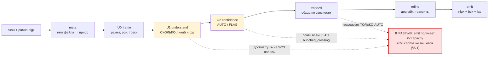
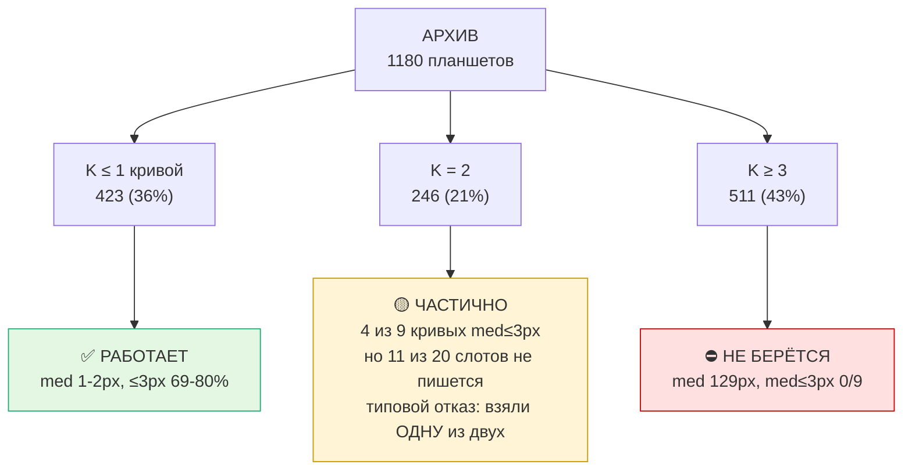
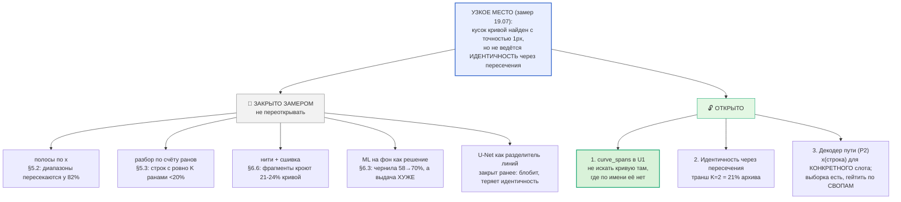
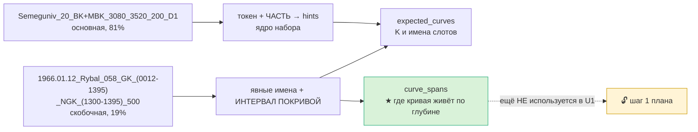

# ROADMAP — РАСПОЗНАВАНИЕ И ТОЧНОСТЬ ЛИНИЙ

Приоритет заказчика (18.07): **все силы на распознавание и точность линий**.
Дополняет `ROADMAP_v2.md` (общая архитектура). Здесь — только то, что влияет на то,
насколько верно найдены линии и насколько точно ведётся штрих. Все числа — замеренные,
не оценочные; источник каждого указан.

---

## КАРТА (mermaid; рендерится в Obsidian и на GitHub)

### Конвейер и ГДЕ ИМЕННО он рвётся на мульти-листах

### Состояние по классам планшетов (1180 листов с картинкой)

### Что закрыто замером, что осталось

### Приор из имени файла (две конвенции)

---

## 0. Как устроен разбор СЕЙЧАС (важно для планирования)

**Обучения в продакшне НЕТ.** Пакет `auto/` — чистая геометрия (numpy/cv2). Единственный
ML-хук `auto/prob.py` (`config.prob_provider`) выключен по умолчанию и включается только
флагом `--prob`. Всё, что даёт текущее качество, — правила и измеримая доменная логика.

Конвейер: `imaging` (маска чернил) → `frame` U0 (рамка/оси) → `understand` U1 (сколько линий,
их полосы/поведение) → `confidence` U2 (AUTO/FLAG) → `trace2d` (2D-обход по связности ранов)
→ `refine` (доводка/деспайк/транзиты) → `emit` (nlgx+bck+las).

ML, доказанный но НЕ в проде:
- U-Net как **разделитель линий — ЗАКРЫТО** (блобит, теряет идентичность) — `prob.py` docstring.
- U-Net как **high-recall гейт переднего плана — РАБОТАЕТ**: выцветший GZ recall 21→84%.
- MK-разделитель (трек 2) — ансамбль v7+v4+v5+TTA, живёт своим циклом в `digitizer/rnd/`.

---

## 1. Где мы сейчас — по типам планшетов

| класс | распознавание линий | точность штриха | состояние |
|---|---|---|---|
| **MBK, один зонд** (Yatskivska, Pn_Zavoda) | ✅ решено | **med 1.0-2.0px, ≤3px 69-80%** | рабочее |
| **MK** (MGZ/MPZ наложенные) | ✅ ансамбль+hole-fill | ~58% eff≤3, следование 1.6-1.9px | у потолка UNet |
| **BKZ D1** (GZ21/GZ31) | ✅ странды 100%, med 1.0px | группы 55-76% чисто | прорыв 18.07 |
| **BKZ D2** (GZ41/OGZ1) | ✅ странды на GT 0.89-1.0 | паррование 0 рёбер | ⛔ открыто |
| **мульти-лист** («BK, IK», «BKZ, DS», …) | ⛔ 76% слотов НЕ пишется | у записанных med 129px | ⛔ см. §5 |
| **перевыносы ×5/×25 (все классы)** | — | value-corr 0.47 vs эксперт 0.89 | ⛔ потолок |

---

## 2. Что уже сделано и ЗАКРЫТО (не переоткрывать)

**Распознавание:**
- `understand._single_curve_rescue` — свипующее перо не даёт столбцовой полосы, band-детект
  видел огрызок 11м из 300м. Фикс: одна ожидаемая кривая + линия <30% высоты → полно-полосная.
  **cov 0.10 → 0.71.** Гард: нерасщеплённый токен «MBK, MDS, MK» = мульти-лист, не трогать.
- BKZ M1 `link_strands` — детект нитей покрывает GT 100%, медиана 1.0px. Детекция НЕ узкое место.

**Точность штриха:**
- `Line.x_hard_lo/hi` — `refine_trace` при «недотяге до упора» расширяла полосу ДО ТРЕКА и
  затаскивала трассу на вертикаль рамки. **Упор 4.2% → 0.7%** (эксперт 0.4%), p90 108→69px.
- `Line.prefer_body` — точка в ране = ЦЕНТР, не вершина. Замер разметки эксперта: медиана
  позиции внутри рана rel=0.50, «вершинных» лишь 13%. **≤3px 53→62%.**
- `refine.drop_transits` — транзит (односторонний ход ≥150px за ≤8 строк) = перо едет, а не
  измеряет; эксперт там ведёт хорду. **Шипы 85→33 эпизода, ≤3px 60→69%.**

**Тупики (durable, НЕ повторять):**
- Hampel-деспайк на качающейся кривой бессилен (порог k·MAD огромен); abs-медианный фильтр
  ХУЖЕ базы (шипов 119 против 85).
- Интерполяция дыр после дропа транзитов: ≤3px 63→51%.
- Свип-интегратор уровней: на чистой трассе corr 0.459, но архив-wide 0.397 < DP 0.418;
  гейт по x1_cov ОПРОВЕРГНУТ (кривые с x1>0.90 — лучшие у DP, а не худшие).
- BKZ: «все оси листа как кандидаты паррования» — ложные пары, 5→4 чистых.
- Все спец-комбинирования трека 2 (арбитраж/512-контекст/эмбеддинг/pos-регрессия): сигнал
  «чей метод прав» плейт-зависим ⇒ безопасно только непересекающееся дополнение.

---

## 3. Что даст РОСТ ТОЧНОСТИ — приоритеты

### P0 — дешёвое и доказуемое

1. **BKZ D2: искать двойника в ПРЕДСКАЗАННОЙ позиции, а не перебором пар.**
   Все шкалы делят один x-диапазон и линейны ⇒ ×5-двойник точки x лежит при
   `x' = x_left + (x - x_left)/5` (для базы с v_left=0). Перебор пар не находит его, т.к.
   двойник короткий и не входит в топ-N по длине. Целевой поиск снимает это ограничение.
   *Ожидание: закрывает 0-рёбер на 3474_D2/3866_D2.*

2. **Мульти-кривые листы («MBK, MDS, MK»).** Самый большой невзятый объём.
   ✅ Токен имени расщеплён по запятой (085f9d2) — expected_curves больше не одна строка.
   ⛔ «вести каждую кривую своей полосой» — **ОПРОВЕРГНУТО замером, см. §5**.

3. **Чистка архива по `qc_nlgx_las.csv`.** 308/1114 кривых (28%) расходятся с LAS, из них
   46 — ошибка уровня кратно ×5. Любая метрика и любое обучение на них отравлены.

### P1 — среднее

4. **Дотяжка настоящих пиков** (те 13%). Локальный экстремум трассы НЕ сработал (≤3px 60% =
   как чистый центр). Нужен другой признак: пик = ран, где штрих ЗАВЕРШАЕТСЯ (шапка), а не
   пересекает трек. Кандидат — скелет/связность вверх-вниз от рана.

5. **Хорды через разрывы.** 43% точек эксперта лежат ВНЕ туши (пунктир/выцветшее). Простая
   линейная интерполяция отвергнута; нужна интерполяция ПО ФОРМЕ соседних сегментов.

6. **Включить recall-модель как гейт** (`--prob`). Доказано: выцветший GZ recall 21→84%.
   Это прямо повышает распознавание бледных линий, не трогая идентичность.

### P2 — крупные ставки

7. **BKZ: эмиссия групп в nlgx** — довести валидированный групповой подход до сдачи.
8. **MK: принципиально иная постановка** (per-curve регрессия 2 x-координат / temporal-декодер
   пути пера). Текущий UNet+ансамбль у потолка.
9. **Перевыносы ×5/×25** — без внешнего scale-сигнала потолок доказан (image 42% слеп, соседняя
   кривая не делит ×5/×25, шапка даёт только лестницу). Требует нового источника информации.

---

## 4. Как мерить (иначе легко обмануться)

- **Метрика точности линии = px vs экспертная трасса** (med, ≤3px, ≤10px), НЕ level-acc.
  Замерено: level-acc почти не коррелирует с value-фиделити (0.538→0.595 дало corr +0.03).
- **Смотреть ВЕСЬ планшет, а не кропы.** QC №2: метрики росли, глазом разницы нет — видимый
  дефект (шипы через трек) виден только на обзоре всей кривой.
- **Широкий гейт обязателен.** BKZ: вывод по 1 планшету («метод работает») опровергнут на 10
  (5 чистых / 3 нет). Урок трека 2 подтверждён ещё раз.
- **Ловушка гейта:** если emit не смапил трассу, в `_auto.nlgx` остаётся ЭКСПЕРТНАЯ трасса и
  гейт показывает идеальные 0.0px. Всегда проверять `auto.xs != gt.xs`.
- **Разделять метрику по уровням:** на строках ×1 med 1.0px/80% ≤3px, на перевыносах p90 189px.
  Смешанная метрика прячет и то, и другое.

---

## 5. МУЛЬТИ-КРИВЫЕ ЛИСТЫ (P0-2): замеры 18.07 и что из них следует

Инструменты (воспроизводимо): `digitizer/rnd/_multi_gate.py` (гейт пайплайна vs экспертная
трасса, покривой), `_multi_crossings.py` (класс листа по GT), `_multi_ink_audit.py` (что лишнего
в чернилах), `_multi_rank_probe.py` (потолок разбора по счёту).

### 5.1 Базовая линия — не «неточно», а НИЧЕГО НЕ ПИШЕТСЯ
`_multi_gate.py` на **12 листах 12 РАЗНЫХ скважин** (BK,IK / GK,NGK / BKZ,DS / BK+IK):

| | |
|---|---|
| слотов кривых всего | 37 |
| **не записано вообще** (в nlgx осталась экспертная трасса) | **28 (76%)** |
| записано и измерено | 9 → med 129px, ≤3px 19%, med≤3px у 0/9 |

**Цепочка отказа (найдена, не гипотеза):** U1 дробит одноцветную тушь на 5-23 полосы →
U2 видит перекрытие x-полос одного цвета и ставит FLAG `bunched_crossing` почти всем →
`trace2d.trace_auto` трассирует **только AUTO** → emit получает 0-1 трассу на лист.
Пример BEZLUD_051 «BK, IK»: 23 линии, AUTO=1 (это вертикаль рамки x=326), written=['BK1'],
med 916px. То есть единственная записанная кривая — заведомый мусор.

### 5.2 Полосы по мнемоникам — ОПРОВЕРГНУТО (не открывать заново)
На 726 листах архива (2..6 кривых, с картинкой), по ЭКСПЕРТНЫМ трассам:
- **x-диапазоны кривых пересекаются у 82%** (band-раздельны лишь 111 = 15%).
  ⇒ «одна мнемоника = одна полоса» неприменимо как общий подход.
- По честному признаку (меняют ли кривые порядок слева-направо) листы делятся:
  **ordered 321 (44%)** — порядок стабилен, разбор ПО СЧЁТУ законен (канон §6.6.11);
  **crossing 405 (56%)** — реальные пересечения, нужен разделитель.
  По токенам: MK 0/64 ordered (все пересекаются — это и есть трек 2), BKZ 71/188,
  «BKZ, DS» 29/37, STK+DS 8/8, «GK, NGK» 8/24.

### 5.3 Разбор по счёту (k-й ран = k-я кривая) — на сырых чернилах НЕ РАБОТАЕТ
`_multi_rank_probe.py` на 12 ordered-листах: доля строк, где ранов ровно K, = **0.00-0.64
(медиана <0.2)**, med ошибки 8-777px, кривых med≤3px **0/7**.
Причина найдена `_multi_ink_audit.py` — **в треке НАМНОГО больше туши, чем оцифровано**:
- BOGAT_011 «BKZ, DS»: K=4, а ранов на строку **медиана 13**; лишняя тушь размазана по всей
  ширине трека (перевыносы ×5, неоцифрованные зонды, штриховка).
- KREMEN_057 «GK, NGK»: **57% точек эксперта не имеют чернил в ±6px** (пунктир/выцветание
  или расхождение калибровки) — там счёт ранов не поможет в принципе.

### 5.4 Что это значит для плана
Узкое место мульти-листа — **НЕ «как поделить полосы», а «какая тушь вообще принадлежит
оцифрованной кривой»** (селекция), плюс FLAG-гейт, который сейчас глушит выдачу целиком.
Развилка для заказчика (нужен выбор, а не догадка):
- **(а) Сузить объём** до измеримо берущегося подкласса (ordered + мало лишней туши) и довести
  его до сдачи; остальное честно оставить эксперту.
- **(б) Селекция туши** по приорам рамки: у каждого слота есть СВОЯ scale-axis (x_left/x_right,
  масштаб) — сейчас U1 её игнорирует и знает только трек. Дешёвая проверка до вложений.
- **(в) Разделитель** (ML) для crossing-класса — ранее закрыт как разделитель линий; открывать
  только с явным решением.

---

## 6. ML НА ФОН + СЕЛЕКЦИЯ ТУШИ: замеры 19.07

Заказчик выбрал «ML на фон + попробовать селекцию туши». Модель: `unet_recall.pt`
(`E:\Carrotagki_auto\output\unet_v3\`, val_recall 0.51 / prec 0.22), инференс — venv ComfyUI
(RTX 5080, ~17 с на планшет). Выгонка карт: `digitizer/rnd/_prob_batch.py` (embeddable-python
ComfyUI НЕ добавляет cwd в sys.path, поэтому `python -m auto.prob` там не заводится).

### 6.1 НАЙДЕН БАГ: `--prob` НЕ ДОХОДИЛ ДО РАЗБОРА ЛИНИЙ
`imaging.ink_foreground` подмешивает модель ОБЪЕДИНЕНИЕМ, но `understand._lines_for_track`
строит каналы ПРАВИЛАМИ и лишь ПЕРЕСЕКАЕТ их с fg_full:
`chans[c] = color_mask & sub & (fg_full>0)`, `dark = dark_mask & sub & (fg_full>0)`.
Пиксели, добавленные моделью, по определению не входят ни в `dark_mask`, ни в цветовые маски —
и выбрасывались обратно. **Замер: гейт с `--prob` дал цифры БИТ-В-БИТ как без него.**
Фикс: «ничейный» передний план отдаётся чёрному каналу (без prob-карты множество пусто, путь
правил не меняется).

### 6.2 ML НА ФОН РАБОТАЕТ — на уровне ЧЕРНИЛ (`_multi_fg_gate.py`, 12 листов 12 скважин)
Метрика — доля точек экспертной трассы, под которыми есть чернила (то, что нужно трассировке):

| | правила | правила+ML |
|---|---|---|
| GT-покрытие, среднее | **58%** | **70%** |
| ранов на строку (цена: мусор) | 5.5 | 5.5 |

Выигрыш там, где правила рушатся полностью: KREMEN_083 3→49%, KREMEN_089 5→39%,
LEVEN_024 8→61%, NARIZHN_002 43→54%. Плата за это — НУЛЕВАЯ (ранов на строку не выросло).
Это ровно те листы, где U1 давал 0-1 линию.

### 6.3 …но НА ВЫДАЧУ пайплайна это НЕ переносится (честный минус)
Тот же гейт `_multi_gate.py` с картами (12 листов): слотов не записано 28→**27**, а точность
у записанных **УХУДШИЛАСЬ**: med 129→**353px**, ≤3px 19→13%. Stanulska_002 вообще потеряла
единственную выдачу (`written=['BK1']`→`[]`), KREMEN_083 записал BK1 с med 2045px.
**Вывод: recall переднего плана — НЕ узкое место.** Больше туши без селекции = больше ложных
полос → тот же FLAG-гейт → выдача не лучше, а хуже. Порядок работ: сначала селекция/маппинг,
ML на фон включать ПОСЛЕ них (карты уже посчитаны, включение = один флаг).

### 6.4 Селекция туши: чем «лишняя» тушь оказалась НЕ
- **НЕ перевыносами ×5.** Позиция двойника считается рамкой аналитически (у каждой scale-axis
  свои x_left/x_right/v_left/v_right). `_multi_replica_probe.py`: перевыносы объясняют лишь
  **1-2%** ранов. Своя рамка объясняет 25-28%, **не объяснено 71-75%**.
- **Это кривые ДРУГИХ файлов того же планшета.** Найдено 19.07: один физический бланк цифруется
  НЕСКОЛЬКИМИ nlgx, каждый берёт свой набор: `BOGAT_011_BKZ, DS_2360-2628_…` → GZ41,GZ51,CALI1,SP1
  и `BOGAT_011_BKZ_2360-2628_…` (тот же интервал, та же дата!) → GZ11,GZ21,GZ31,OGZ1.
  Сканы при этом РАЗНЫЕ (md5 разный, высота 20361 vs 20018) — попиксельно не сопоставить,
  но структурный факт подтверждён именами и составом кривых.
- Плюс одна и та же пиковая кривая пересекает строку по 2-3 раза — «13 ранов на строку при K=4»
  не требует никакой мистической туши.

⇒ **Задача селекции переформулируется** (это главный вывод дня): не «отличить кривую от мусора»
(они выглядят ОДИНАКОВО — проверено глазом на BOGAT_011: 4 оцифрованных и ~3 неоцифрованных
кривых одного пера), а **сопоставить K слотов рамки с K из N физических кривых**. Признак
«локально по чернилам» тут бессилен; работать должны приоры слота (класс/цвет/порядок/шкала).

⚠ **ЛОВУШКА ИЗМЕРЕНИЙ (durable):** экспертная трасса в nlgx — это **ВЕРШИНЫ ПОЛИЛИНИИ, а не
отсчёт на строку** (замер: 4-14% строк, медианный шаг 6-23 строки). Любое сравнение «ран vs GT»
по строкам обязано сначала интерполировать (`_multi_replica_probe.dense`), иначе метрика врёт
в разы: до интерполяции «GT объясняет 1% ранов», после — 25-28%.

### 6.6 НИТИ (третий заход на распознавание) — ТОЖЕ НЕ БЕРУТ, но нашлось главное число
`_multi_strand_probe.py` — вести кривые НИТЯМИ по связности ранов (как BKZ M1, где детект нитей
покрывал GT на 100% при med 1.0px). На мульти-листах (оракул выбирает лучшую нить на кривую):
**med(med) 280px, кривых med≤3px 2/12, покрытие 0.10.**

НО внутри этого — важный факт: **где нить попадает на кривую, точность 1px** (Yatskivska IK
med 1px / ≤3px 98%, Stanulska BK med 1px / 93%). Диагностика на Stanulska (min_len=4, 408
фрагментов): фрагменты, идущие ПО кривой эксперта, покрывают лишь **21-24% её точек**.
Сшивка фрагментов по непрерывности (экстраполяция наклона, `chain_fragments`) результат
**не сдвинула вообще** (вывод бит-в-бит совпал с прогоном без сшивки).

⇒ Геометрия штриха НЕ является узким местом: там, где кусок кривой найден, он найден точно.
Узкое место — **ведение идентичности через пересечения и плотную тушь**: линкер на каждом
взмахе цепляется за соседний ран. Это ровно та способность, которой не хватало треку 2.

**ТРИ СЕМЕЙСТВА ГЕОМЕТРИИ ЗАКРЫТЫ ЗАМЕРОМ (durable, не переоткрывать):**
полосы по x (§5.2) · разбор по счёту ранов (§5.3) · нити + сшивка (§6.6).

### 6.7 СКОЛЬКО КРИВЫХ РЕАЛЬНО ЦИФРУЮТ (объём для сужения области, направление «а»)
По 1180 планшетам архива с картинкой — число кривых В ФАЙЛЕ (не на бланке):

| K кривых | листов | доля | |
|---|---|---|---|
| ≤1 | 423 | **36%** | одиночный путь — УЖЕ РАБОТАЕТ (med 1-2px) |
| 2 | 246 | **21%** | ближайший разумный транш |
| ≥3 | 511 | 43% | требует ведения идентичности |

То есть «мульти» — не монолит: пятая часть архива это ДВЕ кривые, и это следующий по
дешевизне шаг, а не общая задача с 8 кривыми.

### 6.9 ТРАНШ K=2: ГЕЙТ (`_k2_gate.py`, 10 листов 10 скважин, 10-21 Мпикс)
Отбор по СОДЕРЖИМОМУ рамки (ровно 2 оцифрованные кривые), не по токену имени.

| | |
|---|---|
| кривых med≤3px | 4 из 9 измеренных — ⚠ **ЦИФРА ЗАВЫШЕНА, см. ниже** |
| **честно взято (med≤3px И cov≥0.9)** | **2 из 9**: RYBAL_135 GK1 (med 1.0, cov 0.98), Yatskivska IK1 (med 1.0, cov 1.00) |
| med(med) по измеренным | 37px |
| слотов НЕ записано | **11 из 20** |

**Типовой отказ K=2 — не точность, а «взяли ОДНУ кривую из двух».** Это качественно лучше
общего мульти-случая (§5.1: там не писалось 76% слотов и med≤3px не было вообще).

⚠⚠ **САМООПРОВЕРЖЕНИЕ (19.07, durable): «4 из 9» БЫЛО ЗАВЫШЕНО.** `med` считается ТОЛЬКО по
пересечению наших строк с экспертными, поэтому у RYBAL_137 IKA1 (cov 0.25) и RYBAL_058 GK1
(cov 0.53) отличный med означал лишь «та четверть, что взята, взята точно». Честных, т.е.
med≤3px И cov≥0.9, было **2 из 9**. Гейты `_k2_gate.py` и `_multi_gate.py` теперь печатают
СВЯЗАННУЮ метрику «ВЗЯТО ЧЕСТНО» и явно помечают голый счёт med≤3px как негодный.
**Правило: med без cov не цитировать — ни в отчёте, ни в роадмапе.**

**СОСТОЯНИЕ ПОСЛЕ ФИКСОВ `_slot_track` и окна анализа (тот же гейт, 10 листов 10 скважин):**

| | до фиксов | после |
|---|---|---|
| med(med) | 37.2px | **19.4px** |
| ≤3px средн | 37% | **41%** |
| слотов не записано (leak) | 11 из 20 | **10 из 20** |
| **ВЗЯТО ЧЕСТНО (med≤3px И cov≥0.9)** | 2 из 9 | **2 из 10** |

Точность и охват выросли, но **честно взятых кривых по-прежнему 2** — транш НЕ решён.
Голый счёт med≤3px дал бы «5 из 10» и создал бы ложное впечатление прогресса.
Среднее покрытие 0.62: типичная кривая берётся на две трети, а не целиком.

⚠ **Проба «сначала мелкие сканы» НЕПРЕДСТАВИТЕЛЬНА** (durable): сортировка по размеру вытащила
одну нетипичную скважину (RYBAL, сканы 2-7 Мпикс) — гейт должен фильтровать И по размеру
(`--min-mpx`), иначе «широкая проба по скважинам» вырождается.

**Две разобранные причины (диагностика двух листов):**
1. **Ведение идентичности внутри листа.** Yatskivska BK+IK: слоты назначены ПРАВИЛЬНО
   (BK1 x≈376 ↔ GT med 378, IK1 x≈818 ↔ GT 814), обе кривые оттрассированы, но у BK1
   ≤3px 30% и **>100px у 63% точек**, у IK1 — 66%/33%. Перевыносы НИ ПРИ ЧЁМ (в семействе
   1 уровень). Трасса просто перескакивает на соседнюю кривую (расстояние BK↔IK ≈440px,
   типичная ошибка 340px). Это то же узкое место, что в §6.6.
2. **Вторая кривая физически короче.** RYBAL_058: `GK_(0012-1395)_NGK_(1300-1395)` — NGK
   размечена лишь на 7% интервала листа, и фильтры минимальной высоты её законно отбрасывают.
   Это не баг, это данные: «K=2 в файле» ≠ «две кривые на всю глубину».

### 6.10 ⚠ 19% ИМЁН АРХИВА НЕ РАЗБИРАЮТСЯ ВООБЩЕ
Замер: **227 из 1180** планшетов с картинкой дают `top_depth=None` или пустой токен.
Почти всё это скважины RYBAL с ДРУГОЙ конвенцией:
`1966.01.12_Rybal_058_GK_(0012-1395)_NGK_(1300-1395)_500.nlgx` — дата первой, кривые с
интервалами в скобках, масштаб в конце. Парсер берёт из такого имени НИЧЕГО: well='1966.01.12',
token='', глубины/масштаб/часть пустые ⇒ приор пуст, rescue не работает, диагностика врёт.
Топ: RYBAL_045 24, RYBAL_135 23, RYBAL_168 23, RYBAL_017 22, RYBAL_149 17, RYBAL_179 16.
**✅ СДЕЛАНО:** вторая ветка разбора (`meta._parse_paren_convention`, включается только когда
основной `_depth_marker` не сработал). Из имени берутся скважина, общий интервал, масштаб,
кривые — и главное, **интервал У КАЖДОЙ КРИВОЙ** (`FileMeta.curve_spans`), чего в основной
конвенции нет вовсе.

Хвост после интервала — ЯВНЫЕ имена кривых, но их надо гнать через словарь: в именах пишут
`PS`, а слот в nlgx называется `SP` (37 файлов); `KB` (кавернометрия) — это слот `DS` (35 файлов,
добавлено в hints). Гейт состава против nlgx на 173 файлах:

| | сырые имена | через словарь |
|---|---|---|
| состав совпал ТОЧНО | 47% | **63%** |
| реальные ⊆ приора | 6% | 8% |

Остаток — СПУТНИКИ, которых имя не упоминает: SP 21 файл, DS 13, IKA/IKR 7 (имя пишет `IK`).
Это та же картина «ядро + спутники» (§6.5): имя даёт ядро, спутники приходится узнавать по листу.

### 6.11 ПОПЫТКА №1 задействовать `curve_spans` — ИНЕРТНА, откачена (важно: почему)
Гипотеза была: короткую кривую (NGK на 7% интервала) убивает annot-фильтр U1
(`annot_max_h_frac=0.15` при покрытии ≥0.9 = «подпись, не кривая»), значит порог надо опустить
до доли самой короткой ОЖИДАЕМОЙ кривой. Реализовано, прогнан тот же гейт K=2 —
**метрики совпали ПОЛНОСТЬЮ** (med(med) 37.2px, 4/9 med≤3px, leak 11; изменилась только
колонка токена, т.е. парсер имён работает и ничего не сломал). Код откачен: непроверенное
замером в продакшн не идёт.

**Почему гипотеза неверна — диагностика RYBAL_058** (`GK_(0012-1395)_NGK_(1300-1395)`):
| | |
|---|---|
| трек из U0 | x 190..**501** |
| GK1 | строки 845-11871, x 218..453 — внутри трека, чернил под трассой 62% |
| NGK1 | строки 11138-11894 (7%), x 213..**608** — **ВЫХОДИТ ЗА ПРАВУЮ ГРАНИЦУ ТРЕКА**, чернил под трассой 43% |

NGK не отфильтровывается — она **не детектируется**, потому что треть её размаха лежит вне
трека, а под самой трассой чернил меньше половины. То есть причина не в U1, а раньше — в
границах трека (U0) и в качестве самой туши. Следующая проверка должна быть про x-границы
треков, а не про пороги высоты.

### 6.11 ГРАНИЦЫ ТРЕКА — НЕ ПРИЧИНА (опровергнуто контрольным замером)
Гипотеза была: NGK1 не детектируется, потому что трек U0 обрезает её (треть размаха вне трека).
**Контрольный замер: подмена `x_right` на 560 / 640 / 700 и повторный `understand()` даёт
БИТ-В-БИТ тот же разбор** (1 линия, black, xc=247, cov 0.06). Расширение границ NGK1 не
воскрешает ⇒ границы не причина. Это ТРЕТИЙ опровергнутый кандидат подряд после annot-фильтра
и приора глубины (§6.10).

Что при этом установлено про сами границы (полезно и без фикса):
- При `--frame` границы трека берутся **ИЗ nlgx**, не с картинки: `frame_from_nlgx` сливает
  x-спаны `scale_axes` (frame.py:368-379), `Track(a,b)` строится БЕЗ отступов. Сужений на этом
  пути ровно одно и на 1px (полуоткрытый срез `understand.py:417`). Отступы `+3/−12` (rescue) и
  `pad=15` (лента) на архивных листах не срабатывают — отсечены гейтами, проверено.
- ⚠ **Сущности «трек» в формате nlgx НЕТ.** `x_left/x_right` у Scale Axis — это КАЛИБРОВОЧНЫЙ
  ПРОЛЁТ (две вертикали с известными v_left/v_right), а не граница области рисования. Мы
  подставляем «где эксперт откалибровал шкалу» вместо «где нарисована кривая». Обычно совпадает
  (медиана вылета по архиву **0.0%**, p90 2.9%, вылет >10% ширины лишь у **2.1%** кривых), но
  формат этого не гарантирует, и хвост реален: >40% ширины у 0.3% кривых.
- На RYBAL_058 оси GK и NGK **побайтово одинаковы** (обе x[190..501]) — перевынос NGK задан
  в пространстве ЗНАЧЕНИЙ (SA2 v[1.0..1.4] → SCCH1 v[0.95..2.55]) при неизменном x-окне.
  Гипотеза «ось NGK шире» неверна.

### 6.12 ДВА НЕЗАВИСИМЫХ ДЕФЕКТА, найденных попутно (оба подтверждены чтением кода)
1. **`emit._slot_track` — коллизия ключа.** `key = curve["name"].split()[-1]` даёт «SA1» и для
   `GZ11 DA1 SA1`, и для `IKA1 DA2 SA1` ⇒ `median(x_left)` усредняется по осям РАЗНЫХ колонок и
   слот уезжает в чужой трек. Правильный ключ — полный суффикс `«DA1 SA1»`, он уже используется
   в `decode_levels.build_family`. Замер влияния — `_slot_track_audit.py`.
2. **`extract_nlgx` — потеря Depth Axis.** `model["depth_axis"] = {...}` присваивается в цикле по
   IFD, поэтому на листах с DA1+DA2 выживает только ПОСЛЕДНЯЯ.
   Замер: **100 листов из 1180 несут >1 оси, и у 99 из них оси РАСХОДЯТСЯ**. Величина расхождения
   по y: медиана 12px (безобидно), но **>100px у 33 листов**, а верхняя глубина расходится
   **>1 м у 24 листов (максимум 1800 м)** — там берётся принципиально чужая система координат.
   СДЕЛАНО: `model["depth_axes"]` копит ВСЕ оси (аддитивно, поведение не менялось).
   ⛔ НЕ СДЕЛАНО и требует гейта: КАКУЮ ось выбирать. Правильно — ПОКРИВОЙ (имя кривой несёт
   семейство: `GZ11 DA1 SA1` → DA1), но у Frame сейчас один top_y/bottom_y на весь лист, т.е.
   нужен трек-специфичный Frame. Смена выбора молча сдвинет координаты 99 листов.

**РЕЗУЛЬТАТ ФИКСА [1] (гейт до/после, 5 многотрековых листов 5 скважин):**

| | без фикса | с фиксом |
|---|---|---|
| med(med) | 60.5px | **12.0px** |
| кривых med≤3px | 1 из 6 | **3 из 7** |
| ≤3px в среднем | 24% | **43%** |
| слотов не записано (leak) | 5 | **4** |

Крупные сдвиги: Pn_Zavoda BK1 **630px → 1.0px** (94% ≤3px) — слот раньше уезжал в чужой трек;
RYBAL_137 стал писать ОБЕ кривые (IKA1 med 1.0 + IKR1 med 1.0/80%) вместо одной.
⚠ Честно: не монотонно — на YULIIV_007 записался другой слот и стало хуже (CAL21 med 7.0 →
CAL11 med 21.0). Yatskivska и RYBAL_017 не изменились.

### 6.13 ЦВЕТ В СЛОВАРЕ — НЕ ДОМЕННЫЙ ФАКТ (Эдуард, 19.07)
Заказчик уточнил: в `Мнемоніка робоча версія.docx` (источник словаря) есть только **вид
исследований, имя кривой в LAS, единицы и комментарий** — прочитано, подтверждено. **Цветов и
толщин там НЕТ**; их задаёт ЭКСПЕРТ, когда готовит рамку под векторизацию.
При этом в `mnemonics.json` цвет проставлен у 6 мнемоник (GZ green, PZ/DS/DN black, SP red,
SP2 orange) при `_source: "Мнемоніка робоча версія.docx"` — т.е. дописан нами, а не получен.

**Замер (60 листов, цвет чернил ПОД экспертной трассой, `_ink_color_by_mnem.py`):**

| мнемоника | чернила по факту | словарь |
|---|---|---|
| **SP** | **black ×17, red ×3** | red ← **расходится** |
| CALI | black ×17, red ×3 | — |
| GZ3 / OGZ | black 7/7 | — |
| BK | black ×13, red ×2 | — |

`emit._map_lines_to_slots` использовал цвет как **ЖЁСТКИЙ** фильтр («слот с цветом берёт ТОЛЬКО
линию того же цвета») ⇒ на монохромном бланке слот SP нельзя было заполнить В ПРИНЦИПЕ.
СДЕЛАНО: цвет фильтрует, **только если линия такого цвета на треке есть**; иначе решают
класс/порядок. Защита от исходного бага (чёрная PZ в красный SP-слот, STK_4020) сохранена.

⚠ **ЧЕСТНО: правка МЕТРИКУ НЕ ДВИНУЛА.** На «BKZ, DS» SP1 как не писался, так и не пишется —
там связывает ДРУГОЕ ограничение, выше по конвейеру: **7 линий из 8 = FLAG bunched_crossing,
AUTO 0-1**, а `trace2d.trace_auto` трассирует ТОЛЬКО AUTO. Больше одного слота записать
невозможно независимо от цвета. На STK+DS (где SP реально красная) поведение не изменилось.
Это правка ЛАТЕНТНОГО дефекта: она станет значимой сразу, как снимут FLAG-барьер.

### 6.14 ЗАПИСЬ kind=6 («описание кривой») — читалась НИКОГДА
`extract()` разбирал типы 1,2,4,5,7,8, а **тип 6 пропускал**. Их ровно столько же, сколько кривых.
Внутри: `35368` полное имя слота, `35370` **ЧИСТАЯ мнемоника** («GZ4» — без разбора строки),
`35380` **idx scale-оси кривой** — точная связь «кривая → её ось».
Замер: связь верна на **3074 из 3074 (100%)**, ноль расхождений. Цвета/толщины там НЕТ
(растр 8×8 нулевой у всех 968 описаний) — подтверждает §6.13.
СДЕЛАНО: `model["curve_desc"]` (чтение, данные). ⛔ НЕ подключено к `_slot_track`: проверено —
суффикс имени совпадает с именем оси у 3074/3074 кривых, т.е. индекс даёт ТОТ ЖЕ ответ и ту же
долю промахов 17.6%. Выигрыша нет, ветвление лишнее (см. комментарий в `emit._slot_track`).

### 6.15 FLAG-ГЕЙТ — НЕ УЗКОЕ МЕСТО (замер 19.07, разбор `wf_8a78897e-1ef`)
Гипотеза была: `bunched_crossing` глушит 7-8 линий из 8, `trace_auto` берёт только AUTO ⇒
emit получает 0-1 трассу. Проверено ПРЯМЫМ A/B (монкипатч, `auto/` не трогали; 8 листов
8 скважин; ловушка «эталон не перезаписан» проверена покривой):

| | только AUTO (как есть) | ВСЕ линии в AUTO |
|---|---|---|
| записано слотов | 8 из 39 | **28 из 39** |
| leak | 31 | 11 |
| med(cov) | 0.83 | 0.99 |
| **ЧЕСТНЫХ (med≤3px И cov≥0.9)** | **0** | **0** |

Объём вырос втрое — **точность не появилась ни разу**. Кросс-матч каждой новой трассы против
ВСЕХ кривых листа: **0 из 28** в пределах 10px, медиана лучшего совпадения 419.5px. Это не
«кривая попала не в тот слот», а трасса, не идущая ни за какой кривой ⇒ по ★правилу QC-2
(перескоки идентичности болезненнее px) это 20 новых ЛОЖНЫХ идентичностей вместо 20 пустых
слотов — ровно сценарий отката ансамбля v8.
**Гейт прячет не кривые и не мусор, а непригодную выдачу трассировщика.**

**РЕШАЮЩИЙ ЗАМЕР «ОРАКУЛЬНАЯ ПОЛОСА»** (`_latch_probe.py` / scratchpad `oracle_band.py`):
даём `trace2d.trace_line` полосу, взятую ИЗ ЭКСПЕРТНОЙ кривой ±20px, т.е. ИДЕАЛЬНЫЙ U1.
→ med(med) 1048.8 → **71.7px**, med(cov) 0.99, но **ЧЕСТНЫХ 3 из 24**.
Все 3 честных — узкие полосы (197/285/485px); все широкие (679-1545px) провалены.
⇒ ~93% ошибки даёт неверная полоса (вина U1: 18-20 линий на 4-8 кривых), НО потолок самого
2D-обхода при идеальном входе — 3/24. **Чинить только U1 недостаточно.**

Опровергнуто попутно: эскалация полосы band→трек (`refine.refine_trace:292-299`) как причина
«выметания трека» — заглушение дало размах 0.97-1.01 → 0.02-0.16 ширины трека, а med стал ХУЖЕ
(BOGAT_015 CALI1 814.5→1182.0). Ветка `multiwrap` в U2 мертва (n_levels_est пуст без `--ruler`).
Отдельный, ранее не выделявшийся отказ: KREMEN_089 и RYBAL_179 дают `n_lines=0` — кривые не
найдены вовсе, к FLAG отношения не имеет.

**ПРИРОДА ОСТАТОЧНОЙ ОШИБКИ** (`_latch_probe.py`, **24 кривые 5 скважин**, 710 тыс. строк, на
оракульной полосе; для каждой строки нашей трассы ищем БЛИЖАЙШУЮ из ВСЕХ экспертных кривых
листа, tol 10px):

| | доля строк |
|---|---|
| трасса на СВОЕЙ кривой | **32.6%** |
| **ЛАТЧ на ЧУЖУЮ кривую** | **32.1%** |
| **болтается МЕЖДУ кривыми** | **35.3%** |

⇒ **ошибка делится примерно натрое, доминирующего механизма НЕТ.** Это опровергает ставку на
одну правку: предложенное «убрать безусловный прыжок на соседа» в `trace2d.trace_line` (ветка
`else` не ограничена расстоянием, в отличие от `_extend_ends`, где предохранитель ЕСТЬ) бьёт
ТОЛЬКО в латч-треть. «Между кривыми» — другой механизм (маска/выбор точки в ране), и эта
правка его не тронет.

Картина по кривым РАЗНАЯ, и это подсказывает порядок: где полоса узкая — уже почти чисто
(BOGAT_015 SP1 med 1.3px, своя 95%; LEVEN_023 CALI1 med 1.6px, своя 85%); где широкая —
разваливается (LEVEN_023 GZ41 med 167px, «между» 57%; SP1 «между» 77%).
Сходится с оракульным замером: честные 3/24 — все узкополосные.

**ЧТО НЕ ДЕЛАТЬ:** не снимать `if L.confidence != "AUTO"` (замерено выше); не «сужать» гейт по
`n_runs_med` (88% bunched-линий уже имеют n_runs_med=1.0 — это открытие гейта под видом
сужения); не помечать FLAG-трассу внутри nlgx (поля качества в формате нет, правка тега имени
35470 ломает открытие в NeuraLOG); не крутить пороги ConfParams (`auto/confidence.py:22-28`).

### 6.16 ПРАВИЛЬНЫЙ РАЗРЕЗ АРХИВА — НЕ «сколько кривых», А **ШИРИНА ПОЛОСЫ**
Все замеры 19.07 сходятся в одном: успех определяется НЕ числом кривых на листе, а размахом
кривой по x. Честные на оракульной полосе — 197/285/485px; чистые в latch-замере — CALI1 1.5px,
PS1 2.2px, SP1 1.3px (все узкие); провалы — NNKM1 377px, NNKB1 410px, MCALI1 407px (все широкие,
679-1545px полосы).

Замер размаха по архиву (`_narrow_band_size.py`, экспертные трассы, p98-p2, 1174 планшета):

| порог | кривых | доля |
|---|---|---|
| ≤300px | 797 | 26% |
| ≤400px | 1345 | 44% |
| **≤500px** | **1629** | **53.5%** |
| ≤800px | 2488 | 82% |

**478 из 1174 листов (41%) — ВСЕ кривые узкие**, такой лист можно брать ЦЕЛИКОМ.
Узость размазана по всем классам, а не сидит в одном: K=1 49%, K=2 49%, K=3 60%, K=5 72%.
По мнемоникам: CALI 83% узких, GZ1 78%, SP 67% — против GK 30%, NGK 30%, ZAT 31%, BK 36%.

⇒ **Транш K=2 (21%, §6.9) — неудачный разрез: он режет по числу кривых, а качество определяет
ширина полосы.** Разрез «узкополосные» даёт вдвое больший объём (53% кривых, 41% листов целиком)
и опирается на замеренную работоспособность, а не на надежду.

⚠ ЧЕСТНАЯ ОГОВОРКА: 1-2px получены на ОРАКУЛЬНОЙ полосе (идеальный U1). В проде U1 обязан сам
найти эту узкую полосу — 53% это ПОТОЛОК транша, а не готовый результат.

**ПРОВЕРКА ОГОВОРКИ В ПРОДЕ — ТРАНШ НЕ ПОДТВЕРДИЛСЯ** (7 листов 6 скважин, где ВСЕ кривые
≤500px и их ≥2; K от 2 до 5; `_multi_gate.py --files`):

| | |
|---|---|
| слотов | 20, измерено 8, **leak 12** |
| med(med) | 39.5px, med(cov) **0.60** |
| **ВЗЯТО ЧЕСТНО (med≤3px И cov≥0.9)** | **0 из 8** |

Ближе всех: RYBAL_057 PZ1 med 1.0px но cov 0.63; SP1 med 3.0 cov 0.85 — точность есть,
покрытия нет. RYBAL_168 (5 узких кривых!) — `lines=0`, U1 не нашёл НИ ОДНОЙ.
⇒ **узость полосы САМА ПО СЕБЕ транша не даёт**: оракульный успех не переносится, потому что
U1 эту узкую полосу не находит. Разрез правильный как ОПИСАНИЕ рабочей зоны трассировщика,
но как план работ он упирается в то же U1. Ставить на «узкополосные» БЕЗ починки U1 нельзя.

### 6.17 БАЗОВАЯ ЦИФРА ПО U1 — он попадает в число кривых на 13% листов
Целевая метрика для любой работы над U1 — не px, а «сколько линий нашли против того, сколько
кривых в рамке». Замер по 62 листам с готовыми `*_understanding.json` (без новых прогонов):

| | листов | доля |
|---|---|---|
| **линий РОВНО столько же, сколько кривых** | **8** | **13%** |
| ДРОБИТ (линий больше) | 32 | 52% |
| ТЕРЯЕТ (линий меньше) | 22 | 35% |
| **не нашёл НИ ОДНОЙ линии** | **11** | 18% |

Отношение линий/кривых: med 1.2, p90 **5.4**, max **16**.
Худшее дробление: LEVEN_023 «MBK, MDS» — **29 линий на 2 кривые**; BOGAT_014 «BKZ, DS» 27 на 4;
LOBACH_032 21 на 2; VILHIV_055 «DS» 16 на 1.
Худшие потери: KREMEN_089 «BKZ, SP, DS» — **0 линий на 8 кривых**; RYBAL_168 0 на 5;
KREMEN_083 0 на 4; RYBAL_017 0 на 2 (и это УЗКОПОЛОСНЫЙ лист, §6.16).

⇒ **U1 ошибается на 87% листов, причём В ОБЕ СТОРОНЫ** — это два разных отказа, и лечатся они
по-разному: дробление (52%) = фрагменты не собираются в кривую; ноль/потеря (35%) = кривая не
найдена вовсе. Смешивать их в одну задачу нельзя.

### 6.18 ⭐ QC ЭДУАРДА ПЕРЕВЕРНУЛ ДИАГНОЗ: трассы ХОРОШИЕ, но НЕ НА ТЕХ КРИВЫХ
Эдуард открыл выдачу в NeuraLOG (19.07): «BOGAT_011 — CALI слишком часто ошибается, **остальные
ОК**; BOGAT_014 — хорошо». Это ПРОТИВОРЕЧИЛО метрике, которая по тем же кривым показывала
промах 431-890px (на треке 2174px это 20-40%, глазом такое видно).

Разобрано наложением НАШЕЙ и ЭКСПЕРТНОЙ трассы на скан (`scratchpad/cmp_render.py`):
- **CALI1 и SP1:** наша трасса идёт ТОЧНО по чернилам, повторяя изгибы, но по ЛЕВОЙ кривой,
  тогда как экспертная CALI1/SP1 нарисованы на ПРАВОЙ (зубчатой). Трасса верная — кривая чужая.
- **GZ51:** сверху наша и экспертная совпадают почти идеально, ниже наша срывается на вертикаль.

**ЧИСЛО, ЗАКРЫВАЮЩЕЕ ВОПРОС:** доля точек наших трасс, лежащих на чернилах (маска без
структуры), — **99.9-100%** на всех кривых обоих листов (BOGAT_011: GZ41 100.0, GZ51 99.9,
CALI1 99.9, SP1 99.9; BOGAT_014: все 99.9-100.0).

⇒ **Трассировщик НЕ «выметает трек» и НЕ выдаёт мусор — он ведёт настоящие кривые почти
идеально.** Ошибка в 400-900px — это НЕ кривая трасса, а НЕ ТА КРИВАЯ: проблема ИДЕНТИЧНОСТИ
(какая линия в какой слот), а не качества ведения.
Это отменяет вывод §6.15 «гейт прячет непригодную выдачу»: выдача пригодна, она разложена по
слотам неверно. И объясняет кросс-матч 0/28: сравнивали с 4 кривыми ЭТОГО файла, а трассы
идут по кривым, которых в этой рамке нет (на бланке их ~7, оцифрованы 4, §6.4).

⚠ Оговорка: «на чернилах» ≠ «на кривой своего слота»; вертикальный срыв GZ51 тоже сидит на
чернилах. Признак необходимый, не достаточный.

**УТОЧНЕНИЕ (`_assign_oracle.py`, 39 кривых 6 листов) — «хорошие трассы в чужих слотах» СЛИШКОМ
ОПТИМИСТИЧНО.** Если бы дело было только в раскладке, оптимальная перестановка трасс по слотам
починила бы результат. Замер:

| | med(med) | честных |
|---|---|---|
| факт (как раскладывает emit) | 589.7px | 0/39 |
| **оптимум** (жадное 1:1 по минимуму ошибки) | **417.0px** | **0/39** |
| потолок (лучшая наша трасса на кривую, без 1:1) | 397.7px | 0/39 |

⇒ **раскладка стоит лишь ~29% ошибки (590→417px), остальные 71% — ВНУТРИ трассы.**
Верная картина: трасса идёт по кривой A, перескакивает на B, затем на C — ЛОКАЛЬНО она точно на
чернилах (99.9%, это и видит глаз), но КАК КРИВАЯ не соответствует ни одной. Формулировка
Эдуарда «странные значения и скачки» точнее, чем «трассы хорошие, но не в тех слотах».
⇒ приоритет: НЕПРЕРЫВНОСТЬ/идентичность ВНУТРИ трассы (латч-правка §6.15 бьёт сюда), а
маппинг слотов — второстепенно.

⚠ В этом же замере KREMEN_089 дал med **0.0px** — классическая ЛОВУШКА: файл содержал трассы
эксперта (мы не записали ничего). `_assign_oracle.py` проверки на утечку НЕ делает; после
очистки незаполненных слотов (см. ниже) ловушка на новых выдачах невозможна.

★ **МЕТОДИЧЕСКИЙ ВЫВОД (durable):** три раза за сессию метрика вводила в заблуждение, и все три
раза её поправил ГЛАЗ — потеря 63% кривой (§6.10), завышенная цифра «4 из 9» (§6.9) и теперь
целиком неверный диагноз. **QC заказчика — не финальная приёмка, а ИНСТРУМЕНТ ОТЛАДКИ; звать
его РАНЬШЕ, а не после того, как метрики «сойдутся».**

### 6.19 ЗАПРЕТ ПРЫЖКА НА СОСЕДА — НЕ ПРОШЁЛ, но вскрыл механику трассировщика
Гипотеза (§6.15): в `trace2d.trace_line` ветка «нет рана под предсказанием» прыгает на ближайший
ран без ограничения расстояния — отсюда «странные скачки» в QC. Правка: не прыгать дальше
`jump_limit`, а коастить по инерции и НЕ писать строку (честное «здесь не знаю»).

A/B на оракульной полосе (`scratchpad/jump_ab.py`, jump_limit=30):

| кривая | как есть | только уверенные строки |
|---|---|---|
| BOGAT_011 SP1 | med 112.8, ≤3px 31%, cov 0.99 | **med 2.4, ≤3px 62%**, cov **0.01** |
| BOGAT_015 CALI1 | med 65.5, ≤3px 12%, cov 1.00 | **med 2.3, ≤3px 59%**, cov **0.02** |
| BOGAT_015 GZ41 | med 16.3, ≤3px 34%, cov 0.99 | **med 1.1, ≤3px 78%**, cov **0.03** |
| BOGAT_011 GZ41 | med 114.5, cov 1.00 | med 651.1, cov 0.02 (ХУЖЕ) |
| BOGAT_015 GZ51 | med 5.9, ≤3px 36% | med 41.2, ≤3px 9% (ХУЖЕ) |

**Правку НЕ включать: покрытие рушится до 0-3%.** Но два факта из неё durable:
1. **Ветка «ближайший ран» — ОСНОВНАЯ рабочая, а не аварийная.** Запрет прыжка убивает трассу
   почти целиком ⇒ ран РЕДКО перекрывает предсказание: перо между строками уходит дальше, чем
   ширина рана. Значит «связность штриха» в текущем виде почти не работает.
2. **Трассировщик ЗНАЕТ, когда он прав.** Строки ветки `cont` (ран перекрыл предсказание) точны
   до 1-2px (≤3px 59-86%), а вся ошибка живёт в строках-догадках. Это готовый ПОСТРОЧНЫЙ признак
   уверенности, которого у нас не было.
⇒ Следующий шаг не «запретить прыжок», а **умное перезахватывание**: прыгать только на ран,
согласованный с направлением/шириной кривой, либо помечать строки-догадки как черновые.
⚠ Не универсально: на GZ41 (BOGAT_011) и GZ51 (BOGAT_015) уверенные строки тоже плохи.

Параметр `trace_line(jump_limit=...)` оставлен как ИНСТРУМЕНТ ЗАМЕРА, по умолчанию `None`
(прежнее поведение); в продакшн-пути не включён.

### 6.5 ПРАВИЛО ОТБОРА ВЫВЕДЕНО ИЗ АРХИВА (`_token_curveset.py`)
Раз бланк режется на несколько nlgx, проверено: **набор оцифрованных кривых предсказуем по имени
файла**. По архиву (37 токенов, n≥3): **медианная стабильность набора 86%**, но текущий
`mnemonics.json::filename_hints` совпадает лишь **10 из 37**.

Ключевое подтверждение гипотезы о братьях — БКЗ-пара делит зонды по файлам:
`BKZ` → GZ1,GZ2,GZ3,OGZ и `BKZ, DS` → **CALI,GZ4,GZ5,SP** (n=37, стабильность 92%).
Прочие крупные расхождения: `PRM`→CALI (85 файлов), `BK, IK`→BK,**IKA,IKR** (не IK),
`DS`→CALI, `DS, TM`→CALI,TMSS, `STK+DS`→DS,GZ,PZ,SP, `AKC`→AK,AP,TP, `GZK`→G_SUM, `M`→MNSS,
`ZSK`→GZ,PZ,SP, `MK, MDS`→MCALI,MGZ,MPZ.

Предложение (24 надёжных токена, стабильность ≥70%) выложено в
`F:\nds\output\p0_multicurve\filename_hints_proposal.json`. **Сам `mnemonics.json` НЕ трогали** —
это курируемый доменный словарь заказчика, замена требует его решения. 13 токенов нестабильны
(BKZ 25%, MK 52%, AK 38%, INNK 39% — число зондов/каналов плавает от файла к файлу) и тоже
требуют решения: либо переменный набор, либо отбор по картинке.

### 6.8 ML-РАЗДЕЛИТЕЛЬ (направление «в»): оценка, БЕЗ запуска обучения
Что показали замеры: не хватает не сегментации и не recall'а фона (§6.3), а **ведения
идентичности через пересечения**. Отсюда честная оценка, стоит ли открывать «в»:
- **Как ЗАДАЧА СЕГМЕНТАЦИИ — открывать не надо.** Это в точности то, на чём U-Net-разделитель
  уже закрыт (блобит, теряет идентичность), а MK-ансамбль уперся в потолок (~58% eff≤3px).
  Данные мульти-листов ХУЖЕ, чем у MK: кривых больше, и большая часть туши — чужая (§6.4).
  Повтор трека 2 на худших данных даст худший результат.
- **Что бы имело смысл — ДРУГАЯ ПОСТАНОВКА** (это P2 §8): не маска, а **декодер пути**:
  для КОНКРЕТНОГО слота рамки предсказывать x(строка), опираясь на непрерывность и приор слота.
  Тогда идентичность задана входом, а не вычитается из маски.
- **Обучающая выборка для этого УЖЕ ЕСТЬ** — экспертные трассы архива (1114 кривых), за вычетом
  28% расходящихся с LAS (`qc_nlgx_las.csv`). Это ровно тот случай, где ML оправдан: разметка
  есть, а правило неформализуемо.
- ⚠ Правило QC (трек 2, durable): **перескоки идентичности болезненнее, чем px** — любой
  разделитель обязан гейтиться по свопам, а не по dice/med.

**Рекомендация:** «в» в текущей постановке не открывать; сначала транш K=2 (21% архива, §6.7)
на существующем пайплайне, и только если он упрётся — декодер пути.

⚠ **Уточнение (чтобы не переоценить эффект):** сегодня `expected_curves` НЕ участвует в маппинге —
`emit._map_lines_to_slots` берёт слоты из САМОЙ рамки (`model["curves"]`), где имена уже точные.
Потребителей ровно три: гард `_single_curve_rescue` (len==1), диагностика U1 и печать пайплайна.
Поэтому починка `filename_hints` САМА ПО СЕБЕ выдачу не изменит — её ценность в том, что K и
имена станут верным ПРИОРОМ для мульти-ветки (сейчас на «BKZ, DS» это 8 имён вместо реальных 4)
и что диагностика перестанет врать. Отдельный вывод: приор из имени и слоты из рамки — два
независимых источника, и они РАСХОДЯТСЯ на 27 токенах из 37; сверка их между собой — сама по себе
дешёвый гейт качества рамки/имени.
